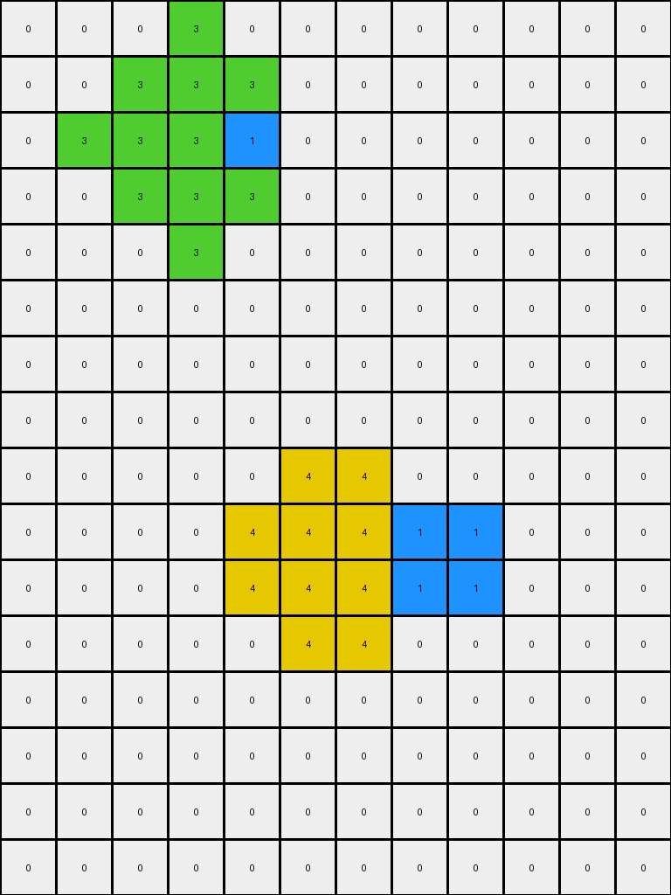
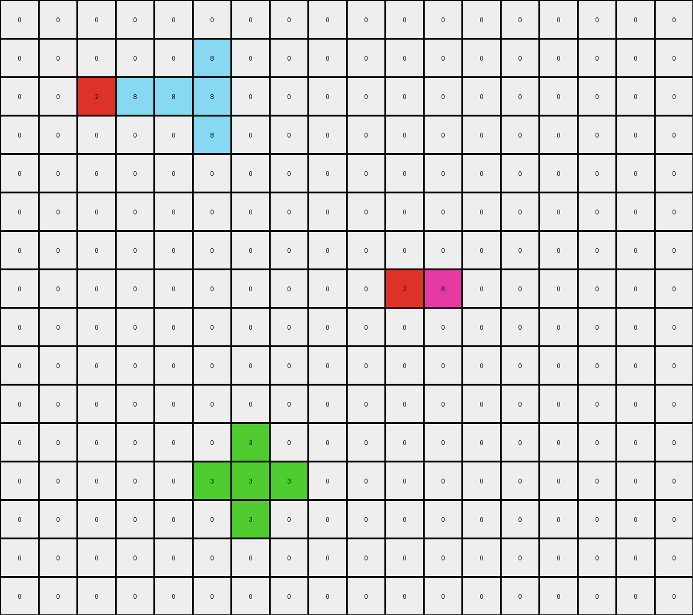
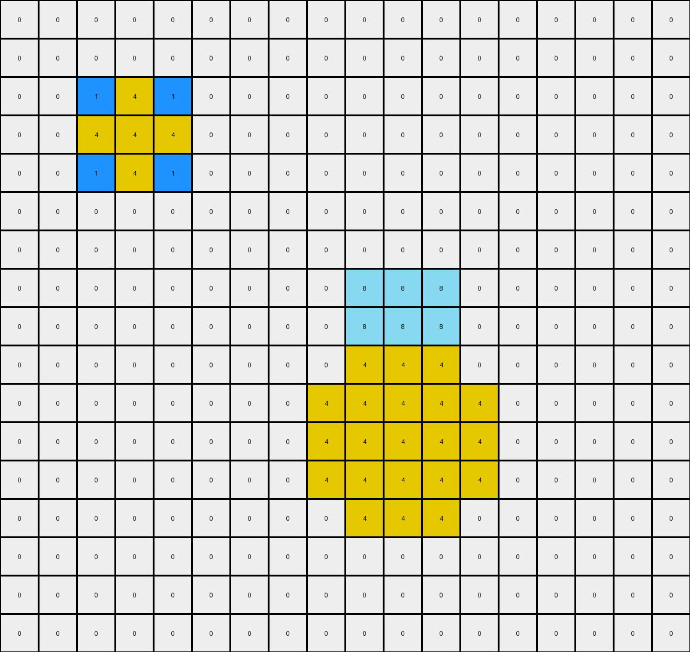
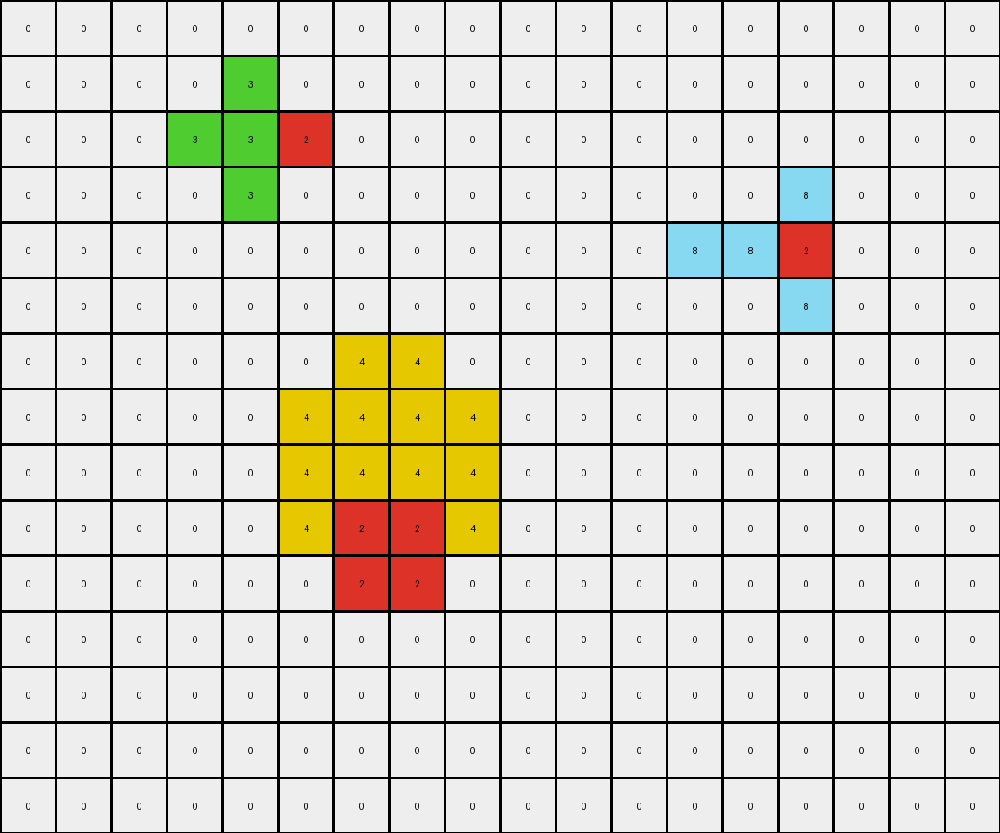

# 57aa92db • 022 • refine_coder

---

Previous Code:
```python
"""
1.  **Identify Objects:** Locate all contiguous blocks of non-white pixels in the input grid. These are our initial objects.
2.  **Green Object Expansion:** The green object expands. If it exists, increase its size by one pixel in all orthogonal directions (up, down, left, right).
3. **Yellow Object Expansion:** If exists, the yellow object will check if red squares are diagonal from it. If so, extend them to down and to the left, filling the area between them.
4.  **Preserve Other Objects:**  All other non-green, non-yellow objects (in this case, the azure and red objects) retain their original shape and position in the output grid.
5.  **Background:** All other pixels (white/0) remain unchanged.
"""

import numpy as np

def find_objects(grid):
    """Finds contiguous objects in a grid."""
    objects = []
    visited = set()
    rows, cols = grid.shape

    def dfs(r, c, obj_color, current_object):
        if (r, c) in visited or not (0 <= r < rows and 0 <= c < cols) or grid[r, c] != obj_color:
            return
        visited.add((r, c))
        current_object.append((r, c))
        for dr, dc in [(0, 1), (0, -1), (1, 0), (-1, 0)]:
            dfs(r + dr, c + dc, obj_color, current_object)

    for r in range(rows):
        for c in range(cols):
            if grid[r, c] != 0 and (r, c) not in visited:
                current_object = []
                dfs(r, c, grid[r, c], current_object)
                objects.append((grid[r, c], current_object))  # Store color and object pixels
    return objects

def expand_object(grid, object_pixels, color, diagonally=False):
  """Expands an object by one pixel in orthogonal directions."""
  new_pixels = set(object_pixels)
  rows, cols = grid.shape

  for r, c in object_pixels:
        for dr, dc in [(0, 1), (0, -1), (1, 0), (-1, 0)]:
            nr, nc = r + dr, c + dc
            if 0 <= nr < rows and 0 <= nc < cols:
                new_pixels.add((nr,nc))
  return list(new_pixels)

def get_diagonal_neighbors(grid, r, c):
    """Returns the diagonal neighbors of a cell."""
    rows, cols = grid.shape
    neighbors = []
    for dr, dc in [(-1, -1), (-1, 1), (1, -1), (1, 1)]:
        nr, nc = r + dr, c + dc
        if 0 <= nr < rows and 0 <= nc < cols:
            neighbors.append((nr, nc))
    return neighbors

def transform(input_grid):
    # initialize output_grid
    output_grid = np.zeros_like(input_grid)
    rows, cols = input_grid.shape

    # Find all objects in the input grid
    objects = find_objects(input_grid)

    for color, obj_pixels in objects:
        if color == 3:  # Green object
            # expand green
            expanded_pixels = expand_object(input_grid, obj_pixels, 3)
            for r, c in expanded_pixels:
                output_grid[r,c] = 3
        elif color == 4: # Yellow Object
            output_pixels = obj_pixels[:]

            for r, c in obj_pixels:
              # Find diagonal neighbors
              diagonals = get_diagonal_neighbors(input_grid, r, c)

              # check diagonal for red
              for nr, nc in diagonals:
                if input_grid[nr, nc] == 2: # check if red
                  output_pixels.append((nr, nc))
            
            # Expand by one pixel to the down and to the left
            expanded_pixels = expand_object(input_grid, output_pixels, 4, True)

            # Fill the area between original yellow pixels and red pixels
            min_r = min(r for r, _ in expanded_pixels)
            max_r = max(r for r, _ in expanded_pixels)
            min_c = min(c for _, c in expanded_pixels)
            max_c = max(c for _, c in expanded_pixels)

            for r in range(min_r, max_r+1):
              for c in range(min_c, max_c+1):
                if (r,c) in expanded_pixels:
                    output_grid[r,c] = 4

        else: # Other
            for r, c in obj_pixels:
                output_grid[r, c] = color

    return output_grid
```

Train Set Results:

## Example 1:

Input:
```
0 0 0 0 0 0 0 0 0 0 0 0
0 0 0 3 0 0 0 0 0 0 0 0
0 0 3 3 1 0 0 0 0 0 0 0
0 0 0 3 0 0 0 0 0 0 0 0
0 0 0 0 0 0 0 0 0 0 0 0
0 0 0 0 0 0 0 0 0 0 0 0
0 0 0 0 0 0 0 0 0 0 0 0
0 0 0 0 0 0 0 0 0 0 0 0
0 0 0 0 0 0 0 0 0 0 0 0
0 0 0 0 0 4 4 1 1 0 0 0
0 0 0 0 0 4 4 1 1 0 0 0
0 0 0 0 0 0 0 0 0 0 0 0
0 0 0 0 0 0 0 0 0 0 0 0
0 0 0 0 0 0 0 0 0 0 0 0
0 0 0 0 0 0 0 0 0 0 0 0
0 0 0 0 0 0 0 0 0 0 0 0
```
Expected Output:
```
0 0 0 0 0 0 0 0 0 0 0 0
0 0 0 3 0 0 0 0 0 0 0 0
0 0 3 3 1 0 0 0 0 0 0 0
0 0 0 3 0 0 0 0 0 0 0 0
0 0 0 0 0 0 0 0 0 0 0 0
0 0 0 0 0 0 0 0 0 0 0 0
0 0 0 0 0 0 0 0 0 0 0 0
0 0 0 0 0 4 4 0 0 0 0 0
0 0 0 0 0 4 4 0 0 0 0 0
0 0 0 4 4 4 4 1 1 0 0 0
0 0 0 4 4 4 4 1 1 0 0 0
0 0 0 0 0 4 4 0 0 0 0 0
0 0 0 0 0 4 4 0 0 0 0 0
0 0 0 0 0 0 0 0 0 0 0 0
0 0 0 0 0 0 0 0 0 0 0 0
0 0 0 0 0 0 0 0 0 0 0 0
```
Transformed Output:
```
0 0 0 3 0 0 0 0 0 0 0 0
0 0 3 3 3 0 0 0 0 0 0 0
0 3 3 3 1 0 0 0 0 0 0 0
0 0 3 3 3 0 0 0 0 0 0 0
0 0 0 3 0 0 0 0 0 0 0 0
0 0 0 0 0 0 0 0 0 0 0 0
0 0 0 0 0 0 0 0 0 0 0 0
0 0 0 0 0 0 0 0 0 0 0 0
0 0 0 0 0 4 4 0 0 0 0 0
0 0 0 0 4 4 4 1 1 0 0 0
0 0 0 0 4 4 4 1 1 0 0 0
0 0 0 0 0 4 4 0 0 0 0 0
0 0 0 0 0 0 0 0 0 0 0 0
0 0 0 0 0 0 0 0 0 0 0 0
0 0 0 0 0 0 0 0 0 0 0 0
0 0 0 0 0 0 0 0 0 0 0 0
```

match: False
pixels_off: 13
size_correct: True
color_palette_correct: True
correct_pixel_counts: False

## Example 2:

Input:
```
0 0 0 0 0 0 0 0 0 0 0 0 0 0 0 0 0 0
0 0 0 0 0 8 0 0 0 0 0 0 0 0 0 0 0 0
0 0 2 8 8 8 0 0 0 0 0 0 0 0 0 0 0 0
0 0 0 0 0 8 0 0 0 0 0 0 0 0 0 0 0 0
0 0 0 0 0 0 0 0 0 0 0 0 0 0 0 0 0 0
0 0 0 0 0 0 0 0 0 0 0 0 0 0 0 0 0 0
0 0 0 0 0 0 0 0 0 0 0 0 0 0 0 0 0 0
0 0 0 0 0 0 0 0 0 0 2 6 0 0 0 0 0 0
0 0 0 0 0 0 0 0 0 0 0 0 0 0 0 0 0 0
0 0 0 0 0 0 0 0 0 0 0 0 0 0 0 0 0 0
0 0 0 0 0 0 0 0 0 0 0 0 0 0 0 0 0 0
0 0 0 0 0 0 0 0 0 0 0 0 0 0 0 0 0 0
0 0 0 0 0 2 3 0 0 0 0 0 0 0 0 0 0 0
0 0 0 0 0 0 0 0 0 0 0 0 0 0 0 0 0 0
0 0 0 0 0 0 0 0 0 0 0 0 0 0 0 0 0 0
0 0 0 0 0 0 0 0 0 0 0 0 0 0 0 0 0 0
```
Expected Output:
```
0 0 0 0 0 0 0 0 0 0 0 0 0 0 0 0 0 0
0 0 0 0 0 8 0 0 0 0 0 0 0 0 0 0 0 0
0 0 2 8 8 8 0 0 0 0 0 0 0 0 0 0 0 0
0 0 0 0 0 8 0 0 0 0 0 0 0 0 0 0 0 0
0 0 0 0 0 0 0 0 0 0 0 0 0 0 0 0 0 0
0 0 0 0 0 0 0 0 0 0 0 0 0 0 0 0 0 0
0 0 0 0 0 0 0 0 0 0 0 0 0 6 0 0 0 0
0 0 0 0 0 0 0 0 0 0 2 6 6 6 0 0 0 0
0 0 0 0 0 0 0 0 0 0 0 0 0 6 0 0 0 0
0 0 0 0 0 0 0 0 0 0 0 0 0 0 0 0 0 0
0 0 0 0 0 0 0 0 0 0 0 0 0 0 0 0 0 0
0 0 0 0 0 0 0 0 3 0 0 0 0 0 0 0 0 0
0 0 0 0 0 2 3 3 3 0 0 0 0 0 0 0 0 0
0 0 0 0 0 0 0 0 3 0 0 0 0 0 0 0 0 0
0 0 0 0 0 0 0 0 0 0 0 0 0 0 0 0 0 0
0 0 0 0 0 0 0 0 0 0 0 0 0 0 0 0 0 0
```
Transformed Output:
```
0 0 0 0 0 0 0 0 0 0 0 0 0 0 0 0 0 0
0 0 0 0 0 8 0 0 0 0 0 0 0 0 0 0 0 0
0 0 2 8 8 8 0 0 0 0 0 0 0 0 0 0 0 0
0 0 0 0 0 8 0 0 0 0 0 0 0 0 0 0 0 0
0 0 0 0 0 0 0 0 0 0 0 0 0 0 0 0 0 0
0 0 0 0 0 0 0 0 0 0 0 0 0 0 0 0 0 0
0 0 0 0 0 0 0 0 0 0 0 0 0 0 0 0 0 0
0 0 0 0 0 0 0 0 0 0 2 6 0 0 0 0 0 0
0 0 0 0 0 0 0 0 0 0 0 0 0 0 0 0 0 0
0 0 0 0 0 0 0 0 0 0 0 0 0 0 0 0 0 0
0 0 0 0 0 0 0 0 0 0 0 0 0 0 0 0 0 0
0 0 0 0 0 0 3 0 0 0 0 0 0 0 0 0 0 0
0 0 0 0 0 3 3 3 0 0 0 0 0 0 0 0 0 0
0 0 0 0 0 0 3 0 0 0 0 0 0 0 0 0 0 0
0 0 0 0 0 0 0 0 0 0 0 0 0 0 0 0 0 0
0 0 0 0 0 0 0 0 0 0 0 0 0 0 0 0 0 0
```

match: False
pixels_off: 10
size_correct: True
color_palette_correct: True
correct_pixel_counts: False

## Example 3:

Input:
```
0 0 0 0 0 0 0 0 0 0 0 0 0 0 0 0 0 0
0 0 0 0 0 0 0 0 0 0 0 0 0 0 0 0 0 0
0 0 1 1 1 0 0 0 0 0 0 0 0 0 0 0 0 0
0 0 1 4 1 0 0 0 0 0 0 0 0 0 0 0 0 0
0 0 1 0 1 0 0 0 0 0 0 0 0 0 0 0 0 0
0 0 0 0 0 0 0 0 0 0 0 0 0 0 0 0 0 0
0 0 0 0 0 0 0 0 0 0 0 0 0 0 0 0 0 0
0 0 0 0 0 0 0 0 0 8 8 8 0 0 0 0 0 0
0 0 0 0 0 0 0 0 0 8 8 8 0 0 0 0 0 0
0 0 0 0 0 0 0 0 0 8 8 8 0 0 0 0 0 0
0 0 0 0 0 0 0 0 0 4 4 4 0 0 0 0 0 0
0 0 0 0 0 0 0 0 0 4 4 4 0 0 0 0 0 0
0 0 0 0 0 0 0 0 0 4 4 4 0 0 0 0 0 0
0 0 0 0 0 0 0 0 0 0 0 0 0 0 0 0 0 0
0 0 0 0 0 0 0 0 0 0 0 0 0 0 0 0 0 0
0 0 0 0 0 0 0 0 0 0 0 0 0 0 0 0 0 0
0 0 0 0 0 0 0 0 0 0 0 0 0 0 0 0 0 0
```
Expected Output:
```
0 0 0 0 0 0 0 0 0 0 0 0 0 0 0 0 0 0
0 0 0 0 0 0 0 0 0 0 0 0 0 0 0 0 0 0
0 0 1 1 1 0 0 0 0 0 0 0 0 0 0 0 0 0
0 0 1 4 1 0 0 0 0 0 0 0 0 0 0 0 0 0
0 0 1 0 1 0 0 0 0 0 0 0 0 0 0 0 0 0
0 0 0 0 0 0 0 0 0 0 0 0 0 0 0 0 0 0
0 0 0 0 0 0 0 0 0 0 0 0 0 0 0 0 0 0
0 0 0 0 0 0 8 8 8 8 8 8 8 8 8 0 0 0
0 0 0 0 0 0 8 8 8 8 8 8 8 8 8 0 0 0
0 0 0 0 0 0 8 8 8 8 8 8 8 8 8 0 0 0
0 0 0 0 0 0 8 8 8 4 4 4 8 8 8 0 0 0
0 0 0 0 0 0 8 8 8 4 4 4 8 8 8 0 0 0
0 0 0 0 0 0 8 8 8 4 4 4 8 8 8 0 0 0
0 0 0 0 0 0 8 8 8 0 0 0 8 8 8 0 0 0
0 0 0 0 0 0 8 8 8 0 0 0 8 8 8 0 0 0
0 0 0 0 0 0 8 8 8 0 0 0 8 8 8 0 0 0
0 0 0 0 0 0 0 0 0 0 0 0 0 0 0 0 0 0
```
Transformed Output:
```
0 0 0 0 0 0 0 0 0 0 0 0 0 0 0 0 0 0
0 0 0 0 0 0 0 0 0 0 0 0 0 0 0 0 0 0
0 0 1 4 1 0 0 0 0 0 0 0 0 0 0 0 0 0
0 0 4 4 4 0 0 0 0 0 0 0 0 0 0 0 0 0
0 0 1 4 1 0 0 0 0 0 0 0 0 0 0 0 0 0
0 0 0 0 0 0 0 0 0 0 0 0 0 0 0 0 0 0
0 0 0 0 0 0 0 0 0 0 0 0 0 0 0 0 0 0
0 0 0 0 0 0 0 0 0 8 8 8 0 0 0 0 0 0
0 0 0 0 0 0 0 0 0 8 8 8 0 0 0 0 0 0
0 0 0 0 0 0 0 0 0 4 4 4 0 0 0 0 0 0
0 0 0 0 0 0 0 0 4 4 4 4 4 0 0 0 0 0
0 0 0 0 0 0 0 0 4 4 4 4 4 0 0 0 0 0
0 0 0 0 0 0 0 0 4 4 4 4 4 0 0 0 0 0
0 0 0 0 0 0 0 0 0 4 4 4 0 0 0 0 0 0
0 0 0 0 0 0 0 0 0 0 0 0 0 0 0 0 0 0
0 0 0 0 0 0 0 0 0 0 0 0 0 0 0 0 0 0
0 0 0 0 0 0 0 0 0 0 0 0 0 0 0 0 0 0
```

match: False
pixels_off: 64
size_correct: True
color_palette_correct: True
correct_pixel_counts: False

## Example 4:

Input:
```
0 0 0 0 0 0 0 0 0 0 0 0 0 0 0 0 0 0
0 0 0 0 0 0 0 0 0 0 0 0 0 0 0 0 0 0
0 0 0 0 3 2 0 0 0 0 0 0 0 0 0 0 0 0
0 0 0 0 0 0 0 0 0 0 0 0 0 0 8 0 0 0
0 0 0 0 0 0 0 0 0 0 0 0 8 8 2 0 0 0
0 0 0 0 0 0 0 0 0 0 0 0 0 0 8 0 0 0
0 0 0 0 0 0 0 0 0 0 0 0 0 0 0 0 0 0
0 0 0 0 0 0 4 4 0 0 0 0 0 0 0 0 0 0
0 0 0 0 0 0 4 4 0 0 0 0 0 0 0 0 0 0
0 0 0 0 0 0 2 2 0 0 0 0 0 0 0 0 0 0
0 0 0 0 0 0 2 2 0 0 0 0 0 0 0 0 0 0
0 0 0 0 0 0 0 0 0 0 0 0 0 0 0 0 0 0
0 0 0 0 0 0 0 0 0 0 0 0 0 0 0 0 0 0
0 0 0 0 0 0 0 0 0 0 0 0 0 0 0 0 0 0
0 0 0 0 0 0 0 0 0 0 0 0 0 0 0 0 0 0
```
Expected Output:
```
0 0 0 0 0 0 0 0 0 0 0 0 0 0 0 0 0 0
0 0 0 0 0 3 0 0 0 0 0 0 0 0 0 0 0 0
0 0 0 3 3 2 0 0 0 0 0 0 0 0 0 0 0 0
0 0 0 0 0 3 0 0 0 0 0 0 0 0 8 0 0 0
0 0 0 0 0 0 0 0 0 0 0 0 8 8 2 0 0 0
0 0 0 0 0 0 0 0 0 0 0 0 0 0 8 0 0 0
0 0 0 0 0 0 0 0 0 0 0 0 0 0 0 0 0 0
0 0 0 0 0 0 4 4 0 0 0 0 0 0 0 0 0 0
0 0 0 0 0 0 4 4 0 0 0 0 0 0 0 0 0 0
0 0 4 4 4 4 2 2 0 0 0 0 0 0 0 0 0 0
0 0 4 4 4 4 2 2 0 0 0 0 0 0 0 0 0 0
0 0 0 0 0 0 4 4 0 0 0 0 0 0 0 0 0 0
0 0 0 0 0 0 4 4 0 0 0 0 0 0 0 0 0 0
0 0 0 0 0 0 0 0 0 0 0 0 0 0 0 0 0 0
0 0 0 0 0 0 0 0 0 0 0 0 0 0 0 0 0 0
```
Transformed Output:
```
0 0 0 0 0 0 0 0 0 0 0 0 0 0 0 0 0 0
0 0 0 0 3 0 0 0 0 0 0 0 0 0 0 0 0 0
0 0 0 3 3 2 0 0 0 0 0 0 0 0 0 0 0 0
0 0 0 0 3 0 0 0 0 0 0 0 0 0 8 0 0 0
0 0 0 0 0 0 0 0 0 0 0 0 8 8 2 0 0 0
0 0 0 0 0 0 0 0 0 0 0 0 0 0 8 0 0 0
0 0 0 0 0 0 4 4 0 0 0 0 0 0 0 0 0 0
0 0 0 0 0 4 4 4 4 0 0 0 0 0 0 0 0 0
0 0 0 0 0 4 4 4 4 0 0 0 0 0 0 0 0 0
0 0 0 0 0 4 2 2 4 0 0 0 0 0 0 0 0 0
0 0 0 0 0 0 2 2 0 0 0 0 0 0 0 0 0 0
0 0 0 0 0 0 0 0 0 0 0 0 0 0 0 0 0 0
0 0 0 0 0 0 0 0 0 0 0 0 0 0 0 0 0 0
0 0 0 0 0 0 0 0 0 0 0 0 0 0 0 0 0 0
0 0 0 0 0 0 0 0 0 0 0 0 0 0 0 0 0 0
```

match: False
pixels_off: 22
size_correct: True
color_palette_correct: True
correct_pixel_counts: False
Okay, let's analyze the results and refine the natural language program and approach.

**General Assessment:**

The initial program and code captured some aspects of the transformation but failed to generalize correctly across all examples. The primary issues seem to be:

1.  **Incorrect Green Expansion:** The green object expansion is too simple. It expands in all directions regardless of other objects.
2.  **Incorrect Yellow Interaction:** The yellow object's interaction with red is not correctly implemented. The description assumed a diagonal fill, but the actual behavior is more complex.
3. **Incorrect object interaction**: In several of the examples there are interactions that are not being handled correctly.

**Strategy for Resolving Errors:**

1.  **Re-examine Object Identification:** Ensure the `find_objects` function correctly identifies all distinct objects, even single-pixel ones.
2.  **Precise Interaction Rules:** Define very specific conditions for how the green and yellow objects interact with others. This includes checking for adjacency (not just general proximity) and specific colors.
3. **Iterative Refinement**: Use information from all the examples - modify and describe the program, implement, test, evaluate.

**Metrics and Observations:**

Here's a breakdown of each example, incorporating observations:

*   **Example 1:**
    *   **Input:** Green 'T', Azure 'I', Yellow 'square', with blue and red pixels.
    *   **Expected Output:** Green expands, Yellow fills an area beside it and connects diagonally.
    *   **Actual Output:** Green expands up, down, left, and right. Yellow fills some, but not all.
    *   **Issues:** Green expansion is too broad. Yellow filling is incorrect.
*   **Example 2:**
    *   **Input:** Azure, Red, Magenta, Green objects.
    *   **Expected Output:** Green expands around the adjacent red, magenta expands.
    *   **Actual Output:** Green only expands around itself. Magenta doesn't get filled.
    *   **Issues:** Green expansion needs to consider adjacent colors. Magenta fill condition not understood.
*   **Example 3:**
    *    **Input**: Blue 'L', Yellow 'square', Azure 'square'.
    *   **Expected output**: Azure expands to fill available horizontal space, yellow expands to fill available vertical space.
    *   **Actual Output**: incorrect expansion and interaction between the yellow and azure.
    *   **Issues**: both yellow and azure object filling is not correct.
*   **Example 4:**
    *    **Input**: green and red pixels, azure, yellow and red squares.
    *   **Expected output**: green expands in one direction adjacent to the red, yellow extends left and down beside and below the red.
    *   **Actual output**: the extensions are in the incorrect place.
    *   **Issues**: the conditions and rules for the green, yellow and red interaction are not correct.

**YAML Facts:**

```yaml
examples:
  - example_1:
      objects:
        - color: 3  # Green
          shape: "T-shape"
          action: "Expand orthogonally adjacent to other objects"
        - color: 1  # Azure
          shape: "I-shape"
          action: "Retain shape"
        - color: 4 #yellow
          shape: "Square"
          action: "Expand down and to the left, filling space between it and a red object."
        - color: 2  # Red
          shape: "pixel"
          action: none

  - example_2:
      objects:
        - color: 8  # Azure
          shape: "Line"
          action: "Retain shape"
        - color: 2 #red
          shape: "Line"
          action: "Retain shape"
        - color: 6  # Magenta
          shape: "L-shape"
          action: "expand to fill a square shape with a diagonal red pixel"
        - color: 3  # Green
          shape: "pixel"
          action: "expand one pixel in all directions next to the red pixel"

  - example_3:
      objects:
        - color: 1 #blue
          shape: "L-shape"
          action: "Retain shape"
        - color: 4 #yellow
          shape: "Square"
          action: "Expand vertically and down"
        - color: 8  # Azure
          shape: "square"
          action: "expand horizontally"
  - example_4:
      objects:
          - color: 3  # Green
            shape: "pixel"
            action: "Expand orthogonally adjacent to other objects"
          - color: 2  # Red
            shape: "various"
            action: "Retain shape"
          - color: 8  # Azure
            shape: "line"
            action: "Retain shape"
          - color: 4 #yellow
            shape: "Square"
            action: "Expand down and to the left, filling space between it and a red object."
```

**Natural Language Program:**

1.  **Object Identification:** Identify all contiguous objects (non-white pixels) in the input grid.
2.  **Green Expansion (Conditional):** If a green object exists, expand it by one pixel *only* in the directions where it is directly adjacent (orthogonally) to another object.
3.  **Yellow Expansion (Conditional):** If a yellow object exists, and it's orthogonally adjacent to a red object to its immediate left, extend left by one. If adjacent and down below, expand down by one.
4. **Magenta Expansion (Conditional)**: If a magenta object exists and there is a red pixel to the immediate NW diagonal, extend left by one and up by one.
5.  **Azure Expansion (Conditional)**: If an azure square is detected and it has space on either of its horizontal sides, expand in both directions.
6.  **Preservation:** All other objects retain their original shape and position.
7.  **Background:** White pixels (0) remain unchanged unless filled by an expanding object.

**INSTRUCTIONS**

- generate a Python module to represent the natural language program 
- follow the template below
- all common math and science libraries are available
- create docstring only at top - but comment the workflow in the function
- use helper functions for common operations like finding objects, counting,
  measuring, moving, etc. 

remember - we are working iteratively - so this code will inform your future
self as we converge on the solution

*template:*

```python
"""
{{ natural language description of the transformation rule }}
"""

{{ imports }}

def transform(input_grid):
    # initialize output_grid

    # change output pixels 

    return output_grid

```
