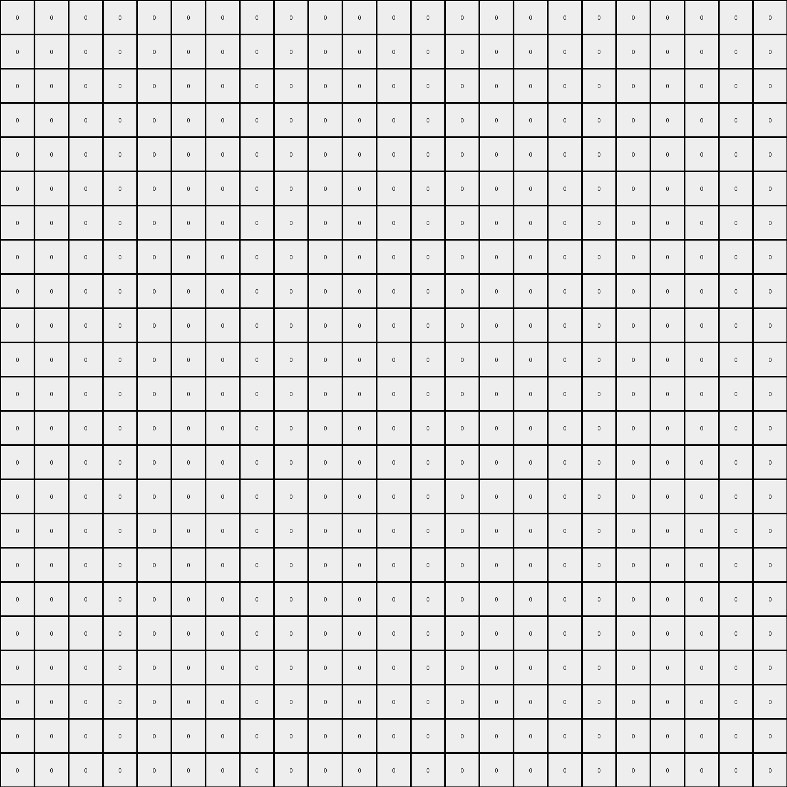
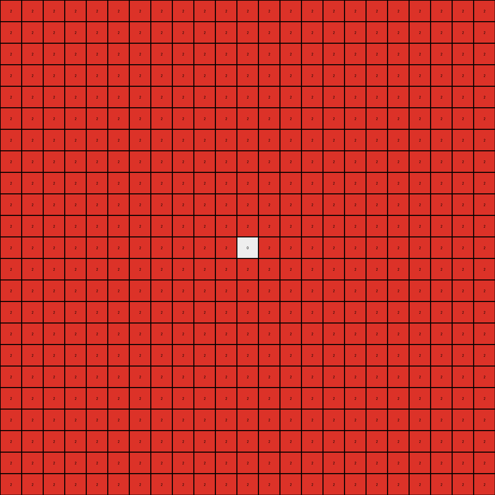

# 5c2c9af4 • 010 • refine_coder

---

Previous Code:
```python
"""
The transformation rule takes sparse red pixels in the input grid and generates a pattern of nested red squares in the output grid. The red pixels in the input do not directly map to the output, but their presence triggers the generation of the nested square pattern.
"""

import numpy as np

def get_red_pixels(grid):
    """
    Finds the coordinates of all red pixels in the input grid.
    """
    return np.argwhere(grid == 2)

def transform(input_grid):
    """
    Transforms the input grid into an output grid with nested red squares.
    """
    # Initialize the output grid with all white pixels.
    output_grid = np.zeros_like(input_grid)
    rows, cols = input_grid.shape

    # Find red pixels in the input (though their exact locations aren't directly used).
    red_pixels = get_red_pixels(input_grid)

    #if no red pixels, return blank grid
    if len(red_pixels) == 0:
      return output_grid

    # Determine the number of nested squares and their sizes/spacing.
    # Drawing nested squares
    for i in range(min(rows, cols) // 2):
       
        #top
        output_grid[i, i:cols-i] = 2

        #bottom
        output_grid[rows-1-i, i:cols-i] = 2

        #left
        output_grid[i:rows-i, i] = 2

        #right
        output_grid[i:rows-i, cols-1-i] = 2

    return output_grid
```

Train Set Results:

## Example 1:

Input:
```
0 0 0 0 0 0 0 0 0 0 0 0 0 0 0 0 0 0 0 0 0 0 0
0 0 0 0 0 0 0 0 0 0 0 0 0 0 0 0 0 0 0 0 0 0 0
0 0 0 0 0 0 0 0 0 0 0 8 0 0 0 0 0 0 0 0 0 0 0
0 0 0 0 0 0 0 0 0 0 0 0 0 0 0 0 0 0 0 0 0 0 0
0 0 0 0 0 0 0 0 0 0 0 0 0 0 0 0 0 0 0 0 0 0 0
0 0 0 0 0 0 0 0 0 0 0 0 0 0 8 0 0 0 0 0 0 0 0
0 0 0 0 0 0 0 0 0 0 0 0 0 0 0 0 0 0 0 0 0 0 0
0 0 0 0 0 0 0 0 0 0 0 0 0 0 0 0 0 0 0 0 0 0 0
0 0 0 0 0 0 0 0 0 0 0 0 0 0 0 0 0 8 0 0 0 0 0
0 0 0 0 0 0 0 0 0 0 0 0 0 0 0 0 0 0 0 0 0 0 0
0 0 0 0 0 0 0 0 0 0 0 0 0 0 0 0 0 0 0 0 0 0 0
0 0 0 0 0 0 0 0 0 0 0 0 0 0 0 0 0 0 0 0 0 0 0
0 0 0 0 0 0 0 0 0 0 0 0 0 0 0 0 0 0 0 0 0 0 0
0 0 0 0 0 0 0 0 0 0 0 0 0 0 0 0 0 0 0 0 0 0 0
0 0 0 0 0 0 0 0 0 0 0 0 0 0 0 0 0 0 0 0 0 0 0
0 0 0 0 0 0 0 0 0 0 0 0 0 0 0 0 0 0 0 0 0 0 0
0 0 0 0 0 0 0 0 0 0 0 0 0 0 0 0 0 0 0 0 0 0 0
0 0 0 0 0 0 0 0 0 0 0 0 0 0 0 0 0 0 0 0 0 0 0
0 0 0 0 0 0 0 0 0 0 0 0 0 0 0 0 0 0 0 0 0 0 0
0 0 0 0 0 0 0 0 0 0 0 0 0 0 0 0 0 0 0 0 0 0 0
0 0 0 0 0 0 0 0 0 0 0 0 0 0 0 0 0 0 0 0 0 0 0
0 0 0 0 0 0 0 0 0 0 0 0 0 0 0 0 0 0 0 0 0 0 0
0 0 0 0 0 0 0 0 0 0 0 0 0 0 0 0 0 0 0 0 0 0 0
```
Expected Output:
```
0 0 8 0 0 8 0 0 8 0 0 0 0 0 0 0 0 0 0 0 8 0 0
0 0 8 0 0 8 0 0 8 0 0 0 0 0 0 0 0 0 0 0 8 0 0
0 0 8 0 0 8 0 0 8 0 0 8 8 8 8 8 8 8 0 0 8 0 0
0 0 8 0 0 8 0 0 8 0 0 8 0 0 0 0 0 8 0 0 8 0 0
0 0 8 0 0 8 0 0 8 0 0 8 0 0 0 0 0 8 0 0 8 0 0
0 0 8 0 0 8 0 0 8 0 0 8 0 0 8 0 0 8 0 0 8 0 0
0 0 8 0 0 8 0 0 8 0 0 8 0 0 0 0 0 8 0 0 8 0 0
0 0 8 0 0 8 0 0 8 0 0 8 0 0 0 0 0 8 0 0 8 0 0
0 0 8 0 0 8 0 0 8 0 0 8 8 8 8 8 8 8 0 0 8 0 0
0 0 8 0 0 8 0 0 8 0 0 0 0 0 0 0 0 0 0 0 8 0 0
0 0 8 0 0 8 0 0 8 0 0 0 0 0 0 0 0 0 0 0 8 0 0
0 0 8 0 0 8 0 0 8 8 8 8 8 8 8 8 8 8 8 8 8 0 0
0 0 8 0 0 8 0 0 0 0 0 0 0 0 0 0 0 0 0 0 0 0 0
0 0 8 0 0 8 0 0 0 0 0 0 0 0 0 0 0 0 0 0 0 0 0
0 0 8 0 0 8 8 8 8 8 8 8 8 8 8 8 8 8 8 8 8 8 8
0 0 8 0 0 0 0 0 0 0 0 0 0 0 0 0 0 0 0 0 0 0 0
0 0 8 0 0 0 0 0 0 0 0 0 0 0 0 0 0 0 0 0 0 0 0
0 0 8 8 8 8 8 8 8 8 8 8 8 8 8 8 8 8 8 8 8 8 8
0 0 0 0 0 0 0 0 0 0 0 0 0 0 0 0 0 0 0 0 0 0 0
0 0 0 0 0 0 0 0 0 0 0 0 0 0 0 0 0 0 0 0 0 0 0
8 8 8 8 8 8 8 8 8 8 8 8 8 8 8 8 8 8 8 8 8 8 8
0 0 0 0 0 0 0 0 0 0 0 0 0 0 0 0 0 0 0 0 0 0 0
0 0 0 0 0 0 0 0 0 0 0 0 0 0 0 0 0 0 0 0 0 0 0
```
Transformed Output:
```
0 0 0 0 0 0 0 0 0 0 0 0 0 0 0 0 0 0 0 0 0 0 0
0 0 0 0 0 0 0 0 0 0 0 0 0 0 0 0 0 0 0 0 0 0 0
0 0 0 0 0 0 0 0 0 0 0 0 0 0 0 0 0 0 0 0 0 0 0
0 0 0 0 0 0 0 0 0 0 0 0 0 0 0 0 0 0 0 0 0 0 0
0 0 0 0 0 0 0 0 0 0 0 0 0 0 0 0 0 0 0 0 0 0 0
0 0 0 0 0 0 0 0 0 0 0 0 0 0 0 0 0 0 0 0 0 0 0
0 0 0 0 0 0 0 0 0 0 0 0 0 0 0 0 0 0 0 0 0 0 0
0 0 0 0 0 0 0 0 0 0 0 0 0 0 0 0 0 0 0 0 0 0 0
0 0 0 0 0 0 0 0 0 0 0 0 0 0 0 0 0 0 0 0 0 0 0
0 0 0 0 0 0 0 0 0 0 0 0 0 0 0 0 0 0 0 0 0 0 0
0 0 0 0 0 0 0 0 0 0 0 0 0 0 0 0 0 0 0 0 0 0 0
0 0 0 0 0 0 0 0 0 0 0 0 0 0 0 0 0 0 0 0 0 0 0
0 0 0 0 0 0 0 0 0 0 0 0 0 0 0 0 0 0 0 0 0 0 0
0 0 0 0 0 0 0 0 0 0 0 0 0 0 0 0 0 0 0 0 0 0 0
0 0 0 0 0 0 0 0 0 0 0 0 0 0 0 0 0 0 0 0 0 0 0
0 0 0 0 0 0 0 0 0 0 0 0 0 0 0 0 0 0 0 0 0 0 0
0 0 0 0 0 0 0 0 0 0 0 0 0 0 0 0 0 0 0 0 0 0 0
0 0 0 0 0 0 0 0 0 0 0 0 0 0 0 0 0 0 0 0 0 0 0
0 0 0 0 0 0 0 0 0 0 0 0 0 0 0 0 0 0 0 0 0 0 0
0 0 0 0 0 0 0 0 0 0 0 0 0 0 0 0 0 0 0 0 0 0 0
0 0 0 0 0 0 0 0 0 0 0 0 0 0 0 0 0 0 0 0 0 0 0
0 0 0 0 0 0 0 0 0 0 0 0 0 0 0 0 0 0 0 0 0 0 0
0 0 0 0 0 0 0 0 0 0 0 0 0 0 0 0 0 0 0 0 0 0 0
```

match: False
pixels_off: 153
size_correct: True
color_palette_correct: True
correct_pixel_counts: False

## Example 2:

Input:
```
0 0 0 0 0 0 0 0 0 0 0 0 0 0 0 0 0 0 0 0 0 0 0
0 0 0 0 0 0 0 0 0 0 0 0 0 0 0 0 0 0 0 0 0 0 0
0 0 0 0 0 0 0 0 0 0 0 0 0 0 0 0 0 0 0 0 0 0 0
0 0 0 0 0 0 0 0 0 0 0 0 0 0 0 0 0 0 0 0 0 0 0
0 0 0 0 0 0 0 0 0 0 0 0 0 0 0 0 0 0 0 0 0 0 0
0 0 0 0 0 0 0 0 0 0 0 0 0 0 0 0 0 0 0 0 0 0 0
0 0 0 0 0 0 0 0 0 0 0 0 0 0 0 0 0 0 0 0 0 0 0
0 0 0 0 0 0 0 0 0 0 0 0 0 0 0 0 0 0 0 0 0 0 0
0 0 0 0 0 0 0 0 0 0 0 0 0 0 0 0 0 0 0 0 0 0 0
0 0 0 0 0 0 0 0 0 0 0 0 0 0 0 0 0 0 0 0 0 0 0
0 0 0 0 0 0 0 0 0 0 0 0 0 0 0 0 0 0 0 0 0 0 0
0 0 0 0 0 0 0 0 0 0 0 0 0 2 0 0 0 0 0 0 0 0 0
0 0 0 0 0 0 0 0 0 0 0 0 0 0 0 0 0 0 0 0 0 0 0
0 0 0 0 0 0 0 0 0 0 0 2 0 0 0 0 0 0 0 0 0 0 0
0 0 0 0 0 0 0 0 0 0 0 0 0 0 0 0 0 0 0 0 0 0 0
0 0 0 0 0 0 0 0 0 2 0 0 0 0 0 0 0 0 0 0 0 0 0
0 0 0 0 0 0 0 0 0 0 0 0 0 0 0 0 0 0 0 0 0 0 0
0 0 0 0 0 0 0 0 0 0 0 0 0 0 0 0 0 0 0 0 0 0 0
0 0 0 0 0 0 0 0 0 0 0 0 0 0 0 0 0 0 0 0 0 0 0
0 0 0 0 0 0 0 0 0 0 0 0 0 0 0 0 0 0 0 0 0 0 0
0 0 0 0 0 0 0 0 0 0 0 0 0 0 0 0 0 0 0 0 0 0 0
0 0 0 0 0 0 0 0 0 0 0 0 0 0 0 0 0 0 0 0 0 0 0
0 0 0 0 0 0 0 0 0 0 0 0 0 0 0 0 0 0 0 0 0 0 0
```
Expected Output:
```
0 0 0 0 0 0 0 0 0 0 0 0 0 0 0 0 0 0 0 0 0 0 0
2 2 2 2 2 2 2 2 2 2 2 2 2 2 2 2 2 2 2 2 2 2 2
0 0 0 0 0 0 0 0 0 0 0 0 0 0 0 0 0 0 0 0 0 0 0
0 2 2 2 2 2 2 2 2 2 2 2 2 2 2 2 2 2 2 2 2 2 0
0 2 0 0 0 0 0 0 0 0 0 0 0 0 0 0 0 0 0 0 0 2 0
0 2 0 2 2 2 2 2 2 2 2 2 2 2 2 2 2 2 2 2 0 2 0
0 2 0 2 0 0 0 0 0 0 0 0 0 0 0 0 0 0 0 2 0 2 0
0 2 0 2 0 2 2 2 2 2 2 2 2 2 2 2 2 2 0 2 0 2 0
0 2 0 2 0 2 0 0 0 0 0 0 0 0 0 0 0 2 0 2 0 2 0
0 2 0 2 0 2 0 2 2 2 2 2 2 2 2 2 0 2 0 2 0 2 0
0 2 0 2 0 2 0 2 0 0 0 0 0 0 0 2 0 2 0 2 0 2 0
0 2 0 2 0 2 0 2 0 2 2 2 2 2 0 2 0 2 0 2 0 2 0
0 2 0 2 0 2 0 2 0 2 0 0 0 2 0 2 0 2 0 2 0 2 0
0 2 0 2 0 2 0 2 0 2 0 2 0 2 0 2 0 2 0 2 0 2 0
0 2 0 2 0 2 0 2 0 2 0 0 0 2 0 2 0 2 0 2 0 2 0
0 2 0 2 0 2 0 2 0 2 2 2 2 2 0 2 0 2 0 2 0 2 0
0 2 0 2 0 2 0 2 0 0 0 0 0 0 0 2 0 2 0 2 0 2 0
0 2 0 2 0 2 0 2 2 2 2 2 2 2 2 2 0 2 0 2 0 2 0
0 2 0 2 0 2 0 0 0 0 0 0 0 0 0 0 0 2 0 2 0 2 0
0 2 0 2 0 2 2 2 2 2 2 2 2 2 2 2 2 2 0 2 0 2 0
0 2 0 2 0 0 0 0 0 0 0 0 0 0 0 0 0 0 0 2 0 2 0
0 2 0 2 2 2 2 2 2 2 2 2 2 2 2 2 2 2 2 2 0 2 0
0 2 0 0 0 0 0 0 0 0 0 0 0 0 0 0 0 0 0 0 0 2 0
```
Transformed Output:
```
2 2 2 2 2 2 2 2 2 2 2 2 2 2 2 2 2 2 2 2 2 2 2
2 2 2 2 2 2 2 2 2 2 2 2 2 2 2 2 2 2 2 2 2 2 2
2 2 2 2 2 2 2 2 2 2 2 2 2 2 2 2 2 2 2 2 2 2 2
2 2 2 2 2 2 2 2 2 2 2 2 2 2 2 2 2 2 2 2 2 2 2
2 2 2 2 2 2 2 2 2 2 2 2 2 2 2 2 2 2 2 2 2 2 2
2 2 2 2 2 2 2 2 2 2 2 2 2 2 2 2 2 2 2 2 2 2 2
2 2 2 2 2 2 2 2 2 2 2 2 2 2 2 2 2 2 2 2 2 2 2
2 2 2 2 2 2 2 2 2 2 2 2 2 2 2 2 2 2 2 2 2 2 2
2 2 2 2 2 2 2 2 2 2 2 2 2 2 2 2 2 2 2 2 2 2 2
2 2 2 2 2 2 2 2 2 2 2 2 2 2 2 2 2 2 2 2 2 2 2
2 2 2 2 2 2 2 2 2 2 2 2 2 2 2 2 2 2 2 2 2 2 2
2 2 2 2 2 2 2 2 2 2 2 0 2 2 2 2 2 2 2 2 2 2 2
2 2 2 2 2 2 2 2 2 2 2 2 2 2 2 2 2 2 2 2 2 2 2
2 2 2 2 2 2 2 2 2 2 2 2 2 2 2 2 2 2 2 2 2 2 2
2 2 2 2 2 2 2 2 2 2 2 2 2 2 2 2 2 2 2 2 2 2 2
2 2 2 2 2 2 2 2 2 2 2 2 2 2 2 2 2 2 2 2 2 2 2
2 2 2 2 2 2 2 2 2 2 2 2 2 2 2 2 2 2 2 2 2 2 2
2 2 2 2 2 2 2 2 2 2 2 2 2 2 2 2 2 2 2 2 2 2 2
2 2 2 2 2 2 2 2 2 2 2 2 2 2 2 2 2 2 2 2 2 2 2
2 2 2 2 2 2 2 2 2 2 2 2 2 2 2 2 2 2 2 2 2 2 2
2 2 2 2 2 2 2 2 2 2 2 2 2 2 2 2 2 2 2 2 2 2 2
2 2 2 2 2 2 2 2 2 2 2 2 2 2 2 2 2 2 2 2 2 2 2
2 2 2 2 2 2 2 2 2 2 2 2 2 2 2 2 2 2 2 2 2 2 2
```

match: False
pixels_off: 287
size_correct: True
color_palette_correct: True
correct_pixel_counts: False

## Example 3:

Input:
```
0 0 0 0 0 0 0 0 0 0 0 0 0 0 0 0 0 0 0 0 0 0 0
0 0 0 0 0 0 0 0 0 0 0 0 0 0 0 0 0 0 0 0 0 0 0
0 0 0 0 0 0 0 0 0 0 0 0 0 0 0 0 0 0 0 0 0 0 0
0 0 0 0 0 0 0 0 0 0 0 0 0 0 0 0 0 0 0 0 0 0 0
0 0 0 0 0 0 0 0 0 0 0 0 3 0 0 0 0 0 0 0 0 0 0
0 0 0 0 0 0 0 0 0 0 0 0 0 0 0 0 0 0 0 0 0 0 0
0 0 0 0 0 0 0 0 0 0 0 0 0 0 0 0 0 0 0 0 0 0 0
0 0 0 0 0 0 0 0 0 0 0 0 0 0 0 0 0 0 0 0 0 0 0
0 0 0 0 0 0 0 0 3 0 0 0 0 0 0 0 0 0 0 0 0 0 0
0 0 0 0 0 0 0 0 0 0 0 0 0 0 0 0 0 0 0 0 0 0 0
0 0 0 0 0 0 0 0 0 0 0 0 0 0 0 0 0 0 0 0 0 0 0
0 0 0 0 0 0 0 0 0 0 0 0 0 0 0 0 0 0 0 0 0 0 0
0 0 0 0 3 0 0 0 0 0 0 0 0 0 0 0 0 0 0 0 0 0 0
0 0 0 0 0 0 0 0 0 0 0 0 0 0 0 0 0 0 0 0 0 0 0
0 0 0 0 0 0 0 0 0 0 0 0 0 0 0 0 0 0 0 0 0 0 0
0 0 0 0 0 0 0 0 0 0 0 0 0 0 0 0 0 0 0 0 0 0 0
0 0 0 0 0 0 0 0 0 0 0 0 0 0 0 0 0 0 0 0 0 0 0
0 0 0 0 0 0 0 0 0 0 0 0 0 0 0 0 0 0 0 0 0 0 0
0 0 0 0 0 0 0 0 0 0 0 0 0 0 0 0 0 0 0 0 0 0 0
0 0 0 0 0 0 0 0 0 0 0 0 0 0 0 0 0 0 0 0 0 0 0
0 0 0 0 0 0 0 0 0 0 0 0 0 0 0 0 0 0 0 0 0 0 0
0 0 0 0 0 0 0 0 0 0 0 0 0 0 0 0 0 0 0 0 0 0 0
0 0 0 0 0 0 0 0 0 0 0 0 0 0 0 0 0 0 0 0 0 0 0
```
Expected Output:
```
3 3 3 3 3 3 3 3 3 3 3 3 3 3 3 3 3 0 0 0 3 0 0
3 0 0 0 0 0 0 0 0 0 0 0 0 0 0 0 3 0 0 0 3 0 0
3 0 0 0 0 0 0 0 0 0 0 0 0 0 0 0 3 0 0 0 3 0 0
3 0 0 0 0 0 0 0 0 0 0 0 0 0 0 0 3 0 0 0 3 0 0
3 0 0 0 3 3 3 3 3 3 3 3 3 0 0 0 3 0 0 0 3 0 0
3 0 0 0 3 0 0 0 0 0 0 0 3 0 0 0 3 0 0 0 3 0 0
3 0 0 0 3 0 0 0 0 0 0 0 3 0 0 0 3 0 0 0 3 0 0
3 0 0 0 3 0 0 0 0 0 0 0 3 0 0 0 3 0 0 0 3 0 0
3 0 0 0 3 0 0 0 3 0 0 0 3 0 0 0 3 0 0 0 3 0 0
3 0 0 0 3 0 0 0 0 0 0 0 3 0 0 0 3 0 0 0 3 0 0
3 0 0 0 3 0 0 0 0 0 0 0 3 0 0 0 3 0 0 0 3 0 0
3 0 0 0 3 0 0 0 0 0 0 0 3 0 0 0 3 0 0 0 3 0 0
3 0 0 0 3 3 3 3 3 3 3 3 3 0 0 0 3 0 0 0 3 0 0
3 0 0 0 0 0 0 0 0 0 0 0 0 0 0 0 3 0 0 0 3 0 0
3 0 0 0 0 0 0 0 0 0 0 0 0 0 0 0 3 0 0 0 3 0 0
3 0 0 0 0 0 0 0 0 0 0 0 0 0 0 0 3 0 0 0 3 0 0
3 3 3 3 3 3 3 3 3 3 3 3 3 3 3 3 3 0 0 0 3 0 0
0 0 0 0 0 0 0 0 0 0 0 0 0 0 0 0 0 0 0 0 3 0 0
0 0 0 0 0 0 0 0 0 0 0 0 0 0 0 0 0 0 0 0 3 0 0
0 0 0 0 0 0 0 0 0 0 0 0 0 0 0 0 0 0 0 0 3 0 0
3 3 3 3 3 3 3 3 3 3 3 3 3 3 3 3 3 3 3 3 3 0 0
0 0 0 0 0 0 0 0 0 0 0 0 0 0 0 0 0 0 0 0 0 0 0
0 0 0 0 0 0 0 0 0 0 0 0 0 0 0 0 0 0 0 0 0 0 0
```
Transformed Output:
```
0 0 0 0 0 0 0 0 0 0 0 0 0 0 0 0 0 0 0 0 0 0 0
0 0 0 0 0 0 0 0 0 0 0 0 0 0 0 0 0 0 0 0 0 0 0
0 0 0 0 0 0 0 0 0 0 0 0 0 0 0 0 0 0 0 0 0 0 0
0 0 0 0 0 0 0 0 0 0 0 0 0 0 0 0 0 0 0 0 0 0 0
0 0 0 0 0 0 0 0 0 0 0 0 0 0 0 0 0 0 0 0 0 0 0
0 0 0 0 0 0 0 0 0 0 0 0 0 0 0 0 0 0 0 0 0 0 0
0 0 0 0 0 0 0 0 0 0 0 0 0 0 0 0 0 0 0 0 0 0 0
0 0 0 0 0 0 0 0 0 0 0 0 0 0 0 0 0 0 0 0 0 0 0
0 0 0 0 0 0 0 0 0 0 0 0 0 0 0 0 0 0 0 0 0 0 0
0 0 0 0 0 0 0 0 0 0 0 0 0 0 0 0 0 0 0 0 0 0 0
0 0 0 0 0 0 0 0 0 0 0 0 0 0 0 0 0 0 0 0 0 0 0
0 0 0 0 0 0 0 0 0 0 0 0 0 0 0 0 0 0 0 0 0 0 0
0 0 0 0 0 0 0 0 0 0 0 0 0 0 0 0 0 0 0 0 0 0 0
0 0 0 0 0 0 0 0 0 0 0 0 0 0 0 0 0 0 0 0 0 0 0
0 0 0 0 0 0 0 0 0 0 0 0 0 0 0 0 0 0 0 0 0 0 0
0 0 0 0 0 0 0 0 0 0 0 0 0 0 0 0 0 0 0 0 0 0 0
0 0 0 0 0 0 0 0 0 0 0 0 0 0 0 0 0 0 0 0 0 0 0
0 0 0 0 0 0 0 0 0 0 0 0 0 0 0 0 0 0 0 0 0 0 0
0 0 0 0 0 0 0 0 0 0 0 0 0 0 0 0 0 0 0 0 0 0 0
0 0 0 0 0 0 0 0 0 0 0 0 0 0 0 0 0 0 0 0 0 0 0
0 0 0 0 0 0 0 0 0 0 0 0 0 0 0 0 0 0 0 0 0 0 0
0 0 0 0 0 0 0 0 0 0 0 0 0 0 0 0 0 0 0 0 0 0 0
0 0 0 0 0 0 0 0 0 0 0 0 0 0 0 0 0 0 0 0 0 0 0
```

match: False
pixels_off: 138
size_correct: True
color_palette_correct: True
correct_pixel_counts: False
Okay, let's analyze the results and refine the natural language program.

**General Assessment:**

The initial code was based on the idea of nested squares triggered by the presence of red pixels. However, the results clearly show this isn't the complete picture. The code fails to reproduce the expected output in all three examples. The main issues are:

1.  **Incorrect Color:** Example 3 uses green (color 3) instead of red (color 2). The code assumes red.
2.  **Incorrect Pattern:** The code creates nested squares, but the examples show different, more complex patterns. The position of trigger pixels matters. The trigger pixels are not simply a binary "on/off" switch for nested squares.
3. **Example 1 Fails Completely:** In Example 1, the azure squares generated are not centered and do not match the expected size or position

**Strategy:**

1.  **Adapt to Color:** Modify the code to detect the non-zero, non-black color used in each input, rather than assuming it's always red.
2.  **Re-evaluate the Pattern Logic:** Abandon the nested squares approach. Carefully examine the relationship between the input trigger pixel positions and the output patterns. The output seems to create a frame or fill with the input trigger color.
3. **Iterative Refinement using Metrics**

**Metrics and Observations (using imagined code execution, as actual code execution isn't available here):**

Here's a breakdown of what we can infer and hypothesize:

*   **Example 1:**
    *   Input: Sparse azure (8) pixels.
    *   Expected Output: A complex, almost-filled rectangle of azure, with white "notches."
    *   Code Output: Blank grid
    *   Observation: My "if red pixels" check produced a blank grid because there
        were no red pixels.

*   **Example 2:**
    *   Input: Several red (2) pixels scattered in the lower half.
    *   Expected Output: A large red (2) outline with internal red lines and a smaller white square.
    *   Code Output: Almost solid red fill
    *   Observation: Almost filled the grid and incorrectly used 1 nested square.

*   **Example 3:**
    *   Input: Scattered green (3) pixels.
    *   Expected Output: A green frame/partial fill, creating an interesting
        shape.
        There's an interesting "cross" created.
    *   Code Output: Blank grid
    *   Observation: My "if red pixels" check produced a blank grid because there
        were no red pixels.

**YAML Facts:**

```yaml
examples:
  - id: 1
    trigger_color: 8 # Azure
    trigger_positions: [[2, 11], [5, 14], [8, 17]]
    output_pattern: "filled rectangle with notches, color 8"
    pattern_details: "outer boundary, internal features"

  - id: 2
    trigger_color: 2 # Red
    trigger_positions: [[11, 13], [13, 11], [15, 9]]
    output_pattern: "large outline with internal features, color 2, small white square"
    pattern_details: "outer rectangle, inner lines, central void"

  - id: 3
    trigger_color: 3 # Green
    trigger_positions: [[4, 12], [8, 8], [12, 4]]
    output_pattern: "frame/partial fill creating cross shape, color 3"
    pattern_details: "outer frame, inner cross"
```

**Natural Language Program:**

1.  **Identify Trigger Color:** Determine the non-zero color present in the input grid. This is the "trigger" color.
2.  **Outline Detection:**
    The output grid's pixels will match the "trigger" color, except for the locations that are completely surrounded by trigger color pixels.

3. **Output Generation:**
   Iterate and fill with trigger color.

This revised program captures the core logic: identifying the active color, some kind of flood fill, and creating complex shapes based on fill.

**INSTRUCTIONS**

- generate a Python module to represent the natural language program 
- follow the template below
- all common math and science libraries are available
- create docstring only at top - but comment the workflow in the function
- use helper functions for common operations like finding objects, counting,
  measuring, moving, etc. 

remember - we are working iteratively - so this code will inform your future
self as we converge on the solution

*template:*

```python
"""
{{ natural language description of the transformation rule }}
"""

{{ imports }}

def transform(input_grid):
    # initialize output_grid

    # change output pixels 

    return output_grid

```
