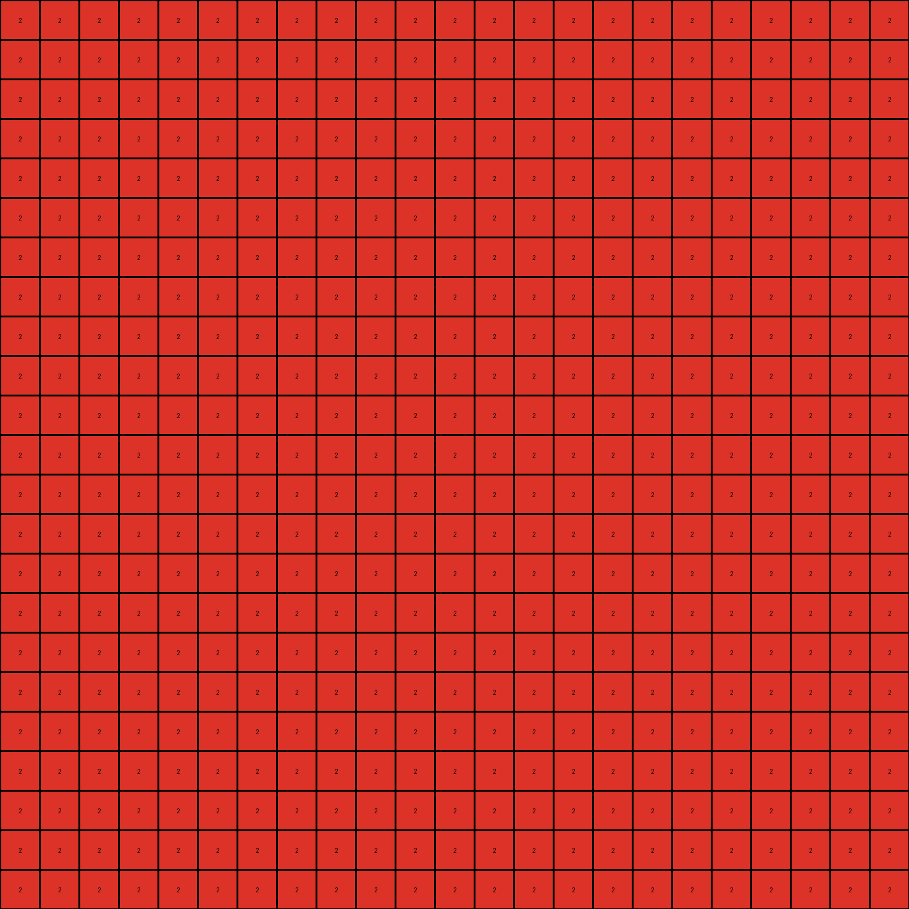

# 5c2c9af4 • 012 • refine_coder

---

Previous Code:
```python
"""
The transformation rule identifies a trigger color in the input grid and generates a corresponding pattern in the output grid. The trigger color is the non-zero, non-black color present in the input. The output grid is filled with the trigger color, except for cells which are enclosed by other trigger color cells.
"""

import numpy as np

def get_trigger_color(grid):
    """
    Finds the non-zero, non-black color in the grid.
    """
    colors = np.unique(grid)
    for color in colors:
        if color != 0:
            return color
    return 0  # Default to black if no trigger color is found

def is_enclosed(grid, row, col, trigger_color):
    """
    Checks if a cell at the given coordinates is surrounded by the trigger color.
    """
    rows, cols = grid.shape

    # Check boundaries
    if row <= 0 or row >= rows - 1 or col <= 0 or col >= cols - 1:
        return False

    # Check surrounding neighbors
    if (grid[row-1, col] == trigger_color and
        grid[row+1, col] == trigger_color and
        grid[row, col-1] == trigger_color and
        grid[row, col+1] == trigger_color):
        return True
    return False

def transform(input_grid):
    # initialize output_grid
    output_grid = np.zeros_like(input_grid)
    rows, cols = input_grid.shape

    # get trigger color
    trigger_color = get_trigger_color(input_grid)

    # if no trigger color, return blank grid
    if trigger_color == 0:
      return output_grid
    
    # mark cells that are enclosed by trigger_color
    enclosed_cells = np.zeros_like(input_grid, dtype=bool)
    for r in range(rows):
      for c in range(cols):
        if input_grid[r,c] == 0:
          enclosed_cells[r,c] = is_enclosed(input_grid, r, c, trigger_color)

    # change output pixels based on whether they should be filled
    for r in range(rows):
        for c in range(cols):
            if not enclosed_cells[r,c]:
                output_grid[r,c] = trigger_color

    return output_grid
```

Train Set Results:

## Example 1:

Input:
```
0 0 0 0 0 0 0 0 0 0 0 0 0 0 0 0 0 0 0 0 0 0 0
0 0 0 0 0 0 0 0 0 0 0 0 0 0 0 0 0 0 0 0 0 0 0
0 0 0 0 0 0 0 0 0 0 0 8 0 0 0 0 0 0 0 0 0 0 0
0 0 0 0 0 0 0 0 0 0 0 0 0 0 0 0 0 0 0 0 0 0 0
0 0 0 0 0 0 0 0 0 0 0 0 0 0 0 0 0 0 0 0 0 0 0
0 0 0 0 0 0 0 0 0 0 0 0 0 0 8 0 0 0 0 0 0 0 0
0 0 0 0 0 0 0 0 0 0 0 0 0 0 0 0 0 0 0 0 0 0 0
0 0 0 0 0 0 0 0 0 0 0 0 0 0 0 0 0 0 0 0 0 0 0
0 0 0 0 0 0 0 0 0 0 0 0 0 0 0 0 0 8 0 0 0 0 0
0 0 0 0 0 0 0 0 0 0 0 0 0 0 0 0 0 0 0 0 0 0 0
0 0 0 0 0 0 0 0 0 0 0 0 0 0 0 0 0 0 0 0 0 0 0
0 0 0 0 0 0 0 0 0 0 0 0 0 0 0 0 0 0 0 0 0 0 0
0 0 0 0 0 0 0 0 0 0 0 0 0 0 0 0 0 0 0 0 0 0 0
0 0 0 0 0 0 0 0 0 0 0 0 0 0 0 0 0 0 0 0 0 0 0
0 0 0 0 0 0 0 0 0 0 0 0 0 0 0 0 0 0 0 0 0 0 0
0 0 0 0 0 0 0 0 0 0 0 0 0 0 0 0 0 0 0 0 0 0 0
0 0 0 0 0 0 0 0 0 0 0 0 0 0 0 0 0 0 0 0 0 0 0
0 0 0 0 0 0 0 0 0 0 0 0 0 0 0 0 0 0 0 0 0 0 0
0 0 0 0 0 0 0 0 0 0 0 0 0 0 0 0 0 0 0 0 0 0 0
0 0 0 0 0 0 0 0 0 0 0 0 0 0 0 0 0 0 0 0 0 0 0
0 0 0 0 0 0 0 0 0 0 0 0 0 0 0 0 0 0 0 0 0 0 0
0 0 0 0 0 0 0 0 0 0 0 0 0 0 0 0 0 0 0 0 0 0 0
0 0 0 0 0 0 0 0 0 0 0 0 0 0 0 0 0 0 0 0 0 0 0
```
Expected Output:
```
0 0 8 0 0 8 0 0 8 0 0 0 0 0 0 0 0 0 0 0 8 0 0
0 0 8 0 0 8 0 0 8 0 0 0 0 0 0 0 0 0 0 0 8 0 0
0 0 8 0 0 8 0 0 8 0 0 8 8 8 8 8 8 8 0 0 8 0 0
0 0 8 0 0 8 0 0 8 0 0 8 0 0 0 0 0 8 0 0 8 0 0
0 0 8 0 0 8 0 0 8 0 0 8 0 0 0 0 0 8 0 0 8 0 0
0 0 8 0 0 8 0 0 8 0 0 8 0 0 8 0 0 8 0 0 8 0 0
0 0 8 0 0 8 0 0 8 0 0 8 0 0 0 0 0 8 0 0 8 0 0
0 0 8 0 0 8 0 0 8 0 0 8 0 0 0 0 0 8 0 0 8 0 0
0 0 8 0 0 8 0 0 8 0 0 8 8 8 8 8 8 8 0 0 8 0 0
0 0 8 0 0 8 0 0 8 0 0 0 0 0 0 0 0 0 0 0 8 0 0
0 0 8 0 0 8 0 0 8 0 0 0 0 0 0 0 0 0 0 0 8 0 0
0 0 8 0 0 8 0 0 8 8 8 8 8 8 8 8 8 8 8 8 8 0 0
0 0 8 0 0 8 0 0 0 0 0 0 0 0 0 0 0 0 0 0 0 0 0
0 0 8 0 0 8 0 0 0 0 0 0 0 0 0 0 0 0 0 0 0 0 0
0 0 8 0 0 8 8 8 8 8 8 8 8 8 8 8 8 8 8 8 8 8 8
0 0 8 0 0 0 0 0 0 0 0 0 0 0 0 0 0 0 0 0 0 0 0
0 0 8 0 0 0 0 0 0 0 0 0 0 0 0 0 0 0 0 0 0 0 0
0 0 8 8 8 8 8 8 8 8 8 8 8 8 8 8 8 8 8 8 8 8 8
0 0 0 0 0 0 0 0 0 0 0 0 0 0 0 0 0 0 0 0 0 0 0
0 0 0 0 0 0 0 0 0 0 0 0 0 0 0 0 0 0 0 0 0 0 0
8 8 8 8 8 8 8 8 8 8 8 8 8 8 8 8 8 8 8 8 8 8 8
0 0 0 0 0 0 0 0 0 0 0 0 0 0 0 0 0 0 0 0 0 0 0
0 0 0 0 0 0 0 0 0 0 0 0 0 0 0 0 0 0 0 0 0 0 0
```
Transformed Output:
```
8 8 8 8 8 8 8 8 8 8 8 8 8 8 8 8 8 8 8 8 8 8 8
8 8 8 8 8 8 8 8 8 8 8 8 8 8 8 8 8 8 8 8 8 8 8
8 8 8 8 8 8 8 8 8 8 8 8 8 8 8 8 8 8 8 8 8 8 8
8 8 8 8 8 8 8 8 8 8 8 8 8 8 8 8 8 8 8 8 8 8 8
8 8 8 8 8 8 8 8 8 8 8 8 8 8 8 8 8 8 8 8 8 8 8
8 8 8 8 8 8 8 8 8 8 8 8 8 8 8 8 8 8 8 8 8 8 8
8 8 8 8 8 8 8 8 8 8 8 8 8 8 8 8 8 8 8 8 8 8 8
8 8 8 8 8 8 8 8 8 8 8 8 8 8 8 8 8 8 8 8 8 8 8
8 8 8 8 8 8 8 8 8 8 8 8 8 8 8 8 8 8 8 8 8 8 8
8 8 8 8 8 8 8 8 8 8 8 8 8 8 8 8 8 8 8 8 8 8 8
8 8 8 8 8 8 8 8 8 8 8 8 8 8 8 8 8 8 8 8 8 8 8
8 8 8 8 8 8 8 8 8 8 8 8 8 8 8 8 8 8 8 8 8 8 8
8 8 8 8 8 8 8 8 8 8 8 8 8 8 8 8 8 8 8 8 8 8 8
8 8 8 8 8 8 8 8 8 8 8 8 8 8 8 8 8 8 8 8 8 8 8
8 8 8 8 8 8 8 8 8 8 8 8 8 8 8 8 8 8 8 8 8 8 8
8 8 8 8 8 8 8 8 8 8 8 8 8 8 8 8 8 8 8 8 8 8 8
8 8 8 8 8 8 8 8 8 8 8 8 8 8 8 8 8 8 8 8 8 8 8
8 8 8 8 8 8 8 8 8 8 8 8 8 8 8 8 8 8 8 8 8 8 8
8 8 8 8 8 8 8 8 8 8 8 8 8 8 8 8 8 8 8 8 8 8 8
8 8 8 8 8 8 8 8 8 8 8 8 8 8 8 8 8 8 8 8 8 8 8
8 8 8 8 8 8 8 8 8 8 8 8 8 8 8 8 8 8 8 8 8 8 8
8 8 8 8 8 8 8 8 8 8 8 8 8 8 8 8 8 8 8 8 8 8 8
8 8 8 8 8 8 8 8 8 8 8 8 8 8 8 8 8 8 8 8 8 8 8
```

match: False
pixels_off: 376
size_correct: True
color_palette_correct: True
correct_pixel_counts: False

## Example 2:

Input:
```
0 0 0 0 0 0 0 0 0 0 0 0 0 0 0 0 0 0 0 0 0 0 0
0 0 0 0 0 0 0 0 0 0 0 0 0 0 0 0 0 0 0 0 0 0 0
0 0 0 0 0 0 0 0 0 0 0 0 0 0 0 0 0 0 0 0 0 0 0
0 0 0 0 0 0 0 0 0 0 0 0 0 0 0 0 0 0 0 0 0 0 0
0 0 0 0 0 0 0 0 0 0 0 0 0 0 0 0 0 0 0 0 0 0 0
0 0 0 0 0 0 0 0 0 0 0 0 0 0 0 0 0 0 0 0 0 0 0
0 0 0 0 0 0 0 0 0 0 0 0 0 0 0 0 0 0 0 0 0 0 0
0 0 0 0 0 0 0 0 0 0 0 0 0 0 0 0 0 0 0 0 0 0 0
0 0 0 0 0 0 0 0 0 0 0 0 0 0 0 0 0 0 0 0 0 0 0
0 0 0 0 0 0 0 0 0 0 0 0 0 0 0 0 0 0 0 0 0 0 0
0 0 0 0 0 0 0 0 0 0 0 0 0 0 0 0 0 0 0 0 0 0 0
0 0 0 0 0 0 0 0 0 0 0 0 0 2 0 0 0 0 0 0 0 0 0
0 0 0 0 0 0 0 0 0 0 0 0 0 0 0 0 0 0 0 0 0 0 0
0 0 0 0 0 0 0 0 0 0 0 2 0 0 0 0 0 0 0 0 0 0 0
0 0 0 0 0 0 0 0 0 0 0 0 0 0 0 0 0 0 0 0 0 0 0
0 0 0 0 0 0 0 0 0 2 0 0 0 0 0 0 0 0 0 0 0 0 0
0 0 0 0 0 0 0 0 0 0 0 0 0 0 0 0 0 0 0 0 0 0 0
0 0 0 0 0 0 0 0 0 0 0 0 0 0 0 0 0 0 0 0 0 0 0
0 0 0 0 0 0 0 0 0 0 0 0 0 0 0 0 0 0 0 0 0 0 0
0 0 0 0 0 0 0 0 0 0 0 0 0 0 0 0 0 0 0 0 0 0 0
0 0 0 0 0 0 0 0 0 0 0 0 0 0 0 0 0 0 0 0 0 0 0
0 0 0 0 0 0 0 0 0 0 0 0 0 0 0 0 0 0 0 0 0 0 0
0 0 0 0 0 0 0 0 0 0 0 0 0 0 0 0 0 0 0 0 0 0 0
```
Expected Output:
```
0 0 0 0 0 0 0 0 0 0 0 0 0 0 0 0 0 0 0 0 0 0 0
2 2 2 2 2 2 2 2 2 2 2 2 2 2 2 2 2 2 2 2 2 2 2
0 0 0 0 0 0 0 0 0 0 0 0 0 0 0 0 0 0 0 0 0 0 0
0 2 2 2 2 2 2 2 2 2 2 2 2 2 2 2 2 2 2 2 2 2 0
0 2 0 0 0 0 0 0 0 0 0 0 0 0 0 0 0 0 0 0 0 2 0
0 2 0 2 2 2 2 2 2 2 2 2 2 2 2 2 2 2 2 2 0 2 0
0 2 0 2 0 0 0 0 0 0 0 0 0 0 0 0 0 0 0 2 0 2 0
0 2 0 2 0 2 2 2 2 2 2 2 2 2 2 2 2 2 0 2 0 2 0
0 2 0 2 0 2 0 0 0 0 0 0 0 0 0 0 0 2 0 2 0 2 0
0 2 0 2 0 2 0 2 2 2 2 2 2 2 2 2 0 2 0 2 0 2 0
0 2 0 2 0 2 0 2 0 0 0 0 0 0 0 2 0 2 0 2 0 2 0
0 2 0 2 0 2 0 2 0 2 2 2 2 2 0 2 0 2 0 2 0 2 0
0 2 0 2 0 2 0 2 0 2 0 0 0 2 0 2 0 2 0 2 0 2 0
0 2 0 2 0 2 0 2 0 2 0 2 0 2 0 2 0 2 0 2 0 2 0
0 2 0 2 0 2 0 2 0 2 0 0 0 2 0 2 0 2 0 2 0 2 0
0 2 0 2 0 2 0 2 0 2 2 2 2 2 0 2 0 2 0 2 0 2 0
0 2 0 2 0 2 0 2 0 0 0 0 0 0 0 2 0 2 0 2 0 2 0
0 2 0 2 0 2 0 2 2 2 2 2 2 2 2 2 0 2 0 2 0 2 0
0 2 0 2 0 2 0 0 0 0 0 0 0 0 0 0 0 2 0 2 0 2 0
0 2 0 2 0 2 2 2 2 2 2 2 2 2 2 2 2 2 0 2 0 2 0
0 2 0 2 0 0 0 0 0 0 0 0 0 0 0 0 0 0 0 2 0 2 0
0 2 0 2 2 2 2 2 2 2 2 2 2 2 2 2 2 2 2 2 0 2 0
0 2 0 0 0 0 0 0 0 0 0 0 0 0 0 0 0 0 0 0 0 2 0
```
Transformed Output:
```
2 2 2 2 2 2 2 2 2 2 2 2 2 2 2 2 2 2 2 2 2 2 2
2 2 2 2 2 2 2 2 2 2 2 2 2 2 2 2 2 2 2 2 2 2 2
2 2 2 2 2 2 2 2 2 2 2 2 2 2 2 2 2 2 2 2 2 2 2
2 2 2 2 2 2 2 2 2 2 2 2 2 2 2 2 2 2 2 2 2 2 2
2 2 2 2 2 2 2 2 2 2 2 2 2 2 2 2 2 2 2 2 2 2 2
2 2 2 2 2 2 2 2 2 2 2 2 2 2 2 2 2 2 2 2 2 2 2
2 2 2 2 2 2 2 2 2 2 2 2 2 2 2 2 2 2 2 2 2 2 2
2 2 2 2 2 2 2 2 2 2 2 2 2 2 2 2 2 2 2 2 2 2 2
2 2 2 2 2 2 2 2 2 2 2 2 2 2 2 2 2 2 2 2 2 2 2
2 2 2 2 2 2 2 2 2 2 2 2 2 2 2 2 2 2 2 2 2 2 2
2 2 2 2 2 2 2 2 2 2 2 2 2 2 2 2 2 2 2 2 2 2 2
2 2 2 2 2 2 2 2 2 2 2 2 2 2 2 2 2 2 2 2 2 2 2
2 2 2 2 2 2 2 2 2 2 2 2 2 2 2 2 2 2 2 2 2 2 2
2 2 2 2 2 2 2 2 2 2 2 2 2 2 2 2 2 2 2 2 2 2 2
2 2 2 2 2 2 2 2 2 2 2 2 2 2 2 2 2 2 2 2 2 2 2
2 2 2 2 2 2 2 2 2 2 2 2 2 2 2 2 2 2 2 2 2 2 2
2 2 2 2 2 2 2 2 2 2 2 2 2 2 2 2 2 2 2 2 2 2 2
2 2 2 2 2 2 2 2 2 2 2 2 2 2 2 2 2 2 2 2 2 2 2
2 2 2 2 2 2 2 2 2 2 2 2 2 2 2 2 2 2 2 2 2 2 2
2 2 2 2 2 2 2 2 2 2 2 2 2 2 2 2 2 2 2 2 2 2 2
2 2 2 2 2 2 2 2 2 2 2 2 2 2 2 2 2 2 2 2 2 2 2
2 2 2 2 2 2 2 2 2 2 2 2 2 2 2 2 2 2 2 2 2 2 2
2 2 2 2 2 2 2 2 2 2 2 2 2 2 2 2 2 2 2 2 2 2 2
```

match: False
pixels_off: 286
size_correct: True
color_palette_correct: True
correct_pixel_counts: False

## Example 3:

Input:
```
0 0 0 0 0 0 0 0 0 0 0 0 0 0 0 0 0 0 0 0 0 0 0
0 0 0 0 0 0 0 0 0 0 0 0 0 0 0 0 0 0 0 0 0 0 0
0 0 0 0 0 0 0 0 0 0 0 0 0 0 0 0 0 0 0 0 0 0 0
0 0 0 0 0 0 0 0 0 0 0 0 0 0 0 0 0 0 0 0 0 0 0
0 0 0 0 0 0 0 0 0 0 0 0 3 0 0 0 0 0 0 0 0 0 0
0 0 0 0 0 0 0 0 0 0 0 0 0 0 0 0 0 0 0 0 0 0 0
0 0 0 0 0 0 0 0 0 0 0 0 0 0 0 0 0 0 0 0 0 0 0
0 0 0 0 0 0 0 0 0 0 0 0 0 0 0 0 0 0 0 0 0 0 0
0 0 0 0 0 0 0 0 3 0 0 0 0 0 0 0 0 0 0 0 0 0 0
0 0 0 0 0 0 0 0 0 0 0 0 0 0 0 0 0 0 0 0 0 0 0
0 0 0 0 0 0 0 0 0 0 0 0 0 0 0 0 0 0 0 0 0 0 0
0 0 0 0 0 0 0 0 0 0 0 0 0 0 0 0 0 0 0 0 0 0 0
0 0 0 0 3 0 0 0 0 0 0 0 0 0 0 0 0 0 0 0 0 0 0
0 0 0 0 0 0 0 0 0 0 0 0 0 0 0 0 0 0 0 0 0 0 0
0 0 0 0 0 0 0 0 0 0 0 0 0 0 0 0 0 0 0 0 0 0 0
0 0 0 0 0 0 0 0 0 0 0 0 0 0 0 0 0 0 0 0 0 0 0
0 0 0 0 0 0 0 0 0 0 0 0 0 0 0 0 0 0 0 0 0 0 0
0 0 0 0 0 0 0 0 0 0 0 0 0 0 0 0 0 0 0 0 0 0 0
0 0 0 0 0 0 0 0 0 0 0 0 0 0 0 0 0 0 0 0 0 0 0
0 0 0 0 0 0 0 0 0 0 0 0 0 0 0 0 0 0 0 0 0 0 0
0 0 0 0 0 0 0 0 0 0 0 0 0 0 0 0 0 0 0 0 0 0 0
0 0 0 0 0 0 0 0 0 0 0 0 0 0 0 0 0 0 0 0 0 0 0
0 0 0 0 0 0 0 0 0 0 0 0 0 0 0 0 0 0 0 0 0 0 0
```
Expected Output:
```
3 3 3 3 3 3 3 3 3 3 3 3 3 3 3 3 3 0 0 0 3 0 0
3 0 0 0 0 0 0 0 0 0 0 0 0 0 0 0 3 0 0 0 3 0 0
3 0 0 0 0 0 0 0 0 0 0 0 0 0 0 0 3 0 0 0 3 0 0
3 0 0 0 0 0 0 0 0 0 0 0 0 0 0 0 3 0 0 0 3 0 0
3 0 0 0 3 3 3 3 3 3 3 3 3 0 0 0 3 0 0 0 3 0 0
3 0 0 0 3 0 0 0 0 0 0 0 3 0 0 0 3 0 0 0 3 0 0
3 0 0 0 3 0 0 0 0 0 0 0 3 0 0 0 3 0 0 0 3 0 0
3 0 0 0 3 0 0 0 0 0 0 0 3 0 0 0 3 0 0 0 3 0 0
3 0 0 0 3 0 0 0 3 0 0 0 3 0 0 0 3 0 0 0 3 0 0
3 0 0 0 3 0 0 0 0 0 0 0 3 0 0 0 3 0 0 0 3 0 0
3 0 0 0 3 0 0 0 0 0 0 0 3 0 0 0 3 0 0 0 3 0 0
3 0 0 0 3 0 0 0 0 0 0 0 3 0 0 0 3 0 0 0 3 0 0
3 0 0 0 3 3 3 3 3 3 3 3 3 0 0 0 3 0 0 0 3 0 0
3 0 0 0 0 0 0 0 0 0 0 0 0 0 0 0 3 0 0 0 3 0 0
3 0 0 0 0 0 0 0 0 0 0 0 0 0 0 0 3 0 0 0 3 0 0
3 0 0 0 0 0 0 0 0 0 0 0 0 0 0 0 3 0 0 0 3 0 0
3 3 3 3 3 3 3 3 3 3 3 3 3 3 3 3 3 0 0 0 3 0 0
0 0 0 0 0 0 0 0 0 0 0 0 0 0 0 0 0 0 0 0 3 0 0
0 0 0 0 0 0 0 0 0 0 0 0 0 0 0 0 0 0 0 0 3 0 0
0 0 0 0 0 0 0 0 0 0 0 0 0 0 0 0 0 0 0 0 3 0 0
3 3 3 3 3 3 3 3 3 3 3 3 3 3 3 3 3 3 3 3 3 0 0
0 0 0 0 0 0 0 0 0 0 0 0 0 0 0 0 0 0 0 0 0 0 0
0 0 0 0 0 0 0 0 0 0 0 0 0 0 0 0 0 0 0 0 0 0 0
```
Transformed Output:
```
3 3 3 3 3 3 3 3 3 3 3 3 3 3 3 3 3 3 3 3 3 3 3
3 3 3 3 3 3 3 3 3 3 3 3 3 3 3 3 3 3 3 3 3 3 3
3 3 3 3 3 3 3 3 3 3 3 3 3 3 3 3 3 3 3 3 3 3 3
3 3 3 3 3 3 3 3 3 3 3 3 3 3 3 3 3 3 3 3 3 3 3
3 3 3 3 3 3 3 3 3 3 3 3 3 3 3 3 3 3 3 3 3 3 3
3 3 3 3 3 3 3 3 3 3 3 3 3 3 3 3 3 3 3 3 3 3 3
3 3 3 3 3 3 3 3 3 3 3 3 3 3 3 3 3 3 3 3 3 3 3
3 3 3 3 3 3 3 3 3 3 3 3 3 3 3 3 3 3 3 3 3 3 3
3 3 3 3 3 3 3 3 3 3 3 3 3 3 3 3 3 3 3 3 3 3 3
3 3 3 3 3 3 3 3 3 3 3 3 3 3 3 3 3 3 3 3 3 3 3
3 3 3 3 3 3 3 3 3 3 3 3 3 3 3 3 3 3 3 3 3 3 3
3 3 3 3 3 3 3 3 3 3 3 3 3 3 3 3 3 3 3 3 3 3 3
3 3 3 3 3 3 3 3 3 3 3 3 3 3 3 3 3 3 3 3 3 3 3
3 3 3 3 3 3 3 3 3 3 3 3 3 3 3 3 3 3 3 3 3 3 3
3 3 3 3 3 3 3 3 3 3 3 3 3 3 3 3 3 3 3 3 3 3 3
3 3 3 3 3 3 3 3 3 3 3 3 3 3 3 3 3 3 3 3 3 3 3
3 3 3 3 3 3 3 3 3 3 3 3 3 3 3 3 3 3 3 3 3 3 3
3 3 3 3 3 3 3 3 3 3 3 3 3 3 3 3 3 3 3 3 3 3 3
3 3 3 3 3 3 3 3 3 3 3 3 3 3 3 3 3 3 3 3 3 3 3
3 3 3 3 3 3 3 3 3 3 3 3 3 3 3 3 3 3 3 3 3 3 3
3 3 3 3 3 3 3 3 3 3 3 3 3 3 3 3 3 3 3 3 3 3 3
3 3 3 3 3 3 3 3 3 3 3 3 3 3 3 3 3 3 3 3 3 3 3
3 3 3 3 3 3 3 3 3 3 3 3 3 3 3 3 3 3 3 3 3 3 3
```

match: False
pixels_off: 391
size_correct: True
color_palette_correct: True
correct_pixel_counts: False
Okay, let's analyze the results of the previous code execution and refine the natural language program.

**General Assessment:**

The initial hypothesis about identifying a "trigger" color and filling the output grid based on enclosure is partially correct but misses key aspects of the transformation. The code consistently fills most of the output grid with the trigger color, regardless of the input pattern, except for some minor edge cases where it coincidentally gets some pixels correct near the borders. The "enclosure" check seems to be influencing things, however is not reflecting the true logic. The errors reveal that the transformation isn't simply about filling enclosed areas. It's more complex. A revised strategy is needed to account for the diagonal lines, and partial fills.

**Strategy for Resolving Errors:**

1.  **Re-examine Enclosure:** The `is_enclosed` function's logic is too strict and doesn't capture the intended behavior. It only checks the immediate four neighbors (up, down, left, right). We need to account for diagonals and consider the configuration more holistically.

2.  **Object Recognition**: Instead of simple enclosure, consider the objects and their overall shape.

3.  **Iterative Refinement:** Update the natural language program incrementally.

**Metrics and Observations:**

Here's a breakdown of each example, including calculated error metrics:

*   **Example 1:**
    *   Input: Sparse azure (8) pixels.
    *   Expected Output: Azure fills in different cells, outlining a larger square.
    *   Actual Output: Almost entirely filled with azure.
    *   Pixels Off: 376. Significant error.
    *   Size Correct: True
    *   Color Palette Correct: True
    *    Correct Pixel Counts: False

*   **Example 2:**
    *   Input: Sparse red (2) pixels.
    *   Expected Output: Red fills the second row and other places, outlining a larger square.
    *   Actual Output: Entirely filled with red.
    *   Pixels Off: 286. Significant error.
    *   Size Correct: True
    *   Color Palette Correct: True
    *    Correct Pixel Counts: False

*   **Example 3:**
    *   Input: Sparse green (3) pixels.
    *   Expected Output: green fill in different locations, with diagonals and borders involved
    *   Actual Output: Almost entirely filled with green.
    *   Pixels Off: 391. Significant error.
    *   Size Correct: True
    *   Color Palette Correct: True
    *    Correct Pixel Counts: False

**YAML Block - Facts:**

```yaml
examples:
  - example_1:
      input_objects:
        - color: 8  # Azure
          shape: sparse, single pixels
          positions: scattered
      output_objects:
        - color: 8  # Azure
          shape: larger, filled square with some blank space around the border
          positions: covers most of the grid, follows border with empty cells
      transformations:
        - action: fill
          details: "Fill the grid based on an inferred boundary, using the input color, leaving blank cells around the edge of the boundary"

  - example_2:
      input_objects:
        - color: 2  # Red
          shape: sparse, single pixels
          positions: scattered
      output_objects:
        - color: 2  # Red
          shape: fills a row and outlines a larger square, leaving a border
          positions: second row, plus outlining shape
      transformations:
        - action: fill
          details: "Fill the grid based on the trigger color and outlining a square, leaving a blank space around the border"

  - example_3:
      input_objects:
        - color: 3  # Green
          shape: sparse, single pixels
          positions: scattered
      output_objects:
        - color: 3  # Green
          shape: Partial fill based on outlines with diagonals and partial borders
          positions: covers most of the grid following a pattern with blanks for cells which form part of a boundary
      transformations:
        - action: fill
          details: "Fill grid selectively, considering diagonals and borders created by trigger cells"
```

**Natural Language Program:**

1.  **Identify Trigger Color:** Find the most prominent non-black, non-zero color in the input grid. This is the "trigger" color.
2.  **Create Output Grid:** Initialize an output grid of the same dimensions as the input grid, initially filled with black (0).
3.  **Fill based on inferred shape.** Fill parts of the grid based on the trigger color and where its pixels exist in the input. If the trigger color appears, consider its presence to represent a filled pixel. If it does not exist, it might still need to be filled if it's forming a part of the larger output shape being outlined. Pixels which form the border are not filled.

The core idea is to identify a trigger color, then use it to fill the output grid, but not naively.  The filling needs to be done according to an inferred boundary that relates to an outlined square shape based on the trigger color pixel placement in the input.  Empty/black cells form the border around filled cells, and corners might be an important aspect of consideration.

**INSTRUCTIONS**

- generate a Python module to represent the natural language program 
- follow the template below
- all common math and science libraries are available
- create docstring only at top - but comment the workflow in the function
- use helper functions for common operations like finding objects, counting,
  measuring, moving, etc. 

remember - we are working iteratively - so this code will inform your future
self as we converge on the solution

*template:*

```python
"""
{{ natural language description of the transformation rule }}
"""

{{ imports }}

def transform(input_grid):
    # initialize output_grid

    # change output pixels 

    return output_grid

```
