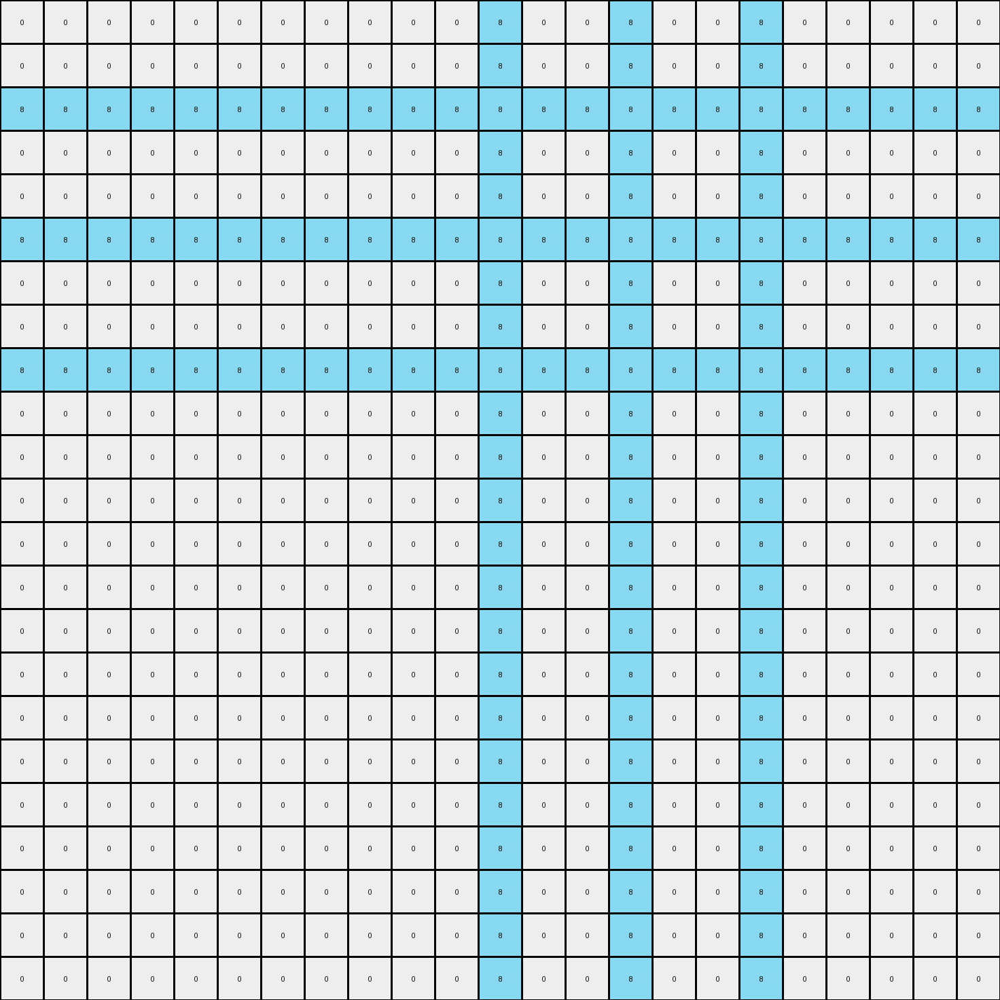
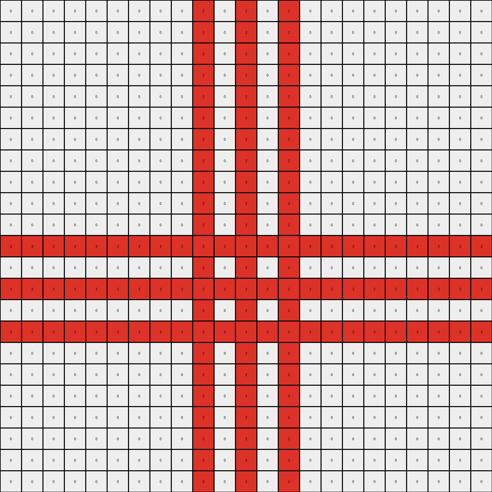

# 5c2c9af4 • 018 • refine_coder

---

Previous Code:
```python
"""
The transformation identifies isolated pixels (of any color) in the input grid.  For each isolated pixel, it extends a cross of the same color horizontally and vertically.  These lines stop when they encounter a pixel of a different color (not white/0, and not the same color) or the edge of the grid.
"""

import numpy as np

def is_isolated_revised(grid, row, col):
    """Checks if a pixel is isolated (not adjacent to same-color pixels)."""
    color = grid[row, col]
    if color == 0: #white, can't be isolated by definition in this challenge.
        return False

    height, width = grid.shape
    for i in range(max(0, row - 1), min(height, row + 2)):
        for j in range(max(0, col - 1), min(width, col + 2)):
            if (i, j) != (row, col) and grid[i, j] == color:
                return False  # Found an adjacent pixel of same color
    return True

def transform(input_grid):
    """Transforms the input grid according to the described rule."""
    output_grid = np.copy(input_grid)
    height, width = input_grid.shape

    # Iterate through each cell in the grid
    for row in range(height):
        for col in range(width):
            # Check for isolated pixels
            if is_isolated_revised(input_grid, row, col):
                color = input_grid[row,col]
                # Horizontal expansion (left)
                for j in range(col - 1, -1, -1):
                    if input_grid[row, j] == 0 or input_grid[row,j] == color:
                        output_grid[row, j] = color
                    else:
                        break
                # Horizontal expansion (right)
                for j in range(col + 1, width):
                    if input_grid[row, j] == 0 or input_grid[row,j] == color:
                        output_grid[row, j] = color
                    else:
                        break
                # Vertical expansion (up)
                for i in range(row - 1, -1, -1):
                    if input_grid[i, col] == 0 or input_grid[i,col] == color:
                        output_grid[i, col] = color
                    else:
                        break
                # Vertical expansion (down)
                for i in range(row + 1, height):
                    if input_grid[i, col] == 0 or input_grid[i,col] == color:
                        output_grid[i, col] = color
                    else:
                        break

    return output_grid
```

Train Set Results:

## Example 1:

Input:
```
0 0 0 0 0 0 0 0 0 0 0 0 0 0 0 0 0 0 0 0 0 0 0
0 0 0 0 0 0 0 0 0 0 0 0 0 0 0 0 0 0 0 0 0 0 0
0 0 0 0 0 0 0 0 0 0 0 8 0 0 0 0 0 0 0 0 0 0 0
0 0 0 0 0 0 0 0 0 0 0 0 0 0 0 0 0 0 0 0 0 0 0
0 0 0 0 0 0 0 0 0 0 0 0 0 0 0 0 0 0 0 0 0 0 0
0 0 0 0 0 0 0 0 0 0 0 0 0 0 8 0 0 0 0 0 0 0 0
0 0 0 0 0 0 0 0 0 0 0 0 0 0 0 0 0 0 0 0 0 0 0
0 0 0 0 0 0 0 0 0 0 0 0 0 0 0 0 0 0 0 0 0 0 0
0 0 0 0 0 0 0 0 0 0 0 0 0 0 0 0 0 8 0 0 0 0 0
0 0 0 0 0 0 0 0 0 0 0 0 0 0 0 0 0 0 0 0 0 0 0
0 0 0 0 0 0 0 0 0 0 0 0 0 0 0 0 0 0 0 0 0 0 0
0 0 0 0 0 0 0 0 0 0 0 0 0 0 0 0 0 0 0 0 0 0 0
0 0 0 0 0 0 0 0 0 0 0 0 0 0 0 0 0 0 0 0 0 0 0
0 0 0 0 0 0 0 0 0 0 0 0 0 0 0 0 0 0 0 0 0 0 0
0 0 0 0 0 0 0 0 0 0 0 0 0 0 0 0 0 0 0 0 0 0 0
0 0 0 0 0 0 0 0 0 0 0 0 0 0 0 0 0 0 0 0 0 0 0
0 0 0 0 0 0 0 0 0 0 0 0 0 0 0 0 0 0 0 0 0 0 0
0 0 0 0 0 0 0 0 0 0 0 0 0 0 0 0 0 0 0 0 0 0 0
0 0 0 0 0 0 0 0 0 0 0 0 0 0 0 0 0 0 0 0 0 0 0
0 0 0 0 0 0 0 0 0 0 0 0 0 0 0 0 0 0 0 0 0 0 0
0 0 0 0 0 0 0 0 0 0 0 0 0 0 0 0 0 0 0 0 0 0 0
0 0 0 0 0 0 0 0 0 0 0 0 0 0 0 0 0 0 0 0 0 0 0
0 0 0 0 0 0 0 0 0 0 0 0 0 0 0 0 0 0 0 0 0 0 0
```
Expected Output:
```
0 0 8 0 0 8 0 0 8 0 0 0 0 0 0 0 0 0 0 0 8 0 0
0 0 8 0 0 8 0 0 8 0 0 0 0 0 0 0 0 0 0 0 8 0 0
0 0 8 0 0 8 0 0 8 0 0 8 8 8 8 8 8 8 0 0 8 0 0
0 0 8 0 0 8 0 0 8 0 0 8 0 0 0 0 0 8 0 0 8 0 0
0 0 8 0 0 8 0 0 8 0 0 8 0 0 0 0 0 8 0 0 8 0 0
0 0 8 0 0 8 0 0 8 0 0 8 0 0 8 0 0 8 0 0 8 0 0
0 0 8 0 0 8 0 0 8 0 0 8 0 0 0 0 0 8 0 0 8 0 0
0 0 8 0 0 8 0 0 8 0 0 8 0 0 0 0 0 8 0 0 8 0 0
0 0 8 0 0 8 0 0 8 0 0 8 8 8 8 8 8 8 0 0 8 0 0
0 0 8 0 0 8 0 0 8 0 0 0 0 0 0 0 0 0 0 0 8 0 0
0 0 8 0 0 8 0 0 8 0 0 0 0 0 0 0 0 0 0 0 8 0 0
0 0 8 0 0 8 0 0 8 8 8 8 8 8 8 8 8 8 8 8 8 0 0
0 0 8 0 0 8 0 0 0 0 0 0 0 0 0 0 0 0 0 0 0 0 0
0 0 8 0 0 8 0 0 0 0 0 0 0 0 0 0 0 0 0 0 0 0 0
0 0 8 0 0 8 8 8 8 8 8 8 8 8 8 8 8 8 8 8 8 8 8
0 0 8 0 0 0 0 0 0 0 0 0 0 0 0 0 0 0 0 0 0 0 0
0 0 8 0 0 0 0 0 0 0 0 0 0 0 0 0 0 0 0 0 0 0 0
0 0 8 8 8 8 8 8 8 8 8 8 8 8 8 8 8 8 8 8 8 8 8
0 0 0 0 0 0 0 0 0 0 0 0 0 0 0 0 0 0 0 0 0 0 0
0 0 0 0 0 0 0 0 0 0 0 0 0 0 0 0 0 0 0 0 0 0 0
8 8 8 8 8 8 8 8 8 8 8 8 8 8 8 8 8 8 8 8 8 8 8
0 0 0 0 0 0 0 0 0 0 0 0 0 0 0 0 0 0 0 0 0 0 0
0 0 0 0 0 0 0 0 0 0 0 0 0 0 0 0 0 0 0 0 0 0 0
```
Transformed Output:
```
0 0 0 0 0 0 0 0 0 0 0 8 0 0 8 0 0 8 0 0 0 0 0
0 0 0 0 0 0 0 0 0 0 0 8 0 0 8 0 0 8 0 0 0 0 0
8 8 8 8 8 8 8 8 8 8 8 8 8 8 8 8 8 8 8 8 8 8 8
0 0 0 0 0 0 0 0 0 0 0 8 0 0 8 0 0 8 0 0 0 0 0
0 0 0 0 0 0 0 0 0 0 0 8 0 0 8 0 0 8 0 0 0 0 0
8 8 8 8 8 8 8 8 8 8 8 8 8 8 8 8 8 8 8 8 8 8 8
0 0 0 0 0 0 0 0 0 0 0 8 0 0 8 0 0 8 0 0 0 0 0
0 0 0 0 0 0 0 0 0 0 0 8 0 0 8 0 0 8 0 0 0 0 0
8 8 8 8 8 8 8 8 8 8 8 8 8 8 8 8 8 8 8 8 8 8 8
0 0 0 0 0 0 0 0 0 0 0 8 0 0 8 0 0 8 0 0 0 0 0
0 0 0 0 0 0 0 0 0 0 0 8 0 0 8 0 0 8 0 0 0 0 0
0 0 0 0 0 0 0 0 0 0 0 8 0 0 8 0 0 8 0 0 0 0 0
0 0 0 0 0 0 0 0 0 0 0 8 0 0 8 0 0 8 0 0 0 0 0
0 0 0 0 0 0 0 0 0 0 0 8 0 0 8 0 0 8 0 0 0 0 0
0 0 0 0 0 0 0 0 0 0 0 8 0 0 8 0 0 8 0 0 0 0 0
0 0 0 0 0 0 0 0 0 0 0 8 0 0 8 0 0 8 0 0 0 0 0
0 0 0 0 0 0 0 0 0 0 0 8 0 0 8 0 0 8 0 0 0 0 0
0 0 0 0 0 0 0 0 0 0 0 8 0 0 8 0 0 8 0 0 0 0 0
0 0 0 0 0 0 0 0 0 0 0 8 0 0 8 0 0 8 0 0 0 0 0
0 0 0 0 0 0 0 0 0 0 0 8 0 0 8 0 0 8 0 0 0 0 0
0 0 0 0 0 0 0 0 0 0 0 8 0 0 8 0 0 8 0 0 0 0 0
0 0 0 0 0 0 0 0 0 0 0 8 0 0 8 0 0 8 0 0 0 0 0
0 0 0 0 0 0 0 0 0 0 0 8 0 0 8 0 0 8 0 0 0 0 0
```

match: False
pixels_off: 184
size_correct: True
color_palette_correct: True
correct_pixel_counts: False

## Example 2:

Input:
```
0 0 0 0 0 0 0 0 0 0 0 0 0 0 0 0 0 0 0 0 0 0 0
0 0 0 0 0 0 0 0 0 0 0 0 0 0 0 0 0 0 0 0 0 0 0
0 0 0 0 0 0 0 0 0 0 0 0 0 0 0 0 0 0 0 0 0 0 0
0 0 0 0 0 0 0 0 0 0 0 0 0 0 0 0 0 0 0 0 0 0 0
0 0 0 0 0 0 0 0 0 0 0 0 0 0 0 0 0 0 0 0 0 0 0
0 0 0 0 0 0 0 0 0 0 0 0 0 0 0 0 0 0 0 0 0 0 0
0 0 0 0 0 0 0 0 0 0 0 0 0 0 0 0 0 0 0 0 0 0 0
0 0 0 0 0 0 0 0 0 0 0 0 0 0 0 0 0 0 0 0 0 0 0
0 0 0 0 0 0 0 0 0 0 0 0 0 0 0 0 0 0 0 0 0 0 0
0 0 0 0 0 0 0 0 0 0 0 0 0 0 0 0 0 0 0 0 0 0 0
0 0 0 0 0 0 0 0 0 0 0 0 0 0 0 0 0 0 0 0 0 0 0
0 0 0 0 0 0 0 0 0 0 0 0 0 2 0 0 0 0 0 0 0 0 0
0 0 0 0 0 0 0 0 0 0 0 0 0 0 0 0 0 0 0 0 0 0 0
0 0 0 0 0 0 0 0 0 0 0 2 0 0 0 0 0 0 0 0 0 0 0
0 0 0 0 0 0 0 0 0 0 0 0 0 0 0 0 0 0 0 0 0 0 0
0 0 0 0 0 0 0 0 0 2 0 0 0 0 0 0 0 0 0 0 0 0 0
0 0 0 0 0 0 0 0 0 0 0 0 0 0 0 0 0 0 0 0 0 0 0
0 0 0 0 0 0 0 0 0 0 0 0 0 0 0 0 0 0 0 0 0 0 0
0 0 0 0 0 0 0 0 0 0 0 0 0 0 0 0 0 0 0 0 0 0 0
0 0 0 0 0 0 0 0 0 0 0 0 0 0 0 0 0 0 0 0 0 0 0
0 0 0 0 0 0 0 0 0 0 0 0 0 0 0 0 0 0 0 0 0 0 0
0 0 0 0 0 0 0 0 0 0 0 0 0 0 0 0 0 0 0 0 0 0 0
0 0 0 0 0 0 0 0 0 0 0 0 0 0 0 0 0 0 0 0 0 0 0
```
Expected Output:
```
0 0 0 0 0 0 0 0 0 0 0 0 0 0 0 0 0 0 0 0 0 0 0
2 2 2 2 2 2 2 2 2 2 2 2 2 2 2 2 2 2 2 2 2 2 2
0 0 0 0 0 0 0 0 0 0 0 0 0 0 0 0 0 0 0 0 0 0 0
0 2 2 2 2 2 2 2 2 2 2 2 2 2 2 2 2 2 2 2 2 2 0
0 2 0 0 0 0 0 0 0 0 0 0 0 0 0 0 0 0 0 0 0 2 0
0 2 0 2 2 2 2 2 2 2 2 2 2 2 2 2 2 2 2 2 0 2 0
0 2 0 2 0 0 0 0 0 0 0 0 0 0 0 0 0 0 0 2 0 2 0
0 2 0 2 0 2 2 2 2 2 2 2 2 2 2 2 2 2 0 2 0 2 0
0 2 0 2 0 2 0 0 0 0 0 0 0 0 0 0 0 2 0 2 0 2 0
0 2 0 2 0 2 0 2 2 2 2 2 2 2 2 2 0 2 0 2 0 2 0
0 2 0 2 0 2 0 2 0 0 0 0 0 0 0 2 0 2 0 2 0 2 0
0 2 0 2 0 2 0 2 0 2 2 2 2 2 0 2 0 2 0 2 0 2 0
0 2 0 2 0 2 0 2 0 2 0 0 0 2 0 2 0 2 0 2 0 2 0
0 2 0 2 0 2 0 2 0 2 0 2 0 2 0 2 0 2 0 2 0 2 0
0 2 0 2 0 2 0 2 0 2 0 0 0 2 0 2 0 2 0 2 0 2 0
0 2 0 2 0 2 0 2 0 2 2 2 2 2 0 2 0 2 0 2 0 2 0
0 2 0 2 0 2 0 2 0 0 0 0 0 0 0 2 0 2 0 2 0 2 0
0 2 0 2 0 2 0 2 2 2 2 2 2 2 2 2 0 2 0 2 0 2 0
0 2 0 2 0 2 0 0 0 0 0 0 0 0 0 0 0 2 0 2 0 2 0
0 2 0 2 0 2 2 2 2 2 2 2 2 2 2 2 2 2 0 2 0 2 0
0 2 0 2 0 0 0 0 0 0 0 0 0 0 0 0 0 0 0 2 0 2 0
0 2 0 2 2 2 2 2 2 2 2 2 2 2 2 2 2 2 2 2 0 2 0
0 2 0 0 0 0 0 0 0 0 0 0 0 0 0 0 0 0 0 0 0 2 0
```
Transformed Output:
```
0 0 0 0 0 0 0 0 0 2 0 2 0 2 0 0 0 0 0 0 0 0 0
0 0 0 0 0 0 0 0 0 2 0 2 0 2 0 0 0 0 0 0 0 0 0
0 0 0 0 0 0 0 0 0 2 0 2 0 2 0 0 0 0 0 0 0 0 0
0 0 0 0 0 0 0 0 0 2 0 2 0 2 0 0 0 0 0 0 0 0 0
0 0 0 0 0 0 0 0 0 2 0 2 0 2 0 0 0 0 0 0 0 0 0
0 0 0 0 0 0 0 0 0 2 0 2 0 2 0 0 0 0 0 0 0 0 0
0 0 0 0 0 0 0 0 0 2 0 2 0 2 0 0 0 0 0 0 0 0 0
0 0 0 0 0 0 0 0 0 2 0 2 0 2 0 0 0 0 0 0 0 0 0
0 0 0 0 0 0 0 0 0 2 0 2 0 2 0 0 0 0 0 0 0 0 0
0 0 0 0 0 0 0 0 0 2 0 2 0 2 0 0 0 0 0 0 0 0 0
0 0 0 0 0 0 0 0 0 2 0 2 0 2 0 0 0 0 0 0 0 0 0
2 2 2 2 2 2 2 2 2 2 2 2 2 2 2 2 2 2 2 2 2 2 2
0 0 0 0 0 0 0 0 0 2 0 2 0 2 0 0 0 0 0 0 0 0 0
2 2 2 2 2 2 2 2 2 2 2 2 2 2 2 2 2 2 2 2 2 2 2
0 0 0 0 0 0 0 0 0 2 0 2 0 2 0 0 0 0 0 0 0 0 0
2 2 2 2 2 2 2 2 2 2 2 2 2 2 2 2 2 2 2 2 2 2 2
0 0 0 0 0 0 0 0 0 2 0 2 0 2 0 0 0 0 0 0 0 0 0
0 0 0 0 0 0 0 0 0 2 0 2 0 2 0 0 0 0 0 0 0 0 0
0 0 0 0 0 0 0 0 0 2 0 2 0 2 0 0 0 0 0 0 0 0 0
0 0 0 0 0 0 0 0 0 2 0 2 0 2 0 0 0 0 0 0 0 0 0
0 0 0 0 0 0 0 0 0 2 0 2 0 2 0 0 0 0 0 0 0 0 0
0 0 0 0 0 0 0 0 0 2 0 2 0 2 0 0 0 0 0 0 0 0 0
0 0 0 0 0 0 0 0 0 2 0 2 0 2 0 0 0 0 0 0 0 0 0
```

match: False
pixels_off: 242
size_correct: True
color_palette_correct: True
correct_pixel_counts: False

## Example 3:

Input:
```
0 0 0 0 0 0 0 0 0 0 0 0 0 0 0 0 0 0 0 0 0 0 0
0 0 0 0 0 0 0 0 0 0 0 0 0 0 0 0 0 0 0 0 0 0 0
0 0 0 0 0 0 0 0 0 0 0 0 0 0 0 0 0 0 0 0 0 0 0
0 0 0 0 0 0 0 0 0 0 0 0 0 0 0 0 0 0 0 0 0 0 0
0 0 0 0 0 0 0 0 0 0 0 0 3 0 0 0 0 0 0 0 0 0 0
0 0 0 0 0 0 0 0 0 0 0 0 0 0 0 0 0 0 0 0 0 0 0
0 0 0 0 0 0 0 0 0 0 0 0 0 0 0 0 0 0 0 0 0 0 0
0 0 0 0 0 0 0 0 0 0 0 0 0 0 0 0 0 0 0 0 0 0 0
0 0 0 0 0 0 0 0 3 0 0 0 0 0 0 0 0 0 0 0 0 0 0
0 0 0 0 0 0 0 0 0 0 0 0 0 0 0 0 0 0 0 0 0 0 0
0 0 0 0 0 0 0 0 0 0 0 0 0 0 0 0 0 0 0 0 0 0 0
0 0 0 0 0 0 0 0 0 0 0 0 0 0 0 0 0 0 0 0 0 0 0
0 0 0 0 3 0 0 0 0 0 0 0 0 0 0 0 0 0 0 0 0 0 0
0 0 0 0 0 0 0 0 0 0 0 0 0 0 0 0 0 0 0 0 0 0 0
0 0 0 0 0 0 0 0 0 0 0 0 0 0 0 0 0 0 0 0 0 0 0
0 0 0 0 0 0 0 0 0 0 0 0 0 0 0 0 0 0 0 0 0 0 0
0 0 0 0 0 0 0 0 0 0 0 0 0 0 0 0 0 0 0 0 0 0 0
0 0 0 0 0 0 0 0 0 0 0 0 0 0 0 0 0 0 0 0 0 0 0
0 0 0 0 0 0 0 0 0 0 0 0 0 0 0 0 0 0 0 0 0 0 0
0 0 0 0 0 0 0 0 0 0 0 0 0 0 0 0 0 0 0 0 0 0 0
0 0 0 0 0 0 0 0 0 0 0 0 0 0 0 0 0 0 0 0 0 0 0
0 0 0 0 0 0 0 0 0 0 0 0 0 0 0 0 0 0 0 0 0 0 0
0 0 0 0 0 0 0 0 0 0 0 0 0 0 0 0 0 0 0 0 0 0 0
```
Expected Output:
```
3 3 3 3 3 3 3 3 3 3 3 3 3 3 3 3 3 0 0 0 3 0 0
3 0 0 0 0 0 0 0 0 0 0 0 0 0 0 0 3 0 0 0 3 0 0
3 0 0 0 0 0 0 0 0 0 0 0 0 0 0 0 3 0 0 0 3 0 0
3 0 0 0 0 0 0 0 0 0 0 0 0 0 0 0 3 0 0 0 3 0 0
3 0 0 0 3 3 3 3 3 3 3 3 3 0 0 0 3 0 0 0 3 0 0
3 0 0 0 3 0 0 0 0 0 0 0 3 0 0 0 3 0 0 0 3 0 0
3 0 0 0 3 0 0 0 0 0 0 0 3 0 0 0 3 0 0 0 3 0 0
3 0 0 0 3 0 0 0 0 0 0 0 3 0 0 0 3 0 0 0 3 0 0
3 0 0 0 3 0 0 0 3 0 0 0 3 0 0 0 3 0 0 0 3 0 0
3 0 0 0 3 0 0 0 0 0 0 0 3 0 0 0 3 0 0 0 3 0 0
3 0 0 0 3 0 0 0 0 0 0 0 3 0 0 0 3 0 0 0 3 0 0
3 0 0 0 3 0 0 0 0 0 0 0 3 0 0 0 3 0 0 0 3 0 0
3 0 0 0 3 3 3 3 3 3 3 3 3 0 0 0 3 0 0 0 3 0 0
3 0 0 0 0 0 0 0 0 0 0 0 0 0 0 0 3 0 0 0 3 0 0
3 0 0 0 0 0 0 0 0 0 0 0 0 0 0 0 3 0 0 0 3 0 0
3 0 0 0 0 0 0 0 0 0 0 0 0 0 0 0 3 0 0 0 3 0 0
3 3 3 3 3 3 3 3 3 3 3 3 3 3 3 3 3 0 0 0 3 0 0
0 0 0 0 0 0 0 0 0 0 0 0 0 0 0 0 0 0 0 0 3 0 0
0 0 0 0 0 0 0 0 0 0 0 0 0 0 0 0 0 0 0 0 3 0 0
0 0 0 0 0 0 0 0 0 0 0 0 0 0 0 0 0 0 0 0 3 0 0
3 3 3 3 3 3 3 3 3 3 3 3 3 3 3 3 3 3 3 3 3 0 0
0 0 0 0 0 0 0 0 0 0 0 0 0 0 0 0 0 0 0 0 0 0 0
0 0 0 0 0 0 0 0 0 0 0 0 0 0 0 0 0 0 0 0 0 0 0
```
Transformed Output:
```
0 0 0 0 3 0 0 0 3 0 0 0 3 0 0 0 0 0 0 0 0 0 0
0 0 0 0 3 0 0 0 3 0 0 0 3 0 0 0 0 0 0 0 0 0 0
0 0 0 0 3 0 0 0 3 0 0 0 3 0 0 0 0 0 0 0 0 0 0
0 0 0 0 3 0 0 0 3 0 0 0 3 0 0 0 0 0 0 0 0 0 0
3 3 3 3 3 3 3 3 3 3 3 3 3 3 3 3 3 3 3 3 3 3 3
0 0 0 0 3 0 0 0 3 0 0 0 3 0 0 0 0 0 0 0 0 0 0
0 0 0 0 3 0 0 0 3 0 0 0 3 0 0 0 0 0 0 0 0 0 0
0 0 0 0 3 0 0 0 3 0 0 0 3 0 0 0 0 0 0 0 0 0 0
3 3 3 3 3 3 3 3 3 3 3 3 3 3 3 3 3 3 3 3 3 3 3
0 0 0 0 3 0 0 0 3 0 0 0 3 0 0 0 0 0 0 0 0 0 0
0 0 0 0 3 0 0 0 3 0 0 0 3 0 0 0 0 0 0 0 0 0 0
0 0 0 0 3 0 0 0 3 0 0 0 3 0 0 0 0 0 0 0 0 0 0
3 3 3 3 3 3 3 3 3 3 3 3 3 3 3 3 3 3 3 3 3 3 3
0 0 0 0 3 0 0 0 3 0 0 0 3 0 0 0 0 0 0 0 0 0 0
0 0 0 0 3 0 0 0 3 0 0 0 3 0 0 0 0 0 0 0 0 0 0
0 0 0 0 3 0 0 0 3 0 0 0 3 0 0 0 0 0 0 0 0 0 0
0 0 0 0 3 0 0 0 3 0 0 0 3 0 0 0 0 0 0 0 0 0 0
0 0 0 0 3 0 0 0 3 0 0 0 3 0 0 0 0 0 0 0 0 0 0
0 0 0 0 3 0 0 0 3 0 0 0 3 0 0 0 0 0 0 0 0 0 0
0 0 0 0 3 0 0 0 3 0 0 0 3 0 0 0 0 0 0 0 0 0 0
0 0 0 0 3 0 0 0 3 0 0 0 3 0 0 0 0 0 0 0 0 0 0
0 0 0 0 3 0 0 0 3 0 0 0 3 0 0 0 0 0 0 0 0 0 0
0 0 0 0 3 0 0 0 3 0 0 0 3 0 0 0 0 0 0 0 0 0 0
```

match: False
pixels_off: 165
size_correct: True
color_palette_correct: True
correct_pixel_counts: False
Here's an analysis of the provided examples and results, along with a strategy to improve the natural language program and the subsequent code.

**General Assessment:**

The initial natural language program and code correctly identified the core concept of expanding isolated pixels. However, the execution reveals a critical flaw: the expansion logic doesn't correctly handle cases where multiple isolated pixels of *different* colors are present, or when an isolated pixel of one color is adjacent to another color. The expansion incorrectly extends through other non-white, non-matching colors, creating larger shapes than intended and overwriting other colors. The provided tests show that the outputs are not matching the expected, confirmed by very high `pixels_off` values.

The main issue arises from stopping at different non-white colors. The horizontal and vertical expansion should extend through white (0) and its OWN starting color. The expansion should stop ONLY on colors that are both non-white AND a different color.

**Strategy for Resolving Errors:**

1.  **Refine Isolation Check:** Ensure the `is_isolated_revised` function accurately identifies isolated pixels, excluding white pixels, and considering pixels of the same color as non-isolating.
2.  **Correct Expansion Logic:** Modify the expansion logic within the `transform` function to be more strict. The expansion should only happen through 0 (white) or the starting color, and expansion *must* stop at any other color, or the grid edge.
3.  **Iterative Testing:** After each code modification, re-run the tests on all examples to ensure improvements and catch regressions.

**Example Metrics and Analysis:**

Here's a breakdown of each example, using the provided "Transformed Output" and comparison with the "Expected Output":

*   **Example 1:**
    *   Input: Contains three isolated azure (8) pixels.
    *   Expected Output: Shows three crosses, each centered on an original azure pixel.
    *   Transformed Output (Incorrect): The crosses overlap and merge into a single, large, incorrect shape. The color is correct, but the geometry is wrong.
    *    Pixels Off: 184

*   **Example 2:**
    *   Input: Contains three isolated red (2) pixels, arranged diagonally and close to each other.
    *   Expected Output: Shows three crosses, some arms of which overlap because of the diagonal proximity.
    *   Transformed Output (Incorrect): The crosses merge and overwrite much of the image. The color is correct but the geometry is wrong.
    *   Pixels Off: 242

*   **Example 3:**
    *   Input: Contains three isolated green (3) pixels. Two are along the edge, one is in the center.
    *    Expected: Shows 3 crosses, partially clipped by the edge of the grid.
    *    Transformed Output: Shows incorrect expansion geometry.
    *    Pixels Off: 165

**YAML Block (Facts):**

```yaml
objects:
  - type: pixel
    properties:
      color: [0, 1, 2, 3, 4, 5, 6, 7, 8, 9] # All possible colors
      isolated: boolean # True if the pixel has no neighbors of the same color
    actions:
      expand: |
        Extends a cross shape horizontally and vertically from the isolated pixel,
        using the same color, until a different non-white color or grid edge is reached.

  - type: grid
    properties:
      width: integer
      height: integer
    actions: []
```

**Natural Language Program:**

1.  **Identify Isolated Pixels:** Iterate through each pixel of the input grid. A pixel is considered "isolated" if it meets these conditions:
    *   Its color is not white (0).
    *   None of its immediate horizontal or vertical neighbors (up, down, left, right) have the same color. Diagonal neighbors are not considered for isolation.
2.  **Expand Isolated Pixels:** For each isolated pixel:
    *   Create a cross-shaped expansion centered on the isolated pixel.
    *   The cross arms extend horizontally and vertically.
    *   The color of the cross is the same as the original isolated pixel.
    *   Each arm extends in its respective direction until one of the following conditions is met:
        *   The edge of the grid is reached.
        *   A pixel is encountered that has a color different from both white (0) and the isolated pixel's color.
3. Output Grid: The result is a new grid where the isolated pixels have been replaced by the described crosses, all other pixels remain unchanged from the input grid.

This revised natural language program is more precise about the expansion stopping condition, which should resolve the main error observed in the provided test results.

**INSTRUCTIONS**

- generate a Python module to represent the natural language program 
- follow the template below
- all common math and science libraries are available
- create docstring only at top - but comment the workflow in the function
- use helper functions for common operations like finding objects, counting,
  measuring, moving, etc. 

remember - we are working iteratively - so this code will inform your future
self as we converge on the solution

*template:*

```python
"""
{{ natural language description of the transformation rule }}
"""

{{ imports }}

def transform(input_grid):
    # initialize output_grid

    # change output pixels 

    return output_grid

```
