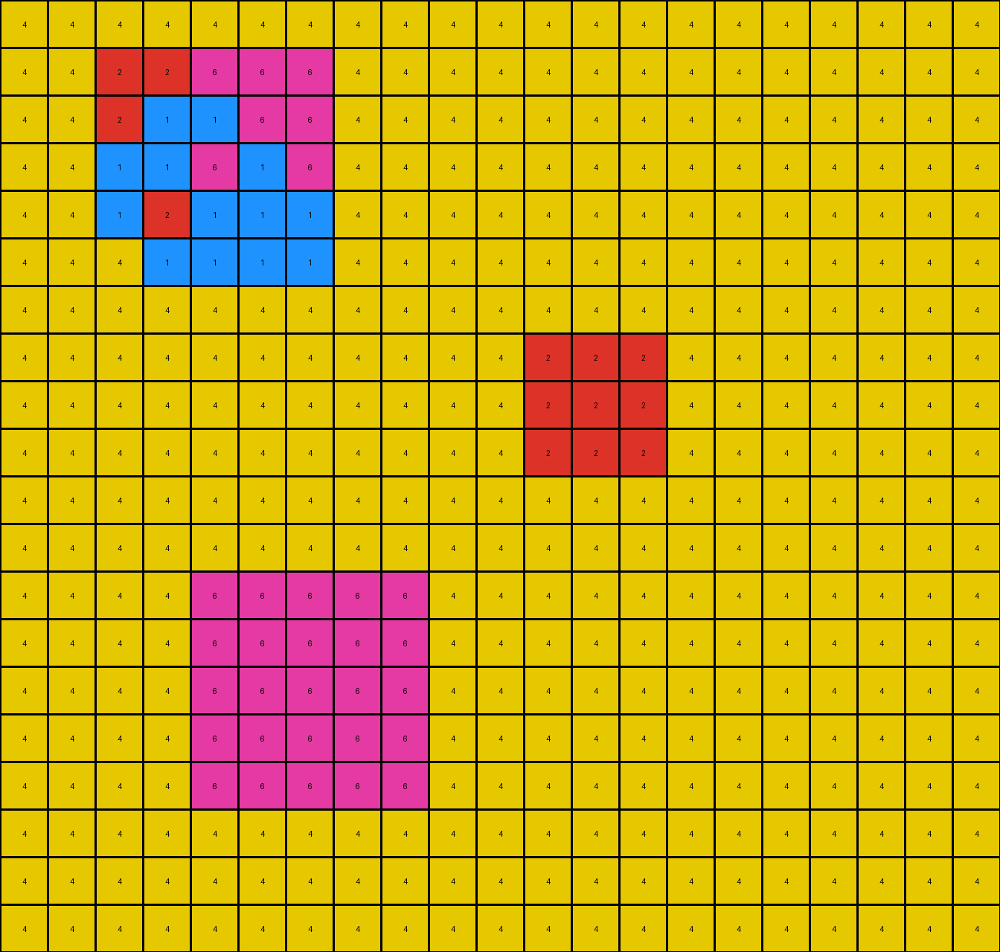

# 6aa20dc0 • 009 • refine_dreamer

---


Previous Code:
```python
"""
Transforms an input grid by expanding colored shapes based on their adjacency to other shapes.

1. **Identify Objects:** Locate all contiguous regions of non-yellow pixels. These are the "colored shapes." Each shape is identified by its unique color (1, 2, or 6).

2. **Detect Contact Points:** For each colored shape, examine its perimeter (both side-by-side and diagonal neighbors). Identify any pixels where different colored shapes are adjacent.

3. **Conditional Expansion - Blue (1):** If a blue shape touches another blue shape, do not expand the blue shape at that adjacency. If a blue shape touches shapes of a *different* color, then fill all adjacent yellow cells in the *entire grid* with the same color and value as the original colored shape.

4. **Conditional Expansion - Red (2):** If a red shape touches other shapes of a *different* color, then extend a single continuous perimeter of the red shape around the the touching shape.

5. **Conditional Expansion - Magenta (6):** If a magenta shape touches shapes of a *different* color, then fill any immediately adjacent yellow cells with the color of the magenta shape.

6. **Background:** All remaining pixels retain their original yellow (4) color.

"""

import numpy as np

def get_objects(grid):
    """
    Finds all contiguous regions of non-yellow pixels, identifying them as distinct objects.
    """
    objects = {}
    visited = np.zeros_like(grid, dtype=bool)
    rows, cols = grid.shape

    def dfs(r, c, color, obj_id):
        if (r < 0 or r >= rows or c < 0 or c >= cols or visited[r, c] or grid[r, c] != color):
            return
        visited[r, c] = True
        objects[obj_id]['pixels'].append((r, c))
        dfs(r + 1, c, color, obj_id)
        dfs(r - 1, c, color, obj_id)
        dfs(r, c + 1, color, obj_id)
        dfs(r, c - 1, color, obj_id)
        dfs(r + 1, c + 1, color, obj_id)
        dfs(r - 1, c - 1, color, obj_id)
        dfs(r + 1, c - 1, color, obj_id)
        dfs(r - 1, c + 1, color, obj_id)


    obj_id_counter = 0
    for r in range(rows):
        for c in range(cols):
            if grid[r, c] != 4 and not visited[r, c]:
                objects[obj_id_counter] = {'color': grid[r, c], 'pixels': []}
                dfs(r, c, grid[r, c], obj_id_counter)
                obj_id_counter += 1
    return objects

def get_neighbors(grid, r, c):
    """Returns a list of (row, col) tuples for all 8 neighbors of a pixel."""
    rows, cols = grid.shape
    neighbors = []
    for i in range(-1, 2):
        for j in range(-1, 2):
            if i == 0 and j == 0:
                continue
            nr, nc = r + i, c + j
            if 0 <= nr < rows and 0 <= nc < cols:
                neighbors.append((nr, nc))
    return neighbors

def expand_blue(grid, output_grid, objects):
   """Expands blue shapes based on the contact with different colored shapes."""
   for obj_id, obj_data in objects.items():
       if obj_data['color'] == 1:  # Blue object
           for r, c in obj_data['pixels']:
               neighbors = get_neighbors(grid, r, c)
               for nr, nc in neighbors:
                  if grid[nr,nc] != 4 and grid[nr,nc] != 1:
                     for r_out in range(output_grid.shape[0]):
                        for c_out in range(output_grid.shape[1]):
                           if output_grid[r_out, c_out] == 4:
                              for nr_out, nc_out in get_neighbors(output_grid, r_out, c_out):
                                 if (nr_out, nc_out) in obj_data['pixels']:
                                      output_grid[r_out,c_out] = 1

def expand_red(grid, output_grid, objects):

    for obj_id, obj_data in objects.items():
        if obj_data['color'] == 2:  # Red object
            for r, c in obj_data['pixels']:
                neighbors = get_neighbors(grid, r, c)
                for nr, nc in neighbors:
                    if grid[nr, nc] != 4 and grid[nr, nc] != 2:
                        #find contiguous shape
                        output_grid[r,c] = 2
                        target_obj = None
                        for other_id, other_data in objects.items():
                           if (nr,nc) in other_data['pixels']:
                              target_obj = other_data
                              break
                        #extend perimeter
                        if target_obj:
                            for tr, tc in target_obj['pixels']:
                                 target_neighbors = get_neighbors(grid, tr, tc)
                                 for tnr, tnc in target_neighbors:
                                    if grid[tnr,tnc] == 4:
                                        output_grid[tnr, tnc] = 2
                                        break


def expand_magenta(grid, output_grid, objects):
    """Expands magenta shapes by filling immediately adjacent yellow cells."""
    for obj_id, obj_data in objects.items():
        if obj_data['color'] == 6:  # Magenta object
            for r, c in obj_data['pixels']:
                neighbors = get_neighbors(grid, r, c)
                for nr, nc in neighbors:
                    if grid[nr, nc] == 4:  # Adjacent to yellow
                        output_grid[nr, nc] = 6


def transform(input_grid):
    # initialize output_grid
    output_grid = np.copy(input_grid)
    objects = get_objects(input_grid)
    expand_blue(input_grid, output_grid, objects)
    expand_red(input_grid, output_grid, objects)
    expand_magenta(input_grid, output_grid, objects)


    return output_grid
```

Train Set Results:

## Example 1:

Input:
```
1 1 1 1 1 1 1 1 1 1 1 1 1 1 1 1 1 1 1
1 1 1 1 1 1 1 1 1 1 1 1 1 2 1 1 1 1 1
1 1 1 1 1 1 1 1 1 1 1 1 1 1 1 1 1 1 1
1 1 1 1 1 1 1 1 1 1 1 1 1 1 1 3 1 1 1
1 1 1 1 1 2 8 8 1 1 1 1 1 1 1 1 1 1 1
1 1 1 1 1 8 8 1 1 1 1 1 1 1 1 1 1 1 1
1 1 1 1 1 8 1 3 1 1 1 1 1 1 1 1 1 1 1
1 1 1 1 1 1 1 1 1 1 1 1 1 1 1 1 1 1 1
1 1 1 1 1 1 1 1 1 1 1 1 1 1 1 1 1 1 1
1 1 1 1 1 1 1 1 1 1 1 1 1 1 1 1 1 1 1
1 1 1 1 1 1 1 1 1 1 1 1 1 1 1 1 1 1 1
1 1 1 1 1 1 1 1 1 2 2 1 1 1 1 1 1 1 1
1 1 1 1 1 1 1 1 1 2 2 1 1 1 1 1 1 1 1
1 1 1 1 1 1 1 1 1 1 1 1 1 1 1 1 1 1 1
1 1 1 1 1 1 1 1 1 1 1 1 1 1 1 1 1 1 1
1 1 1 1 1 3 3 1 1 1 1 1 1 1 1 1 1 1 1
1 1 1 1 1 3 3 1 1 1 1 1 1 1 1 1 1 1 1
1 1 1 1 1 1 1 1 1 1 1 1 1 1 1 1 1 1 1
1 1 1 1 1 1 1 1 1 1 1 1 1 1 1 1 1 1 1
1 1 1 1 1 1 1 1 1 1 1 1 1 1 1 1 1 1 1
```
Expected Output:
```
1 1 1 1 1 1 1 1 1 1 1 1 1 1 1 1 1 1 1
1 1 1 1 1 1 1 1 1 1 1 1 1 2 8 8 1 1 1
1 1 1 1 1 1 1 1 1 1 1 1 1 8 8 1 1 1 1
1 1 1 1 1 1 1 1 1 1 1 1 1 8 1 3 1 1 1
1 1 1 1 1 2 8 8 1 1 1 1 1 1 1 1 1 1 1
1 1 1 1 1 8 8 1 1 1 1 1 1 1 1 1 1 1 1
1 1 1 1 1 8 1 3 1 1 1 1 1 1 1 1 1 1 1
1 1 1 1 1 1 1 1 1 1 1 1 1 1 1 1 1 1 1
1 1 1 1 1 1 1 1 1 1 1 1 1 1 1 1 1 1 1
1 1 1 1 1 1 1 1 1 1 1 1 1 1 1 1 1 1 1
1 1 1 1 1 1 1 1 1 1 1 1 1 1 1 1 1 1 1
1 1 1 1 1 8 8 8 8 2 2 1 1 1 1 1 1 1 1
1 1 1 1 1 8 8 8 8 2 2 1 1 1 1 1 1 1 1
1 1 1 1 1 1 1 8 8 8 8 1 1 1 1 1 1 1 1
1 1 1 1 1 1 1 8 8 8 8 1 1 1 1 1 1 1 1
1 1 1 1 1 3 3 1 1 8 8 1 1 1 1 1 1 1 1
1 1 1 1 1 3 3 1 1 8 8 1 1 1 1 1 1 1 1
1 1 1 1 1 1 1 1 1 1 1 1 1 1 1 1 1 1 1
1 1 1 1 1 1 1 1 1 1 1 1 1 1 1 1 1 1 1
1 1 1 1 1 1 1 1 1 1 1 1 1 1 1 1 1 1 1
```
Transformed Output:
```
1 1 1 1 1 1 1 1 1 1 1 1 1 1 1 1 1 1 1
1 1 1 1 1 1 1 1 1 1 1 1 1 2 1 1 1 1 1
1 1 1 1 1 1 1 1 1 1 1 1 1 1 1 1 1 1 1
1 1 1 1 1 1 1 1 1 1 1 1 1 1 1 3 1 1 1
1 1 1 1 1 2 8 8 1 1 1 1 1 1 1 1 1 1 1
1 1 1 1 1 8 8 1 1 1 1 1 1 1 1 1 1 1 1
1 1 1 1 1 8 1 3 1 1 1 1 1 1 1 1 1 1 1
1 1 1 1 1 1 1 1 1 1 1 1 1 1 1 1 1 1 1
1 1 1 1 1 1 1 1 1 1 1 1 1 1 1 1 1 1 1
1 1 1 1 1 1 1 1 1 1 1 1 1 1 1 1 1 1 1
1 1 1 1 1 1 1 1 1 1 1 1 1 1 1 1 1 1 1
1 1 1 1 1 1 1 1 1 2 2 1 1 1 1 1 1 1 1
1 1 1 1 1 1 1 1 1 2 2 1 1 1 1 1 1 1 1
1 1 1 1 1 1 1 1 1 1 1 1 1 1 1 1 1 1 1
1 1 1 1 1 1 1 1 1 1 1 1 1 1 1 1 1 1 1
1 1 1 1 1 3 3 1 1 1 1 1 1 1 1 1 1 1 1
1 1 1 1 1 3 3 1 1 1 1 1 1 1 1 1 1 1 1
1 1 1 1 1 1 1 1 1 1 1 1 1 1 1 1 1 1 1
1 1 1 1 1 1 1 1 1 1 1 1 1 1 1 1 1 1 1
1 1 1 1 1 1 1 1 1 1 1 1 1 1 1 1 1 1 1
```

match: False
pixels_off: 25
size_correct: True
color_palette_correct: True
correct_pixel_counts: False

## Example 2:

Input:
```
4 4 4 4 4 4 4 4 4 4 4 4 4 4 4 4 4 4 4 4 4
4 4 4 4 4 4 4 4 4 4 4 4 4 4 4 4 4 4 4 4 4
4 4 4 1 1 6 4 4 4 4 4 4 4 4 4 4 4 4 4 4 4
4 4 4 1 4 1 4 4 4 4 4 4 4 4 4 4 4 4 4 4 4
4 4 4 2 1 1 4 4 4 4 4 4 4 4 4 4 4 4 4 4 4
4 4 4 4 4 4 4 4 4 4 4 4 4 4 4 4 4 4 4 4 4
4 4 4 4 4 4 4 4 4 4 4 4 4 4 4 4 4 4 4 4 4
4 4 4 4 4 4 4 4 4 4 4 2 2 2 4 4 4 4 4 4 4
4 4 4 4 4 4 4 4 4 4 4 2 2 2 4 4 4 4 4 4 4
4 4 4 4 4 4 4 4 4 4 4 2 2 2 4 4 4 4 4 4 4
4 4 4 4 4 4 4 4 4 4 4 4 4 4 4 4 4 4 4 4 4
4 4 4 4 4 4 4 4 4 4 4 4 4 4 4 4 4 4 4 4 4
4 4 4 4 4 4 4 4 4 4 4 4 4 4 4 4 4 4 4 4 4
4 4 4 4 4 6 6 6 4 4 4 4 4 4 4 4 4 4 4 4 4
4 4 4 4 4 6 6 6 4 4 4 4 4 4 4 4 4 4 4 4 4
4 4 4 4 4 6 6 6 4 4 4 4 4 4 4 4 4 4 4 4 4
4 4 4 4 4 4 4 4 4 4 4 4 4 4 4 4 4 4 4 4 4
4 4 4 4 4 4 4 4 4 4 4 4 4 4 4 4 4 4 4 4 4
4 4 4 4 4 4 4 4 4 4 4 4 4 4 4 4 4 4 4 4 4
4 4 4 4 4 4 4 4 4 4 4 4 4 4 4 4 4 4 4 4 4
```
Expected Output:
```
4 4 4 4 4 4 4 4 4 4 4 4 4 4 4 4 4 4 4 4 4
4 4 4 4 4 4 4 4 4 4 4 4 4 4 4 4 4 4 4 4 4
4 4 4 1 1 6 4 4 4 4 4 4 4 4 4 4 4 4 4 4 4
4 4 4 1 4 1 4 4 4 4 4 4 4 4 4 4 4 4 4 4 4
4 4 4 2 1 1 4 4 4 4 4 4 4 4 4 4 4 4 4 4 4
4 4 4 4 4 4 4 4 4 4 4 4 4 4 4 4 4 4 4 4 4
4 4 4 4 4 4 4 4 4 4 4 4 4 4 4 4 4 4 4 4 4
4 4 4 4 4 1 1 1 1 1 1 2 2 2 4 4 4 4 4 4 4
4 4 4 4 4 1 1 1 1 1 1 2 2 2 4 4 4 4 4 4 4
4 4 4 4 4 1 1 1 1 1 1 2 2 2 4 4 4 4 4 4 4
4 4 4 4 4 1 1 1 4 4 4 1 1 1 4 4 4 4 4 4 4
4 4 4 4 4 1 1 1 4 4 4 1 1 1 4 4 4 4 4 4 4
4 4 4 4 4 1 1 1 4 4 4 1 1 1 4 4 4 4 4 4 4
4 4 4 4 4 6 6 6 1 1 1 1 1 1 4 4 4 4 4 4 4
4 4 4 4 4 6 6 6 1 1 1 1 1 1 4 4 4 4 4 4 4
4 4 4 4 4 6 6 6 1 1 1 1 1 1 4 4 4 4 4 4 4
4 4 4 4 4 4 4 4 4 4 4 4 4 4 4 4 4 4 4 4 4
4 4 4 4 4 4 4 4 4 4 4 4 4 4 4 4 4 4 4 4 4
4 4 4 4 4 4 4 4 4 4 4 4 4 4 4 4 4 4 4 4 4
4 4 4 4 4 4 4 4 4 4 4 4 4 4 4 4 4 4 4 4 4
```
Transformed Output:
```
4 4 4 4 4 4 4 4 4 4 4 4 4 4 4 4 4 4 4 4 4
4 4 2 2 6 6 6 4 4 4 4 4 4 4 4 4 4 4 4 4 4
4 4 2 1 1 6 6 4 4 4 4 4 4 4 4 4 4 4 4 4 4
4 4 1 1 6 1 6 4 4 4 4 4 4 4 4 4 4 4 4 4 4
4 4 1 2 1 1 1 4 4 4 4 4 4 4 4 4 4 4 4 4 4
4 4 4 1 1 1 1 4 4 4 4 4 4 4 4 4 4 4 4 4 4
4 4 4 4 4 4 4 4 4 4 4 4 4 4 4 4 4 4 4 4 4
4 4 4 4 4 4 4 4 4 4 4 2 2 2 4 4 4 4 4 4 4
4 4 4 4 4 4 4 4 4 4 4 2 2 2 4 4 4 4 4 4 4
4 4 4 4 4 4 4 4 4 4 4 2 2 2 4 4 4 4 4 4 4
4 4 4 4 4 4 4 4 4 4 4 4 4 4 4 4 4 4 4 4 4
4 4 4 4 4 4 4 4 4 4 4 4 4 4 4 4 4 4 4 4 4
4 4 4 4 6 6 6 6 6 4 4 4 4 4 4 4 4 4 4 4 4
4 4 4 4 6 6 6 6 6 4 4 4 4 4 4 4 4 4 4 4 4
4 4 4 4 6 6 6 6 6 4 4 4 4 4 4 4 4 4 4 4 4
4 4 4 4 6 6 6 6 6 4 4 4 4 4 4 4 4 4 4 4 4
4 4 4 4 6 6 6 6 6 4 4 4 4 4 4 4 4 4 4 4 4
4 4 4 4 4 4 4 4 4 4 4 4 4 4 4 4 4 4 4 4 4
4 4 4 4 4 4 4 4 4 4 4 4 4 4 4 4 4 4 4 4 4
4 4 4 4 4 4 4 4 4 4 4 4 4 4 4 4 4 4 4 4 4
```

match: False
pixels_off: 80
size_correct: True
color_palette_correct: True
correct_pixel_counts: False

## Example 3:

Input:
```
8 8 8 8 8 8 8 8 8 8 8 8 8 8 8 8 8 8 8 8 8 8
8 8 8 8 8 8 8 8 8 8 8 8 8 8 8 8 8 8 8 8 8 8
8 8 8 8 8 8 8 8 8 8 8 8 8 8 8 8 8 8 8 8 8 8
8 8 8 8 8 8 8 8 8 8 8 8 8 8 8 8 8 8 8 8 8 8
8 8 8 8 8 8 8 8 8 8 8 8 8 8 8 8 8 8 8 8 8 8
8 8 8 8 8 8 2 3 8 8 8 8 8 8 8 8 8 8 8 8 8 8
8 8 8 8 8 8 3 3 3 8 8 8 8 8 8 8 8 8 8 8 8 8
8 8 8 8 8 8 8 3 4 8 8 8 8 8 8 8 8 8 8 8 8 8
8 8 8 8 8 8 8 8 8 8 8 8 8 8 8 8 8 8 8 8 8 8
8 8 8 8 8 8 8 8 8 8 8 8 8 8 8 8 8 8 8 8 8 8
8 8 8 8 8 8 8 8 8 8 8 8 8 4 8 8 8 8 8 8 8 8
8 8 8 8 8 8 8 8 8 8 8 8 8 8 8 8 8 8 8 8 8 8
8 8 8 8 8 8 8 8 8 8 8 8 8 8 8 2 8 8 8 8 8 8
8 8 8 8 8 8 8 8 8 8 8 8 8 8 8 8 8 8 8 8 8 8
8 8 8 8 8 8 8 2 8 8 8 8 8 8 8 8 8 8 8 8 8 8
8 8 8 8 8 8 8 8 8 8 8 8 8 8 8 8 8 8 8 8 8 8
8 8 8 8 8 4 8 8 8 8 8 8 8 8 8 8 8 8 8 8 8 8
8 8 8 8 8 8 8 8 8 8 8 8 8 8 8 8 8 8 8 8 8 8
8 8 8 8 8 8 8 8 8 8 8 8 8 8 8 8 8 8 8 8 8 8
8 8 8 8 8 8 8 8 8 8 8 8 8 8 8 8 8 8 8 8 8 8
8 8 8 8 8 8 8 8 8 8 8 8 8 8 8 8 8 8 8 8 8 8
```
Expected Output:
```
8 8 8 8 8 8 8 8 8 8 8 8 8 8 8 8 8 8 8 8 8 8
8 8 8 8 8 8 8 8 8 8 8 8 8 8 8 8 8 8 8 8 8 8
8 8 8 8 8 8 8 8 8 8 8 8 8 8 8 8 8 8 8 8 8 8
8 8 8 8 8 8 8 8 8 8 8 8 8 8 8 8 8 8 8 8 8 8
8 8 8 8 8 8 8 8 8 8 8 8 8 8 8 8 8 8 8 8 8 8
8 8 8 8 8 8 2 3 8 8 8 8 8 8 8 8 8 8 8 8 8 8
8 8 8 8 8 8 3 3 3 8 8 8 8 8 8 8 8 8 8 8 8 8
8 8 8 8 8 8 8 3 4 8 8 8 8 8 8 8 8 8 8 8 8 8
8 8 8 8 8 8 8 8 8 8 8 8 8 8 8 8 8 8 8 8 8 8
8 8 8 8 8 8 8 8 8 8 8 8 8 8 8 8 8 8 8 8 8 8
8 8 8 8 8 8 8 8 8 8 8 8 8 4 3 8 8 8 8 8 8 8
8 8 8 8 8 8 8 8 8 8 8 8 8 3 3 3 8 8 8 8 8 8
8 8 8 8 8 8 8 8 8 8 8 8 8 8 3 2 8 8 8 8 8 8
8 8 8 8 8 8 8 8 8 8 8 8 8 8 8 8 8 8 8 8 8 8
8 8 8 8 8 8 3 2 8 8 8 8 8 8 8 8 8 8 8 8 8 8
8 8 8 8 8 3 3 3 8 8 8 8 8 8 8 8 8 8 8 8 8 8
8 8 8 8 8 4 3 8 8 8 8 8 8 8 8 8 8 8 8 8 8 8
8 8 8 8 8 8 8 8 8 8 8 8 8 8 8 8 8 8 8 8 8 8
8 8 8 8 8 8 8 8 8 8 8 8 8 8 8 8 8 8 8 8 8 8
8 8 8 8 8 8 8 8 8 8 8 8 8 8 8 8 8 8 8 8 8 8
8 8 8 8 8 8 8 8 8 8 8 8 8 8 8 8 8 8 8 8 8 8
```
Transformed Output:
```
8 8 8 8 8 8 8 8 8 8 8 8 8 8 8 8 8 8 8 8 8 8
8 8 8 8 8 8 8 8 8 8 8 8 8 8 8 8 8 8 8 8 8 8
8 8 8 8 8 8 8 8 8 8 8 8 8 8 8 8 8 8 8 8 8 8
8 8 8 8 8 8 8 8 8 8 8 8 8 8 8 8 8 8 8 8 8 8
8 8 8 8 8 8 8 8 8 8 8 8 8 8 8 8 8 8 8 8 8 8
8 8 8 8 8 8 2 3 8 8 8 8 8 8 8 8 8 8 8 8 8 8
8 8 8 8 8 8 3 3 3 8 8 8 8 8 8 8 8 8 8 8 8 8
8 8 8 8 8 8 8 3 2 8 8 8 8 8 8 8 8 8 8 8 8 8
8 8 8 8 8 8 8 8 8 8 8 8 8 8 8 8 8 8 8 8 8 8
8 8 8 8 8 8 8 8 8 8 8 8 8 8 8 8 8 8 8 8 8 8
8 8 8 8 8 8 8 8 8 8 8 8 8 2 8 8 8 8 8 8 8 8
8 8 8 8 8 8 8 8 8 8 8 8 8 8 8 8 8 8 8 8 8 8
8 8 8 8 8 8 8 8 8 8 8 8 8 8 8 2 8 8 8 8 8 8
8 8 8 8 8 8 8 8 8 8 8 8 8 8 8 8 8 8 8 8 8 8
8 8 8 8 8 8 8 2 8 8 8 8 8 8 8 8 8 8 8 8 8 8
8 8 8 8 8 8 8 8 8 8 8 8 8 8 8 8 8 8 8 8 8 8
8 8 8 8 8 2 8 8 8 8 8 8 8 8 8 8 8 8 8 8 8 8
8 8 8 8 8 8 8 8 8 8 8 8 8 8 8 8 8 8 8 8 8 8
8 8 8 8 8 8 8 8 8 8 8 8 8 8 8 8 8 8 8 8 8 8
8 8 8 8 8 8 8 8 8 8 8 8 8 8 8 8 8 8 8 8 8 8
8 8 8 8 8 8 8 8 8 8 8 8 8 8 8 8 8 8 8 8 8 8
```

match: False
pixels_off: 13
size_correct: True
color_palette_correct: True
correct_pixel_counts: False

**INSTRUCTIONS**

The code above was generated based on observations from the first training
example

we have tested the transform function on each of the task example inputs and
compared with the expected output

review each of the examples provided and the results and consider how the
natural language program should be updated to accommodate this new knowledge

respond with the following deliverables:

- general assessment of the information provided and strategy for resolving the
  errors
- gather metrics about each of the examples and results - use code_execution to
  develop accurate reports on your assumptions
- a YAML block documenting facts - Focus on identifying objects, their properties, and the actions performed on them.
- a natural language program - Be as clear and concise as possible, providing a complete description of the transformation rule.


your responses should be considered as information in a report - not a
conversation
