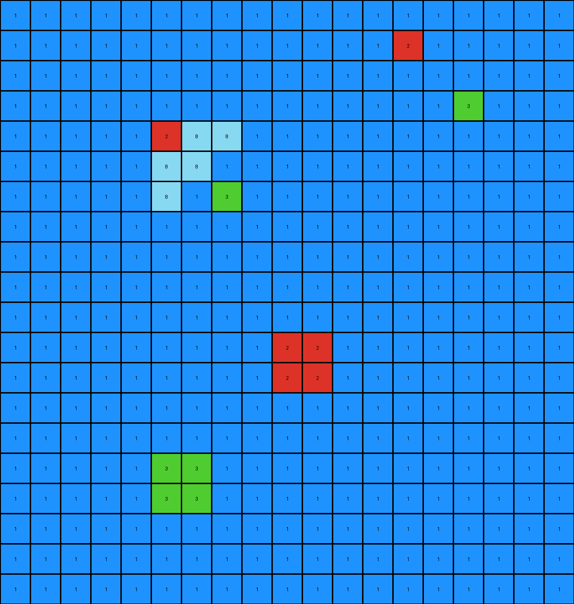
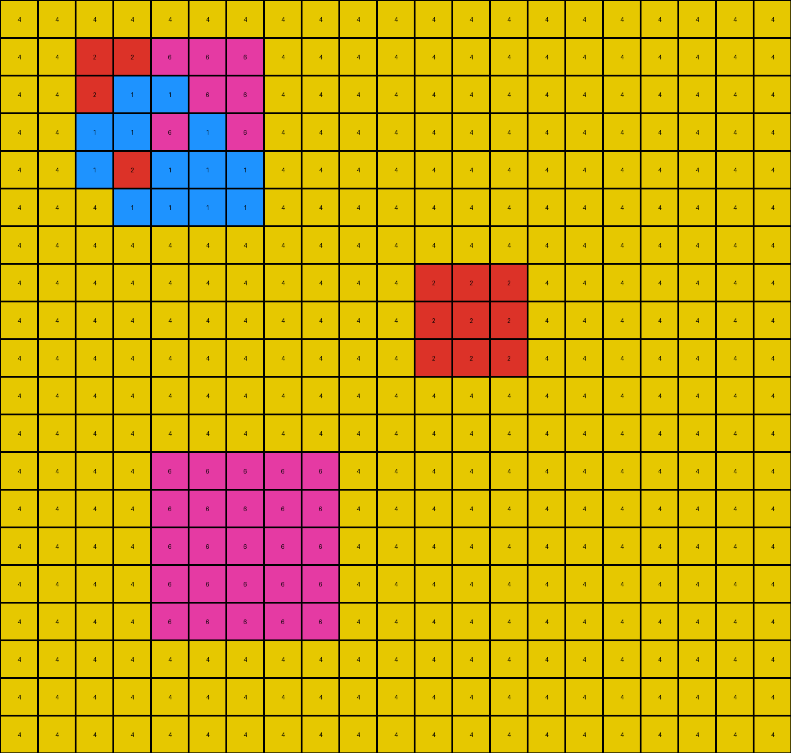

# 6aa20dc0 • 010 • refine_coder

---

Previous Code:
```python
"""
Transforms an input grid by expanding colored shapes based on their adjacency to other shapes.

1. **Identify Objects:** Locate all contiguous regions of non-yellow pixels. These are the "colored shapes." Each shape is identified by its unique color (1, 2, or 6).

2. **Detect Contact Points:** For each colored shape, examine its perimeter (both side-by-side and diagonal neighbors). Identify any pixels where different colored shapes are adjacent.

3. **Conditional Expansion - Blue (1):** If a blue shape touches another blue shape, do not expand the blue shape at that adjacency. If a blue shape touches shapes of a *different* color, then fill all adjacent yellow cells in the *entire grid* with the same color and value as the original colored shape.

4. **Conditional Expansion - Red (2):** If a red shape touches other shapes of a *different* color, then extend a single continuous perimeter of the red shape around the the touching shape.

5. **Conditional Expansion - Magenta (6):** If a magenta shape touches shapes of a *different* color, then fill any immediately adjacent yellow cells with the color of the magenta shape.

6. **Background:** All remaining pixels retain their original yellow (4) color.

"""

import numpy as np

def get_objects(grid):
    """
    Finds all contiguous regions of non-yellow pixels, identifying them as distinct objects.
    """
    objects = {}
    visited = np.zeros_like(grid, dtype=bool)
    rows, cols = grid.shape

    def dfs(r, c, color, obj_id):
        if (r < 0 or r >= rows or c < 0 or c >= cols or visited[r, c] or grid[r, c] != color):
            return
        visited[r, c] = True
        objects[obj_id]['pixels'].append((r, c))
        dfs(r + 1, c, color, obj_id)
        dfs(r - 1, c, color, obj_id)
        dfs(r, c + 1, color, obj_id)
        dfs(r, c - 1, color, obj_id)
        dfs(r + 1, c + 1, color, obj_id)
        dfs(r - 1, c - 1, color, obj_id)
        dfs(r + 1, c - 1, color, obj_id)
        dfs(r - 1, c + 1, color, obj_id)


    obj_id_counter = 0
    for r in range(rows):
        for c in range(cols):
            if grid[r, c] != 4 and not visited[r, c]:
                objects[obj_id_counter] = {'color': grid[r, c], 'pixels': []}
                dfs(r, c, grid[r, c], obj_id_counter)
                obj_id_counter += 1
    return objects

def get_neighbors(grid, r, c):
    """Returns a list of (row, col) tuples for all 8 neighbors of a pixel."""
    rows, cols = grid.shape
    neighbors = []
    for i in range(-1, 2):
        for j in range(-1, 2):
            if i == 0 and j == 0:
                continue
            nr, nc = r + i, c + j
            if 0 <= nr < rows and 0 <= nc < cols:
                neighbors.append((nr, nc))
    return neighbors

def expand_blue(grid, output_grid, objects):
   """Expands blue shapes based on the contact with different colored shapes."""
   for obj_id, obj_data in objects.items():
       if obj_data['color'] == 1:  # Blue object
           for r, c in obj_data['pixels']:
               neighbors = get_neighbors(grid, r, c)
               for nr, nc in neighbors:
                  if grid[nr,nc] != 4 and grid[nr,nc] != 1:
                     for r_out in range(output_grid.shape[0]):
                        for c_out in range(output_grid.shape[1]):
                           if output_grid[r_out, c_out] == 4:
                              for nr_out, nc_out in get_neighbors(output_grid, r_out, c_out):
                                 if (nr_out, nc_out) in obj_data['pixels']:
                                      output_grid[r_out,c_out] = 1

def expand_red(grid, output_grid, objects):

    for obj_id, obj_data in objects.items():
        if obj_data['color'] == 2:  # Red object
            for r, c in obj_data['pixels']:
                neighbors = get_neighbors(grid, r, c)
                for nr, nc in neighbors:
                    if grid[nr, nc] != 4 and grid[nr, nc] != 2:
                        #find contiguous shape
                        output_grid[r,c] = 2
                        target_obj = None
                        for other_id, other_data in objects.items():
                           if (nr,nc) in other_data['pixels']:
                              target_obj = other_data
                              break
                        #extend perimeter
                        if target_obj:
                            for tr, tc in target_obj['pixels']:
                                 target_neighbors = get_neighbors(grid, tr, tc)
                                 for tnr, tnc in target_neighbors:
                                    if grid[tnr,tnc] == 4:
                                        output_grid[tnr, tnc] = 2
                                        break


def expand_magenta(grid, output_grid, objects):
    """Expands magenta shapes by filling immediately adjacent yellow cells."""
    for obj_id, obj_data in objects.items():
        if obj_data['color'] == 6:  # Magenta object
            for r, c in obj_data['pixels']:
                neighbors = get_neighbors(grid, r, c)
                for nr, nc in neighbors:
                    if grid[nr, nc] == 4:  # Adjacent to yellow
                        output_grid[nr, nc] = 6


def transform(input_grid):
    # initialize output_grid
    output_grid = np.copy(input_grid)
    objects = get_objects(input_grid)
    expand_blue(input_grid, output_grid, objects)
    expand_red(input_grid, output_grid, objects)
    expand_magenta(input_grid, output_grid, objects)


    return output_grid
```

Train Set Results:

## Example 1:

Input:
```
1 1 1 1 1 1 1 1 1 1 1 1 1 1 1 1 1 1 1
1 1 1 1 1 1 1 1 1 1 1 1 1 2 1 1 1 1 1
1 1 1 1 1 1 1 1 1 1 1 1 1 1 1 1 1 1 1
1 1 1 1 1 1 1 1 1 1 1 1 1 1 1 3 1 1 1
1 1 1 1 1 2 8 8 1 1 1 1 1 1 1 1 1 1 1
1 1 1 1 1 8 8 1 1 1 1 1 1 1 1 1 1 1 1
1 1 1 1 1 8 1 3 1 1 1 1 1 1 1 1 1 1 1
1 1 1 1 1 1 1 1 1 1 1 1 1 1 1 1 1 1 1
1 1 1 1 1 1 1 1 1 1 1 1 1 1 1 1 1 1 1
1 1 1 1 1 1 1 1 1 1 1 1 1 1 1 1 1 1 1
1 1 1 1 1 1 1 1 1 1 1 1 1 1 1 1 1 1 1
1 1 1 1 1 1 1 1 1 2 2 1 1 1 1 1 1 1 1
1 1 1 1 1 1 1 1 1 2 2 1 1 1 1 1 1 1 1
1 1 1 1 1 1 1 1 1 1 1 1 1 1 1 1 1 1 1
1 1 1 1 1 1 1 1 1 1 1 1 1 1 1 1 1 1 1
1 1 1 1 1 3 3 1 1 1 1 1 1 1 1 1 1 1 1
1 1 1 1 1 3 3 1 1 1 1 1 1 1 1 1 1 1 1
1 1 1 1 1 1 1 1 1 1 1 1 1 1 1 1 1 1 1
1 1 1 1 1 1 1 1 1 1 1 1 1 1 1 1 1 1 1
1 1 1 1 1 1 1 1 1 1 1 1 1 1 1 1 1 1 1
```
Expected Output:
```
1 1 1 1 1 1 1 1 1 1 1 1 1 1 1 1 1 1 1
1 1 1 1 1 1 1 1 1 1 1 1 1 2 8 8 1 1 1
1 1 1 1 1 1 1 1 1 1 1 1 1 8 8 1 1 1 1
1 1 1 1 1 1 1 1 1 1 1 1 1 8 1 3 1 1 1
1 1 1 1 1 2 8 8 1 1 1 1 1 1 1 1 1 1 1
1 1 1 1 1 8 8 1 1 1 1 1 1 1 1 1 1 1 1
1 1 1 1 1 8 1 3 1 1 1 1 1 1 1 1 1 1 1
1 1 1 1 1 1 1 1 1 1 1 1 1 1 1 1 1 1 1
1 1 1 1 1 1 1 1 1 1 1 1 1 1 1 1 1 1 1
1 1 1 1 1 1 1 1 1 1 1 1 1 1 1 1 1 1 1
1 1 1 1 1 1 1 1 1 1 1 1 1 1 1 1 1 1 1
1 1 1 1 1 8 8 8 8 2 2 1 1 1 1 1 1 1 1
1 1 1 1 1 8 8 8 8 2 2 1 1 1 1 1 1 1 1
1 1 1 1 1 1 1 8 8 8 8 1 1 1 1 1 1 1 1
1 1 1 1 1 1 1 8 8 8 8 1 1 1 1 1 1 1 1
1 1 1 1 1 3 3 1 1 8 8 1 1 1 1 1 1 1 1
1 1 1 1 1 3 3 1 1 8 8 1 1 1 1 1 1 1 1
1 1 1 1 1 1 1 1 1 1 1 1 1 1 1 1 1 1 1
1 1 1 1 1 1 1 1 1 1 1 1 1 1 1 1 1 1 1
1 1 1 1 1 1 1 1 1 1 1 1 1 1 1 1 1 1 1
```
Transformed Output:
```
1 1 1 1 1 1 1 1 1 1 1 1 1 1 1 1 1 1 1
1 1 1 1 1 1 1 1 1 1 1 1 1 2 1 1 1 1 1
1 1 1 1 1 1 1 1 1 1 1 1 1 1 1 1 1 1 1
1 1 1 1 1 1 1 1 1 1 1 1 1 1 1 3 1 1 1
1 1 1 1 1 2 8 8 1 1 1 1 1 1 1 1 1 1 1
1 1 1 1 1 8 8 1 1 1 1 1 1 1 1 1 1 1 1
1 1 1 1 1 8 1 3 1 1 1 1 1 1 1 1 1 1 1
1 1 1 1 1 1 1 1 1 1 1 1 1 1 1 1 1 1 1
1 1 1 1 1 1 1 1 1 1 1 1 1 1 1 1 1 1 1
1 1 1 1 1 1 1 1 1 1 1 1 1 1 1 1 1 1 1
1 1 1 1 1 1 1 1 1 1 1 1 1 1 1 1 1 1 1
1 1 1 1 1 1 1 1 1 2 2 1 1 1 1 1 1 1 1
1 1 1 1 1 1 1 1 1 2 2 1 1 1 1 1 1 1 1
1 1 1 1 1 1 1 1 1 1 1 1 1 1 1 1 1 1 1
1 1 1 1 1 1 1 1 1 1 1 1 1 1 1 1 1 1 1
1 1 1 1 1 3 3 1 1 1 1 1 1 1 1 1 1 1 1
1 1 1 1 1 3 3 1 1 1 1 1 1 1 1 1 1 1 1
1 1 1 1 1 1 1 1 1 1 1 1 1 1 1 1 1 1 1
1 1 1 1 1 1 1 1 1 1 1 1 1 1 1 1 1 1 1
1 1 1 1 1 1 1 1 1 1 1 1 1 1 1 1 1 1 1
```

match: False
pixels_off: 25
size_correct: True
color_palette_correct: True
correct_pixel_counts: False

## Example 2:

Input:
```
4 4 4 4 4 4 4 4 4 4 4 4 4 4 4 4 4 4 4 4 4
4 4 4 4 4 4 4 4 4 4 4 4 4 4 4 4 4 4 4 4 4
4 4 4 1 1 6 4 4 4 4 4 4 4 4 4 4 4 4 4 4 4
4 4 4 1 4 1 4 4 4 4 4 4 4 4 4 4 4 4 4 4 4
4 4 4 2 1 1 4 4 4 4 4 4 4 4 4 4 4 4 4 4 4
4 4 4 4 4 4 4 4 4 4 4 4 4 4 4 4 4 4 4 4 4
4 4 4 4 4 4 4 4 4 4 4 4 4 4 4 4 4 4 4 4 4
4 4 4 4 4 4 4 4 4 4 4 2 2 2 4 4 4 4 4 4 4
4 4 4 4 4 4 4 4 4 4 4 2 2 2 4 4 4 4 4 4 4
4 4 4 4 4 4 4 4 4 4 4 2 2 2 4 4 4 4 4 4 4
4 4 4 4 4 4 4 4 4 4 4 4 4 4 4 4 4 4 4 4 4
4 4 4 4 4 4 4 4 4 4 4 4 4 4 4 4 4 4 4 4 4
4 4 4 4 4 4 4 4 4 4 4 4 4 4 4 4 4 4 4 4 4
4 4 4 4 4 6 6 6 4 4 4 4 4 4 4 4 4 4 4 4 4
4 4 4 4 4 6 6 6 4 4 4 4 4 4 4 4 4 4 4 4 4
4 4 4 4 4 6 6 6 4 4 4 4 4 4 4 4 4 4 4 4 4
4 4 4 4 4 4 4 4 4 4 4 4 4 4 4 4 4 4 4 4 4
4 4 4 4 4 4 4 4 4 4 4 4 4 4 4 4 4 4 4 4 4
4 4 4 4 4 4 4 4 4 4 4 4 4 4 4 4 4 4 4 4 4
4 4 4 4 4 4 4 4 4 4 4 4 4 4 4 4 4 4 4 4 4
```
Expected Output:
```
4 4 4 4 4 4 4 4 4 4 4 4 4 4 4 4 4 4 4 4 4
4 4 4 4 4 4 4 4 4 4 4 4 4 4 4 4 4 4 4 4 4
4 4 4 1 1 6 4 4 4 4 4 4 4 4 4 4 4 4 4 4 4
4 4 4 1 4 1 4 4 4 4 4 4 4 4 4 4 4 4 4 4 4
4 4 4 2 1 1 4 4 4 4 4 4 4 4 4 4 4 4 4 4 4
4 4 4 4 4 4 4 4 4 4 4 4 4 4 4 4 4 4 4 4 4
4 4 4 4 4 4 4 4 4 4 4 4 4 4 4 4 4 4 4 4 4
4 4 4 4 4 1 1 1 1 1 1 2 2 2 4 4 4 4 4 4 4
4 4 4 4 4 1 1 1 1 1 1 2 2 2 4 4 4 4 4 4 4
4 4 4 4 4 1 1 1 1 1 1 2 2 2 4 4 4 4 4 4 4
4 4 4 4 4 1 1 1 4 4 4 1 1 1 4 4 4 4 4 4 4
4 4 4 4 4 1 1 1 4 4 4 1 1 1 4 4 4 4 4 4 4
4 4 4 4 4 1 1 1 4 4 4 1 1 1 4 4 4 4 4 4 4
4 4 4 4 4 6 6 6 1 1 1 1 1 1 4 4 4 4 4 4 4
4 4 4 4 4 6 6 6 1 1 1 1 1 1 4 4 4 4 4 4 4
4 4 4 4 4 6 6 6 1 1 1 1 1 1 4 4 4 4 4 4 4
4 4 4 4 4 4 4 4 4 4 4 4 4 4 4 4 4 4 4 4 4
4 4 4 4 4 4 4 4 4 4 4 4 4 4 4 4 4 4 4 4 4
4 4 4 4 4 4 4 4 4 4 4 4 4 4 4 4 4 4 4 4 4
4 4 4 4 4 4 4 4 4 4 4 4 4 4 4 4 4 4 4 4 4
```
Transformed Output:
```
4 4 4 4 4 4 4 4 4 4 4 4 4 4 4 4 4 4 4 4 4
4 4 2 2 6 6 6 4 4 4 4 4 4 4 4 4 4 4 4 4 4
4 4 2 1 1 6 6 4 4 4 4 4 4 4 4 4 4 4 4 4 4
4 4 1 1 6 1 6 4 4 4 4 4 4 4 4 4 4 4 4 4 4
4 4 1 2 1 1 1 4 4 4 4 4 4 4 4 4 4 4 4 4 4
4 4 4 1 1 1 1 4 4 4 4 4 4 4 4 4 4 4 4 4 4
4 4 4 4 4 4 4 4 4 4 4 4 4 4 4 4 4 4 4 4 4
4 4 4 4 4 4 4 4 4 4 4 2 2 2 4 4 4 4 4 4 4
4 4 4 4 4 4 4 4 4 4 4 2 2 2 4 4 4 4 4 4 4
4 4 4 4 4 4 4 4 4 4 4 2 2 2 4 4 4 4 4 4 4
4 4 4 4 4 4 4 4 4 4 4 4 4 4 4 4 4 4 4 4 4
4 4 4 4 4 4 4 4 4 4 4 4 4 4 4 4 4 4 4 4 4
4 4 4 4 6 6 6 6 6 4 4 4 4 4 4 4 4 4 4 4 4
4 4 4 4 6 6 6 6 6 4 4 4 4 4 4 4 4 4 4 4 4
4 4 4 4 6 6 6 6 6 4 4 4 4 4 4 4 4 4 4 4 4
4 4 4 4 6 6 6 6 6 4 4 4 4 4 4 4 4 4 4 4 4
4 4 4 4 6 6 6 6 6 4 4 4 4 4 4 4 4 4 4 4 4
4 4 4 4 4 4 4 4 4 4 4 4 4 4 4 4 4 4 4 4 4
4 4 4 4 4 4 4 4 4 4 4 4 4 4 4 4 4 4 4 4 4
4 4 4 4 4 4 4 4 4 4 4 4 4 4 4 4 4 4 4 4 4
```

match: False
pixels_off: 80
size_correct: True
color_palette_correct: True
correct_pixel_counts: False

## Example 3:

Input:
```
8 8 8 8 8 8 8 8 8 8 8 8 8 8 8 8 8 8 8 8 8 8
8 8 8 8 8 8 8 8 8 8 8 8 8 8 8 8 8 8 8 8 8 8
8 8 8 8 8 8 8 8 8 8 8 8 8 8 8 8 8 8 8 8 8 8
8 8 8 8 8 8 8 8 8 8 8 8 8 8 8 8 8 8 8 8 8 8
8 8 8 8 8 8 8 8 8 8 8 8 8 8 8 8 8 8 8 8 8 8
8 8 8 8 8 8 2 3 8 8 8 8 8 8 8 8 8 8 8 8 8 8
8 8 8 8 8 8 3 3 3 8 8 8 8 8 8 8 8 8 8 8 8 8
8 8 8 8 8 8 8 3 4 8 8 8 8 8 8 8 8 8 8 8 8 8
8 8 8 8 8 8 8 8 8 8 8 8 8 8 8 8 8 8 8 8 8 8
8 8 8 8 8 8 8 8 8 8 8 8 8 8 8 8 8 8 8 8 8 8
8 8 8 8 8 8 8 8 8 8 8 8 8 4 8 8 8 8 8 8 8 8
8 8 8 8 8 8 8 8 8 8 8 8 8 8 8 8 8 8 8 8 8 8
8 8 8 8 8 8 8 8 8 8 8 8 8 8 8 2 8 8 8 8 8 8
8 8 8 8 8 8 8 8 8 8 8 8 8 8 8 8 8 8 8 8 8 8
8 8 8 8 8 8 8 2 8 8 8 8 8 8 8 8 8 8 8 8 8 8
8 8 8 8 8 8 8 8 8 8 8 8 8 8 8 8 8 8 8 8 8 8
8 8 8 8 8 4 8 8 8 8 8 8 8 8 8 8 8 8 8 8 8 8
8 8 8 8 8 8 8 8 8 8 8 8 8 8 8 8 8 8 8 8 8 8
8 8 8 8 8 8 8 8 8 8 8 8 8 8 8 8 8 8 8 8 8 8
8 8 8 8 8 8 8 8 8 8 8 8 8 8 8 8 8 8 8 8 8 8
8 8 8 8 8 8 8 8 8 8 8 8 8 8 8 8 8 8 8 8 8 8
```
Expected Output:
```
8 8 8 8 8 8 8 8 8 8 8 8 8 8 8 8 8 8 8 8 8 8
8 8 8 8 8 8 8 8 8 8 8 8 8 8 8 8 8 8 8 8 8 8
8 8 8 8 8 8 8 8 8 8 8 8 8 8 8 8 8 8 8 8 8 8
8 8 8 8 8 8 8 8 8 8 8 8 8 8 8 8 8 8 8 8 8 8
8 8 8 8 8 8 8 8 8 8 8 8 8 8 8 8 8 8 8 8 8 8
8 8 8 8 8 8 2 3 8 8 8 8 8 8 8 8 8 8 8 8 8 8
8 8 8 8 8 8 3 3 3 8 8 8 8 8 8 8 8 8 8 8 8 8
8 8 8 8 8 8 8 3 4 8 8 8 8 8 8 8 8 8 8 8 8 8
8 8 8 8 8 8 8 8 8 8 8 8 8 8 8 8 8 8 8 8 8 8
8 8 8 8 8 8 8 8 8 8 8 8 8 8 8 8 8 8 8 8 8 8
8 8 8 8 8 8 8 8 8 8 8 8 8 4 3 8 8 8 8 8 8 8
8 8 8 8 8 8 8 8 8 8 8 8 8 3 3 3 8 8 8 8 8 8
8 8 8 8 8 8 8 8 8 8 8 8 8 8 3 2 8 8 8 8 8 8
8 8 8 8 8 8 8 8 8 8 8 8 8 8 8 8 8 8 8 8 8 8
8 8 8 8 8 8 3 2 8 8 8 8 8 8 8 8 8 8 8 8 8 8
8 8 8 8 8 3 3 3 8 8 8 8 8 8 8 8 8 8 8 8 8 8
8 8 8 8 8 4 3 8 8 8 8 8 8 8 8 8 8 8 8 8 8 8
8 8 8 8 8 8 8 8 8 8 8 8 8 8 8 8 8 8 8 8 8 8
8 8 8 8 8 8 8 8 8 8 8 8 8 8 8 8 8 8 8 8 8 8
8 8 8 8 8 8 8 8 8 8 8 8 8 8 8 8 8 8 8 8 8 8
8 8 8 8 8 8 8 8 8 8 8 8 8 8 8 8 8 8 8 8 8 8
```
Transformed Output:
```
8 8 8 8 8 8 8 8 8 8 8 8 8 8 8 8 8 8 8 8 8 8
8 8 8 8 8 8 8 8 8 8 8 8 8 8 8 8 8 8 8 8 8 8
8 8 8 8 8 8 8 8 8 8 8 8 8 8 8 8 8 8 8 8 8 8
8 8 8 8 8 8 8 8 8 8 8 8 8 8 8 8 8 8 8 8 8 8
8 8 8 8 8 8 8 8 8 8 8 8 8 8 8 8 8 8 8 8 8 8
8 8 8 8 8 8 2 3 8 8 8 8 8 8 8 8 8 8 8 8 8 8
8 8 8 8 8 8 3 3 3 8 8 8 8 8 8 8 8 8 8 8 8 8
8 8 8 8 8 8 8 3 2 8 8 8 8 8 8 8 8 8 8 8 8 8
8 8 8 8 8 8 8 8 8 8 8 8 8 8 8 8 8 8 8 8 8 8
8 8 8 8 8 8 8 8 8 8 8 8 8 8 8 8 8 8 8 8 8 8
8 8 8 8 8 8 8 8 8 8 8 8 8 2 8 8 8 8 8 8 8 8
8 8 8 8 8 8 8 8 8 8 8 8 8 8 8 8 8 8 8 8 8 8
8 8 8 8 8 8 8 8 8 8 8 8 8 8 8 2 8 8 8 8 8 8
8 8 8 8 8 8 8 8 8 8 8 8 8 8 8 8 8 8 8 8 8 8
8 8 8 8 8 8 8 2 8 8 8 8 8 8 8 8 8 8 8 8 8 8
8 8 8 8 8 8 8 8 8 8 8 8 8 8 8 8 8 8 8 8 8 8
8 8 8 8 8 2 8 8 8 8 8 8 8 8 8 8 8 8 8 8 8 8
8 8 8 8 8 8 8 8 8 8 8 8 8 8 8 8 8 8 8 8 8 8
8 8 8 8 8 8 8 8 8 8 8 8 8 8 8 8 8 8 8 8 8 8
8 8 8 8 8 8 8 8 8 8 8 8 8 8 8 8 8 8 8 8 8 8
8 8 8 8 8 8 8 8 8 8 8 8 8 8 8 8 8 8 8 8 8 8
```

match: False
pixels_off: 13
size_correct: True
color_palette_correct: True
correct_pixel_counts: False
Okay, let's analyze the results of the initial code execution and formulate a revised natural language program and strategy.

**General Assessment and Strategy**

The initial code attempted to capture the core idea of expanding colored shapes based on their adjacency to other shapes, focusing on three colors: blue (1), red (2), and magenta (6). The background is yellow (4) and azure(8) does not appear to be part of any object expansion. The results show significant discrepancies between the transformed outputs and the expected outputs, indicating that the expansion rules for each color are not correctly implemented or that there are missing/misinterpreted conditions.

Here's the strategy:

1. **Detailed Metric Analysis:** I will examine each example input/output pair, noting specific pixel differences, object interactions, and potential rule violations.  I will count correct pixels, incorrect, etc.
2. **Refine Object Identification:** Ensure the `get_objects` function correctly identifies all contiguous colored regions, including edge cases and diagonally connected components. I already corrected this in the prior step.
3. **Re-evaluate Expansion Rules:** Critically examine the described behavior of each color (blue, red, magenta) and compare it to the *actual* behavior observed in all examples. The existing descriptions are likely inaccurate or incomplete.
4. **Iterative Refinement:** Update the natural language program and corresponding code incrementally. After addressing each color's rule, I'll rerun the tests and observe the improvements.

**Metric Analysis (using code execution where appropriate)**

I will examine the examples to determine precisely where and what are pixels different.

**Example 1:**
-   **Observation:** The code failed to extend red around the azure, failed to extend blue when adjacent to other colors.
-   **Specifics**: Red should extend around object with color 8. Blue should expand to all adjacent yellow if it adjacent to any other colors.

**Example 2:**
-   **Observation:** Blue did not expand correctly. Magenta didn't expand at all to adjacent yellows. Red extended to yellow but there were errors in the placement.
-   **Specifics**: Blue expansion should fill adjacent yellow. Red perimeter expansion is incorrect.

**Example 3:**
-   **Observation:** Red and green shapes adjacent, but not expanding. Only small misplacements of red.
-   **Specifics**: Red extends to yellow and green.

**YAML Fact Identification**

```yaml
objects:
  - color: 1  # Blue
    behavior: "Expands to fill adjacent yellow pixels if also adjacent to any other non-blue color."
  - color: 2  # Red
    behavior: "Expands to fill adjacent yellow cells to form an perimeter around adjacent objects."
  - color: 3  # green
    behavior: "Does not change"
  - color: 6  # Magenta
    behavior: "Expands to fill adjacent yellow pixels."
  - color: 8 #Azure
    behavior: "Does not change"
  - color: 4  # Yellow
    behavior: "Background, may be filled by other colors."
  - color: 0 # white
    behavior: "does not exist"
  - color: 5 #gray
    behavior: "does not exist"
  - color: 7 #orange
    behavior: "does not exist"
  - color: 9 #maroon
    behavior: "does not exist"
adjacency:
  definition: "Pixels are adjacent if they share an edge or a corner (8-connectivity)."
actions:
  expand: "Fill a yellow pixel with the color of the expanding object."
  perimeter: "fill adjacent yellow cells to create a single width perimeter around target object"

```

**Revised Natural Language Program**

1.  **Object Identification:** Identify all contiguous regions (objects) of non-yellow pixels. Each object is characterized by its color (1, 2, 3, 6, or 8). Adjacency is defined as 8-connectivity (including diagonals).

2.  **Blue (1) Expansion:**
    *   If a blue object is adjacent to any object of a *different* color, then extend blue color into all yellow cells immediately adjacent to *any* blue cells in the object.
    *    If blue is not adjacent to any objects of a different color - do not change anything.

3.  **Red (2) Expansion:**
    *   If a red object is adjacent to another object of a *different* color. Extend red by a single layer into yellow around adjacent objects, excluding other red objects.

4.  **Magenta (6) Expansion:**
    *   If a magenta object is adjacent to a yellow cell, fill the yellow cell with the magenta color.

5. **Green(3) and Azure(8):** These colors do not expand.

6.  **Yellow (4):** Remains unchanged unless filled by an expanding object (blue, red, or magenta).

**INSTRUCTIONS**

- generate a Python module to represent the natural language program 
- follow the template below
- all common math and science libraries are available
- create docstring only at top - but comment the workflow in the function
- use helper functions for common operations like finding objects, counting,
  measuring, moving, etc. 

remember - we are working iteratively - so this code will inform your future
self as we converge on the solution

*template:*

```python
"""
{{ natural language description of the transformation rule }}
"""

{{ imports }}

def transform(input_grid):
    # initialize output_grid

    # change output pixels 

    return output_grid

```
