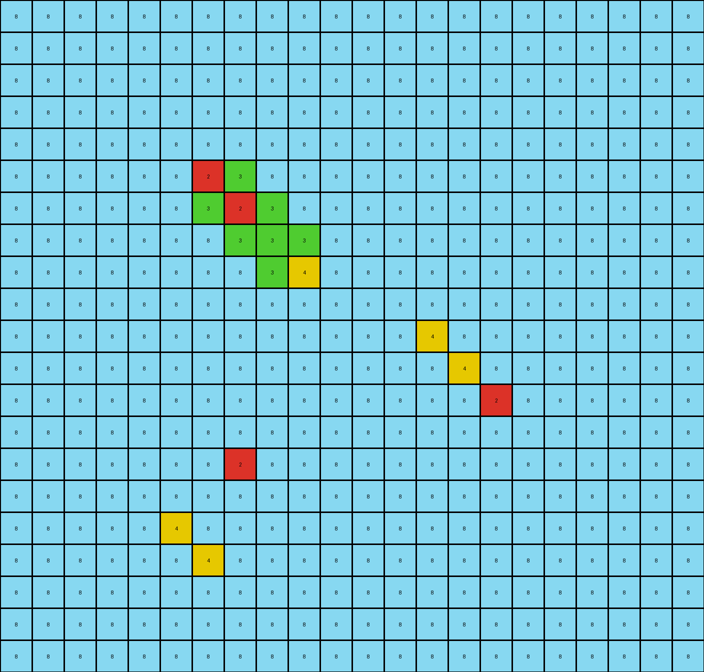

# 6aa20dc0 • 015 • refine_dreamer

---


Previous Code:
```python
"""
Replicates non-background color pixel clusters in a grid. The yellow (4) color, if existing in a cluster, serves as the origin.  The existing clusters are replicated one position down and one position to the right, relative to the original yellow pixel.
"""

import numpy as np

def find_objects(grid):
    """Finds contiguous clusters of non-background pixels."""
    visited = set()
    objects = []

    rows, cols = len(grid), len(grid[0])

    def is_valid(r, c):
        return 0 <= r < rows and 0 <= c < cols

    def dfs(r, c, current_object):
        if (r, c) in visited or not is_valid(r, c) or grid[r][c] == 8:
            return
        visited.add((r, c))
        current_object.append((r, c, grid[r][c]))
        for dr, dc in [(0, 1), (1, 0), (0, -1), (-1, 0)]:
            dfs(r + dr, c + dc, current_object)

    for r in range(rows):
        for c in range(cols):
            if (r, c) not in visited and grid[r][c] != 8:
                current_object = []
                dfs(r, c, current_object)
                objects.append(current_object)

    return objects

def transform(input_grid):
    # Initialize output grid with the same dimensions and background color
    input_grid = np.array(input_grid)
    output_grid = np.copy(input_grid)
    rows, cols = len(input_grid), len(input_grid[0])

    # Find objects (clusters of non-background pixels)
    objects = find_objects(input_grid)
    
    # Iterate through each object
    for obj in objects:
        #find yellow pixel location
        yellow_location = None
        for r, c, color in obj:
            if color == 4:
               yellow_location = (r,c)
               break;
        
        #skip if no yellow in object
        if yellow_location is None:
            continue
            
        #compute relative position of pixels to yellow
        relative_positions = []
        for r, c, color in obj:
            relative_positions.append(((r-yellow_location[0], c-yellow_location[1]), color))

        #Replicate the clusters
        new_r = yellow_location[0]+1
        new_c = yellow_location[1]+1

        #check if new positioins out of bounds
        for (dr,dc), color in relative_positions:
            nr, nc = new_r+dr, new_c+dc
            if 0 <= nr < rows and 0 <= nc < cols:  
                output_grid[nr][nc] = color

    return output_grid.tolist()
```

Train Set Results:

## Example 1:

Input:
```
1 1 1 1 1 1 1 1 1 1 1 1 1 1 1 1 1 1 1
1 1 1 1 1 1 1 1 1 1 1 1 1 2 1 1 1 1 1
1 1 1 1 1 1 1 1 1 1 1 1 1 1 1 1 1 1 1
1 1 1 1 1 1 1 1 1 1 1 1 1 1 1 3 1 1 1
1 1 1 1 1 2 8 8 1 1 1 1 1 1 1 1 1 1 1
1 1 1 1 1 8 8 1 1 1 1 1 1 1 1 1 1 1 1
1 1 1 1 1 8 1 3 1 1 1 1 1 1 1 1 1 1 1
1 1 1 1 1 1 1 1 1 1 1 1 1 1 1 1 1 1 1
1 1 1 1 1 1 1 1 1 1 1 1 1 1 1 1 1 1 1
1 1 1 1 1 1 1 1 1 1 1 1 1 1 1 1 1 1 1
1 1 1 1 1 1 1 1 1 1 1 1 1 1 1 1 1 1 1
1 1 1 1 1 1 1 1 1 2 2 1 1 1 1 1 1 1 1
1 1 1 1 1 1 1 1 1 2 2 1 1 1 1 1 1 1 1
1 1 1 1 1 1 1 1 1 1 1 1 1 1 1 1 1 1 1
1 1 1 1 1 1 1 1 1 1 1 1 1 1 1 1 1 1 1
1 1 1 1 1 3 3 1 1 1 1 1 1 1 1 1 1 1 1
1 1 1 1 1 3 3 1 1 1 1 1 1 1 1 1 1 1 1
1 1 1 1 1 1 1 1 1 1 1 1 1 1 1 1 1 1 1
1 1 1 1 1 1 1 1 1 1 1 1 1 1 1 1 1 1 1
1 1 1 1 1 1 1 1 1 1 1 1 1 1 1 1 1 1 1
```
Expected Output:
```
1 1 1 1 1 1 1 1 1 1 1 1 1 1 1 1 1 1 1
1 1 1 1 1 1 1 1 1 1 1 1 1 2 8 8 1 1 1
1 1 1 1 1 1 1 1 1 1 1 1 1 8 8 1 1 1 1
1 1 1 1 1 1 1 1 1 1 1 1 1 8 1 3 1 1 1
1 1 1 1 1 2 8 8 1 1 1 1 1 1 1 1 1 1 1
1 1 1 1 1 8 8 1 1 1 1 1 1 1 1 1 1 1 1
1 1 1 1 1 8 1 3 1 1 1 1 1 1 1 1 1 1 1
1 1 1 1 1 1 1 1 1 1 1 1 1 1 1 1 1 1 1
1 1 1 1 1 1 1 1 1 1 1 1 1 1 1 1 1 1 1
1 1 1 1 1 1 1 1 1 1 1 1 1 1 1 1 1 1 1
1 1 1 1 1 1 1 1 1 1 1 1 1 1 1 1 1 1 1
1 1 1 1 1 8 8 8 8 2 2 1 1 1 1 1 1 1 1
1 1 1 1 1 8 8 8 8 2 2 1 1 1 1 1 1 1 1
1 1 1 1 1 1 1 8 8 8 8 1 1 1 1 1 1 1 1
1 1 1 1 1 1 1 8 8 8 8 1 1 1 1 1 1 1 1
1 1 1 1 1 3 3 1 1 8 8 1 1 1 1 1 1 1 1
1 1 1 1 1 3 3 1 1 8 8 1 1 1 1 1 1 1 1
1 1 1 1 1 1 1 1 1 1 1 1 1 1 1 1 1 1 1
1 1 1 1 1 1 1 1 1 1 1 1 1 1 1 1 1 1 1
1 1 1 1 1 1 1 1 1 1 1 1 1 1 1 1 1 1 1
```
Transformed Output:
```
1 1 1 1 1 1 1 1 1 1 1 1 1 1 1 1 1 1 1
1 1 1 1 1 1 1 1 1 1 1 1 1 2 1 1 1 1 1
1 1 1 1 1 1 1 1 1 1 1 1 1 1 1 1 1 1 1
1 1 1 1 1 1 1 1 1 1 1 1 1 1 1 3 1 1 1
1 1 1 1 1 2 8 8 1 1 1 1 1 1 1 1 1 1 1
1 1 1 1 1 8 8 1 1 1 1 1 1 1 1 1 1 1 1
1 1 1 1 1 8 1 3 1 1 1 1 1 1 1 1 1 1 1
1 1 1 1 1 1 1 1 1 1 1 1 1 1 1 1 1 1 1
1 1 1 1 1 1 1 1 1 1 1 1 1 1 1 1 1 1 1
1 1 1 1 1 1 1 1 1 1 1 1 1 1 1 1 1 1 1
1 1 1 1 1 1 1 1 1 1 1 1 1 1 1 1 1 1 1
1 1 1 1 1 1 1 1 1 2 2 1 1 1 1 1 1 1 1
1 1 1 1 1 1 1 1 1 2 2 1 1 1 1 1 1 1 1
1 1 1 1 1 1 1 1 1 1 1 1 1 1 1 1 1 1 1
1 1 1 1 1 1 1 1 1 1 1 1 1 1 1 1 1 1 1
1 1 1 1 1 3 3 1 1 1 1 1 1 1 1 1 1 1 1
1 1 1 1 1 3 3 1 1 1 1 1 1 1 1 1 1 1 1
1 1 1 1 1 1 1 1 1 1 1 1 1 1 1 1 1 1 1
1 1 1 1 1 1 1 1 1 1 1 1 1 1 1 1 1 1 1
1 1 1 1 1 1 1 1 1 1 1 1 1 1 1 1 1 1 1
```

match: False
pixels_off: 25
size_correct: True
color_palette_correct: True
correct_pixel_counts: False

## Example 2:

Input:
```
4 4 4 4 4 4 4 4 4 4 4 4 4 4 4 4 4 4 4 4 4
4 4 4 4 4 4 4 4 4 4 4 4 4 4 4 4 4 4 4 4 4
4 4 4 1 1 6 4 4 4 4 4 4 4 4 4 4 4 4 4 4 4
4 4 4 1 4 1 4 4 4 4 4 4 4 4 4 4 4 4 4 4 4
4 4 4 2 1 1 4 4 4 4 4 4 4 4 4 4 4 4 4 4 4
4 4 4 4 4 4 4 4 4 4 4 4 4 4 4 4 4 4 4 4 4
4 4 4 4 4 4 4 4 4 4 4 4 4 4 4 4 4 4 4 4 4
4 4 4 4 4 4 4 4 4 4 4 2 2 2 4 4 4 4 4 4 4
4 4 4 4 4 4 4 4 4 4 4 2 2 2 4 4 4 4 4 4 4
4 4 4 4 4 4 4 4 4 4 4 2 2 2 4 4 4 4 4 4 4
4 4 4 4 4 4 4 4 4 4 4 4 4 4 4 4 4 4 4 4 4
4 4 4 4 4 4 4 4 4 4 4 4 4 4 4 4 4 4 4 4 4
4 4 4 4 4 4 4 4 4 4 4 4 4 4 4 4 4 4 4 4 4
4 4 4 4 4 6 6 6 4 4 4 4 4 4 4 4 4 4 4 4 4
4 4 4 4 4 6 6 6 4 4 4 4 4 4 4 4 4 4 4 4 4
4 4 4 4 4 6 6 6 4 4 4 4 4 4 4 4 4 4 4 4 4
4 4 4 4 4 4 4 4 4 4 4 4 4 4 4 4 4 4 4 4 4
4 4 4 4 4 4 4 4 4 4 4 4 4 4 4 4 4 4 4 4 4
4 4 4 4 4 4 4 4 4 4 4 4 4 4 4 4 4 4 4 4 4
4 4 4 4 4 4 4 4 4 4 4 4 4 4 4 4 4 4 4 4 4
```
Expected Output:
```
4 4 4 4 4 4 4 4 4 4 4 4 4 4 4 4 4 4 4 4 4
4 4 4 4 4 4 4 4 4 4 4 4 4 4 4 4 4 4 4 4 4
4 4 4 1 1 6 4 4 4 4 4 4 4 4 4 4 4 4 4 4 4
4 4 4 1 4 1 4 4 4 4 4 4 4 4 4 4 4 4 4 4 4
4 4 4 2 1 1 4 4 4 4 4 4 4 4 4 4 4 4 4 4 4
4 4 4 4 4 4 4 4 4 4 4 4 4 4 4 4 4 4 4 4 4
4 4 4 4 4 4 4 4 4 4 4 4 4 4 4 4 4 4 4 4 4
4 4 4 4 4 1 1 1 1 1 1 2 2 2 4 4 4 4 4 4 4
4 4 4 4 4 1 1 1 1 1 1 2 2 2 4 4 4 4 4 4 4
4 4 4 4 4 1 1 1 1 1 1 2 2 2 4 4 4 4 4 4 4
4 4 4 4 4 1 1 1 4 4 4 1 1 1 4 4 4 4 4 4 4
4 4 4 4 4 1 1 1 4 4 4 1 1 1 4 4 4 4 4 4 4
4 4 4 4 4 1 1 1 4 4 4 1 1 1 4 4 4 4 4 4 4
4 4 4 4 4 6 6 6 1 1 1 1 1 1 4 4 4 4 4 4 4
4 4 4 4 4 6 6 6 1 1 1 1 1 1 4 4 4 4 4 4 4
4 4 4 4 4 6 6 6 1 1 1 1 1 1 4 4 4 4 4 4 4
4 4 4 4 4 4 4 4 4 4 4 4 4 4 4 4 4 4 4 4 4
4 4 4 4 4 4 4 4 4 4 4 4 4 4 4 4 4 4 4 4 4
4 4 4 4 4 4 4 4 4 4 4 4 4 4 4 4 4 4 4 4 4
4 4 4 4 4 4 4 4 4 4 4 4 4 4 4 4 4 4 4 4 4
```
Transformed Output:
```
4 4 4 4 4 4 4 4 4 4 4 4 4 4 4 4 4 4 4 4 4
4 4 4 4 4 4 4 4 4 4 4 4 4 4 4 4 4 4 4 4 4
4 4 4 4 4 4 4 4 4 4 4 4 4 4 4 4 4 4 4 4 4
4 4 4 4 1 1 6 4 4 4 4 4 4 4 4 4 4 4 4 4 4
4 4 4 4 1 4 1 4 4 4 4 4 4 4 4 4 4 4 4 4 4
4 4 4 4 2 1 1 4 4 4 4 4 4 4 4 4 4 4 4 4 4
4 4 4 4 4 4 4 4 4 4 4 4 4 4 4 4 4 4 4 4 4
4 4 4 4 4 4 4 4 4 4 4 4 4 4 4 4 4 4 4 4 4
4 4 4 4 4 4 4 4 4 4 4 4 2 2 2 4 4 4 4 4 4
4 4 4 4 4 4 4 4 4 4 4 4 2 2 2 4 4 4 4 4 4
4 4 4 4 4 4 4 4 4 4 4 4 2 2 2 4 4 4 4 4 4
4 4 4 4 4 4 4 4 4 4 4 4 4 4 4 4 4 4 4 4 4
4 4 4 4 4 4 4 4 4 4 4 4 4 4 4 4 4 4 4 4 4
4 4 4 4 4 4 4 4 4 4 4 4 4 4 4 4 4 4 4 4 4
4 4 4 4 4 4 6 6 6 4 4 4 4 4 4 4 4 4 4 4 4
4 4 4 4 4 4 6 6 6 4 4 4 4 4 4 4 4 4 4 4 4
4 4 4 4 4 4 6 6 6 4 4 4 4 4 4 4 4 4 4 4 4
4 4 4 4 4 4 4 4 4 4 4 4 4 4 4 4 4 4 4 4 4
4 4 4 4 4 4 4 4 4 4 4 4 4 4 4 4 4 4 4 4 4
4 4 4 4 4 4 4 4 4 4 4 4 4 4 4 4 4 4 4 4 4
```

match: False
pixels_off: 82
size_correct: True
color_palette_correct: True
correct_pixel_counts: False

## Example 3:

Input:
```
8 8 8 8 8 8 8 8 8 8 8 8 8 8 8 8 8 8 8 8 8 8
8 8 8 8 8 8 8 8 8 8 8 8 8 8 8 8 8 8 8 8 8 8
8 8 8 8 8 8 8 8 8 8 8 8 8 8 8 8 8 8 8 8 8 8
8 8 8 8 8 8 8 8 8 8 8 8 8 8 8 8 8 8 8 8 8 8
8 8 8 8 8 8 8 8 8 8 8 8 8 8 8 8 8 8 8 8 8 8
8 8 8 8 8 8 2 3 8 8 8 8 8 8 8 8 8 8 8 8 8 8
8 8 8 8 8 8 3 3 3 8 8 8 8 8 8 8 8 8 8 8 8 8
8 8 8 8 8 8 8 3 4 8 8 8 8 8 8 8 8 8 8 8 8 8
8 8 8 8 8 8 8 8 8 8 8 8 8 8 8 8 8 8 8 8 8 8
8 8 8 8 8 8 8 8 8 8 8 8 8 8 8 8 8 8 8 8 8 8
8 8 8 8 8 8 8 8 8 8 8 8 8 4 8 8 8 8 8 8 8 8
8 8 8 8 8 8 8 8 8 8 8 8 8 8 8 8 8 8 8 8 8 8
8 8 8 8 8 8 8 8 8 8 8 8 8 8 8 2 8 8 8 8 8 8
8 8 8 8 8 8 8 8 8 8 8 8 8 8 8 8 8 8 8 8 8 8
8 8 8 8 8 8 8 2 8 8 8 8 8 8 8 8 8 8 8 8 8 8
8 8 8 8 8 8 8 8 8 8 8 8 8 8 8 8 8 8 8 8 8 8
8 8 8 8 8 4 8 8 8 8 8 8 8 8 8 8 8 8 8 8 8 8
8 8 8 8 8 8 8 8 8 8 8 8 8 8 8 8 8 8 8 8 8 8
8 8 8 8 8 8 8 8 8 8 8 8 8 8 8 8 8 8 8 8 8 8
8 8 8 8 8 8 8 8 8 8 8 8 8 8 8 8 8 8 8 8 8 8
8 8 8 8 8 8 8 8 8 8 8 8 8 8 8 8 8 8 8 8 8 8
```
Expected Output:
```
8 8 8 8 8 8 8 8 8 8 8 8 8 8 8 8 8 8 8 8 8 8
8 8 8 8 8 8 8 8 8 8 8 8 8 8 8 8 8 8 8 8 8 8
8 8 8 8 8 8 8 8 8 8 8 8 8 8 8 8 8 8 8 8 8 8
8 8 8 8 8 8 8 8 8 8 8 8 8 8 8 8 8 8 8 8 8 8
8 8 8 8 8 8 8 8 8 8 8 8 8 8 8 8 8 8 8 8 8 8
8 8 8 8 8 8 2 3 8 8 8 8 8 8 8 8 8 8 8 8 8 8
8 8 8 8 8 8 3 3 3 8 8 8 8 8 8 8 8 8 8 8 8 8
8 8 8 8 8 8 8 3 4 8 8 8 8 8 8 8 8 8 8 8 8 8
8 8 8 8 8 8 8 8 8 8 8 8 8 8 8 8 8 8 8 8 8 8
8 8 8 8 8 8 8 8 8 8 8 8 8 8 8 8 8 8 8 8 8 8
8 8 8 8 8 8 8 8 8 8 8 8 8 4 3 8 8 8 8 8 8 8
8 8 8 8 8 8 8 8 8 8 8 8 8 3 3 3 8 8 8 8 8 8
8 8 8 8 8 8 8 8 8 8 8 8 8 8 3 2 8 8 8 8 8 8
8 8 8 8 8 8 8 8 8 8 8 8 8 8 8 8 8 8 8 8 8 8
8 8 8 8 8 8 3 2 8 8 8 8 8 8 8 8 8 8 8 8 8 8
8 8 8 8 8 3 3 3 8 8 8 8 8 8 8 8 8 8 8 8 8 8
8 8 8 8 8 4 3 8 8 8 8 8 8 8 8 8 8 8 8 8 8 8
8 8 8 8 8 8 8 8 8 8 8 8 8 8 8 8 8 8 8 8 8 8
8 8 8 8 8 8 8 8 8 8 8 8 8 8 8 8 8 8 8 8 8 8
8 8 8 8 8 8 8 8 8 8 8 8 8 8 8 8 8 8 8 8 8 8
8 8 8 8 8 8 8 8 8 8 8 8 8 8 8 8 8 8 8 8 8 8
```
Transformed Output:
```
8 8 8 8 8 8 8 8 8 8 8 8 8 8 8 8 8 8 8 8 8 8
8 8 8 8 8 8 8 8 8 8 8 8 8 8 8 8 8 8 8 8 8 8
8 8 8 8 8 8 8 8 8 8 8 8 8 8 8 8 8 8 8 8 8 8
8 8 8 8 8 8 8 8 8 8 8 8 8 8 8 8 8 8 8 8 8 8
8 8 8 8 8 8 8 8 8 8 8 8 8 8 8 8 8 8 8 8 8 8
8 8 8 8 8 8 2 3 8 8 8 8 8 8 8 8 8 8 8 8 8 8
8 8 8 8 8 8 3 2 3 8 8 8 8 8 8 8 8 8 8 8 8 8
8 8 8 8 8 8 8 3 3 3 8 8 8 8 8 8 8 8 8 8 8 8
8 8 8 8 8 8 8 8 3 4 8 8 8 8 8 8 8 8 8 8 8 8
8 8 8 8 8 8 8 8 8 8 8 8 8 8 8 8 8 8 8 8 8 8
8 8 8 8 8 8 8 8 8 8 8 8 8 4 8 8 8 8 8 8 8 8
8 8 8 8 8 8 8 8 8 8 8 8 8 8 4 8 8 8 8 8 8 8
8 8 8 8 8 8 8 8 8 8 8 8 8 8 8 2 8 8 8 8 8 8
8 8 8 8 8 8 8 8 8 8 8 8 8 8 8 8 8 8 8 8 8 8
8 8 8 8 8 8 8 2 8 8 8 8 8 8 8 8 8 8 8 8 8 8
8 8 8 8 8 8 8 8 8 8 8 8 8 8 8 8 8 8 8 8 8 8
8 8 8 8 8 4 8 8 8 8 8 8 8 8 8 8 8 8 8 8 8 8
8 8 8 8 8 8 4 8 8 8 8 8 8 8 8 8 8 8 8 8 8 8
8 8 8 8 8 8 8 8 8 8 8 8 8 8 8 8 8 8 8 8 8 8
8 8 8 8 8 8 8 8 8 8 8 8 8 8 8 8 8 8 8 8 8 8
8 8 8 8 8 8 8 8 8 8 8 8 8 8 8 8 8 8 8 8 8 8
```

match: False
pixels_off: 16
size_correct: True
color_palette_correct: True
correct_pixel_counts: False

**INSTRUCTIONS**

The code above was generated based on observations from the first training
example

we have tested the transform function on each of the task example inputs and
compared with the expected output

review each of the examples provided and the results and consider how the
natural language program should be updated to accommodate this new knowledge

respond with the following deliverables:

- general assessment of the information provided and strategy for resolving the
  errors
- gather metrics about each of the examples and results - use code_execution to
  develop accurate reports on your assumptions
- a YAML block documenting facts - Focus on identifying objects, their properties, and the actions performed on them.
- a natural language program - Be as clear and concise as possible, providing a complete description of the transformation rule.


your responses should be considered as information in a report - not a
conversation
