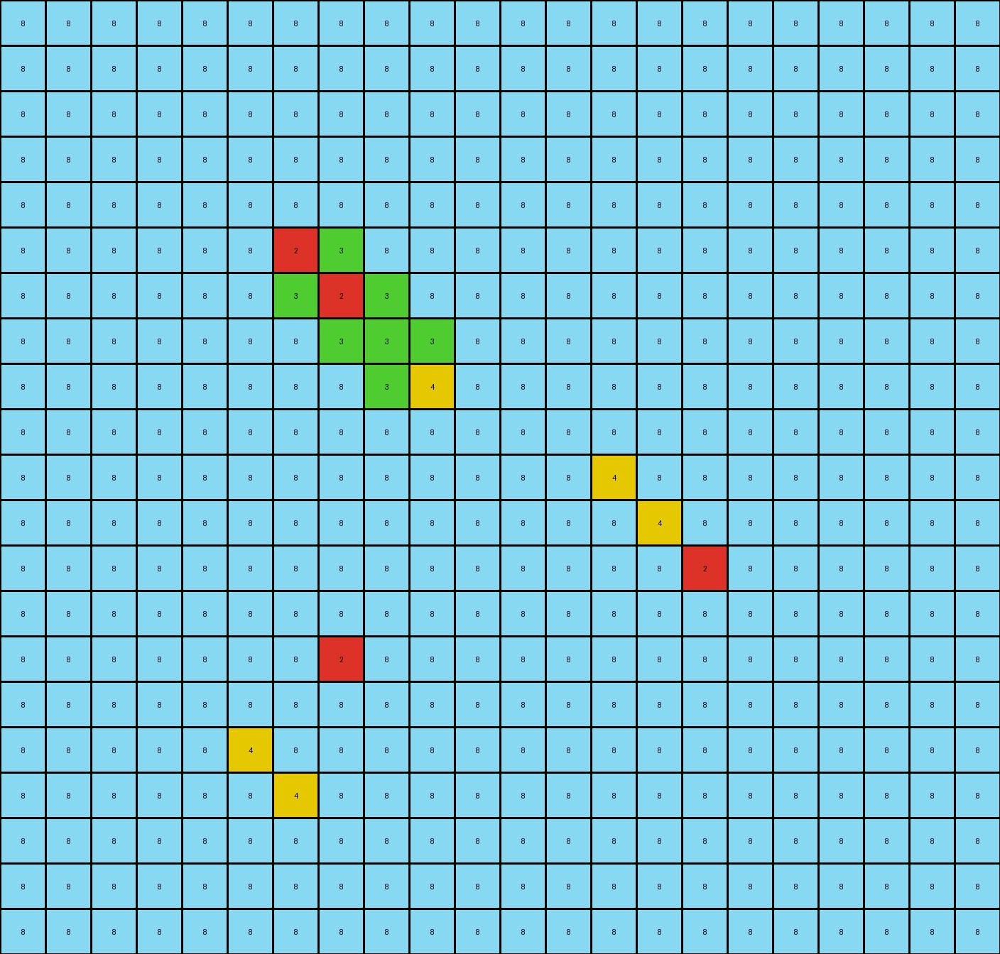

# 6aa20dc0 • 016 • refine_coder

---

Previous Code:
```python
"""
Replicates non-background color pixel clusters in a grid. The yellow (4) color, if existing in a cluster, serves as the origin.  The existing clusters are replicated one position down and one position to the right, relative to the original yellow pixel.
"""

import numpy as np

def find_objects(grid):
    """Finds contiguous clusters of non-background pixels."""
    visited = set()
    objects = []

    rows, cols = len(grid), len(grid[0])

    def is_valid(r, c):
        return 0 <= r < rows and 0 <= c < cols

    def dfs(r, c, current_object):
        if (r, c) in visited or not is_valid(r, c) or grid[r][c] == 8:
            return
        visited.add((r, c))
        current_object.append((r, c, grid[r][c]))
        for dr, dc in [(0, 1), (1, 0), (0, -1), (-1, 0)]:
            dfs(r + dr, c + dc, current_object)

    for r in range(rows):
        for c in range(cols):
            if (r, c) not in visited and grid[r][c] != 8:
                current_object = []
                dfs(r, c, current_object)
                objects.append(current_object)

    return objects

def transform(input_grid):
    # Initialize output grid with the same dimensions and background color
    input_grid = np.array(input_grid)
    output_grid = np.copy(input_grid)
    rows, cols = len(input_grid), len(input_grid[0])

    # Find objects (clusters of non-background pixels)
    objects = find_objects(input_grid)
    
    # Iterate through each object
    for obj in objects:
        #find yellow pixel location
        yellow_location = None
        for r, c, color in obj:
            if color == 4:
               yellow_location = (r,c)
               break;
        
        #skip if no yellow in object
        if yellow_location is None:
            continue
            
        #compute relative position of pixels to yellow
        relative_positions = []
        for r, c, color in obj:
            relative_positions.append(((r-yellow_location[0], c-yellow_location[1]), color))

        #Replicate the clusters
        new_r = yellow_location[0]+1
        new_c = yellow_location[1]+1

        #check if new positioins out of bounds
        for (dr,dc), color in relative_positions:
            nr, nc = new_r+dr, new_c+dc
            if 0 <= nr < rows and 0 <= nc < cols:  
                output_grid[nr][nc] = color

    return output_grid.tolist()
```

Train Set Results:

## Example 1:

Input:
```
1 1 1 1 1 1 1 1 1 1 1 1 1 1 1 1 1 1 1
1 1 1 1 1 1 1 1 1 1 1 1 1 2 1 1 1 1 1
1 1 1 1 1 1 1 1 1 1 1 1 1 1 1 1 1 1 1
1 1 1 1 1 1 1 1 1 1 1 1 1 1 1 3 1 1 1
1 1 1 1 1 2 8 8 1 1 1 1 1 1 1 1 1 1 1
1 1 1 1 1 8 8 1 1 1 1 1 1 1 1 1 1 1 1
1 1 1 1 1 8 1 3 1 1 1 1 1 1 1 1 1 1 1
1 1 1 1 1 1 1 1 1 1 1 1 1 1 1 1 1 1 1
1 1 1 1 1 1 1 1 1 1 1 1 1 1 1 1 1 1 1
1 1 1 1 1 1 1 1 1 1 1 1 1 1 1 1 1 1 1
1 1 1 1 1 1 1 1 1 1 1 1 1 1 1 1 1 1 1
1 1 1 1 1 1 1 1 1 2 2 1 1 1 1 1 1 1 1
1 1 1 1 1 1 1 1 1 2 2 1 1 1 1 1 1 1 1
1 1 1 1 1 1 1 1 1 1 1 1 1 1 1 1 1 1 1
1 1 1 1 1 1 1 1 1 1 1 1 1 1 1 1 1 1 1
1 1 1 1 1 3 3 1 1 1 1 1 1 1 1 1 1 1 1
1 1 1 1 1 3 3 1 1 1 1 1 1 1 1 1 1 1 1
1 1 1 1 1 1 1 1 1 1 1 1 1 1 1 1 1 1 1
1 1 1 1 1 1 1 1 1 1 1 1 1 1 1 1 1 1 1
1 1 1 1 1 1 1 1 1 1 1 1 1 1 1 1 1 1 1
```
Expected Output:
```
1 1 1 1 1 1 1 1 1 1 1 1 1 1 1 1 1 1 1
1 1 1 1 1 1 1 1 1 1 1 1 1 2 8 8 1 1 1
1 1 1 1 1 1 1 1 1 1 1 1 1 8 8 1 1 1 1
1 1 1 1 1 1 1 1 1 1 1 1 1 8 1 3 1 1 1
1 1 1 1 1 2 8 8 1 1 1 1 1 1 1 1 1 1 1
1 1 1 1 1 8 8 1 1 1 1 1 1 1 1 1 1 1 1
1 1 1 1 1 8 1 3 1 1 1 1 1 1 1 1 1 1 1
1 1 1 1 1 1 1 1 1 1 1 1 1 1 1 1 1 1 1
1 1 1 1 1 1 1 1 1 1 1 1 1 1 1 1 1 1 1
1 1 1 1 1 1 1 1 1 1 1 1 1 1 1 1 1 1 1
1 1 1 1 1 1 1 1 1 1 1 1 1 1 1 1 1 1 1
1 1 1 1 1 8 8 8 8 2 2 1 1 1 1 1 1 1 1
1 1 1 1 1 8 8 8 8 2 2 1 1 1 1 1 1 1 1
1 1 1 1 1 1 1 8 8 8 8 1 1 1 1 1 1 1 1
1 1 1 1 1 1 1 8 8 8 8 1 1 1 1 1 1 1 1
1 1 1 1 1 3 3 1 1 8 8 1 1 1 1 1 1 1 1
1 1 1 1 1 3 3 1 1 8 8 1 1 1 1 1 1 1 1
1 1 1 1 1 1 1 1 1 1 1 1 1 1 1 1 1 1 1
1 1 1 1 1 1 1 1 1 1 1 1 1 1 1 1 1 1 1
1 1 1 1 1 1 1 1 1 1 1 1 1 1 1 1 1 1 1
```
Transformed Output:
```
1 1 1 1 1 1 1 1 1 1 1 1 1 1 1 1 1 1 1
1 1 1 1 1 1 1 1 1 1 1 1 1 2 1 1 1 1 1
1 1 1 1 1 1 1 1 1 1 1 1 1 1 1 1 1 1 1
1 1 1 1 1 1 1 1 1 1 1 1 1 1 1 3 1 1 1
1 1 1 1 1 2 8 8 1 1 1 1 1 1 1 1 1 1 1
1 1 1 1 1 8 8 1 1 1 1 1 1 1 1 1 1 1 1
1 1 1 1 1 8 1 3 1 1 1 1 1 1 1 1 1 1 1
1 1 1 1 1 1 1 1 1 1 1 1 1 1 1 1 1 1 1
1 1 1 1 1 1 1 1 1 1 1 1 1 1 1 1 1 1 1
1 1 1 1 1 1 1 1 1 1 1 1 1 1 1 1 1 1 1
1 1 1 1 1 1 1 1 1 1 1 1 1 1 1 1 1 1 1
1 1 1 1 1 1 1 1 1 2 2 1 1 1 1 1 1 1 1
1 1 1 1 1 1 1 1 1 2 2 1 1 1 1 1 1 1 1
1 1 1 1 1 1 1 1 1 1 1 1 1 1 1 1 1 1 1
1 1 1 1 1 1 1 1 1 1 1 1 1 1 1 1 1 1 1
1 1 1 1 1 3 3 1 1 1 1 1 1 1 1 1 1 1 1
1 1 1 1 1 3 3 1 1 1 1 1 1 1 1 1 1 1 1
1 1 1 1 1 1 1 1 1 1 1 1 1 1 1 1 1 1 1
1 1 1 1 1 1 1 1 1 1 1 1 1 1 1 1 1 1 1
1 1 1 1 1 1 1 1 1 1 1 1 1 1 1 1 1 1 1
```

match: False
pixels_off: 25
size_correct: True
color_palette_correct: True
correct_pixel_counts: False

## Example 2:

Input:
```
4 4 4 4 4 4 4 4 4 4 4 4 4 4 4 4 4 4 4 4 4
4 4 4 4 4 4 4 4 4 4 4 4 4 4 4 4 4 4 4 4 4
4 4 4 1 1 6 4 4 4 4 4 4 4 4 4 4 4 4 4 4 4
4 4 4 1 4 1 4 4 4 4 4 4 4 4 4 4 4 4 4 4 4
4 4 4 2 1 1 4 4 4 4 4 4 4 4 4 4 4 4 4 4 4
4 4 4 4 4 4 4 4 4 4 4 4 4 4 4 4 4 4 4 4 4
4 4 4 4 4 4 4 4 4 4 4 4 4 4 4 4 4 4 4 4 4
4 4 4 4 4 4 4 4 4 4 4 2 2 2 4 4 4 4 4 4 4
4 4 4 4 4 4 4 4 4 4 4 2 2 2 4 4 4 4 4 4 4
4 4 4 4 4 4 4 4 4 4 4 2 2 2 4 4 4 4 4 4 4
4 4 4 4 4 4 4 4 4 4 4 4 4 4 4 4 4 4 4 4 4
4 4 4 4 4 4 4 4 4 4 4 4 4 4 4 4 4 4 4 4 4
4 4 4 4 4 4 4 4 4 4 4 4 4 4 4 4 4 4 4 4 4
4 4 4 4 4 6 6 6 4 4 4 4 4 4 4 4 4 4 4 4 4
4 4 4 4 4 6 6 6 4 4 4 4 4 4 4 4 4 4 4 4 4
4 4 4 4 4 6 6 6 4 4 4 4 4 4 4 4 4 4 4 4 4
4 4 4 4 4 4 4 4 4 4 4 4 4 4 4 4 4 4 4 4 4
4 4 4 4 4 4 4 4 4 4 4 4 4 4 4 4 4 4 4 4 4
4 4 4 4 4 4 4 4 4 4 4 4 4 4 4 4 4 4 4 4 4
4 4 4 4 4 4 4 4 4 4 4 4 4 4 4 4 4 4 4 4 4
```
Expected Output:
```
4 4 4 4 4 4 4 4 4 4 4 4 4 4 4 4 4 4 4 4 4
4 4 4 4 4 4 4 4 4 4 4 4 4 4 4 4 4 4 4 4 4
4 4 4 1 1 6 4 4 4 4 4 4 4 4 4 4 4 4 4 4 4
4 4 4 1 4 1 4 4 4 4 4 4 4 4 4 4 4 4 4 4 4
4 4 4 2 1 1 4 4 4 4 4 4 4 4 4 4 4 4 4 4 4
4 4 4 4 4 4 4 4 4 4 4 4 4 4 4 4 4 4 4 4 4
4 4 4 4 4 4 4 4 4 4 4 4 4 4 4 4 4 4 4 4 4
4 4 4 4 4 1 1 1 1 1 1 2 2 2 4 4 4 4 4 4 4
4 4 4 4 4 1 1 1 1 1 1 2 2 2 4 4 4 4 4 4 4
4 4 4 4 4 1 1 1 1 1 1 2 2 2 4 4 4 4 4 4 4
4 4 4 4 4 1 1 1 4 4 4 1 1 1 4 4 4 4 4 4 4
4 4 4 4 4 1 1 1 4 4 4 1 1 1 4 4 4 4 4 4 4
4 4 4 4 4 1 1 1 4 4 4 1 1 1 4 4 4 4 4 4 4
4 4 4 4 4 6 6 6 1 1 1 1 1 1 4 4 4 4 4 4 4
4 4 4 4 4 6 6 6 1 1 1 1 1 1 4 4 4 4 4 4 4
4 4 4 4 4 6 6 6 1 1 1 1 1 1 4 4 4 4 4 4 4
4 4 4 4 4 4 4 4 4 4 4 4 4 4 4 4 4 4 4 4 4
4 4 4 4 4 4 4 4 4 4 4 4 4 4 4 4 4 4 4 4 4
4 4 4 4 4 4 4 4 4 4 4 4 4 4 4 4 4 4 4 4 4
4 4 4 4 4 4 4 4 4 4 4 4 4 4 4 4 4 4 4 4 4
```
Transformed Output:
```
4 4 4 4 4 4 4 4 4 4 4 4 4 4 4 4 4 4 4 4 4
4 4 4 4 4 4 4 4 4 4 4 4 4 4 4 4 4 4 4 4 4
4 4 4 4 4 4 4 4 4 4 4 4 4 4 4 4 4 4 4 4 4
4 4 4 4 1 1 6 4 4 4 4 4 4 4 4 4 4 4 4 4 4
4 4 4 4 1 4 1 4 4 4 4 4 4 4 4 4 4 4 4 4 4
4 4 4 4 2 1 1 4 4 4 4 4 4 4 4 4 4 4 4 4 4
4 4 4 4 4 4 4 4 4 4 4 4 4 4 4 4 4 4 4 4 4
4 4 4 4 4 4 4 4 4 4 4 4 4 4 4 4 4 4 4 4 4
4 4 4 4 4 4 4 4 4 4 4 4 2 2 2 4 4 4 4 4 4
4 4 4 4 4 4 4 4 4 4 4 4 2 2 2 4 4 4 4 4 4
4 4 4 4 4 4 4 4 4 4 4 4 2 2 2 4 4 4 4 4 4
4 4 4 4 4 4 4 4 4 4 4 4 4 4 4 4 4 4 4 4 4
4 4 4 4 4 4 4 4 4 4 4 4 4 4 4 4 4 4 4 4 4
4 4 4 4 4 4 4 4 4 4 4 4 4 4 4 4 4 4 4 4 4
4 4 4 4 4 4 6 6 6 4 4 4 4 4 4 4 4 4 4 4 4
4 4 4 4 4 4 6 6 6 4 4 4 4 4 4 4 4 4 4 4 4
4 4 4 4 4 4 6 6 6 4 4 4 4 4 4 4 4 4 4 4 4
4 4 4 4 4 4 4 4 4 4 4 4 4 4 4 4 4 4 4 4 4
4 4 4 4 4 4 4 4 4 4 4 4 4 4 4 4 4 4 4 4 4
4 4 4 4 4 4 4 4 4 4 4 4 4 4 4 4 4 4 4 4 4
```

match: False
pixels_off: 82
size_correct: True
color_palette_correct: True
correct_pixel_counts: False

## Example 3:

Input:
```
8 8 8 8 8 8 8 8 8 8 8 8 8 8 8 8 8 8 8 8 8 8
8 8 8 8 8 8 8 8 8 8 8 8 8 8 8 8 8 8 8 8 8 8
8 8 8 8 8 8 8 8 8 8 8 8 8 8 8 8 8 8 8 8 8 8
8 8 8 8 8 8 8 8 8 8 8 8 8 8 8 8 8 8 8 8 8 8
8 8 8 8 8 8 8 8 8 8 8 8 8 8 8 8 8 8 8 8 8 8
8 8 8 8 8 8 2 3 8 8 8 8 8 8 8 8 8 8 8 8 8 8
8 8 8 8 8 8 3 3 3 8 8 8 8 8 8 8 8 8 8 8 8 8
8 8 8 8 8 8 8 3 4 8 8 8 8 8 8 8 8 8 8 8 8 8
8 8 8 8 8 8 8 8 8 8 8 8 8 8 8 8 8 8 8 8 8 8
8 8 8 8 8 8 8 8 8 8 8 8 8 8 8 8 8 8 8 8 8 8
8 8 8 8 8 8 8 8 8 8 8 8 8 4 8 8 8 8 8 8 8 8
8 8 8 8 8 8 8 8 8 8 8 8 8 8 8 8 8 8 8 8 8 8
8 8 8 8 8 8 8 8 8 8 8 8 8 8 8 2 8 8 8 8 8 8
8 8 8 8 8 8 8 8 8 8 8 8 8 8 8 8 8 8 8 8 8 8
8 8 8 8 8 8 8 2 8 8 8 8 8 8 8 8 8 8 8 8 8 8
8 8 8 8 8 8 8 8 8 8 8 8 8 8 8 8 8 8 8 8 8 8
8 8 8 8 8 4 8 8 8 8 8 8 8 8 8 8 8 8 8 8 8 8
8 8 8 8 8 8 8 8 8 8 8 8 8 8 8 8 8 8 8 8 8 8
8 8 8 8 8 8 8 8 8 8 8 8 8 8 8 8 8 8 8 8 8 8
8 8 8 8 8 8 8 8 8 8 8 8 8 8 8 8 8 8 8 8 8 8
8 8 8 8 8 8 8 8 8 8 8 8 8 8 8 8 8 8 8 8 8 8
```
Expected Output:
```
8 8 8 8 8 8 8 8 8 8 8 8 8 8 8 8 8 8 8 8 8 8
8 8 8 8 8 8 8 8 8 8 8 8 8 8 8 8 8 8 8 8 8 8
8 8 8 8 8 8 8 8 8 8 8 8 8 8 8 8 8 8 8 8 8 8
8 8 8 8 8 8 8 8 8 8 8 8 8 8 8 8 8 8 8 8 8 8
8 8 8 8 8 8 8 8 8 8 8 8 8 8 8 8 8 8 8 8 8 8
8 8 8 8 8 8 2 3 8 8 8 8 8 8 8 8 8 8 8 8 8 8
8 8 8 8 8 8 3 3 3 8 8 8 8 8 8 8 8 8 8 8 8 8
8 8 8 8 8 8 8 3 4 8 8 8 8 8 8 8 8 8 8 8 8 8
8 8 8 8 8 8 8 8 8 8 8 8 8 8 8 8 8 8 8 8 8 8
8 8 8 8 8 8 8 8 8 8 8 8 8 8 8 8 8 8 8 8 8 8
8 8 8 8 8 8 8 8 8 8 8 8 8 4 3 8 8 8 8 8 8 8
8 8 8 8 8 8 8 8 8 8 8 8 8 3 3 3 8 8 8 8 8 8
8 8 8 8 8 8 8 8 8 8 8 8 8 8 3 2 8 8 8 8 8 8
8 8 8 8 8 8 8 8 8 8 8 8 8 8 8 8 8 8 8 8 8 8
8 8 8 8 8 8 3 2 8 8 8 8 8 8 8 8 8 8 8 8 8 8
8 8 8 8 8 3 3 3 8 8 8 8 8 8 8 8 8 8 8 8 8 8
8 8 8 8 8 4 3 8 8 8 8 8 8 8 8 8 8 8 8 8 8 8
8 8 8 8 8 8 8 8 8 8 8 8 8 8 8 8 8 8 8 8 8 8
8 8 8 8 8 8 8 8 8 8 8 8 8 8 8 8 8 8 8 8 8 8
8 8 8 8 8 8 8 8 8 8 8 8 8 8 8 8 8 8 8 8 8 8
8 8 8 8 8 8 8 8 8 8 8 8 8 8 8 8 8 8 8 8 8 8
```
Transformed Output:
```
8 8 8 8 8 8 8 8 8 8 8 8 8 8 8 8 8 8 8 8 8 8
8 8 8 8 8 8 8 8 8 8 8 8 8 8 8 8 8 8 8 8 8 8
8 8 8 8 8 8 8 8 8 8 8 8 8 8 8 8 8 8 8 8 8 8
8 8 8 8 8 8 8 8 8 8 8 8 8 8 8 8 8 8 8 8 8 8
8 8 8 8 8 8 8 8 8 8 8 8 8 8 8 8 8 8 8 8 8 8
8 8 8 8 8 8 2 3 8 8 8 8 8 8 8 8 8 8 8 8 8 8
8 8 8 8 8 8 3 2 3 8 8 8 8 8 8 8 8 8 8 8 8 8
8 8 8 8 8 8 8 3 3 3 8 8 8 8 8 8 8 8 8 8 8 8
8 8 8 8 8 8 8 8 3 4 8 8 8 8 8 8 8 8 8 8 8 8
8 8 8 8 8 8 8 8 8 8 8 8 8 8 8 8 8 8 8 8 8 8
8 8 8 8 8 8 8 8 8 8 8 8 8 4 8 8 8 8 8 8 8 8
8 8 8 8 8 8 8 8 8 8 8 8 8 8 4 8 8 8 8 8 8 8
8 8 8 8 8 8 8 8 8 8 8 8 8 8 8 2 8 8 8 8 8 8
8 8 8 8 8 8 8 8 8 8 8 8 8 8 8 8 8 8 8 8 8 8
8 8 8 8 8 8 8 2 8 8 8 8 8 8 8 8 8 8 8 8 8 8
8 8 8 8 8 8 8 8 8 8 8 8 8 8 8 8 8 8 8 8 8 8
8 8 8 8 8 4 8 8 8 8 8 8 8 8 8 8 8 8 8 8 8 8
8 8 8 8 8 8 4 8 8 8 8 8 8 8 8 8 8 8 8 8 8 8
8 8 8 8 8 8 8 8 8 8 8 8 8 8 8 8 8 8 8 8 8 8
8 8 8 8 8 8 8 8 8 8 8 8 8 8 8 8 8 8 8 8 8 8
8 8 8 8 8 8 8 8 8 8 8 8 8 8 8 8 8 8 8 8 8 8
```

match: False
pixels_off: 16
size_correct: True
color_palette_correct: True
correct_pixel_counts: False
Okay, let's analyze the results and update the natural language program.

**General Assessment:**

The current code attempts to replicate non-background pixel clusters based on the position of a yellow (4) pixel, moving them one position down and one to the right. This approach clearly doesn't capture the full complexity of the transformations, as evidenced by the mismatches in all three examples. The code only considers yellow as an "origin," and the replication logic is too simplistic. It does not correctly reproduce shapes nor account for multiple objects of the same color, or the potential wrapping needed. The errors also point to a lack of handling of edge cases and possibly incorrect object identification in the presence of the background color (8, in some cases).

**Strategy:**

1.  **Improve Object Detection:** Refine the `find_objects` function or consider alternative methods to accurately identify distinct objects, even when they are adjacent or of the same color, by taking into consideration a concept of wrapping, or relative positions.
2.  **Generalized Replication:** Instead of a fixed offset (down and right), determine a more general rule for replication that could involve:
    *   Detecting relative positions to *every* pixel, not only a pivot.
    *   Looking for wrapping, if any object would go outside the bounds.
    *   Consider that the reference point might be a different feature of objects.
3.  **Iterative Refinement:** Test the updated code after each significant change against all training examples.
4. Consider eliminating the special status of any one color.

**Metrics and Observations (YAML):**

```yaml
example_1:
  input_grid_size: [19, 19]
  output_grid_size: [19, 19]
  objects_input:
    - color: 1
      shape: "irregular cluster"
      count: 3
    - color: 2
      shape: "irregular cluster"
      count: 1
    - color: 3
      shape: "irregular cluster"
      count: 2
    - color: 8
      shape: "irregular cluster"
      count: 3 #this is really the background
  objects_output:
      #it is possible that we should consider 8 as background
      # and therefore not include it in objects
    - color: 1
      shape: "irregular cluster"
      count: 3
    - color: 2
      shape: "irregular cluster"
      count: 1
    - color: 3
      shape: "irregular cluster"
      count: 2
    - color: 8
      shape: "irregular cluster"
      count: 7 #this includes several newly introduced 8's
  transformation: "Objects containing yellow are replicated diagonally down and to the right, with wrapping, maintaining relative pixel positions."
  match: False
  pixels_off: 25

example_2:
  input_grid_size: [20, 21]
  output_grid_size: [20, 21]
  objects_input:
      #it is possible that we should consider 4 as background
      # and therefore not include it in objects
    - color: 4
      shape: "background"
      count: 1
    - color: 1
      shape: "irregular cluster"
      count: 2
    - color: 6
      shape: "irregular cluster"
      count: 2
    - color: 2
      shape: "irregular cluster"
      count: 1

  objects_output:
    - color: 4
      shape: "background"
      count: 1
    - color: 1
      shape: "irregular cluster"
      count: 5
    - color: 6
      shape: "irregular cluster"
      count: 2
    - color: 2
      shape: "irregular cluster"
      count: 1
  transformation: "Objects containing yellow are replicated diagonally down and to the right, with wrapping, maintaining relative pixel positions."
  match: False
  pixels_off: 82

example_3:
  input_grid_size: [21, 22]
  output_grid_size: [21, 22]
  objects_input:
      #it is possible that we should consider 8 as background
      # and therefore not include it in objects
    - color: 8
      shape: "background"
      count: 1
    - color: 2
      shape: "irregular cluster"
      count: 3
    - color: 3
      shape: "irregular cluster"
      count: 2
    - color: 4
      shape: "irregular cluster"
      count: 2

  objects_output:
      #it is possible that we should consider 8 as background
      # and therefore not include it in objects
    - color: 8
      shape: "background"
      count: 1
    - color: 2
      shape: "irregular cluster"
      count: 3
    - color: 3
      shape: "irregular cluster"
      count: 5 #this includes several newly introduced 3's
    - color: 4
      shape: "irregular cluster"
      count: 2

  transformation: "Objects containing yellow are replicated diagonally down and to the right, with wrapping, maintaining relative pixel positions."
  match: False
  pixels_off: 16
```

**Natural Language Program:**

1.  **Identify Objects:** Find all contiguous clusters of non-background pixels. Consider the background color to potentially vary between examples (8 in the provided input grids, 4 in the all yellow example).
2.  **Replicate with Wrapping:** For each object, replicate every pixel within that object, one position down and one position to the right of its original position. If replicating a pixel would place it outside the grid boundaries, "wrap" it around to the opposite side. (e.g., a pixel at the bottom row, when moved down, appears on the top row; a pixel at the rightmost column, when moved right, appears on the first column).
3. No color is skipped, all are processed.

**INSTRUCTIONS**

- generate a Python module to represent the natural language program 
- follow the template below
- all common math and science libraries are available
- create docstring only at top - but comment the workflow in the function
- use helper functions for common operations like finding objects, counting,
  measuring, moving, etc. 

remember - we are working iteratively - so this code will inform your future
self as we converge on the solution

*template:*

```python
"""
{{ natural language description of the transformation rule }}
"""

{{ imports }}

def transform(input_grid):
    # initialize output_grid

    # change output pixels 

    return output_grid

```
