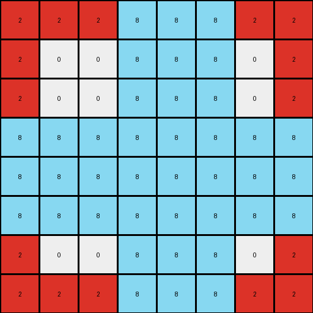

# 6b9890af • 003 • refine_dreamer

---

Previous Code:
```python
"""
Crops and overlays an azure shape and a red square from a large input grid onto a smaller 8x8 output grid, 
prioritizing the azure color where they overlap.
"""

import numpy as np

def find_object(grid, color):
    # Find coordinates of all pixels of the specified color
    coords = np.argwhere(grid == color)
    if coords.size == 0:
        return None
    # Calculate bounding box
    min_row, min_col = coords.min(axis=0)
    max_row, max_col = coords.max(axis=0)
    return (min_row, min_col, max_row, max_col)

def crop_and_resize(grid, bbox, output_size=(8, 8)):
  
    min_row, min_col, max_row, max_col = bbox

    #crop
    cropped = grid[min_row:max_row+1, min_col:max_col+1]
    
    #resize
    rows, cols = cropped.shape
    resized = np.zeros(output_size, dtype=int)
    
    new_rows, new_cols = output_size

    row_scale = rows / new_rows
    col_scale = cols / new_cols
    
    for i in range(new_rows):
      for j in range(new_cols):
        orig_row = int(i * row_scale)
        orig_col = int(j * col_scale)
        resized[i, j] = cropped[orig_row, orig_col]

    return resized    

def transform(input_grid):
    # Find bounding boxes for azure and red objects
    azure_bbox = find_object(input_grid, 8)
    red_bbox = find_object(input_grid, 2)

    # Determine combined bounding box
    min_row = min(azure_bbox[0], red_bbox[0])
    min_col = min(azure_bbox[1], red_bbox[1])
    max_row = max(azure_bbox[2], red_bbox[2])
    max_col = max(azure_bbox[3], red_bbox[3])
    
    combined_bbox = (min_row, min_col, max_row, max_col)

    # Initialize output grid (8x8)
    output_grid = np.zeros((8, 8), dtype=int)

    # Crop and resize the combined region and then paste into output_grid
    cropped_red = crop_and_resize(input_grid, red_bbox)
    cropped_azure = crop_and_resize(input_grid, azure_bbox)

    # Overlay red first, then azure
    for i in range(8):
        for j in range(8):
            if cropped_red[i, j] == 2:
                output_grid[i, j] = 2
    for i in range(8):
        for j in range(8):
            if cropped_azure[i, j] == 8:
                output_grid[i, j] = 8
                
    return output_grid
```

Train Set Results:

## Example 1:

Input:
```
0 0 0 0 0 0 0 0 0 0 0 0 0 0 0 0 0 0 0 0 0
0 0 0 0 0 0 0 0 0 0 0 0 0 0 0 0 0 0 0 0 0
0 0 0 0 0 0 8 0 0 0 0 0 0 0 0 0 0 0 0 0 0
0 0 0 0 0 8 8 8 0 0 0 0 0 0 0 0 0 0 0 0 0
0 0 0 0 0 0 8 0 0 0 0 0 0 0 0 0 0 0 0 0 0
0 0 0 0 0 0 0 0 0 0 0 0 0 0 0 0 0 0 0 0 0
0 0 0 0 0 0 0 0 0 0 0 0 0 0 0 0 0 0 0 0 0
0 0 0 0 0 0 2 2 2 2 2 2 2 2 0 0 0 0 0 0 0
0 0 0 0 0 0 2 0 0 0 0 0 0 2 0 0 0 0 0 0 0
0 0 0 0 0 0 2 0 0 0 0 0 0 2 0 0 0 0 0 0 0
0 0 0 0 0 0 2 0 0 0 0 0 0 2 0 0 0 0 0 0 0
0 0 0 0 0 0 2 0 0 0 0 0 0 2 0 0 0 0 0 0 0
0 0 0 0 0 0 2 0 0 0 0 0 0 2 0 0 0 0 0 0 0
0 0 0 0 0 0 2 0 0 0 0 0 0 2 0 0 0 0 0 0 0
0 0 0 0 0 0 2 2 2 2 2 2 2 2 0 0 0 0 0 0 0
0 0 0 0 0 0 0 0 0 0 0 0 0 0 0 0 0 0 0 0 0
0 0 0 0 0 0 0 0 0 0 0 0 0 0 0 0 0 0 0 0 0
0 0 0 0 0 0 0 0 0 0 0 0 0 0 0 0 0 0 0 0 0
```
Expected Output:
```
2 2 2 2 2 2 2 2
2 0 0 8 8 0 0 2
2 0 0 8 8 0 0 2
2 8 8 8 8 8 8 2
2 8 8 8 8 8 8 2
2 0 0 8 8 0 0 2
2 0 0 8 8 0 0 2
2 2 2 2 2 2 2 2
```
Transformed Output:
```
2 2 2 8 8 8 2 2
2 0 0 8 8 8 0 2
2 0 0 8 8 8 0 2
8 8 8 8 8 8 8 8
8 8 8 8 8 8 8 8
8 8 8 8 8 8 8 8
2 0 0 8 8 8 0 2
2 2 2 8 8 8 2 2
```

match: False
pixels_off: 19
size_correct: True
color_palette_correct: True
correct_pixel_counts: False

## Example 2:

Input:
```
0 0 0 0 0 0 0 0 0 0 0 0 0 0 0 0 0 0 0 0 0 0
0 0 0 0 0 0 0 0 0 0 0 0 0 0 0 0 0 0 0 0 0 0
0 0 2 2 2 2 2 0 0 0 0 0 0 0 0 0 0 0 0 0 0 0
0 0 2 0 0 0 2 0 0 0 0 0 0 0 0 0 0 0 0 0 0 0
0 0 2 0 0 0 2 0 0 0 0 0 0 0 0 0 0 0 0 0 0 0
0 0 2 0 0 0 2 0 0 0 0 0 0 0 0 0 0 0 0 0 0 0
0 0 2 2 2 2 2 0 0 0 0 0 0 0 0 0 0 0 0 0 0 0
0 0 0 0 0 0 0 0 0 0 0 0 0 0 0 0 0 0 0 0 0 0
0 0 0 0 0 0 0 0 0 0 0 0 0 0 0 0 0 0 0 0 0 0
0 0 0 0 0 0 0 0 0 0 0 1 1 0 0 0 0 0 0 0 0 0
0 0 0 0 0 0 0 0 0 0 1 0 0 0 0 0 0 0 0 0 0 0
0 0 0 0 0 0 0 0 0 0 0 1 1 0 0 0 0 0 0 0 0 0
0 0 0 0 0 0 0 0 0 0 0 0 0 0 0 0 0 0 0 0 0 0
0 0 0 0 0 0 0 0 0 0 0 0 0 0 0 0 0 0 0 0 0 0
0 0 0 0 0 0 0 0 0 0 0 0 0 0 0 0 0 0 0 0 0 0
0 0 0 0 0 0 0 0 0 0 0 0 0 0 0 0 0 0 0 0 0 0
0 0 0 0 0 0 0 0 0 0 0 0 0 0 0 0 0 0 0 0 0 0
0 0 0 0 0 0 0 0 0 0 0 0 0 0 0 0 0 0 0 0 0 0
0 0 0 0 0 0 0 0 0 0 0 0 0 0 0 0 0 0 0 0 0 0
```
Expected Output:
```
2 2 2 2 2
2 0 1 1 2
2 1 0 0 2
2 0 1 1 2
2 2 2 2 2
```
match: ERROR: 'NoneType' object is not subscriptable
pixels_off: None
size_correct: None
color_palette_correct: None
correct_pixel_counts: None

## Example 3:

Input:
```
0 0 0 0 0 0 0 0 0 0 0 0 0 0 0 0 0 0 0 0 0 0 0 0
0 0 2 2 2 2 2 2 2 2 2 2 2 0 0 0 0 0 0 0 0 0 0 0
0 0 2 0 0 0 0 0 0 0 0 0 2 0 0 0 0 0 0 0 0 0 0 0
0 0 2 0 0 0 0 0 0 0 0 0 2 0 0 0 0 0 0 0 0 0 0 0
0 0 2 0 0 0 0 0 0 0 0 0 2 0 0 0 0 0 0 0 0 0 0 0
0 0 2 0 0 0 0 0 0 0 0 0 2 0 0 0 0 0 0 0 0 0 0 0
0 0 2 0 0 0 0 0 0 0 0 0 2 0 0 0 0 0 0 0 0 0 0 0
0 0 2 0 0 0 0 0 0 0 0 0 2 0 0 0 0 0 0 0 0 0 0 0
0 0 2 0 0 0 0 0 0 0 0 0 2 0 0 0 0 0 0 0 0 0 0 0
0 0 2 0 0 0 0 0 0 0 0 0 2 0 0 0 0 0 0 0 0 0 0 0
0 0 2 0 0 0 0 0 0 0 0 0 2 0 0 0 0 0 0 0 0 0 0 0
0 0 2 2 2 2 2 2 2 2 2 2 2 0 0 0 0 0 0 0 0 0 0 0
0 0 0 0 0 0 0 0 0 0 0 0 0 0 0 0 0 0 0 0 0 0 0 0
0 0 0 0 0 0 0 0 0 0 0 0 0 0 0 0 0 0 0 0 0 0 0 0
0 0 0 0 0 0 0 0 0 0 0 0 0 0 0 0 0 0 0 0 0 0 0 0
0 0 0 0 0 0 0 0 0 0 0 0 0 0 4 4 0 0 0 0 0 0 0 0
0 0 0 0 0 0 0 0 0 0 0 0 0 4 0 4 0 0 0 0 0 0 0 0
0 0 0 0 0 0 0 0 0 0 0 0 0 0 0 4 0 0 0 0 0 0 0 0
0 0 0 0 0 0 0 0 0 0 0 0 0 0 0 0 0 0 0 0 0 0 0 0
0 0 0 0 0 0 0 0 0 0 0 0 0 0 0 0 0 0 0 0 0 0 0 0
0 0 0 0 0 0 0 0 0 0 0 0 0 0 0 0 0 0 0 0 0 0 0 0
```
Expected Output:
```
2 2 2 2 2 2 2 2 2 2 2
2 0 0 0 4 4 4 4 4 4 2
2 0 0 0 4 4 4 4 4 4 2
2 0 0 0 4 4 4 4 4 4 2
2 4 4 4 0 0 0 4 4 4 2
2 4 4 4 0 0 0 4 4 4 2
2 4 4 4 0 0 0 4 4 4 2
2 0 0 0 0 0 0 4 4 4 2
2 0 0 0 0 0 0 4 4 4 2
2 0 0 0 0 0 0 4 4 4 2
2 2 2 2 2 2 2 2 2 2 2
```
match: ERROR: 'NoneType' object is not subscriptable
pixels_off: None
size_correct: None
color_palette_correct: None
correct_pixel_counts: None
**INSTRUCTIONS**

The code above was generated based on observations from the first training
example

we have tested the transform function on each of the task example inputs and
compared with the expected output

review each of the examples provided and the results and consider how the
natural language program should be updated to accommodate this new knowledge

respond with the following deliverables:

- general assessment of the information provided and strategy for resolving the
  errors
- gather metrics about each of the examples and results - use code_execution to
  develop accurate reports on your assumptions
- a YAML block documenting facts - Focus on identifying objects, their properties, and the actions performed on them.
- a natural language program - Be as clear and concise as possible, providing a complete description of the transformation rule.


your responses should be considered as information in a report - not a
conversation
