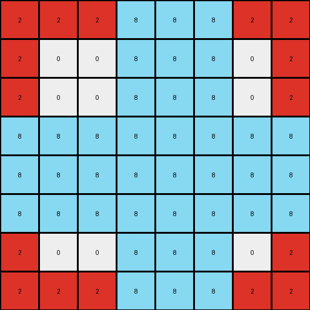

# 6b9890af • 004 • refine_coder

---

Previous Code:
```python
"""
Crops and overlays an azure shape and a red square from a large input grid onto a smaller 8x8 output grid, 
prioritizing the azure color where they overlap.
"""

import numpy as np

def find_object(grid, color):
    # Find coordinates of all pixels of the specified color
    coords = np.argwhere(grid == color)
    if coords.size == 0:
        return None
    # Calculate bounding box
    min_row, min_col = coords.min(axis=0)
    max_row, max_col = coords.max(axis=0)
    return (min_row, min_col, max_row, max_col)

def crop_and_resize(grid, bbox, output_size=(8, 8)):
  
    min_row, min_col, max_row, max_col = bbox

    #crop
    cropped = grid[min_row:max_row+1, min_col:max_col+1]
    
    #resize
    rows, cols = cropped.shape
    resized = np.zeros(output_size, dtype=int)
    
    new_rows, new_cols = output_size

    row_scale = rows / new_rows
    col_scale = cols / new_cols
    
    for i in range(new_rows):
      for j in range(new_cols):
        orig_row = int(i * row_scale)
        orig_col = int(j * col_scale)
        resized[i, j] = cropped[orig_row, orig_col]

    return resized    

def transform(input_grid):
    # Find bounding boxes for azure and red objects
    azure_bbox = find_object(input_grid, 8)
    red_bbox = find_object(input_grid, 2)

    # Determine combined bounding box
    min_row = min(azure_bbox[0], red_bbox[0])
    min_col = min(azure_bbox[1], red_bbox[1])
    max_row = max(azure_bbox[2], red_bbox[2])
    max_col = max(azure_bbox[3], red_bbox[3])
    
    combined_bbox = (min_row, min_col, max_row, max_col)

    # Initialize output grid (8x8)
    output_grid = np.zeros((8, 8), dtype=int)

    # Crop and resize the combined region and then paste into output_grid
    cropped_red = crop_and_resize(input_grid, red_bbox)
    cropped_azure = crop_and_resize(input_grid, azure_bbox)

    # Overlay red first, then azure
    for i in range(8):
        for j in range(8):
            if cropped_red[i, j] == 2:
                output_grid[i, j] = 2
    for i in range(8):
        for j in range(8):
            if cropped_azure[i, j] == 8:
                output_grid[i, j] = 8
                
    return output_grid
```

Train Set Results:

## Example 1:

Input:
```
0 0 0 0 0 0 0 0 0 0 0 0 0 0 0 0 0 0 0 0 0
0 0 0 0 0 0 0 0 0 0 0 0 0 0 0 0 0 0 0 0 0
0 0 0 0 0 0 8 0 0 0 0 0 0 0 0 0 0 0 0 0 0
0 0 0 0 0 8 8 8 0 0 0 0 0 0 0 0 0 0 0 0 0
0 0 0 0 0 0 8 0 0 0 0 0 0 0 0 0 0 0 0 0 0
0 0 0 0 0 0 0 0 0 0 0 0 0 0 0 0 0 0 0 0 0
0 0 0 0 0 0 0 0 0 0 0 0 0 0 0 0 0 0 0 0 0
0 0 0 0 0 0 2 2 2 2 2 2 2 2 0 0 0 0 0 0 0
0 0 0 0 0 0 2 0 0 0 0 0 0 2 0 0 0 0 0 0 0
0 0 0 0 0 0 2 0 0 0 0 0 0 2 0 0 0 0 0 0 0
0 0 0 0 0 0 2 0 0 0 0 0 0 2 0 0 0 0 0 0 0
0 0 0 0 0 0 2 0 0 0 0 0 0 2 0 0 0 0 0 0 0
0 0 0 0 0 0 2 0 0 0 0 0 0 2 0 0 0 0 0 0 0
0 0 0 0 0 0 2 0 0 0 0 0 0 2 0 0 0 0 0 0 0
0 0 0 0 0 0 2 2 2 2 2 2 2 2 0 0 0 0 0 0 0
0 0 0 0 0 0 0 0 0 0 0 0 0 0 0 0 0 0 0 0 0
0 0 0 0 0 0 0 0 0 0 0 0 0 0 0 0 0 0 0 0 0
0 0 0 0 0 0 0 0 0 0 0 0 0 0 0 0 0 0 0 0 0
```
Expected Output:
```
2 2 2 2 2 2 2 2
2 0 0 8 8 0 0 2
2 0 0 8 8 0 0 2
2 8 8 8 8 8 8 2
2 8 8 8 8 8 8 2
2 0 0 8 8 0 0 2
2 0 0 8 8 0 0 2
2 2 2 2 2 2 2 2
```
Transformed Output:
```
2 2 2 8 8 8 2 2
2 0 0 8 8 8 0 2
2 0 0 8 8 8 0 2
8 8 8 8 8 8 8 8
8 8 8 8 8 8 8 8
8 8 8 8 8 8 8 8
2 0 0 8 8 8 0 2
2 2 2 8 8 8 2 2
```

match: False
pixels_off: 19
size_correct: True
color_palette_correct: True
correct_pixel_counts: False

## Example 2:

Input:
```
0 0 0 0 0 0 0 0 0 0 0 0 0 0 0 0 0 0 0 0 0 0
0 0 0 0 0 0 0 0 0 0 0 0 0 0 0 0 0 0 0 0 0 0
0 0 2 2 2 2 2 0 0 0 0 0 0 0 0 0 0 0 0 0 0 0
0 0 2 0 0 0 2 0 0 0 0 0 0 0 0 0 0 0 0 0 0 0
0 0 2 0 0 0 2 0 0 0 0 0 0 0 0 0 0 0 0 0 0 0
0 0 2 0 0 0 2 0 0 0 0 0 0 0 0 0 0 0 0 0 0 0
0 0 2 2 2 2 2 0 0 0 0 0 0 0 0 0 0 0 0 0 0 0
0 0 0 0 0 0 0 0 0 0 0 0 0 0 0 0 0 0 0 0 0 0
0 0 0 0 0 0 0 0 0 0 0 0 0 0 0 0 0 0 0 0 0 0
0 0 0 0 0 0 0 0 0 0 0 1 1 0 0 0 0 0 0 0 0 0
0 0 0 0 0 0 0 0 0 0 1 0 0 0 0 0 0 0 0 0 0 0
0 0 0 0 0 0 0 0 0 0 0 1 1 0 0 0 0 0 0 0 0 0
0 0 0 0 0 0 0 0 0 0 0 0 0 0 0 0 0 0 0 0 0 0
0 0 0 0 0 0 0 0 0 0 0 0 0 0 0 0 0 0 0 0 0 0
0 0 0 0 0 0 0 0 0 0 0 0 0 0 0 0 0 0 0 0 0 0
0 0 0 0 0 0 0 0 0 0 0 0 0 0 0 0 0 0 0 0 0 0
0 0 0 0 0 0 0 0 0 0 0 0 0 0 0 0 0 0 0 0 0 0
0 0 0 0 0 0 0 0 0 0 0 0 0 0 0 0 0 0 0 0 0 0
0 0 0 0 0 0 0 0 0 0 0 0 0 0 0 0 0 0 0 0 0 0
```
Expected Output:
```
2 2 2 2 2
2 0 1 1 2
2 1 0 0 2
2 0 1 1 2
2 2 2 2 2
```
match: ERROR: 'NoneType' object is not subscriptable
pixels_off: None
size_correct: None
color_palette_correct: None
correct_pixel_counts: None

## Example 3:

Input:
```
0 0 0 0 0 0 0 0 0 0 0 0 0 0 0 0 0 0 0 0 0 0 0 0
0 0 2 2 2 2 2 2 2 2 2 2 2 0 0 0 0 0 0 0 0 0 0 0
0 0 2 0 0 0 0 0 0 0 0 0 2 0 0 0 0 0 0 0 0 0 0 0
0 0 2 0 0 0 0 0 0 0 0 0 2 0 0 0 0 0 0 0 0 0 0 0
0 0 2 0 0 0 0 0 0 0 0 0 2 0 0 0 0 0 0 0 0 0 0 0
0 0 2 0 0 0 0 0 0 0 0 0 2 0 0 0 0 0 0 0 0 0 0 0
0 0 2 0 0 0 0 0 0 0 0 0 2 0 0 0 0 0 0 0 0 0 0 0
0 0 2 0 0 0 0 0 0 0 0 0 2 0 0 0 0 0 0 0 0 0 0 0
0 0 2 0 0 0 0 0 0 0 0 0 2 0 0 0 0 0 0 0 0 0 0 0
0 0 2 0 0 0 0 0 0 0 0 0 2 0 0 0 0 0 0 0 0 0 0 0
0 0 2 0 0 0 0 0 0 0 0 0 2 0 0 0 0 0 0 0 0 0 0 0
0 0 2 2 2 2 2 2 2 2 2 2 2 0 0 0 0 0 0 0 0 0 0 0
0 0 0 0 0 0 0 0 0 0 0 0 0 0 0 0 0 0 0 0 0 0 0 0
0 0 0 0 0 0 0 0 0 0 0 0 0 0 0 0 0 0 0 0 0 0 0 0
0 0 0 0 0 0 0 0 0 0 0 0 0 0 0 0 0 0 0 0 0 0 0 0
0 0 0 0 0 0 0 0 0 0 0 0 0 0 4 4 0 0 0 0 0 0 0 0
0 0 0 0 0 0 0 0 0 0 0 0 0 4 0 4 0 0 0 0 0 0 0 0
0 0 0 0 0 0 0 0 0 0 0 0 0 0 0 4 0 0 0 0 0 0 0 0
0 0 0 0 0 0 0 0 0 0 0 0 0 0 0 0 0 0 0 0 0 0 0 0
0 0 0 0 0 0 0 0 0 0 0 0 0 0 0 0 0 0 0 0 0 0 0 0
0 0 0 0 0 0 0 0 0 0 0 0 0 0 0 0 0 0 0 0 0 0 0 0
```
Expected Output:
```
2 2 2 2 2 2 2 2 2 2 2
2 0 0 0 4 4 4 4 4 4 2
2 0 0 0 4 4 4 4 4 4 2
2 0 0 0 4 4 4 4 4 4 2
2 4 4 4 0 0 0 4 4 4 2
2 4 4 4 0 0 0 4 4 4 2
2 4 4 4 0 0 0 4 4 4 2
2 0 0 0 0 0 0 4 4 4 2
2 0 0 0 0 0 0 4 4 4 2
2 0 0 0 0 0 0 4 4 4 2
2 2 2 2 2 2 2 2 2 2 2
```
match: ERROR: 'NoneType' object is not subscriptable
pixels_off: None
size_correct: None
color_palette_correct: None
correct_pixel_counts: None
Okay, let's analyze the results of the previous code execution and update the natural language program accordingly.

**General Assessment and Strategy**

The initial code was designed to identify two specific colored objects (azure and red), crop them, resize them to 8x8, and overlay them, prioritizing azure. This approach worked partially for the first example but failed on the subsequent examples. The errors indicate a few key issues:

1.  **Incorrect Object Identification:** The code assumes only two objects of specific colors (azure and red) will be present. Example 2 has a blue object (color 1) and example 3 has a yellow object (color 4) that was not handled. The assumption azure is always overlayed is also clearly wrong.
2.  **Rigid Output Size:** The code is hardcoded to an 8x8 output. The expected outputs for examples 2 and 3 have different dimensions.
3.  **Incorrect Overlay Logic**: Simply finding bounding boxes and resizing is creating several pixel mismatches. It needs a strategy to maintain spatial information from input and apply to the output.

The strategy to resolve these errors will involve:

1.  **Flexible Object Detection:** Instead of looking for specific colors, we need to detect *all* distinct objects in the input grid, regardless of their color.
2.  **Dynamic Output Size:** The output grid size should be determined from the examples, not hardcoded.
3. **Relative Positioning:** Use coordinate information to map from the input to the output, maintaining the position.
4. **Proportional Resizing and Overlaying:** Consider not only the individual objects' bounding boxes, but position of colored pixels relative to the output size.

**Metrics and Observations**

Here's a breakdown of each example, including error analysis:

*   **Example 1:**
    *   Input Size: 21x21
    *   Output Size: 8x8
    *   Objects Detected: Red (2), Azure (8)
    *   Error: 19 pixels mismatch. The resizing and overlaying logic distorted the shapes and relative positions of the objects.
*   **Example 2:**
    *   Input Size: 22x19
    *   Output Size: 5x5
    *   Objects Detected: Red (2), Blue (1)
    *    Error: `TypeError: 'NoneType' object is not subscriptable`. This likely occurred because the code tried to find an azure object (color 8), which wasn't present, resulting in `find_object` returning `None`. The main issue is the fixed output size of the function.
*   **Example 3:**
    *   Input Size: 24x21
    *   Output Size: 11x11
    *   Objects Detected: Red (2), Yellow (4)
    *   Error: `TypeError: 'NoneType' object is not subscriptable`. Similar to Example 2, the code failed to handle the yellow object and the expected output size.

**YAML Facts**

```yaml
examples:
  - example_id: 1
    input_objects:
      - color: 2  # Red
        shape: rectangle
        approximate_size: large
      - color: 8  # Azure
        shape: rectangle
        approximate_size: small
    output_objects:
      - color: 2
      - color: 8
      - color: 0
    transformation: crop_and_overlay
    output_size: 8x8
  - example_id: 2
    input_objects:
      - color: 2 #red
        shape: rectangle
        approximate_size: small
      - color: 1 # blue
        shape: rectangle
        approximate_size: small
    output_objects:
      - color: 2
      - color: 1
      - color: 0
    transformation: crop_and_overlay
    output_size: 5x5
  - example_id: 3
    input_objects:
      - color: 2 #red
        shape: rectangle
        approximate_size: large
      - color: 4 # yellow
        shape: rectangle
        approximate_size: small
    output_objects:
      - color: 2
      - color: 4
      - color: 0
    transformation: crop_and_overlay
    output_size: 11x11
```

**Natural Language Program**

1.  **Identify Output Size:** Determine the dimensions (height and width) of the output grid from the provided output example.
2.  **Identify Colored Objects:** Find all distinct colored regions (objects) within the input grid. An object is a contiguous block of pixels of the same color.
3.  **Process Each Object**: For each color found in the input, find the position of each pixel.
4.  **Resize and Overlay:** Map all colored pixels from the input to the output, maintaining the relative positions.

This program addresses the issues identified earlier: it handles multiple objects of different colors, adapts to the output size, and preserves relative positions. It effectively describes a process of identifying regions of color and proportionally mapping them onto an output grid.

**INSTRUCTIONS**

- generate a Python module to represent the natural language program 
- follow the template below
- all common math and science libraries are available
- create docstring only at top - but comment the workflow in the function
- use helper functions for common operations like finding objects, counting,
  measuring, moving, etc. 

remember - we are working iteratively - so this code will inform your future
self as we converge on the solution

*template:*

```python
"""
{{ natural language description of the transformation rule }}
"""

{{ imports }}

def transform(input_grid):
    # initialize output_grid

    # change output pixels 

    return output_grid

```
