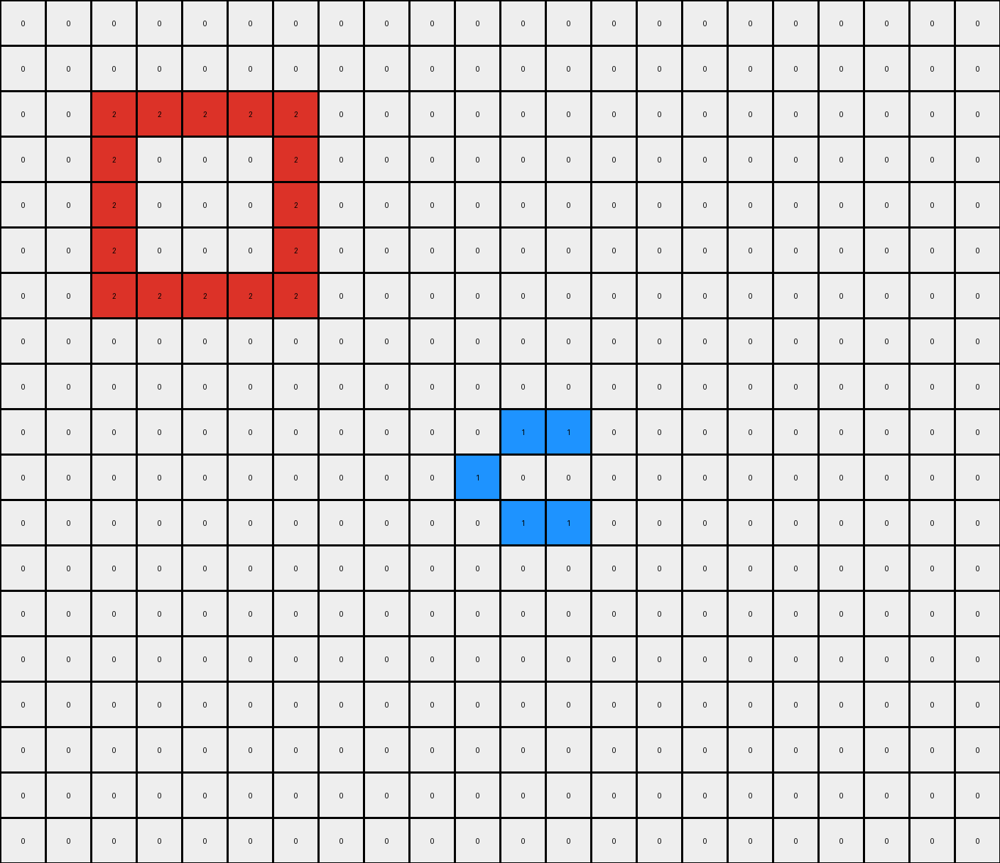
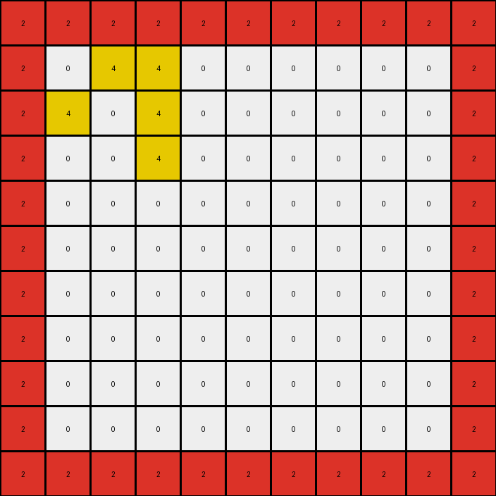

# 6b9890af • 015 • refine_dreamer

---

Previous Code:
```python
"""
Combines a large red rectangular outline and a smaller filled yellow rectangle into a new grid. The transformation preserves the large rectangle's outline and places the smaller yellow rectangle just inside the top border of the large shape, while significantly reducing the overall size.
"""

import numpy as np

def find_object(grid, color):
    # Find coordinates of all pixels of the specified color.
    coords = np.argwhere(grid == color)
    if coords.size == 0:
        return None
    return coords

def find_rectangle_outline(grid, color):
    #find the object
    coords = find_object(grid,color)
    if coords is None:
      return None
    # Find the bounding box of the outline.
    min_y, min_x = np.min(coords, axis=0)
    max_y, max_x = np.max(coords, axis=0)

    # Create a mask for the outline.
    mask = (grid[min_y:max_y+1, min_x:max_x+1] == color)
    outline_coords = []
    for y in range(mask.shape[0]):
        for x in range(mask.shape[1]):
            if mask[y,x]:
                #check neighbors to determine if outline
                neighbors = 0
                if y > 0 and mask[y-1,x]:
                    neighbors += 1
                if y < mask.shape[0]-1 and mask[y+1,x]:
                    neighbors +=1
                if x > 0 and mask[y, x-1]:
                    neighbors += 1
                if x < mask.shape[1] -1 and mask[y, x+1]:
                    neighbors += 1
                #if it is a solid shape, neighbor count could be 4
                if neighbors < 4:
                    outline_coords.append((min_y + y, min_x + x))

    return outline_coords
                

def find_filled_rectangle(grid, color):
    # Find coordinates of all pixels of the specified color.
    coords = find_object(grid, color)
    if coords is None:
        return None

    # Find the bounding box.
    min_y, min_x = np.min(coords, axis=0)
    max_y, max_x = np.max(coords, axis=0)
    
    return  coords #return all coords for filled shape


def transform(input_grid):
    # Find the large red outline.
    red_outline_coords = find_rectangle_outline(input_grid, 2)
    if red_outline_coords is None:
        #if red outline is not present, just return input
        return input_grid
    red_outline_coords = np.array(red_outline_coords)  # Convert to numpy array for easier manipulation

    # Find the small yellow filled rectangle.
    yellow_filled_coords = find_filled_rectangle(input_grid, 4)
    if yellow_filled_coords is None:
        #If yellow shape is missing, do not transform
        return input_grid
    yellow_filled_coords = np.array(yellow_filled_coords)


    # Determine bounding box for the new combined shape.
    min_red_y, min_red_x = np.min(red_outline_coords, axis=0)
    max_red_y, max_red_x = np.max(red_outline_coords, axis=0)
    
    #output is based on the red outline shape, adjusted by the yellow shape dimensions
    output_height = max_red_y - min_red_y + 1
    output_width =  max_red_x - min_red_x + 1

    # Initialize the output grid.
    output_grid = np.zeros((output_height, output_width), dtype=int)

    # Draw the red outline.
    for y, x in red_outline_coords:
        output_grid[y - min_red_y, x - min_red_x] = 2

    #calculate offset to draw yellow shape inside the red outline
    yellow_height = np.max(yellow_filled_coords[:,0]) - np.min(yellow_filled_coords[:,0]) + 1
    yellow_width = np.max(yellow_filled_coords[:,1]) - np.min(yellow_filled_coords[:,1]) + 1

    # Draw the yellow filled rectangle, positioning it inside top of red outline
    start_y = 1 #place inside top border
    start_x = 1

    for y, x in yellow_filled_coords:
      #map to new coord
      new_y = y - np.min(yellow_filled_coords[:,0]) + start_y
      new_x = x - np.min(yellow_filled_coords[:,1]) + start_x
      if new_y < output_height and new_x < output_width:
        output_grid[new_y,new_x] = 4

    return output_grid
```

Train Set Results:

## Example 1:

Input:
```
0 0 0 0 0 0 0 0 0 0 0 0 0 0 0 0 0 0 0 0 0
0 0 0 0 0 0 0 0 0 0 0 0 0 0 0 0 0 0 0 0 0
0 0 0 0 0 0 8 0 0 0 0 0 0 0 0 0 0 0 0 0 0
0 0 0 0 0 8 8 8 0 0 0 0 0 0 0 0 0 0 0 0 0
0 0 0 0 0 0 8 0 0 0 0 0 0 0 0 0 0 0 0 0 0
0 0 0 0 0 0 0 0 0 0 0 0 0 0 0 0 0 0 0 0 0
0 0 0 0 0 0 0 0 0 0 0 0 0 0 0 0 0 0 0 0 0
0 0 0 0 0 0 2 2 2 2 2 2 2 2 0 0 0 0 0 0 0
0 0 0 0 0 0 2 0 0 0 0 0 0 2 0 0 0 0 0 0 0
0 0 0 0 0 0 2 0 0 0 0 0 0 2 0 0 0 0 0 0 0
0 0 0 0 0 0 2 0 0 0 0 0 0 2 0 0 0 0 0 0 0
0 0 0 0 0 0 2 0 0 0 0 0 0 2 0 0 0 0 0 0 0
0 0 0 0 0 0 2 0 0 0 0 0 0 2 0 0 0 0 0 0 0
0 0 0 0 0 0 2 0 0 0 0 0 0 2 0 0 0 0 0 0 0
0 0 0 0 0 0 2 2 2 2 2 2 2 2 0 0 0 0 0 0 0
0 0 0 0 0 0 0 0 0 0 0 0 0 0 0 0 0 0 0 0 0
0 0 0 0 0 0 0 0 0 0 0 0 0 0 0 0 0 0 0 0 0
0 0 0 0 0 0 0 0 0 0 0 0 0 0 0 0 0 0 0 0 0
```
Expected Output:
```
2 2 2 2 2 2 2 2
2 0 0 8 8 0 0 2
2 0 0 8 8 0 0 2
2 8 8 8 8 8 8 2
2 8 8 8 8 8 8 2
2 0 0 8 8 0 0 2
2 0 0 8 8 0 0 2
2 2 2 2 2 2 2 2
```
Transformed Output:
```
0 0 0 0 0 0 0 0 0 0 0 0 0 0 0 0 0 0 0 0 0
0 0 0 0 0 0 0 0 0 0 0 0 0 0 0 0 0 0 0 0 0
0 0 0 0 0 0 8 0 0 0 0 0 0 0 0 0 0 0 0 0 0
0 0 0 0 0 8 8 8 0 0 0 0 0 0 0 0 0 0 0 0 0
0 0 0 0 0 0 8 0 0 0 0 0 0 0 0 0 0 0 0 0 0
0 0 0 0 0 0 0 0 0 0 0 0 0 0 0 0 0 0 0 0 0
0 0 0 0 0 0 0 0 0 0 0 0 0 0 0 0 0 0 0 0 0
0 0 0 0 0 0 2 2 2 2 2 2 2 2 0 0 0 0 0 0 0
0 0 0 0 0 0 2 0 0 0 0 0 0 2 0 0 0 0 0 0 0
0 0 0 0 0 0 2 0 0 0 0 0 0 2 0 0 0 0 0 0 0
0 0 0 0 0 0 2 0 0 0 0 0 0 2 0 0 0 0 0 0 0
0 0 0 0 0 0 2 0 0 0 0 0 0 2 0 0 0 0 0 0 0
0 0 0 0 0 0 2 0 0 0 0 0 0 2 0 0 0 0 0 0 0
0 0 0 0 0 0 2 0 0 0 0 0 0 2 0 0 0 0 0 0 0
0 0 0 0 0 0 2 2 2 2 2 2 2 2 0 0 0 0 0 0 0
0 0 0 0 0 0 0 0 0 0 0 0 0 0 0 0 0 0 0 0 0
0 0 0 0 0 0 0 0 0 0 0 0 0 0 0 0 0 0 0 0 0
0 0 0 0 0 0 0 0 0 0 0 0 0 0 0 0 0 0 0 0 0
```

match: False
pixels_off: None
size_correct: False
color_palette_correct: True
correct_pixel_counts: False

## Example 2:

Input:
```
0 0 0 0 0 0 0 0 0 0 0 0 0 0 0 0 0 0 0 0 0 0
0 0 0 0 0 0 0 0 0 0 0 0 0 0 0 0 0 0 0 0 0 0
0 0 2 2 2 2 2 0 0 0 0 0 0 0 0 0 0 0 0 0 0 0
0 0 2 0 0 0 2 0 0 0 0 0 0 0 0 0 0 0 0 0 0 0
0 0 2 0 0 0 2 0 0 0 0 0 0 0 0 0 0 0 0 0 0 0
0 0 2 0 0 0 2 0 0 0 0 0 0 0 0 0 0 0 0 0 0 0
0 0 2 2 2 2 2 0 0 0 0 0 0 0 0 0 0 0 0 0 0 0
0 0 0 0 0 0 0 0 0 0 0 0 0 0 0 0 0 0 0 0 0 0
0 0 0 0 0 0 0 0 0 0 0 0 0 0 0 0 0 0 0 0 0 0
0 0 0 0 0 0 0 0 0 0 0 1 1 0 0 0 0 0 0 0 0 0
0 0 0 0 0 0 0 0 0 0 1 0 0 0 0 0 0 0 0 0 0 0
0 0 0 0 0 0 0 0 0 0 0 1 1 0 0 0 0 0 0 0 0 0
0 0 0 0 0 0 0 0 0 0 0 0 0 0 0 0 0 0 0 0 0 0
0 0 0 0 0 0 0 0 0 0 0 0 0 0 0 0 0 0 0 0 0 0
0 0 0 0 0 0 0 0 0 0 0 0 0 0 0 0 0 0 0 0 0 0
0 0 0 0 0 0 0 0 0 0 0 0 0 0 0 0 0 0 0 0 0 0
0 0 0 0 0 0 0 0 0 0 0 0 0 0 0 0 0 0 0 0 0 0
0 0 0 0 0 0 0 0 0 0 0 0 0 0 0 0 0 0 0 0 0 0
0 0 0 0 0 0 0 0 0 0 0 0 0 0 0 0 0 0 0 0 0 0
```
Expected Output:
```
2 2 2 2 2
2 0 1 1 2
2 1 0 0 2
2 0 1 1 2
2 2 2 2 2
```
Transformed Output:
```
0 0 0 0 0 0 0 0 0 0 0 0 0 0 0 0 0 0 0 0 0 0
0 0 0 0 0 0 0 0 0 0 0 0 0 0 0 0 0 0 0 0 0 0
0 0 2 2 2 2 2 0 0 0 0 0 0 0 0 0 0 0 0 0 0 0
0 0 2 0 0 0 2 0 0 0 0 0 0 0 0 0 0 0 0 0 0 0
0 0 2 0 0 0 2 0 0 0 0 0 0 0 0 0 0 0 0 0 0 0
0 0 2 0 0 0 2 0 0 0 0 0 0 0 0 0 0 0 0 0 0 0
0 0 2 2 2 2 2 0 0 0 0 0 0 0 0 0 0 0 0 0 0 0
0 0 0 0 0 0 0 0 0 0 0 0 0 0 0 0 0 0 0 0 0 0
0 0 0 0 0 0 0 0 0 0 0 0 0 0 0 0 0 0 0 0 0 0
0 0 0 0 0 0 0 0 0 0 0 1 1 0 0 0 0 0 0 0 0 0
0 0 0 0 0 0 0 0 0 0 1 0 0 0 0 0 0 0 0 0 0 0
0 0 0 0 0 0 0 0 0 0 0 1 1 0 0 0 0 0 0 0 0 0
0 0 0 0 0 0 0 0 0 0 0 0 0 0 0 0 0 0 0 0 0 0
0 0 0 0 0 0 0 0 0 0 0 0 0 0 0 0 0 0 0 0 0 0
0 0 0 0 0 0 0 0 0 0 0 0 0 0 0 0 0 0 0 0 0 0
0 0 0 0 0 0 0 0 0 0 0 0 0 0 0 0 0 0 0 0 0 0
0 0 0 0 0 0 0 0 0 0 0 0 0 0 0 0 0 0 0 0 0 0
0 0 0 0 0 0 0 0 0 0 0 0 0 0 0 0 0 0 0 0 0 0
0 0 0 0 0 0 0 0 0 0 0 0 0 0 0 0 0 0 0 0 0 0
```

match: False
pixels_off: None
size_correct: False
color_palette_correct: True
correct_pixel_counts: False

## Example 3:

Input:
```
0 0 0 0 0 0 0 0 0 0 0 0 0 0 0 0 0 0 0 0 0 0 0 0
0 0 2 2 2 2 2 2 2 2 2 2 2 0 0 0 0 0 0 0 0 0 0 0
0 0 2 0 0 0 0 0 0 0 0 0 2 0 0 0 0 0 0 0 0 0 0 0
0 0 2 0 0 0 0 0 0 0 0 0 2 0 0 0 0 0 0 0 0 0 0 0
0 0 2 0 0 0 0 0 0 0 0 0 2 0 0 0 0 0 0 0 0 0 0 0
0 0 2 0 0 0 0 0 0 0 0 0 2 0 0 0 0 0 0 0 0 0 0 0
0 0 2 0 0 0 0 0 0 0 0 0 2 0 0 0 0 0 0 0 0 0 0 0
0 0 2 0 0 0 0 0 0 0 0 0 2 0 0 0 0 0 0 0 0 0 0 0
0 0 2 0 0 0 0 0 0 0 0 0 2 0 0 0 0 0 0 0 0 0 0 0
0 0 2 0 0 0 0 0 0 0 0 0 2 0 0 0 0 0 0 0 0 0 0 0
0 0 2 0 0 0 0 0 0 0 0 0 2 0 0 0 0 0 0 0 0 0 0 0
0 0 2 2 2 2 2 2 2 2 2 2 2 0 0 0 0 0 0 0 0 0 0 0
0 0 0 0 0 0 0 0 0 0 0 0 0 0 0 0 0 0 0 0 0 0 0 0
0 0 0 0 0 0 0 0 0 0 0 0 0 0 0 0 0 0 0 0 0 0 0 0
0 0 0 0 0 0 0 0 0 0 0 0 0 0 0 0 0 0 0 0 0 0 0 0
0 0 0 0 0 0 0 0 0 0 0 0 0 0 4 4 0 0 0 0 0 0 0 0
0 0 0 0 0 0 0 0 0 0 0 0 0 4 0 4 0 0 0 0 0 0 0 0
0 0 0 0 0 0 0 0 0 0 0 0 0 0 0 4 0 0 0 0 0 0 0 0
0 0 0 0 0 0 0 0 0 0 0 0 0 0 0 0 0 0 0 0 0 0 0 0
0 0 0 0 0 0 0 0 0 0 0 0 0 0 0 0 0 0 0 0 0 0 0 0
0 0 0 0 0 0 0 0 0 0 0 0 0 0 0 0 0 0 0 0 0 0 0 0
```
Expected Output:
```
2 2 2 2 2 2 2 2 2 2 2
2 0 0 0 4 4 4 4 4 4 2
2 0 0 0 4 4 4 4 4 4 2
2 0 0 0 4 4 4 4 4 4 2
2 4 4 4 0 0 0 4 4 4 2
2 4 4 4 0 0 0 4 4 4 2
2 4 4 4 0 0 0 4 4 4 2
2 0 0 0 0 0 0 4 4 4 2
2 0 0 0 0 0 0 4 4 4 2
2 0 0 0 0 0 0 4 4 4 2
2 2 2 2 2 2 2 2 2 2 2
```
Transformed Output:
```
2 2 2 2 2 2 2 2 2 2 2
2 0 4 4 0 0 0 0 0 0 2
2 4 0 4 0 0 0 0 0 0 2
2 0 0 4 0 0 0 0 0 0 2
2 0 0 0 0 0 0 0 0 0 2
2 0 0 0 0 0 0 0 0 0 2
2 0 0 0 0 0 0 0 0 0 2
2 0 0 0 0 0 0 0 0 0 2
2 0 0 0 0 0 0 0 0 0 2
2 0 0 0 0 0 0 0 0 0 2
2 2 2 2 2 2 2 2 2 2 2
```

match: False
pixels_off: 50
size_correct: True
color_palette_correct: True
correct_pixel_counts: False
**INSTRUCTIONS**

The code above was generated based on observations from the first training
example

we have tested the transform function on each of the task example inputs and
compared with the expected output

review each of the examples provided and the results and consider how the
natural language program should be updated to accommodate this new knowledge

respond with the following deliverables:

- general assessment of the information provided and strategy for resolving the
  errors
- gather metrics about each of the examples and results - use code_execution to
  develop accurate reports on your assumptions
- a YAML block documenting facts - Focus on identifying objects, their properties, and the actions performed on them.
- a natural language program - Be as clear and concise as possible, providing a complete description of the transformation rule.


your responses should be considered as information in a report - not a
conversation
