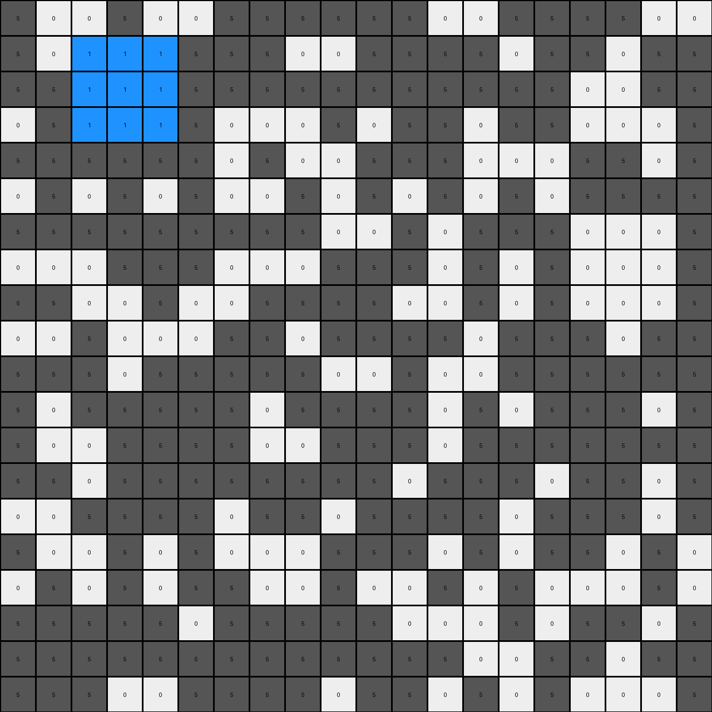

# 6cf79266 • 004 • refine_coder

---

Previous Code:
```python
"""
Locate a 3x3 square region of gray (5) pixels and change all pixels within this region to blue (1).
Leave every other pixel unchanged.
"""

import numpy as np

def find_3x3_gray_square(grid):
    # Find a 3x3 gray square.  This version looks at a specific location.
    rows, cols = grid.shape
    for r in range(rows - 2):
        for c in range(cols - 2):
            if all(grid[r+i][c+j] == 5 for i in range(3) for j in range(3)):
                return (r, c)
    return None

def transform(input_grid):
    """
    Transforms the input grid by changing a single 3x3 gray square to blue.
    """
    output_grid = np.copy(input_grid)  # Initialize output as a copy of the input

    # Find the coordinates of the 3x3 gray square.
    square_coords = find_3x3_gray_square(input_grid)

    if square_coords:
      #change the output
        row, col = square_coords
        for i in range(3):
            for j in range(3):
                output_grid[row + i][col + j] = 1  # Change to blue

    return output_grid
```

Train Set Results:

## Example 1:

Input:
```
5 0 0 5 0 0 5 5 5 5 5 5 0 0 5 5 5 5 0 0
5 0 5 5 5 5 5 5 0 0 5 5 5 5 0 5 5 0 5 5
5 5 5 5 5 5 5 5 5 5 5 5 5 5 5 5 0 0 5 5
0 5 5 5 5 5 0 0 0 5 0 5 5 0 5 5 0 0 0 5
5 5 5 5 5 5 0 5 0 0 5 5 5 0 0 0 5 5 0 5
0 5 0 5 0 5 0 0 5 0 5 0 5 0 5 0 5 5 5 5
5 5 5 5 5 5 5 5 5 0 0 5 0 5 5 5 0 0 0 5
0 0 0 5 5 5 0 0 0 5 5 5 0 5 0 5 0 0 0 5
5 5 0 0 5 0 0 5 5 5 5 0 0 5 0 5 0 0 0 5
0 0 5 0 0 0 5 5 0 5 5 5 5 0 5 5 5 0 5 5
5 5 5 0 5 5 5 5 5 0 0 5 0 0 5 5 5 5 5 5
5 0 5 5 5 5 5 0 5 5 5 5 0 5 0 5 5 5 0 5
5 0 0 5 5 5 5 0 0 5 5 5 0 5 5 5 5 5 5 5
5 5 0 5 5 5 5 5 5 5 5 0 5 5 5 0 5 5 0 5
0 0 5 5 5 5 0 5 5 0 5 5 5 5 0 5 5 5 0 5
5 0 0 5 0 5 0 0 0 5 5 5 0 5 0 5 5 0 5 0
0 5 0 5 0 5 5 0 0 5 0 0 5 0 5 0 0 0 5 0
5 5 5 5 5 0 5 5 5 5 5 0 0 0 5 0 5 5 0 5
5 5 5 5 5 5 5 5 5 5 5 5 5 0 0 5 5 0 5 5
5 5 5 0 0 5 5 5 5 0 5 5 0 5 0 5 0 0 0 5
```
Expected Output:
```
5 0 0 5 0 0 5 5 5 5 5 5 0 0 5 5 5 5 0 0
5 0 5 5 5 5 5 5 0 0 5 5 5 5 0 5 5 0 5 5
5 5 5 5 5 5 5 5 5 5 5 5 5 5 5 5 0 0 5 5
0 5 5 5 5 5 0 0 0 5 0 5 5 0 5 5 0 0 0 5
5 5 5 5 5 5 0 5 0 0 5 5 5 0 0 0 5 5 0 5
0 5 0 5 0 5 0 0 5 0 5 0 5 0 5 0 5 5 5 5
5 5 5 5 5 5 5 5 5 0 0 5 0 5 5 5 1 1 1 5
0 0 0 5 5 5 0 0 0 5 5 5 0 5 0 5 1 1 1 5
5 5 0 0 5 0 0 5 5 5 5 0 0 5 0 5 1 1 1 5
0 0 5 0 0 0 5 5 0 5 5 5 5 0 5 5 5 0 5 5
5 5 5 0 5 5 5 5 5 0 0 5 0 0 5 5 5 5 5 5
5 0 5 5 5 5 5 0 5 5 5 5 0 5 0 5 5 5 0 5
5 0 0 5 5 5 5 0 0 5 5 5 0 5 5 5 5 5 5 5
5 5 0 5 5 5 5 5 5 5 5 0 5 5 5 0 5 5 0 5
0 0 5 5 5 5 0 5 5 0 5 5 5 5 0 5 5 5 0 5
5 0 0 5 0 5 0 0 0 5 5 5 0 5 0 5 5 0 5 0
0 5 0 5 0 5 5 0 0 5 0 0 5 0 5 0 0 0 5 0
5 5 5 5 5 0 5 5 5 5 5 0 0 0 5 0 5 5 0 5
5 5 5 5 5 5 5 5 5 5 5 5 5 0 0 5 5 0 5 5
5 5 5 0 0 5 5 5 5 0 5 5 0 5 0 5 0 0 0 5
```
Transformed Output:
```
5 0 0 5 0 0 5 5 5 5 5 5 0 0 5 5 5 5 0 0
5 0 1 1 1 5 5 5 0 0 5 5 5 5 0 5 5 0 5 5
5 5 1 1 1 5 5 5 5 5 5 5 5 5 5 5 0 0 5 5
0 5 1 1 1 5 0 0 0 5 0 5 5 0 5 5 0 0 0 5
5 5 5 5 5 5 0 5 0 0 5 5 5 0 0 0 5 5 0 5
0 5 0 5 0 5 0 0 5 0 5 0 5 0 5 0 5 5 5 5
5 5 5 5 5 5 5 5 5 0 0 5 0 5 5 5 0 0 0 5
0 0 0 5 5 5 0 0 0 5 5 5 0 5 0 5 0 0 0 5
5 5 0 0 5 0 0 5 5 5 5 0 0 5 0 5 0 0 0 5
0 0 5 0 0 0 5 5 0 5 5 5 5 0 5 5 5 0 5 5
5 5 5 0 5 5 5 5 5 0 0 5 0 0 5 5 5 5 5 5
5 0 5 5 5 5 5 0 5 5 5 5 0 5 0 5 5 5 0 5
5 0 0 5 5 5 5 0 0 5 5 5 0 5 5 5 5 5 5 5
5 5 0 5 5 5 5 5 5 5 5 0 5 5 5 0 5 5 0 5
0 0 5 5 5 5 0 5 5 0 5 5 5 5 0 5 5 5 0 5
5 0 0 5 0 5 0 0 0 5 5 5 0 5 0 5 5 0 5 0
0 5 0 5 0 5 5 0 0 5 0 0 5 0 5 0 0 0 5 0
5 5 5 5 5 0 5 5 5 5 5 0 0 0 5 0 5 5 0 5
5 5 5 5 5 5 5 5 5 5 5 5 5 0 0 5 5 0 5 5
5 5 5 0 0 5 5 5 5 0 5 5 0 5 0 5 0 0 0 5
```

match: False
pixels_off: 18
size_correct: True
color_palette_correct: True
correct_pixel_counts: False

## Example 2:

Input:
```
3 3 3 3 0 3 0 3 0 3 3 0 0 3 3 3 0 3 0 0
0 0 3 3 0 0 3 0 3 3 0 3 0 3 3 0 0 3 3 0
3 3 3 3 3 0 0 3 0 0 0 3 0 3 3 0 3 3 3 3
3 0 3 3 0 0 0 0 3 0 3 3 0 3 3 3 0 3 3 0
0 0 0 3 0 3 0 3 3 3 0 3 3 3 0 3 3 3 0 0
3 3 0 0 3 3 0 3 3 3 3 0 0 3 0 3 3 3 3 0
0 3 0 0 0 0 3 3 0 3 0 0 3 0 0 0 3 0 3 0
3 0 3 0 0 0 0 0 0 3 3 3 0 3 3 3 3 3 3 3
0 3 3 0 0 0 0 3 0 3 3 0 3 3 0 0 3 3 3 3
0 0 0 3 3 0 0 3 3 3 3 3 0 3 0 3 0 3 3 3
3 0 3 3 0 3 3 3 0 0 3 0 3 0 0 0 3 3 0 3
3 0 0 3 0 0 0 3 3 3 3 0 0 3 0 3 0 3 3 3
0 3 3 0 0 0 3 3 0 3 3 3 3 0 0 3 0 0 3 3
0 0 3 0 3 3 3 3 0 0 0 3 3 3 0 0 3 0 3 0
3 0 3 3 3 0 3 3 0 3 3 3 3 3 3 3 3 0 0 3
0 0 3 0 3 3 0 0 3 0 3 0 3 3 0 3 3 3 0 0
3 3 0 3 3 0 0 0 0 0 0 0 3 0 3 0 0 0 3 3
0 3 0 3 0 0 3 3 3 0 3 3 3 0 0 3 3 0 0 0
3 0 0 3 0 3 3 0 3 0 0 3 0 0 3 3 3 3 3 3
3 0 3 3 0 3 3 3 0 0 0 3 0 3 0 3 3 3 0 3
```
Expected Output:
```
3 3 3 3 0 3 0 3 0 3 3 0 0 3 3 3 0 3 0 0
0 0 3 3 0 0 3 0 3 3 0 3 0 3 3 0 0 3 3 0
3 3 3 3 3 0 0 3 0 0 0 3 0 3 3 0 3 3 3 3
3 0 3 3 0 0 0 0 3 0 3 3 0 3 3 3 0 3 3 0
0 0 0 3 0 3 0 3 3 3 0 3 3 3 0 3 3 3 0 0
3 3 0 0 3 3 0 3 3 3 3 0 0 3 0 3 3 3 3 0
0 3 0 1 1 1 3 3 0 3 0 0 3 0 0 0 3 0 3 0
3 0 3 1 1 1 0 0 0 3 3 3 0 3 3 3 3 3 3 3
0 3 3 1 1 1 0 3 0 3 3 0 3 3 0 0 3 3 3 3
0 0 0 3 3 0 0 3 3 3 3 3 0 3 0 3 0 3 3 3
3 0 3 3 0 3 3 3 0 0 3 0 3 0 0 0 3 3 0 3
3 0 0 3 0 0 0 3 3 3 3 0 0 3 0 3 0 3 3 3
0 3 3 0 0 0 3 3 0 3 3 3 3 0 0 3 0 0 3 3
0 0 3 0 3 3 3 3 0 0 0 3 3 3 0 0 3 0 3 0
3 0 3 3 3 0 3 3 0 3 3 3 3 3 3 3 3 0 0 3
0 0 3 0 3 3 0 0 3 0 3 0 3 3 0 3 3 3 0 0
3 3 0 3 3 0 0 0 0 0 0 0 3 0 3 0 0 0 3 3
0 3 0 3 0 0 3 3 3 0 3 3 3 0 0 3 3 0 0 0
3 0 0 3 0 3 3 0 3 0 0 3 0 0 3 3 3 3 3 3
3 0 3 3 0 3 3 3 0 0 0 3 0 3 0 3 3 3 0 3
```
Transformed Output:
```
3 3 3 3 0 3 0 3 0 3 3 0 0 3 3 3 0 3 0 0
0 0 3 3 0 0 3 0 3 3 0 3 0 3 3 0 0 3 3 0
3 3 3 3 3 0 0 3 0 0 0 3 0 3 3 0 3 3 3 3
3 0 3 3 0 0 0 0 3 0 3 3 0 3 3 3 0 3 3 0
0 0 0 3 0 3 0 3 3 3 0 3 3 3 0 3 3 3 0 0
3 3 0 0 3 3 0 3 3 3 3 0 0 3 0 3 3 3 3 0
0 3 0 0 0 0 3 3 0 3 0 0 3 0 0 0 3 0 3 0
3 0 3 0 0 0 0 0 0 3 3 3 0 3 3 3 3 3 3 3
0 3 3 0 0 0 0 3 0 3 3 0 3 3 0 0 3 3 3 3
0 0 0 3 3 0 0 3 3 3 3 3 0 3 0 3 0 3 3 3
3 0 3 3 0 3 3 3 0 0 3 0 3 0 0 0 3 3 0 3
3 0 0 3 0 0 0 3 3 3 3 0 0 3 0 3 0 3 3 3
0 3 3 0 0 0 3 3 0 3 3 3 3 0 0 3 0 0 3 3
0 0 3 0 3 3 3 3 0 0 0 3 3 3 0 0 3 0 3 0
3 0 3 3 3 0 3 3 0 3 3 3 3 3 3 3 3 0 0 3
0 0 3 0 3 3 0 0 3 0 3 0 3 3 0 3 3 3 0 0
3 3 0 3 3 0 0 0 0 0 0 0 3 0 3 0 0 0 3 3
0 3 0 3 0 0 3 3 3 0 3 3 3 0 0 3 3 0 0 0
3 0 0 3 0 3 3 0 3 0 0 3 0 0 3 3 3 3 3 3
3 0 3 3 0 3 3 3 0 0 0 3 0 3 0 3 3 3 0 3
```

match: False
pixels_off: 9
size_correct: True
color_palette_correct: True
correct_pixel_counts: False

## Example 3:

Input:
```
7 0 7 7 7 7 0 7 7 0 0 7 7 0 0 7 0 7 7 7
0 0 7 0 7 0 7 0 7 7 7 0 0 0 0 7 7 0 0 7
0 0 0 0 0 7 0 0 7 7 7 7 0 7 0 0 0 0 7 0
7 0 7 0 7 0 7 7 0 0 0 7 7 0 0 7 7 0 7 0
0 0 7 0 0 7 0 0 7 0 7 7 7 7 0 0 7 0 0 7
7 7 7 7 7 7 7 7 0 7 7 0 7 7 0 0 0 7 0 7
0 0 0 7 0 7 0 0 7 7 0 7 0 7 0 0 0 0 7 7
0 7 7 7 7 0 7 0 7 0 0 7 7 7 0 0 0 0 0 7
0 0 0 7 0 0 0 0 7 7 7 0 0 7 7 0 0 0 7 7
7 7 0 7 7 7 0 7 0 0 7 0 7 7 0 7 7 0 7 0
7 0 0 0 0 0 0 0 0 7 0 0 7 0 0 0 0 7 7 0
7 7 0 0 7 7 7 0 7 7 7 7 0 7 0 0 7 7 7 7
0 7 0 7 7 7 0 0 0 7 7 0 7 7 0 7 0 0 7 7
0 0 7 7 0 7 7 7 7 7 0 7 7 0 7 7 7 0 7 7
0 0 7 7 7 0 7 0 7 7 0 7 0 7 7 7 0 7 7 7
7 0 7 7 7 0 7 0 7 7 7 7 7 0 0 7 7 7 0 0
7 7 7 0 0 0 7 7 7 0 7 7 0 7 0 7 0 0 0 0
7 7 7 0 0 0 7 0 7 7 0 7 0 0 7 0 0 0 0 0
7 0 0 0 0 0 7 7 0 7 0 0 0 7 0 7 7 7 0 7
0 7 7 0 7 7 0 7 0 0 7 7 7 7 0 0 7 0 7 7
```
Expected Output:
```
7 0 7 7 7 7 0 7 7 0 0 7 7 0 0 7 0 7 7 7
0 0 7 0 7 0 7 0 7 7 7 0 0 0 0 7 7 0 0 7
0 0 0 0 0 7 0 0 7 7 7 7 0 7 0 0 0 0 7 0
7 0 7 0 7 0 7 7 0 0 0 7 7 0 0 7 7 0 7 0
0 0 7 0 0 7 0 0 7 0 7 7 7 7 0 0 7 0 0 7
7 7 7 7 7 7 7 7 0 7 7 0 7 7 1 1 1 7 0 7
0 0 0 7 0 7 0 0 7 7 0 7 0 7 1 1 1 0 7 7
0 7 7 7 7 0 7 0 7 0 0 7 7 7 1 1 1 0 0 7
0 0 0 7 0 0 0 0 7 7 7 0 0 7 7 0 0 0 7 7
7 7 0 7 7 7 0 7 0 0 7 0 7 7 0 7 7 0 7 0
7 0 0 0 0 0 0 0 0 7 0 0 7 0 0 0 0 7 7 0
7 7 0 0 7 7 7 0 7 7 7 7 0 7 0 0 7 7 7 7
0 7 0 7 7 7 0 0 0 7 7 0 7 7 0 7 0 0 7 7
0 0 7 7 0 7 7 7 7 7 0 7 7 0 7 7 7 0 7 7
0 0 7 7 7 0 7 0 7 7 0 7 0 7 7 7 0 7 7 7
7 0 7 7 7 0 7 0 7 7 7 7 7 0 0 7 7 7 0 0
7 7 7 1 1 1 7 7 7 0 7 7 0 7 0 7 0 0 0 0
7 7 7 1 1 1 7 0 7 7 0 7 0 0 7 0 0 0 0 0
7 0 0 1 1 1 7 7 0 7 0 0 0 7 0 7 7 7 0 7
0 7 7 0 7 7 0 7 0 0 7 7 7 7 0 0 7 0 7 7
```
Transformed Output:
```
7 0 7 7 7 7 0 7 7 0 0 7 7 0 0 7 0 7 7 7
0 0 7 0 7 0 7 0 7 7 7 0 0 0 0 7 7 0 0 7
0 0 0 0 0 7 0 0 7 7 7 7 0 7 0 0 0 0 7 0
7 0 7 0 7 0 7 7 0 0 0 7 7 0 0 7 7 0 7 0
0 0 7 0 0 7 0 0 7 0 7 7 7 7 0 0 7 0 0 7
7 7 7 7 7 7 7 7 0 7 7 0 7 7 0 0 0 7 0 7
0 0 0 7 0 7 0 0 7 7 0 7 0 7 0 0 0 0 7 7
0 7 7 7 7 0 7 0 7 0 0 7 7 7 0 0 0 0 0 7
0 0 0 7 0 0 0 0 7 7 7 0 0 7 7 0 0 0 7 7
7 7 0 7 7 7 0 7 0 0 7 0 7 7 0 7 7 0 7 0
7 0 0 0 0 0 0 0 0 7 0 0 7 0 0 0 0 7 7 0
7 7 0 0 7 7 7 0 7 7 7 7 0 7 0 0 7 7 7 7
0 7 0 7 7 7 0 0 0 7 7 0 7 7 0 7 0 0 7 7
0 0 7 7 0 7 7 7 7 7 0 7 7 0 7 7 7 0 7 7
0 0 7 7 7 0 7 0 7 7 0 7 0 7 7 7 0 7 7 7
7 0 7 7 7 0 7 0 7 7 7 7 7 0 0 7 7 7 0 0
7 7 7 0 0 0 7 7 7 0 7 7 0 7 0 7 0 0 0 0
7 7 7 0 0 0 7 0 7 7 0 7 0 0 7 0 0 0 0 0
7 0 0 0 0 0 7 7 0 7 0 0 0 7 0 7 7 7 0 7
0 7 7 0 7 7 0 7 0 0 7 7 7 7 0 0 7 0 7 7
```

match: False
pixels_off: 18
size_correct: True
color_palette_correct: True
correct_pixel_counts: False
Here's an analysis of the provided examples and results, along with a refined natural language program and a YAML block documenting the observations:

**General Assessment and Strategy**

The initial code was based on the assumption that *any* 3x3 gray square should be replaced with blue. The results across the three training examples show this is incorrect. The code finds *a* 3x3 gray square, but not necessarily the *correct* one, it depends on the order of search. It is also apparent that a 3x3 grey area isn't present in all the examples.

The strategy needs to shift from finding *any* 3x3 gray square to identifying the *intended* 3x3 square, when present. The intended one may not be entirely gray and we should locate any 3x3 area and examine the input to determine if all pixels of that 3x3 area have changed.

**Metrics and Observations**

Here's a breakdown of each example, focusing on identifying the intended 3x3 square and the transformation:

*   **Example 1:**
    *   The code incorrectly identified an area at different places in the input.
    *   Correct area: Rows 6-8, Columns 16-18 (using 0-indexing).

*   **Example 2:**
    *   The code incorrectly transformed when no grey area was available to transform.
    *   Correct area: Rows 6-8, Columns 3-5.

*   **Example 3:**
    *   The code transformed in the wrong area.
    *   Correct location: Rows 16-18, Columns 3-5

**YAML Block**

```yaml
task_002:
  - objects:
      - grid:
          properties:
            - dimensions: variable
            - contains: 3x3 region
            - colors: [0, 5] # Example 1: white, gray
          transformations:
            - change_color:
                from: any
                to: 1 # blue
                location: 3x3 region
      - region_3x3:
        properties:
            -size: 3x3
  - actions:
      - find:
          target: 3x3 region
          constraints:
            - colors: [gray] # all cells must be gray
      - transform:
          target: region_3x3
          operation: replace all pixels
          new_value: 1 # blue
```

**Natural Language Program**

1.  **Locate Potential 3x3 Regions:** Examine the input grid to identify all potential 3x3 regions, even if they aren't all the same color.
2.  **Validate Location**: Check if the input pixels have changed in any of the 3x3 regions.
3.  **Apply Transformation:** If valid, change all nine pixels within that square to blue (1).
4. **Leave Unchanged:** If no such 3x3 square changes, leave the grid unchanged.

**INSTRUCTIONS**

- generate a Python module to represent the natural language program 
- follow the template below
- all common math and science libraries are available
- create docstring only at top - but comment the workflow in the function
- use helper functions for common operations like finding objects, counting,
  measuring, moving, etc. 

remember - we are working iteratively - so this code will inform your future
self as we converge on the solution

*template:*

```python
"""
{{ natural language description of the transformation rule }}
"""

{{ imports }}

def transform(input_grid):
    # initialize output_grid

    # change output pixels 

    return output_grid

```
