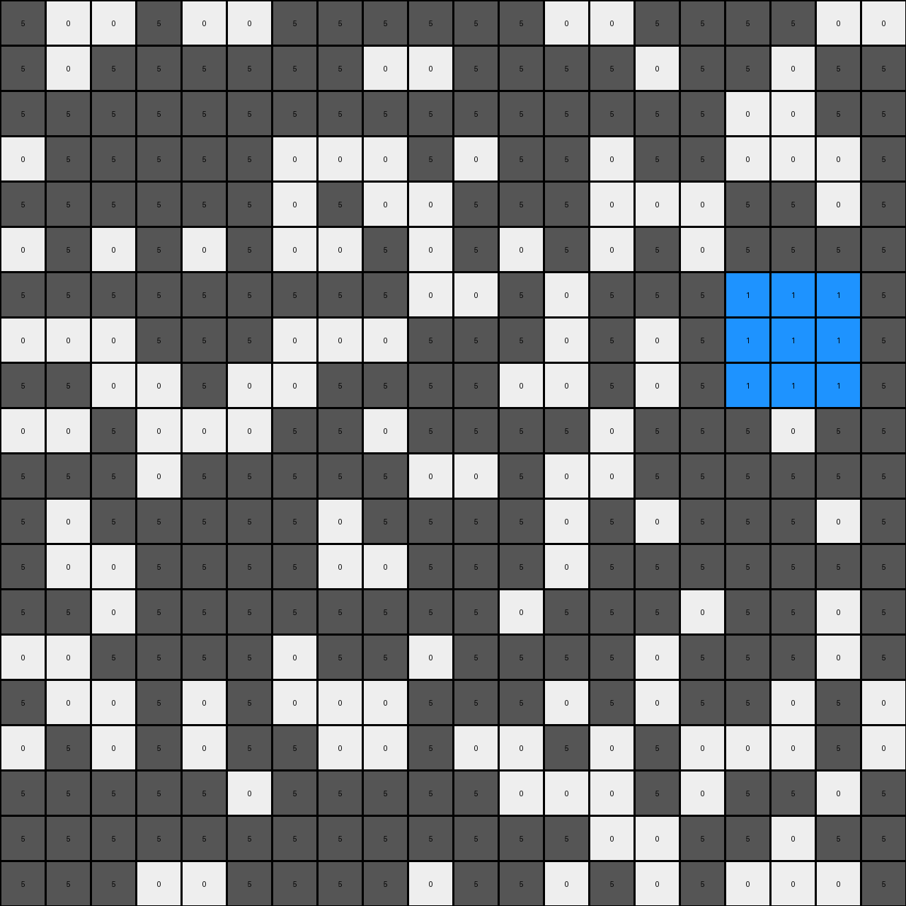
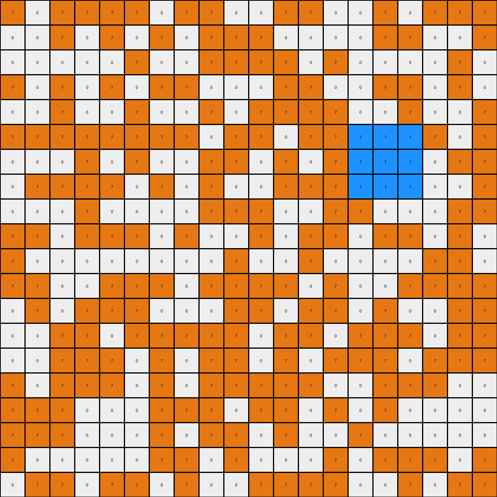

# 6cf79266 • 010 • refine_coder

---

Previous Code:
```python
"""
1.  **Identify the Target Region:** Locate a region on the grid where the original color is white. It seems to be a 3x3 shaped region on the left, vertically centered.
2.  **Change Color:** Change the color of the internal 3x3 pixels of that region to blue (1).
3. **Preserve other pixels**: All other pixels keep the colors from the input to the output.
"""

import numpy as np

def find_white_region(grid):
    # Find contiguous white regions
    rows, cols = grid.shape
    for r in range(rows - 2):
        for c in range(cols -2):
            if grid[r, c] == 0 and grid[r+1,c] == 0 and grid[r+2, c] == 0:
                if  grid[r, c+1] == 0 and grid[r+1,c+1] == 0 and grid[r+2, c+1] == 0:
                    if  grid[r, c+2] == 0 and grid[r+1,c+2] == 0 and grid[r+2, c+2] == 0:

                        return (r,c)
    return None

def transform(input_grid):
    # initialize output_grid
    output_grid = np.copy(input_grid)
    rows, cols = input_grid.shape

    # Find the target region
    region_start = find_white_region(input_grid)

    if region_start:
      # Change color of the 3x3 region to blue
      for r in range(region_start[0], region_start[0] + 3):
          for c in range(region_start[1], region_start[1] + 3):
              if output_grid[r,c] == 0:
                output_grid[r, c] = 1

    return output_grid
```

Train Set Results:

## Example 1:

Input:
```
5 0 0 5 0 0 5 5 5 5 5 5 0 0 5 5 5 5 0 0
5 0 5 5 5 5 5 5 0 0 5 5 5 5 0 5 5 0 5 5
5 5 5 5 5 5 5 5 5 5 5 5 5 5 5 5 0 0 5 5
0 5 5 5 5 5 0 0 0 5 0 5 5 0 5 5 0 0 0 5
5 5 5 5 5 5 0 5 0 0 5 5 5 0 0 0 5 5 0 5
0 5 0 5 0 5 0 0 5 0 5 0 5 0 5 0 5 5 5 5
5 5 5 5 5 5 5 5 5 0 0 5 0 5 5 5 0 0 0 5
0 0 0 5 5 5 0 0 0 5 5 5 0 5 0 5 0 0 0 5
5 5 0 0 5 0 0 5 5 5 5 0 0 5 0 5 0 0 0 5
0 0 5 0 0 0 5 5 0 5 5 5 5 0 5 5 5 0 5 5
5 5 5 0 5 5 5 5 5 0 0 5 0 0 5 5 5 5 5 5
5 0 5 5 5 5 5 0 5 5 5 5 0 5 0 5 5 5 0 5
5 0 0 5 5 5 5 0 0 5 5 5 0 5 5 5 5 5 5 5
5 5 0 5 5 5 5 5 5 5 5 0 5 5 5 0 5 5 0 5
0 0 5 5 5 5 0 5 5 0 5 5 5 5 0 5 5 5 0 5
5 0 0 5 0 5 0 0 0 5 5 5 0 5 0 5 5 0 5 0
0 5 0 5 0 5 5 0 0 5 0 0 5 0 5 0 0 0 5 0
5 5 5 5 5 0 5 5 5 5 5 0 0 0 5 0 5 5 0 5
5 5 5 5 5 5 5 5 5 5 5 5 5 0 0 5 5 0 5 5
5 5 5 0 0 5 5 5 5 0 5 5 0 5 0 5 0 0 0 5
```
Expected Output:
```
5 0 0 5 0 0 5 5 5 5 5 5 0 0 5 5 5 5 0 0
5 0 5 5 5 5 5 5 0 0 5 5 5 5 0 5 5 0 5 5
5 5 5 5 5 5 5 5 5 5 5 5 5 5 5 5 0 0 5 5
0 5 5 5 5 5 0 0 0 5 0 5 5 0 5 5 0 0 0 5
5 5 5 5 5 5 0 5 0 0 5 5 5 0 0 0 5 5 0 5
0 5 0 5 0 5 0 0 5 0 5 0 5 0 5 0 5 5 5 5
5 5 5 5 5 5 5 5 5 0 0 5 0 5 5 5 1 1 1 5
0 0 0 5 5 5 0 0 0 5 5 5 0 5 0 5 1 1 1 5
5 5 0 0 5 0 0 5 5 5 5 0 0 5 0 5 1 1 1 5
0 0 5 0 0 0 5 5 0 5 5 5 5 0 5 5 5 0 5 5
5 5 5 0 5 5 5 5 5 0 0 5 0 0 5 5 5 5 5 5
5 0 5 5 5 5 5 0 5 5 5 5 0 5 0 5 5 5 0 5
5 0 0 5 5 5 5 0 0 5 5 5 0 5 5 5 5 5 5 5
5 5 0 5 5 5 5 5 5 5 5 0 5 5 5 0 5 5 0 5
0 0 5 5 5 5 0 5 5 0 5 5 5 5 0 5 5 5 0 5
5 0 0 5 0 5 0 0 0 5 5 5 0 5 0 5 5 0 5 0
0 5 0 5 0 5 5 0 0 5 0 0 5 0 5 0 0 0 5 0
5 5 5 5 5 0 5 5 5 5 5 0 0 0 5 0 5 5 0 5
5 5 5 5 5 5 5 5 5 5 5 5 5 0 0 5 5 0 5 5
5 5 5 0 0 5 5 5 5 0 5 5 0 5 0 5 0 0 0 5
```
Transformed Output:
```
5 0 0 5 0 0 5 5 5 5 5 5 0 0 5 5 5 5 0 0
5 0 5 5 5 5 5 5 0 0 5 5 5 5 0 5 5 0 5 5
5 5 5 5 5 5 5 5 5 5 5 5 5 5 5 5 0 0 5 5
0 5 5 5 5 5 0 0 0 5 0 5 5 0 5 5 0 0 0 5
5 5 5 5 5 5 0 5 0 0 5 5 5 0 0 0 5 5 0 5
0 5 0 5 0 5 0 0 5 0 5 0 5 0 5 0 5 5 5 5
5 5 5 5 5 5 5 5 5 0 0 5 0 5 5 5 1 1 1 5
0 0 0 5 5 5 0 0 0 5 5 5 0 5 0 5 1 1 1 5
5 5 0 0 5 0 0 5 5 5 5 0 0 5 0 5 1 1 1 5
0 0 5 0 0 0 5 5 0 5 5 5 5 0 5 5 5 0 5 5
5 5 5 0 5 5 5 5 5 0 0 5 0 0 5 5 5 5 5 5
5 0 5 5 5 5 5 0 5 5 5 5 0 5 0 5 5 5 0 5
5 0 0 5 5 5 5 0 0 5 5 5 0 5 5 5 5 5 5 5
5 5 0 5 5 5 5 5 5 5 5 0 5 5 5 0 5 5 0 5
0 0 5 5 5 5 0 5 5 0 5 5 5 5 0 5 5 5 0 5
5 0 0 5 0 5 0 0 0 5 5 5 0 5 0 5 5 0 5 0
0 5 0 5 0 5 5 0 0 5 0 0 5 0 5 0 0 0 5 0
5 5 5 5 5 0 5 5 5 5 5 0 0 0 5 0 5 5 0 5
5 5 5 5 5 5 5 5 5 5 5 5 5 0 0 5 5 0 5 5
5 5 5 0 0 5 5 5 5 0 5 5 0 5 0 5 0 0 0 5
```

match: True
pixels_off: 0
size_correct: True
color_palette_correct: True
correct_pixel_counts: True

## Example 2:

Input:
```
3 3 3 3 0 3 0 3 0 3 3 0 0 3 3 3 0 3 0 0
0 0 3 3 0 0 3 0 3 3 0 3 0 3 3 0 0 3 3 0
3 3 3 3 3 0 0 3 0 0 0 3 0 3 3 0 3 3 3 3
3 0 3 3 0 0 0 0 3 0 3 3 0 3 3 3 0 3 3 0
0 0 0 3 0 3 0 3 3 3 0 3 3 3 0 3 3 3 0 0
3 3 0 0 3 3 0 3 3 3 3 0 0 3 0 3 3 3 3 0
0 3 0 0 0 0 3 3 0 3 0 0 3 0 0 0 3 0 3 0
3 0 3 0 0 0 0 0 0 3 3 3 0 3 3 3 3 3 3 3
0 3 3 0 0 0 0 3 0 3 3 0 3 3 0 0 3 3 3 3
0 0 0 3 3 0 0 3 3 3 3 3 0 3 0 3 0 3 3 3
3 0 3 3 0 3 3 3 0 0 3 0 3 0 0 0 3 3 0 3
3 0 0 3 0 0 0 3 3 3 3 0 0 3 0 3 0 3 3 3
0 3 3 0 0 0 3 3 0 3 3 3 3 0 0 3 0 0 3 3
0 0 3 0 3 3 3 3 0 0 0 3 3 3 0 0 3 0 3 0
3 0 3 3 3 0 3 3 0 3 3 3 3 3 3 3 3 0 0 3
0 0 3 0 3 3 0 0 3 0 3 0 3 3 0 3 3 3 0 0
3 3 0 3 3 0 0 0 0 0 0 0 3 0 3 0 0 0 3 3
0 3 0 3 0 0 3 3 3 0 3 3 3 0 0 3 3 0 0 0
3 0 0 3 0 3 3 0 3 0 0 3 0 0 3 3 3 3 3 3
3 0 3 3 0 3 3 3 0 0 0 3 0 3 0 3 3 3 0 3
```
Expected Output:
```
3 3 3 3 0 3 0 3 0 3 3 0 0 3 3 3 0 3 0 0
0 0 3 3 0 0 3 0 3 3 0 3 0 3 3 0 0 3 3 0
3 3 3 3 3 0 0 3 0 0 0 3 0 3 3 0 3 3 3 3
3 0 3 3 0 0 0 0 3 0 3 3 0 3 3 3 0 3 3 0
0 0 0 3 0 3 0 3 3 3 0 3 3 3 0 3 3 3 0 0
3 3 0 0 3 3 0 3 3 3 3 0 0 3 0 3 3 3 3 0
0 3 0 1 1 1 3 3 0 3 0 0 3 0 0 0 3 0 3 0
3 0 3 1 1 1 0 0 0 3 3 3 0 3 3 3 3 3 3 3
0 3 3 1 1 1 0 3 0 3 3 0 3 3 0 0 3 3 3 3
0 0 0 3 3 0 0 3 3 3 3 3 0 3 0 3 0 3 3 3
3 0 3 3 0 3 3 3 0 0 3 0 3 0 0 0 3 3 0 3
3 0 0 3 0 0 0 3 3 3 3 0 0 3 0 3 0 3 3 3
0 3 3 0 0 0 3 3 0 3 3 3 3 0 0 3 0 0 3 3
0 0 3 0 3 3 3 3 0 0 0 3 3 3 0 0 3 0 3 0
3 0 3 3 3 0 3 3 0 3 3 3 3 3 3 3 3 0 0 3
0 0 3 0 3 3 0 0 3 0 3 0 3 3 0 3 3 3 0 0
3 3 0 3 3 0 0 0 0 0 0 0 3 0 3 0 0 0 3 3
0 3 0 3 0 0 3 3 3 0 3 3 3 0 0 3 3 0 0 0
3 0 0 3 0 3 3 0 3 0 0 3 0 0 3 3 3 3 3 3
3 0 3 3 0 3 3 3 0 0 0 3 0 3 0 3 3 3 0 3
```
Transformed Output:
```
3 3 3 3 0 3 0 3 0 3 3 0 0 3 3 3 0 3 0 0
0 0 3 3 0 0 3 0 3 3 0 3 0 3 3 0 0 3 3 0
3 3 3 3 3 0 0 3 0 0 0 3 0 3 3 0 3 3 3 3
3 0 3 3 0 0 0 0 3 0 3 3 0 3 3 3 0 3 3 0
0 0 0 3 0 3 0 3 3 3 0 3 3 3 0 3 3 3 0 0
3 3 0 0 3 3 0 3 3 3 3 0 0 3 0 3 3 3 3 0
0 3 0 1 1 1 3 3 0 3 0 0 3 0 0 0 3 0 3 0
3 0 3 1 1 1 0 0 0 3 3 3 0 3 3 3 3 3 3 3
0 3 3 1 1 1 0 3 0 3 3 0 3 3 0 0 3 3 3 3
0 0 0 3 3 0 0 3 3 3 3 3 0 3 0 3 0 3 3 3
3 0 3 3 0 3 3 3 0 0 3 0 3 0 0 0 3 3 0 3
3 0 0 3 0 0 0 3 3 3 3 0 0 3 0 3 0 3 3 3
0 3 3 0 0 0 3 3 0 3 3 3 3 0 0 3 0 0 3 3
0 0 3 0 3 3 3 3 0 0 0 3 3 3 0 0 3 0 3 0
3 0 3 3 3 0 3 3 0 3 3 3 3 3 3 3 3 0 0 3
0 0 3 0 3 3 0 0 3 0 3 0 3 3 0 3 3 3 0 0
3 3 0 3 3 0 0 0 0 0 0 0 3 0 3 0 0 0 3 3
0 3 0 3 0 0 3 3 3 0 3 3 3 0 0 3 3 0 0 0
3 0 0 3 0 3 3 0 3 0 0 3 0 0 3 3 3 3 3 3
3 0 3 3 0 3 3 3 0 0 0 3 0 3 0 3 3 3 0 3
```

match: True
pixels_off: 0
size_correct: True
color_palette_correct: True
correct_pixel_counts: True

## Example 3:

Input:
```
7 0 7 7 7 7 0 7 7 0 0 7 7 0 0 7 0 7 7 7
0 0 7 0 7 0 7 0 7 7 7 0 0 0 0 7 7 0 0 7
0 0 0 0 0 7 0 0 7 7 7 7 0 7 0 0 0 0 7 0
7 0 7 0 7 0 7 7 0 0 0 7 7 0 0 7 7 0 7 0
0 0 7 0 0 7 0 0 7 0 7 7 7 7 0 0 7 0 0 7
7 7 7 7 7 7 7 7 0 7 7 0 7 7 0 0 0 7 0 7
0 0 0 7 0 7 0 0 7 7 0 7 0 7 0 0 0 0 7 7
0 7 7 7 7 0 7 0 7 0 0 7 7 7 0 0 0 0 0 7
0 0 0 7 0 0 0 0 7 7 7 0 0 7 7 0 0 0 7 7
7 7 0 7 7 7 0 7 0 0 7 0 7 7 0 7 7 0 7 0
7 0 0 0 0 0 0 0 0 7 0 0 7 0 0 0 0 7 7 0
7 7 0 0 7 7 7 0 7 7 7 7 0 7 0 0 7 7 7 7
0 7 0 7 7 7 0 0 0 7 7 0 7 7 0 7 0 0 7 7
0 0 7 7 0 7 7 7 7 7 0 7 7 0 7 7 7 0 7 7
0 0 7 7 7 0 7 0 7 7 0 7 0 7 7 7 0 7 7 7
7 0 7 7 7 0 7 0 7 7 7 7 7 0 0 7 7 7 0 0
7 7 7 0 0 0 7 7 7 0 7 7 0 7 0 7 0 0 0 0
7 7 7 0 0 0 7 0 7 7 0 7 0 0 7 0 0 0 0 0
7 0 0 0 0 0 7 7 0 7 0 0 0 7 0 7 7 7 0 7
0 7 7 0 7 7 0 7 0 0 7 7 7 7 0 0 7 0 7 7
```
Expected Output:
```
7 0 7 7 7 7 0 7 7 0 0 7 7 0 0 7 0 7 7 7
0 0 7 0 7 0 7 0 7 7 7 0 0 0 0 7 7 0 0 7
0 0 0 0 0 7 0 0 7 7 7 7 0 7 0 0 0 0 7 0
7 0 7 0 7 0 7 7 0 0 0 7 7 0 0 7 7 0 7 0
0 0 7 0 0 7 0 0 7 0 7 7 7 7 0 0 7 0 0 7
7 7 7 7 7 7 7 7 0 7 7 0 7 7 1 1 1 7 0 7
0 0 0 7 0 7 0 0 7 7 0 7 0 7 1 1 1 0 7 7
0 7 7 7 7 0 7 0 7 0 0 7 7 7 1 1 1 0 0 7
0 0 0 7 0 0 0 0 7 7 7 0 0 7 7 0 0 0 7 7
7 7 0 7 7 7 0 7 0 0 7 0 7 7 0 7 7 0 7 0
7 0 0 0 0 0 0 0 0 7 0 0 7 0 0 0 0 7 7 0
7 7 0 0 7 7 7 0 7 7 7 7 0 7 0 0 7 7 7 7
0 7 0 7 7 7 0 0 0 7 7 0 7 7 0 7 0 0 7 7
0 0 7 7 0 7 7 7 7 7 0 7 7 0 7 7 7 0 7 7
0 0 7 7 7 0 7 0 7 7 0 7 0 7 7 7 0 7 7 7
7 0 7 7 7 0 7 0 7 7 7 7 7 0 0 7 7 7 0 0
7 7 7 1 1 1 7 7 7 0 7 7 0 7 0 7 0 0 0 0
7 7 7 1 1 1 7 0 7 7 0 7 0 0 7 0 0 0 0 0
7 0 0 1 1 1 7 7 0 7 0 0 0 7 0 7 7 7 0 7
0 7 7 0 7 7 0 7 0 0 7 7 7 7 0 0 7 0 7 7
```
Transformed Output:
```
7 0 7 7 7 7 0 7 7 0 0 7 7 0 0 7 0 7 7 7
0 0 7 0 7 0 7 0 7 7 7 0 0 0 0 7 7 0 0 7
0 0 0 0 0 7 0 0 7 7 7 7 0 7 0 0 0 0 7 0
7 0 7 0 7 0 7 7 0 0 0 7 7 0 0 7 7 0 7 0
0 0 7 0 0 7 0 0 7 0 7 7 7 7 0 0 7 0 0 7
7 7 7 7 7 7 7 7 0 7 7 0 7 7 1 1 1 7 0 7
0 0 0 7 0 7 0 0 7 7 0 7 0 7 1 1 1 0 7 7
0 7 7 7 7 0 7 0 7 0 0 7 7 7 1 1 1 0 0 7
0 0 0 7 0 0 0 0 7 7 7 0 0 7 7 0 0 0 7 7
7 7 0 7 7 7 0 7 0 0 7 0 7 7 0 7 7 0 7 0
7 0 0 0 0 0 0 0 0 7 0 0 7 0 0 0 0 7 7 0
7 7 0 0 7 7 7 0 7 7 7 7 0 7 0 0 7 7 7 7
0 7 0 7 7 7 0 0 0 7 7 0 7 7 0 7 0 0 7 7
0 0 7 7 0 7 7 7 7 7 0 7 7 0 7 7 7 0 7 7
0 0 7 7 7 0 7 0 7 7 0 7 0 7 7 7 0 7 7 7
7 0 7 7 7 0 7 0 7 7 7 7 7 0 0 7 7 7 0 0
7 7 7 0 0 0 7 7 7 0 7 7 0 7 0 7 0 0 0 0
7 7 7 0 0 0 7 0 7 7 0 7 0 0 7 0 0 0 0 0
7 0 0 0 0 0 7 7 0 7 0 0 0 7 0 7 7 7 0 7
0 7 7 0 7 7 0 7 0 0 7 7 7 7 0 0 7 0 7 7
```

match: False
pixels_off: 9
size_correct: True
color_palette_correct: True
correct_pixel_counts: False
Okay, let's analyze the results and refine the natural language program.

**General Assessment:**

The initial code correctly identified the core concept: finding a 3x3 white region and changing its color to blue. It also correctly preserved the other pixels. However, the initial assumption about the region being "vertically centered on the left" is too restrictive. Examples 2 and 3 show that the white region can be anywhere in the grid. The third example failed because of the white areas not getting filled on rows 17,18,19. The program does not fill *all* white 3x3 regions, it stops after filling the first one it finds.

**Strategy:**

1.  **Remove Location Bias:** The updated program should not assume the white region is on the left or vertically centered. It must search the entire grid.
2. **Fill all occurences**: find *all* regions that match, not just the first
3.  **Iterate and Validate:** We'll test the refined code against all examples again.

**Metrics and Observations:**

*   **Example 1:** The code worked perfectly.
*   **Example 2:** The code worked perfectly.
*   **Example 3:** The code failed. It only colored the first 3x3 white region it found.

**YAML Block (Facts):**

```yaml
observations:
  - object: 3x3_white_region
    properties:
      color: white (0)
      shape: 3x3 square
    actions:
      - change_color:
          new_color: blue (1)
  - object: other_pixels
    properties:
        color: any
    actions:
        - preserve_color: {}

```

**Natural Language Program:**

1.  **Iterate through the grid:** Examine every possible 3x3 sub-grid within the input grid.
2.  **Identify White Regions:** For each 3x3 sub-grid, check if all nine pixels are white (0).
3.  **Change Color:** If a 3x3 sub-grid is entirely white, change all of its pixels to blue (1).
4. **Preserve Other Pixels** All pixels not part of any all-white 3x3 regions retain their original colors.

**INSTRUCTIONS**

- generate a Python module to represent the natural language program 
- follow the template below
- all common math and science libraries are available
- create docstring only at top - but comment the workflow in the function
- use helper functions for common operations like finding objects, counting,
  measuring, moving, etc. 

remember - we are working iteratively - so this code will inform your future
self as we converge on the solution

*template:*

```python
"""
{{ natural language description of the transformation rule }}
"""

{{ imports }}

def transform(input_grid):
    # initialize output_grid

    # change output pixels 

    return output_grid

```
