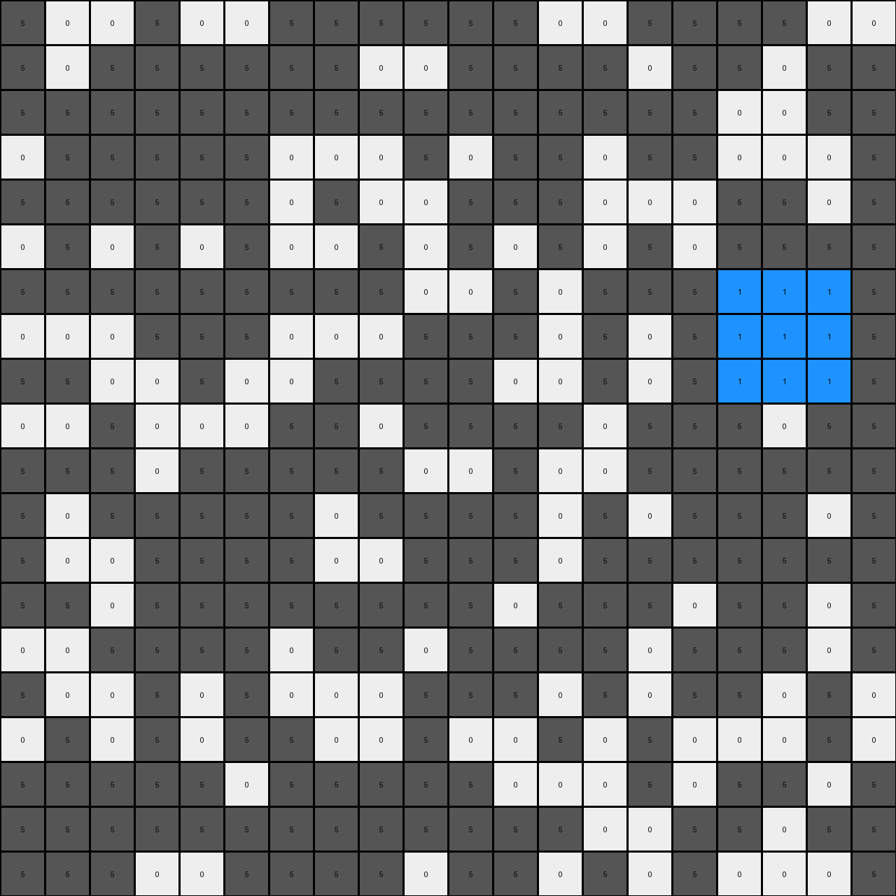

# 6cf79266 • 011 • refine_dreamer

---

Previous Code:
```python
"""
1.  **Iterate through the grid:** Examine every possible 3x3 sub-grid within the input grid.
2.  **Identify White Regions:** For each 3x3 sub-grid, check if all nine pixels are white (0).
3.  **Change Color:** If a 3x3 sub-grid is entirely white, change all of its pixels to blue (1).
4. **Preserve Other Pixels** All pixels not part of any all-white 3x3 regions retain their original colors.
"""

import numpy as np

def transform(input_grid):
    # initialize output_grid
    output_grid = np.copy(input_grid)
    rows, cols = input_grid.shape

    # Iterate through all possible 3x3 subgrids
    for r in range(rows - 2):
        for c in range(cols - 2):
            # Check if the current 3x3 subgrid is all white
            is_white = True
            for i in range(3):
                for j in range(3):
                    if input_grid[r + i, c + j] != 0:
                        is_white = False
                        break  # Exit inner loops if a non-white pixel is found
                if not is_white:
                    break  # Exit outer loop if a non-white pixel is found

            # Change color to blue if it's an all-white 3x3 subgrid
            if is_white:
                for i in range(3):
                    for j in range(3):
                        output_grid[r + i, c + j] = 1

    return output_grid
```

Train Set Results:

## Example 1:

Input:
```
5 0 0 5 0 0 5 5 5 5 5 5 0 0 5 5 5 5 0 0
5 0 5 5 5 5 5 5 0 0 5 5 5 5 0 5 5 0 5 5
5 5 5 5 5 5 5 5 5 5 5 5 5 5 5 5 0 0 5 5
0 5 5 5 5 5 0 0 0 5 0 5 5 0 5 5 0 0 0 5
5 5 5 5 5 5 0 5 0 0 5 5 5 0 0 0 5 5 0 5
0 5 0 5 0 5 0 0 5 0 5 0 5 0 5 0 5 5 5 5
5 5 5 5 5 5 5 5 5 0 0 5 0 5 5 5 0 0 0 5
0 0 0 5 5 5 0 0 0 5 5 5 0 5 0 5 0 0 0 5
5 5 0 0 5 0 0 5 5 5 5 0 0 5 0 5 0 0 0 5
0 0 5 0 0 0 5 5 0 5 5 5 5 0 5 5 5 0 5 5
5 5 5 0 5 5 5 5 5 0 0 5 0 0 5 5 5 5 5 5
5 0 5 5 5 5 5 0 5 5 5 5 0 5 0 5 5 5 0 5
5 0 0 5 5 5 5 0 0 5 5 5 0 5 5 5 5 5 5 5
5 5 0 5 5 5 5 5 5 5 5 0 5 5 5 0 5 5 0 5
0 0 5 5 5 5 0 5 5 0 5 5 5 5 0 5 5 5 0 5
5 0 0 5 0 5 0 0 0 5 5 5 0 5 0 5 5 0 5 0
0 5 0 5 0 5 5 0 0 5 0 0 5 0 5 0 0 0 5 0
5 5 5 5 5 0 5 5 5 5 5 0 0 0 5 0 5 5 0 5
5 5 5 5 5 5 5 5 5 5 5 5 5 0 0 5 5 0 5 5
5 5 5 0 0 5 5 5 5 0 5 5 0 5 0 5 0 0 0 5
```
Expected Output:
```
5 0 0 5 0 0 5 5 5 5 5 5 0 0 5 5 5 5 0 0
5 0 5 5 5 5 5 5 0 0 5 5 5 5 0 5 5 0 5 5
5 5 5 5 5 5 5 5 5 5 5 5 5 5 5 5 0 0 5 5
0 5 5 5 5 5 0 0 0 5 0 5 5 0 5 5 0 0 0 5
5 5 5 5 5 5 0 5 0 0 5 5 5 0 0 0 5 5 0 5
0 5 0 5 0 5 0 0 5 0 5 0 5 0 5 0 5 5 5 5
5 5 5 5 5 5 5 5 5 0 0 5 0 5 5 5 1 1 1 5
0 0 0 5 5 5 0 0 0 5 5 5 0 5 0 5 1 1 1 5
5 5 0 0 5 0 0 5 5 5 5 0 0 5 0 5 1 1 1 5
0 0 5 0 0 0 5 5 0 5 5 5 5 0 5 5 5 0 5 5
5 5 5 0 5 5 5 5 5 0 0 5 0 0 5 5 5 5 5 5
5 0 5 5 5 5 5 0 5 5 5 5 0 5 0 5 5 5 0 5
5 0 0 5 5 5 5 0 0 5 5 5 0 5 5 5 5 5 5 5
5 5 0 5 5 5 5 5 5 5 5 0 5 5 5 0 5 5 0 5
0 0 5 5 5 5 0 5 5 0 5 5 5 5 0 5 5 5 0 5
5 0 0 5 0 5 0 0 0 5 5 5 0 5 0 5 5 0 5 0
0 5 0 5 0 5 5 0 0 5 0 0 5 0 5 0 0 0 5 0
5 5 5 5 5 0 5 5 5 5 5 0 0 0 5 0 5 5 0 5
5 5 5 5 5 5 5 5 5 5 5 5 5 0 0 5 5 0 5 5
5 5 5 0 0 5 5 5 5 0 5 5 0 5 0 5 0 0 0 5
```
Transformed Output:
```
5 0 0 5 0 0 5 5 5 5 5 5 0 0 5 5 5 5 0 0
5 0 5 5 5 5 5 5 0 0 5 5 5 5 0 5 5 0 5 5
5 5 5 5 5 5 5 5 5 5 5 5 5 5 5 5 0 0 5 5
0 5 5 5 5 5 0 0 0 5 0 5 5 0 5 5 0 0 0 5
5 5 5 5 5 5 0 5 0 0 5 5 5 0 0 0 5 5 0 5
0 5 0 5 0 5 0 0 5 0 5 0 5 0 5 0 5 5 5 5
5 5 5 5 5 5 5 5 5 0 0 5 0 5 5 5 1 1 1 5
0 0 0 5 5 5 0 0 0 5 5 5 0 5 0 5 1 1 1 5
5 5 0 0 5 0 0 5 5 5 5 0 0 5 0 5 1 1 1 5
0 0 5 0 0 0 5 5 0 5 5 5 5 0 5 5 5 0 5 5
5 5 5 0 5 5 5 5 5 0 0 5 0 0 5 5 5 5 5 5
5 0 5 5 5 5 5 0 5 5 5 5 0 5 0 5 5 5 0 5
5 0 0 5 5 5 5 0 0 5 5 5 0 5 5 5 5 5 5 5
5 5 0 5 5 5 5 5 5 5 5 0 5 5 5 0 5 5 0 5
0 0 5 5 5 5 0 5 5 0 5 5 5 5 0 5 5 5 0 5
5 0 0 5 0 5 0 0 0 5 5 5 0 5 0 5 5 0 5 0
0 5 0 5 0 5 5 0 0 5 0 0 5 0 5 0 0 0 5 0
5 5 5 5 5 0 5 5 5 5 5 0 0 0 5 0 5 5 0 5
5 5 5 5 5 5 5 5 5 5 5 5 5 0 0 5 5 0 5 5
5 5 5 0 0 5 5 5 5 0 5 5 0 5 0 5 0 0 0 5
```

match: True
pixels_off: 0
size_correct: True
color_palette_correct: True
correct_pixel_counts: True

## Example 2:

Input:
```
3 3 3 3 0 3 0 3 0 3 3 0 0 3 3 3 0 3 0 0
0 0 3 3 0 0 3 0 3 3 0 3 0 3 3 0 0 3 3 0
3 3 3 3 3 0 0 3 0 0 0 3 0 3 3 0 3 3 3 3
3 0 3 3 0 0 0 0 3 0 3 3 0 3 3 3 0 3 3 0
0 0 0 3 0 3 0 3 3 3 0 3 3 3 0 3 3 3 0 0
3 3 0 0 3 3 0 3 3 3 3 0 0 3 0 3 3 3 3 0
0 3 0 0 0 0 3 3 0 3 0 0 3 0 0 0 3 0 3 0
3 0 3 0 0 0 0 0 0 3 3 3 0 3 3 3 3 3 3 3
0 3 3 0 0 0 0 3 0 3 3 0 3 3 0 0 3 3 3 3
0 0 0 3 3 0 0 3 3 3 3 3 0 3 0 3 0 3 3 3
3 0 3 3 0 3 3 3 0 0 3 0 3 0 0 0 3 3 0 3
3 0 0 3 0 0 0 3 3 3 3 0 0 3 0 3 0 3 3 3
0 3 3 0 0 0 3 3 0 3 3 3 3 0 0 3 0 0 3 3
0 0 3 0 3 3 3 3 0 0 0 3 3 3 0 0 3 0 3 0
3 0 3 3 3 0 3 3 0 3 3 3 3 3 3 3 3 0 0 3
0 0 3 0 3 3 0 0 3 0 3 0 3 3 0 3 3 3 0 0
3 3 0 3 3 0 0 0 0 0 0 0 3 0 3 0 0 0 3 3
0 3 0 3 0 0 3 3 3 0 3 3 3 0 0 3 3 0 0 0
3 0 0 3 0 3 3 0 3 0 0 3 0 0 3 3 3 3 3 3
3 0 3 3 0 3 3 3 0 0 0 3 0 3 0 3 3 3 0 3
```
Expected Output:
```
3 3 3 3 0 3 0 3 0 3 3 0 0 3 3 3 0 3 0 0
0 0 3 3 0 0 3 0 3 3 0 3 0 3 3 0 0 3 3 0
3 3 3 3 3 0 0 3 0 0 0 3 0 3 3 0 3 3 3 3
3 0 3 3 0 0 0 0 3 0 3 3 0 3 3 3 0 3 3 0
0 0 0 3 0 3 0 3 3 3 0 3 3 3 0 3 3 3 0 0
3 3 0 0 3 3 0 3 3 3 3 0 0 3 0 3 3 3 3 0
0 3 0 1 1 1 3 3 0 3 0 0 3 0 0 0 3 0 3 0
3 0 3 1 1 1 0 0 0 3 3 3 0 3 3 3 3 3 3 3
0 3 3 1 1 1 0 3 0 3 3 0 3 3 0 0 3 3 3 3
0 0 0 3 3 0 0 3 3 3 3 3 0 3 0 3 0 3 3 3
3 0 3 3 0 3 3 3 0 0 3 0 3 0 0 0 3 3 0 3
3 0 0 3 0 0 0 3 3 3 3 0 0 3 0 3 0 3 3 3
0 3 3 0 0 0 3 3 0 3 3 3 3 0 0 3 0 0 3 3
0 0 3 0 3 3 3 3 0 0 0 3 3 3 0 0 3 0 3 0
3 0 3 3 3 0 3 3 0 3 3 3 3 3 3 3 3 0 0 3
0 0 3 0 3 3 0 0 3 0 3 0 3 3 0 3 3 3 0 0
3 3 0 3 3 0 0 0 0 0 0 0 3 0 3 0 0 0 3 3
0 3 0 3 0 0 3 3 3 0 3 3 3 0 0 3 3 0 0 0
3 0 0 3 0 3 3 0 3 0 0 3 0 0 3 3 3 3 3 3
3 0 3 3 0 3 3 3 0 0 0 3 0 3 0 3 3 3 0 3
```
Transformed Output:
```
3 3 3 3 0 3 0 3 0 3 3 0 0 3 3 3 0 3 0 0
0 0 3 3 0 0 3 0 3 3 0 3 0 3 3 0 0 3 3 0
3 3 3 3 3 0 0 3 0 0 0 3 0 3 3 0 3 3 3 3
3 0 3 3 0 0 0 0 3 0 3 3 0 3 3 3 0 3 3 0
0 0 0 3 0 3 0 3 3 3 0 3 3 3 0 3 3 3 0 0
3 3 0 0 3 3 0 3 3 3 3 0 0 3 0 3 3 3 3 0
0 3 0 1 1 1 3 3 0 3 0 0 3 0 0 0 3 0 3 0
3 0 3 1 1 1 0 0 0 3 3 3 0 3 3 3 3 3 3 3
0 3 3 1 1 1 0 3 0 3 3 0 3 3 0 0 3 3 3 3
0 0 0 3 3 0 0 3 3 3 3 3 0 3 0 3 0 3 3 3
3 0 3 3 0 3 3 3 0 0 3 0 3 0 0 0 3 3 0 3
3 0 0 3 0 0 0 3 3 3 3 0 0 3 0 3 0 3 3 3
0 3 3 0 0 0 3 3 0 3 3 3 3 0 0 3 0 0 3 3
0 0 3 0 3 3 3 3 0 0 0 3 3 3 0 0 3 0 3 0
3 0 3 3 3 0 3 3 0 3 3 3 3 3 3 3 3 0 0 3
0 0 3 0 3 3 0 0 3 0 3 0 3 3 0 3 3 3 0 0
3 3 0 3 3 0 0 0 0 0 0 0 3 0 3 0 0 0 3 3
0 3 0 3 0 0 3 3 3 0 3 3 3 0 0 3 3 0 0 0
3 0 0 3 0 3 3 0 3 0 0 3 0 0 3 3 3 3 3 3
3 0 3 3 0 3 3 3 0 0 0 3 0 3 0 3 3 3 0 3
```

match: True
pixels_off: 0
size_correct: True
color_palette_correct: True
correct_pixel_counts: True

## Example 3:

Input:
```
7 0 7 7 7 7 0 7 7 0 0 7 7 0 0 7 0 7 7 7
0 0 7 0 7 0 7 0 7 7 7 0 0 0 0 7 7 0 0 7
0 0 0 0 0 7 0 0 7 7 7 7 0 7 0 0 0 0 7 0
7 0 7 0 7 0 7 7 0 0 0 7 7 0 0 7 7 0 7 0
0 0 7 0 0 7 0 0 7 0 7 7 7 7 0 0 7 0 0 7
7 7 7 7 7 7 7 7 0 7 7 0 7 7 0 0 0 7 0 7
0 0 0 7 0 7 0 0 7 7 0 7 0 7 0 0 0 0 7 7
0 7 7 7 7 0 7 0 7 0 0 7 7 7 0 0 0 0 0 7
0 0 0 7 0 0 0 0 7 7 7 0 0 7 7 0 0 0 7 7
7 7 0 7 7 7 0 7 0 0 7 0 7 7 0 7 7 0 7 0
7 0 0 0 0 0 0 0 0 7 0 0 7 0 0 0 0 7 7 0
7 7 0 0 7 7 7 0 7 7 7 7 0 7 0 0 7 7 7 7
0 7 0 7 7 7 0 0 0 7 7 0 7 7 0 7 0 0 7 7
0 0 7 7 0 7 7 7 7 7 0 7 7 0 7 7 7 0 7 7
0 0 7 7 7 0 7 0 7 7 0 7 0 7 7 7 0 7 7 7
7 0 7 7 7 0 7 0 7 7 7 7 7 0 0 7 7 7 0 0
7 7 7 0 0 0 7 7 7 0 7 7 0 7 0 7 0 0 0 0
7 7 7 0 0 0 7 0 7 7 0 7 0 0 7 0 0 0 0 0
7 0 0 0 0 0 7 7 0 7 0 0 0 7 0 7 7 7 0 7
0 7 7 0 7 7 0 7 0 0 7 7 7 7 0 0 7 0 7 7
```
Expected Output:
```
7 0 7 7 7 7 0 7 7 0 0 7 7 0 0 7 0 7 7 7
0 0 7 0 7 0 7 0 7 7 7 0 0 0 0 7 7 0 0 7
0 0 0 0 0 7 0 0 7 7 7 7 0 7 0 0 0 0 7 0
7 0 7 0 7 0 7 7 0 0 0 7 7 0 0 7 7 0 7 0
0 0 7 0 0 7 0 0 7 0 7 7 7 7 0 0 7 0 0 7
7 7 7 7 7 7 7 7 0 7 7 0 7 7 1 1 1 7 0 7
0 0 0 7 0 7 0 0 7 7 0 7 0 7 1 1 1 0 7 7
0 7 7 7 7 0 7 0 7 0 0 7 7 7 1 1 1 0 0 7
0 0 0 7 0 0 0 0 7 7 7 0 0 7 7 0 0 0 7 7
7 7 0 7 7 7 0 7 0 0 7 0 7 7 0 7 7 0 7 0
7 0 0 0 0 0 0 0 0 7 0 0 7 0 0 0 0 7 7 0
7 7 0 0 7 7 7 0 7 7 7 7 0 7 0 0 7 7 7 7
0 7 0 7 7 7 0 0 0 7 7 0 7 7 0 7 0 0 7 7
0 0 7 7 0 7 7 7 7 7 0 7 7 0 7 7 7 0 7 7
0 0 7 7 7 0 7 0 7 7 0 7 0 7 7 7 0 7 7 7
7 0 7 7 7 0 7 0 7 7 7 7 7 0 0 7 7 7 0 0
7 7 7 1 1 1 7 7 7 0 7 7 0 7 0 7 0 0 0 0
7 7 7 1 1 1 7 0 7 7 0 7 0 0 7 0 0 0 0 0
7 0 0 1 1 1 7 7 0 7 0 0 0 7 0 7 7 7 0 7
0 7 7 0 7 7 0 7 0 0 7 7 7 7 0 0 7 0 7 7
```
Transformed Output:
```
7 0 7 7 7 7 0 7 7 0 0 7 7 0 0 7 0 7 7 7
0 0 7 0 7 0 7 0 7 7 7 0 0 0 0 7 7 0 0 7
0 0 0 0 0 7 0 0 7 7 7 7 0 7 0 0 0 0 7 0
7 0 7 0 7 0 7 7 0 0 0 7 7 0 0 7 7 0 7 0
0 0 7 0 0 7 0 0 7 0 7 7 7 7 0 0 7 0 0 7
7 7 7 7 7 7 7 7 0 7 7 0 7 7 1 1 1 7 0 7
0 0 0 7 0 7 0 0 7 7 0 7 0 7 1 1 1 1 7 7
0 7 7 7 7 0 7 0 7 0 0 7 7 7 1 1 1 1 0 7
0 0 0 7 0 0 0 0 7 7 7 0 0 7 7 1 1 1 7 7
7 7 0 7 7 7 0 7 0 0 7 0 7 7 0 7 7 0 7 0
7 0 0 0 0 0 0 0 0 7 0 0 7 0 0 0 0 7 7 0
7 7 0 0 7 7 7 0 7 7 7 7 0 7 0 0 7 7 7 7
0 7 0 7 7 7 0 0 0 7 7 0 7 7 0 7 0 0 7 7
0 0 7 7 0 7 7 7 7 7 0 7 7 0 7 7 7 0 7 7
0 0 7 7 7 0 7 0 7 7 0 7 0 7 7 7 0 7 7 7
7 0 7 7 7 0 7 0 7 7 7 7 7 0 0 7 7 7 0 0
7 7 7 1 1 1 7 7 7 0 7 7 0 7 0 7 0 0 0 0
7 7 7 1 1 1 7 0 7 7 0 7 0 0 7 0 0 0 0 0
7 0 0 1 1 1 7 7 0 7 0 0 0 7 0 7 7 7 0 7
0 7 7 0 7 7 0 7 0 0 7 7 7 7 0 0 7 0 7 7
```

match: False
pixels_off: 5
size_correct: True
color_palette_correct: True
correct_pixel_counts: False
**INSTRUCTIONS**

The code above was generated based on observations from the first training
example

we have tested the transform function on each of the task example inputs and
compared with the expected output

review each of the examples provided and the results and consider how the
natural language program should be updated to accommodate this new knowledge

respond with the following deliverables:

- general assessment of the information provided and strategy for resolving the
  errors
- gather metrics about each of the examples and results - use code_execution to
  develop accurate reports on your assumptions
- a YAML block documenting facts - Focus on identifying objects, their properties, and the actions performed on them.
- a natural language program - Be as clear and concise as possible, providing a complete description of the transformation rule.


your responses should be considered as information in a report - not a
conversation
