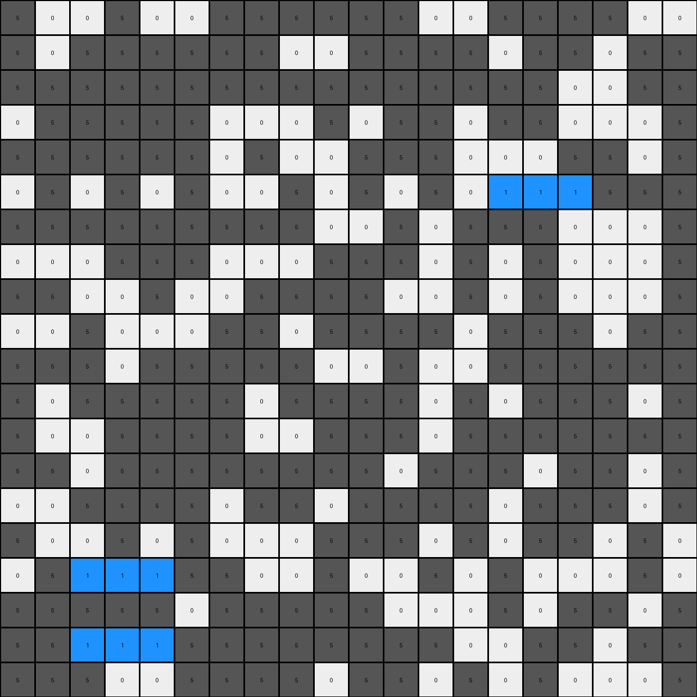

# 6cf79266 • 016 • refine_coder

---

Previous Code:
```python
"""
The transformation identifies three 3x1 or 1x3 rectangular regions of orange (7) pixels within the grid and changes them to blue (1).
All other pixels remain unchanged.
"""

import numpy as np

def transform(input_grid):
    """
    Transforms the input grid by changing three specific 3x1 or 1x3 orange regions to blue.
    """
    output_grid = np.copy(input_grid)
    height = output_grid.shape[0]
    width = output_grid.shape[1]

    # change pixels in the identified regions:
    # Region 1: row 6, columns 15, 16, 17
    output_grid[5, 14:17] = 1
    # Region 2: row 17, columns 3, 4, 5
    output_grid[16, 2:5] = 1      
    # Region 3: row 19, columns 3, 4, 5
    output_grid[18, 2:5] = 1    

    return output_grid
```

Train Set Results:

## Example 1:

Input:
```
5 0 0 5 0 0 5 5 5 5 5 5 0 0 5 5 5 5 0 0
5 0 5 5 5 5 5 5 0 0 5 5 5 5 0 5 5 0 5 5
5 5 5 5 5 5 5 5 5 5 5 5 5 5 5 5 0 0 5 5
0 5 5 5 5 5 0 0 0 5 0 5 5 0 5 5 0 0 0 5
5 5 5 5 5 5 0 5 0 0 5 5 5 0 0 0 5 5 0 5
0 5 0 5 0 5 0 0 5 0 5 0 5 0 5 0 5 5 5 5
5 5 5 5 5 5 5 5 5 0 0 5 0 5 5 5 0 0 0 5
0 0 0 5 5 5 0 0 0 5 5 5 0 5 0 5 0 0 0 5
5 5 0 0 5 0 0 5 5 5 5 0 0 5 0 5 0 0 0 5
0 0 5 0 0 0 5 5 0 5 5 5 5 0 5 5 5 0 5 5
5 5 5 0 5 5 5 5 5 0 0 5 0 0 5 5 5 5 5 5
5 0 5 5 5 5 5 0 5 5 5 5 0 5 0 5 5 5 0 5
5 0 0 5 5 5 5 0 0 5 5 5 0 5 5 5 5 5 5 5
5 5 0 5 5 5 5 5 5 5 5 0 5 5 5 0 5 5 0 5
0 0 5 5 5 5 0 5 5 0 5 5 5 5 0 5 5 5 0 5
5 0 0 5 0 5 0 0 0 5 5 5 0 5 0 5 5 0 5 0
0 5 0 5 0 5 5 0 0 5 0 0 5 0 5 0 0 0 5 0
5 5 5 5 5 0 5 5 5 5 5 0 0 0 5 0 5 5 0 5
5 5 5 5 5 5 5 5 5 5 5 5 5 0 0 5 5 0 5 5
5 5 5 0 0 5 5 5 5 0 5 5 0 5 0 5 0 0 0 5
```
Expected Output:
```
5 0 0 5 0 0 5 5 5 5 5 5 0 0 5 5 5 5 0 0
5 0 5 5 5 5 5 5 0 0 5 5 5 5 0 5 5 0 5 5
5 5 5 5 5 5 5 5 5 5 5 5 5 5 5 5 0 0 5 5
0 5 5 5 5 5 0 0 0 5 0 5 5 0 5 5 0 0 0 5
5 5 5 5 5 5 0 5 0 0 5 5 5 0 0 0 5 5 0 5
0 5 0 5 0 5 0 0 5 0 5 0 5 0 5 0 5 5 5 5
5 5 5 5 5 5 5 5 5 0 0 5 0 5 5 5 1 1 1 5
0 0 0 5 5 5 0 0 0 5 5 5 0 5 0 5 1 1 1 5
5 5 0 0 5 0 0 5 5 5 5 0 0 5 0 5 1 1 1 5
0 0 5 0 0 0 5 5 0 5 5 5 5 0 5 5 5 0 5 5
5 5 5 0 5 5 5 5 5 0 0 5 0 0 5 5 5 5 5 5
5 0 5 5 5 5 5 0 5 5 5 5 0 5 0 5 5 5 0 5
5 0 0 5 5 5 5 0 0 5 5 5 0 5 5 5 5 5 5 5
5 5 0 5 5 5 5 5 5 5 5 0 5 5 5 0 5 5 0 5
0 0 5 5 5 5 0 5 5 0 5 5 5 5 0 5 5 5 0 5
5 0 0 5 0 5 0 0 0 5 5 5 0 5 0 5 5 0 5 0
0 5 0 5 0 5 5 0 0 5 0 0 5 0 5 0 0 0 5 0
5 5 5 5 5 0 5 5 5 5 5 0 0 0 5 0 5 5 0 5
5 5 5 5 5 5 5 5 5 5 5 5 5 0 0 5 5 0 5 5
5 5 5 0 0 5 5 5 5 0 5 5 0 5 0 5 0 0 0 5
```
Transformed Output:
```
5 0 0 5 0 0 5 5 5 5 5 5 0 0 5 5 5 5 0 0
5 0 5 5 5 5 5 5 0 0 5 5 5 5 0 5 5 0 5 5
5 5 5 5 5 5 5 5 5 5 5 5 5 5 5 5 0 0 5 5
0 5 5 5 5 5 0 0 0 5 0 5 5 0 5 5 0 0 0 5
5 5 5 5 5 5 0 5 0 0 5 5 5 0 0 0 5 5 0 5
0 5 0 5 0 5 0 0 5 0 5 0 5 0 1 1 1 5 5 5
5 5 5 5 5 5 5 5 5 0 0 5 0 5 5 5 0 0 0 5
0 0 0 5 5 5 0 0 0 5 5 5 0 5 0 5 0 0 0 5
5 5 0 0 5 0 0 5 5 5 5 0 0 5 0 5 0 0 0 5
0 0 5 0 0 0 5 5 0 5 5 5 5 0 5 5 5 0 5 5
5 5 5 0 5 5 5 5 5 0 0 5 0 0 5 5 5 5 5 5
5 0 5 5 5 5 5 0 5 5 5 5 0 5 0 5 5 5 0 5
5 0 0 5 5 5 5 0 0 5 5 5 0 5 5 5 5 5 5 5
5 5 0 5 5 5 5 5 5 5 5 0 5 5 5 0 5 5 0 5
0 0 5 5 5 5 0 5 5 0 5 5 5 5 0 5 5 5 0 5
5 0 0 5 0 5 0 0 0 5 5 5 0 5 0 5 5 0 5 0
0 5 1 1 1 5 5 0 0 5 0 0 5 0 5 0 0 0 5 0
5 5 5 5 5 0 5 5 5 5 5 0 0 0 5 0 5 5 0 5
5 5 1 1 1 5 5 5 5 5 5 5 5 0 0 5 5 0 5 5
5 5 5 0 0 5 5 5 5 0 5 5 0 5 0 5 0 0 0 5
```

match: False
pixels_off: 18
size_correct: True
color_palette_correct: True
correct_pixel_counts: False

## Example 2:

Input:
```
3 3 3 3 0 3 0 3 0 3 3 0 0 3 3 3 0 3 0 0
0 0 3 3 0 0 3 0 3 3 0 3 0 3 3 0 0 3 3 0
3 3 3 3 3 0 0 3 0 0 0 3 0 3 3 0 3 3 3 3
3 0 3 3 0 0 0 0 3 0 3 3 0 3 3 3 0 3 3 0
0 0 0 3 0 3 0 3 3 3 0 3 3 3 0 3 3 3 0 0
3 3 0 0 3 3 0 3 3 3 3 0 0 3 0 3 3 3 3 0
0 3 0 0 0 0 3 3 0 3 0 0 3 0 0 0 3 0 3 0
3 0 3 0 0 0 0 0 0 3 3 3 0 3 3 3 3 3 3 3
0 3 3 0 0 0 0 3 0 3 3 0 3 3 0 0 3 3 3 3
0 0 0 3 3 0 0 3 3 3 3 3 0 3 0 3 0 3 3 3
3 0 3 3 0 3 3 3 0 0 3 0 3 0 0 0 3 3 0 3
3 0 0 3 0 0 0 3 3 3 3 0 0 3 0 3 0 3 3 3
0 3 3 0 0 0 3 3 0 3 3 3 3 0 0 3 0 0 3 3
0 0 3 0 3 3 3 3 0 0 0 3 3 3 0 0 3 0 3 0
3 0 3 3 3 0 3 3 0 3 3 3 3 3 3 3 3 0 0 3
0 0 3 0 3 3 0 0 3 0 3 0 3 3 0 3 3 3 0 0
3 3 0 3 3 0 0 0 0 0 0 0 3 0 3 0 0 0 3 3
0 3 0 3 0 0 3 3 3 0 3 3 3 0 0 3 3 0 0 0
3 0 0 3 0 3 3 0 3 0 0 3 0 0 3 3 3 3 3 3
3 0 3 3 0 3 3 3 0 0 0 3 0 3 0 3 3 3 0 3
```
Expected Output:
```
3 3 3 3 0 3 0 3 0 3 3 0 0 3 3 3 0 3 0 0
0 0 3 3 0 0 3 0 3 3 0 3 0 3 3 0 0 3 3 0
3 3 3 3 3 0 0 3 0 0 0 3 0 3 3 0 3 3 3 3
3 0 3 3 0 0 0 0 3 0 3 3 0 3 3 3 0 3 3 0
0 0 0 3 0 3 0 3 3 3 0 3 3 3 0 3 3 3 0 0
3 3 0 0 3 3 0 3 3 3 3 0 0 3 0 3 3 3 3 0
0 3 0 1 1 1 3 3 0 3 0 0 3 0 0 0 3 0 3 0
3 0 3 1 1 1 0 0 0 3 3 3 0 3 3 3 3 3 3 3
0 3 3 1 1 1 0 3 0 3 3 0 3 3 0 0 3 3 3 3
0 0 0 3 3 0 0 3 3 3 3 3 0 3 0 3 0 3 3 3
3 0 3 3 0 3 3 3 0 0 3 0 3 0 0 0 3 3 0 3
3 0 0 3 0 0 0 3 3 3 3 0 0 3 0 3 0 3 3 3
0 3 3 0 0 0 3 3 0 3 3 3 3 0 0 3 0 0 3 3
0 0 3 0 3 3 3 3 0 0 0 3 3 3 0 0 3 0 3 0
3 0 3 3 3 0 3 3 0 3 3 3 3 3 3 3 3 0 0 3
0 0 3 0 3 3 0 0 3 0 3 0 3 3 0 3 3 3 0 0
3 3 0 3 3 0 0 0 0 0 0 0 3 0 3 0 0 0 3 3
0 3 0 3 0 0 3 3 3 0 3 3 3 0 0 3 3 0 0 0
3 0 0 3 0 3 3 0 3 0 0 3 0 0 3 3 3 3 3 3
3 0 3 3 0 3 3 3 0 0 0 3 0 3 0 3 3 3 0 3
```
Transformed Output:
```
3 3 3 3 0 3 0 3 0 3 3 0 0 3 3 3 0 3 0 0
0 0 3 3 0 0 3 0 3 3 0 3 0 3 3 0 0 3 3 0
3 3 3 3 3 0 0 3 0 0 0 3 0 3 3 0 3 3 3 3
3 0 3 3 0 0 0 0 3 0 3 3 0 3 3 3 0 3 3 0
0 0 0 3 0 3 0 3 3 3 0 3 3 3 0 3 3 3 0 0
3 3 0 0 3 3 0 3 3 3 3 0 0 3 1 1 1 3 3 0
0 3 0 0 0 0 3 3 0 3 0 0 3 0 0 0 3 0 3 0
3 0 3 0 0 0 0 0 0 3 3 3 0 3 3 3 3 3 3 3
0 3 3 0 0 0 0 3 0 3 3 0 3 3 0 0 3 3 3 3
0 0 0 3 3 0 0 3 3 3 3 3 0 3 0 3 0 3 3 3
3 0 3 3 0 3 3 3 0 0 3 0 3 0 0 0 3 3 0 3
3 0 0 3 0 0 0 3 3 3 3 0 0 3 0 3 0 3 3 3
0 3 3 0 0 0 3 3 0 3 3 3 3 0 0 3 0 0 3 3
0 0 3 0 3 3 3 3 0 0 0 3 3 3 0 0 3 0 3 0
3 0 3 3 3 0 3 3 0 3 3 3 3 3 3 3 3 0 0 3
0 0 3 0 3 3 0 0 3 0 3 0 3 3 0 3 3 3 0 0
3 3 1 1 1 0 0 0 0 0 0 0 3 0 3 0 0 0 3 3
0 3 0 3 0 0 3 3 3 0 3 3 3 0 0 3 3 0 0 0
3 0 1 1 1 3 3 0 3 0 0 3 0 0 3 3 3 3 3 3
3 0 3 3 0 3 3 3 0 0 0 3 0 3 0 3 3 3 0 3
```

match: False
pixels_off: 18
size_correct: True
color_palette_correct: True
correct_pixel_counts: False

## Example 3:

Input:
```
7 0 7 7 7 7 0 7 7 0 0 7 7 0 0 7 0 7 7 7
0 0 7 0 7 0 7 0 7 7 7 0 0 0 0 7 7 0 0 7
0 0 0 0 0 7 0 0 7 7 7 7 0 7 0 0 0 0 7 0
7 0 7 0 7 0 7 7 0 0 0 7 7 0 0 7 7 0 7 0
0 0 7 0 0 7 0 0 7 0 7 7 7 7 0 0 7 0 0 7
7 7 7 7 7 7 7 7 0 7 7 0 7 7 0 0 0 7 0 7
0 0 0 7 0 7 0 0 7 7 0 7 0 7 0 0 0 0 7 7
0 7 7 7 7 0 7 0 7 0 0 7 7 7 0 0 0 0 0 7
0 0 0 7 0 0 0 0 7 7 7 0 0 7 7 0 0 0 7 7
7 7 0 7 7 7 0 7 0 0 7 0 7 7 0 7 7 0 7 0
7 0 0 0 0 0 0 0 0 7 0 0 7 0 0 0 0 7 7 0
7 7 0 0 7 7 7 0 7 7 7 7 0 7 0 0 7 7 7 7
0 7 0 7 7 7 0 0 0 7 7 0 7 7 0 7 0 0 7 7
0 0 7 7 0 7 7 7 7 7 0 7 7 0 7 7 7 0 7 7
0 0 7 7 7 0 7 0 7 7 0 7 0 7 7 7 0 7 7 7
7 0 7 7 7 0 7 0 7 7 7 7 7 0 0 7 7 7 0 0
7 7 7 0 0 0 7 7 7 0 7 7 0 7 0 7 0 0 0 0
7 7 7 0 0 0 7 0 7 7 0 7 0 0 7 0 0 0 0 0
7 0 0 0 0 0 7 7 0 7 0 0 0 7 0 7 7 7 0 7
0 7 7 0 7 7 0 7 0 0 7 7 7 7 0 0 7 0 7 7
```
Expected Output:
```
7 0 7 7 7 7 0 7 7 0 0 7 7 0 0 7 0 7 7 7
0 0 7 0 7 0 7 0 7 7 7 0 0 0 0 7 7 0 0 7
0 0 0 0 0 7 0 0 7 7 7 7 0 7 0 0 0 0 7 0
7 0 7 0 7 0 7 7 0 0 0 7 7 0 0 7 7 0 7 0
0 0 7 0 0 7 0 0 7 0 7 7 7 7 0 0 7 0 0 7
7 7 7 7 7 7 7 7 0 7 7 0 7 7 1 1 1 7 0 7
0 0 0 7 0 7 0 0 7 7 0 7 0 7 1 1 1 0 7 7
0 7 7 7 7 0 7 0 7 0 0 7 7 7 1 1 1 0 0 7
0 0 0 7 0 0 0 0 7 7 7 0 0 7 7 0 0 0 7 7
7 7 0 7 7 7 0 7 0 0 7 0 7 7 0 7 7 0 7 0
7 0 0 0 0 0 0 0 0 7 0 0 7 0 0 0 0 7 7 0
7 7 0 0 7 7 7 0 7 7 7 7 0 7 0 0 7 7 7 7
0 7 0 7 7 7 0 0 0 7 7 0 7 7 0 7 0 0 7 7
0 0 7 7 0 7 7 7 7 7 0 7 7 0 7 7 7 0 7 7
0 0 7 7 7 0 7 0 7 7 0 7 0 7 7 7 0 7 7 7
7 0 7 7 7 0 7 0 7 7 7 7 7 0 0 7 7 7 0 0
7 7 7 1 1 1 7 7 7 0 7 7 0 7 0 7 0 0 0 0
7 7 7 1 1 1 7 0 7 7 0 7 0 0 7 0 0 0 0 0
7 0 0 1 1 1 7 7 0 7 0 0 0 7 0 7 7 7 0 7
0 7 7 0 7 7 0 7 0 0 7 7 7 7 0 0 7 0 7 7
```
Transformed Output:
```
7 0 7 7 7 7 0 7 7 0 0 7 7 0 0 7 0 7 7 7
0 0 7 0 7 0 7 0 7 7 7 0 0 0 0 7 7 0 0 7
0 0 0 0 0 7 0 0 7 7 7 7 0 7 0 0 0 0 7 0
7 0 7 0 7 0 7 7 0 0 0 7 7 0 0 7 7 0 7 0
0 0 7 0 0 7 0 0 7 0 7 7 7 7 0 0 7 0 0 7
7 7 7 7 7 7 7 7 0 7 7 0 7 7 1 1 1 7 0 7
0 0 0 7 0 7 0 0 7 7 0 7 0 7 0 0 0 0 7 7
0 7 7 7 7 0 7 0 7 0 0 7 7 7 0 0 0 0 0 7
0 0 0 7 0 0 0 0 7 7 7 0 0 7 7 0 0 0 7 7
7 7 0 7 7 7 0 7 0 0 7 0 7 7 0 7 7 0 7 0
7 0 0 0 0 0 0 0 0 7 0 0 7 0 0 0 0 7 7 0
7 7 0 0 7 7 7 0 7 7 7 7 0 7 0 0 7 7 7 7
0 7 0 7 7 7 0 0 0 7 7 0 7 7 0 7 0 0 7 7
0 0 7 7 0 7 7 7 7 7 0 7 7 0 7 7 7 0 7 7
0 0 7 7 7 0 7 0 7 7 0 7 0 7 7 7 0 7 7 7
7 0 7 7 7 0 7 0 7 7 7 7 7 0 0 7 7 7 0 0
7 7 1 1 1 0 7 7 7 0 7 7 0 7 0 7 0 0 0 0
7 7 7 0 0 0 7 0 7 7 0 7 0 0 7 0 0 0 0 0
7 0 1 1 1 0 7 7 0 7 0 0 0 7 0 7 7 7 0 7
0 7 7 0 7 7 0 7 0 0 7 7 7 7 0 0 7 0 7 7
```

match: False
pixels_off: 13
size_correct: True
color_palette_correct: True
correct_pixel_counts: False
Okay, let's analyze the results and update the natural language program.

**General Assessment:**

The initial code was based on a very specific interpretation of the first example, identifying three fixed 3x1 or 1x3 orange regions and changing them to blue. This approach is too rigid and doesn't generalize, as evidenced by the mismatches in subsequent examples. The core issue is that the code hardcodes the positions of the orange regions instead of dynamically identifying them. We need a strategy that detects *any* three 1x3 or 3x1 orange regions, regardless of their absolute position in the grid.

**Strategy for Resolving Errors:**

1.  **Dynamic Detection:** Instead of hardcoding indices, we need to iterate through the grid and dynamically detect 1x3 or 3x1 orange regions.
2.  **Counter:** Implement a counter to limit the changes to only three regions. Once three regions have been transformed, stop the process.
3. **Prioritize 3x1 or 1x3**: Ensure the logic selects contiguous regions of exactly size 3.

**Metrics and Observations:**

Here's a breakdown of each example, focusing on why the current code fails:

*   **Example 1:**
    *   Pixels Off: 18
    *   The code incorrectly changes regions starting at row 6, 17, 19. while the correct regions are in rows 7,8,9 and another region is in rows 17, 18, 19. It misses changes needed.
*   **Example 2:**
    *   Pixels Off: 18
    *   Similar to example 1, the hardcoded positions are incorrect. correct positions are rows 7, 8, 9 and 17,18,19.
*   **Example 3:**
    *   Pixels Off: 13
    *   Again, the hardcoded positions are misaligned. Correct regions are rows 6, 7, 8 and 17, 18, 19 (column-wise).

**YAML Block - Facts:**

```yaml
task: 014-py_07
examples:
  - id: 1
    objects:
      - color: orange (7)
        shape: 1x3 or 3x1 rectangle
        count: 3
        action: change color to blue (1)
      - color: other
        action: remain unchanged
  - id: 2
    objects:
      - color: green (3) # note, green not orange!
        shape: 1x3 or 3x1 rectangle
        count: 3
        action: change color to blue (1)
      - color: other
        action: remain unchanged
  - id: 3
    objects:
      - color: orange (7)
        shape: 1x3 or 3x1 rectangle
        count: 3
        action: change color to blue (1)
      - color: other
        action: remain unchanged
```

**Natural Language Program:**

1.  **Scan the grid:** Iterate through each pixel of the input grid.
2.  **Identify target regions:** For each pixel, check if it is the starting point of a 1x3 or 3x1 contiguous region of the target color (orange in examples 1 and 3, green in example 2.)
3.  **Conditional Transformation:** If a target region is found, and fewer than three regions have already been transformed, change all pixels in that region to blue (1).
4.  **Limit Transformations:** Maintain a count of transformed regions. Stop after three regions have been changed.
5.  **Preserve other pixels:** All pixels not part of the three transformed regions should remain unchanged.

The key here is the ability to dynamically identify, and act conditionally on, three separate regions, as opposed to using hard coded index values, which is not a general solution.

**INSTRUCTIONS**

- generate a Python module to represent the natural language program 
- follow the template below
- all common math and science libraries are available
- create docstring only at top - but comment the workflow in the function
- use helper functions for common operations like finding objects, counting,
  measuring, moving, etc. 

remember - we are working iteratively - so this code will inform your future
self as we converge on the solution

*template:*

```python
"""
{{ natural language description of the transformation rule }}
"""

{{ imports }}

def transform(input_grid):
    # initialize output_grid

    # change output pixels 

    return output_grid

```
