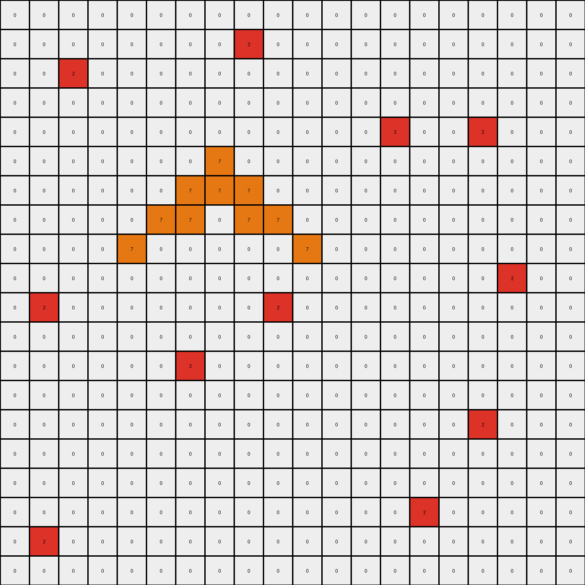

# 6d58a25d • 004 • refine_coder

---

Previous Code:
```python
"""
The transformation rule is as follows:
1. Iterate through each cell of the input grid.
2. Check if the current cell is an azure (8) pixel.
3. If a pixel is azure, then copy that azure pixel to the output grid at the same position.
   Additionally add an azure pixel *above* the current azure pixel (row - 1). If the row above is row 0, do nothing.
4. Locate the cluster of maroon pixels in the grid, and Copy all maroon pixels to the output.
5. Any azure pixels that overlay maroon pixels will replace the maroon.
6. All other pixels (white/0) remain unchanged in their respective positions.
"""

import numpy as np

def transform(input_grid):
    """Transforms the input grid according to the described rule."""

    output_grid = np.copy(input_grid)  # Initialize output_grid as a copy of input_grid

    rows, cols = input_grid.shape

    # Iterate over each cell
    for r in range(rows):
        for c in range(cols):
            # Check for azure pixels
            if input_grid[r, c] == 8:
                # Add azure pixel above if not in the first row
                if r > 0:
                    output_grid[r - 1, c] = 8

    return output_grid
```

Train Set Results:

## Example 1:

Input:
```
0 0 0 0 0 0 0 0 0 0 0 0 0 0 0 0 0 0 0 0
0 0 0 0 0 0 0 0 0 0 0 0 0 0 0 0 0 0 0 0
0 0 0 0 0 8 0 0 0 0 0 0 0 0 0 0 0 0 0 0
0 0 0 0 0 0 0 0 0 0 0 0 0 0 0 0 8 0 0 0
0 0 0 8 0 0 0 0 0 0 0 0 0 0 0 0 0 0 0 0
0 0 0 0 0 0 0 0 0 9 0 0 0 0 0 0 0 0 0 0
0 0 0 0 0 0 0 0 9 9 9 0 0 0 0 0 0 0 0 0
0 0 0 0 0 0 0 9 9 0 9 9 0 0 0 0 0 0 0 0
0 0 0 0 0 0 9 0 0 0 0 0 9 0 0 0 0 0 0 0
0 0 0 0 0 0 0 0 0 0 0 0 0 0 0 0 0 0 0 0
0 8 0 0 0 0 0 0 0 0 0 0 0 0 0 0 0 0 8 0
0 0 0 0 0 0 0 0 0 0 0 0 0 0 0 0 0 0 0 0
0 0 0 0 0 0 0 0 0 0 0 0 0 0 0 0 0 0 0 0
0 0 0 0 0 0 0 0 0 8 0 0 0 0 0 0 0 0 0 0
0 0 0 0 0 0 0 0 0 0 0 0 0 0 0 0 0 0 0 0
0 0 0 0 0 0 0 0 0 0 0 0 0 0 0 0 0 0 0 0
0 0 0 0 0 0 0 0 0 0 0 0 0 0 0 0 0 0 0 0
0 0 0 0 0 0 0 0 0 0 0 0 0 0 0 0 0 0 0 0
0 0 0 0 0 0 0 0 0 0 0 0 0 0 0 8 0 0 0 0
0 8 0 0 0 0 0 0 0 0 0 0 0 0 0 0 0 0 0 0
```
Expected Output:
```
0 0 0 0 0 0 0 0 0 0 0 0 0 0 0 0 0 0 0 0
0 0 0 0 0 0 0 0 0 0 0 0 0 0 0 0 0 0 0 0
0 0 0 0 0 8 0 0 0 0 0 0 0 0 0 0 0 0 0 0
0 0 0 0 0 0 0 0 0 0 0 0 0 0 0 0 8 0 0 0
0 0 0 8 0 0 0 0 0 0 0 0 0 0 0 0 0 0 0 0
0 0 0 0 0 0 0 0 0 9 0 0 0 0 0 0 0 0 0 0
0 0 0 0 0 0 0 0 9 9 9 0 0 0 0 0 0 0 0 0
0 0 0 0 0 0 0 9 9 8 9 9 0 0 0 0 0 0 0 0
0 0 0 0 0 0 9 0 0 8 0 0 9 0 0 0 0 0 0 0
0 0 0 0 0 0 0 0 0 8 0 0 0 0 0 0 0 0 0 0
0 8 0 0 0 0 0 0 0 8 0 0 0 0 0 0 0 0 8 0
0 0 0 0 0 0 0 0 0 8 0 0 0 0 0 0 0 0 0 0
0 0 0 0 0 0 0 0 0 8 0 0 0 0 0 0 0 0 0 0
0 0 0 0 0 0 0 0 0 8 0 0 0 0 0 0 0 0 0 0
0 0 0 0 0 0 0 0 0 8 0 0 0 0 0 0 0 0 0 0
0 0 0 0 0 0 0 0 0 8 0 0 0 0 0 0 0 0 0 0
0 0 0 0 0 0 0 0 0 8 0 0 0 0 0 0 0 0 0 0
0 0 0 0 0 0 0 0 0 8 0 0 0 0 0 0 0 0 0 0
0 0 0 0 0 0 0 0 0 8 0 0 0 0 0 8 0 0 0 0
0 8 0 0 0 0 0 0 0 8 0 0 0 0 0 0 0 0 0 0
```
Transformed Output:
```
0 0 0 0 0 0 0 0 0 0 0 0 0 0 0 0 0 0 0 0
0 0 0 0 0 8 0 0 0 0 0 0 0 0 0 0 0 0 0 0
0 0 0 0 0 8 0 0 0 0 0 0 0 0 0 0 8 0 0 0
0 0 0 8 0 0 0 0 0 0 0 0 0 0 0 0 8 0 0 0
0 0 0 8 0 0 0 0 0 0 0 0 0 0 0 0 0 0 0 0
0 0 0 0 0 0 0 0 0 9 0 0 0 0 0 0 0 0 0 0
0 0 0 0 0 0 0 0 9 9 9 0 0 0 0 0 0 0 0 0
0 0 0 0 0 0 0 9 9 0 9 9 0 0 0 0 0 0 0 0
0 0 0 0 0 0 9 0 0 0 0 0 9 0 0 0 0 0 0 0
0 8 0 0 0 0 0 0 0 0 0 0 0 0 0 0 0 0 8 0
0 8 0 0 0 0 0 0 0 0 0 0 0 0 0 0 0 0 8 0
0 0 0 0 0 0 0 0 0 0 0 0 0 0 0 0 0 0 0 0
0 0 0 0 0 0 0 0 0 8 0 0 0 0 0 0 0 0 0 0
0 0 0 0 0 0 0 0 0 8 0 0 0 0 0 0 0 0 0 0
0 0 0 0 0 0 0 0 0 0 0 0 0 0 0 0 0 0 0 0
0 0 0 0 0 0 0 0 0 0 0 0 0 0 0 0 0 0 0 0
0 0 0 0 0 0 0 0 0 0 0 0 0 0 0 0 0 0 0 0
0 0 0 0 0 0 0 0 0 0 0 0 0 0 0 8 0 0 0 0
0 8 0 0 0 0 0 0 0 0 0 0 0 0 0 8 0 0 0 0
0 8 0 0 0 0 0 0 0 0 0 0 0 0 0 0 0 0 0 0
```

match: False
pixels_off: 18
size_correct: True
color_palette_correct: True
correct_pixel_counts: False

## Example 2:

Input:
```
0 0 0 0 0 0 0 0 0 0 0 0 0 0 0 0 0 0 0 0
0 0 0 0 0 0 0 0 2 0 0 0 0 0 0 0 0 0 0 0
0 0 2 0 0 0 0 0 0 0 0 0 0 0 0 0 0 0 0 0
0 0 0 0 0 0 0 0 0 0 0 0 0 0 0 0 0 0 0 0
0 0 0 0 0 0 0 0 0 0 0 0 0 2 0 0 2 0 0 0
0 0 0 0 0 0 0 7 0 0 0 0 0 0 0 0 0 0 0 0
0 0 0 0 0 0 7 7 7 0 0 0 0 0 0 0 0 0 0 0
0 0 0 0 0 7 7 0 7 7 0 0 0 0 0 0 0 0 0 0
0 0 0 0 7 0 0 0 0 0 7 0 0 0 0 0 0 0 0 0
0 0 0 0 0 0 0 0 0 0 0 0 0 0 0 0 0 2 0 0
0 2 0 0 0 0 0 0 0 2 0 0 0 0 0 0 0 0 0 0
0 0 0 0 0 0 0 0 0 0 0 0 0 0 0 0 0 0 0 0
0 0 0 0 0 0 2 0 0 0 0 0 0 0 0 0 0 0 0 0
0 0 0 0 0 0 0 0 0 0 0 0 0 0 0 0 0 0 0 0
0 0 0 0 0 0 0 0 0 0 0 0 0 0 0 0 2 0 0 0
0 0 0 0 0 0 0 0 0 0 0 0 0 0 0 0 0 0 0 0
0 0 0 0 0 0 0 0 0 0 0 0 0 0 0 0 0 0 0 0
0 0 0 0 0 0 0 0 0 0 0 0 0 0 2 0 0 0 0 0
0 2 0 0 0 0 0 0 0 0 0 0 0 0 0 0 0 0 0 0
0 0 0 0 0 0 0 0 0 0 0 0 0 0 0 0 0 0 0 0
```
Expected Output:
```
0 0 0 0 0 0 0 0 0 0 0 0 0 0 0 0 0 0 0 0
0 0 0 0 0 0 0 0 2 0 0 0 0 0 0 0 0 0 0 0
0 0 2 0 0 0 0 0 0 0 0 0 0 0 0 0 0 0 0 0
0 0 0 0 0 0 0 0 0 0 0 0 0 0 0 0 0 0 0 0
0 0 0 0 0 0 0 0 0 0 0 0 0 2 0 0 2 0 0 0
0 0 0 0 0 0 0 7 0 0 0 0 0 0 0 0 0 0 0 0
0 0 0 0 0 0 7 7 7 0 0 0 0 0 0 0 0 0 0 0
0 0 0 0 0 7 7 0 7 7 0 0 0 0 0 0 0 0 0 0
0 0 0 0 7 0 2 0 0 2 7 0 0 0 0 0 0 0 0 0
0 0 0 0 0 0 2 0 0 2 0 0 0 0 0 0 0 2 0 0
0 2 0 0 0 0 2 0 0 2 0 0 0 0 0 0 0 0 0 0
0 0 0 0 0 0 2 0 0 2 0 0 0 0 0 0 0 0 0 0
0 0 0 0 0 0 2 0 0 2 0 0 0 0 0 0 0 0 0 0
0 0 0 0 0 0 2 0 0 2 0 0 0 0 0 0 0 0 0 0
0 0 0 0 0 0 2 0 0 2 0 0 0 0 0 0 2 0 0 0
0 0 0 0 0 0 2 0 0 2 0 0 0 0 0 0 0 0 0 0
0 0 0 0 0 0 2 0 0 2 0 0 0 0 0 0 0 0 0 0
0 0 0 0 0 0 2 0 0 2 0 0 0 0 2 0 0 0 0 0
0 2 0 0 0 0 2 0 0 2 0 0 0 0 0 0 0 0 0 0
0 0 0 0 0 0 2 0 0 2 0 0 0 0 0 0 0 0 0 0
```
Transformed Output:
```
0 0 0 0 0 0 0 0 0 0 0 0 0 0 0 0 0 0 0 0
0 0 0 0 0 0 0 0 2 0 0 0 0 0 0 0 0 0 0 0
0 0 2 0 0 0 0 0 0 0 0 0 0 0 0 0 0 0 0 0
0 0 0 0 0 0 0 0 0 0 0 0 0 0 0 0 0 0 0 0
0 0 0 0 0 0 0 0 0 0 0 0 0 2 0 0 2 0 0 0
0 0 0 0 0 0 0 7 0 0 0 0 0 0 0 0 0 0 0 0
0 0 0 0 0 0 7 7 7 0 0 0 0 0 0 0 0 0 0 0
0 0 0 0 0 7 7 0 7 7 0 0 0 0 0 0 0 0 0 0
0 0 0 0 7 0 0 0 0 0 7 0 0 0 0 0 0 0 0 0
0 0 0 0 0 0 0 0 0 0 0 0 0 0 0 0 0 2 0 0
0 2 0 0 0 0 0 0 0 2 0 0 0 0 0 0 0 0 0 0
0 0 0 0 0 0 0 0 0 0 0 0 0 0 0 0 0 0 0 0
0 0 0 0 0 0 2 0 0 0 0 0 0 0 0 0 0 0 0 0
0 0 0 0 0 0 0 0 0 0 0 0 0 0 0 0 0 0 0 0
0 0 0 0 0 0 0 0 0 0 0 0 0 0 0 0 2 0 0 0
0 0 0 0 0 0 0 0 0 0 0 0 0 0 0 0 0 0 0 0
0 0 0 0 0 0 0 0 0 0 0 0 0 0 0 0 0 0 0 0
0 0 0 0 0 0 0 0 0 0 0 0 0 0 2 0 0 0 0 0
0 2 0 0 0 0 0 0 0 0 0 0 0 0 0 0 0 0 0 0
0 0 0 0 0 0 0 0 0 0 0 0 0 0 0 0 0 0 0 0
```

match: False
pixels_off: 22
size_correct: True
color_palette_correct: True
correct_pixel_counts: False

## Example 3:

Input:
```
0 0 0 0 0 0 0 0 0 0 0 0 0 0 0 0 0 0 0 0
0 0 0 0 0 0 0 0 0 0 0 0 0 0 3 0 0 0 0 0
0 0 0 0 0 3 0 0 0 0 3 0 0 0 0 0 0 0 0 0
0 0 0 0 0 0 0 0 0 0 0 0 0 0 0 0 0 0 0 0
0 3 0 0 0 0 0 0 0 0 0 0 4 0 0 0 0 0 0 0
0 0 0 0 0 0 0 3 0 0 0 4 4 4 0 0 0 0 3 0
0 0 0 0 0 0 0 0 0 0 4 4 0 4 4 0 0 0 0 0
0 0 0 0 3 0 0 0 0 4 0 0 0 0 0 4 0 0 0 0
0 0 0 0 0 0 0 0 0 0 0 0 0 0 0 0 0 0 0 0
0 0 0 0 0 0 0 0 0 0 3 0 0 0 0 0 0 0 0 0
0 0 3 0 0 0 0 0 0 0 0 0 0 0 0 0 0 0 0 0
0 0 0 0 0 0 0 0 0 0 0 0 0 0 0 0 0 0 0 0
3 0 0 0 0 0 0 3 0 0 0 0 0 3 0 0 0 0 3 0
0 0 0 0 0 0 0 0 0 0 0 0 0 0 0 0 0 0 0 0
0 0 0 0 0 0 0 0 0 0 0 0 0 0 0 0 0 0 0 0
0 0 0 0 3 0 0 0 0 0 0 0 0 0 0 0 0 0 0 0
0 0 0 0 0 0 0 0 0 0 0 0 3 0 0 0 0 0 0 0
0 3 0 0 0 0 0 0 0 0 0 0 0 0 0 0 3 0 0 0
0 0 0 0 0 0 0 3 0 0 0 0 0 3 0 0 0 0 0 3
0 0 0 0 0 0 0 0 0 0 0 0 0 0 0 0 0 0 0 0
```
Expected Output:
```
0 0 0 0 0 0 0 0 0 0 0 0 0 0 0 0 0 0 0 0
0 0 0 0 0 0 0 0 0 0 0 0 0 0 3 0 0 0 0 0
0 0 0 0 0 3 0 0 0 0 3 0 0 0 0 0 0 0 0 0
0 0 0 0 0 0 0 0 0 0 0 0 0 0 0 0 0 0 0 0
0 3 0 0 0 0 0 0 0 0 0 0 4 0 0 0 0 0 0 0
0 0 0 0 0 0 0 3 0 0 0 4 4 4 0 0 0 0 3 0
0 0 0 0 0 0 0 0 0 0 4 4 3 4 4 0 0 0 0 0
0 0 0 0 3 0 0 0 0 4 3 0 3 3 0 4 0 0 0 0
0 0 0 0 0 0 0 0 0 0 3 0 3 3 0 0 0 0 0 0
0 0 0 0 0 0 0 0 0 0 3 0 3 3 0 0 0 0 0 0
0 0 3 0 0 0 0 0 0 0 3 0 3 3 0 0 0 0 0 0
0 0 0 0 0 0 0 0 0 0 3 0 3 3 0 0 0 0 0 0
3 0 0 0 0 0 0 3 0 0 3 0 3 3 0 0 0 0 3 0
0 0 0 0 0 0 0 0 0 0 3 0 3 3 0 0 0 0 0 0
0 0 0 0 0 0 0 0 0 0 3 0 3 3 0 0 0 0 0 0
0 0 0 0 3 0 0 0 0 0 3 0 3 3 0 0 0 0 0 0
0 0 0 0 0 0 0 0 0 0 3 0 3 3 0 0 0 0 0 0
0 3 0 0 0 0 0 0 0 0 3 0 3 3 0 0 3 0 0 0
0 0 0 0 0 0 0 3 0 0 3 0 3 3 0 0 0 0 0 3
0 0 0 0 0 0 0 0 0 0 3 0 3 3 0 0 0 0 0 0
```
Transformed Output:
```
0 0 0 0 0 0 0 0 0 0 0 0 0 0 0 0 0 0 0 0
0 0 0 0 0 0 0 0 0 0 0 0 0 0 3 0 0 0 0 0
0 0 0 0 0 3 0 0 0 0 3 0 0 0 0 0 0 0 0 0
0 0 0 0 0 0 0 0 0 0 0 0 0 0 0 0 0 0 0 0
0 3 0 0 0 0 0 0 0 0 0 0 4 0 0 0 0 0 0 0
0 0 0 0 0 0 0 3 0 0 0 4 4 4 0 0 0 0 3 0
0 0 0 0 0 0 0 0 0 0 4 4 0 4 4 0 0 0 0 0
0 0 0 0 3 0 0 0 0 4 0 0 0 0 0 4 0 0 0 0
0 0 0 0 0 0 0 0 0 0 0 0 0 0 0 0 0 0 0 0
0 0 0 0 0 0 0 0 0 0 3 0 0 0 0 0 0 0 0 0
0 0 3 0 0 0 0 0 0 0 0 0 0 0 0 0 0 0 0 0
0 0 0 0 0 0 0 0 0 0 0 0 0 0 0 0 0 0 0 0
3 0 0 0 0 0 0 3 0 0 0 0 0 3 0 0 0 0 3 0
0 0 0 0 0 0 0 0 0 0 0 0 0 0 0 0 0 0 0 0
0 0 0 0 0 0 0 0 0 0 0 0 0 0 0 0 0 0 0 0
0 0 0 0 3 0 0 0 0 0 0 0 0 0 0 0 0 0 0 0
0 0 0 0 0 0 0 0 0 0 0 0 3 0 0 0 0 0 0 0
0 3 0 0 0 0 0 0 0 0 0 0 0 0 0 0 3 0 0 0
0 0 0 0 0 0 0 3 0 0 0 0 0 3 0 0 0 0 0 3
0 0 0 0 0 0 0 0 0 0 0 0 0 0 0 0 0 0 0 0
```

match: False
pixels_off: 36
size_correct: True
color_palette_correct: True
correct_pixel_counts: False
Okay, let's analyze the results and refine the natural language program and approach.

**General Assessment:**

The initial code was based on a simple observation: replicating azure pixels and adding one above. However, the subsequent examples reveal a more complex rule involving interactions between different colored objects (azure, maroon, orange, green). The current code fails to correctly handle the maroon and other colored pixels in examples 1 and 2 and completely misses critical aspects of Example 3. The code is only partially correct for the azure pixels, and completely misses how to deal with other colors. The main strategy will be to correctly identify *all* objects and their interactions. The provided code has a decent start on iteration, and on finding azure pixels, which we should retain.

**Metrics and Observations:**

Here's a breakdown of each example, including metrics and observations:

*   **Example 1:**
    *   **Metrics:** 18 pixels off, size correct, color palette correct, pixel counts incorrect.
    *   **Observations:** The code correctly adds some azure pixels and places an azure pixel above many of the existing azure pixels. It does not correctly copy the maroon pixels. The azure overwrites the maroon in the expected output, which the current code does not handle.

*   **Example 2:**
    *   **Metrics:** 22 pixels off, size correct, color palette correct, pixel counts incorrect.
    *   **Observations:** The code doesn't copy the orange pixels at all, nor does it correctly position all the existing reds. It is still focused exclusively on the azure pixels from the original instructions.

*   **Example 3:**
    *   **Metrics:** 36 pixels off, size correct, color palette correct, pixel counts incorrect.
    *   **Observations:** This example introduces green and orange pixels, and more complex object interactions. The added azure pixels (above existing azure pixels) now seem to interact by an overlay/overwrite mechanic with the *other* colored pixels in the image. It looks like the *other* colors may have been extruded upwards, and *then* the azure is an overlay.

**YAML Fact Block:**

```yaml
objects:
  - color: azure
    behavior:
      - overlay: True
        above_existing: True

  - color: maroon
    behavior:
      - copy: True # all maroon clusters are copied
      - interaction: azure overwrites #maroon

  - color: red
    behavior:
      - copy: True #all red pixels are copied
      - move_with_neighbor:
        - color: orange

  - color: orange
    behavior:
      - copy: true # all original orange pixels are copied
      - extrude:
          direction: up
          max_dist: 3

  - color: green
    behavior:
      - copy: True # all green clusters are copied
      - move_with_neighbor:
        - color: orange

```

**Natural Language Program:**

1.  **Copy all Maroon Pixels**: Identify and copy all maroon (9) pixels from the input to the output grid, maintaining their relative positions.
2.  **Process Orange Pixels**: Locate all clusters of orange (7) pixels. For each cluster, copy it to the output grid. Additionally "extrude" or copy the orange color upwards by up to three pixels.
3. **Move red and green**: Red and green pixels appear to maintain position *relative* to orange, moving upwards along with the "extruded" orange pixels.
4.  **Process Azure Pixels:** For every azure (8) pixel in the input grid:
    *   Copy the azure pixel to the output grid in the same position.
    *   Add an azure pixel directly *above* the current azure pixel (row - 1). If the current pixel is in the top row (row 0), do not add a pixel above.
5. **Overwrite**: If any azure pixels are placed in the same position as a maroon, red, green or orange pixel in the output grid, the azure pixel overwrites (replaces) the other pixel's color. Other pixels are *not* overwritten.

This revised program accounts for the object interactions and behaviors observed across all three training examples. The "extrusion" concept and the interaction of azure and the other objects, is the most complex part.

**INSTRUCTIONS**

- generate a Python module to represent the natural language program 
- follow the template below
- all common math and science libraries are available
- create docstring only at top - but comment the workflow in the function
- use helper functions for common operations like finding objects, counting,
  measuring, moving, etc. 

remember - we are working iteratively - so this code will inform your future
self as we converge on the solution

*template:*

```python
"""
{{ natural language description of the transformation rule }}
"""

{{ imports }}

def transform(input_grid):
    # initialize output_grid

    # change output pixels 

    return output_grid

```
