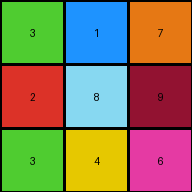

# 6ecd11f4 • 003 • refine_dreamer

---

Previous Code:
```python
"""
Extracts a specific 3x3 subgrid from the input grid, based on the location of a multi-colored region in the lower part of the grid.
"""

import numpy as np

def find_3x3_subgrid(input_grid):
    # Find the bounding box of non-zero and non-one pixels.
    rows, cols = input_grid.shape
    non_zero_one_indices = np.argwhere((input_grid != 0) & (input_grid !=1))

    if len(non_zero_one_indices) == 0:
        return None
    
    min_row = np.min(non_zero_one_indices[:, 0])
    max_row = np.max(non_zero_one_indices[:, 0])
    min_col = np.min(non_zero_one_indices[:, 1])
    max_col = np.max(non_zero_one_indices[:, 1])

    #Check if the region is 3x3.
    if max_row - min_row == 2 and max_col - min_col == 2:
       return (min_row, min_col)

    return None #no 3x3 region found

def transform(input_grid):
    """
    Transforms the input grid by extracting a 3x3 subgrid.
    """
    # Find the location of 3x3 subgrid.
    subgrid_start = find_3x3_subgrid(input_grid)

    # initialize output_grid as 3x3 of all 0
    output_grid = np.zeros((3, 3), dtype=int)

    if subgrid_start:
        # Extract the 3x3 subgrid.
        row_start, col_start = subgrid_start
        for i in range(3):
            for j in range(3):
                output_grid[i, j] = input_grid[row_start + i, col_start + j]

    return output_grid
```

Train Set Results:

## Example 1:

Input:
```
0 0 0 0 0 0 0 0 0 0 0 0 0 0 0 0 0 0 0 0 0
0 1 1 1 1 1 0 0 0 0 0 1 1 1 1 1 0 0 0 0 0
0 1 1 1 1 1 0 0 0 0 0 1 1 1 1 1 0 0 0 0 0
0 1 1 1 1 1 0 0 0 0 0 1 1 1 1 1 0 0 0 0 0
0 1 1 1 1 1 0 0 0 0 0 1 1 1 1 1 0 0 0 0 0
0 1 1 1 1 1 0 0 0 0 0 1 1 1 1 1 0 0 0 0 0
0 0 0 0 0 0 1 1 1 1 1 0 0 0 0 0 0 0 0 0 0
0 0 0 0 0 0 1 1 1 1 1 0 0 0 0 0 0 0 0 0 0
0 0 0 0 0 0 1 1 1 1 1 0 0 0 0 0 0 0 0 0 0
0 0 0 0 0 0 1 1 1 1 1 0 0 0 0 0 0 0 0 0 0
0 0 0 0 0 0 1 1 1 1 1 0 0 0 0 0 0 0 0 0 0
0 1 1 1 1 1 0 0 0 0 0 1 1 1 1 1 0 0 0 0 0
0 1 1 1 1 1 0 0 0 0 0 1 1 1 1 1 0 0 0 0 0
0 1 1 1 1 1 0 0 0 0 0 1 1 1 1 1 0 0 0 0 0
0 1 1 1 1 1 0 0 0 0 0 1 1 1 1 1 0 0 0 0 0
0 1 1 1 1 1 0 0 0 0 0 1 1 1 1 1 0 0 0 0 0
0 0 0 0 0 0 0 0 0 0 0 0 0 0 0 0 0 0 0 0 0
0 0 0 0 0 0 0 0 0 0 0 0 0 0 0 0 0 0 0 0 0
0 0 0 0 0 0 0 0 0 0 0 0 0 0 0 0 0 0 0 0 0
0 0 0 0 0 0 0 3 1 7 0 0 0 0 0 0 0 0 0 0 0
0 0 0 0 0 0 0 2 8 9 0 0 0 0 0 0 0 0 0 0 0
0 0 0 0 0 0 0 3 4 6 0 0 0 0 0 0 0 0 0 0 0
0 0 0 0 0 0 0 0 0 0 0 0 0 0 0 0 0 0 0 0 0
0 0 0 0 0 0 0 0 0 0 0 0 0 0 0 0 0 0 0 0 0
0 0 0 0 0 0 0 0 0 0 0 0 0 0 0 0 0 0 0 0 0
0 0 0 0 0 0 0 0 0 0 0 0 0 0 0 0 0 0 0 0 0
0 0 0 0 0 0 0 0 0 0 0 0 0 0 0 0 0 0 0 0 0
```
Expected Output:
```
3 0 7
0 8 0
3 0 6
```
Transformed Output:
```
3 1 7
2 8 9
3 4 6
```

match: False
pixels_off: 4
size_correct: True
color_palette_correct: False
correct_pixel_counts: False

## Example 2:

Input:
```
0 0 0 0 0 0 0 0 0 0 0 0 0 0 0 0 0 0 0 0 0 0 0 0 0
0 0 0 0 0 0 0 0 0 0 0 0 0 0 0 0 0 0 0 0 0 0 0 0 0
0 0 0 0 0 0 0 0 0 0 0 0 0 0 0 0 0 0 0 0 0 0 0 0 0
0 0 0 0 0 0 0 0 0 3 3 3 0 0 0 3 3 3 0 0 0 0 0 0 0
0 0 0 0 0 0 0 0 0 3 3 3 0 0 0 3 3 3 0 0 0 0 0 0 0
0 0 0 0 0 0 0 0 0 3 3 3 0 0 0 3 3 3 0 0 0 0 0 0 0
0 0 0 0 0 0 0 0 0 3 3 3 3 3 3 0 0 0 0 0 0 0 0 0 0
0 0 0 0 0 0 0 0 0 3 3 3 3 3 3 0 0 0 0 0 0 0 0 0 0
0 0 0 0 0 0 0 0 0 3 3 3 3 3 3 0 0 0 0 0 0 0 0 0 0
0 0 0 0 0 0 0 0 0 0 0 0 3 3 3 3 3 3 0 0 0 0 0 0 0
0 0 0 0 0 0 0 0 0 0 0 0 3 3 3 3 3 3 0 0 0 0 0 0 0
0 0 0 0 0 0 0 0 0 0 0 0 3 3 3 3 3 3 0 0 0 0 0 0 0
0 0 0 0 0 0 0 0 0 0 0 0 0 0 0 0 0 0 0 0 0 0 0 0 0
0 0 0 0 0 0 0 0 0 0 0 0 0 0 0 0 0 0 0 0 0 0 0 0 0
0 0 0 0 0 0 0 0 0 0 0 0 0 0 0 0 0 0 0 0 0 0 0 0 0
0 0 0 0 0 0 0 0 0 0 0 0 0 0 0 0 0 0 0 0 0 0 0 0 0
0 0 0 0 0 0 0 0 0 0 0 0 0 0 0 0 0 0 0 0 0 0 0 0 0
0 0 0 0 0 0 0 0 0 0 0 0 0 0 0 0 0 0 0 0 0 0 0 0 0
0 0 0 0 0 0 0 0 0 0 0 0 0 0 0 0 0 0 0 0 0 0 0 0 0
0 0 0 0 0 0 0 0 2 1 7 0 0 0 0 0 0 0 0 0 0 0 0 0 0
0 0 0 0 0 0 0 0 4 8 9 0 0 0 0 0 0 0 0 0 0 0 0 0 0
0 0 0 0 0 0 0 0 8 6 1 0 0 0 0 0 0 0 0 0 0 0 0 0 0
0 0 0 0 0 0 0 0 0 0 0 0 0 0 0 0 0 0 0 0 0 0 0 0 0
0 0 0 0 0 0 0 0 0 0 0 0 0 0 0 0 0 0 0 0 0 0 0 0 0
0 0 0 0 0 0 0 0 0 0 0 0 0 0 0 0 0 0 0 0 0 0 0 0 0
0 0 0 0 0 0 0 0 0 0 0 0 0 0 0 0 0 0 0 0 0 0 0 0 0
0 0 0 0 0 0 0 0 0 0 0 0 0 0 0 0 0 0 0 0 0 0 0 0 0
```
Expected Output:
```
2 0 7
4 8 0
0 6 1
```
Transformed Output:
```
0 0 0
0 0 0
0 0 0
```

match: False
pixels_off: 6
size_correct: True
color_palette_correct: True
correct_pixel_counts: False

## Example 3:

Input:
```
0 0 0 0 0 0 0 0 0 0 0 0 0 0 0 0 0 0 0 0 0 0
0 0 8 8 8 8 0 0 0 0 8 8 8 8 8 8 8 8 0 0 0 0
0 0 8 8 8 8 0 0 0 0 8 8 8 8 8 8 8 8 0 0 0 0
0 0 8 8 8 8 0 0 0 0 8 8 8 8 8 8 8 8 0 0 0 0
0 0 8 8 8 8 0 0 0 0 8 8 8 8 8 8 8 8 0 0 0 0
0 0 8 8 8 8 0 0 0 0 8 8 8 8 0 0 0 0 0 0 0 0
0 0 8 8 8 8 0 0 0 0 8 8 8 8 0 0 0 0 0 0 0 0
0 0 8 8 8 8 0 0 0 0 8 8 8 8 0 0 0 0 0 0 0 0
0 0 8 8 8 8 0 0 0 0 8 8 8 8 0 0 0 0 0 0 0 0
0 0 8 8 8 8 0 0 0 0 0 0 0 0 8 8 8 8 0 0 0 0
0 0 8 8 8 8 0 0 0 0 0 0 0 0 8 8 8 8 0 0 0 0
0 0 8 8 8 8 0 0 0 0 0 0 0 0 8 8 8 8 0 0 0 0
0 0 8 8 8 8 0 0 0 0 0 0 0 0 8 8 8 8 0 0 0 0
0 0 8 8 8 8 8 8 8 8 8 8 8 8 0 0 0 0 0 0 0 0
0 0 8 8 8 8 8 8 8 8 8 8 8 8 0 0 0 0 0 0 0 0
0 0 8 8 8 8 8 8 8 8 8 8 8 8 0 0 0 0 0 0 0 0
0 0 8 8 8 8 8 8 8 8 8 8 8 8 0 0 0 4 1 9 4 0
0 0 0 0 0 0 0 0 0 0 0 0 0 0 0 0 0 6 3 6 1 0
0 0 0 0 0 0 0 0 0 0 0 0 0 0 0 0 0 3 5 7 5 0
0 0 0 0 0 0 0 0 0 0 0 0 0 0 0 0 0 2 4 2 7 0
0 0 0 0 0 0 0 0 0 0 0 0 0 0 0 0 0 0 0 0 0 0
0 0 0 0 0 0 0 0 0 0 0 0 0 0 0 0 0 0 0 0 0 0
```
Expected Output:
```
4 0 9 4
6 0 6 0
3 0 0 5
2 4 2 0
```
Transformed Output:
```
0 0 0
0 0 0
0 0 0
```

match: False
pixels_off: None
size_correct: False
color_palette_correct: True
correct_pixel_counts: False
**INSTRUCTIONS**

The code above was generated based on observations from the first training
example

we have tested the transform function on each of the task example inputs and
compared with the expected output

review each of the examples provided and the results and consider how the
natural language program should be updated to accommodate this new knowledge

respond with the following deliverables:

- general assessment of the information provided and strategy for resolving the
  errors
- gather metrics about each of the examples and results - use code_execution to
  develop accurate reports on your assumptions
- a YAML block documenting facts - Focus on identifying objects, their properties, and the actions performed on them.
- a natural language program - Be as clear and concise as possible, providing a complete description of the transformation rule.


your responses should be considered as information in a report - not a
conversation
