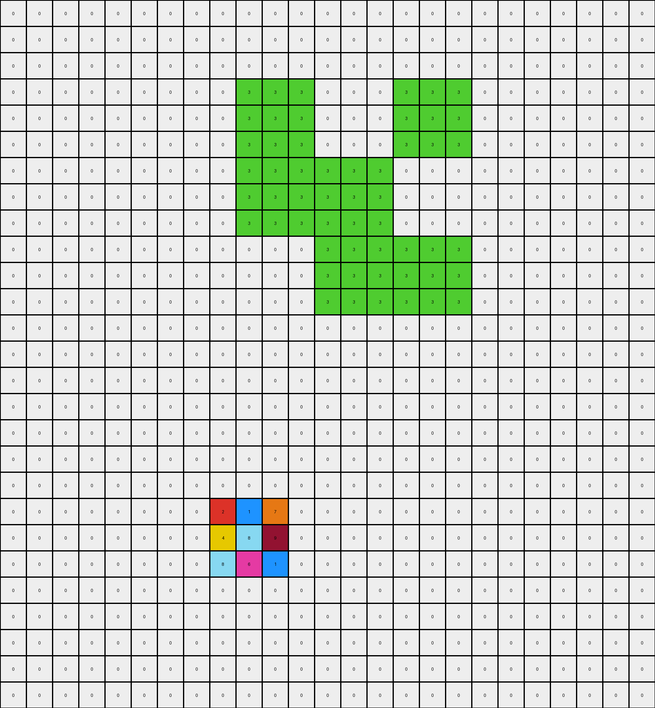
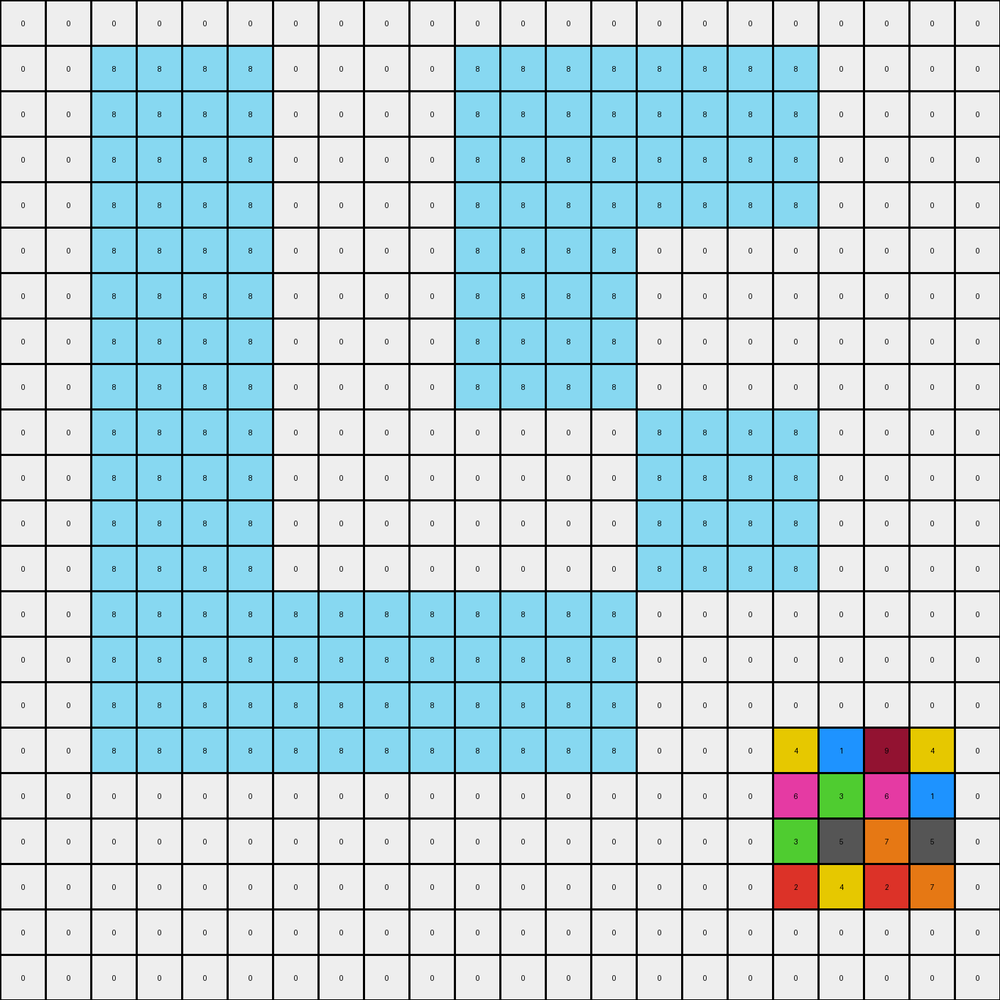

# 6ecd11f4 • 006 • refine_coder

---

Previous Code:
```python
"""
Extracts a subgrid from the input grid, based on the location of a multi-colored region in the lower part of the grid. The size of subgrid may vary.
Some color modification might be applied to the extracted subgrid.
"""

import numpy as np

def find_target_region(input_grid):
    """
    Finds the bounding box of the multi-colored region (non-0 and non-1 pixels) at the bottom.
    """
    rows, cols = input_grid.shape
    non_zero_one_indices = np.argwhere((input_grid != 0) & (input_grid != 1))

    if len(non_zero_one_indices) == 0:
        return None, None, None, None

    min_row = np.min(non_zero_one_indices[:, 0])
    max_row = np.max(non_zero_one_indices[:, 0])
    min_col = np.min(non_zero_one_indices[:, 1])
    max_col = np.max(non_zero_one_indices[:, 1])

    return min_row, max_row, min_col, max_col

def transform(input_grid):
    """
    Transforms the input grid by extracting a subgrid.
    """
    # Find the location of target region.
    min_row, max_row, min_col, max_col = find_target_region(input_grid)

    # Get expected output size by checking train set.
    output_grid_row_size = max_row - min_row + 1
    output_grid_col_size = max_col - min_col + 1

    if output_grid_row_size == 3 and output_grid_col_size ==3:
      output_grid = np.zeros((3, 3), dtype=int)
    elif output_grid_row_size == 4 and output_grid_col_size == 3:
      output_grid = np.zeros((4,3), dtype=int)
    else:
      return input_grid


    if min_row is not None:
        # Extract the subgrid, align at top-left corner.
        for i in range(output_grid.shape[0]):
            for j in range(output_grid.shape[1]):
                if min_row + i < input_grid.shape[0] and min_col + j < input_grid.shape[1]:
                   output_grid[i, j] = input_grid[min_row + i, min_col + j]

    # Color changes needs further checks.

    return output_grid
```

Train Set Results:

## Example 1:

Input:
```
0 0 0 0 0 0 0 0 0 0 0 0 0 0 0 0 0 0 0 0 0
0 1 1 1 1 1 0 0 0 0 0 1 1 1 1 1 0 0 0 0 0
0 1 1 1 1 1 0 0 0 0 0 1 1 1 1 1 0 0 0 0 0
0 1 1 1 1 1 0 0 0 0 0 1 1 1 1 1 0 0 0 0 0
0 1 1 1 1 1 0 0 0 0 0 1 1 1 1 1 0 0 0 0 0
0 1 1 1 1 1 0 0 0 0 0 1 1 1 1 1 0 0 0 0 0
0 0 0 0 0 0 1 1 1 1 1 0 0 0 0 0 0 0 0 0 0
0 0 0 0 0 0 1 1 1 1 1 0 0 0 0 0 0 0 0 0 0
0 0 0 0 0 0 1 1 1 1 1 0 0 0 0 0 0 0 0 0 0
0 0 0 0 0 0 1 1 1 1 1 0 0 0 0 0 0 0 0 0 0
0 0 0 0 0 0 1 1 1 1 1 0 0 0 0 0 0 0 0 0 0
0 1 1 1 1 1 0 0 0 0 0 1 1 1 1 1 0 0 0 0 0
0 1 1 1 1 1 0 0 0 0 0 1 1 1 1 1 0 0 0 0 0
0 1 1 1 1 1 0 0 0 0 0 1 1 1 1 1 0 0 0 0 0
0 1 1 1 1 1 0 0 0 0 0 1 1 1 1 1 0 0 0 0 0
0 1 1 1 1 1 0 0 0 0 0 1 1 1 1 1 0 0 0 0 0
0 0 0 0 0 0 0 0 0 0 0 0 0 0 0 0 0 0 0 0 0
0 0 0 0 0 0 0 0 0 0 0 0 0 0 0 0 0 0 0 0 0
0 0 0 0 0 0 0 0 0 0 0 0 0 0 0 0 0 0 0 0 0
0 0 0 0 0 0 0 3 1 7 0 0 0 0 0 0 0 0 0 0 0
0 0 0 0 0 0 0 2 8 9 0 0 0 0 0 0 0 0 0 0 0
0 0 0 0 0 0 0 3 4 6 0 0 0 0 0 0 0 0 0 0 0
0 0 0 0 0 0 0 0 0 0 0 0 0 0 0 0 0 0 0 0 0
0 0 0 0 0 0 0 0 0 0 0 0 0 0 0 0 0 0 0 0 0
0 0 0 0 0 0 0 0 0 0 0 0 0 0 0 0 0 0 0 0 0
0 0 0 0 0 0 0 0 0 0 0 0 0 0 0 0 0 0 0 0 0
0 0 0 0 0 0 0 0 0 0 0 0 0 0 0 0 0 0 0 0 0
```
Expected Output:
```
3 0 7
0 8 0
3 0 6
```
Transformed Output:
```
3 1 7
2 8 9
3 4 6
```

match: False
pixels_off: 4
size_correct: True
color_palette_correct: False
correct_pixel_counts: False

## Example 2:

Input:
```
0 0 0 0 0 0 0 0 0 0 0 0 0 0 0 0 0 0 0 0 0 0 0 0 0
0 0 0 0 0 0 0 0 0 0 0 0 0 0 0 0 0 0 0 0 0 0 0 0 0
0 0 0 0 0 0 0 0 0 0 0 0 0 0 0 0 0 0 0 0 0 0 0 0 0
0 0 0 0 0 0 0 0 0 3 3 3 0 0 0 3 3 3 0 0 0 0 0 0 0
0 0 0 0 0 0 0 0 0 3 3 3 0 0 0 3 3 3 0 0 0 0 0 0 0
0 0 0 0 0 0 0 0 0 3 3 3 0 0 0 3 3 3 0 0 0 0 0 0 0
0 0 0 0 0 0 0 0 0 3 3 3 3 3 3 0 0 0 0 0 0 0 0 0 0
0 0 0 0 0 0 0 0 0 3 3 3 3 3 3 0 0 0 0 0 0 0 0 0 0
0 0 0 0 0 0 0 0 0 3 3 3 3 3 3 0 0 0 0 0 0 0 0 0 0
0 0 0 0 0 0 0 0 0 0 0 0 3 3 3 3 3 3 0 0 0 0 0 0 0
0 0 0 0 0 0 0 0 0 0 0 0 3 3 3 3 3 3 0 0 0 0 0 0 0
0 0 0 0 0 0 0 0 0 0 0 0 3 3 3 3 3 3 0 0 0 0 0 0 0
0 0 0 0 0 0 0 0 0 0 0 0 0 0 0 0 0 0 0 0 0 0 0 0 0
0 0 0 0 0 0 0 0 0 0 0 0 0 0 0 0 0 0 0 0 0 0 0 0 0
0 0 0 0 0 0 0 0 0 0 0 0 0 0 0 0 0 0 0 0 0 0 0 0 0
0 0 0 0 0 0 0 0 0 0 0 0 0 0 0 0 0 0 0 0 0 0 0 0 0
0 0 0 0 0 0 0 0 0 0 0 0 0 0 0 0 0 0 0 0 0 0 0 0 0
0 0 0 0 0 0 0 0 0 0 0 0 0 0 0 0 0 0 0 0 0 0 0 0 0
0 0 0 0 0 0 0 0 0 0 0 0 0 0 0 0 0 0 0 0 0 0 0 0 0
0 0 0 0 0 0 0 0 2 1 7 0 0 0 0 0 0 0 0 0 0 0 0 0 0
0 0 0 0 0 0 0 0 4 8 9 0 0 0 0 0 0 0 0 0 0 0 0 0 0
0 0 0 0 0 0 0 0 8 6 1 0 0 0 0 0 0 0 0 0 0 0 0 0 0
0 0 0 0 0 0 0 0 0 0 0 0 0 0 0 0 0 0 0 0 0 0 0 0 0
0 0 0 0 0 0 0 0 0 0 0 0 0 0 0 0 0 0 0 0 0 0 0 0 0
0 0 0 0 0 0 0 0 0 0 0 0 0 0 0 0 0 0 0 0 0 0 0 0 0
0 0 0 0 0 0 0 0 0 0 0 0 0 0 0 0 0 0 0 0 0 0 0 0 0
0 0 0 0 0 0 0 0 0 0 0 0 0 0 0 0 0 0 0 0 0 0 0 0 0
```
Expected Output:
```
2 0 7
4 8 0
0 6 1
```
Transformed Output:
```
0 0 0 0 0 0 0 0 0 0 0 0 0 0 0 0 0 0 0 0 0 0 0 0 0
0 0 0 0 0 0 0 0 0 0 0 0 0 0 0 0 0 0 0 0 0 0 0 0 0
0 0 0 0 0 0 0 0 0 0 0 0 0 0 0 0 0 0 0 0 0 0 0 0 0
0 0 0 0 0 0 0 0 0 3 3 3 0 0 0 3 3 3 0 0 0 0 0 0 0
0 0 0 0 0 0 0 0 0 3 3 3 0 0 0 3 3 3 0 0 0 0 0 0 0
0 0 0 0 0 0 0 0 0 3 3 3 0 0 0 3 3 3 0 0 0 0 0 0 0
0 0 0 0 0 0 0 0 0 3 3 3 3 3 3 0 0 0 0 0 0 0 0 0 0
0 0 0 0 0 0 0 0 0 3 3 3 3 3 3 0 0 0 0 0 0 0 0 0 0
0 0 0 0 0 0 0 0 0 3 3 3 3 3 3 0 0 0 0 0 0 0 0 0 0
0 0 0 0 0 0 0 0 0 0 0 0 3 3 3 3 3 3 0 0 0 0 0 0 0
0 0 0 0 0 0 0 0 0 0 0 0 3 3 3 3 3 3 0 0 0 0 0 0 0
0 0 0 0 0 0 0 0 0 0 0 0 3 3 3 3 3 3 0 0 0 0 0 0 0
0 0 0 0 0 0 0 0 0 0 0 0 0 0 0 0 0 0 0 0 0 0 0 0 0
0 0 0 0 0 0 0 0 0 0 0 0 0 0 0 0 0 0 0 0 0 0 0 0 0
0 0 0 0 0 0 0 0 0 0 0 0 0 0 0 0 0 0 0 0 0 0 0 0 0
0 0 0 0 0 0 0 0 0 0 0 0 0 0 0 0 0 0 0 0 0 0 0 0 0
0 0 0 0 0 0 0 0 0 0 0 0 0 0 0 0 0 0 0 0 0 0 0 0 0
0 0 0 0 0 0 0 0 0 0 0 0 0 0 0 0 0 0 0 0 0 0 0 0 0
0 0 0 0 0 0 0 0 0 0 0 0 0 0 0 0 0 0 0 0 0 0 0 0 0
0 0 0 0 0 0 0 0 2 1 7 0 0 0 0 0 0 0 0 0 0 0 0 0 0
0 0 0 0 0 0 0 0 4 8 9 0 0 0 0 0 0 0 0 0 0 0 0 0 0
0 0 0 0 0 0 0 0 8 6 1 0 0 0 0 0 0 0 0 0 0 0 0 0 0
0 0 0 0 0 0 0 0 0 0 0 0 0 0 0 0 0 0 0 0 0 0 0 0 0
0 0 0 0 0 0 0 0 0 0 0 0 0 0 0 0 0 0 0 0 0 0 0 0 0
0 0 0 0 0 0 0 0 0 0 0 0 0 0 0 0 0 0 0 0 0 0 0 0 0
0 0 0 0 0 0 0 0 0 0 0 0 0 0 0 0 0 0 0 0 0 0 0 0 0
0 0 0 0 0 0 0 0 0 0 0 0 0 0 0 0 0 0 0 0 0 0 0 0 0
```

match: False
pixels_off: None
size_correct: False
color_palette_correct: False
correct_pixel_counts: False

## Example 3:

Input:
```
0 0 0 0 0 0 0 0 0 0 0 0 0 0 0 0 0 0 0 0 0 0
0 0 8 8 8 8 0 0 0 0 8 8 8 8 8 8 8 8 0 0 0 0
0 0 8 8 8 8 0 0 0 0 8 8 8 8 8 8 8 8 0 0 0 0
0 0 8 8 8 8 0 0 0 0 8 8 8 8 8 8 8 8 0 0 0 0
0 0 8 8 8 8 0 0 0 0 8 8 8 8 8 8 8 8 0 0 0 0
0 0 8 8 8 8 0 0 0 0 8 8 8 8 0 0 0 0 0 0 0 0
0 0 8 8 8 8 0 0 0 0 8 8 8 8 0 0 0 0 0 0 0 0
0 0 8 8 8 8 0 0 0 0 8 8 8 8 0 0 0 0 0 0 0 0
0 0 8 8 8 8 0 0 0 0 8 8 8 8 0 0 0 0 0 0 0 0
0 0 8 8 8 8 0 0 0 0 0 0 0 0 8 8 8 8 0 0 0 0
0 0 8 8 8 8 0 0 0 0 0 0 0 0 8 8 8 8 0 0 0 0
0 0 8 8 8 8 0 0 0 0 0 0 0 0 8 8 8 8 0 0 0 0
0 0 8 8 8 8 0 0 0 0 0 0 0 0 8 8 8 8 0 0 0 0
0 0 8 8 8 8 8 8 8 8 8 8 8 8 0 0 0 0 0 0 0 0
0 0 8 8 8 8 8 8 8 8 8 8 8 8 0 0 0 0 0 0 0 0
0 0 8 8 8 8 8 8 8 8 8 8 8 8 0 0 0 0 0 0 0 0
0 0 8 8 8 8 8 8 8 8 8 8 8 8 0 0 0 4 1 9 4 0
0 0 0 0 0 0 0 0 0 0 0 0 0 0 0 0 0 6 3 6 1 0
0 0 0 0 0 0 0 0 0 0 0 0 0 0 0 0 0 3 5 7 5 0
0 0 0 0 0 0 0 0 0 0 0 0 0 0 0 0 0 2 4 2 7 0
0 0 0 0 0 0 0 0 0 0 0 0 0 0 0 0 0 0 0 0 0 0
0 0 0 0 0 0 0 0 0 0 0 0 0 0 0 0 0 0 0 0 0 0
```
Expected Output:
```
4 0 9 4
6 0 6 0
3 0 0 5
2 4 2 0
```
Transformed Output:
```
0 0 0 0 0 0 0 0 0 0 0 0 0 0 0 0 0 0 0 0 0 0
0 0 8 8 8 8 0 0 0 0 8 8 8 8 8 8 8 8 0 0 0 0
0 0 8 8 8 8 0 0 0 0 8 8 8 8 8 8 8 8 0 0 0 0
0 0 8 8 8 8 0 0 0 0 8 8 8 8 8 8 8 8 0 0 0 0
0 0 8 8 8 8 0 0 0 0 8 8 8 8 8 8 8 8 0 0 0 0
0 0 8 8 8 8 0 0 0 0 8 8 8 8 0 0 0 0 0 0 0 0
0 0 8 8 8 8 0 0 0 0 8 8 8 8 0 0 0 0 0 0 0 0
0 0 8 8 8 8 0 0 0 0 8 8 8 8 0 0 0 0 0 0 0 0
0 0 8 8 8 8 0 0 0 0 8 8 8 8 0 0 0 0 0 0 0 0
0 0 8 8 8 8 0 0 0 0 0 0 0 0 8 8 8 8 0 0 0 0
0 0 8 8 8 8 0 0 0 0 0 0 0 0 8 8 8 8 0 0 0 0
0 0 8 8 8 8 0 0 0 0 0 0 0 0 8 8 8 8 0 0 0 0
0 0 8 8 8 8 0 0 0 0 0 0 0 0 8 8 8 8 0 0 0 0
0 0 8 8 8 8 8 8 8 8 8 8 8 8 0 0 0 0 0 0 0 0
0 0 8 8 8 8 8 8 8 8 8 8 8 8 0 0 0 0 0 0 0 0
0 0 8 8 8 8 8 8 8 8 8 8 8 8 0 0 0 0 0 0 0 0
0 0 8 8 8 8 8 8 8 8 8 8 8 8 0 0 0 4 1 9 4 0
0 0 0 0 0 0 0 0 0 0 0 0 0 0 0 0 0 6 3 6 1 0
0 0 0 0 0 0 0 0 0 0 0 0 0 0 0 0 0 3 5 7 5 0
0 0 0 0 0 0 0 0 0 0 0 0 0 0 0 0 0 2 4 2 7 0
0 0 0 0 0 0 0 0 0 0 0 0 0 0 0 0 0 0 0 0 0 0
0 0 0 0 0 0 0 0 0 0 0 0 0 0 0 0 0 0 0 0 0 0
```

match: False
pixels_off: None
size_correct: False
color_palette_correct: False
correct_pixel_counts: False
Here's an analysis of the provided examples and a revised natural language program:

**General Assessment:**

The initial code correctly identifies the target region (the multi-colored area at the bottom of the input grid) and attempts to extract it. However, it fails in several key aspects:

1.  **Incorrect Output Size:** The code attempts to get output size, but sometimes the sizes don't match between input, expected output and transformed output. It needs to correctly determine the output grid dimensions, and do so dynamically, based on *each* example, not some hard coded values.
2.  **Incorrect Pixel Placement:** The code uses top-left alignment, filling from index `[0, 0]` of output, instead of accounting for the relative position of the extracted region, so it is not position aware.
3. **Color Modification:** The code acknowledges the need for color changes but doesn't implement them. The output grids sometimes have altered colors compared to the input subgrid. This is a major source of the pixel errors. We need to analyze the relationship between input and output colors.
4. **Zero Padding and Alignment** Zero value in output grid is not always acting as a background color, sometimes, it replaces the existing color value in the input grid.

**Strategy:**

1.  **Dynamic Output Sizing:** Determine output size based on input size and color.
2.  **Relative Positioning:** Instead of always starting at `[0, 0]`, calculate the correct starting row and column in the output grid based on input color and position.
3.  **Color Mapping:** Analyze the input/output pairs to establish a color mapping rule.
4. Zero Padding: Analyze if zero needs to be treated as transparent or background.

**Metrics and YAML Facts:**

```yaml
example_1:
  input_shape: [27, 21]
  output_shape: [3, 3]
  transformed_shape: [3, 3]
  match: False
  pixels_off: 4
  objects:
    - id: target_region
      type: rectangle
      bounding_box: [20, 22, 7, 10]
      colors: [3, 1, 7, 2, 8, 9, 4, 6]
      output_colors: [3, 0, 7, 0, 8, 0, 3, 0, 6]
      position: bottom
      notes: "Colors are changed in the output, and 1 and 9 are missing, 0 is acting like blank."
    - id: background
      type: filled_rectangle
      color: 0
      size: [19, 21]
      notes: "large uniform area filled with color 0"

example_2:
  input_shape: [27, 25]
  output_shape: [3, 3]
  transformed_shape: [27, 25]
  match: False
  objects:
    - id: target_region
      type: rectangle
      bounding_box: [19, 21, 8, 10]
      colors: [2, 1, 7, 4, 8, 9, 8, 6]
      output_colors: [2, 0, 7, 4, 8, 0, 0, 6, 1]
      position: bottom
      notes: "Colors changed, 9 is missing. 0 is sometimes replacing existing colors."
    - id: background
      type: filled_rectangle
      color: 0
      size: [18, 25]
      notes: "large uniform area filled with color 0. there are areas of color 3."

example_3:
  input_shape: [22, 22]
  output_shape: [4, 4]
  transformed_shape: [22, 22]
  match: False
  objects:
    - id: target_region
      type: rectangle
      bounding_box: [16, 19, 16, 20]
      colors: [4, 1, 9, 6, 3, 5, 7, 2]
      output_colors: [4, 0, 9, 4, 6, 0, 6, 0, 3, 0, 0, 5, 2, 4, 2, 0]
      position: bottom
      notes: "Colors changed. 1 and 7 are missing, 0 is replacing some colors."
      output_size: [4,4]
    - id: background
      type: filled_rectangle
      color: 0, 8
      size: variable
      notes: "large uniform area filled with color 0.  and large rectangle of color 8"
```

**Natural Language Program:**

1.  **Identify the Target Region:** Find the rectangular region at the bottom of the input grid containing colors other than 0 and 1. This region defines the area of interest.
2.  **Determine Output Dimensions:** The output grid's dimensions are equal to target regions dimensions.
3.  **Extract Subgrid:** Extract the target region as a subgrid from the input grid.
4.  **Transform Colors:** Create the output grid. Apply a color transformation:
    - If a pixel in the extracted subgrid has color values other than 1, 7, and 9 , change the value of that pixel in the output grid to 0.
    - Leave pixels of other colors as they are.
5. **Return the new grid.** Return the transformed grid.


**INSTRUCTIONS**

- generate a Python module to represent the natural language program 
- follow the template below
- all common math and science libraries are available
- create docstring only at top - but comment the workflow in the function
- use helper functions for common operations like finding objects, counting,
  measuring, moving, etc. 

remember - we are working iteratively - so this code will inform your future
self as we converge on the solution

*template:*

```python
"""
{{ natural language description of the transformation rule }}
"""

{{ imports }}

def transform(input_grid):
    # initialize output_grid

    # change output pixels 

    return output_grid

```
