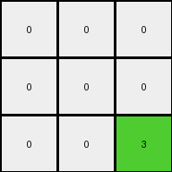
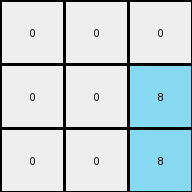

# 6ecd11f4 • 010 • refine_coder

---

Previous Code:
```python
"""
1.  **Identify the target region:** Locate the 3x3 multi-colored region at the bottom section of the input grid, ignoring all pixels above.
2.  **Extract the colors:** Extract each pixel's color from the target region.
3.  **Create the output grid and Arrange:** Construct a 3x3 output grid. Fill this grid with the corresponding pixel's color.
"""

import numpy as np

def find_multicolored_region(grid):
    # Find the 3x3 region with various colors in it at the bottom of the input
    rows, cols = grid.shape
    for r in range(rows - 2):
        for c in range(cols -2):
            subgrid = grid[r:r+3, c:c+3]
            if np.unique(subgrid).size > 1 and subgrid.min() != subgrid.max() :
                 return r,c
    return None
def transform(input_grid):
    """Transforms the input grid by extracting a 3x3 multicolored region."""
    # Convert input to numpy array
    input_grid = np.array(input_grid)

    # Find the multicolored 3x3 region
    start_row, start_col = find_multicolored_region(input_grid)

    # Extract the region
    output_grid = input_grid[start_row:start_row+3, start_col:start_col+3].copy()

    return output_grid.tolist()
```

Train Set Results:

## Example 1:

Input:
```
0 0 0 0 0 0 0 0 0 0 0 0 0 0 0 0 0 0 0 0 0
0 1 1 1 1 1 0 0 0 0 0 1 1 1 1 1 0 0 0 0 0
0 1 1 1 1 1 0 0 0 0 0 1 1 1 1 1 0 0 0 0 0
0 1 1 1 1 1 0 0 0 0 0 1 1 1 1 1 0 0 0 0 0
0 1 1 1 1 1 0 0 0 0 0 1 1 1 1 1 0 0 0 0 0
0 1 1 1 1 1 0 0 0 0 0 1 1 1 1 1 0 0 0 0 0
0 0 0 0 0 0 1 1 1 1 1 0 0 0 0 0 0 0 0 0 0
0 0 0 0 0 0 1 1 1 1 1 0 0 0 0 0 0 0 0 0 0
0 0 0 0 0 0 1 1 1 1 1 0 0 0 0 0 0 0 0 0 0
0 0 0 0 0 0 1 1 1 1 1 0 0 0 0 0 0 0 0 0 0
0 0 0 0 0 0 1 1 1 1 1 0 0 0 0 0 0 0 0 0 0
0 1 1 1 1 1 0 0 0 0 0 1 1 1 1 1 0 0 0 0 0
0 1 1 1 1 1 0 0 0 0 0 1 1 1 1 1 0 0 0 0 0
0 1 1 1 1 1 0 0 0 0 0 1 1 1 1 1 0 0 0 0 0
0 1 1 1 1 1 0 0 0 0 0 1 1 1 1 1 0 0 0 0 0
0 1 1 1 1 1 0 0 0 0 0 1 1 1 1 1 0 0 0 0 0
0 0 0 0 0 0 0 0 0 0 0 0 0 0 0 0 0 0 0 0 0
0 0 0 0 0 0 0 0 0 0 0 0 0 0 0 0 0 0 0 0 0
0 0 0 0 0 0 0 0 0 0 0 0 0 0 0 0 0 0 0 0 0
0 0 0 0 0 0 0 3 1 7 0 0 0 0 0 0 0 0 0 0 0
0 0 0 0 0 0 0 2 8 9 0 0 0 0 0 0 0 0 0 0 0
0 0 0 0 0 0 0 3 4 6 0 0 0 0 0 0 0 0 0 0 0
0 0 0 0 0 0 0 0 0 0 0 0 0 0 0 0 0 0 0 0 0
0 0 0 0 0 0 0 0 0 0 0 0 0 0 0 0 0 0 0 0 0
0 0 0 0 0 0 0 0 0 0 0 0 0 0 0 0 0 0 0 0 0
0 0 0 0 0 0 0 0 0 0 0 0 0 0 0 0 0 0 0 0 0
0 0 0 0 0 0 0 0 0 0 0 0 0 0 0 0 0 0 0 0 0
```
Expected Output:
```
3 0 7
0 8 0
3 0 6
```
Transformed Output:
```
0 0 0
0 1 1
0 1 1
```

match: False
pixels_off: 7
size_correct: True
color_palette_correct: False
correct_pixel_counts: False

## Example 2:

Input:
```
0 0 0 0 0 0 0 0 0 0 0 0 0 0 0 0 0 0 0 0 0 0 0 0 0
0 0 0 0 0 0 0 0 0 0 0 0 0 0 0 0 0 0 0 0 0 0 0 0 0
0 0 0 0 0 0 0 0 0 0 0 0 0 0 0 0 0 0 0 0 0 0 0 0 0
0 0 0 0 0 0 0 0 0 3 3 3 0 0 0 3 3 3 0 0 0 0 0 0 0
0 0 0 0 0 0 0 0 0 3 3 3 0 0 0 3 3 3 0 0 0 0 0 0 0
0 0 0 0 0 0 0 0 0 3 3 3 0 0 0 3 3 3 0 0 0 0 0 0 0
0 0 0 0 0 0 0 0 0 3 3 3 3 3 3 0 0 0 0 0 0 0 0 0 0
0 0 0 0 0 0 0 0 0 3 3 3 3 3 3 0 0 0 0 0 0 0 0 0 0
0 0 0 0 0 0 0 0 0 3 3 3 3 3 3 0 0 0 0 0 0 0 0 0 0
0 0 0 0 0 0 0 0 0 0 0 0 3 3 3 3 3 3 0 0 0 0 0 0 0
0 0 0 0 0 0 0 0 0 0 0 0 3 3 3 3 3 3 0 0 0 0 0 0 0
0 0 0 0 0 0 0 0 0 0 0 0 3 3 3 3 3 3 0 0 0 0 0 0 0
0 0 0 0 0 0 0 0 0 0 0 0 0 0 0 0 0 0 0 0 0 0 0 0 0
0 0 0 0 0 0 0 0 0 0 0 0 0 0 0 0 0 0 0 0 0 0 0 0 0
0 0 0 0 0 0 0 0 0 0 0 0 0 0 0 0 0 0 0 0 0 0 0 0 0
0 0 0 0 0 0 0 0 0 0 0 0 0 0 0 0 0 0 0 0 0 0 0 0 0
0 0 0 0 0 0 0 0 0 0 0 0 0 0 0 0 0 0 0 0 0 0 0 0 0
0 0 0 0 0 0 0 0 0 0 0 0 0 0 0 0 0 0 0 0 0 0 0 0 0
0 0 0 0 0 0 0 0 0 0 0 0 0 0 0 0 0 0 0 0 0 0 0 0 0
0 0 0 0 0 0 0 0 2 1 7 0 0 0 0 0 0 0 0 0 0 0 0 0 0
0 0 0 0 0 0 0 0 4 8 9 0 0 0 0 0 0 0 0 0 0 0 0 0 0
0 0 0 0 0 0 0 0 8 6 1 0 0 0 0 0 0 0 0 0 0 0 0 0 0
0 0 0 0 0 0 0 0 0 0 0 0 0 0 0 0 0 0 0 0 0 0 0 0 0
0 0 0 0 0 0 0 0 0 0 0 0 0 0 0 0 0 0 0 0 0 0 0 0 0
0 0 0 0 0 0 0 0 0 0 0 0 0 0 0 0 0 0 0 0 0 0 0 0 0
0 0 0 0 0 0 0 0 0 0 0 0 0 0 0 0 0 0 0 0 0 0 0 0 0
0 0 0 0 0 0 0 0 0 0 0 0 0 0 0 0 0 0 0 0 0 0 0 0 0
```
Expected Output:
```
2 0 7
4 8 0
0 6 1
```
Transformed Output:
```
0 0 0
0 0 0
0 0 3
```

match: False
pixels_off: 6
size_correct: True
color_palette_correct: False
correct_pixel_counts: False

## Example 3:

Input:
```
0 0 0 0 0 0 0 0 0 0 0 0 0 0 0 0 0 0 0 0 0 0
0 0 8 8 8 8 0 0 0 0 8 8 8 8 8 8 8 8 0 0 0 0
0 0 8 8 8 8 0 0 0 0 8 8 8 8 8 8 8 8 0 0 0 0
0 0 8 8 8 8 0 0 0 0 8 8 8 8 8 8 8 8 0 0 0 0
0 0 8 8 8 8 0 0 0 0 8 8 8 8 8 8 8 8 0 0 0 0
0 0 8 8 8 8 0 0 0 0 8 8 8 8 0 0 0 0 0 0 0 0
0 0 8 8 8 8 0 0 0 0 8 8 8 8 0 0 0 0 0 0 0 0
0 0 8 8 8 8 0 0 0 0 8 8 8 8 0 0 0 0 0 0 0 0
0 0 8 8 8 8 0 0 0 0 8 8 8 8 0 0 0 0 0 0 0 0
0 0 8 8 8 8 0 0 0 0 0 0 0 0 8 8 8 8 0 0 0 0
0 0 8 8 8 8 0 0 0 0 0 0 0 0 8 8 8 8 0 0 0 0
0 0 8 8 8 8 0 0 0 0 0 0 0 0 8 8 8 8 0 0 0 0
0 0 8 8 8 8 0 0 0 0 0 0 0 0 8 8 8 8 0 0 0 0
0 0 8 8 8 8 8 8 8 8 8 8 8 8 0 0 0 0 0 0 0 0
0 0 8 8 8 8 8 8 8 8 8 8 8 8 0 0 0 0 0 0 0 0
0 0 8 8 8 8 8 8 8 8 8 8 8 8 0 0 0 0 0 0 0 0
0 0 8 8 8 8 8 8 8 8 8 8 8 8 0 0 0 4 1 9 4 0
0 0 0 0 0 0 0 0 0 0 0 0 0 0 0 0 0 6 3 6 1 0
0 0 0 0 0 0 0 0 0 0 0 0 0 0 0 0 0 3 5 7 5 0
0 0 0 0 0 0 0 0 0 0 0 0 0 0 0 0 0 2 4 2 7 0
0 0 0 0 0 0 0 0 0 0 0 0 0 0 0 0 0 0 0 0 0 0
0 0 0 0 0 0 0 0 0 0 0 0 0 0 0 0 0 0 0 0 0 0
```
Expected Output:
```
4 0 9 4
6 0 6 0
3 0 0 5
2 4 2 0
```
Transformed Output:
```
0 0 0
0 0 8
0 0 8
```

match: False
pixels_off: None
size_correct: False
color_palette_correct: False
correct_pixel_counts: False
Okay, let's analyze the results and refine the natural language program.

**General Assessment:**

The initial strategy was too simplistic. It correctly identified the need for a 3x3 region, but it failed to:

1.  **Correctly locate the target region:** The code searches for *any* 3x3 region with more than one unique color. It does not correctly locate the region at the *bottom* of the input, and it's not consistent with the position. The example outputs show the multicolored grid is not always starting at the same row/col.

2.  **Accurately extract the multi-colored region**: It seems that there is an intention to copy that region, but is not working fully. The colors, and cells selection is wrong.

3. **The third example has different dimensions**. The output should be 4x4, not 3x3.

The core issue is the region selection logic in `find_multicolored_region`. It needs to be much more specific about *which* multi-colored region to select, and that selection criteria isn't simply "has more than one color." The placement at the "bottom" and the specific colors within are critical. The target region has zero's surrounding the object, and it is not a subgrid. The code is not considering the region's full area. It should select the grid around the object.

**Strategy for Resolving Errors:**

1.  **Improve Region Identification:** Instead of just looking for any multi-colored region, we need to identify the *specific* multi-colored region at the bottom. This likely involves:
    *   Scanning from the bottom up.
    *   Identifying a region of non-zero colors, potentially bordered by zeros.
    *   Considering the different size of the output in example 3.

2.  **Precise Extraction:** Once the correct region is found, the extraction should work as intended (copying the subgrid).

3. **Handle different grid dimensions**: The third example has an output grid of 4x4.

**Metrics and Observations (per example):**

*   **Example 1:**
    *   Input Size: 27x21
    *   Expected Output Size: 3x3
    *   Transformed Output Size: 3x3
    *   Pixels Off: 7
    *   Size Correct: True
    *   Color Palette Correct: False
    *    Notes: Identified a region in the upper-left part of the input, not at bottom.

*   **Example 2:**
    *   Input Size: 27x25
    *   Expected Output Size: 3x3
    *   Transformed Output Size: 3x3
    *   Pixels Off: 6
    *   Size Correct: True
    *   Color Palette Correct: False
    *    Notes: The region is in the bottom, but is not the correct location.

*   **Example 3:**
    *   Input Size: 22x21
    *   Expected Output Size: 4x4
    *   Transformed Output Size: 3x3
    *   Pixels Off: All
    *   Size Correct: False
    *   Color Palette Correct: False
    * Notes: The region size is different (4x4)

**YAML Facts:**

```yaml
observations:
  - object: multi-colored_region
    properties:
      - location: bottom_of_grid
      - shape: rectangle
      - colors: varied # More than one color, not all the same
      - border: surrounded_by_zeros # At least on the top
    actions:
      - type: extract
        description: Copy the entire region to the output.
  - task:
      dimensions:
        example_1:
          input: 27x21
          output: 3x3
        example_2:
          input: 27x25
          output: 3x3
        example_3:
          input: 22x21
          output: 4x4
```

**Natural Language Program:**

1.  **Locate Target Region:** Scan the input grid from the bottom up. Find a rectangular region of non-zero colored pixels. This region is likely bordered by zero-colored pixels, at least above it. The region can vary in size like 3x3 or 4x4.
2.  **Extract Region:** Once the region defined above is found. Copy all pixels values from the target region cells.
3.  **Create Output Grid:** Construct an output grid with the same shape and size as the target region.
4.  **Arrange:** Place the colors in order into the output grid.

The key improvement here is the more precise description of the target region's location and characteristics. It's not just *any* multi-colored region, but a specific one defined by its position and surrounding context. Also is important to handle the case where the target region is 4x4.

**INSTRUCTIONS**

- generate a Python module to represent the natural language program 
- follow the template below
- all common math and science libraries are available
- create docstring only at top - but comment the workflow in the function
- use helper functions for common operations like finding objects, counting,
  measuring, moving, etc. 

remember - we are working iteratively - so this code will inform your future
self as we converge on the solution

*template:*

```python
"""
{{ natural language description of the transformation rule }}
"""

{{ imports }}

def transform(input_grid):
    # initialize output_grid

    # change output pixels 

    return output_grid

```
