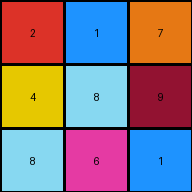

# 6ecd11f4 • 011 • refine_dreamer

---

Previous Code:
```python
"""
1.  **Locate Target Region:** Scan the input grid from the bottom up. Find a rectangular region of non-zero colored pixels. This region is likely bordered by zero-colored pixels, at least above it. The region can vary in size like 3x3 or 4x4.
2.  **Extract Region:** Once the region defined above is found. Copy all pixels values from the target region cells.
3.  **Create Output Grid:** Construct an output grid with the same shape and size as the target region.
4.  **Arrange:** Place the colors in order into the output grid.
"""

import numpy as np

def find_target_region(grid):
    """Finds the rectangular region of non-zero pixels at the bottom."""
    rows, cols = grid.shape
    bottom_row = rows - 1

    # Find the bottom-most non-zero row
    while bottom_row >= 0 and np.all(grid[bottom_row] == 0):
        bottom_row -= 1

    if bottom_row < 0:  # No non-zero pixels found
        return None, None, None, None

    # Find top of the region
    top_row = bottom_row
    while top_row >= 0 and np.any(grid[top_row] != 0):
        top_row -=1
    top_row += 1 #the previous iteration has all 0

    # Find leftmost and rightmost columns
    left_col = 0
    while left_col < cols and np.all(grid[top_row:bottom_row+1,left_col] == 0):
      left_col +=1
    right_col = cols -1
    while right_col > 0 and np.all(grid[top_row:bottom_row+1,right_col] == 0):
      right_col -= 1

    return top_row, bottom_row, left_col, right_col

def transform(input_grid):
    """Transforms the input grid by extracting a multi-colored region at the bottom."""
    # Convert input to numpy array
    input_grid = np.array(input_grid)

    # Find the target region
    top_row, bottom_row, left_col, right_col = find_target_region(input_grid)

    if top_row is None:  # Handle case where no region is found
        return []

    # Extract the region
    output_grid = input_grid[top_row:bottom_row+1, left_col:right_col+1].copy()

    return output_grid.tolist()
```

Train Set Results:

## Example 1:

Input:
```
0 0 0 0 0 0 0 0 0 0 0 0 0 0 0 0 0 0 0 0 0
0 1 1 1 1 1 0 0 0 0 0 1 1 1 1 1 0 0 0 0 0
0 1 1 1 1 1 0 0 0 0 0 1 1 1 1 1 0 0 0 0 0
0 1 1 1 1 1 0 0 0 0 0 1 1 1 1 1 0 0 0 0 0
0 1 1 1 1 1 0 0 0 0 0 1 1 1 1 1 0 0 0 0 0
0 1 1 1 1 1 0 0 0 0 0 1 1 1 1 1 0 0 0 0 0
0 0 0 0 0 0 1 1 1 1 1 0 0 0 0 0 0 0 0 0 0
0 0 0 0 0 0 1 1 1 1 1 0 0 0 0 0 0 0 0 0 0
0 0 0 0 0 0 1 1 1 1 1 0 0 0 0 0 0 0 0 0 0
0 0 0 0 0 0 1 1 1 1 1 0 0 0 0 0 0 0 0 0 0
0 0 0 0 0 0 1 1 1 1 1 0 0 0 0 0 0 0 0 0 0
0 1 1 1 1 1 0 0 0 0 0 1 1 1 1 1 0 0 0 0 0
0 1 1 1 1 1 0 0 0 0 0 1 1 1 1 1 0 0 0 0 0
0 1 1 1 1 1 0 0 0 0 0 1 1 1 1 1 0 0 0 0 0
0 1 1 1 1 1 0 0 0 0 0 1 1 1 1 1 0 0 0 0 0
0 1 1 1 1 1 0 0 0 0 0 1 1 1 1 1 0 0 0 0 0
0 0 0 0 0 0 0 0 0 0 0 0 0 0 0 0 0 0 0 0 0
0 0 0 0 0 0 0 0 0 0 0 0 0 0 0 0 0 0 0 0 0
0 0 0 0 0 0 0 0 0 0 0 0 0 0 0 0 0 0 0 0 0
0 0 0 0 0 0 0 3 1 7 0 0 0 0 0 0 0 0 0 0 0
0 0 0 0 0 0 0 2 8 9 0 0 0 0 0 0 0 0 0 0 0
0 0 0 0 0 0 0 3 4 6 0 0 0 0 0 0 0 0 0 0 0
0 0 0 0 0 0 0 0 0 0 0 0 0 0 0 0 0 0 0 0 0
0 0 0 0 0 0 0 0 0 0 0 0 0 0 0 0 0 0 0 0 0
0 0 0 0 0 0 0 0 0 0 0 0 0 0 0 0 0 0 0 0 0
0 0 0 0 0 0 0 0 0 0 0 0 0 0 0 0 0 0 0 0 0
0 0 0 0 0 0 0 0 0 0 0 0 0 0 0 0 0 0 0 0 0
```
Expected Output:
```
3 0 7
0 8 0
3 0 6
```
Transformed Output:
```
3 1 7
2 8 9
3 4 6
```

match: False
pixels_off: 4
size_correct: True
color_palette_correct: False
correct_pixel_counts: False

## Example 2:

Input:
```
0 0 0 0 0 0 0 0 0 0 0 0 0 0 0 0 0 0 0 0 0 0 0 0 0
0 0 0 0 0 0 0 0 0 0 0 0 0 0 0 0 0 0 0 0 0 0 0 0 0
0 0 0 0 0 0 0 0 0 0 0 0 0 0 0 0 0 0 0 0 0 0 0 0 0
0 0 0 0 0 0 0 0 0 3 3 3 0 0 0 3 3 3 0 0 0 0 0 0 0
0 0 0 0 0 0 0 0 0 3 3 3 0 0 0 3 3 3 0 0 0 0 0 0 0
0 0 0 0 0 0 0 0 0 3 3 3 0 0 0 3 3 3 0 0 0 0 0 0 0
0 0 0 0 0 0 0 0 0 3 3 3 3 3 3 0 0 0 0 0 0 0 0 0 0
0 0 0 0 0 0 0 0 0 3 3 3 3 3 3 0 0 0 0 0 0 0 0 0 0
0 0 0 0 0 0 0 0 0 3 3 3 3 3 3 0 0 0 0 0 0 0 0 0 0
0 0 0 0 0 0 0 0 0 0 0 0 3 3 3 3 3 3 0 0 0 0 0 0 0
0 0 0 0 0 0 0 0 0 0 0 0 3 3 3 3 3 3 0 0 0 0 0 0 0
0 0 0 0 0 0 0 0 0 0 0 0 3 3 3 3 3 3 0 0 0 0 0 0 0
0 0 0 0 0 0 0 0 0 0 0 0 0 0 0 0 0 0 0 0 0 0 0 0 0
0 0 0 0 0 0 0 0 0 0 0 0 0 0 0 0 0 0 0 0 0 0 0 0 0
0 0 0 0 0 0 0 0 0 0 0 0 0 0 0 0 0 0 0 0 0 0 0 0 0
0 0 0 0 0 0 0 0 0 0 0 0 0 0 0 0 0 0 0 0 0 0 0 0 0
0 0 0 0 0 0 0 0 0 0 0 0 0 0 0 0 0 0 0 0 0 0 0 0 0
0 0 0 0 0 0 0 0 0 0 0 0 0 0 0 0 0 0 0 0 0 0 0 0 0
0 0 0 0 0 0 0 0 0 0 0 0 0 0 0 0 0 0 0 0 0 0 0 0 0
0 0 0 0 0 0 0 0 2 1 7 0 0 0 0 0 0 0 0 0 0 0 0 0 0
0 0 0 0 0 0 0 0 4 8 9 0 0 0 0 0 0 0 0 0 0 0 0 0 0
0 0 0 0 0 0 0 0 8 6 1 0 0 0 0 0 0 0 0 0 0 0 0 0 0
0 0 0 0 0 0 0 0 0 0 0 0 0 0 0 0 0 0 0 0 0 0 0 0 0
0 0 0 0 0 0 0 0 0 0 0 0 0 0 0 0 0 0 0 0 0 0 0 0 0
0 0 0 0 0 0 0 0 0 0 0 0 0 0 0 0 0 0 0 0 0 0 0 0 0
0 0 0 0 0 0 0 0 0 0 0 0 0 0 0 0 0 0 0 0 0 0 0 0 0
0 0 0 0 0 0 0 0 0 0 0 0 0 0 0 0 0 0 0 0 0 0 0 0 0
```
Expected Output:
```
2 0 7
4 8 0
0 6 1
```
Transformed Output:
```
2 1 7
4 8 9
8 6 1
```

match: False
pixels_off: 3
size_correct: True
color_palette_correct: False
correct_pixel_counts: False

## Example 3:

Input:
```
0 0 0 0 0 0 0 0 0 0 0 0 0 0 0 0 0 0 0 0 0 0
0 0 8 8 8 8 0 0 0 0 8 8 8 8 8 8 8 8 0 0 0 0
0 0 8 8 8 8 0 0 0 0 8 8 8 8 8 8 8 8 0 0 0 0
0 0 8 8 8 8 0 0 0 0 8 8 8 8 8 8 8 8 0 0 0 0
0 0 8 8 8 8 0 0 0 0 8 8 8 8 8 8 8 8 0 0 0 0
0 0 8 8 8 8 0 0 0 0 8 8 8 8 0 0 0 0 0 0 0 0
0 0 8 8 8 8 0 0 0 0 8 8 8 8 0 0 0 0 0 0 0 0
0 0 8 8 8 8 0 0 0 0 8 8 8 8 0 0 0 0 0 0 0 0
0 0 8 8 8 8 0 0 0 0 8 8 8 8 0 0 0 0 0 0 0 0
0 0 8 8 8 8 0 0 0 0 0 0 0 0 8 8 8 8 0 0 0 0
0 0 8 8 8 8 0 0 0 0 0 0 0 0 8 8 8 8 0 0 0 0
0 0 8 8 8 8 0 0 0 0 0 0 0 0 8 8 8 8 0 0 0 0
0 0 8 8 8 8 0 0 0 0 0 0 0 0 8 8 8 8 0 0 0 0
0 0 8 8 8 8 8 8 8 8 8 8 8 8 0 0 0 0 0 0 0 0
0 0 8 8 8 8 8 8 8 8 8 8 8 8 0 0 0 0 0 0 0 0
0 0 8 8 8 8 8 8 8 8 8 8 8 8 0 0 0 0 0 0 0 0
0 0 8 8 8 8 8 8 8 8 8 8 8 8 0 0 0 4 1 9 4 0
0 0 0 0 0 0 0 0 0 0 0 0 0 0 0 0 0 6 3 6 1 0
0 0 0 0 0 0 0 0 0 0 0 0 0 0 0 0 0 3 5 7 5 0
0 0 0 0 0 0 0 0 0 0 0 0 0 0 0 0 0 2 4 2 7 0
0 0 0 0 0 0 0 0 0 0 0 0 0 0 0 0 0 0 0 0 0 0
0 0 0 0 0 0 0 0 0 0 0 0 0 0 0 0 0 0 0 0 0 0
```
Expected Output:
```
4 0 9 4
6 0 6 0
3 0 0 5
2 4 2 0
```
Transformed Output:
```
8 8 8 8 0 0 0 0 8 8 8 8 8 8 8 8 0 0 0
8 8 8 8 0 0 0 0 8 8 8 8 8 8 8 8 0 0 0
8 8 8 8 0 0 0 0 8 8 8 8 8 8 8 8 0 0 0
8 8 8 8 0 0 0 0 8 8 8 8 8 8 8 8 0 0 0
8 8 8 8 0 0 0 0 8 8 8 8 0 0 0 0 0 0 0
8 8 8 8 0 0 0 0 8 8 8 8 0 0 0 0 0 0 0
8 8 8 8 0 0 0 0 8 8 8 8 0 0 0 0 0 0 0
8 8 8 8 0 0 0 0 8 8 8 8 0 0 0 0 0 0 0
8 8 8 8 0 0 0 0 0 0 0 0 8 8 8 8 0 0 0
8 8 8 8 0 0 0 0 0 0 0 0 8 8 8 8 0 0 0
8 8 8 8 0 0 0 0 0 0 0 0 8 8 8 8 0 0 0
8 8 8 8 0 0 0 0 0 0 0 0 8 8 8 8 0 0 0
8 8 8 8 8 8 8 8 8 8 8 8 0 0 0 0 0 0 0
8 8 8 8 8 8 8 8 8 8 8 8 0 0 0 0 0 0 0
8 8 8 8 8 8 8 8 8 8 8 8 0 0 0 0 0 0 0
8 8 8 8 8 8 8 8 8 8 8 8 0 0 0 4 1 9 4
0 0 0 0 0 0 0 0 0 0 0 0 0 0 0 6 3 6 1
0 0 0 0 0 0 0 0 0 0 0 0 0 0 0 3 5 7 5
0 0 0 0 0 0 0 0 0 0 0 0 0 0 0 2 4 2 7
```

match: False
pixels_off: None
size_correct: False
color_palette_correct: False
correct_pixel_counts: False
**INSTRUCTIONS**

The code above was generated based on observations from the first training
example

we have tested the transform function on each of the task example inputs and
compared with the expected output

review each of the examples provided and the results and consider how the
natural language program should be updated to accommodate this new knowledge

respond with the following deliverables:

- general assessment of the information provided and strategy for resolving the
  errors
- gather metrics about each of the examples and results - use code_execution to
  develop accurate reports on your assumptions
- a YAML block documenting facts - Focus on identifying objects, their properties, and the actions performed on them.
- a natural language program - Be as clear and concise as possible, providing a complete description of the transformation rule.


your responses should be considered as information in a report - not a
conversation
