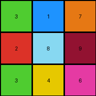
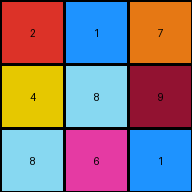
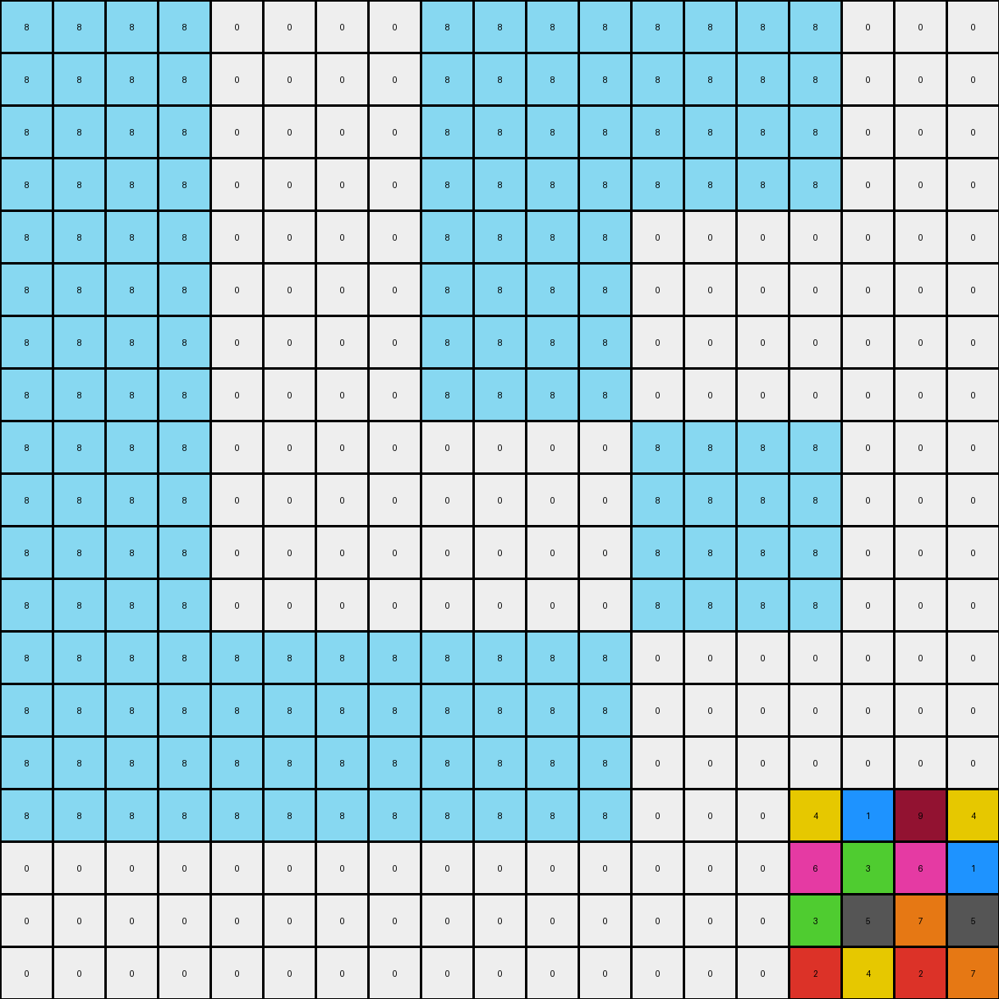

# 6ecd11f4 • 012 • refine_coder

---

Previous Code:
```python
"""
1.  **Locate Target Region:** Scan the input grid from the bottom up. Find a rectangular region of non-zero colored pixels. This region is likely bordered by zero-colored pixels, at least above it. The region can vary in size like 3x3 or 4x4.
2.  **Extract Region:** Once the region defined above is found. Copy all pixels values from the target region cells.
3.  **Create Output Grid:** Construct an output grid with the same shape and size as the target region.
4.  **Arrange:** Place the colors in order into the output grid.
"""

import numpy as np

def find_target_region(grid):
    """Finds the rectangular region of non-zero pixels at the bottom."""
    rows, cols = grid.shape
    bottom_row = rows - 1

    # Find the bottom-most non-zero row
    while bottom_row >= 0 and np.all(grid[bottom_row] == 0):
        bottom_row -= 1

    if bottom_row < 0:  # No non-zero pixels found
        return None, None, None, None

    # Find top of the region
    top_row = bottom_row
    while top_row >= 0 and np.any(grid[top_row] != 0):
        top_row -=1
    top_row += 1 #the previous iteration has all 0

    # Find leftmost and rightmost columns
    left_col = 0
    while left_col < cols and np.all(grid[top_row:bottom_row+1,left_col] == 0):
      left_col +=1
    right_col = cols -1
    while right_col > 0 and np.all(grid[top_row:bottom_row+1,right_col] == 0):
      right_col -= 1

    return top_row, bottom_row, left_col, right_col

def transform(input_grid):
    """Transforms the input grid by extracting a multi-colored region at the bottom."""
    # Convert input to numpy array
    input_grid = np.array(input_grid)

    # Find the target region
    top_row, bottom_row, left_col, right_col = find_target_region(input_grid)

    if top_row is None:  # Handle case where no region is found
        return []

    # Extract the region
    output_grid = input_grid[top_row:bottom_row+1, left_col:right_col+1].copy()

    return output_grid.tolist()
```

Train Set Results:

## Example 1:

Input:
```
0 0 0 0 0 0 0 0 0 0 0 0 0 0 0 0 0 0 0 0 0
0 1 1 1 1 1 0 0 0 0 0 1 1 1 1 1 0 0 0 0 0
0 1 1 1 1 1 0 0 0 0 0 1 1 1 1 1 0 0 0 0 0
0 1 1 1 1 1 0 0 0 0 0 1 1 1 1 1 0 0 0 0 0
0 1 1 1 1 1 0 0 0 0 0 1 1 1 1 1 0 0 0 0 0
0 1 1 1 1 1 0 0 0 0 0 1 1 1 1 1 0 0 0 0 0
0 0 0 0 0 0 1 1 1 1 1 0 0 0 0 0 0 0 0 0 0
0 0 0 0 0 0 1 1 1 1 1 0 0 0 0 0 0 0 0 0 0
0 0 0 0 0 0 1 1 1 1 1 0 0 0 0 0 0 0 0 0 0
0 0 0 0 0 0 1 1 1 1 1 0 0 0 0 0 0 0 0 0 0
0 0 0 0 0 0 1 1 1 1 1 0 0 0 0 0 0 0 0 0 0
0 1 1 1 1 1 0 0 0 0 0 1 1 1 1 1 0 0 0 0 0
0 1 1 1 1 1 0 0 0 0 0 1 1 1 1 1 0 0 0 0 0
0 1 1 1 1 1 0 0 0 0 0 1 1 1 1 1 0 0 0 0 0
0 1 1 1 1 1 0 0 0 0 0 1 1 1 1 1 0 0 0 0 0
0 1 1 1 1 1 0 0 0 0 0 1 1 1 1 1 0 0 0 0 0
0 0 0 0 0 0 0 0 0 0 0 0 0 0 0 0 0 0 0 0 0
0 0 0 0 0 0 0 0 0 0 0 0 0 0 0 0 0 0 0 0 0
0 0 0 0 0 0 0 0 0 0 0 0 0 0 0 0 0 0 0 0 0
0 0 0 0 0 0 0 3 1 7 0 0 0 0 0 0 0 0 0 0 0
0 0 0 0 0 0 0 2 8 9 0 0 0 0 0 0 0 0 0 0 0
0 0 0 0 0 0 0 3 4 6 0 0 0 0 0 0 0 0 0 0 0
0 0 0 0 0 0 0 0 0 0 0 0 0 0 0 0 0 0 0 0 0
0 0 0 0 0 0 0 0 0 0 0 0 0 0 0 0 0 0 0 0 0
0 0 0 0 0 0 0 0 0 0 0 0 0 0 0 0 0 0 0 0 0
0 0 0 0 0 0 0 0 0 0 0 0 0 0 0 0 0 0 0 0 0
0 0 0 0 0 0 0 0 0 0 0 0 0 0 0 0 0 0 0 0 0
```
Expected Output:
```
3 0 7
0 8 0
3 0 6
```
Transformed Output:
```
3 1 7
2 8 9
3 4 6
```

match: False
pixels_off: 4
size_correct: True
color_palette_correct: False
correct_pixel_counts: False

## Example 2:

Input:
```
0 0 0 0 0 0 0 0 0 0 0 0 0 0 0 0 0 0 0 0 0 0 0 0 0
0 0 0 0 0 0 0 0 0 0 0 0 0 0 0 0 0 0 0 0 0 0 0 0 0
0 0 0 0 0 0 0 0 0 0 0 0 0 0 0 0 0 0 0 0 0 0 0 0 0
0 0 0 0 0 0 0 0 0 3 3 3 0 0 0 3 3 3 0 0 0 0 0 0 0
0 0 0 0 0 0 0 0 0 3 3 3 0 0 0 3 3 3 0 0 0 0 0 0 0
0 0 0 0 0 0 0 0 0 3 3 3 0 0 0 3 3 3 0 0 0 0 0 0 0
0 0 0 0 0 0 0 0 0 3 3 3 3 3 3 0 0 0 0 0 0 0 0 0 0
0 0 0 0 0 0 0 0 0 3 3 3 3 3 3 0 0 0 0 0 0 0 0 0 0
0 0 0 0 0 0 0 0 0 3 3 3 3 3 3 0 0 0 0 0 0 0 0 0 0
0 0 0 0 0 0 0 0 0 0 0 0 3 3 3 3 3 3 0 0 0 0 0 0 0
0 0 0 0 0 0 0 0 0 0 0 0 3 3 3 3 3 3 0 0 0 0 0 0 0
0 0 0 0 0 0 0 0 0 0 0 0 3 3 3 3 3 3 0 0 0 0 0 0 0
0 0 0 0 0 0 0 0 0 0 0 0 0 0 0 0 0 0 0 0 0 0 0 0 0
0 0 0 0 0 0 0 0 0 0 0 0 0 0 0 0 0 0 0 0 0 0 0 0 0
0 0 0 0 0 0 0 0 0 0 0 0 0 0 0 0 0 0 0 0 0 0 0 0 0
0 0 0 0 0 0 0 0 0 0 0 0 0 0 0 0 0 0 0 0 0 0 0 0 0
0 0 0 0 0 0 0 0 0 0 0 0 0 0 0 0 0 0 0 0 0 0 0 0 0
0 0 0 0 0 0 0 0 0 0 0 0 0 0 0 0 0 0 0 0 0 0 0 0 0
0 0 0 0 0 0 0 0 0 0 0 0 0 0 0 0 0 0 0 0 0 0 0 0 0
0 0 0 0 0 0 0 0 2 1 7 0 0 0 0 0 0 0 0 0 0 0 0 0 0
0 0 0 0 0 0 0 0 4 8 9 0 0 0 0 0 0 0 0 0 0 0 0 0 0
0 0 0 0 0 0 0 0 8 6 1 0 0 0 0 0 0 0 0 0 0 0 0 0 0
0 0 0 0 0 0 0 0 0 0 0 0 0 0 0 0 0 0 0 0 0 0 0 0 0
0 0 0 0 0 0 0 0 0 0 0 0 0 0 0 0 0 0 0 0 0 0 0 0 0
0 0 0 0 0 0 0 0 0 0 0 0 0 0 0 0 0 0 0 0 0 0 0 0 0
0 0 0 0 0 0 0 0 0 0 0 0 0 0 0 0 0 0 0 0 0 0 0 0 0
0 0 0 0 0 0 0 0 0 0 0 0 0 0 0 0 0 0 0 0 0 0 0 0 0
```
Expected Output:
```
2 0 7
4 8 0
0 6 1
```
Transformed Output:
```
2 1 7
4 8 9
8 6 1
```

match: False
pixels_off: 3
size_correct: True
color_palette_correct: False
correct_pixel_counts: False

## Example 3:

Input:
```
0 0 0 0 0 0 0 0 0 0 0 0 0 0 0 0 0 0 0 0 0 0
0 0 8 8 8 8 0 0 0 0 8 8 8 8 8 8 8 8 0 0 0 0
0 0 8 8 8 8 0 0 0 0 8 8 8 8 8 8 8 8 0 0 0 0
0 0 8 8 8 8 0 0 0 0 8 8 8 8 8 8 8 8 0 0 0 0
0 0 8 8 8 8 0 0 0 0 8 8 8 8 8 8 8 8 0 0 0 0
0 0 8 8 8 8 0 0 0 0 8 8 8 8 0 0 0 0 0 0 0 0
0 0 8 8 8 8 0 0 0 0 8 8 8 8 0 0 0 0 0 0 0 0
0 0 8 8 8 8 0 0 0 0 8 8 8 8 0 0 0 0 0 0 0 0
0 0 8 8 8 8 0 0 0 0 8 8 8 8 0 0 0 0 0 0 0 0
0 0 8 8 8 8 0 0 0 0 0 0 0 0 8 8 8 8 0 0 0 0
0 0 8 8 8 8 0 0 0 0 0 0 0 0 8 8 8 8 0 0 0 0
0 0 8 8 8 8 0 0 0 0 0 0 0 0 8 8 8 8 0 0 0 0
0 0 8 8 8 8 0 0 0 0 0 0 0 0 8 8 8 8 0 0 0 0
0 0 8 8 8 8 8 8 8 8 8 8 8 8 0 0 0 0 0 0 0 0
0 0 8 8 8 8 8 8 8 8 8 8 8 8 0 0 0 0 0 0 0 0
0 0 8 8 8 8 8 8 8 8 8 8 8 8 0 0 0 0 0 0 0 0
0 0 8 8 8 8 8 8 8 8 8 8 8 8 0 0 0 4 1 9 4 0
0 0 0 0 0 0 0 0 0 0 0 0 0 0 0 0 0 6 3 6 1 0
0 0 0 0 0 0 0 0 0 0 0 0 0 0 0 0 0 3 5 7 5 0
0 0 0 0 0 0 0 0 0 0 0 0 0 0 0 0 0 2 4 2 7 0
0 0 0 0 0 0 0 0 0 0 0 0 0 0 0 0 0 0 0 0 0 0
0 0 0 0 0 0 0 0 0 0 0 0 0 0 0 0 0 0 0 0 0 0
```
Expected Output:
```
4 0 9 4
6 0 6 0
3 0 0 5
2 4 2 0
```
Transformed Output:
```
8 8 8 8 0 0 0 0 8 8 8 8 8 8 8 8 0 0 0
8 8 8 8 0 0 0 0 8 8 8 8 8 8 8 8 0 0 0
8 8 8 8 0 0 0 0 8 8 8 8 8 8 8 8 0 0 0
8 8 8 8 0 0 0 0 8 8 8 8 8 8 8 8 0 0 0
8 8 8 8 0 0 0 0 8 8 8 8 0 0 0 0 0 0 0
8 8 8 8 0 0 0 0 8 8 8 8 0 0 0 0 0 0 0
8 8 8 8 0 0 0 0 8 8 8 8 0 0 0 0 0 0 0
8 8 8 8 0 0 0 0 8 8 8 8 0 0 0 0 0 0 0
8 8 8 8 0 0 0 0 0 0 0 0 8 8 8 8 0 0 0
8 8 8 8 0 0 0 0 0 0 0 0 8 8 8 8 0 0 0
8 8 8 8 0 0 0 0 0 0 0 0 8 8 8 8 0 0 0
8 8 8 8 0 0 0 0 0 0 0 0 8 8 8 8 0 0 0
8 8 8 8 8 8 8 8 8 8 8 8 0 0 0 0 0 0 0
8 8 8 8 8 8 8 8 8 8 8 8 0 0 0 0 0 0 0
8 8 8 8 8 8 8 8 8 8 8 8 0 0 0 0 0 0 0
8 8 8 8 8 8 8 8 8 8 8 8 0 0 0 4 1 9 4
0 0 0 0 0 0 0 0 0 0 0 0 0 0 0 6 3 6 1
0 0 0 0 0 0 0 0 0 0 0 0 0 0 0 3 5 7 5
0 0 0 0 0 0 0 0 0 0 0 0 0 0 0 2 4 2 7
```

match: False
pixels_off: None
size_correct: False
color_palette_correct: False
correct_pixel_counts: False
Okay, let's analyze the results and refine the natural language program and approach.

**General Assessment:**

The initial approach of finding a rectangular region at the bottom and extracting it *almost* works for the first two examples, getting the size correct but failing to match all the correct colors and positions. However, Example 3 dramatically fails, highlighting a fundamental flaw: the code isn't just extracting the colored region, it's also including large areas of background (black/0) pixels above and to the left and right. The initial strategy is on the right track in terms of *identifying* the target region, but the handling of 0 (black/background color) is incorrect. Also, the position of non-zero colored pixels in the selected block is not considered.

**Strategy for Resolving Errors:**

1.  **Refine Region Selection:** The current `find_target_region` function incorrectly includes large areas of the background. It needs to more tightly bound the non-zero colored pixels. Instead of just finding any non-zero pixel in a row, it should find contiguous blocks of non-zero pixels.
2. **Correct Color Replacement**: The position/index of each color except 0 must be considered.
3. **Revisit Example 3**: Example 3 includes the same problem and the output height is less than the input height.

**Metrics and Observations (using the provided outputs):**

*   **Example 1:**
    *   `pixels_off`: 4 (Indicates 4 pixels differ between expected and transformed output)
    *   `size_correct`: True (Output grid has the same dimensions as the expected output)
    *   `color_palette_correct`: False.
    *  `correct_pixel_counts`: False
*   **Example 2:**
    *   `pixels_off`: 3
    *   `size_correct`: True
    *   `color_palette_correct`: False
    *    `correct_pixel_counts`: False

*   **Example 3:**
    *   `pixels_off`: None
    *   `size_correct`: False
    *   `color_palette_correct`: False
    *   `correct_pixel_counts`: False

**YAML Fact Block:**

```yaml
observations:
  - example: 1
    objects:
      - id: region_1
        type: rectangle
        colors: [3, 1, 7, 2, 8, 9, 3, 4, 6] # Colors present in the bottom region
        property: contiguous
        rows: 3
        cols: 3
        top_left: [19,7]
        bottom_right: [21,9]

    actions:
      - type: extract
        target: region_1
        description: The rectangular block of non-zero pixels is extracted.

  - example: 2
    objects:
      - id: region_1
        type: rectangle
        colors:  [2, 1, 7, 4, 8, 9, 8, 6, 1]
        property: contiguous
        rows: 3
        cols: 3
        top_left: [19,8]
        bottom_right: [21,10]
    actions:
      - type: extract
        target: region_1
        description: The rectangular region of non-zero pixels is extracted.

  - example: 3
    objects:
      - id: region_1
        type: rectangle
        colors: [4, 1, 9, 4, 6, 3, 6, 1, 3, 5, 7, 5, 2, 4, 2, 7]
        property: contiguous
        rows: 4
        cols: 4
        top_left: [16,17]
        bottom_right: [19,20]

    actions:
      - type: extract
        target: region_1
        description: A rectangular region of non zero pixels is extracted
```

**Natural Language Program:**

1.  **Locate Target Region:** Scan the input grid to identify the smallest rectangular region containing *all* non-zero (non-black) colored pixels. This region is defined by the minimum and maximum row and column indices that contain any non-zero pixel.

2.  **Extract Region:** Copy the pixel values within the identified rectangular region.

3.  **Create Output Grid:** Create an output grid with the exact dimensions (height and width) of the extracted region.

4. **Arrange:** Maintain the position of non-zero pixels from the input and set all other values to zero.

5.  **Output:** Return the extracted output grid.

**INSTRUCTIONS**

- generate a Python module to represent the natural language program 
- follow the template below
- all common math and science libraries are available
- create docstring only at top - but comment the workflow in the function
- use helper functions for common operations like finding objects, counting,
  measuring, moving, etc. 

remember - we are working iteratively - so this code will inform your future
self as we converge on the solution

*template:*

```python
"""
{{ natural language description of the transformation rule }}
"""

{{ imports }}

def transform(input_grid):
    # initialize output_grid

    # change output pixels 

    return output_grid

```
