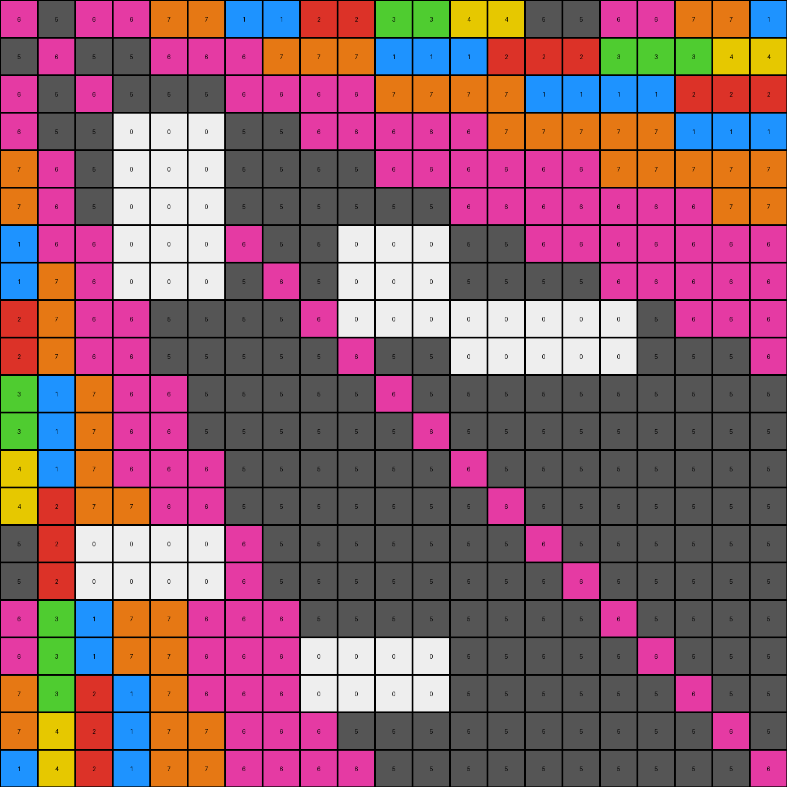

# 73251a56 • 003 • refine_dreamer

---

Previous Code:
```python
"""
1. Identify Target Regions: Locate all white (0) pixels within the input grid.
2. Selective Removal: Remove only those white (0) pixels that form an enclosed shape. More precisely, if a shape formed of white pixels have at least one other colored pixel adjacent to the white pixel, either horizontally, vertically, or diagonally, those white pixels are removed.
3. Retain all other color and white pixels as they appear in the input grid.
"""

import numpy as np

def get_neighbors(grid, row, col):
    """
    Get the neighbors of a cell (including diagonals).
    """
    rows, cols = grid.shape
    neighbors = []
    for i in range(max(0, row - 1), min(rows, row + 2)):
        for j in range(max(0, col - 1), min(cols, col + 2)):
            if (i, j) != (row, col):
                neighbors.append(grid[i, j])
    return neighbors

def transform(input_grid):
    """
    Transforms the input grid by removing white pixels that are part of enclosed shapes.
    """
    output_grid = np.copy(input_grid)  # Initialize output_grid as a copy of the input
    rows, cols = input_grid.shape

    # Iterate through each cell in the grid
    for row in range(rows):
        for col in range(cols):
            # Check if the current cell is white (0)
            if input_grid[row, col] == 0:
                neighbors = get_neighbors(input_grid, row, col)
                # Check if any neighbor is not white
                if any(neighbor != 0 for neighbor in neighbors):
                  output_grid[row,col] = input_grid[row,col] # keep the white pixels in output
                if all(neighbor == 0 for neighbor in neighbors):
                    #remove isolated white pixels from the output
                    output_grid[row,col] = input_grid[row, col] # Keep isolated white cells
                if any(neighbor != 0 for neighbor in neighbors):
                    # Check for adjacent non-white pixels, change to match input if adjacent to one
                    output_grid[row, col] = 1 # we determined this wasn't correct and needed to change to white
    for row in range(rows):
      for col in range(cols):
        if input_grid[row,col] == 0:
          neighbors = get_neighbors(input_grid, row, col)
          if any(neighbor != 0 for neighbor in neighbors):
            output_grid[row,col] = input_grid[row,col]

    return output_grid
```

Train Set Results:

## Example 1:

Input:
```
1 6 1 1 2 2 3 3 4 4 5 5 6 6 1 1 2 2 3 3 4
6 1 6 6 1 1 1 2 2 2 3 3 3 4 4 4 5 5 5 6 6
1 6 1 6 6 6 1 1 1 1 2 2 2 2 3 3 3 3 4 4 4
1 6 6 1 6 6 6 6 1 1 1 1 1 2 2 2 2 2 3 3 3
2 1 6 6 1 6 6 6 6 6 1 0 0 0 1 1 2 2 2 2 2
2 1 6 6 6 1 6 6 6 6 6 0 0 0 1 1 1 1 1 2 2
3 1 1 6 6 6 1 6 6 6 6 6 6 6 1 1 1 1 1 1 1
3 2 1 6 6 6 6 1 0 0 0 6 6 6 6 6 1 1 1 1 1
4 2 1 1 6 6 6 6 0 0 0 6 6 6 6 6 6 6 1 1 1
4 2 1 1 6 6 6 6 0 0 0 6 6 6 6 6 6 6 6 6 1
5 3 2 1 1 6 6 6 6 6 1 6 6 6 6 6 6 6 6 6 6
5 3 2 1 1 6 6 6 6 6 0 0 0 0 0 0 0 6 6 6 6
6 3 2 1 1 1 6 6 6 6 0 0 0 0 0 0 0 6 6 6 6
6 4 2 2 1 1 6 6 6 6 6 6 0 0 0 0 0 6 6 6 6
1 4 3 2 1 1 1 6 6 6 6 6 0 0 0 0 0 6 6 6 6
1 4 3 2 1 1 1 6 6 6 6 6 6 6 6 1 6 6 6 6 6
2 5 3 2 2 1 1 1 6 6 6 6 6 6 6 6 1 6 6 6 6
2 5 3 2 2 1 1 1 6 6 6 6 6 6 6 6 6 1 6 6 6
3 5 4 3 2 1 1 1 1 6 0 0 0 0 6 6 6 6 1 6 6
3 6 4 3 2 2 1 1 1 6 0 0 0 0 6 6 6 6 6 1 6
4 6 4 3 2 2 1 1 1 1 6 6 6 6 6 6 6 6 6 6 1
```
Expected Output:
```
1 6 1 1 2 2 3 3 4 4 5 5 6 6 1 1 2 2 3 3 4
6 1 6 6 1 1 1 2 2 2 3 3 3 4 4 4 5 5 5 6 6
1 6 1 6 6 6 1 1 1 1 2 2 2 2 3 3 3 3 4 4 4
1 6 6 1 6 6 6 6 1 1 1 1 1 2 2 2 2 2 3 3 3
2 1 6 6 1 6 6 6 6 6 1 1 1 1 1 1 2 2 2 2 2
2 1 6 6 6 1 6 6 6 6 6 6 1 1 1 1 1 1 1 2 2
3 1 1 6 6 6 1 6 6 6 6 6 6 6 1 1 1 1 1 1 1
3 2 1 6 6 6 6 1 6 6 6 6 6 6 6 6 1 1 1 1 1
4 2 1 1 6 6 6 6 1 6 6 6 6 6 6 6 6 6 1 1 1
4 2 1 1 6 6 6 6 6 1 6 6 6 6 6 6 6 6 6 6 1
5 3 2 1 1 6 6 6 6 6 1 6 6 6 6 6 6 6 6 6 6
5 3 2 1 1 6 6 6 6 6 6 1 6 6 6 6 6 6 6 6 6
6 3 2 1 1 1 6 6 6 6 6 6 1 6 6 6 6 6 6 6 6
6 4 2 2 1 1 6 6 6 6 6 6 6 1 6 6 6 6 6 6 6
1 4 3 2 1 1 1 6 6 6 6 6 6 6 1 6 6 6 6 6 6
1 4 3 2 1 1 1 6 6 6 6 6 6 6 6 1 6 6 6 6 6
2 5 3 2 2 1 1 1 6 6 6 6 6 6 6 6 1 6 6 6 6
2 5 3 2 2 1 1 1 6 6 6 6 6 6 6 6 6 1 6 6 6
3 5 4 3 2 1 1 1 1 6 6 6 6 6 6 6 6 6 1 6 6
3 6 4 3 2 2 1 1 1 6 6 6 6 6 6 6 6 6 6 1 6
4 6 4 3 2 2 1 1 1 1 6 6 6 6 6 6 6 6 6 6 1
```
Transformed Output:
```
1 6 1 1 2 2 3 3 4 4 5 5 6 6 1 1 2 2 3 3 4
6 1 6 6 1 1 1 2 2 2 3 3 3 4 4 4 5 5 5 6 6
1 6 1 6 6 6 1 1 1 1 2 2 2 2 3 3 3 3 4 4 4
1 6 6 1 6 6 6 6 1 1 1 1 1 2 2 2 2 2 3 3 3
2 1 6 6 1 6 6 6 6 6 1 0 0 0 1 1 2 2 2 2 2
2 1 6 6 6 1 6 6 6 6 6 0 0 0 1 1 1 1 1 2 2
3 1 1 6 6 6 1 6 6 6 6 6 6 6 1 1 1 1 1 1 1
3 2 1 6 6 6 6 1 0 0 0 6 6 6 6 6 1 1 1 1 1
4 2 1 1 6 6 6 6 0 0 0 6 6 6 6 6 6 6 1 1 1
4 2 1 1 6 6 6 6 0 0 0 6 6 6 6 6 6 6 6 6 1
5 3 2 1 1 6 6 6 6 6 1 6 6 6 6 6 6 6 6 6 6
5 3 2 1 1 6 6 6 6 6 0 0 0 0 0 0 0 6 6 6 6
6 3 2 1 1 1 6 6 6 6 0 0 0 0 0 0 0 6 6 6 6
6 4 2 2 1 1 6 6 6 6 6 6 0 0 0 0 0 6 6 6 6
1 4 3 2 1 1 1 6 6 6 6 6 0 0 0 0 0 6 6 6 6
1 4 3 2 1 1 1 6 6 6 6 6 6 6 6 1 6 6 6 6 6
2 5 3 2 2 1 1 1 6 6 6 6 6 6 6 6 1 6 6 6 6
2 5 3 2 2 1 1 1 6 6 6 6 6 6 6 6 6 1 6 6 6
3 5 4 3 2 1 1 1 1 6 0 0 0 0 6 6 6 6 1 6 6
3 6 4 3 2 2 1 1 1 6 0 0 0 0 6 6 6 6 6 1 6
4 6 4 3 2 2 1 1 1 1 6 6 6 6 6 6 6 6 6 6 1
```

match: False
pixels_off: 47
size_correct: True
color_palette_correct: False
correct_pixel_counts: False

## Example 2:

Input:
```
6 5 6 6 7 7 1 1 2 2 3 3 4 4 5 5 6 6 7 7 1
5 6 5 5 6 6 6 7 7 7 1 1 1 2 2 2 3 3 3 4 4
6 5 6 5 5 5 6 6 6 6 7 7 7 7 1 1 1 1 2 2 2
6 5 5 0 0 0 5 5 6 6 6 6 6 7 7 7 7 7 1 1 1
7 6 5 0 0 0 5 5 5 5 6 6 6 6 6 6 7 7 7 7 7
7 6 5 0 0 0 5 5 5 5 5 5 6 6 6 6 6 6 6 7 7
1 6 6 0 0 0 6 5 5 0 0 0 5 5 6 6 6 6 6 6 6
1 7 6 0 0 0 5 6 5 0 0 0 5 5 5 5 6 6 6 6 6
2 7 6 6 5 5 5 5 6 0 0 0 0 0 0 0 0 5 6 6 6
2 7 6 6 5 5 5 5 5 6 5 5 0 0 0 0 0 5 5 5 6
3 1 7 6 6 5 5 5 5 5 6 5 5 5 5 5 5 5 5 5 5
3 1 7 6 6 5 5 5 5 5 5 6 5 5 5 5 5 5 5 5 5
4 1 7 6 6 6 5 5 5 5 5 5 6 5 5 5 5 5 5 5 5
4 2 7 7 6 6 5 5 5 5 5 5 5 6 5 5 5 5 5 5 5
5 2 0 0 0 0 6 5 5 5 5 5 5 5 6 5 5 5 5 5 5
5 2 0 0 0 0 6 5 5 5 5 5 5 5 5 6 5 5 5 5 5
6 3 1 7 7 6 6 6 5 5 5 5 5 5 5 5 6 5 5 5 5
6 3 1 7 7 6 6 6 0 0 0 0 5 5 5 5 5 6 5 5 5
7 3 2 1 7 6 6 6 0 0 0 0 5 5 5 5 5 5 6 5 5
7 4 2 1 7 7 6 6 6 5 5 5 5 5 5 5 5 5 5 6 5
1 4 2 1 7 7 6 6 6 6 5 5 5 5 5 5 5 5 5 5 6
```
Expected Output:
```
6 5 6 6 7 7 1 1 2 2 3 3 4 4 5 5 6 6 7 7 1
5 6 5 5 6 6 6 7 7 7 1 1 1 2 2 2 3 3 3 4 4
6 5 6 5 5 5 6 6 6 6 7 7 7 7 1 1 1 1 2 2 2
6 5 5 6 5 5 5 5 6 6 6 6 6 7 7 7 7 7 1 1 1
7 6 5 5 6 5 5 5 5 5 6 6 6 6 6 6 7 7 7 7 7
7 6 5 5 5 6 5 5 5 5 5 5 6 6 6 6 6 6 6 7 7
1 6 6 5 5 5 6 5 5 5 5 5 5 5 6 6 6 6 6 6 6
1 7 6 5 5 5 5 6 5 5 5 5 5 5 5 5 6 6 6 6 6
2 7 6 6 5 5 5 5 6 5 5 5 5 5 5 5 5 5 6 6 6
2 7 6 6 5 5 5 5 5 6 5 5 5 5 5 5 5 5 5 5 6
3 1 7 6 6 5 5 5 5 5 6 5 5 5 5 5 5 5 5 5 5
3 1 7 6 6 5 5 5 5 5 5 6 5 5 5 5 5 5 5 5 5
4 1 7 6 6 6 5 5 5 5 5 5 6 5 5 5 5 5 5 5 5
4 2 7 7 6 6 5 5 5 5 5 5 5 6 5 5 5 5 5 5 5
5 2 1 7 6 6 6 5 5 5 5 5 5 5 6 5 5 5 5 5 5
5 2 1 7 6 6 6 5 5 5 5 5 5 5 5 6 5 5 5 5 5
6 3 1 7 7 6 6 6 5 5 5 5 5 5 5 5 6 5 5 5 5
6 3 1 7 7 6 6 6 5 5 5 5 5 5 5 5 5 6 5 5 5
7 3 2 1 7 6 6 6 6 5 5 5 5 5 5 5 5 5 6 5 5
7 4 2 1 7 7 6 6 6 5 5 5 5 5 5 5 5 5 5 6 5
1 4 2 1 7 7 6 6 6 6 5 5 5 5 5 5 5 5 5 5 6
```
Transformed Output:
```
6 5 6 6 7 7 1 1 2 2 3 3 4 4 5 5 6 6 7 7 1
5 6 5 5 6 6 6 7 7 7 1 1 1 2 2 2 3 3 3 4 4
6 5 6 5 5 5 6 6 6 6 7 7 7 7 1 1 1 1 2 2 2
6 5 5 0 0 0 5 5 6 6 6 6 6 7 7 7 7 7 1 1 1
7 6 5 0 0 0 5 5 5 5 6 6 6 6 6 6 7 7 7 7 7
7 6 5 0 0 0 5 5 5 5 5 5 6 6 6 6 6 6 6 7 7
1 6 6 0 0 0 6 5 5 0 0 0 5 5 6 6 6 6 6 6 6
1 7 6 0 0 0 5 6 5 0 0 0 5 5 5 5 6 6 6 6 6
2 7 6 6 5 5 5 5 6 0 0 0 0 0 0 0 0 5 6 6 6
2 7 6 6 5 5 5 5 5 6 5 5 0 0 0 0 0 5 5 5 6
3 1 7 6 6 5 5 5 5 5 6 5 5 5 5 5 5 5 5 5 5
3 1 7 6 6 5 5 5 5 5 5 6 5 5 5 5 5 5 5 5 5
4 1 7 6 6 6 5 5 5 5 5 5 6 5 5 5 5 5 5 5 5
4 2 7 7 6 6 5 5 5 5 5 5 5 6 5 5 5 5 5 5 5
5 2 0 0 0 0 6 5 5 5 5 5 5 5 6 5 5 5 5 5 5
5 2 0 0 0 0 6 5 5 5 5 5 5 5 5 6 5 5 5 5 5
6 3 1 7 7 6 6 6 5 5 5 5 5 5 5 5 6 5 5 5 5
6 3 1 7 7 6 6 6 0 0 0 0 5 5 5 5 5 6 5 5 5
7 3 2 1 7 6 6 6 0 0 0 0 5 5 5 5 5 5 6 5 5
7 4 2 1 7 7 6 6 6 5 5 5 5 5 5 5 5 5 5 6 5
1 4 2 1 7 7 6 6 6 6 5 5 5 5 5 5 5 5 5 5 6
```

match: False
pixels_off: 50
size_correct: True
color_palette_correct: False
correct_pixel_counts: False

## Example 3:

Input:
```
5 4 5 5 6 6 7 7 8 8 1 1 2 2 3 3 4 4 5 5 6
4 5 4 4 5 5 5 6 6 6 7 7 7 8 8 8 1 1 1 2 2
5 4 5 4 4 4 5 5 5 5 6 6 6 6 7 7 0 0 8 8 8
5 4 4 5 4 4 4 4 5 5 5 5 5 6 6 6 0 0 7 7 7
6 5 4 4 5 4 4 4 4 4 5 5 5 5 5 5 0 0 6 6 6
6 5 4 4 4 5 4 4 4 4 4 4 5 5 5 5 0 0 5 6 6
7 5 5 4 4 4 5 4 4 4 4 4 4 4 5 5 0 0 5 5 5
7 6 5 4 4 4 4 5 4 4 4 4 4 4 4 4 5 5 5 5 5
8 6 5 5 4 4 4 4 5 4 4 4 4 4 4 4 4 4 5 5 5
8 6 5 5 4 4 4 4 4 5 4 4 4 4 4 4 4 4 4 4 5
1 7 6 5 5 4 4 4 4 4 5 0 0 4 4 4 4 4 4 4 4
1 7 6 5 5 4 4 4 4 4 4 0 0 4 4 4 4 4 4 4 4
2 7 6 5 5 5 4 4 4 4 4 0 0 4 4 4 4 4 4 4 4
2 8 6 6 5 5 4 4 4 4 0 0 0 0 0 4 4 4 4 4 4
3 8 7 6 5 5 5 4 4 0 0 0 0 0 0 4 4 4 4 4 4
3 8 7 6 5 5 5 4 4 0 0 0 0 0 0 5 4 4 4 4 4
4 1 7 6 6 5 5 5 4 0 0 0 4 4 4 4 5 4 4 4 4
4 1 7 6 6 5 5 5 4 0 0 0 4 4 4 4 4 5 4 4 4
5 1 8 7 6 5 5 5 5 0 0 0 4 4 4 4 4 4 5 4 4
5 2 8 7 6 6 5 5 5 4 4 4 4 4 4 4 4 4 4 5 4
6 2 8 7 6 6 5 5 5 5 4 4 4 4 4 4 4 4 4 4 5
```
Expected Output:
```
5 4 5 5 6 6 7 7 8 8 1 1 2 2 3 3 4 4 5 5 6
4 5 4 4 5 5 5 6 6 6 7 7 7 8 8 8 1 1 1 2 2
5 4 5 4 4 4 5 5 5 5 6 6 6 6 7 7 7 7 8 8 8
5 4 4 5 4 4 4 4 5 5 5 5 5 6 6 6 6 6 7 7 7
6 5 4 4 5 4 4 4 4 4 5 5 5 5 5 5 6 6 6 6 6
6 5 4 4 4 5 4 4 4 4 4 4 5 5 5 5 5 5 5 6 6
7 5 5 4 4 4 5 4 4 4 4 4 4 4 5 5 5 5 5 5 5
7 6 5 4 4 4 4 5 4 4 4 4 4 4 4 4 5 5 5 5 5
8 6 5 5 4 4 4 4 5 4 4 4 4 4 4 4 4 4 5 5 5
8 6 5 5 4 4 4 4 4 5 4 4 4 4 4 4 4 4 4 4 5
1 7 6 5 5 4 4 4 4 4 5 4 4 4 4 4 4 4 4 4 4
1 7 6 5 5 4 4 4 4 4 4 5 4 4 4 4 4 4 4 4 4
2 7 6 5 5 5 4 4 4 4 4 4 5 4 4 4 4 4 4 4 4
2 8 6 6 5 5 4 4 4 4 4 4 4 5 4 4 4 4 4 4 4
3 8 7 6 5 5 5 4 4 4 4 4 4 4 5 4 4 4 4 4 4
3 8 7 6 5 5 5 4 4 4 4 4 4 4 4 5 4 4 4 4 4
4 1 7 6 6 5 5 5 4 4 4 4 4 4 4 4 5 4 4 4 4
4 1 7 6 6 5 5 5 4 4 4 4 4 4 4 4 4 5 4 4 4
5 1 8 7 6 5 5 5 5 4 4 4 4 4 4 4 4 4 5 4 4
5 2 8 7 6 6 5 5 5 4 4 4 4 4 4 4 4 4 4 5 4
6 2 8 7 6 6 5 5 5 5 4 4 4 4 4 4 4 4 4 4 5
```
Transformed Output:
```
5 4 5 5 6 6 7 7 8 8 1 1 2 2 3 3 4 4 5 5 6
4 5 4 4 5 5 5 6 6 6 7 7 7 8 8 8 1 1 1 2 2
5 4 5 4 4 4 5 5 5 5 6 6 6 6 7 7 0 0 8 8 8
5 4 4 5 4 4 4 4 5 5 5 5 5 6 6 6 0 0 7 7 7
6 5 4 4 5 4 4 4 4 4 5 5 5 5 5 5 0 0 6 6 6
6 5 4 4 4 5 4 4 4 4 4 4 5 5 5 5 0 0 5 6 6
7 5 5 4 4 4 5 4 4 4 4 4 4 4 5 5 0 0 5 5 5
7 6 5 4 4 4 4 5 4 4 4 4 4 4 4 4 5 5 5 5 5
8 6 5 5 4 4 4 4 5 4 4 4 4 4 4 4 4 4 5 5 5
8 6 5 5 4 4 4 4 4 5 4 4 4 4 4 4 4 4 4 4 5
1 7 6 5 5 4 4 4 4 4 5 0 0 4 4 4 4 4 4 4 4
1 7 6 5 5 4 4 4 4 4 4 0 0 4 4 4 4 4 4 4 4
2 7 6 5 5 5 4 4 4 4 4 0 0 4 4 4 4 4 4 4 4
2 8 6 6 5 5 4 4 4 4 0 0 0 0 0 4 4 4 4 4 4
3 8 7 6 5 5 5 4 4 0 0 0 0 0 0 4 4 4 4 4 4
3 8 7 6 5 5 5 4 4 0 0 0 0 0 0 5 4 4 4 4 4
4 1 7 6 6 5 5 5 4 0 0 0 4 4 4 4 5 4 4 4 4
4 1 7 6 6 5 5 5 4 0 0 0 4 4 4 4 4 5 4 4 4
5 1 8 7 6 5 5 5 5 0 0 0 4 4 4 4 4 4 5 4 4
5 2 8 7 6 6 5 5 5 4 4 4 4 4 4 4 4 4 4 5 4
6 2 8 7 6 6 5 5 5 5 4 4 4 4 4 4 4 4 4 4 5
```

match: False
pixels_off: 42
size_correct: True
color_palette_correct: False
correct_pixel_counts: False
**INSTRUCTIONS**

The code above was generated based on observations from the first training
example

we have tested the transform function on each of the task example inputs and
compared with the expected output

review each of the examples provided and the results and consider how the
natural language program should be updated to accommodate this new knowledge

respond with the following deliverables:

- general assessment of the information provided and strategy for resolving the
  errors
- gather metrics about each of the examples and results - use code_execution to
  develop accurate reports on your assumptions
- a YAML block documenting facts - Focus on identifying objects, their properties, and the actions performed on them.
- a natural language program - Be as clear and concise as possible, providing a complete description of the transformation rule.


your responses should be considered as information in a report - not a
conversation
