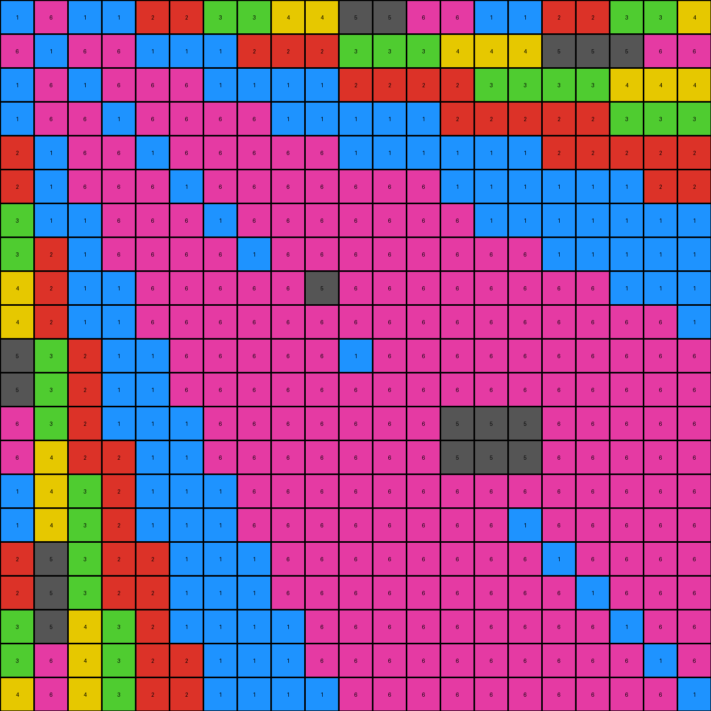

# 73251a56 • 010 • refine_coder

---

Previous Code:
```python
"""
Identifies and removes contiguous regions of black pixels (value 0) in the input grid, replacing them with gray (value 5), while preserving other pixels.
"""

import numpy as np
from scipy.ndimage import label

def get_neighboring_color(grid, r, c):
    """
    Finds the most frequent neighboring color around a given pixel, excluding black (0).
    """
    neighbors = []
    rows, cols = grid.shape
    for i in range(max(0, r - 1), min(rows, r + 2)):
        for j in range(max(0, c - 1), min(cols, c + 2)):
            if (i != r or j != c) and grid[i, j] != 0:  # Exclude the pixel itself and black pixels
                neighbors.append(grid[i, j])

    if not neighbors:
      return 5
      
    # return most common neighbor
    return max(set(neighbors), key=neighbors.count)

def transform(input_grid):
    """
    Transforms the input grid by removing black regions and replacing them with gray (value 5).

    Args:
        input_grid: A 2D numpy array representing the input grid.

    Returns:
        A 2D numpy array representing the transformed output grid.
    """
    # Initialize the output grid as a copy of the input grid.
    output_grid = np.copy(input_grid)
    rows, cols = input_grid.shape

    # 1. Identify Black Regions: Use scipy.ndimage.label to find connected components.
    labeled_grid, num_labels = label(input_grid == 0)

    # 2. & 3. Replace Black Regions with the surrounding color.
    for r in range(rows):
        for c in range(cols):
            if labeled_grid[r, c] != 0:  # If the pixel is part of a black region
                output_grid[r,c] = get_neighboring_color(input_grid,r,c)

    # 4. Preserve Other Pixels (already handled by initializing output_grid as a copy).
    return output_grid
```

Train Set Results:

## Example 1:

Input:
```
1 6 1 1 2 2 3 3 4 4 5 5 6 6 1 1 2 2 3 3 4
6 1 6 6 1 1 1 2 2 2 3 3 3 4 4 4 5 5 5 6 6
1 6 1 6 6 6 1 1 1 1 2 2 2 2 3 3 3 3 4 4 4
1 6 6 1 6 6 6 6 1 1 1 1 1 2 2 2 2 2 3 3 3
2 1 6 6 1 6 6 6 6 6 1 0 0 0 1 1 2 2 2 2 2
2 1 6 6 6 1 6 6 6 6 6 0 0 0 1 1 1 1 1 2 2
3 1 1 6 6 6 1 6 6 6 6 6 6 6 1 1 1 1 1 1 1
3 2 1 6 6 6 6 1 0 0 0 6 6 6 6 6 1 1 1 1 1
4 2 1 1 6 6 6 6 0 0 0 6 6 6 6 6 6 6 1 1 1
4 2 1 1 6 6 6 6 0 0 0 6 6 6 6 6 6 6 6 6 1
5 3 2 1 1 6 6 6 6 6 1 6 6 6 6 6 6 6 6 6 6
5 3 2 1 1 6 6 6 6 6 0 0 0 0 0 0 0 6 6 6 6
6 3 2 1 1 1 6 6 6 6 0 0 0 0 0 0 0 6 6 6 6
6 4 2 2 1 1 6 6 6 6 6 6 0 0 0 0 0 6 6 6 6
1 4 3 2 1 1 1 6 6 6 6 6 0 0 0 0 0 6 6 6 6
1 4 3 2 1 1 1 6 6 6 6 6 6 6 6 1 6 6 6 6 6
2 5 3 2 2 1 1 1 6 6 6 6 6 6 6 6 1 6 6 6 6
2 5 3 2 2 1 1 1 6 6 6 6 6 6 6 6 6 1 6 6 6
3 5 4 3 2 1 1 1 1 6 0 0 0 0 6 6 6 6 1 6 6
3 6 4 3 2 2 1 1 1 6 0 0 0 0 6 6 6 6 6 1 6
4 6 4 3 2 2 1 1 1 1 6 6 6 6 6 6 6 6 6 6 1
```
Expected Output:
```
1 6 1 1 2 2 3 3 4 4 5 5 6 6 1 1 2 2 3 3 4
6 1 6 6 1 1 1 2 2 2 3 3 3 4 4 4 5 5 5 6 6
1 6 1 6 6 6 1 1 1 1 2 2 2 2 3 3 3 3 4 4 4
1 6 6 1 6 6 6 6 1 1 1 1 1 2 2 2 2 2 3 3 3
2 1 6 6 1 6 6 6 6 6 1 1 1 1 1 1 2 2 2 2 2
2 1 6 6 6 1 6 6 6 6 6 6 1 1 1 1 1 1 1 2 2
3 1 1 6 6 6 1 6 6 6 6 6 6 6 1 1 1 1 1 1 1
3 2 1 6 6 6 6 1 6 6 6 6 6 6 6 6 1 1 1 1 1
4 2 1 1 6 6 6 6 1 6 6 6 6 6 6 6 6 6 1 1 1
4 2 1 1 6 6 6 6 6 1 6 6 6 6 6 6 6 6 6 6 1
5 3 2 1 1 6 6 6 6 6 1 6 6 6 6 6 6 6 6 6 6
5 3 2 1 1 6 6 6 6 6 6 1 6 6 6 6 6 6 6 6 6
6 3 2 1 1 1 6 6 6 6 6 6 1 6 6 6 6 6 6 6 6
6 4 2 2 1 1 6 6 6 6 6 6 6 1 6 6 6 6 6 6 6
1 4 3 2 1 1 1 6 6 6 6 6 6 6 1 6 6 6 6 6 6
1 4 3 2 1 1 1 6 6 6 6 6 6 6 6 1 6 6 6 6 6
2 5 3 2 2 1 1 1 6 6 6 6 6 6 6 6 1 6 6 6 6
2 5 3 2 2 1 1 1 6 6 6 6 6 6 6 6 6 1 6 6 6
3 5 4 3 2 1 1 1 1 6 6 6 6 6 6 6 6 6 1 6 6
3 6 4 3 2 2 1 1 1 6 6 6 6 6 6 6 6 6 6 1 6
4 6 4 3 2 2 1 1 1 1 6 6 6 6 6 6 6 6 6 6 1
```
Transformed Output:
```
1 6 1 1 2 2 3 3 4 4 5 5 6 6 1 1 2 2 3 3 4
6 1 6 6 1 1 1 2 2 2 3 3 3 4 4 4 5 5 5 6 6
1 6 1 6 6 6 1 1 1 1 2 2 2 2 3 3 3 3 4 4 4
1 6 6 1 6 6 6 6 1 1 1 1 1 2 2 2 2 2 3 3 3
2 1 6 6 1 6 6 6 6 6 1 1 1 1 1 1 2 2 2 2 2
2 1 6 6 6 1 6 6 6 6 6 6 6 1 1 1 1 1 1 2 2
3 1 1 6 6 6 1 6 6 6 6 6 6 6 1 1 1 1 1 1 1
3 2 1 6 6 6 6 1 6 6 6 6 6 6 6 6 1 1 1 1 1
4 2 1 1 6 6 6 6 6 5 6 6 6 6 6 6 6 6 1 1 1
4 2 1 1 6 6 6 6 6 6 6 6 6 6 6 6 6 6 6 6 1
5 3 2 1 1 6 6 6 6 6 1 6 6 6 6 6 6 6 6 6 6
5 3 2 1 1 6 6 6 6 6 6 6 6 6 6 6 6 6 6 6 6
6 3 2 1 1 1 6 6 6 6 6 6 6 5 5 5 6 6 6 6 6
6 4 2 2 1 1 6 6 6 6 6 6 6 5 5 5 6 6 6 6 6
1 4 3 2 1 1 1 6 6 6 6 6 6 6 6 6 6 6 6 6 6
1 4 3 2 1 1 1 6 6 6 6 6 6 6 6 1 6 6 6 6 6
2 5 3 2 2 1 1 1 6 6 6 6 6 6 6 6 1 6 6 6 6
2 5 3 2 2 1 1 1 6 6 6 6 6 6 6 6 6 1 6 6 6
3 5 4 3 2 1 1 1 1 6 6 6 6 6 6 6 6 6 1 6 6
3 6 4 3 2 2 1 1 1 6 6 6 6 6 6 6 6 6 6 1 6
4 6 4 3 2 2 1 1 1 1 6 6 6 6 6 6 6 6 6 6 1
```

match: False
pixels_off: 13
size_correct: True
color_palette_correct: True
correct_pixel_counts: False

## Example 2:

Input:
```
6 5 6 6 7 7 1 1 2 2 3 3 4 4 5 5 6 6 7 7 1
5 6 5 5 6 6 6 7 7 7 1 1 1 2 2 2 3 3 3 4 4
6 5 6 5 5 5 6 6 6 6 7 7 7 7 1 1 1 1 2 2 2
6 5 5 0 0 0 5 5 6 6 6 6 6 7 7 7 7 7 1 1 1
7 6 5 0 0 0 5 5 5 5 6 6 6 6 6 6 7 7 7 7 7
7 6 5 0 0 0 5 5 5 5 5 5 6 6 6 6 6 6 6 7 7
1 6 6 0 0 0 6 5 5 0 0 0 5 5 6 6 6 6 6 6 6
1 7 6 0 0 0 5 6 5 0 0 0 5 5 5 5 6 6 6 6 6
2 7 6 6 5 5 5 5 6 0 0 0 0 0 0 0 0 5 6 6 6
2 7 6 6 5 5 5 5 5 6 5 5 0 0 0 0 0 5 5 5 6
3 1 7 6 6 5 5 5 5 5 6 5 5 5 5 5 5 5 5 5 5
3 1 7 6 6 5 5 5 5 5 5 6 5 5 5 5 5 5 5 5 5
4 1 7 6 6 6 5 5 5 5 5 5 6 5 5 5 5 5 5 5 5
4 2 7 7 6 6 5 5 5 5 5 5 5 6 5 5 5 5 5 5 5
5 2 0 0 0 0 6 5 5 5 5 5 5 5 6 5 5 5 5 5 5
5 2 0 0 0 0 6 5 5 5 5 5 5 5 5 6 5 5 5 5 5
6 3 1 7 7 6 6 6 5 5 5 5 5 5 5 5 6 5 5 5 5
6 3 1 7 7 6 6 6 0 0 0 0 5 5 5 5 5 6 5 5 5
7 3 2 1 7 6 6 6 0 0 0 0 5 5 5 5 5 5 6 5 5
7 4 2 1 7 7 6 6 6 5 5 5 5 5 5 5 5 5 5 6 5
1 4 2 1 7 7 6 6 6 6 5 5 5 5 5 5 5 5 5 5 6
```
Expected Output:
```
6 5 6 6 7 7 1 1 2 2 3 3 4 4 5 5 6 6 7 7 1
5 6 5 5 6 6 6 7 7 7 1 1 1 2 2 2 3 3 3 4 4
6 5 6 5 5 5 6 6 6 6 7 7 7 7 1 1 1 1 2 2 2
6 5 5 6 5 5 5 5 6 6 6 6 6 7 7 7 7 7 1 1 1
7 6 5 5 6 5 5 5 5 5 6 6 6 6 6 6 7 7 7 7 7
7 6 5 5 5 6 5 5 5 5 5 5 6 6 6 6 6 6 6 7 7
1 6 6 5 5 5 6 5 5 5 5 5 5 5 6 6 6 6 6 6 6
1 7 6 5 5 5 5 6 5 5 5 5 5 5 5 5 6 6 6 6 6
2 7 6 6 5 5 5 5 6 5 5 5 5 5 5 5 5 5 6 6 6
2 7 6 6 5 5 5 5 5 6 5 5 5 5 5 5 5 5 5 5 6
3 1 7 6 6 5 5 5 5 5 6 5 5 5 5 5 5 5 5 5 5
3 1 7 6 6 5 5 5 5 5 5 6 5 5 5 5 5 5 5 5 5
4 1 7 6 6 6 5 5 5 5 5 5 6 5 5 5 5 5 5 5 5
4 2 7 7 6 6 5 5 5 5 5 5 5 6 5 5 5 5 5 5 5
5 2 1 7 6 6 6 5 5 5 5 5 5 5 6 5 5 5 5 5 5
5 2 1 7 6 6 6 5 5 5 5 5 5 5 5 6 5 5 5 5 5
6 3 1 7 7 6 6 6 5 5 5 5 5 5 5 5 6 5 5 5 5
6 3 1 7 7 6 6 6 5 5 5 5 5 5 5 5 5 6 5 5 5
7 3 2 1 7 6 6 6 6 5 5 5 5 5 5 5 5 5 6 5 5
7 4 2 1 7 7 6 6 6 5 5 5 5 5 5 5 5 5 5 6 5
1 4 2 1 7 7 6 6 6 6 5 5 5 5 5 5 5 5 5 5 6
```
Transformed Output:
```
6 5 6 6 7 7 1 1 2 2 3 3 4 4 5 5 6 6 7 7 1
5 6 5 5 6 6 6 7 7 7 1 1 1 2 2 2 3 3 3 4 4
6 5 6 5 5 5 6 6 6 6 7 7 7 7 1 1 1 1 2 2 2
6 5 5 5 5 5 5 5 6 6 6 6 6 7 7 7 7 7 1 1 1
7 6 5 5 5 5 5 5 5 5 6 6 6 6 6 6 7 7 7 7 7
7 6 5 5 5 5 5 5 5 5 5 5 6 6 6 6 6 6 6 7 7
1 6 6 6 5 5 6 5 5 5 5 5 5 5 6 6 6 6 6 6 6
1 7 6 6 5 5 5 6 5 5 5 5 5 5 5 5 6 6 6 6 6
2 7 6 6 5 5 5 5 6 5 5 5 5 5 5 5 5 5 6 6 6
2 7 6 6 5 5 5 5 5 6 5 5 5 5 5 5 5 5 5 5 6
3 1 7 6 6 5 5 5 5 5 6 5 5 5 5 5 5 5 5 5 5
3 1 7 6 6 5 5 5 5 5 5 6 5 5 5 5 5 5 5 5 5
4 1 7 6 6 6 5 5 5 5 5 5 6 5 5 5 5 5 5 5 5
4 2 7 7 6 6 5 5 5 5 5 5 5 6 5 5 5 5 5 5 5
5 2 2 7 6 6 6 5 5 5 5 5 5 5 6 5 5 5 5 5 5
5 2 2 7 7 6 6 5 5 5 5 5 5 5 5 6 5 5 5 5 5
6 3 1 7 7 6 6 6 5 5 5 5 5 5 5 5 6 5 5 5 5
6 3 1 7 7 6 6 6 6 5 5 5 5 5 5 5 5 6 5 5 5
7 3 2 1 7 6 6 6 6 5 5 5 5 5 5 5 5 5 6 5 5
7 4 2 1 7 7 6 6 6 5 5 5 5 5 5 5 5 5 5 6 5
1 4 2 1 7 7 6 6 6 6 5 5 5 5 5 5 5 5 5 5 6
```

match: False
pixels_off: 9
size_correct: True
color_palette_correct: True
correct_pixel_counts: False

## Example 3:

Input:
```
5 4 5 5 6 6 7 7 8 8 1 1 2 2 3 3 4 4 5 5 6
4 5 4 4 5 5 5 6 6 6 7 7 7 8 8 8 1 1 1 2 2
5 4 5 4 4 4 5 5 5 5 6 6 6 6 7 7 0 0 8 8 8
5 4 4 5 4 4 4 4 5 5 5 5 5 6 6 6 0 0 7 7 7
6 5 4 4 5 4 4 4 4 4 5 5 5 5 5 5 0 0 6 6 6
6 5 4 4 4 5 4 4 4 4 4 4 5 5 5 5 0 0 5 6 6
7 5 5 4 4 4 5 4 4 4 4 4 4 4 5 5 0 0 5 5 5
7 6 5 4 4 4 4 5 4 4 4 4 4 4 4 4 5 5 5 5 5
8 6 5 5 4 4 4 4 5 4 4 4 4 4 4 4 4 4 5 5 5
8 6 5 5 4 4 4 4 4 5 4 4 4 4 4 4 4 4 4 4 5
1 7 6 5 5 4 4 4 4 4 5 0 0 4 4 4 4 4 4 4 4
1 7 6 5 5 4 4 4 4 4 4 0 0 4 4 4 4 4 4 4 4
2 7 6 5 5 5 4 4 4 4 4 0 0 4 4 4 4 4 4 4 4
2 8 6 6 5 5 4 4 4 4 0 0 0 0 0 4 4 4 4 4 4
3 8 7 6 5 5 5 4 4 0 0 0 0 0 0 4 4 4 4 4 4
3 8 7 6 5 5 5 4 4 0 0 0 0 0 0 5 4 4 4 4 4
4 1 7 6 6 5 5 5 4 0 0 0 4 4 4 4 5 4 4 4 4
4 1 7 6 6 5 5 5 4 0 0 0 4 4 4 4 4 5 4 4 4
5 1 8 7 6 5 5 5 5 0 0 0 4 4 4 4 4 4 5 4 4
5 2 8 7 6 6 5 5 5 4 4 4 4 4 4 4 4 4 4 5 4
6 2 8 7 6 6 5 5 5 5 4 4 4 4 4 4 4 4 4 4 5
```
Expected Output:
```
5 4 5 5 6 6 7 7 8 8 1 1 2 2 3 3 4 4 5 5 6
4 5 4 4 5 5 5 6 6 6 7 7 7 8 8 8 1 1 1 2 2
5 4 5 4 4 4 5 5 5 5 6 6 6 6 7 7 7 7 8 8 8
5 4 4 5 4 4 4 4 5 5 5 5 5 6 6 6 6 6 7 7 7
6 5 4 4 5 4 4 4 4 4 5 5 5 5 5 5 6 6 6 6 6
6 5 4 4 4 5 4 4 4 4 4 4 5 5 5 5 5 5 5 6 6
7 5 5 4 4 4 5 4 4 4 4 4 4 4 5 5 5 5 5 5 5
7 6 5 4 4 4 4 5 4 4 4 4 4 4 4 4 5 5 5 5 5
8 6 5 5 4 4 4 4 5 4 4 4 4 4 4 4 4 4 5 5 5
8 6 5 5 4 4 4 4 4 5 4 4 4 4 4 4 4 4 4 4 5
1 7 6 5 5 4 4 4 4 4 5 4 4 4 4 4 4 4 4 4 4
1 7 6 5 5 4 4 4 4 4 4 5 4 4 4 4 4 4 4 4 4
2 7 6 5 5 5 4 4 4 4 4 4 5 4 4 4 4 4 4 4 4
2 8 6 6 5 5 4 4 4 4 4 4 4 5 4 4 4 4 4 4 4
3 8 7 6 5 5 5 4 4 4 4 4 4 4 5 4 4 4 4 4 4
3 8 7 6 5 5 5 4 4 4 4 4 4 4 4 5 4 4 4 4 4
4 1 7 6 6 5 5 5 4 4 4 4 4 4 4 4 5 4 4 4 4
4 1 7 6 6 5 5 5 4 4 4 4 4 4 4 4 4 5 4 4 4
5 1 8 7 6 5 5 5 5 4 4 4 4 4 4 4 4 4 5 4 4
5 2 8 7 6 6 5 5 5 4 4 4 4 4 4 4 4 4 4 5 4
6 2 8 7 6 6 5 5 5 5 4 4 4 4 4 4 4 4 4 4 5
```
Transformed Output:
```
5 4 5 5 6 6 7 7 8 8 1 1 2 2 3 3 4 4 5 5 6
4 5 4 4 5 5 5 6 6 6 7 7 7 8 8 8 1 1 1 2 2
5 4 5 4 4 4 5 5 5 5 6 6 6 6 7 7 1 1 8 8 8
5 4 4 5 4 4 4 4 5 5 5 5 5 6 6 6 5 8 7 7 7
6 5 4 4 5 4 4 4 4 4 5 5 5 5 5 5 5 5 6 6 6
6 5 4 4 4 5 4 4 4 4 4 4 5 5 5 5 5 5 5 6 6
7 5 5 4 4 4 5 4 4 4 4 4 4 4 5 5 5 5 5 5 5
7 6 5 4 4 4 4 5 4 4 4 4 4 4 4 4 5 5 5 5 5
8 6 5 5 4 4 4 4 5 4 4 4 4 4 4 4 4 4 5 5 5
8 6 5 5 4 4 4 4 4 5 4 4 4 4 4 4 4 4 4 4 5
1 7 6 5 5 4 4 4 4 4 5 4 4 4 4 4 4 4 4 4 4
1 7 6 5 5 4 4 4 4 4 4 4 4 4 4 4 4 4 4 4 4
2 7 6 5 5 5 4 4 4 4 4 4 4 4 4 4 4 4 4 4 4
2 8 6 6 5 5 4 4 4 4 4 4 4 4 4 4 4 4 4 4 4
3 8 7 6 5 5 5 4 4 4 4 5 5 5 4 4 4 4 4 4 4
3 8 7 6 5 5 5 4 4 4 5 4 4 4 4 5 4 4 4 4 4
4 1 7 6 6 5 5 5 4 4 5 4 4 4 4 4 5 4 4 4 4
4 1 7 6 6 5 5 5 4 4 5 4 4 4 4 4 4 5 4 4 4
5 1 8 7 6 5 5 5 5 4 4 4 4 4 4 4 4 4 5 4 4
5 2 8 7 6 6 5 5 5 4 4 4 4 4 4 4 4 4 4 5 4
6 2 8 7 6 6 5 5 5 5 4 4 4 4 4 4 4 4 4 4 5
```

match: False
pixels_off: 16
size_correct: True
color_palette_correct: True
correct_pixel_counts: False
Okay, let's analyze the results and refine the natural language program.

**General Assessment:**

The initial code was based on the idea of removing black (0) regions and replacing them with the most frequent neighboring color. While this approach works to some extent, it's not entirely accurate, as evidenced by the mismatches in the provided examples. The errors suggest that the neighboring color replacement logic is not always correct and may need adjustment. Instead of simply using gray(5), we should be picking the most common neighboring non-black color. The provided `get_neighboring_color` function seems to already be doing that, so it should be used more correctly.

**Strategy for Resolving Errors:**

1.  **Verify `get_neighboring_color`:** Double-check the `get_neighboring_color` implementation for edge cases or bugs. It should prioritize non-black colors and handle cases with no non-black neighbors.
2.  **Correct Application of `get_neighboring_color`**: The logic that applies this function may have mistakes.
3.  **Re-evaluate Edge Cases:** Pay close attention to pixels at the edges of the grid and within regions where multiple non-black colors are adjacent.
4. **Iterative Refinement:** Make small, targeted adjustments to the natural language program and the corresponding code.

**Metrics and Observations:**

Here are some observations based on each of the examples:

*   **Example 1:**
    *   `pixels_off`: 13
    *    The errors are mostly along diagonals and inside the shapes.
*   **Example 2:**
    *   `pixels_off`: 9
    *   The code is failing to correctly replace the black pixels with the most common surrounding color in certain areas, particularly when multiple colors are nearby.
*   **Example 3:**
    *   `pixels_off`: 16
    *   Again, the code struggles to replace black areas with the correct color based on the surrounding context.

**YAML Block (Facts):**

```yaml
objects:
  - name: grid
    type: 2D array
    properties:
      - pixels: integers (0-9) representing colors
      - regions: contiguous blocks of pixels with the same color

actions:
  - name: identify_black_regions
    description: Locate contiguous regions of black (0) pixels.
    method: connected component labeling

  - name: replace_black_pixels
    description: Replace each black pixel with the most frequent non-black neighboring color.
    method:  Iterate through labeled black regions, find neighboring colors, replace with the mode.

  - name: preserve_other_pixels
    description: Keep non-black pixels unchanged.
```

**Natural Language Program:**

1.  **Identify Black Regions:** Find all contiguous regions (connected components) of black (value 0) pixels within the input grid.
2.  **Replace with Neighboring Color:** For *each* black pixel:
    *   Examine its immediate neighbors (up, down, left, right, and diagonals).
    *   Determine the most frequent color among the non-black neighbors.
    *   Replace the black pixel with this most frequent color. If no non-black colors, use gray(5).
3.  **Preserve Other Colors:** All non-black pixels in the original input grid remain unchanged in the output grid.

**INSTRUCTIONS**

- generate a Python module to represent the natural language program 
- follow the template below
- all common math and science libraries are available
- create docstring only at top - but comment the workflow in the function
- use helper functions for common operations like finding objects, counting,
  measuring, moving, etc. 

remember - we are working iteratively - so this code will inform your future
self as we converge on the solution

*template:*

```python
"""
{{ natural language description of the transformation rule }}
"""

{{ imports }}

def transform(input_grid):
    # initialize output_grid

    # change output pixels 

    return output_grid

```
