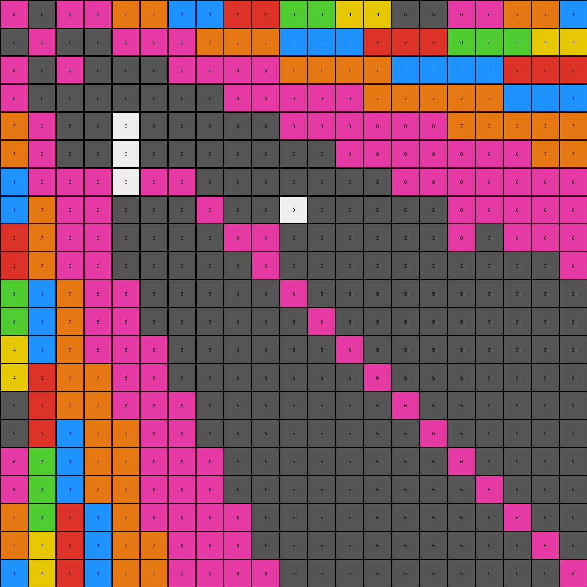
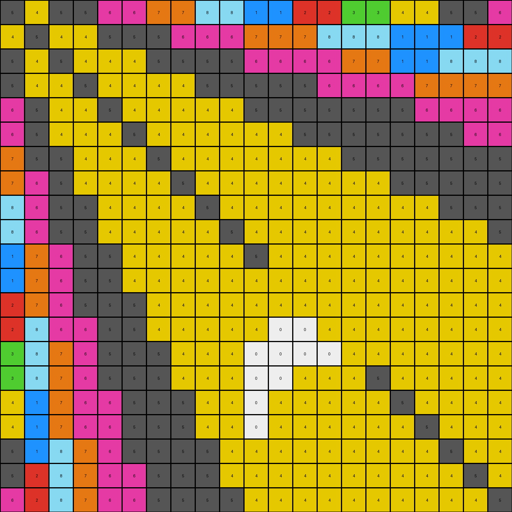

# 73251a56 • 018 • refine_coder

---

Previous Code:
```python
"""
The transformation rule involves changing white background pixels (color 0) based on their adjacency to non-white pixels. Specifically:

1.  Iterate through each pixel in the input grid.
2.  If a pixel is white (color 0), check its immediate neighbors (up, down, left, and right).
3.  If a white pixel has a non-white neighbor, change the white pixel's value, copying value of neighbor
"""

import numpy as np

def get_neighbors(grid, row, col):
    """
    Gets the valid neighbors (up, down, left, right) of a pixel.
    """
    rows, cols = grid.shape
    neighbors = []
    
    # Up
    if row > 0:
        neighbors.append(grid[row-1, col])
    # Down
    if row < rows - 1:
        neighbors.append(grid[row+1, col])
    # Left
    if col > 0:
        neighbors.append(grid[row, col-1])
    # Right
    if col < cols - 1:
        neighbors.append(grid[row, col+1])

    return neighbors
    

def transform(input_grid):
    """
    Transforms the input grid by changing white pixels based on neighbors.
    """
    output_grid = np.copy(input_grid)
    rows, cols = output_grid.shape

    # Iterate through each pixel
    for r in range(rows):
        for c in range(cols):
            # If the pixel is white
            if output_grid[r, c] == 0:
                # Get its neighbors
                neighbors = get_neighbors(input_grid, r, c)
                # Check for non-white neighbors
                for neighbor_val in neighbors:
                    if neighbor_val != 0:
                        output_grid[r,c] = neighbor_val
                        break #stop after finding the first colored neighbor

    return output_grid
```

Train Set Results:

## Example 1:

Input:
```
1 6 1 1 2 2 3 3 4 4 5 5 6 6 1 1 2 2 3 3 4
6 1 6 6 1 1 1 2 2 2 3 3 3 4 4 4 5 5 5 6 6
1 6 1 6 6 6 1 1 1 1 2 2 2 2 3 3 3 3 4 4 4
1 6 6 1 6 6 6 6 1 1 1 1 1 2 2 2 2 2 3 3 3
2 1 6 6 1 6 6 6 6 6 1 0 0 0 1 1 2 2 2 2 2
2 1 6 6 6 1 6 6 6 6 6 0 0 0 1 1 1 1 1 2 2
3 1 1 6 6 6 1 6 6 6 6 6 6 6 1 1 1 1 1 1 1
3 2 1 6 6 6 6 1 0 0 0 6 6 6 6 6 1 1 1 1 1
4 2 1 1 6 6 6 6 0 0 0 6 6 6 6 6 6 6 1 1 1
4 2 1 1 6 6 6 6 0 0 0 6 6 6 6 6 6 6 6 6 1
5 3 2 1 1 6 6 6 6 6 1 6 6 6 6 6 6 6 6 6 6
5 3 2 1 1 6 6 6 6 6 0 0 0 0 0 0 0 6 6 6 6
6 3 2 1 1 1 6 6 6 6 0 0 0 0 0 0 0 6 6 6 6
6 4 2 2 1 1 6 6 6 6 6 6 0 0 0 0 0 6 6 6 6
1 4 3 2 1 1 1 6 6 6 6 6 0 0 0 0 0 6 6 6 6
1 4 3 2 1 1 1 6 6 6 6 6 6 6 6 1 6 6 6 6 6
2 5 3 2 2 1 1 1 6 6 6 6 6 6 6 6 1 6 6 6 6
2 5 3 2 2 1 1 1 6 6 6 6 6 6 6 6 6 1 6 6 6
3 5 4 3 2 1 1 1 1 6 0 0 0 0 6 6 6 6 1 6 6
3 6 4 3 2 2 1 1 1 6 0 0 0 0 6 6 6 6 6 1 6
4 6 4 3 2 2 1 1 1 1 6 6 6 6 6 6 6 6 6 6 1
```
Expected Output:
```
1 6 1 1 2 2 3 3 4 4 5 5 6 6 1 1 2 2 3 3 4
6 1 6 6 1 1 1 2 2 2 3 3 3 4 4 4 5 5 5 6 6
1 6 1 6 6 6 1 1 1 1 2 2 2 2 3 3 3 3 4 4 4
1 6 6 1 6 6 6 6 1 1 1 1 1 2 2 2 2 2 3 3 3
2 1 6 6 1 6 6 6 6 6 1 1 1 1 1 1 2 2 2 2 2
2 1 6 6 6 1 6 6 6 6 6 6 1 1 1 1 1 1 1 2 2
3 1 1 6 6 6 1 6 6 6 6 6 6 6 1 1 1 1 1 1 1
3 2 1 6 6 6 6 1 6 6 6 6 6 6 6 6 1 1 1 1 1
4 2 1 1 6 6 6 6 1 6 6 6 6 6 6 6 6 6 1 1 1
4 2 1 1 6 6 6 6 6 1 6 6 6 6 6 6 6 6 6 6 1
5 3 2 1 1 6 6 6 6 6 1 6 6 6 6 6 6 6 6 6 6
5 3 2 1 1 6 6 6 6 6 6 1 6 6 6 6 6 6 6 6 6
6 3 2 1 1 1 6 6 6 6 6 6 1 6 6 6 6 6 6 6 6
6 4 2 2 1 1 6 6 6 6 6 6 6 1 6 6 6 6 6 6 6
1 4 3 2 1 1 1 6 6 6 6 6 6 6 1 6 6 6 6 6 6
1 4 3 2 1 1 1 6 6 6 6 6 6 6 6 1 6 6 6 6 6
2 5 3 2 2 1 1 1 6 6 6 6 6 6 6 6 1 6 6 6 6
2 5 3 2 2 1 1 1 6 6 6 6 6 6 6 6 6 1 6 6 6
3 5 4 3 2 1 1 1 1 6 6 6 6 6 6 6 6 6 1 6 6
3 6 4 3 2 2 1 1 1 6 6 6 6 6 6 6 6 6 6 1 6
4 6 4 3 2 2 1 1 1 1 6 6 6 6 6 6 6 6 6 6 1
```
Transformed Output:
```
1 6 1 1 2 2 3 3 4 4 5 5 6 6 1 1 2 2 3 3 4
6 1 6 6 1 1 1 2 2 2 3 3 3 4 4 4 5 5 5 6 6
1 6 1 6 6 6 1 1 1 1 2 2 2 2 3 3 3 3 4 4 4
1 6 6 1 6 6 6 6 1 1 1 1 1 2 2 2 2 2 3 3 3
2 1 6 6 1 6 6 6 6 6 1 1 1 2 1 1 2 2 2 2 2
2 1 6 6 6 1 6 6 6 6 6 6 6 6 1 1 1 1 1 2 2
3 1 1 6 6 6 1 6 6 6 6 6 6 6 1 1 1 1 1 1 1
3 2 1 6 6 6 6 1 6 6 6 6 6 6 6 6 1 1 1 1 1
4 2 1 1 6 6 6 6 6 0 6 6 6 6 6 6 6 6 1 1 1
4 2 1 1 6 6 6 6 6 6 1 6 6 6 6 6 6 6 6 6 1
5 3 2 1 1 6 6 6 6 6 1 6 6 6 6 6 6 6 6 6 6
5 3 2 1 1 6 6 6 6 6 1 6 6 6 6 6 6 6 6 6 6
6 3 2 1 1 1 6 6 6 6 6 6 0 0 0 0 6 6 6 6 6
6 4 2 2 1 1 6 6 6 6 6 6 6 0 0 0 6 6 6 6 6
1 4 3 2 1 1 1 6 6 6 6 6 6 6 6 1 6 6 6 6 6
1 4 3 2 1 1 1 6 6 6 6 6 6 6 6 1 6 6 6 6 6
2 5 3 2 2 1 1 1 6 6 6 6 6 6 6 6 1 6 6 6 6
2 5 3 2 2 1 1 1 6 6 6 6 6 6 6 6 6 1 6 6 6
3 5 4 3 2 1 1 1 1 6 6 6 6 6 6 6 6 6 1 6 6
3 6 4 3 2 2 1 1 1 6 6 6 6 6 6 6 6 6 6 1 6
4 6 4 3 2 2 1 1 1 1 6 6 6 6 6 6 6 6 6 6 1
```

match: False
pixels_off: 18
size_correct: True
color_palette_correct: False
correct_pixel_counts: False

## Example 2:

Input:
```
6 5 6 6 7 7 1 1 2 2 3 3 4 4 5 5 6 6 7 7 1
5 6 5 5 6 6 6 7 7 7 1 1 1 2 2 2 3 3 3 4 4
6 5 6 5 5 5 6 6 6 6 7 7 7 7 1 1 1 1 2 2 2
6 5 5 0 0 0 5 5 6 6 6 6 6 7 7 7 7 7 1 1 1
7 6 5 0 0 0 5 5 5 5 6 6 6 6 6 6 7 7 7 7 7
7 6 5 0 0 0 5 5 5 5 5 5 6 6 6 6 6 6 6 7 7
1 6 6 0 0 0 6 5 5 0 0 0 5 5 6 6 6 6 6 6 6
1 7 6 0 0 0 5 6 5 0 0 0 5 5 5 5 6 6 6 6 6
2 7 6 6 5 5 5 5 6 0 0 0 0 0 0 0 0 5 6 6 6
2 7 6 6 5 5 5 5 5 6 5 5 0 0 0 0 0 5 5 5 6
3 1 7 6 6 5 5 5 5 5 6 5 5 5 5 5 5 5 5 5 5
3 1 7 6 6 5 5 5 5 5 5 6 5 5 5 5 5 5 5 5 5
4 1 7 6 6 6 5 5 5 5 5 5 6 5 5 5 5 5 5 5 5
4 2 7 7 6 6 5 5 5 5 5 5 5 6 5 5 5 5 5 5 5
5 2 0 0 0 0 6 5 5 5 5 5 5 5 6 5 5 5 5 5 5
5 2 0 0 0 0 6 5 5 5 5 5 5 5 5 6 5 5 5 5 5
6 3 1 7 7 6 6 6 5 5 5 5 5 5 5 5 6 5 5 5 5
6 3 1 7 7 6 6 6 0 0 0 0 5 5 5 5 5 6 5 5 5
7 3 2 1 7 6 6 6 0 0 0 0 5 5 5 5 5 5 6 5 5
7 4 2 1 7 7 6 6 6 5 5 5 5 5 5 5 5 5 5 6 5
1 4 2 1 7 7 6 6 6 6 5 5 5 5 5 5 5 5 5 5 6
```
Expected Output:
```
6 5 6 6 7 7 1 1 2 2 3 3 4 4 5 5 6 6 7 7 1
5 6 5 5 6 6 6 7 7 7 1 1 1 2 2 2 3 3 3 4 4
6 5 6 5 5 5 6 6 6 6 7 7 7 7 1 1 1 1 2 2 2
6 5 5 6 5 5 5 5 6 6 6 6 6 7 7 7 7 7 1 1 1
7 6 5 5 6 5 5 5 5 5 6 6 6 6 6 6 7 7 7 7 7
7 6 5 5 5 6 5 5 5 5 5 5 6 6 6 6 6 6 6 7 7
1 6 6 5 5 5 6 5 5 5 5 5 5 5 6 6 6 6 6 6 6
1 7 6 5 5 5 5 6 5 5 5 5 5 5 5 5 6 6 6 6 6
2 7 6 6 5 5 5 5 6 5 5 5 5 5 5 5 5 5 6 6 6
2 7 6 6 5 5 5 5 5 6 5 5 5 5 5 5 5 5 5 5 6
3 1 7 6 6 5 5 5 5 5 6 5 5 5 5 5 5 5 5 5 5
3 1 7 6 6 5 5 5 5 5 5 6 5 5 5 5 5 5 5 5 5
4 1 7 6 6 6 5 5 5 5 5 5 6 5 5 5 5 5 5 5 5
4 2 7 7 6 6 5 5 5 5 5 5 5 6 5 5 5 5 5 5 5
5 2 1 7 6 6 6 5 5 5 5 5 5 5 6 5 5 5 5 5 5
5 2 1 7 6 6 6 5 5 5 5 5 5 5 5 6 5 5 5 5 5
6 3 1 7 7 6 6 6 5 5 5 5 5 5 5 5 6 5 5 5 5
6 3 1 7 7 6 6 6 5 5 5 5 5 5 5 5 5 6 5 5 5
7 3 2 1 7 6 6 6 6 5 5 5 5 5 5 5 5 5 6 5 5
7 4 2 1 7 7 6 6 6 5 5 5 5 5 5 5 5 5 5 6 5
1 4 2 1 7 7 6 6 6 6 5 5 5 5 5 5 5 5 5 5 6
```
Transformed Output:
```
6 5 6 6 7 7 1 1 2 2 3 3 4 4 5 5 6 6 7 7 1
5 6 5 5 6 6 6 7 7 7 1 1 1 2 2 2 3 3 3 4 4
6 5 6 5 5 5 6 6 6 6 7 7 7 7 1 1 1 1 2 2 2
6 5 5 5 5 5 5 5 6 6 6 6 6 7 7 7 7 7 1 1 1
7 6 5 5 0 5 5 5 5 5 6 6 6 6 6 6 7 7 7 7 7
7 6 5 5 0 5 5 5 5 5 5 5 6 6 6 6 6 6 6 7 7
1 6 6 6 0 6 6 5 5 5 5 5 5 5 6 6 6 6 6 6 6
1 7 6 6 5 5 5 6 5 5 0 5 5 5 5 5 6 6 6 6 6
2 7 6 6 5 5 5 5 6 6 5 5 5 5 5 5 6 5 6 6 6
2 7 6 6 5 5 5 5 5 6 5 5 5 5 5 5 5 5 5 5 6
3 1 7 6 6 5 5 5 5 5 6 5 5 5 5 5 5 5 5 5 5
3 1 7 6 6 5 5 5 5 5 5 6 5 5 5 5 5 5 5 5 5
4 1 7 6 6 6 5 5 5 5 5 5 6 5 5 5 5 5 5 5 5
4 2 7 7 6 6 5 5 5 5 5 5 5 6 5 5 5 5 5 5 5
5 2 7 7 6 6 6 5 5 5 5 5 5 5 6 5 5 5 5 5 5
5 2 1 7 7 6 6 5 5 5 5 5 5 5 5 6 5 5 5 5 5
6 3 1 7 7 6 6 6 5 5 5 5 5 5 5 5 6 5 5 5 5
6 3 1 7 7 6 6 6 5 5 5 5 5 5 5 5 5 6 5 5 5
7 3 2 1 7 6 6 6 6 5 5 5 5 5 5 5 5 5 6 5 5
7 4 2 1 7 7 6 6 6 5 5 5 5 5 5 5 5 5 5 6 5
1 4 2 1 7 7 6 6 6 6 5 5 5 5 5 5 5 5 5 5 6
```

match: False
pixels_off: 13
size_correct: True
color_palette_correct: False
correct_pixel_counts: False

## Example 3:

Input:
```
5 4 5 5 6 6 7 7 8 8 1 1 2 2 3 3 4 4 5 5 6
4 5 4 4 5 5 5 6 6 6 7 7 7 8 8 8 1 1 1 2 2
5 4 5 4 4 4 5 5 5 5 6 6 6 6 7 7 0 0 8 8 8
5 4 4 5 4 4 4 4 5 5 5 5 5 6 6 6 0 0 7 7 7
6 5 4 4 5 4 4 4 4 4 5 5 5 5 5 5 0 0 6 6 6
6 5 4 4 4 5 4 4 4 4 4 4 5 5 5 5 0 0 5 6 6
7 5 5 4 4 4 5 4 4 4 4 4 4 4 5 5 0 0 5 5 5
7 6 5 4 4 4 4 5 4 4 4 4 4 4 4 4 5 5 5 5 5
8 6 5 5 4 4 4 4 5 4 4 4 4 4 4 4 4 4 5 5 5
8 6 5 5 4 4 4 4 4 5 4 4 4 4 4 4 4 4 4 4 5
1 7 6 5 5 4 4 4 4 4 5 0 0 4 4 4 4 4 4 4 4
1 7 6 5 5 4 4 4 4 4 4 0 0 4 4 4 4 4 4 4 4
2 7 6 5 5 5 4 4 4 4 4 0 0 4 4 4 4 4 4 4 4
2 8 6 6 5 5 4 4 4 4 0 0 0 0 0 4 4 4 4 4 4
3 8 7 6 5 5 5 4 4 0 0 0 0 0 0 4 4 4 4 4 4
3 8 7 6 5 5 5 4 4 0 0 0 0 0 0 5 4 4 4 4 4
4 1 7 6 6 5 5 5 4 0 0 0 4 4 4 4 5 4 4 4 4
4 1 7 6 6 5 5 5 4 0 0 0 4 4 4 4 4 5 4 4 4
5 1 8 7 6 5 5 5 5 0 0 0 4 4 4 4 4 4 5 4 4
5 2 8 7 6 6 5 5 5 4 4 4 4 4 4 4 4 4 4 5 4
6 2 8 7 6 6 5 5 5 5 4 4 4 4 4 4 4 4 4 4 5
```
Expected Output:
```
5 4 5 5 6 6 7 7 8 8 1 1 2 2 3 3 4 4 5 5 6
4 5 4 4 5 5 5 6 6 6 7 7 7 8 8 8 1 1 1 2 2
5 4 5 4 4 4 5 5 5 5 6 6 6 6 7 7 7 7 8 8 8
5 4 4 5 4 4 4 4 5 5 5 5 5 6 6 6 6 6 7 7 7
6 5 4 4 5 4 4 4 4 4 5 5 5 5 5 5 6 6 6 6 6
6 5 4 4 4 5 4 4 4 4 4 4 5 5 5 5 5 5 5 6 6
7 5 5 4 4 4 5 4 4 4 4 4 4 4 5 5 5 5 5 5 5
7 6 5 4 4 4 4 5 4 4 4 4 4 4 4 4 5 5 5 5 5
8 6 5 5 4 4 4 4 5 4 4 4 4 4 4 4 4 4 5 5 5
8 6 5 5 4 4 4 4 4 5 4 4 4 4 4 4 4 4 4 4 5
1 7 6 5 5 4 4 4 4 4 5 4 4 4 4 4 4 4 4 4 4
1 7 6 5 5 4 4 4 4 4 4 5 4 4 4 4 4 4 4 4 4
2 7 6 5 5 5 4 4 4 4 4 4 5 4 4 4 4 4 4 4 4
2 8 6 6 5 5 4 4 4 4 4 4 4 5 4 4 4 4 4 4 4
3 8 7 6 5 5 5 4 4 4 4 4 4 4 5 4 4 4 4 4 4
3 8 7 6 5 5 5 4 4 4 4 4 4 4 4 5 4 4 4 4 4
4 1 7 6 6 5 5 5 4 4 4 4 4 4 4 4 5 4 4 4 4
4 1 7 6 6 5 5 5 4 4 4 4 4 4 4 4 4 5 4 4 4
5 1 8 7 6 5 5 5 5 4 4 4 4 4 4 4 4 4 5 4 4
5 2 8 7 6 6 5 5 5 4 4 4 4 4 4 4 4 4 4 5 4
6 2 8 7 6 6 5 5 5 5 4 4 4 4 4 4 4 4 4 4 5
```
Transformed Output:
```
5 4 5 5 6 6 7 7 8 8 1 1 2 2 3 3 4 4 5 5 6
4 5 4 4 5 5 5 6 6 6 7 7 7 8 8 8 1 1 1 2 2
5 4 5 4 4 4 5 5 5 5 6 6 6 6 7 7 1 1 8 8 8
5 4 4 5 4 4 4 4 5 5 5 5 5 6 6 6 6 7 7 7 7
6 5 4 4 5 4 4 4 4 4 5 5 5 5 5 5 5 6 6 6 6
6 5 4 4 4 5 4 4 4 4 4 4 5 5 5 5 5 5 5 6 6
7 5 5 4 4 4 5 4 4 4 4 4 4 4 5 5 5 5 5 5 5
7 6 5 4 4 4 4 5 4 4 4 4 4 4 4 4 5 5 5 5 5
8 6 5 5 4 4 4 4 5 4 4 4 4 4 4 4 4 4 5 5 5
8 6 5 5 4 4 4 4 4 5 4 4 4 4 4 4 4 4 4 4 5
1 7 6 5 5 4 4 4 4 4 5 4 4 4 4 4 4 4 4 4 4
1 7 6 5 5 4 4 4 4 4 4 4 4 4 4 4 4 4 4 4 4
2 7 6 5 5 5 4 4 4 4 4 4 4 4 4 4 4 4 4 4 4
2 8 6 6 5 5 4 4 4 4 4 0 0 4 4 4 4 4 4 4 4
3 8 7 6 5 5 5 4 4 4 0 0 0 0 4 4 4 4 4 4 4
3 8 7 6 5 5 5 4 4 4 0 0 4 4 4 5 4 4 4 4 4
4 1 7 6 6 5 5 5 4 4 0 4 4 4 4 4 5 4 4 4 4
4 1 7 6 6 5 5 5 4 4 0 4 4 4 4 4 4 5 4 4 4
5 1 8 7 6 5 5 5 5 4 4 4 4 4 4 4 4 4 5 4 4
5 2 8 7 6 6 5 5 5 4 4 4 4 4 4 4 4 4 4 5 4
6 2 8 7 6 6 5 5 5 5 4 4 4 4 4 4 4 4 4 4 5
```

match: False
pixels_off: 18
size_correct: True
color_palette_correct: False
correct_pixel_counts: False
Here's an analysis of the provided examples and results, along with a strategy to refine the transformation rule:

**General Assessment:**

The initial natural language program and corresponding code are based on a simple "contagion" model: white pixels adopt the color of any adjacent non-white pixel.  However, the results across multiple examples demonstrate that this model is too simplistic and often incorrect. The "pixels_off" metric confirms a significant mismatch between the transformed output and expected output in all three test cases, meaning that many pixels differ between your results and expected.

**Strategy for Resolving Errors:**

1.  **Refine Neighbor Analysis:** The current `get_neighbors` function only considers direct (up, down, left, right) neighbors. We need to determine if diagonal neighbors should be included, or if the concept of "neighbor" is more complex (e.g., based on connected regions, not just immediate adjacency).
2.  **Prioritize Neighbors:** If multiple neighbors have different colors, there must be a rule to determine which color "wins". The current code simply takes the *first* non-white neighbor. It doesn't describe a consistent rule to determine the final color choice.
3.  **Identify Shapes/Regions:** It's highly likely the solution involves identifying larger shapes or regions, not acting only on individual pixels in isolation.
4.    **Consider Multiple Passes:** It may require more than one pass to get this right, because there's clearly some kind of priority to how these colors are spreading.

**Example Analysis and Metrics:**

Here's a breakdown of each example, focusing on observations that contradict the current simple contagion model:

*   **Example 1:**
    *   The provided image visually confirms the errors, many of the white pixels change to the wrong colors.
    *    Some white pixels change, others don't, despite having colored neighbors. There's no obvious consistency in *which* neighbor's color is chosen.

*   **Example 2:**
     *  Same problems as above.
     * The top-left most 0 changes to 5, as expected, but other 0's change incorrectly.

*   **Example 3:**
    *   Similar problems, visually.

**YAML Fact Block:**

```yaml
examples:
  - example_id: 1
    objects:
      - description: Large, irregular blobs of various colors.
        properties:
          colors: [1, 2, 3, 4, 5, 6]
          adjacency: Colors are directly adjacent (horizontally and vertically).
          background: White (0) fills the spaces between colored blobs.
    actions:
      - type: Color spread
        description: White pixels adjacent to colored pixels change color.
        constraints:
          - The specific color chosen isn't consistent across all white pixels.
          -  It's not the first, it seems somewhat arbitrary or based on hidden logic

  - example_id: 2
    objects:
      - description: Similar to example 1, irregular blobs of various colors.
        properties:
          colors: [1, 2, 3, 4, 5, 6, 7]
          adjacency: Colors are directly adjacent.
          background: White (0)
    actions:
       - type: Color spread
         description: White pixels adjacent to colored pixels change color.
         constraints:
           - The specific color chosen isn't consistent across all white pixels.

  - example_id: 3
    objects:
      - description: Irregular blobs of various colors
        properties:
          colors: [1, 2, 3, 4, 5, 6, 7, 8]
          adjacency: Colors are directly adjacent.
          background: White (0)
    actions:
      - type: Color spread
        description: White pixels adjacent to colored pixels change color
        constraints:
          - The specific color chosen isn't consistent across all white pixels.

general_observations:
  - The transformation rule is not a simple "first neighbor" contagion.
  - The direction of color spread, if any, is not clear.
  -  There may be multiple "layers" that spread from.
```

**Natural Language Program (Revised):**

1.  **Identify Connected Regions:** Find all connected regions of non-white pixels.  A connected region is a group of pixels of the same color that are directly adjacent (up, down, left, right).
2.  **White Pixel Examination:** For each white pixel (color 0) in the grid:
    a. Find all neighboring pixels (up, down, left, right).
    b. Determine if a neighboring pixel is part of a connected region (identified in step 1).
3. **Prioritized color change** If, among all the neighbors found, select only one using a method to be determined.
4.  **Apply Color Change:** Change the white pixel's color to the selected neighboring pixel.

The key missing piece, and the focus of further investigation, is step 3's "selection process,". This refined program, however, is more structured than the initial one and provides a better framework for incorporating a more complex neighbor selection rule.

**INSTRUCTIONS**

- generate a Python module to represent the natural language program 
- follow the template below
- all common math and science libraries are available
- create docstring only at top - but comment the workflow in the function
- use helper functions for common operations like finding objects, counting,
  measuring, moving, etc. 

remember - we are working iteratively - so this code will inform your future
self as we converge on the solution

*template:*

```python
"""
{{ natural language description of the transformation rule }}
"""

{{ imports }}

def transform(input_grid):
    # initialize output_grid

    # change output pixels 

    return output_grid

```
