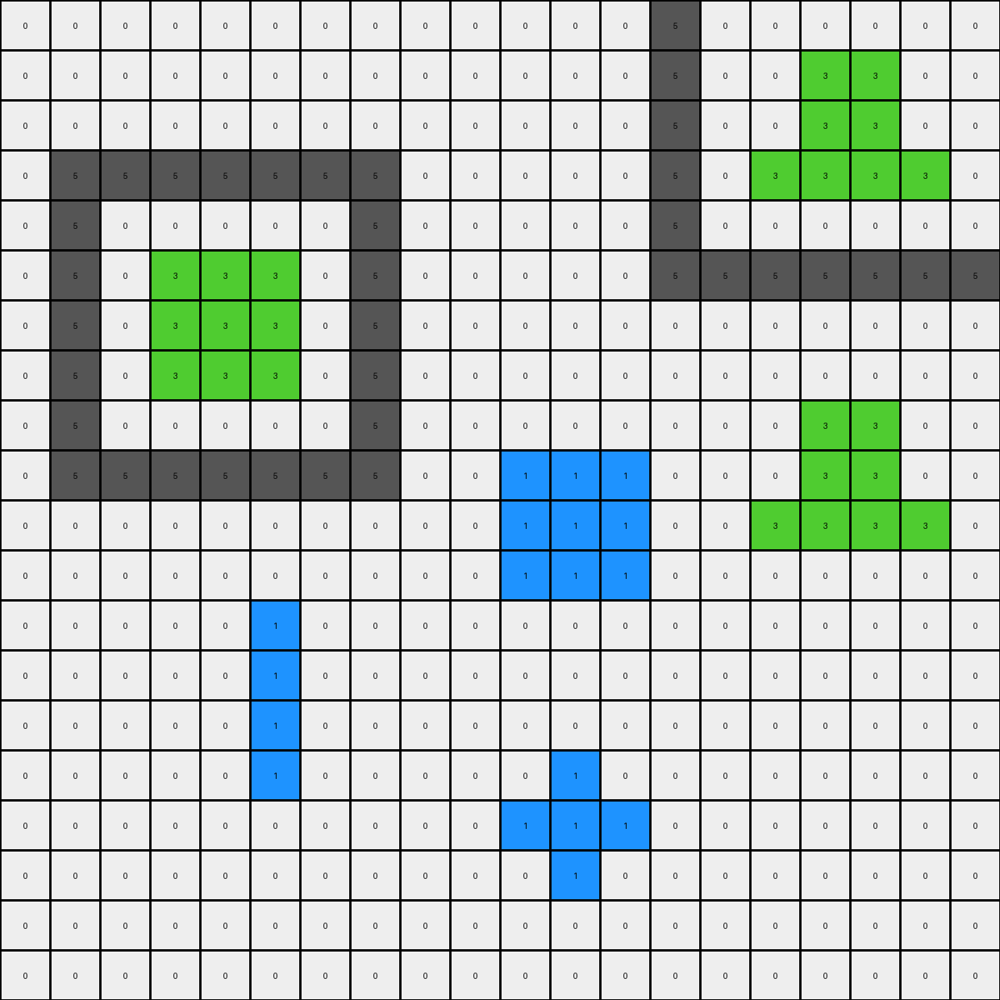

# 776ffc46 • 023 • refine_dreamer

---


Previous Code:
```python
"""
1.  **Identify Objects:** Find all contiguous regions of pixels with the same color (objects).
2.  **Locate Target Object:**
    *   Identify the large 'island' object, meaning objects with other colors forming a boundary.
    *   Find the small blue "island" or "peninsula" object near the bottom of the image. This is the "target object".
3. **Transform Object**. Find the target object, and change all pixels to color green (3).
4.  **Output:** The output grid is identical to the input grid, except for the target object pixels, which are changed from blue to green.
"""

import numpy as np

def find_objects(grid):
    """
    Finds all contiguous regions of the same color.
    Returns a dictionary where keys are colors and values are lists of object coordinates.
    """
    visited = set()
    objects = {}

    def dfs(r, c, color, current_object):
        if (r, c) in visited or not (0 <= r < grid.shape[0] and 0 <= c < grid.shape[1]) or grid[r, c] != color:
            return
        visited.add((r, c))
        current_object.append((r, c))
        dfs(r + 1, c, color, current_object)
        dfs(r - 1, c, color, current_object)
        dfs(r, c + 1, color, current_object)
        dfs(r, c - 1, color, current_object)

    for r in range(grid.shape[0]):
        for c in range(grid.shape[1]):
            color = grid[r, c]
            if (r, c) not in visited:
                current_object = []
                dfs(r, c, color, current_object)
                if color not in objects:
                    objects[color] = []
                objects[color].append(current_object)
    return objects

def find_target_object(objects, grid):
    """
    Identifies the target object (small blue island/peninsula near the bottom).
    """
    if 1 not in objects:  # No blue objects
        return None

    blue_objects = objects[1]
    if not blue_objects:
        return None

    # Find the lowest row index among all blue objects
    min_row = grid.shape[0]
    for obj in blue_objects:
      for r, c in obj:
          min_row = min(min_row, r)
    
    # Select the blue object closest to the bottom
    target_object = None
    for obj in blue_objects:
       for r,c in obj:
           if r == min_row: # prioritize the lowest object
              target_object = obj
              break # if we assume there is one target object

    return target_object

def transform(input_grid):
    # initialize output_grid
    output_grid = np.copy(input_grid)

    # Find all objects
    objects = find_objects(input_grid)

    # Locate the target object (small blue island/peninsula)
    target_object = find_target_object(objects, input_grid)

    # Change the target object's color to green
    if target_object:
        for r, c in target_object:
            output_grid[r, c] = 3

    return output_grid
```

Train Set Results:

## Example 1:

Input:
```
5 5 5 5 5 5 5 0 0 0 0 0 0 0 0 0 0 0 0 0
5 0 0 0 0 0 5 0 0 0 0 0 0 1 1 1 0 0 0 0
5 0 0 2 0 0 5 0 0 0 0 0 0 1 1 1 0 0 0 0
5 0 2 2 2 0 5 0 0 0 0 0 0 1 1 1 0 0 0 0
5 0 0 2 0 0 5 0 0 0 0 0 0 0 0 0 0 0 0 0
5 0 0 0 0 0 5 0 0 0 0 0 0 0 0 0 0 0 0 0
5 5 5 5 5 5 5 0 0 0 0 0 0 0 0 0 0 0 0 0
0 0 0 0 0 0 0 0 0 0 0 1 0 0 0 0 0 0 0 0
0 0 0 0 0 0 0 0 0 0 1 1 1 0 0 0 0 0 0 0
0 0 0 0 0 0 0 0 0 0 0 1 0 0 0 0 0 0 0 0
0 0 0 0 0 0 0 0 0 0 0 0 0 0 0 0 0 0 0 0
0 0 0 0 0 0 0 0 0 0 0 0 0 0 0 0 0 0 0 0
0 0 0 1 1 1 1 0 0 0 0 0 0 0 0 0 0 0 0 0
0 0 0 0 0 0 0 0 0 0 0 0 0 0 0 0 0 0 0 0
0 0 0 0 0 0 0 0 0 0 0 0 0 0 0 0 0 0 0 0
0 0 0 0 0 0 0 0 0 0 0 0 0 0 1 0 0 0 0 0
0 0 0 0 0 0 0 0 0 0 0 0 0 1 1 1 0 0 0 0
0 0 0 0 0 0 0 0 0 0 0 0 0 0 1 0 0 0 0 0
0 0 0 0 0 0 0 0 0 0 0 0 0 0 0 0 0 0 0 0
0 0 0 0 0 0 0 0 0 0 0 0 0 0 0 0 0 0 0 0
```
Expected Output:
```
5 5 5 5 5 5 5 0 0 0 0 0 0 0 0 0 0 0 0 0
5 0 0 0 0 0 5 0 0 0 0 0 0 1 1 1 0 0 0 0
5 0 0 2 0 0 5 0 0 0 0 0 0 1 1 1 0 0 0 0
5 0 2 2 2 0 5 0 0 0 0 0 0 1 1 1 0 0 0 0
5 0 0 2 0 0 5 0 0 0 0 0 0 0 0 0 0 0 0 0
5 0 0 0 0 0 5 0 0 0 0 0 0 0 0 0 0 0 0 0
5 5 5 5 5 5 5 0 0 0 0 0 0 0 0 0 0 0 0 0
0 0 0 0 0 0 0 0 0 0 0 2 0 0 0 0 0 0 0 0
0 0 0 0 0 0 0 0 0 0 2 2 2 0 0 0 0 0 0 0
0 0 0 0 0 0 0 0 0 0 0 2 0 0 0 0 0 0 0 0
0 0 0 0 0 0 0 0 0 0 0 0 0 0 0 0 0 0 0 0
0 0 0 0 0 0 0 0 0 0 0 0 0 0 0 0 0 0 0 0
0 0 0 1 1 1 1 0 0 0 0 0 0 0 0 0 0 0 0 0
0 0 0 0 0 0 0 0 0 0 0 0 0 0 0 0 0 0 0 0
0 0 0 0 0 0 0 0 0 0 0 0 0 0 0 0 0 0 0 0
0 0 0 0 0 0 0 0 0 0 0 0 0 0 2 0 0 0 0 0
0 0 0 0 0 0 0 0 0 0 0 0 0 2 2 2 0 0 0 0
0 0 0 0 0 0 0 0 0 0 0 0 0 0 2 0 0 0 0 0
0 0 0 0 0 0 0 0 0 0 0 0 0 0 0 0 0 0 0 0
0 0 0 0 0 0 0 0 0 0 0 0 0 0 0 0 0 0 0 0
```
Transformed Output:
```
5 5 5 5 5 5 5 0 0 0 0 0 0 0 0 0 0 0 0 0
5 0 0 0 0 0 5 0 0 0 0 0 0 3 3 3 0 0 0 0
5 0 0 2 0 0 5 0 0 0 0 0 0 3 3 3 0 0 0 0
5 0 2 2 2 0 5 0 0 0 0 0 0 3 3 3 0 0 0 0
5 0 0 2 0 0 5 0 0 0 0 0 0 0 0 0 0 0 0 0
5 0 0 0 0 0 5 0 0 0 0 0 0 0 0 0 0 0 0 0
5 5 5 5 5 5 5 0 0 0 0 0 0 0 0 0 0 0 0 0
0 0 0 0 0 0 0 0 0 0 0 1 0 0 0 0 0 0 0 0
0 0 0 0 0 0 0 0 0 0 1 1 1 0 0 0 0 0 0 0
0 0 0 0 0 0 0 0 0 0 0 1 0 0 0 0 0 0 0 0
0 0 0 0 0 0 0 0 0 0 0 0 0 0 0 0 0 0 0 0
0 0 0 0 0 0 0 0 0 0 0 0 0 0 0 0 0 0 0 0
0 0 0 1 1 1 1 0 0 0 0 0 0 0 0 0 0 0 0 0
0 0 0 0 0 0 0 0 0 0 0 0 0 0 0 0 0 0 0 0
0 0 0 0 0 0 0 0 0 0 0 0 0 0 0 0 0 0 0 0
0 0 0 0 0 0 0 0 0 0 0 0 0 0 1 0 0 0 0 0
0 0 0 0 0 0 0 0 0 0 0 0 0 1 1 1 0 0 0 0
0 0 0 0 0 0 0 0 0 0 0 0 0 0 1 0 0 0 0 0
0 0 0 0 0 0 0 0 0 0 0 0 0 0 0 0 0 0 0 0
0 0 0 0 0 0 0 0 0 0 0 0 0 0 0 0 0 0 0 0
```

match: False
pixels_off: 19
size_correct: True
color_palette_correct: False
correct_pixel_counts: False

## Example 2:

Input:
```
0 0 0 0 0 0 0 0 0 0 0 0 0 0 0 0 0 0 0 0
0 0 0 0 0 5 5 5 5 5 5 5 0 0 0 0 0 0 0 0
0 0 0 0 0 5 0 0 0 0 0 5 0 0 0 0 0 0 0 0
0 0 0 0 0 5 0 3 3 3 0 5 0 0 0 0 0 0 0 0
0 0 0 0 0 5 0 3 3 3 0 5 0 0 0 0 0 0 0 0
0 0 0 0 0 5 0 3 3 3 0 5 0 0 0 0 0 0 0 0
0 0 0 0 0 5 0 0 0 0 0 5 0 0 0 0 0 0 0 0
0 0 0 0 0 5 5 5 5 5 5 5 0 0 0 0 0 0 0 0
0 0 0 0 0 0 0 0 0 0 0 0 0 0 0 0 0 0 0 0
0 0 0 0 0 0 0 0 0 0 0 0 0 0 0 1 1 1 0 0
0 0 0 0 0 0 0 0 0 0 0 0 0 0 0 1 1 1 0 0
0 0 0 0 0 0 0 0 0 0 0 1 0 0 0 1 1 1 0 0
0 0 0 1 1 1 0 0 0 0 0 1 0 0 0 0 0 0 0 0
0 0 0 1 1 1 0 0 0 0 0 1 0 0 0 0 0 0 0 0
0 0 0 1 1 1 0 0 0 0 0 0 0 0 0 0 0 0 0 0
0 0 0 0 0 0 0 0 0 0 0 0 0 0 0 0 0 0 0 0
0 0 0 0 0 0 0 0 0 0 0 0 1 0 0 0 0 0 0 0
0 0 0 0 0 0 0 0 0 0 0 1 1 1 0 0 0 0 0 0
0 0 0 0 0 0 0 0 0 0 1 1 1 1 1 0 0 0 0 0
0 0 0 0 0 0 0 0 0 0 0 0 0 0 0 0 0 0 0 0
```
Expected Output:
```
0 0 0 0 0 0 0 0 0 0 0 0 0 0 0 0 0 0 0 0
0 0 0 0 0 5 5 5 5 5 5 5 0 0 0 0 0 0 0 0
0 0 0 0 0 5 0 0 0 0 0 5 0 0 0 0 0 0 0 0
0 0 0 0 0 5 0 3 3 3 0 5 0 0 0 0 0 0 0 0
0 0 0 0 0 5 0 3 3 3 0 5 0 0 0 0 0 0 0 0
0 0 0 0 0 5 0 3 3 3 0 5 0 0 0 0 0 0 0 0
0 0 0 0 0 5 0 0 0 0 0 5 0 0 0 0 0 0 0 0
0 0 0 0 0 5 5 5 5 5 5 5 0 0 0 0 0 0 0 0
0 0 0 0 0 0 0 0 0 0 0 0 0 0 0 0 0 0 0 0
0 0 0 0 0 0 0 0 0 0 0 0 0 0 0 3 3 3 0 0
0 0 0 0 0 0 0 0 0 0 0 0 0 0 0 3 3 3 0 0
0 0 0 0 0 0 0 0 0 0 0 1 0 0 0 3 3 3 0 0
0 0 0 3 3 3 0 0 0 0 0 1 0 0 0 0 0 0 0 0
0 0 0 3 3 3 0 0 0 0 0 1 0 0 0 0 0 0 0 0
0 0 0 3 3 3 0 0 0 0 0 0 0 0 0 0 0 0 0 0
0 0 0 0 0 0 0 0 0 0 0 0 0 0 0 0 0 0 0 0
0 0 0 0 0 0 0 0 0 0 0 0 1 0 0 0 0 0 0 0
0 0 0 0 0 0 0 0 0 0 0 1 1 1 0 0 0 0 0 0
0 0 0 0 0 0 0 0 0 0 1 1 1 1 1 0 0 0 0 0
0 0 0 0 0 0 0 0 0 0 0 0 0 0 0 0 0 0 0 0
```
Transformed Output:
```
0 0 0 0 0 0 0 0 0 0 0 0 0 0 0 0 0 0 0 0
0 0 0 0 0 5 5 5 5 5 5 5 0 0 0 0 0 0 0 0
0 0 0 0 0 5 0 0 0 0 0 5 0 0 0 0 0 0 0 0
0 0 0 0 0 5 0 3 3 3 0 5 0 0 0 0 0 0 0 0
0 0 0 0 0 5 0 3 3 3 0 5 0 0 0 0 0 0 0 0
0 0 0 0 0 5 0 3 3 3 0 5 0 0 0 0 0 0 0 0
0 0 0 0 0 5 0 0 0 0 0 5 0 0 0 0 0 0 0 0
0 0 0 0 0 5 5 5 5 5 5 5 0 0 0 0 0 0 0 0
0 0 0 0 0 0 0 0 0 0 0 0 0 0 0 0 0 0 0 0
0 0 0 0 0 0 0 0 0 0 0 0 0 0 0 3 3 3 0 0
0 0 0 0 0 0 0 0 0 0 0 0 0 0 0 3 3 3 0 0
0 0 0 0 0 0 0 0 0 0 0 1 0 0 0 3 3 3 0 0
0 0 0 1 1 1 0 0 0 0 0 1 0 0 0 0 0 0 0 0
0 0 0 1 1 1 0 0 0 0 0 1 0 0 0 0 0 0 0 0
0 0 0 1 1 1 0 0 0 0 0 0 0 0 0 0 0 0 0 0
0 0 0 0 0 0 0 0 0 0 0 0 0 0 0 0 0 0 0 0
0 0 0 0 0 0 0 0 0 0 0 0 1 0 0 0 0 0 0 0
0 0 0 0 0 0 0 0 0 0 0 1 1 1 0 0 0 0 0 0
0 0 0 0 0 0 0 0 0 0 1 1 1 1 1 0 0 0 0 0
0 0 0 0 0 0 0 0 0 0 0 0 0 0 0 0 0 0 0 0
```

match: False
pixels_off: 9
size_correct: True
color_palette_correct: True
correct_pixel_counts: False

## Example 3:

Input:
```
0 0 0 0 0 5 0 0 0 0 0 0 0 5 5 5 5 5 5 5
0 0 2 0 0 5 0 0 0 0 0 0 0 5 0 0 0 0 0 5
0 0 2 0 0 5 0 0 0 0 0 0 0 5 0 2 2 2 0 5
0 0 2 0 0 5 0 0 0 0 0 0 0 5 0 2 2 2 0 5
0 0 0 0 0 5 0 0 0 0 0 0 0 5 0 0 0 0 0 5
5 5 5 5 5 5 0 0 0 0 0 0 0 5 0 0 0 0 0 5
0 0 0 0 0 0 0 0 0 0 0 0 0 5 5 5 5 5 5 5
0 0 0 0 0 0 0 0 0 0 0 0 0 0 0 0 0 0 0 0
0 0 0 0 0 0 0 0 0 0 0 0 0 0 0 0 0 0 0 0
0 0 0 0 0 0 0 0 0 0 0 0 0 0 0 0 0 0 0 0
0 0 0 0 1 0 0 0 0 0 0 0 0 0 0 0 0 0 0 0
0 0 0 0 1 0 0 0 0 0 1 1 1 0 0 0 0 0 0 0
0 0 0 0 1 0 0 0 0 0 1 1 1 0 0 0 0 0 0 0
0 0 0 0 0 0 0 0 0 0 0 0 0 0 0 0 0 0 0 0
0 0 0 0 0 0 0 0 0 0 0 0 0 0 0 0 0 0 0 0
0 0 0 0 0 0 0 0 1 0 0 0 0 0 0 0 0 0 0 0
0 0 1 1 1 0 0 1 1 1 0 0 0 0 0 0 0 0 0 0
0 0 1 1 1 0 0 0 1 0 0 0 0 0 0 0 0 0 0 0
0 0 0 0 0 0 0 0 0 0 0 0 0 0 0 0 0 0 0 0
0 0 0 0 0 0 0 0 0 0 0 0 0 0 0 0 0 0 0 0
```
Expected Output:
```
0 0 0 0 0 5 0 0 0 0 0 0 0 5 5 5 5 5 5 5
0 0 2 0 0 5 0 0 0 0 0 0 0 5 0 0 0 0 0 5
0 0 2 0 0 5 0 0 0 0 0 0 0 5 0 2 2 2 0 5
0 0 2 0 0 5 0 0 0 0 0 0 0 5 0 2 2 2 0 5
0 0 0 0 0 5 0 0 0 0 0 0 0 5 0 0 0 0 0 5
5 5 5 5 5 5 0 0 0 0 0 0 0 5 0 0 0 0 0 5
0 0 0 0 0 0 0 0 0 0 0 0 0 5 5 5 5 5 5 5
0 0 0 0 0 0 0 0 0 0 0 0 0 0 0 0 0 0 0 0
0 0 0 0 0 0 0 0 0 0 0 0 0 0 0 0 0 0 0 0
0 0 0 0 0 0 0 0 0 0 0 0 0 0 0 0 0 0 0 0
0 0 0 0 1 0 0 0 0 0 0 0 0 0 0 0 0 0 0 0
0 0 0 0 1 0 0 0 0 0 2 2 2 0 0 0 0 0 0 0
0 0 0 0 1 0 0 0 0 0 2 2 2 0 0 0 0 0 0 0
0 0 0 0 0 0 0 0 0 0 0 0 0 0 0 0 0 0 0 0
0 0 0 0 0 0 0 0 0 0 0 0 0 0 0 0 0 0 0 0
0 0 0 0 0 0 0 0 1 0 0 0 0 0 0 0 0 0 0 0
0 0 2 2 2 0 0 1 1 1 0 0 0 0 0 0 0 0 0 0
0 0 2 2 2 0 0 0 1 0 0 0 0 0 0 0 0 0 0 0
0 0 0 0 0 0 0 0 0 0 0 0 0 0 0 0 0 0 0 0
0 0 0 0 0 0 0 0 0 0 0 0 0 0 0 0 0 0 0 0
```
Transformed Output:
```
0 0 0 0 0 5 0 0 0 0 0 0 0 5 5 5 5 5 5 5
0 0 2 0 0 5 0 0 0 0 0 0 0 5 0 0 0 0 0 5
0 0 2 0 0 5 0 0 0 0 0 0 0 5 0 2 2 2 0 5
0 0 2 0 0 5 0 0 0 0 0 0 0 5 0 2 2 2 0 5
0 0 0 0 0 5 0 0 0 0 0 0 0 5 0 0 0 0 0 5
5 5 5 5 5 5 0 0 0 0 0 0 0 5 0 0 0 0 0 5
0 0 0 0 0 0 0 0 0 0 0 0 0 5 5 5 5 5 5 5
0 0 0 0 0 0 0 0 0 0 0 0 0 0 0 0 0 0 0 0
0 0 0 0 0 0 0 0 0 0 0 0 0 0 0 0 0 0 0 0
0 0 0 0 0 0 0 0 0 0 0 0 0 0 0 0 0 0 0 0
0 0 0 0 3 0 0 0 0 0 0 0 0 0 0 0 0 0 0 0
0 0 0 0 3 0 0 0 0 0 1 1 1 0 0 0 0 0 0 0
0 0 0 0 3 0 0 0 0 0 1 1 1 0 0 0 0 0 0 0
0 0 0 0 0 0 0 0 0 0 0 0 0 0 0 0 0 0 0 0
0 0 0 0 0 0 0 0 0 0 0 0 0 0 0 0 0 0 0 0
0 0 0 0 0 0 0 0 1 0 0 0 0 0 0 0 0 0 0 0
0 0 1 1 1 0 0 1 1 1 0 0 0 0 0 0 0 0 0 0
0 0 1 1 1 0 0 0 1 0 0 0 0 0 0 0 0 0 0 0
0 0 0 0 0 0 0 0 0 0 0 0 0 0 0 0 0 0 0 0
0 0 0 0 0 0 0 0 0 0 0 0 0 0 0 0 0 0 0 0
```

match: False
pixels_off: 15
size_correct: True
color_palette_correct: False
correct_pixel_counts: False

## Example 4:

Input:
```
0 0 0 0 0 0 0 0 0 0 0 0 0 5 0 0 0 0 0 0
0 0 0 0 0 0 0 0 0 0 0 0 0 5 0 0 3 3 0 0
0 0 0 0 0 0 0 0 0 0 0 0 0 5 0 0 3 3 0 0
0 5 5 5 5 5 5 5 0 0 0 0 0 5 0 3 3 3 3 0
0 5 0 0 0 0 0 5 0 0 0 0 0 5 0 0 0 0 0 0
0 5 0 3 3 3 0 5 0 0 0 0 0 5 5 5 5 5 5 5
0 5 0 3 3 3 0 5 0 0 0 0 0 0 0 0 0 0 0 0
0 5 0 3 3 3 0 5 0 0 0 0 0 0 0 0 0 0 0 0
0 5 0 0 0 0 0 5 0 0 0 0 0 0 0 0 1 1 0 0
0 5 5 5 5 5 5 5 0 0 1 1 1 0 0 0 1 1 0 0
0 0 0 0 0 0 0 0 0 0 1 1 1 0 0 1 1 1 1 0
0 0 0 0 0 0 0 0 0 0 1 1 1 0 0 0 0 0 0 0
0 0 0 0 0 1 0 0 0 0 0 0 0 0 0 0 0 0 0 0
0 0 0 0 0 1 0 0 0 0 0 0 0 0 0 0 0 0 0 0
0 0 0 0 0 1 0 0 0 0 0 0 0 0 0 0 0 0 0 0
0 0 0 0 0 1 0 0 0 0 0 1 0 0 0 0 0 0 0 0
0 0 0 0 0 0 0 0 0 0 1 1 1 0 0 0 0 0 0 0
0 0 0 0 0 0 0 0 0 0 0 1 0 0 0 0 0 0 0 0
0 0 0 0 0 0 0 0 0 0 0 0 0 0 0 0 0 0 0 0
0 0 0 0 0 0 0 0 0 0 0 0 0 0 0 0 0 0 0 0
```
Expected Output:
```
0 0 0 0 0 0 0 0 0 0 0 0 0 5 0 0 0 0 0 0
0 0 0 0 0 0 0 0 0 0 0 0 0 5 0 0 3 3 0 0
0 0 0 0 0 0 0 0 0 0 0 0 0 5 0 0 3 3 0 0
0 5 5 5 5 5 5 5 0 0 0 0 0 5 0 3 3 3 3 0
0 5 0 0 0 0 0 5 0 0 0 0 0 5 0 0 0 0 0 0
0 5 0 3 3 3 0 5 0 0 0 0 0 5 5 5 5 5 5 5
0 5 0 3 3 3 0 5 0 0 0 0 0 0 0 0 0 0 0 0
0 5 0 3 3 3 0 5 0 0 0 0 0 0 0 0 0 0 0 0
0 5 0 0 0 0 0 5 0 0 0 0 0 0 0 0 1 1 0 0
0 5 5 5 5 5 5 5 0 0 3 3 3 0 0 0 1 1 0 0
0 0 0 0 0 0 0 0 0 0 3 3 3 0 0 1 1 1 1 0
0 0 0 0 0 0 0 0 0 0 3 3 3 0 0 0 0 0 0 0
0 0 0 0 0 1 0 0 0 0 0 0 0 0 0 0 0 0 0 0
0 0 0 0 0 1 0 0 0 0 0 0 0 0 0 0 0 0 0 0
0 0 0 0 0 1 0 0 0 0 0 0 0 0 0 0 0 0 0 0
0 0 0 0 0 1 0 0 0 0 0 1 0 0 0 0 0 0 0 0
0 0 0 0 0 0 0 0 0 0 1 1 1 0 0 0 0 0 0 0
0 0 0 0 0 0 0 0 0 0 0 1 0 0 0 0 0 0 0 0
0 0 0 0 0 0 0 0 0 0 0 0 0 0 0 0 0 0 0 0
0 0 0 0 0 0 0 0 0 0 0 0 0 0 0 0 0 0 0 0
```
Transformed Output:
```
0 0 0 0 0 0 0 0 0 0 0 0 0 5 0 0 0 0 0 0
0 0 0 0 0 0 0 0 0 0 0 0 0 5 0 0 3 3 0 0
0 0 0 0 0 0 0 0 0 0 0 0 0 5 0 0 3 3 0 0
0 5 5 5 5 5 5 5 0 0 0 0 0 5 0 3 3 3 3 0
0 5 0 0 0 0 0 5 0 0 0 0 0 5 0 0 0 0 0 0
0 5 0 3 3 3 0 5 0 0 0 0 0 5 5 5 5 5 5 5
0 5 0 3 3 3 0 5 0 0 0 0 0 0 0 0 0 0 0 0
0 5 0 3 3 3 0 5 0 0 0 0 0 0 0 0 0 0 0 0
0 5 0 0 0 0 0 5 0 0 0 0 0 0 0 0 3 3 0 0
0 5 5 5 5 5 5 5 0 0 1 1 1 0 0 0 3 3 0 0
0 0 0 0 0 0 0 0 0 0 1 1 1 0 0 3 3 3 3 0
0 0 0 0 0 0 0 0 0 0 1 1 1 0 0 0 0 0 0 0
0 0 0 0 0 1 0 0 0 0 0 0 0 0 0 0 0 0 0 0
0 0 0 0 0 1 0 0 0 0 0 0 0 0 0 0 0 0 0 0
0 0 0 0 0 1 0 0 0 0 0 0 0 0 0 0 0 0 0 0
0 0 0 0 0 1 0 0 0 0 0 1 0 0 0 0 0 0 0 0
0 0 0 0 0 0 0 0 0 0 1 1 1 0 0 0 0 0 0 0
0 0 0 0 0 0 0 0 0 0 0 1 0 0 0 0 0 0 0 0
0 0 0 0 0 0 0 0 0 0 0 0 0 0 0 0 0 0 0 0
0 0 0 0 0 0 0 0 0 0 0 0 0 0 0 0 0 0 0 0
```

match: False
pixels_off: 17
size_correct: True
color_palette_correct: True
correct_pixel_counts: False

**INSTRUCTIONS**

The code above was generated based on observations from the first training
example

we have tested the transform function on each of the task example inputs and
compared with the expected output

review each of the examples provided and the results and consider how the
natural language program should be updated to accommodate this new knowledge

respond with the following deliverables:

- general assessment of the information provided and strategy for resolving the
  errors
- gather metrics about each of the examples and results - use code_execution to
  develop accurate reports on your assumptions
- a YAML block documenting facts - Focus on identifying objects, their properties, and the actions performed on them.
- a natural language program - Be as clear and concise as possible, providing a complete description of the transformation rule.


your responses should be considered as information in a report - not a
conversation
