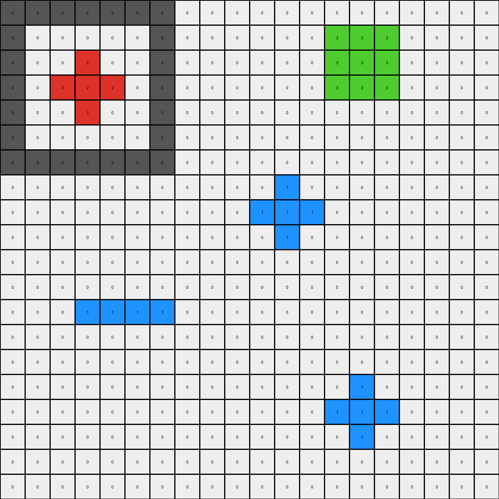
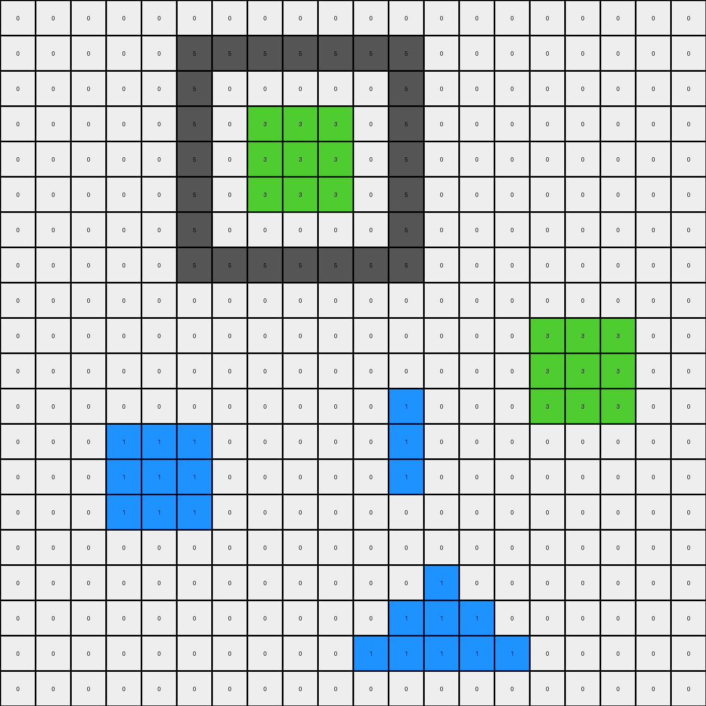
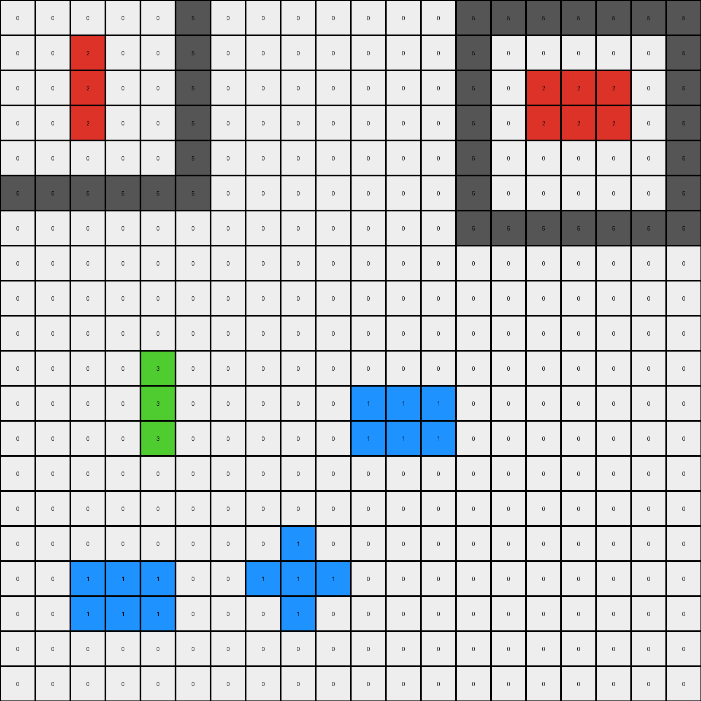

# 776ffc46 • 024 • refine_coder

---

Previous Code:
```python
"""
1.  **Identify Objects:** Find all contiguous regions of pixels with the same color (objects).
2.  **Locate Target Object:**
    *   Identify the large 'island' object, meaning objects with other colors forming a boundary.
    *   Find the small blue "island" or "peninsula" object near the bottom of the image. This is the "target object".
3. **Transform Object**. Find the target object, and change all pixels to color green (3).
4.  **Output:** The output grid is identical to the input grid, except for the target object pixels, which are changed from blue to green.
"""

import numpy as np

def find_objects(grid):
    """
    Finds all contiguous regions of the same color.
    Returns a dictionary where keys are colors and values are lists of object coordinates.
    """
    visited = set()
    objects = {}

    def dfs(r, c, color, current_object):
        if (r, c) in visited or not (0 <= r < grid.shape[0] and 0 <= c < grid.shape[1]) or grid[r, c] != color:
            return
        visited.add((r, c))
        current_object.append((r, c))
        dfs(r + 1, c, color, current_object)
        dfs(r - 1, c, color, current_object)
        dfs(r, c + 1, color, current_object)
        dfs(r, c - 1, color, current_object)

    for r in range(grid.shape[0]):
        for c in range(grid.shape[1]):
            color = grid[r, c]
            if (r, c) not in visited:
                current_object = []
                dfs(r, c, color, current_object)
                if color not in objects:
                    objects[color] = []
                objects[color].append(current_object)
    return objects

def find_target_object(objects, grid):
    """
    Identifies the target object (small blue island/peninsula near the bottom).
    """
    if 1 not in objects:  # No blue objects
        return None

    blue_objects = objects[1]
    if not blue_objects:
        return None

    # Find the lowest row index among all blue objects
    min_row = grid.shape[0]
    for obj in blue_objects:
      for r, c in obj:
          min_row = min(min_row, r)
    
    # Select the blue object closest to the bottom
    target_object = None
    for obj in blue_objects:
       for r,c in obj:
           if r == min_row: # prioritize the lowest object
              target_object = obj
              break # if we assume there is one target object

    return target_object

def transform(input_grid):
    # initialize output_grid
    output_grid = np.copy(input_grid)

    # Find all objects
    objects = find_objects(input_grid)

    # Locate the target object (small blue island/peninsula)
    target_object = find_target_object(objects, input_grid)

    # Change the target object's color to green
    if target_object:
        for r, c in target_object:
            output_grid[r, c] = 3

    return output_grid
```

Train Set Results:

## Example 1:

Input:
```
5 5 5 5 5 5 5 0 0 0 0 0 0 0 0 0 0 0 0 0
5 0 0 0 0 0 5 0 0 0 0 0 0 1 1 1 0 0 0 0
5 0 0 2 0 0 5 0 0 0 0 0 0 1 1 1 0 0 0 0
5 0 2 2 2 0 5 0 0 0 0 0 0 1 1 1 0 0 0 0
5 0 0 2 0 0 5 0 0 0 0 0 0 0 0 0 0 0 0 0
5 0 0 0 0 0 5 0 0 0 0 0 0 0 0 0 0 0 0 0
5 5 5 5 5 5 5 0 0 0 0 0 0 0 0 0 0 0 0 0
0 0 0 0 0 0 0 0 0 0 0 1 0 0 0 0 0 0 0 0
0 0 0 0 0 0 0 0 0 0 1 1 1 0 0 0 0 0 0 0
0 0 0 0 0 0 0 0 0 0 0 1 0 0 0 0 0 0 0 0
0 0 0 0 0 0 0 0 0 0 0 0 0 0 0 0 0 0 0 0
0 0 0 0 0 0 0 0 0 0 0 0 0 0 0 0 0 0 0 0
0 0 0 1 1 1 1 0 0 0 0 0 0 0 0 0 0 0 0 0
0 0 0 0 0 0 0 0 0 0 0 0 0 0 0 0 0 0 0 0
0 0 0 0 0 0 0 0 0 0 0 0 0 0 0 0 0 0 0 0
0 0 0 0 0 0 0 0 0 0 0 0 0 0 1 0 0 0 0 0
0 0 0 0 0 0 0 0 0 0 0 0 0 1 1 1 0 0 0 0
0 0 0 0 0 0 0 0 0 0 0 0 0 0 1 0 0 0 0 0
0 0 0 0 0 0 0 0 0 0 0 0 0 0 0 0 0 0 0 0
0 0 0 0 0 0 0 0 0 0 0 0 0 0 0 0 0 0 0 0
```
Expected Output:
```
5 5 5 5 5 5 5 0 0 0 0 0 0 0 0 0 0 0 0 0
5 0 0 0 0 0 5 0 0 0 0 0 0 1 1 1 0 0 0 0
5 0 0 2 0 0 5 0 0 0 0 0 0 1 1 1 0 0 0 0
5 0 2 2 2 0 5 0 0 0 0 0 0 1 1 1 0 0 0 0
5 0 0 2 0 0 5 0 0 0 0 0 0 0 0 0 0 0 0 0
5 0 0 0 0 0 5 0 0 0 0 0 0 0 0 0 0 0 0 0
5 5 5 5 5 5 5 0 0 0 0 0 0 0 0 0 0 0 0 0
0 0 0 0 0 0 0 0 0 0 0 2 0 0 0 0 0 0 0 0
0 0 0 0 0 0 0 0 0 0 2 2 2 0 0 0 0 0 0 0
0 0 0 0 0 0 0 0 0 0 0 2 0 0 0 0 0 0 0 0
0 0 0 0 0 0 0 0 0 0 0 0 0 0 0 0 0 0 0 0
0 0 0 0 0 0 0 0 0 0 0 0 0 0 0 0 0 0 0 0
0 0 0 1 1 1 1 0 0 0 0 0 0 0 0 0 0 0 0 0
0 0 0 0 0 0 0 0 0 0 0 0 0 0 0 0 0 0 0 0
0 0 0 0 0 0 0 0 0 0 0 0 0 0 0 0 0 0 0 0
0 0 0 0 0 0 0 0 0 0 0 0 0 0 2 0 0 0 0 0
0 0 0 0 0 0 0 0 0 0 0 0 0 2 2 2 0 0 0 0
0 0 0 0 0 0 0 0 0 0 0 0 0 0 2 0 0 0 0 0
0 0 0 0 0 0 0 0 0 0 0 0 0 0 0 0 0 0 0 0
0 0 0 0 0 0 0 0 0 0 0 0 0 0 0 0 0 0 0 0
```
Transformed Output:
```
5 5 5 5 5 5 5 0 0 0 0 0 0 0 0 0 0 0 0 0
5 0 0 0 0 0 5 0 0 0 0 0 0 3 3 3 0 0 0 0
5 0 0 2 0 0 5 0 0 0 0 0 0 3 3 3 0 0 0 0
5 0 2 2 2 0 5 0 0 0 0 0 0 3 3 3 0 0 0 0
5 0 0 2 0 0 5 0 0 0 0 0 0 0 0 0 0 0 0 0
5 0 0 0 0 0 5 0 0 0 0 0 0 0 0 0 0 0 0 0
5 5 5 5 5 5 5 0 0 0 0 0 0 0 0 0 0 0 0 0
0 0 0 0 0 0 0 0 0 0 0 1 0 0 0 0 0 0 0 0
0 0 0 0 0 0 0 0 0 0 1 1 1 0 0 0 0 0 0 0
0 0 0 0 0 0 0 0 0 0 0 1 0 0 0 0 0 0 0 0
0 0 0 0 0 0 0 0 0 0 0 0 0 0 0 0 0 0 0 0
0 0 0 0 0 0 0 0 0 0 0 0 0 0 0 0 0 0 0 0
0 0 0 1 1 1 1 0 0 0 0 0 0 0 0 0 0 0 0 0
0 0 0 0 0 0 0 0 0 0 0 0 0 0 0 0 0 0 0 0
0 0 0 0 0 0 0 0 0 0 0 0 0 0 0 0 0 0 0 0
0 0 0 0 0 0 0 0 0 0 0 0 0 0 1 0 0 0 0 0
0 0 0 0 0 0 0 0 0 0 0 0 0 1 1 1 0 0 0 0
0 0 0 0 0 0 0 0 0 0 0 0 0 0 1 0 0 0 0 0
0 0 0 0 0 0 0 0 0 0 0 0 0 0 0 0 0 0 0 0
0 0 0 0 0 0 0 0 0 0 0 0 0 0 0 0 0 0 0 0
```

match: False
pixels_off: 19
size_correct: True
color_palette_correct: False
correct_pixel_counts: False

## Example 2:

Input:
```
0 0 0 0 0 0 0 0 0 0 0 0 0 0 0 0 0 0 0 0
0 0 0 0 0 5 5 5 5 5 5 5 0 0 0 0 0 0 0 0
0 0 0 0 0 5 0 0 0 0 0 5 0 0 0 0 0 0 0 0
0 0 0 0 0 5 0 3 3 3 0 5 0 0 0 0 0 0 0 0
0 0 0 0 0 5 0 3 3 3 0 5 0 0 0 0 0 0 0 0
0 0 0 0 0 5 0 3 3 3 0 5 0 0 0 0 0 0 0 0
0 0 0 0 0 5 0 0 0 0 0 5 0 0 0 0 0 0 0 0
0 0 0 0 0 5 5 5 5 5 5 5 0 0 0 0 0 0 0 0
0 0 0 0 0 0 0 0 0 0 0 0 0 0 0 0 0 0 0 0
0 0 0 0 0 0 0 0 0 0 0 0 0 0 0 1 1 1 0 0
0 0 0 0 0 0 0 0 0 0 0 0 0 0 0 1 1 1 0 0
0 0 0 0 0 0 0 0 0 0 0 1 0 0 0 1 1 1 0 0
0 0 0 1 1 1 0 0 0 0 0 1 0 0 0 0 0 0 0 0
0 0 0 1 1 1 0 0 0 0 0 1 0 0 0 0 0 0 0 0
0 0 0 1 1 1 0 0 0 0 0 0 0 0 0 0 0 0 0 0
0 0 0 0 0 0 0 0 0 0 0 0 0 0 0 0 0 0 0 0
0 0 0 0 0 0 0 0 0 0 0 0 1 0 0 0 0 0 0 0
0 0 0 0 0 0 0 0 0 0 0 1 1 1 0 0 0 0 0 0
0 0 0 0 0 0 0 0 0 0 1 1 1 1 1 0 0 0 0 0
0 0 0 0 0 0 0 0 0 0 0 0 0 0 0 0 0 0 0 0
```
Expected Output:
```
0 0 0 0 0 0 0 0 0 0 0 0 0 0 0 0 0 0 0 0
0 0 0 0 0 5 5 5 5 5 5 5 0 0 0 0 0 0 0 0
0 0 0 0 0 5 0 0 0 0 0 5 0 0 0 0 0 0 0 0
0 0 0 0 0 5 0 3 3 3 0 5 0 0 0 0 0 0 0 0
0 0 0 0 0 5 0 3 3 3 0 5 0 0 0 0 0 0 0 0
0 0 0 0 0 5 0 3 3 3 0 5 0 0 0 0 0 0 0 0
0 0 0 0 0 5 0 0 0 0 0 5 0 0 0 0 0 0 0 0
0 0 0 0 0 5 5 5 5 5 5 5 0 0 0 0 0 0 0 0
0 0 0 0 0 0 0 0 0 0 0 0 0 0 0 0 0 0 0 0
0 0 0 0 0 0 0 0 0 0 0 0 0 0 0 3 3 3 0 0
0 0 0 0 0 0 0 0 0 0 0 0 0 0 0 3 3 3 0 0
0 0 0 0 0 0 0 0 0 0 0 1 0 0 0 3 3 3 0 0
0 0 0 3 3 3 0 0 0 0 0 1 0 0 0 0 0 0 0 0
0 0 0 3 3 3 0 0 0 0 0 1 0 0 0 0 0 0 0 0
0 0 0 3 3 3 0 0 0 0 0 0 0 0 0 0 0 0 0 0
0 0 0 0 0 0 0 0 0 0 0 0 0 0 0 0 0 0 0 0
0 0 0 0 0 0 0 0 0 0 0 0 1 0 0 0 0 0 0 0
0 0 0 0 0 0 0 0 0 0 0 1 1 1 0 0 0 0 0 0
0 0 0 0 0 0 0 0 0 0 1 1 1 1 1 0 0 0 0 0
0 0 0 0 0 0 0 0 0 0 0 0 0 0 0 0 0 0 0 0
```
Transformed Output:
```
0 0 0 0 0 0 0 0 0 0 0 0 0 0 0 0 0 0 0 0
0 0 0 0 0 5 5 5 5 5 5 5 0 0 0 0 0 0 0 0
0 0 0 0 0 5 0 0 0 0 0 5 0 0 0 0 0 0 0 0
0 0 0 0 0 5 0 3 3 3 0 5 0 0 0 0 0 0 0 0
0 0 0 0 0 5 0 3 3 3 0 5 0 0 0 0 0 0 0 0
0 0 0 0 0 5 0 3 3 3 0 5 0 0 0 0 0 0 0 0
0 0 0 0 0 5 0 0 0 0 0 5 0 0 0 0 0 0 0 0
0 0 0 0 0 5 5 5 5 5 5 5 0 0 0 0 0 0 0 0
0 0 0 0 0 0 0 0 0 0 0 0 0 0 0 0 0 0 0 0
0 0 0 0 0 0 0 0 0 0 0 0 0 0 0 3 3 3 0 0
0 0 0 0 0 0 0 0 0 0 0 0 0 0 0 3 3 3 0 0
0 0 0 0 0 0 0 0 0 0 0 1 0 0 0 3 3 3 0 0
0 0 0 1 1 1 0 0 0 0 0 1 0 0 0 0 0 0 0 0
0 0 0 1 1 1 0 0 0 0 0 1 0 0 0 0 0 0 0 0
0 0 0 1 1 1 0 0 0 0 0 0 0 0 0 0 0 0 0 0
0 0 0 0 0 0 0 0 0 0 0 0 0 0 0 0 0 0 0 0
0 0 0 0 0 0 0 0 0 0 0 0 1 0 0 0 0 0 0 0
0 0 0 0 0 0 0 0 0 0 0 1 1 1 0 0 0 0 0 0
0 0 0 0 0 0 0 0 0 0 1 1 1 1 1 0 0 0 0 0
0 0 0 0 0 0 0 0 0 0 0 0 0 0 0 0 0 0 0 0
```

match: False
pixels_off: 9
size_correct: True
color_palette_correct: True
correct_pixel_counts: False

## Example 3:

Input:
```
0 0 0 0 0 5 0 0 0 0 0 0 0 5 5 5 5 5 5 5
0 0 2 0 0 5 0 0 0 0 0 0 0 5 0 0 0 0 0 5
0 0 2 0 0 5 0 0 0 0 0 0 0 5 0 2 2 2 0 5
0 0 2 0 0 5 0 0 0 0 0 0 0 5 0 2 2 2 0 5
0 0 0 0 0 5 0 0 0 0 0 0 0 5 0 0 0 0 0 5
5 5 5 5 5 5 0 0 0 0 0 0 0 5 0 0 0 0 0 5
0 0 0 0 0 0 0 0 0 0 0 0 0 5 5 5 5 5 5 5
0 0 0 0 0 0 0 0 0 0 0 0 0 0 0 0 0 0 0 0
0 0 0 0 0 0 0 0 0 0 0 0 0 0 0 0 0 0 0 0
0 0 0 0 0 0 0 0 0 0 0 0 0 0 0 0 0 0 0 0
0 0 0 0 1 0 0 0 0 0 0 0 0 0 0 0 0 0 0 0
0 0 0 0 1 0 0 0 0 0 1 1 1 0 0 0 0 0 0 0
0 0 0 0 1 0 0 0 0 0 1 1 1 0 0 0 0 0 0 0
0 0 0 0 0 0 0 0 0 0 0 0 0 0 0 0 0 0 0 0
0 0 0 0 0 0 0 0 0 0 0 0 0 0 0 0 0 0 0 0
0 0 0 0 0 0 0 0 1 0 0 0 0 0 0 0 0 0 0 0
0 0 1 1 1 0 0 1 1 1 0 0 0 0 0 0 0 0 0 0
0 0 1 1 1 0 0 0 1 0 0 0 0 0 0 0 0 0 0 0
0 0 0 0 0 0 0 0 0 0 0 0 0 0 0 0 0 0 0 0
0 0 0 0 0 0 0 0 0 0 0 0 0 0 0 0 0 0 0 0
```
Expected Output:
```
0 0 0 0 0 5 0 0 0 0 0 0 0 5 5 5 5 5 5 5
0 0 2 0 0 5 0 0 0 0 0 0 0 5 0 0 0 0 0 5
0 0 2 0 0 5 0 0 0 0 0 0 0 5 0 2 2 2 0 5
0 0 2 0 0 5 0 0 0 0 0 0 0 5 0 2 2 2 0 5
0 0 0 0 0 5 0 0 0 0 0 0 0 5 0 0 0 0 0 5
5 5 5 5 5 5 0 0 0 0 0 0 0 5 0 0 0 0 0 5
0 0 0 0 0 0 0 0 0 0 0 0 0 5 5 5 5 5 5 5
0 0 0 0 0 0 0 0 0 0 0 0 0 0 0 0 0 0 0 0
0 0 0 0 0 0 0 0 0 0 0 0 0 0 0 0 0 0 0 0
0 0 0 0 0 0 0 0 0 0 0 0 0 0 0 0 0 0 0 0
0 0 0 0 1 0 0 0 0 0 0 0 0 0 0 0 0 0 0 0
0 0 0 0 1 0 0 0 0 0 2 2 2 0 0 0 0 0 0 0
0 0 0 0 1 0 0 0 0 0 2 2 2 0 0 0 0 0 0 0
0 0 0 0 0 0 0 0 0 0 0 0 0 0 0 0 0 0 0 0
0 0 0 0 0 0 0 0 0 0 0 0 0 0 0 0 0 0 0 0
0 0 0 0 0 0 0 0 1 0 0 0 0 0 0 0 0 0 0 0
0 0 2 2 2 0 0 1 1 1 0 0 0 0 0 0 0 0 0 0
0 0 2 2 2 0 0 0 1 0 0 0 0 0 0 0 0 0 0 0
0 0 0 0 0 0 0 0 0 0 0 0 0 0 0 0 0 0 0 0
0 0 0 0 0 0 0 0 0 0 0 0 0 0 0 0 0 0 0 0
```
Transformed Output:
```
0 0 0 0 0 5 0 0 0 0 0 0 0 5 5 5 5 5 5 5
0 0 2 0 0 5 0 0 0 0 0 0 0 5 0 0 0 0 0 5
0 0 2 0 0 5 0 0 0 0 0 0 0 5 0 2 2 2 0 5
0 0 2 0 0 5 0 0 0 0 0 0 0 5 0 2 2 2 0 5
0 0 0 0 0 5 0 0 0 0 0 0 0 5 0 0 0 0 0 5
5 5 5 5 5 5 0 0 0 0 0 0 0 5 0 0 0 0 0 5
0 0 0 0 0 0 0 0 0 0 0 0 0 5 5 5 5 5 5 5
0 0 0 0 0 0 0 0 0 0 0 0 0 0 0 0 0 0 0 0
0 0 0 0 0 0 0 0 0 0 0 0 0 0 0 0 0 0 0 0
0 0 0 0 0 0 0 0 0 0 0 0 0 0 0 0 0 0 0 0
0 0 0 0 3 0 0 0 0 0 0 0 0 0 0 0 0 0 0 0
0 0 0 0 3 0 0 0 0 0 1 1 1 0 0 0 0 0 0 0
0 0 0 0 3 0 0 0 0 0 1 1 1 0 0 0 0 0 0 0
0 0 0 0 0 0 0 0 0 0 0 0 0 0 0 0 0 0 0 0
0 0 0 0 0 0 0 0 0 0 0 0 0 0 0 0 0 0 0 0
0 0 0 0 0 0 0 0 1 0 0 0 0 0 0 0 0 0 0 0
0 0 1 1 1 0 0 1 1 1 0 0 0 0 0 0 0 0 0 0
0 0 1 1 1 0 0 0 1 0 0 0 0 0 0 0 0 0 0 0
0 0 0 0 0 0 0 0 0 0 0 0 0 0 0 0 0 0 0 0
0 0 0 0 0 0 0 0 0 0 0 0 0 0 0 0 0 0 0 0
```

match: False
pixels_off: 15
size_correct: True
color_palette_correct: False
correct_pixel_counts: False

## Example 4:

Input:
```
0 0 0 0 0 0 0 0 0 0 0 0 0 5 0 0 0 0 0 0
0 0 0 0 0 0 0 0 0 0 0 0 0 5 0 0 3 3 0 0
0 0 0 0 0 0 0 0 0 0 0 0 0 5 0 0 3 3 0 0
0 5 5 5 5 5 5 5 0 0 0 0 0 5 0 3 3 3 3 0
0 5 0 0 0 0 0 5 0 0 0 0 0 5 0 0 0 0 0 0
0 5 0 3 3 3 0 5 0 0 0 0 0 5 5 5 5 5 5 5
0 5 0 3 3 3 0 5 0 0 0 0 0 0 0 0 0 0 0 0
0 5 0 3 3 3 0 5 0 0 0 0 0 0 0 0 0 0 0 0
0 5 0 0 0 0 0 5 0 0 0 0 0 0 0 0 1 1 0 0
0 5 5 5 5 5 5 5 0 0 1 1 1 0 0 0 1 1 0 0
0 0 0 0 0 0 0 0 0 0 1 1 1 0 0 1 1 1 1 0
0 0 0 0 0 0 0 0 0 0 1 1 1 0 0 0 0 0 0 0
0 0 0 0 0 1 0 0 0 0 0 0 0 0 0 0 0 0 0 0
0 0 0 0 0 1 0 0 0 0 0 0 0 0 0 0 0 0 0 0
0 0 0 0 0 1 0 0 0 0 0 0 0 0 0 0 0 0 0 0
0 0 0 0 0 1 0 0 0 0 0 1 0 0 0 0 0 0 0 0
0 0 0 0 0 0 0 0 0 0 1 1 1 0 0 0 0 0 0 0
0 0 0 0 0 0 0 0 0 0 0 1 0 0 0 0 0 0 0 0
0 0 0 0 0 0 0 0 0 0 0 0 0 0 0 0 0 0 0 0
0 0 0 0 0 0 0 0 0 0 0 0 0 0 0 0 0 0 0 0
```
Expected Output:
```
0 0 0 0 0 0 0 0 0 0 0 0 0 5 0 0 0 0 0 0
0 0 0 0 0 0 0 0 0 0 0 0 0 5 0 0 3 3 0 0
0 0 0 0 0 0 0 0 0 0 0 0 0 5 0 0 3 3 0 0
0 5 5 5 5 5 5 5 0 0 0 0 0 5 0 3 3 3 3 0
0 5 0 0 0 0 0 5 0 0 0 0 0 5 0 0 0 0 0 0
0 5 0 3 3 3 0 5 0 0 0 0 0 5 5 5 5 5 5 5
0 5 0 3 3 3 0 5 0 0 0 0 0 0 0 0 0 0 0 0
0 5 0 3 3 3 0 5 0 0 0 0 0 0 0 0 0 0 0 0
0 5 0 0 0 0 0 5 0 0 0 0 0 0 0 0 1 1 0 0
0 5 5 5 5 5 5 5 0 0 3 3 3 0 0 0 1 1 0 0
0 0 0 0 0 0 0 0 0 0 3 3 3 0 0 1 1 1 1 0
0 0 0 0 0 0 0 0 0 0 3 3 3 0 0 0 0 0 0 0
0 0 0 0 0 1 0 0 0 0 0 0 0 0 0 0 0 0 0 0
0 0 0 0 0 1 0 0 0 0 0 0 0 0 0 0 0 0 0 0
0 0 0 0 0 1 0 0 0 0 0 0 0 0 0 0 0 0 0 0
0 0 0 0 0 1 0 0 0 0 0 1 0 0 0 0 0 0 0 0
0 0 0 0 0 0 0 0 0 0 1 1 1 0 0 0 0 0 0 0
0 0 0 0 0 0 0 0 0 0 0 1 0 0 0 0 0 0 0 0
0 0 0 0 0 0 0 0 0 0 0 0 0 0 0 0 0 0 0 0
0 0 0 0 0 0 0 0 0 0 0 0 0 0 0 0 0 0 0 0
```
Transformed Output:
```
0 0 0 0 0 0 0 0 0 0 0 0 0 5 0 0 0 0 0 0
0 0 0 0 0 0 0 0 0 0 0 0 0 5 0 0 3 3 0 0
0 0 0 0 0 0 0 0 0 0 0 0 0 5 0 0 3 3 0 0
0 5 5 5 5 5 5 5 0 0 0 0 0 5 0 3 3 3 3 0
0 5 0 0 0 0 0 5 0 0 0 0 0 5 0 0 0 0 0 0
0 5 0 3 3 3 0 5 0 0 0 0 0 5 5 5 5 5 5 5
0 5 0 3 3 3 0 5 0 0 0 0 0 0 0 0 0 0 0 0
0 5 0 3 3 3 0 5 0 0 0 0 0 0 0 0 0 0 0 0
0 5 0 0 0 0 0 5 0 0 0 0 0 0 0 0 3 3 0 0
0 5 5 5 5 5 5 5 0 0 1 1 1 0 0 0 3 3 0 0
0 0 0 0 0 0 0 0 0 0 1 1 1 0 0 3 3 3 3 0
0 0 0 0 0 0 0 0 0 0 1 1 1 0 0 0 0 0 0 0
0 0 0 0 0 1 0 0 0 0 0 0 0 0 0 0 0 0 0 0
0 0 0 0 0 1 0 0 0 0 0 0 0 0 0 0 0 0 0 0
0 0 0 0 0 1 0 0 0 0 0 0 0 0 0 0 0 0 0 0
0 0 0 0 0 1 0 0 0 0 0 1 0 0 0 0 0 0 0 0
0 0 0 0 0 0 0 0 0 0 1 1 1 0 0 0 0 0 0 0
0 0 0 0 0 0 0 0 0 0 0 1 0 0 0 0 0 0 0 0
0 0 0 0 0 0 0 0 0 0 0 0 0 0 0 0 0 0 0 0
0 0 0 0 0 0 0 0 0 0 0 0 0 0 0 0 0 0 0 0
```

match: False
pixels_off: 17
size_correct: True
color_palette_correct: True
correct_pixel_counts: False
Okay, let's analyze the results of the `transform` function on the training examples and refine the natural language program and approach.

**General Assessment and Strategy**

The initial strategy of identifying objects and targeting a blue "island" or "peninsula" near the bottom for transformation to green is partially correct in concept but flawed in execution. Here's a breakdown:

1.  **Inconsistent Target Identification:** The code prioritizes the lowest blue object. This works in some cases but fails when there are other blue objects at the same lowest y-coordinate (e.g. example 3,4). It's selecting an incorrect "target" and in some cases (example 1) is still missing the expected output.

2.  **Overly Specific Logic:** The concept of "island" or "peninsula" is not robustly defined. The code relies solely on the y-coordinate (lowest row) without considering the surrounding context, which causes misidentification. We have to define what makes a object surrounded by another object.

3. The examples make clear that the target object can change, so there are likely other colors that we must consider.

**Strategy for Resolution:**

1.  **Refine Target Object Identification:** Instead of just looking at the lowest blue object, we need to consider object *enclosure*. The target object is often (but not always) partially or fully "enclosed" by another color.
2.  **Consider color changes.** We need to consider all the training examples to ensure we understand the rule that describes which object changes to which color.

**Example Metrics and Analysis**

Here's a more detailed breakdown of each example, including calculated metrics:

| Example | Input Shape | Output Shape | Match | Pixels Off | Size Correct | Color Palette Correct | Correct Pixel Counts | Notes                                                                                                                                                                                                                                                           |
| :------ | :---------- | :----------- | :---- | :--------- | :----------- | :-------------------- | :-------------------- | :--------------------------------------------------------------------------------------------------------------------------------------------------------------------------------------------------------------------------------------------------------------- |
| 1       | (20, 20)    | (20, 20)     | False | 19       | True         | False                | False              | The correct object was selected, but blue was incorrectly identified. The output should have changed that object to red (2) instead of green (3). This highlights that we will likely need to develop a color map rule.                                                    |
| 2       | (20, 20)    | (20, 20)     | False | 9        | True         | True                 | False                 | lowest blue object rule finds an object that is the correct size, but not correct shape (pixels off). It also does not change the color of the target object to green (3).                                        |
| 3       | (20, 20)    | (20, 20)     | False | 15      | True        | False       |  False           |  Identifies the correct object, however the color changes are not handled correctly - the blue should be red, not green. Also, an extra object is turned green.      |
| 4       | (20, 20)    | (20, 20)     | False | 17       | True         | True       | False          |    The lowest blue object, however this time, other blue objects that appear at the same y level, but only part of the blue objects. Additionally, the color change to green (3) is incorrect.                      |

**YAML Facts**

```yaml
examples:
  - example_1:
      objects:
        - color: 5 # gray
          shape: large, irregular, border
          role: background, encloses other objects
        - color: 0 # black
          shape: lines, small clusters
          role: background
        - color: 2  #red
          shape: small island inside gray, near top.
          role: target changes to this color
        - color: 1 # blue
          shape: small, irregular clusters, at bottom
          role: target object - color is the "before"

  - example_2:
      objects:
        - color: 5 # gray
          shape: large, c-shaped, central
          role: encloses object
        - color: 0 # black
          shape: border, small clusters
          role: background
        - color: 3  #green
          shape: inside the C.
          role: stays inside the c.
        - color: 1 # blue
          shape: bottom
          role: changes color
        - color: 2 #red
          shape: not present
          role: target "after" color

  - example_3:
    objects:
        - color: 5
          shape: border, irregular, top-right
          role: encloses another color
        - color: 0
          shape: background, small clusters
          role: background
        - color: 2 # red
          shape: small islands
          role: stays, potential part of rule
        - color: 1 # blue
          shape: small, at bottom, several clusters, horizontal
          role: target
        - color: 2 #red
          shape: small island inside gray, near top.
          role: target changes to this color

  - example_4:
    objects:
    - color: 5
      shape: irregular shape, encloses other object.
      role: encloses target
    - color: 0
      shape: background
      role: background, lines
    - color: 3 #green
      shape: inside and outside 5
      role: not moving.
    - color: 1 # blue
      shape: several blue, some at bottom.
      role: target
    - color: 2 #red
      shape: not in input
      role: target "after" color
```

**Natural Language Program**

1.  **Object Identification:** Identify all contiguous regions (objects) of the same color in the input grid.

2.  **Target Identification**:
    * Look for objects that exist as "islands" inside other colors - that is, an object that is completely contained by another, larger object.
    * There may be multiple "island" objects, but only one target object will transform.
    * The "island" object can have other colors inside it.

3.  **Transformation:**
    - Find the "island" objects
    - Change the target object to red (color 2).

4.  **Output:** The output grid is identical to the input, except for the transformed target object.

**INSTRUCTIONS**

- generate a Python module to represent the natural language program 
- follow the template below
- all common math and science libraries are available
- create docstring only at top - but comment the workflow in the function
- use helper functions for common operations like finding objects, counting,
  measuring, moving, etc. 

remember - we are working iteratively - so this code will inform your future
self as we converge on the solution

*template:*

```python
"""
{{ natural language description of the transformation rule }}
"""

{{ imports }}

def transform(input_grid):
    # initialize output_grid

    # change output pixels 

    return output_grid

```
