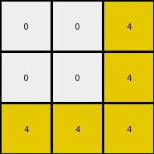

# 7837ac64 • 005 • refine_dreamer

---

Previous Code:
```python
"""
The transformation extracts a 3x3 subgrid from the input grid. The subgrid is identified
by a distinct 3x3 color pattern, prioritizing the top-leftmost occurrence if multiple
such patterns exist.
"""

import numpy as np

def find_distinct_3x3(input_grid):
    """
    Finds the top-leftmost 3x3 subgrid with a distinct color pattern.
    """
    rows, cols = input_grid.shape
    for r in range(rows - 2):
        for c in range(cols - 2):
            subgrid = input_grid[r:r+3, c:c+3]
            if is_distinct(subgrid):
                return r, c
    return None, None

def is_distinct(subgrid):
    """
    Checks if a 3x3 subgrid has a distinct color pattern.  This is a placeholder
    for a more robust pattern detection, which could involve checking for:
    - Diagonal color matches.
    - Specific corner colors.
    - Row/column color repetitions or alternations.
    - More than 'n' unique colors
    
    For this iteration it is more unique than solid colors.
    """
    unique_colors = np.unique(subgrid)
    return unique_colors.size > 1 and unique_colors.size < 9


def transform(input_grid):
    # Find the top-leftmost distinct 3x3 subgrid
    r, c = find_distinct_3x3(input_grid)

    # If no distinct subgrid is found, return a default 3x3 white grid
    if r is None or c is None:
        return np.zeros((3, 3), dtype=int)

    # Extract and return the 3x3 subgrid
    output_grid = input_grid[r:r+3, c:c+3]
    return output_grid
```

Train Set Results:

## Example 1:

Input:
```
0 0 4 0 0 4 0 0 4 0 0 4 0 0 4 0 0 4 0 0 4 0 0 4 0 0 4 0 0
0 0 4 0 0 4 0 0 4 0 0 4 0 0 4 0 0 4 0 0 4 0 0 4 0 0 4 0 0
4 4 4 4 4 4 4 4 4 4 4 4 4 4 4 4 4 4 4 4 4 4 4 4 4 4 4 4 4
0 0 4 0 0 4 0 0 4 0 0 4 0 0 4 0 0 4 0 0 4 0 0 4 0 0 4 0 0
0 0 4 0 0 4 0 0 4 0 0 4 0 0 4 0 0 4 0 0 4 0 0 4 0 0 4 0 0
4 4 4 4 4 1 4 4 1 4 4 3 4 4 3 4 4 4 4 4 4 4 4 4 4 4 4 4 4
0 0 4 0 0 4 0 0 4 0 0 4 0 0 4 0 0 4 0 0 4 0 0 4 0 0 4 0 0
0 0 4 0 0 4 0 0 4 0 0 4 0 0 4 0 0 4 0 0 4 0 0 4 0 0 4 0 0
4 4 4 4 4 1 4 4 1 4 4 3 4 4 3 4 4 4 4 4 4 4 4 4 4 4 4 4 4
0 0 4 0 0 4 0 0 4 0 0 4 0 0 4 0 0 4 0 0 4 0 0 4 0 0 4 0 0
0 0 4 0 0 4 0 0 4 0 0 4 0 0 4 0 0 4 0 0 4 0 0 4 0 0 4 0 0
4 4 4 4 4 1 4 4 1 4 4 4 4 4 4 4 4 4 4 4 4 4 4 4 4 4 4 4 4
0 0 4 0 0 4 0 0 4 0 0 4 0 0 4 0 0 4 0 0 4 0 0 4 0 0 4 0 0
0 0 4 0 0 4 0 0 4 0 0 4 0 0 4 0 0 4 0 0 4 0 0 4 0 0 4 0 0
4 4 4 4 4 1 4 4 1 4 4 4 4 4 4 4 4 4 4 4 4 4 4 4 4 4 4 4 4
0 0 4 0 0 4 0 0 4 0 0 4 0 0 4 0 0 4 0 0 4 0 0 4 0 0 4 0 0
0 0 4 0 0 4 0 0 4 0 0 4 0 0 4 0 0 4 0 0 4 0 0 4 0 0 4 0 0
4 4 4 4 4 4 4 4 4 4 4 4 4 4 4 4 4 4 4 4 4 4 4 4 4 4 4 4 4
0 0 4 0 0 4 0 0 4 0 0 4 0 0 4 0 0 4 0 0 4 0 0 4 0 0 4 0 0
0 0 4 0 0 4 0 0 4 0 0 4 0 0 4 0 0 4 0 0 4 0 0 4 0 0 4 0 0
4 4 4 4 4 4 4 4 4 4 4 4 4 4 4 4 4 4 4 4 4 4 4 4 4 4 4 4 4
0 0 4 0 0 4 0 0 4 0 0 4 0 0 4 0 0 4 0 0 4 0 0 4 0 0 4 0 0
0 0 4 0 0 4 0 0 4 0 0 4 0 0 4 0 0 4 0 0 4 0 0 4 0 0 4 0 0
4 4 4 4 4 4 4 4 4 4 4 4 4 4 4 4 4 4 4 4 4 4 4 4 4 4 4 4 4
0 0 4 0 0 4 0 0 4 0 0 4 0 0 4 0 0 4 0 0 4 0 0 4 0 0 4 0 0
0 0 4 0 0 4 0 0 4 0 0 4 0 0 4 0 0 4 0 0 4 0 0 4 0 0 4 0 0
4 4 4 4 4 4 4 4 4 4 4 4 4 4 4 4 4 4 4 4 4 4 4 4 4 4 4 4 4
0 0 4 0 0 4 0 0 4 0 0 4 0 0 4 0 0 4 0 0 4 0 0 4 0 0 4 0 0
0 0 4 0 0 4 0 0 4 0 0 4 0 0 4 0 0 4 0 0 4 0 0 4 0 0 4 0 0
```
Expected Output:
```
1 0 3
1 0 0
1 0 0
```
Transformed Output:
```
0 0 4
0 0 4
4 4 4
```

match: False
pixels_off: 7
size_correct: True
color_palette_correct: False
correct_pixel_counts: False

## Example 2:

Input:
```
0 0 0 3 0 0 0 3 0 0 0 3 0 0 0 3 0 0 0 3 0 0 0 3 0 0 0
0 0 0 3 0 0 0 3 0 0 0 3 0 0 0 3 0 0 0 3 0 0 0 3 0 0 0
0 0 0 3 0 0 0 3 0 0 0 3 0 0 0 3 0 0 0 3 0 0 0 3 0 0 0
3 3 3 3 3 3 3 3 3 3 3 3 3 3 3 3 3 3 3 3 3 3 3 3 3 3 3
0 0 0 3 0 0 0 3 0 0 0 3 0 0 0 3 0 0 0 3 0 0 0 3 0 0 0
0 0 0 3 0 0 0 3 0 0 0 3 0 0 0 3 0 0 0 3 0 0 0 3 0 0 0
0 0 0 3 0 0 0 3 0 0 0 3 0 0 0 3 0 0 0 3 0 0 0 3 0 0 0
3 3 3 3 3 3 3 2 3 3 3 2 3 3 3 3 3 3 3 3 3 3 3 3 3 3 3
0 0 0 3 0 0 0 3 0 0 0 3 0 0 0 3 0 0 0 3 0 0 0 3 0 0 0
0 0 0 3 0 0 0 3 0 0 0 3 0 0 0 3 0 0 0 3 0 0 0 3 0 0 0
0 0 0 3 0 0 0 3 0 0 0 3 0 0 0 3 0 0 0 3 0 0 0 3 0 0 0
3 3 3 2 3 3 3 2 3 3 3 2 3 3 3 3 3 3 3 3 3 3 3 3 3 3 3
0 0 0 3 0 0 0 3 0 0 0 3 0 0 0 3 0 0 0 3 0 0 0 3 0 0 0
0 0 0 3 0 0 0 3 0 0 0 3 0 0 0 3 0 0 0 3 0 0 0 3 0 0 0
0 0 0 3 0 0 0 3 0 0 0 3 0 0 0 3 0 0 0 3 0 0 0 3 0 0 0
3 3 3 2 3 3 3 2 3 3 3 8 3 3 3 8 3 3 3 3 3 3 3 3 3 3 3
0 0 0 3 0 0 0 3 0 0 0 3 0 0 0 3 0 0 0 3 0 0 0 3 0 0 0
0 0 0 3 0 0 0 3 0 0 0 3 0 0 0 3 0 0 0 3 0 0 0 3 0 0 0
0 0 0 3 0 0 0 3 0 0 0 3 0 0 0 3 0 0 0 3 0 0 0 3 0 0 0
3 3 3 3 3 3 3 3 3 3 3 8 3 3 3 8 3 3 3 3 3 3 3 3 3 3 3
0 0 0 3 0 0 0 3 0 0 0 3 0 0 0 3 0 0 0 3 0 0 0 3 0 0 0
0 0 0 3 0 0 0 3 0 0 0 3 0 0 0 3 0 0 0 3 0 0 0 3 0 0 0
0 0 0 3 0 0 0 3 0 0 0 3 0 0 0 3 0 0 0 3 0 0 0 3 0 0 0
3 3 3 3 3 3 3 3 3 3 3 3 3 3 3 3 3 3 3 3 3 3 3 3 3 3 3
0 0 0 3 0 0 0 3 0 0 0 3 0 0 0 3 0 0 0 3 0 0 0 3 0 0 0
0 0 0 3 0 0 0 3 0 0 0 3 0 0 0 3 0 0 0 3 0 0 0 3 0 0 0
0 0 0 3 0 0 0 3 0 0 0 3 0 0 0 3 0 0 0 3 0 0 0 3 0 0 0
```
Expected Output:
```
0 2 0
2 0 0
0 0 8
```
Transformed Output:
```
0 0 3
0 0 3
0 0 3
```

match: False
pixels_off: 5
size_correct: True
color_palette_correct: False
correct_pixel_counts: False

## Example 3:

Input:
```
0 0 1 0 0 1 0 0 1 0 0 1 0 0 1 0 0 1 0 0 1 0 0 1 0 0 1 0 0
0 0 1 0 0 1 0 0 1 0 0 1 0 0 1 0 0 1 0 0 1 0 0 1 0 0 1 0 0
1 1 1 1 1 1 1 1 1 1 1 1 1 1 1 1 1 1 1 1 1 1 1 1 1 1 1 1 1
0 0 1 0 0 1 0 0 1 0 0 1 0 0 1 0 0 1 0 0 1 0 0 1 0 0 1 0 0
0 0 1 0 0 1 0 0 1 0 0 1 0 0 1 0 0 1 0 0 1 0 0 1 0 0 1 0 0
1 1 1 1 1 1 1 1 1 1 1 1 1 1 1 1 1 1 1 1 1 1 1 1 1 1 1 1 1
0 0 1 0 0 1 0 0 1 0 0 1 0 0 1 0 0 1 0 0 1 0 0 1 0 0 1 0 0
0 0 1 0 0 1 0 0 1 0 0 1 0 0 1 0 0 1 0 0 1 0 0 1 0 0 1 0 0
1 1 1 1 1 1 1 1 1 1 1 1 1 1 1 1 1 1 1 1 1 1 1 1 1 1 1 1 1
0 0 1 0 0 1 0 0 1 0 0 1 0 0 1 0 0 1 0 0 1 0 0 1 0 0 1 0 0
0 0 1 0 0 1 0 0 1 0 0 1 0 0 1 0 0 1 0 0 1 0 0 1 0 0 1 0 0
1 1 1 1 1 1 1 1 1 1 1 1 1 1 6 1 1 6 1 1 6 1 1 1 1 1 1 1 1
0 0 1 0 0 1 0 0 1 0 0 1 0 0 1 0 0 1 0 0 1 0 0 1 0 0 1 0 0
0 0 1 0 0 1 0 0 1 0 0 1 0 0 1 0 0 1 0 0 1 0 0 1 0 0 1 0 0
1 1 1 1 1 1 1 1 1 1 1 1 1 1 6 1 1 6 1 1 6 1 1 1 1 1 1 1 1
0 0 1 0 0 1 0 0 1 0 0 1 0 0 1 0 0 1 0 0 1 0 0 1 0 0 1 0 0
0 0 1 0 0 1 0 0 1 0 0 1 0 0 1 0 0 1 0 0 1 0 0 1 0 0 1 0 0
1 1 1 1 1 1 1 1 1 1 1 1 1 1 3 1 1 3 1 1 3 1 1 3 1 1 1 1 1
0 0 1 0 0 1 0 0 1 0 0 1 0 0 1 0 0 1 0 0 1 0 0 1 0 0 1 0 0
0 0 1 0 0 1 0 0 1 0 0 1 0 0 1 0 0 1 0 0 1 0 0 1 0 0 1 0 0
1 1 1 1 1 1 1 1 1 1 1 1 1 1 3 1 1 3 1 1 3 1 1 3 1 1 1 1 1
0 0 1 0 0 1 0 0 1 0 0 1 0 0 1 0 0 1 0 0 1 0 0 1 0 0 1 0 0
0 0 1 0 0 1 0 0 1 0 0 1 0 0 1 0 0 1 0 0 1 0 0 1 0 0 1 0 0
1 1 1 1 1 1 1 1 1 1 1 1 1 1 1 1 1 1 1 1 1 1 1 1 1 1 1 1 1
0 0 1 0 0 1 0 0 1 0 0 1 0 0 1 0 0 1 0 0 1 0 0 1 0 0 1 0 0
0 0 1 0 0 1 0 0 1 0 0 1 0 0 1 0 0 1 0 0 1 0 0 1 0 0 1 0 0
1 1 1 1 1 1 1 1 1 1 1 1 1 1 1 1 1 1 1 1 1 1 1 1 1 1 1 1 1
0 0 1 0 0 1 0 0 1 0 0 1 0 0 1 0 0 1 0 0 1 0 0 1 0 0 1 0 0
0 0 1 0 0 1 0 0 1 0 0 1 0 0 1 0 0 1 0 0 1 0 0 1 0 0 1 0 0
```
Expected Output:
```
6 6 0
0 0 0
3 3 3
```
Transformed Output:
```
0 0 1
0 0 1
1 1 1
```

match: False
pixels_off: 7
size_correct: True
color_palette_correct: False
correct_pixel_counts: False

## Example 4:

Input:
```
0 0 0 8 0 0 0 8 0 0 0 8 0 0 0 8 0 0 0 8 0 0 0 8 0 0 0
0 0 0 8 0 0 0 8 0 0 0 8 0 0 0 8 0 0 0 8 0 0 0 8 0 0 0
0 0 0 8 0 0 0 8 0 0 0 8 0 0 0 8 0 0 0 8 0 0 0 8 0 0 0
8 8 8 8 8 8 8 8 8 8 8 8 8 8 8 8 8 8 8 8 8 8 8 8 8 8 8
0 0 0 8 0 0 0 8 0 0 0 8 0 0 0 8 0 0 0 8 0 0 0 8 0 0 0
0 0 0 8 0 0 0 8 0 0 0 8 0 0 0 8 0 0 0 8 0 0 0 8 0 0 0
0 0 0 8 0 0 0 8 0 0 0 8 0 0 0 8 0 0 0 8 0 0 0 8 0 0 0
8 8 8 8 8 8 8 1 8 8 8 1 8 8 8 2 8 8 8 2 8 8 8 8 8 8 8
0 0 0 8 0 0 0 8 0 0 0 8 0 0 0 8 0 0 0 8 0 0 0 8 0 0 0
0 0 0 8 0 0 0 8 0 0 0 8 0 0 0 8 0 0 0 8 0 0 0 8 0 0 0
0 0 0 8 0 0 0 8 0 0 0 8 0 0 0 8 0 0 0 8 0 0 0 8 0 0 0
8 8 8 8 8 8 8 1 8 8 8 1 8 8 8 2 8 8 8 2 8 8 8 8 8 8 8
0 0 0 8 0 0 0 8 0 0 0 8 0 0 0 8 0 0 0 8 0 0 0 8 0 0 0
0 0 0 8 0 0 0 8 0 0 0 8 0 0 0 8 0 0 0 8 0 0 0 8 0 0 0
0 0 0 8 0 0 0 8 0 0 0 8 0 0 0 8 0 0 0 8 0 0 0 8 0 0 0
8 8 8 8 8 8 8 2 8 8 8 2 8 8 8 2 8 8 8 2 8 8 8 8 8 8 8
0 0 0 8 0 0 0 8 0 0 0 8 0 0 0 8 0 0 0 8 0 0 0 8 0 0 0
0 0 0 8 0 0 0 8 0 0 0 8 0 0 0 8 0 0 0 8 0 0 0 8 0 0 0
0 0 0 8 0 0 0 8 0 0 0 8 0 0 0 8 0 0 0 8 0 0 0 8 0 0 0
8 8 8 8 8 8 8 2 8 8 8 2 8 8 8 2 8 8 8 2 8 8 8 8 8 8 8
0 0 0 8 0 0 0 8 0 0 0 8 0 0 0 8 0 0 0 8 0 0 0 8 0 0 0
0 0 0 8 0 0 0 8 0 0 0 8 0 0 0 8 0 0 0 8 0 0 0 8 0 0 0
0 0 0 8 0 0 0 8 0 0 0 8 0 0 0 8 0 0 0 8 0 0 0 8 0 0 0
8 8 8 8 8 8 8 8 8 8 8 8 8 8 8 8 8 8 8 8 8 8 8 8 8 8 8
0 0 0 8 0 0 0 8 0 0 0 8 0 0 0 8 0 0 0 8 0 0 0 8 0 0 0
0 0 0 8 0 0 0 8 0 0 0 8 0 0 0 8 0 0 0 8 0 0 0 8 0 0 0
0 0 0 8 0 0 0 8 0 0 0 8 0 0 0 8 0 0 0 8 0 0 0 8 0 0 0
```
Expected Output:
```
1 0 2
0 0 2
2 2 2
```
Transformed Output:
```
0 0 8
0 0 8
0 0 8
```

match: False
pixels_off: 6
size_correct: True
color_palette_correct: False
correct_pixel_counts: False
**INSTRUCTIONS**

The code above was generated based on observations from the first training
example

we have tested the transform function on each of the task example inputs and
compared with the expected output

review each of the examples provided and the results and consider how the
natural language program should be updated to accommodate this new knowledge

respond with the following deliverables:

- general assessment of the information provided and strategy for resolving the
  errors
- gather metrics about each of the examples and results - use code_execution to
  develop accurate reports on your assumptions
- a YAML block documenting facts - Focus on identifying objects, their properties, and the actions performed on them.
- a natural language program - Be as clear and concise as possible, providing a complete description of the transformation rule.


your responses should be considered as information in a report - not a
conversation
