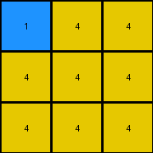
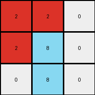
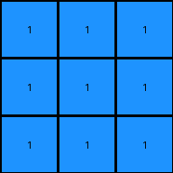

# 7837ac64 • 009 • refine_dreamer

---


Previous Code:
```python
"""
1. **Identify and Isolate:** Scan the input grid and identify all pixels that are *not* green (3) or white (0). In this case, find the red (2) and azure (8) pixels.
2. **Extreme Down-sampling:** Create a new, much smaller 3x3 grid.
3. **Map and reconstruct (condense):** Place the identified non-green, non-white colors (red and azure) into the new grid, maintaining approximate relative positioning from input. The other cells are filled with white (0). Because the grid has been reduced, the location is based on groups of 9 input cells.
"""

import numpy as np

def find_non_background_pixels(grid):
    """Finds the coordinates and colors of pixels that are not green (3) or white (0)."""
    non_background_pixels = []
    for row_index, row in enumerate(grid):
        for col_index, pixel in enumerate(row):
            if pixel != 3 and pixel != 0:
                non_background_pixels.append(((row_index, col_index), pixel))
    return non_background_pixels

def transform(input_grid):
    # Initialize a 3x3 output grid filled with white (0)
    output_grid = np.zeros((3, 3), dtype=int)

    # Find non-background pixels (not green or white)
    non_background_pixels = find_non_background_pixels(input_grid)

    # Map the found pixels to the 3x3 grid
    for (row, col), color in non_background_pixels:
        # Determine the corresponding position in the output grid (integer division by 9 for this specific case)
        output_row = row // (input_grid.shape[0] // 3)
        output_col = col // (input_grid.shape[1] // 3)

        # check bounds - important to prevent errors in other examples
        if output_row < output_grid.shape[0] and output_col < output_grid.shape[1]:
          output_grid[output_row, output_col] = color

    return output_grid
```

Train Set Results:

## Example 1:

Input:
```
0 0 4 0 0 4 0 0 4 0 0 4 0 0 4 0 0 4 0 0 4 0 0 4 0 0 4 0 0
0 0 4 0 0 4 0 0 4 0 0 4 0 0 4 0 0 4 0 0 4 0 0 4 0 0 4 0 0
4 4 4 4 4 4 4 4 4 4 4 4 4 4 4 4 4 4 4 4 4 4 4 4 4 4 4 4 4
0 0 4 0 0 4 0 0 4 0 0 4 0 0 4 0 0 4 0 0 4 0 0 4 0 0 4 0 0
0 0 4 0 0 4 0 0 4 0 0 4 0 0 4 0 0 4 0 0 4 0 0 4 0 0 4 0 0
4 4 4 4 4 1 4 4 1 4 4 3 4 4 3 4 4 4 4 4 4 4 4 4 4 4 4 4 4
0 0 4 0 0 4 0 0 4 0 0 4 0 0 4 0 0 4 0 0 4 0 0 4 0 0 4 0 0
0 0 4 0 0 4 0 0 4 0 0 4 0 0 4 0 0 4 0 0 4 0 0 4 0 0 4 0 0
4 4 4 4 4 1 4 4 1 4 4 3 4 4 3 4 4 4 4 4 4 4 4 4 4 4 4 4 4
0 0 4 0 0 4 0 0 4 0 0 4 0 0 4 0 0 4 0 0 4 0 0 4 0 0 4 0 0
0 0 4 0 0 4 0 0 4 0 0 4 0 0 4 0 0 4 0 0 4 0 0 4 0 0 4 0 0
4 4 4 4 4 1 4 4 1 4 4 4 4 4 4 4 4 4 4 4 4 4 4 4 4 4 4 4 4
0 0 4 0 0 4 0 0 4 0 0 4 0 0 4 0 0 4 0 0 4 0 0 4 0 0 4 0 0
0 0 4 0 0 4 0 0 4 0 0 4 0 0 4 0 0 4 0 0 4 0 0 4 0 0 4 0 0
4 4 4 4 4 1 4 4 1 4 4 4 4 4 4 4 4 4 4 4 4 4 4 4 4 4 4 4 4
0 0 4 0 0 4 0 0 4 0 0 4 0 0 4 0 0 4 0 0 4 0 0 4 0 0 4 0 0
0 0 4 0 0 4 0 0 4 0 0 4 0 0 4 0 0 4 0 0 4 0 0 4 0 0 4 0 0
4 4 4 4 4 4 4 4 4 4 4 4 4 4 4 4 4 4 4 4 4 4 4 4 4 4 4 4 4
0 0 4 0 0 4 0 0 4 0 0 4 0 0 4 0 0 4 0 0 4 0 0 4 0 0 4 0 0
0 0 4 0 0 4 0 0 4 0 0 4 0 0 4 0 0 4 0 0 4 0 0 4 0 0 4 0 0
4 4 4 4 4 4 4 4 4 4 4 4 4 4 4 4 4 4 4 4 4 4 4 4 4 4 4 4 4
0 0 4 0 0 4 0 0 4 0 0 4 0 0 4 0 0 4 0 0 4 0 0 4 0 0 4 0 0
0 0 4 0 0 4 0 0 4 0 0 4 0 0 4 0 0 4 0 0 4 0 0 4 0 0 4 0 0
4 4 4 4 4 4 4 4 4 4 4 4 4 4 4 4 4 4 4 4 4 4 4 4 4 4 4 4 4
0 0 4 0 0 4 0 0 4 0 0 4 0 0 4 0 0 4 0 0 4 0 0 4 0 0 4 0 0
0 0 4 0 0 4 0 0 4 0 0 4 0 0 4 0 0 4 0 0 4 0 0 4 0 0 4 0 0
4 4 4 4 4 4 4 4 4 4 4 4 4 4 4 4 4 4 4 4 4 4 4 4 4 4 4 4 4
0 0 4 0 0 4 0 0 4 0 0 4 0 0 4 0 0 4 0 0 4 0 0 4 0 0 4 0 0
0 0 4 0 0 4 0 0 4 0 0 4 0 0 4 0 0 4 0 0 4 0 0 4 0 0 4 0 0
```
Expected Output:
```
1 0 3
1 0 0
1 0 0
```
Transformed Output:
```
1 4 4
4 4 4
4 4 4
```

match: False
pixels_off: 8
size_correct: True
color_palette_correct: False
correct_pixel_counts: False

## Example 2:

Input:
```
0 0 0 3 0 0 0 3 0 0 0 3 0 0 0 3 0 0 0 3 0 0 0 3 0 0 0
0 0 0 3 0 0 0 3 0 0 0 3 0 0 0 3 0 0 0 3 0 0 0 3 0 0 0
0 0 0 3 0 0 0 3 0 0 0 3 0 0 0 3 0 0 0 3 0 0 0 3 0 0 0
3 3 3 3 3 3 3 3 3 3 3 3 3 3 3 3 3 3 3 3 3 3 3 3 3 3 3
0 0 0 3 0 0 0 3 0 0 0 3 0 0 0 3 0 0 0 3 0 0 0 3 0 0 0
0 0 0 3 0 0 0 3 0 0 0 3 0 0 0 3 0 0 0 3 0 0 0 3 0 0 0
0 0 0 3 0 0 0 3 0 0 0 3 0 0 0 3 0 0 0 3 0 0 0 3 0 0 0
3 3 3 3 3 3 3 2 3 3 3 2 3 3 3 3 3 3 3 3 3 3 3 3 3 3 3
0 0 0 3 0 0 0 3 0 0 0 3 0 0 0 3 0 0 0 3 0 0 0 3 0 0 0
0 0 0 3 0 0 0 3 0 0 0 3 0 0 0 3 0 0 0 3 0 0 0 3 0 0 0
0 0 0 3 0 0 0 3 0 0 0 3 0 0 0 3 0 0 0 3 0 0 0 3 0 0 0
3 3 3 2 3 3 3 2 3 3 3 2 3 3 3 3 3 3 3 3 3 3 3 3 3 3 3
0 0 0 3 0 0 0 3 0 0 0 3 0 0 0 3 0 0 0 3 0 0 0 3 0 0 0
0 0 0 3 0 0 0 3 0 0 0 3 0 0 0 3 0 0 0 3 0 0 0 3 0 0 0
0 0 0 3 0 0 0 3 0 0 0 3 0 0 0 3 0 0 0 3 0 0 0 3 0 0 0
3 3 3 2 3 3 3 2 3 3 3 8 3 3 3 8 3 3 3 3 3 3 3 3 3 3 3
0 0 0 3 0 0 0 3 0 0 0 3 0 0 0 3 0 0 0 3 0 0 0 3 0 0 0
0 0 0 3 0 0 0 3 0 0 0 3 0 0 0 3 0 0 0 3 0 0 0 3 0 0 0
0 0 0 3 0 0 0 3 0 0 0 3 0 0 0 3 0 0 0 3 0 0 0 3 0 0 0
3 3 3 3 3 3 3 3 3 3 3 8 3 3 3 8 3 3 3 3 3 3 3 3 3 3 3
0 0 0 3 0 0 0 3 0 0 0 3 0 0 0 3 0 0 0 3 0 0 0 3 0 0 0
0 0 0 3 0 0 0 3 0 0 0 3 0 0 0 3 0 0 0 3 0 0 0 3 0 0 0
0 0 0 3 0 0 0 3 0 0 0 3 0 0 0 3 0 0 0 3 0 0 0 3 0 0 0
3 3 3 3 3 3 3 3 3 3 3 3 3 3 3 3 3 3 3 3 3 3 3 3 3 3 3
0 0 0 3 0 0 0 3 0 0 0 3 0 0 0 3 0 0 0 3 0 0 0 3 0 0 0
0 0 0 3 0 0 0 3 0 0 0 3 0 0 0 3 0 0 0 3 0 0 0 3 0 0 0
0 0 0 3 0 0 0 3 0 0 0 3 0 0 0 3 0 0 0 3 0 0 0 3 0 0 0
```
Expected Output:
```
0 2 0
2 0 0
0 0 8
```
Transformed Output:
```
2 2 0
2 8 0
0 8 0
```

match: False
pixels_off: 4
size_correct: True
color_palette_correct: True
correct_pixel_counts: False

## Example 3:

Input:
```
0 0 1 0 0 1 0 0 1 0 0 1 0 0 1 0 0 1 0 0 1 0 0 1 0 0 1 0 0
0 0 1 0 0 1 0 0 1 0 0 1 0 0 1 0 0 1 0 0 1 0 0 1 0 0 1 0 0
1 1 1 1 1 1 1 1 1 1 1 1 1 1 1 1 1 1 1 1 1 1 1 1 1 1 1 1 1
0 0 1 0 0 1 0 0 1 0 0 1 0 0 1 0 0 1 0 0 1 0 0 1 0 0 1 0 0
0 0 1 0 0 1 0 0 1 0 0 1 0 0 1 0 0 1 0 0 1 0 0 1 0 0 1 0 0
1 1 1 1 1 1 1 1 1 1 1 1 1 1 1 1 1 1 1 1 1 1 1 1 1 1 1 1 1
0 0 1 0 0 1 0 0 1 0 0 1 0 0 1 0 0 1 0 0 1 0 0 1 0 0 1 0 0
0 0 1 0 0 1 0 0 1 0 0 1 0 0 1 0 0 1 0 0 1 0 0 1 0 0 1 0 0
1 1 1 1 1 1 1 1 1 1 1 1 1 1 1 1 1 1 1 1 1 1 1 1 1 1 1 1 1
0 0 1 0 0 1 0 0 1 0 0 1 0 0 1 0 0 1 0 0 1 0 0 1 0 0 1 0 0
0 0 1 0 0 1 0 0 1 0 0 1 0 0 1 0 0 1 0 0 1 0 0 1 0 0 1 0 0
1 1 1 1 1 1 1 1 1 1 1 1 1 1 6 1 1 6 1 1 6 1 1 1 1 1 1 1 1
0 0 1 0 0 1 0 0 1 0 0 1 0 0 1 0 0 1 0 0 1 0 0 1 0 0 1 0 0
0 0 1 0 0 1 0 0 1 0 0 1 0 0 1 0 0 1 0 0 1 0 0 1 0 0 1 0 0
1 1 1 1 1 1 1 1 1 1 1 1 1 1 6 1 1 6 1 1 6 1 1 1 1 1 1 1 1
0 0 1 0 0 1 0 0 1 0 0 1 0 0 1 0 0 1 0 0 1 0 0 1 0 0 1 0 0
0 0 1 0 0 1 0 0 1 0 0 1 0 0 1 0 0 1 0 0 1 0 0 1 0 0 1 0 0
1 1 1 1 1 1 1 1 1 1 1 1 1 1 3 1 1 3 1 1 3 1 1 3 1 1 1 1 1
0 0 1 0 0 1 0 0 1 0 0 1 0 0 1 0 0 1 0 0 1 0 0 1 0 0 1 0 0
0 0 1 0 0 1 0 0 1 0 0 1 0 0 1 0 0 1 0 0 1 0 0 1 0 0 1 0 0
1 1 1 1 1 1 1 1 1 1 1 1 1 1 3 1 1 3 1 1 3 1 1 3 1 1 1 1 1
0 0 1 0 0 1 0 0 1 0 0 1 0 0 1 0 0 1 0 0 1 0 0 1 0 0 1 0 0
0 0 1 0 0 1 0 0 1 0 0 1 0 0 1 0 0 1 0 0 1 0 0 1 0 0 1 0 0
1 1 1 1 1 1 1 1 1 1 1 1 1 1 1 1 1 1 1 1 1 1 1 1 1 1 1 1 1
0 0 1 0 0 1 0 0 1 0 0 1 0 0 1 0 0 1 0 0 1 0 0 1 0 0 1 0 0
0 0 1 0 0 1 0 0 1 0 0 1 0 0 1 0 0 1 0 0 1 0 0 1 0 0 1 0 0
1 1 1 1 1 1 1 1 1 1 1 1 1 1 1 1 1 1 1 1 1 1 1 1 1 1 1 1 1
0 0 1 0 0 1 0 0 1 0 0 1 0 0 1 0 0 1 0 0 1 0 0 1 0 0 1 0 0
0 0 1 0 0 1 0 0 1 0 0 1 0 0 1 0 0 1 0 0 1 0 0 1 0 0 1 0 0
```
Expected Output:
```
6 6 0
0 0 0
3 3 3
```
Transformed Output:
```
1 1 1
1 1 1
1 1 1
```

match: False
pixels_off: 9
size_correct: True
color_palette_correct: False
correct_pixel_counts: False

## Example 4:

Input:
```
0 0 0 8 0 0 0 8 0 0 0 8 0 0 0 8 0 0 0 8 0 0 0 8 0 0 0
0 0 0 8 0 0 0 8 0 0 0 8 0 0 0 8 0 0 0 8 0 0 0 8 0 0 0
0 0 0 8 0 0 0 8 0 0 0 8 0 0 0 8 0 0 0 8 0 0 0 8 0 0 0
8 8 8 8 8 8 8 8 8 8 8 8 8 8 8 8 8 8 8 8 8 8 8 8 8 8 8
0 0 0 8 0 0 0 8 0 0 0 8 0 0 0 8 0 0 0 8 0 0 0 8 0 0 0
0 0 0 8 0 0 0 8 0 0 0 8 0 0 0 8 0 0 0 8 0 0 0 8 0 0 0
0 0 0 8 0 0 0 8 0 0 0 8 0 0 0 8 0 0 0 8 0 0 0 8 0 0 0
8 8 8 8 8 8 8 1 8 8 8 1 8 8 8 2 8 8 8 2 8 8 8 8 8 8 8
0 0 0 8 0 0 0 8 0 0 0 8 0 0 0 8 0 0 0 8 0 0 0 8 0 0 0
0 0 0 8 0 0 0 8 0 0 0 8 0 0 0 8 0 0 0 8 0 0 0 8 0 0 0
0 0 0 8 0 0 0 8 0 0 0 8 0 0 0 8 0 0 0 8 0 0 0 8 0 0 0
8 8 8 8 8 8 8 1 8 8 8 1 8 8 8 2 8 8 8 2 8 8 8 8 8 8 8
0 0 0 8 0 0 0 8 0 0 0 8 0 0 0 8 0 0 0 8 0 0 0 8 0 0 0
0 0 0 8 0 0 0 8 0 0 0 8 0 0 0 8 0 0 0 8 0 0 0 8 0 0 0
0 0 0 8 0 0 0 8 0 0 0 8 0 0 0 8 0 0 0 8 0 0 0 8 0 0 0
8 8 8 8 8 8 8 2 8 8 8 2 8 8 8 2 8 8 8 2 8 8 8 8 8 8 8
0 0 0 8 0 0 0 8 0 0 0 8 0 0 0 8 0 0 0 8 0 0 0 8 0 0 0
0 0 0 8 0 0 0 8 0 0 0 8 0 0 0 8 0 0 0 8 0 0 0 8 0 0 0
0 0 0 8 0 0 0 8 0 0 0 8 0 0 0 8 0 0 0 8 0 0 0 8 0 0 0
8 8 8 8 8 8 8 2 8 8 8 2 8 8 8 2 8 8 8 2 8 8 8 8 8 8 8
0 0 0 8 0 0 0 8 0 0 0 8 0 0 0 8 0 0 0 8 0 0 0 8 0 0 0
0 0 0 8 0 0 0 8 0 0 0 8 0 0 0 8 0 0 0 8 0 0 0 8 0 0 0
0 0 0 8 0 0 0 8 0 0 0 8 0 0 0 8 0 0 0 8 0 0 0 8 0 0 0
8 8 8 8 8 8 8 8 8 8 8 8 8 8 8 8 8 8 8 8 8 8 8 8 8 8 8
0 0 0 8 0 0 0 8 0 0 0 8 0 0 0 8 0 0 0 8 0 0 0 8 0 0 0
0 0 0 8 0 0 0 8 0 0 0 8 0 0 0 8 0 0 0 8 0 0 0 8 0 0 0
0 0 0 8 0 0 0 8 0 0 0 8 0 0 0 8 0 0 0 8 0 0 0 8 0 0 0
```
Expected Output:
```
1 0 2
0 0 2
2 2 2
```
Transformed Output:
```
8 8 8
8 8 8
8 8 8
```

match: False
pixels_off: 9
size_correct: True
color_palette_correct: False
correct_pixel_counts: False

**INSTRUCTIONS**

The code above was generated based on observations from the first training
example

we have tested the transform function on each of the task example inputs and
compared with the expected output

review each of the examples provided and the results and consider how the
natural language program should be updated to accommodate this new knowledge

respond with the following deliverables:

- general assessment of the information provided and strategy for resolving the
  errors
- gather metrics about each of the examples and results - use code_execution to
  develop accurate reports on your assumptions
- a YAML block documenting facts - Focus on identifying objects, their properties, and the actions performed on them.
- a natural language program - Be as clear and concise as possible, providing a complete description of the transformation rule.


your responses should be considered as information in a report - not a
conversation
