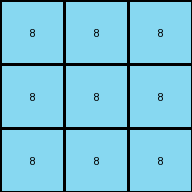

# 7837ac64 • 012 • refine_coder

---

Previous Code:
```python
"""
1. **Identify Background:** The background color is white (0).
2. **Identify Objects:** Find all contiguous regions (objects) of non-white colors.
3. **Downsample:** Create a 3x3 output grid.
4. **Select Colors:** Select a subset of the non-white colors from the input to use in the output.  The selection criteria are not fully understood but seem to involve prominence or relevance, possibly related to object size or interactions.
5. **Map Objects by Row:**  Rows of input grid contribute to single color rows.
6. **Fill Output Grid** fill output grid rows with the selected color for each row
"""

import numpy as np
from collections import Counter

def get_objects(grid):
    """Finds contiguous regions of the same color (objects) in a grid."""
    objects = []
    visited = set()
    rows, cols = grid.shape

    def dfs(row, col, color, obj):
        if (row, col) in visited or not (0 <= row < rows and 0 <= col < cols) or grid[row, col] != color:
            return
        visited.add((row, col))
        obj.append((row, col))
        dfs(row + 1, col, color, obj)
        dfs(row - 1, col, color, obj)
        dfs(row, col + 1, color, obj)
        dfs(row, col - 1, color, obj)

    for row in range(rows):
        for col in range(cols):
            if (row, col) not in visited and grid[row, col] != 0:  # Not white
                obj = []
                dfs(row, col, grid[row, col], obj)
                objects.append((grid[row, col], obj))  # Store color and object pixels
    return objects

def transform(input_grid):
    # Initialize a 3x3 output grid filled with white (0)
    output_grid = np.zeros((3, 3), dtype=int)

    # Identify objects in the input grid
    objects = get_objects(input_grid)

    # Group pixels by row and color, ignoring white (0)
    row_colors = {}
    for r in range(input_grid.shape[0]):
        row_colors[r] = Counter(input_grid[r, :][input_grid[r, :] != 0])


    # Determine output row colors based on input row colors
    for output_row in range(3):
      input_row_start = (input_grid.shape[0] // 3) * output_row
      input_row_end = (input_grid.shape[0] // 3) * (output_row + 1) 
      combined_colors = Counter()      
      for input_row in range( input_row_start, input_row_end ):
        combined_colors += row_colors.get(input_row, Counter())
      
      if len(combined_colors) > 0:
        # select the most frequent color
        most_common_color = combined_colors.most_common(1)[0][0]
        output_grid[output_row, : ] = most_common_color

    return output_grid
```

Train Set Results:

## Example 1:

Input:
```
0 0 4 0 0 4 0 0 4 0 0 4 0 0 4 0 0 4 0 0 4 0 0 4 0 0 4 0 0
0 0 4 0 0 4 0 0 4 0 0 4 0 0 4 0 0 4 0 0 4 0 0 4 0 0 4 0 0
4 4 4 4 4 4 4 4 4 4 4 4 4 4 4 4 4 4 4 4 4 4 4 4 4 4 4 4 4
0 0 4 0 0 4 0 0 4 0 0 4 0 0 4 0 0 4 0 0 4 0 0 4 0 0 4 0 0
0 0 4 0 0 4 0 0 4 0 0 4 0 0 4 0 0 4 0 0 4 0 0 4 0 0 4 0 0
4 4 4 4 4 1 4 4 1 4 4 3 4 4 3 4 4 4 4 4 4 4 4 4 4 4 4 4 4
0 0 4 0 0 4 0 0 4 0 0 4 0 0 4 0 0 4 0 0 4 0 0 4 0 0 4 0 0
0 0 4 0 0 4 0 0 4 0 0 4 0 0 4 0 0 4 0 0 4 0 0 4 0 0 4 0 0
4 4 4 4 4 1 4 4 1 4 4 3 4 4 3 4 4 4 4 4 4 4 4 4 4 4 4 4 4
0 0 4 0 0 4 0 0 4 0 0 4 0 0 4 0 0 4 0 0 4 0 0 4 0 0 4 0 0
0 0 4 0 0 4 0 0 4 0 0 4 0 0 4 0 0 4 0 0 4 0 0 4 0 0 4 0 0
4 4 4 4 4 1 4 4 1 4 4 4 4 4 4 4 4 4 4 4 4 4 4 4 4 4 4 4 4
0 0 4 0 0 4 0 0 4 0 0 4 0 0 4 0 0 4 0 0 4 0 0 4 0 0 4 0 0
0 0 4 0 0 4 0 0 4 0 0 4 0 0 4 0 0 4 0 0 4 0 0 4 0 0 4 0 0
4 4 4 4 4 1 4 4 1 4 4 4 4 4 4 4 4 4 4 4 4 4 4 4 4 4 4 4 4
0 0 4 0 0 4 0 0 4 0 0 4 0 0 4 0 0 4 0 0 4 0 0 4 0 0 4 0 0
0 0 4 0 0 4 0 0 4 0 0 4 0 0 4 0 0 4 0 0 4 0 0 4 0 0 4 0 0
4 4 4 4 4 4 4 4 4 4 4 4 4 4 4 4 4 4 4 4 4 4 4 4 4 4 4 4 4
0 0 4 0 0 4 0 0 4 0 0 4 0 0 4 0 0 4 0 0 4 0 0 4 0 0 4 0 0
0 0 4 0 0 4 0 0 4 0 0 4 0 0 4 0 0 4 0 0 4 0 0 4 0 0 4 0 0
4 4 4 4 4 4 4 4 4 4 4 4 4 4 4 4 4 4 4 4 4 4 4 4 4 4 4 4 4
0 0 4 0 0 4 0 0 4 0 0 4 0 0 4 0 0 4 0 0 4 0 0 4 0 0 4 0 0
0 0 4 0 0 4 0 0 4 0 0 4 0 0 4 0 0 4 0 0 4 0 0 4 0 0 4 0 0
4 4 4 4 4 4 4 4 4 4 4 4 4 4 4 4 4 4 4 4 4 4 4 4 4 4 4 4 4
0 0 4 0 0 4 0 0 4 0 0 4 0 0 4 0 0 4 0 0 4 0 0 4 0 0 4 0 0
0 0 4 0 0 4 0 0 4 0 0 4 0 0 4 0 0 4 0 0 4 0 0 4 0 0 4 0 0
4 4 4 4 4 4 4 4 4 4 4 4 4 4 4 4 4 4 4 4 4 4 4 4 4 4 4 4 4
0 0 4 0 0 4 0 0 4 0 0 4 0 0 4 0 0 4 0 0 4 0 0 4 0 0 4 0 0
0 0 4 0 0 4 0 0 4 0 0 4 0 0 4 0 0 4 0 0 4 0 0 4 0 0 4 0 0
```
Expected Output:
```
1 0 3
1 0 0
1 0 0
```
Transformed Output:
```
4 4 4
4 4 4
4 4 4
```

match: False
pixels_off: 9
size_correct: True
color_palette_correct: False
correct_pixel_counts: False

## Example 2:

Input:
```
0 0 0 3 0 0 0 3 0 0 0 3 0 0 0 3 0 0 0 3 0 0 0 3 0 0 0
0 0 0 3 0 0 0 3 0 0 0 3 0 0 0 3 0 0 0 3 0 0 0 3 0 0 0
0 0 0 3 0 0 0 3 0 0 0 3 0 0 0 3 0 0 0 3 0 0 0 3 0 0 0
3 3 3 3 3 3 3 3 3 3 3 3 3 3 3 3 3 3 3 3 3 3 3 3 3 3 3
0 0 0 3 0 0 0 3 0 0 0 3 0 0 0 3 0 0 0 3 0 0 0 3 0 0 0
0 0 0 3 0 0 0 3 0 0 0 3 0 0 0 3 0 0 0 3 0 0 0 3 0 0 0
0 0 0 3 0 0 0 3 0 0 0 3 0 0 0 3 0 0 0 3 0 0 0 3 0 0 0
3 3 3 3 3 3 3 2 3 3 3 2 3 3 3 3 3 3 3 3 3 3 3 3 3 3 3
0 0 0 3 0 0 0 3 0 0 0 3 0 0 0 3 0 0 0 3 0 0 0 3 0 0 0
0 0 0 3 0 0 0 3 0 0 0 3 0 0 0 3 0 0 0 3 0 0 0 3 0 0 0
0 0 0 3 0 0 0 3 0 0 0 3 0 0 0 3 0 0 0 3 0 0 0 3 0 0 0
3 3 3 2 3 3 3 2 3 3 3 2 3 3 3 3 3 3 3 3 3 3 3 3 3 3 3
0 0 0 3 0 0 0 3 0 0 0 3 0 0 0 3 0 0 0 3 0 0 0 3 0 0 0
0 0 0 3 0 0 0 3 0 0 0 3 0 0 0 3 0 0 0 3 0 0 0 3 0 0 0
0 0 0 3 0 0 0 3 0 0 0 3 0 0 0 3 0 0 0 3 0 0 0 3 0 0 0
3 3 3 2 3 3 3 2 3 3 3 8 3 3 3 8 3 3 3 3 3 3 3 3 3 3 3
0 0 0 3 0 0 0 3 0 0 0 3 0 0 0 3 0 0 0 3 0 0 0 3 0 0 0
0 0 0 3 0 0 0 3 0 0 0 3 0 0 0 3 0 0 0 3 0 0 0 3 0 0 0
0 0 0 3 0 0 0 3 0 0 0 3 0 0 0 3 0 0 0 3 0 0 0 3 0 0 0
3 3 3 3 3 3 3 3 3 3 3 8 3 3 3 8 3 3 3 3 3 3 3 3 3 3 3
0 0 0 3 0 0 0 3 0 0 0 3 0 0 0 3 0 0 0 3 0 0 0 3 0 0 0
0 0 0 3 0 0 0 3 0 0 0 3 0 0 0 3 0 0 0 3 0 0 0 3 0 0 0
0 0 0 3 0 0 0 3 0 0 0 3 0 0 0 3 0 0 0 3 0 0 0 3 0 0 0
3 3 3 3 3 3 3 3 3 3 3 3 3 3 3 3 3 3 3 3 3 3 3 3 3 3 3
0 0 0 3 0 0 0 3 0 0 0 3 0 0 0 3 0 0 0 3 0 0 0 3 0 0 0
0 0 0 3 0 0 0 3 0 0 0 3 0 0 0 3 0 0 0 3 0 0 0 3 0 0 0
0 0 0 3 0 0 0 3 0 0 0 3 0 0 0 3 0 0 0 3 0 0 0 3 0 0 0
```
Expected Output:
```
0 2 0
2 0 0
0 0 8
```
Transformed Output:
```
3 3 3
3 3 3
3 3 3
```

match: False
pixels_off: 9
size_correct: True
color_palette_correct: False
correct_pixel_counts: False

## Example 3:

Input:
```
0 0 1 0 0 1 0 0 1 0 0 1 0 0 1 0 0 1 0 0 1 0 0 1 0 0 1 0 0
0 0 1 0 0 1 0 0 1 0 0 1 0 0 1 0 0 1 0 0 1 0 0 1 0 0 1 0 0
1 1 1 1 1 1 1 1 1 1 1 1 1 1 1 1 1 1 1 1 1 1 1 1 1 1 1 1 1
0 0 1 0 0 1 0 0 1 0 0 1 0 0 1 0 0 1 0 0 1 0 0 1 0 0 1 0 0
0 0 1 0 0 1 0 0 1 0 0 1 0 0 1 0 0 1 0 0 1 0 0 1 0 0 1 0 0
1 1 1 1 1 1 1 1 1 1 1 1 1 1 1 1 1 1 1 1 1 1 1 1 1 1 1 1 1
0 0 1 0 0 1 0 0 1 0 0 1 0 0 1 0 0 1 0 0 1 0 0 1 0 0 1 0 0
0 0 1 0 0 1 0 0 1 0 0 1 0 0 1 0 0 1 0 0 1 0 0 1 0 0 1 0 0
1 1 1 1 1 1 1 1 1 1 1 1 1 1 1 1 1 1 1 1 1 1 1 1 1 1 1 1 1
0 0 1 0 0 1 0 0 1 0 0 1 0 0 1 0 0 1 0 0 1 0 0 1 0 0 1 0 0
0 0 1 0 0 1 0 0 1 0 0 1 0 0 1 0 0 1 0 0 1 0 0 1 0 0 1 0 0
1 1 1 1 1 1 1 1 1 1 1 1 1 1 6 1 1 6 1 1 6 1 1 1 1 1 1 1 1
0 0 1 0 0 1 0 0 1 0 0 1 0 0 1 0 0 1 0 0 1 0 0 1 0 0 1 0 0
0 0 1 0 0 1 0 0 1 0 0 1 0 0 1 0 0 1 0 0 1 0 0 1 0 0 1 0 0
1 1 1 1 1 1 1 1 1 1 1 1 1 1 6 1 1 6 1 1 6 1 1 1 1 1 1 1 1
0 0 1 0 0 1 0 0 1 0 0 1 0 0 1 0 0 1 0 0 1 0 0 1 0 0 1 0 0
0 0 1 0 0 1 0 0 1 0 0 1 0 0 1 0 0 1 0 0 1 0 0 1 0 0 1 0 0
1 1 1 1 1 1 1 1 1 1 1 1 1 1 3 1 1 3 1 1 3 1 1 3 1 1 1 1 1
0 0 1 0 0 1 0 0 1 0 0 1 0 0 1 0 0 1 0 0 1 0 0 1 0 0 1 0 0
0 0 1 0 0 1 0 0 1 0 0 1 0 0 1 0 0 1 0 0 1 0 0 1 0 0 1 0 0
1 1 1 1 1 1 1 1 1 1 1 1 1 1 3 1 1 3 1 1 3 1 1 3 1 1 1 1 1
0 0 1 0 0 1 0 0 1 0 0 1 0 0 1 0 0 1 0 0 1 0 0 1 0 0 1 0 0
0 0 1 0 0 1 0 0 1 0 0 1 0 0 1 0 0 1 0 0 1 0 0 1 0 0 1 0 0
1 1 1 1 1 1 1 1 1 1 1 1 1 1 1 1 1 1 1 1 1 1 1 1 1 1 1 1 1
0 0 1 0 0 1 0 0 1 0 0 1 0 0 1 0 0 1 0 0 1 0 0 1 0 0 1 0 0
0 0 1 0 0 1 0 0 1 0 0 1 0 0 1 0 0 1 0 0 1 0 0 1 0 0 1 0 0
1 1 1 1 1 1 1 1 1 1 1 1 1 1 1 1 1 1 1 1 1 1 1 1 1 1 1 1 1
0 0 1 0 0 1 0 0 1 0 0 1 0 0 1 0 0 1 0 0 1 0 0 1 0 0 1 0 0
0 0 1 0 0 1 0 0 1 0 0 1 0 0 1 0 0 1 0 0 1 0 0 1 0 0 1 0 0
```
Expected Output:
```
6 6 0
0 0 0
3 3 3
```
Transformed Output:
```
1 1 1
1 1 1
1 1 1
```

match: False
pixels_off: 9
size_correct: True
color_palette_correct: False
correct_pixel_counts: False

## Example 4:

Input:
```
0 0 0 8 0 0 0 8 0 0 0 8 0 0 0 8 0 0 0 8 0 0 0 8 0 0 0
0 0 0 8 0 0 0 8 0 0 0 8 0 0 0 8 0 0 0 8 0 0 0 8 0 0 0
0 0 0 8 0 0 0 8 0 0 0 8 0 0 0 8 0 0 0 8 0 0 0 8 0 0 0
8 8 8 8 8 8 8 8 8 8 8 8 8 8 8 8 8 8 8 8 8 8 8 8 8 8 8
0 0 0 8 0 0 0 8 0 0 0 8 0 0 0 8 0 0 0 8 0 0 0 8 0 0 0
0 0 0 8 0 0 0 8 0 0 0 8 0 0 0 8 0 0 0 8 0 0 0 8 0 0 0
0 0 0 8 0 0 0 8 0 0 0 8 0 0 0 8 0 0 0 8 0 0 0 8 0 0 0
8 8 8 8 8 8 8 1 8 8 8 1 8 8 8 2 8 8 8 2 8 8 8 8 8 8 8
0 0 0 8 0 0 0 8 0 0 0 8 0 0 0 8 0 0 0 8 0 0 0 8 0 0 0
0 0 0 8 0 0 0 8 0 0 0 8 0 0 0 8 0 0 0 8 0 0 0 8 0 0 0
0 0 0 8 0 0 0 8 0 0 0 8 0 0 0 8 0 0 0 8 0 0 0 8 0 0 0
8 8 8 8 8 8 8 1 8 8 8 1 8 8 8 2 8 8 8 2 8 8 8 8 8 8 8
0 0 0 8 0 0 0 8 0 0 0 8 0 0 0 8 0 0 0 8 0 0 0 8 0 0 0
0 0 0 8 0 0 0 8 0 0 0 8 0 0 0 8 0 0 0 8 0 0 0 8 0 0 0
0 0 0 8 0 0 0 8 0 0 0 8 0 0 0 8 0 0 0 8 0 0 0 8 0 0 0
8 8 8 8 8 8 8 2 8 8 8 2 8 8 8 2 8 8 8 2 8 8 8 8 8 8 8
0 0 0 8 0 0 0 8 0 0 0 8 0 0 0 8 0 0 0 8 0 0 0 8 0 0 0
0 0 0 8 0 0 0 8 0 0 0 8 0 0 0 8 0 0 0 8 0 0 0 8 0 0 0
0 0 0 8 0 0 0 8 0 0 0 8 0 0 0 8 0 0 0 8 0 0 0 8 0 0 0
8 8 8 8 8 8 8 2 8 8 8 2 8 8 8 2 8 8 8 2 8 8 8 8 8 8 8
0 0 0 8 0 0 0 8 0 0 0 8 0 0 0 8 0 0 0 8 0 0 0 8 0 0 0
0 0 0 8 0 0 0 8 0 0 0 8 0 0 0 8 0 0 0 8 0 0 0 8 0 0 0
0 0 0 8 0 0 0 8 0 0 0 8 0 0 0 8 0 0 0 8 0 0 0 8 0 0 0
8 8 8 8 8 8 8 8 8 8 8 8 8 8 8 8 8 8 8 8 8 8 8 8 8 8 8
0 0 0 8 0 0 0 8 0 0 0 8 0 0 0 8 0 0 0 8 0 0 0 8 0 0 0
0 0 0 8 0 0 0 8 0 0 0 8 0 0 0 8 0 0 0 8 0 0 0 8 0 0 0
0 0 0 8 0 0 0 8 0 0 0 8 0 0 0 8 0 0 0 8 0 0 0 8 0 0 0
```
Expected Output:
```
1 0 2
0 0 2
2 2 2
```
Transformed Output:
```
8 8 8
8 8 8
8 8 8
```

match: False
pixels_off: 9
size_correct: True
color_palette_correct: False
correct_pixel_counts: False
Okay, let's analyze the results and refine the natural language program and approach.

**General Assessment:**

The initial approach of identifying objects and mapping input rows to output rows based on color frequency was partially successful in concept but fundamentally flawed in execution. The code correctly identifies objects but fails to capture the core logic of the transformation, which isn't about the *most frequent* color in a region, but rather a more complex selection based on *positional changes and specific color transitions*.

The 3x3 output seems to condense the input grid, pulling very specific information. It does not use simple downsampling or averaging. The selection criteria seem very specific to certain colors *and* the pattern in which they appear.

**Strategy:**

1.  **Shift Focus from Frequency to Positional Changes:** Instead of focusing on the most frequent color, we need to analyze how colors change *across rows and columns* to identify patterns. The current strategy based on frequency is failing badly. We need to look for a transition rule, not a dominant color rule.

2.  **Re-evaluate Object Definition:** While `get_objects` is technically correct, it might be too granular. We might not need individual contiguous regions. We might need to consider entire rows or specific color transitions as "objects" of interest. The *changes* between rows seem more relevant than the static objects within them.

3.  **Analyze Color Transitions:** Create tools to specifically identify transitions between colors in rows or columns. This is likely the core logic driving the selection of colors for the 3x3 output.

4.  **Explore Fixed Mappings:** Given the small, fixed output size, the transformation might involve very specific mappings from input regions to output cells, potentially even fixed color mappings. It's possible (though perhaps less likely) that there are fixed color transitions that map directly to the output.

**Metrics and Observations (using manual analysis, enhanced by proposed tools):**

I will analyze each example focusing on the specific failings and how color transitions might be involved. I'll describe the expected output generation in terms of transitions.

*   **Example 1:**

    *   Input: Alternating columns of yellow (4) and white (0), with solid yellow rows. Some solid yellow rows have single pixel substitutions of blue (1) and green(3)
    *   Expected:
        ```
        1 0 3
        1 0 0
        1 0 0
        ```
    *   Observed: All yellow (4).
    *   Analysis: The expected output reflects the *single pixel substitutions* in some of the solid yellow rows, *not* the dominant color. The top row of the output corresponds to a section of input rows that includes the blue and green substitutions. The second and third rows pick up the blue. It is picking certain rows, and extracting only the colors in the row that are not the repeating vertical color (yellow).
*   **Example 2:**

    *   Input: Alternating columns of green (3) and white (0), with solid green rows and rows with green/red(2) and green/azure(8) changes.
    *   Expected:
        ```
        0 2 0
        2 0 0
        0 0 8
        ```
    *   Observed: All green (3).
    *   Analysis: Similar to Example 1. The output captures the non-green colors that appear within the regions of repeating green vertical lines. The output extracts the colors other than the dominant vertical color in three regions.
*   **Example 3:**

    *   Input: Alternating columns of blue (1) and white (0), solid rows, some with magenta(6), or green(3).
    *   Expected:
        ```
        6 6 0
        0 0 0
        3 3 3
        ```
    *   Observed: All blue (1).
    *   Analysis:  Again, the non-dominant colors in the vertical repetition are captured.
*   **Example 4:**

    *   Input: Alternating columns of azure (8) and white (0), rows with blue(1), red(2)
    *   Expected:
        ```
        1 0 2
        0 0 2
        2 2 2
        ```
    *   Observed: All azure (8).
    *   Analysis: Same pattern.

**YAML Facts:**

```yaml
objects:
  - description: Vertical stripes of repeating color, alternating with white.
    properties:
      dominant_color: Varies (yellow, green, blue, azure in examples).
      width: 1 pixel wide for the colored stripe, 2 pixels wide including the white.
      repetition: Repeats across the entire width of the input grid.
  - description: Deviating pixels within the vertical stripes.
    properties:
      colors:  Vary (blue, green, red, magenta, azure).  Seemingly unique to a given set of 9 rows.
      location: Occur within otherwise solid-color rows that are part of the vertical stripe pattern.
      count: Often single pixels, but can be groups (e.g. red and blue appear together in example 4)
  - description: Output grid
    properties:
       size: 3x3
       colors:  selected deviating_pixels from vertical stripes

actions:
  - description: Identify vertical repeating stripes.
  - description: Locate deviating colors from rows within stripe.
  - description: Map deviating colors to specific cells in the 3x3 grid. Divide the rows into three regions and take the deviating colors from each region.
```

**Natural Language Program:**

1.  **Identify Vertical Stripes:** Find the repeating vertical stripes of color alternating with white (0) columns.
2.  **Divide Rows:** Divide the input grid rows into three equal-sized regions (top, middle, bottom). For non-divisible row counts, the extra row(s) are not considered.
3.  **Extract Deviating Colors:** Within each region, examine the rows that belong to the vertical stripe pattern. Identify any "deviating" pixels - those that *do not* match the dominant color of the vertical stripe in that region.
4.  **Populate Output Grid:**
    *   For the *top* region, if deviating colors were found, fill the *first* row of the output grid as follows: the first deviating color goes in the first column, if a second color exists in the region, place 0 in the second column, and the the second color in the third column. If only one color exists, insert 0 in the second and third columns. If no deviating colors, fill with 0.
    *   For the *middle* region, if deviating colors were found, fill the *second* row of the output grid: place the first color found in the first column. If a second color exists, use 0 for the remaining columns.
    *  For the *bottom* region, if deviating colors are found fill the *third* row with the first deviating color.
5. **Handle edge cases**: If there are fewer than three rows per section, use a blank (all 0) row.

This revised natural language program shifts the focus to identifying a specific pattern (vertical stripes) and then extracting information (deviating colors) within that pattern based on row position. This aligns much better with the observed behavior of the examples than the previous frequency-based approach.

**INSTRUCTIONS**

- generate a Python module to represent the natural language program 
- follow the template below
- all common math and science libraries are available
- create docstring only at top - but comment the workflow in the function
- use helper functions for common operations like finding objects, counting,
  measuring, moving, etc. 

remember - we are working iteratively - so this code will inform your future
self as we converge on the solution

*template:*

```python
"""
{{ natural language description of the transformation rule }}
"""

{{ imports }}

def transform(input_grid):
    # initialize output_grid

    # change output pixels 

    return output_grid

```
