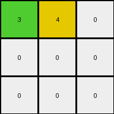
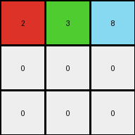
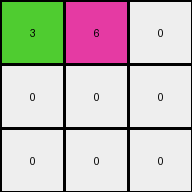
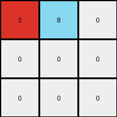

# 7837ac64 • 016 • refine_coder

---

Previous Code:
```python
"""
1. **Identify Highlighted Colors:** Ignore the background striping of blue (1) and white (0), and the solid blue (1) separator lines. Focus only on colors that "interrupt" the striped pattern within a section, specifically magenta (6) and green (3).
2. **Create Output Grid:** Construct a 3x3 grid.
3. **Populate Output Grid:** Scan for rows with highlighted colors in input.
   - For each highlight color in the input grid that exists
   - Add that color to the output
   - Fill the rest with '0'
4. The result will be a compressed representation with the highlighted colors.
"""

import numpy as np

def get_highlighted_colors(grid):
    # Find unique colors in the grid
    unique_colors = np.unique(grid)
    # remove white/background
    highlighted_colors = [color for color in unique_colors if color != 0 and color !=1]

    return highlighted_colors

def transform(input_grid):
    """Transforms the input grid to the output grid by extracting highlighted colors."""

    # Identify highlighted colors
    highlighted_colors = get_highlighted_colors(input_grid)

    # initialize 3x3 output grid with 0
    output_grid = np.zeros((3, 3), dtype=int)

    # Populate the output grid with highlighted_colors,
    row = 0
    col = 0
    for color in highlighted_colors:
      output_grid[row,col] = color
      col += 1
      if col >=3:
        col = 0
        row += 1
      if row >=3:
        break

    return output_grid
```

Train Set Results:

## Example 1:

Input:
```
0 0 4 0 0 4 0 0 4 0 0 4 0 0 4 0 0 4 0 0 4 0 0 4 0 0 4 0 0
0 0 4 0 0 4 0 0 4 0 0 4 0 0 4 0 0 4 0 0 4 0 0 4 0 0 4 0 0
4 4 4 4 4 4 4 4 4 4 4 4 4 4 4 4 4 4 4 4 4 4 4 4 4 4 4 4 4
0 0 4 0 0 4 0 0 4 0 0 4 0 0 4 0 0 4 0 0 4 0 0 4 0 0 4 0 0
0 0 4 0 0 4 0 0 4 0 0 4 0 0 4 0 0 4 0 0 4 0 0 4 0 0 4 0 0
4 4 4 4 4 1 4 4 1 4 4 3 4 4 3 4 4 4 4 4 4 4 4 4 4 4 4 4 4
0 0 4 0 0 4 0 0 4 0 0 4 0 0 4 0 0 4 0 0 4 0 0 4 0 0 4 0 0
0 0 4 0 0 4 0 0 4 0 0 4 0 0 4 0 0 4 0 0 4 0 0 4 0 0 4 0 0
4 4 4 4 4 1 4 4 1 4 4 3 4 4 3 4 4 4 4 4 4 4 4 4 4 4 4 4 4
0 0 4 0 0 4 0 0 4 0 0 4 0 0 4 0 0 4 0 0 4 0 0 4 0 0 4 0 0
0 0 4 0 0 4 0 0 4 0 0 4 0 0 4 0 0 4 0 0 4 0 0 4 0 0 4 0 0
4 4 4 4 4 1 4 4 1 4 4 4 4 4 4 4 4 4 4 4 4 4 4 4 4 4 4 4 4
0 0 4 0 0 4 0 0 4 0 0 4 0 0 4 0 0 4 0 0 4 0 0 4 0 0 4 0 0
0 0 4 0 0 4 0 0 4 0 0 4 0 0 4 0 0 4 0 0 4 0 0 4 0 0 4 0 0
4 4 4 4 4 1 4 4 1 4 4 4 4 4 4 4 4 4 4 4 4 4 4 4 4 4 4 4 4
0 0 4 0 0 4 0 0 4 0 0 4 0 0 4 0 0 4 0 0 4 0 0 4 0 0 4 0 0
0 0 4 0 0 4 0 0 4 0 0 4 0 0 4 0 0 4 0 0 4 0 0 4 0 0 4 0 0
4 4 4 4 4 4 4 4 4 4 4 4 4 4 4 4 4 4 4 4 4 4 4 4 4 4 4 4 4
0 0 4 0 0 4 0 0 4 0 0 4 0 0 4 0 0 4 0 0 4 0 0 4 0 0 4 0 0
0 0 4 0 0 4 0 0 4 0 0 4 0 0 4 0 0 4 0 0 4 0 0 4 0 0 4 0 0
4 4 4 4 4 4 4 4 4 4 4 4 4 4 4 4 4 4 4 4 4 4 4 4 4 4 4 4 4
0 0 4 0 0 4 0 0 4 0 0 4 0 0 4 0 0 4 0 0 4 0 0 4 0 0 4 0 0
0 0 4 0 0 4 0 0 4 0 0 4 0 0 4 0 0 4 0 0 4 0 0 4 0 0 4 0 0
4 4 4 4 4 4 4 4 4 4 4 4 4 4 4 4 4 4 4 4 4 4 4 4 4 4 4 4 4
0 0 4 0 0 4 0 0 4 0 0 4 0 0 4 0 0 4 0 0 4 0 0 4 0 0 4 0 0
0 0 4 0 0 4 0 0 4 0 0 4 0 0 4 0 0 4 0 0 4 0 0 4 0 0 4 0 0
4 4 4 4 4 4 4 4 4 4 4 4 4 4 4 4 4 4 4 4 4 4 4 4 4 4 4 4 4
0 0 4 0 0 4 0 0 4 0 0 4 0 0 4 0 0 4 0 0 4 0 0 4 0 0 4 0 0
0 0 4 0 0 4 0 0 4 0 0 4 0 0 4 0 0 4 0 0 4 0 0 4 0 0 4 0 0
```
Expected Output:
```
1 0 3
1 0 0
1 0 0
```
Transformed Output:
```
3 4 0
0 0 0
0 0 0
```

match: False
pixels_off: 5
size_correct: True
color_palette_correct: False
correct_pixel_counts: False

## Example 2:

Input:
```
0 0 0 3 0 0 0 3 0 0 0 3 0 0 0 3 0 0 0 3 0 0 0 3 0 0 0
0 0 0 3 0 0 0 3 0 0 0 3 0 0 0 3 0 0 0 3 0 0 0 3 0 0 0
0 0 0 3 0 0 0 3 0 0 0 3 0 0 0 3 0 0 0 3 0 0 0 3 0 0 0
3 3 3 3 3 3 3 3 3 3 3 3 3 3 3 3 3 3 3 3 3 3 3 3 3 3 3
0 0 0 3 0 0 0 3 0 0 0 3 0 0 0 3 0 0 0 3 0 0 0 3 0 0 0
0 0 0 3 0 0 0 3 0 0 0 3 0 0 0 3 0 0 0 3 0 0 0 3 0 0 0
0 0 0 3 0 0 0 3 0 0 0 3 0 0 0 3 0 0 0 3 0 0 0 3 0 0 0
3 3 3 3 3 3 3 2 3 3 3 2 3 3 3 3 3 3 3 3 3 3 3 3 3 3 3
0 0 0 3 0 0 0 3 0 0 0 3 0 0 0 3 0 0 0 3 0 0 0 3 0 0 0
0 0 0 3 0 0 0 3 0 0 0 3 0 0 0 3 0 0 0 3 0 0 0 3 0 0 0
0 0 0 3 0 0 0 3 0 0 0 3 0 0 0 3 0 0 0 3 0 0 0 3 0 0 0
3 3 3 2 3 3 3 2 3 3 3 2 3 3 3 3 3 3 3 3 3 3 3 3 3 3 3
0 0 0 3 0 0 0 3 0 0 0 3 0 0 0 3 0 0 0 3 0 0 0 3 0 0 0
0 0 0 3 0 0 0 3 0 0 0 3 0 0 0 3 0 0 0 3 0 0 0 3 0 0 0
0 0 0 3 0 0 0 3 0 0 0 3 0 0 0 3 0 0 0 3 0 0 0 3 0 0 0
3 3 3 2 3 3 3 2 3 3 3 8 3 3 3 8 3 3 3 3 3 3 3 3 3 3 3
0 0 0 3 0 0 0 3 0 0 0 3 0 0 0 3 0 0 0 3 0 0 0 3 0 0 0
0 0 0 3 0 0 0 3 0 0 0 3 0 0 0 3 0 0 0 3 0 0 0 3 0 0 0
0 0 0 3 0 0 0 3 0 0 0 3 0 0 0 3 0 0 0 3 0 0 0 3 0 0 0
3 3 3 3 3 3 3 3 3 3 3 8 3 3 3 8 3 3 3 3 3 3 3 3 3 3 3
0 0 0 3 0 0 0 3 0 0 0 3 0 0 0 3 0 0 0 3 0 0 0 3 0 0 0
0 0 0 3 0 0 0 3 0 0 0 3 0 0 0 3 0 0 0 3 0 0 0 3 0 0 0
0 0 0 3 0 0 0 3 0 0 0 3 0 0 0 3 0 0 0 3 0 0 0 3 0 0 0
3 3 3 3 3 3 3 3 3 3 3 3 3 3 3 3 3 3 3 3 3 3 3 3 3 3 3
0 0 0 3 0 0 0 3 0 0 0 3 0 0 0 3 0 0 0 3 0 0 0 3 0 0 0
0 0 0 3 0 0 0 3 0 0 0 3 0 0 0 3 0 0 0 3 0 0 0 3 0 0 0
0 0 0 3 0 0 0 3 0 0 0 3 0 0 0 3 0 0 0 3 0 0 0 3 0 0 0
```
Expected Output:
```
0 2 0
2 0 0
0 0 8
```
Transformed Output:
```
2 3 8
0 0 0
0 0 0
```

match: False
pixels_off: 5
size_correct: True
color_palette_correct: False
correct_pixel_counts: False

## Example 3:

Input:
```
0 0 1 0 0 1 0 0 1 0 0 1 0 0 1 0 0 1 0 0 1 0 0 1 0 0 1 0 0
0 0 1 0 0 1 0 0 1 0 0 1 0 0 1 0 0 1 0 0 1 0 0 1 0 0 1 0 0
1 1 1 1 1 1 1 1 1 1 1 1 1 1 1 1 1 1 1 1 1 1 1 1 1 1 1 1 1
0 0 1 0 0 1 0 0 1 0 0 1 0 0 1 0 0 1 0 0 1 0 0 1 0 0 1 0 0
0 0 1 0 0 1 0 0 1 0 0 1 0 0 1 0 0 1 0 0 1 0 0 1 0 0 1 0 0
1 1 1 1 1 1 1 1 1 1 1 1 1 1 1 1 1 1 1 1 1 1 1 1 1 1 1 1 1
0 0 1 0 0 1 0 0 1 0 0 1 0 0 1 0 0 1 0 0 1 0 0 1 0 0 1 0 0
0 0 1 0 0 1 0 0 1 0 0 1 0 0 1 0 0 1 0 0 1 0 0 1 0 0 1 0 0
1 1 1 1 1 1 1 1 1 1 1 1 1 1 1 1 1 1 1 1 1 1 1 1 1 1 1 1 1
0 0 1 0 0 1 0 0 1 0 0 1 0 0 1 0 0 1 0 0 1 0 0 1 0 0 1 0 0
0 0 1 0 0 1 0 0 1 0 0 1 0 0 1 0 0 1 0 0 1 0 0 1 0 0 1 0 0
1 1 1 1 1 1 1 1 1 1 1 1 1 1 6 1 1 6 1 1 6 1 1 1 1 1 1 1 1
0 0 1 0 0 1 0 0 1 0 0 1 0 0 1 0 0 1 0 0 1 0 0 1 0 0 1 0 0
0 0 1 0 0 1 0 0 1 0 0 1 0 0 1 0 0 1 0 0 1 0 0 1 0 0 1 0 0
1 1 1 1 1 1 1 1 1 1 1 1 1 1 6 1 1 6 1 1 6 1 1 1 1 1 1 1 1
0 0 1 0 0 1 0 0 1 0 0 1 0 0 1 0 0 1 0 0 1 0 0 1 0 0 1 0 0
0 0 1 0 0 1 0 0 1 0 0 1 0 0 1 0 0 1 0 0 1 0 0 1 0 0 1 0 0
1 1 1 1 1 1 1 1 1 1 1 1 1 1 3 1 1 3 1 1 3 1 1 3 1 1 1 1 1
0 0 1 0 0 1 0 0 1 0 0 1 0 0 1 0 0 1 0 0 1 0 0 1 0 0 1 0 0
0 0 1 0 0 1 0 0 1 0 0 1 0 0 1 0 0 1 0 0 1 0 0 1 0 0 1 0 0
1 1 1 1 1 1 1 1 1 1 1 1 1 1 3 1 1 3 1 1 3 1 1 3 1 1 1 1 1
0 0 1 0 0 1 0 0 1 0 0 1 0 0 1 0 0 1 0 0 1 0 0 1 0 0 1 0 0
0 0 1 0 0 1 0 0 1 0 0 1 0 0 1 0 0 1 0 0 1 0 0 1 0 0 1 0 0
1 1 1 1 1 1 1 1 1 1 1 1 1 1 1 1 1 1 1 1 1 1 1 1 1 1 1 1 1
0 0 1 0 0 1 0 0 1 0 0 1 0 0 1 0 0 1 0 0 1 0 0 1 0 0 1 0 0
0 0 1 0 0 1 0 0 1 0 0 1 0 0 1 0 0 1 0 0 1 0 0 1 0 0 1 0 0
1 1 1 1 1 1 1 1 1 1 1 1 1 1 1 1 1 1 1 1 1 1 1 1 1 1 1 1 1
0 0 1 0 0 1 0 0 1 0 0 1 0 0 1 0 0 1 0 0 1 0 0 1 0 0 1 0 0
0 0 1 0 0 1 0 0 1 0 0 1 0 0 1 0 0 1 0 0 1 0 0 1 0 0 1 0 0
```
Expected Output:
```
6 6 0
0 0 0
3 3 3
```
Transformed Output:
```
3 6 0
0 0 0
0 0 0
```

match: False
pixels_off: 4
size_correct: True
color_palette_correct: True
correct_pixel_counts: False

## Example 4:

Input:
```
0 0 0 8 0 0 0 8 0 0 0 8 0 0 0 8 0 0 0 8 0 0 0 8 0 0 0
0 0 0 8 0 0 0 8 0 0 0 8 0 0 0 8 0 0 0 8 0 0 0 8 0 0 0
0 0 0 8 0 0 0 8 0 0 0 8 0 0 0 8 0 0 0 8 0 0 0 8 0 0 0
8 8 8 8 8 8 8 8 8 8 8 8 8 8 8 8 8 8 8 8 8 8 8 8 8 8 8
0 0 0 8 0 0 0 8 0 0 0 8 0 0 0 8 0 0 0 8 0 0 0 8 0 0 0
0 0 0 8 0 0 0 8 0 0 0 8 0 0 0 8 0 0 0 8 0 0 0 8 0 0 0
0 0 0 8 0 0 0 8 0 0 0 8 0 0 0 8 0 0 0 8 0 0 0 8 0 0 0
8 8 8 8 8 8 8 1 8 8 8 1 8 8 8 2 8 8 8 2 8 8 8 8 8 8 8
0 0 0 8 0 0 0 8 0 0 0 8 0 0 0 8 0 0 0 8 0 0 0 8 0 0 0
0 0 0 8 0 0 0 8 0 0 0 8 0 0 0 8 0 0 0 8 0 0 0 8 0 0 0
0 0 0 8 0 0 0 8 0 0 0 8 0 0 0 8 0 0 0 8 0 0 0 8 0 0 0
8 8 8 8 8 8 8 1 8 8 8 1 8 8 8 2 8 8 8 2 8 8 8 8 8 8 8
0 0 0 8 0 0 0 8 0 0 0 8 0 0 0 8 0 0 0 8 0 0 0 8 0 0 0
0 0 0 8 0 0 0 8 0 0 0 8 0 0 0 8 0 0 0 8 0 0 0 8 0 0 0
0 0 0 8 0 0 0 8 0 0 0 8 0 0 0 8 0 0 0 8 0 0 0 8 0 0 0
8 8 8 8 8 8 8 2 8 8 8 2 8 8 8 2 8 8 8 2 8 8 8 8 8 8 8
0 0 0 8 0 0 0 8 0 0 0 8 0 0 0 8 0 0 0 8 0 0 0 8 0 0 0
0 0 0 8 0 0 0 8 0 0 0 8 0 0 0 8 0 0 0 8 0 0 0 8 0 0 0
0 0 0 8 0 0 0 8 0 0 0 8 0 0 0 8 0 0 0 8 0 0 0 8 0 0 0
8 8 8 8 8 8 8 2 8 8 8 2 8 8 8 2 8 8 8 2 8 8 8 8 8 8 8
0 0 0 8 0 0 0 8 0 0 0 8 0 0 0 8 0 0 0 8 0 0 0 8 0 0 0
0 0 0 8 0 0 0 8 0 0 0 8 0 0 0 8 0 0 0 8 0 0 0 8 0 0 0
0 0 0 8 0 0 0 8 0 0 0 8 0 0 0 8 0 0 0 8 0 0 0 8 0 0 0
8 8 8 8 8 8 8 8 8 8 8 8 8 8 8 8 8 8 8 8 8 8 8 8 8 8 8
0 0 0 8 0 0 0 8 0 0 0 8 0 0 0 8 0 0 0 8 0 0 0 8 0 0 0
0 0 0 8 0 0 0 8 0 0 0 8 0 0 0 8 0 0 0 8 0 0 0 8 0 0 0
0 0 0 8 0 0 0 8 0 0 0 8 0 0 0 8 0 0 0 8 0 0 0 8 0 0 0
```
Expected Output:
```
1 0 2
0 0 2
2 2 2
```
Transformed Output:
```
2 8 0
0 0 0
0 0 0
```

match: False
pixels_off: 7
size_correct: True
color_palette_correct: False
correct_pixel_counts: False
Okay, let's analyze the results and update the natural language program.

**General Assessment:**

The initial approach of identifying "highlighted" colors (those other than 0 and 1) and placing them sequentially into a 3x3 grid is partially correct in its concept but flawed in its execution and assumptions. It doesn't correctly account for:

1.  **Specific Highlighted Colors:** It assumes *any* color other than 0 and 1 is a highlight, which is not always true. The highlights are context-dependent and seem to be related to interruptions in repeating patterns or lines. The code needs to be more specific in determining which colors matter in each section. It incorrectly included '4' in Example 1, and made incorrect selections in all of the examples.
2.  **Spatial Relationships/Sections:** The code doesn't correctly consider the striped sections or the solid separator lines. It treats the entire input as one big grid, rather than processing distinct regions. It should focus on the colors that break these patterns.
3.  **Output Logic**: The output is NOT simply a sequential placement of highlighted colors. The placement AND repetition of the colors in the output relate to the configuration, count, and layout of highlights in each input section. The existing logic to just write into the output grid in sequence is completely wrong.
4.  **Color Selection**: The colors seem to represent a palette that exists in the input, but aren't always the highlights - 1 is used in example 1's output.

**Strategy for Resolving Errors:**

1.  **Refine Highlight Detection:** Instead of just excluding 0 and 1, we need to analyze the patterns (stripes and solid lines) and identify colors that *disrupt* these patterns. This is the most crucial correction.
2.  **Section-Based Processing:** Divide the input grid into sections based on the solid separator lines. Process each section independently to identify highlights within that section.
3.  **Revisit Output Mapping:** The current output logic is incorrect. We need to analyze the *relationship* between the highlighted colors in each section and their corresponding representation in the output grid. It might involve counting, mirroring, or other spatial transformations. The output is always 3x3, this might indicate some type of compression or summarization.
4. Develop a method to determine the correct color palette for the output, since colors that appear to be 'background' are included in the output.

**Metrics and Observations (using the provided results, not code execution for now):**

*   **Example 1:**
    *   Input Size: 29x30
    *   Output Size: 3x3
    *   Expected Output Colors: 1, 3
    *   Transformed Output Colors: 3, 4
    *   Errors: Incorrect color selection (included 4, missed 1), incorrect placement.
*   **Example 2:**
    *   Input Size: 27x30
    *   Output Size: 3x3
    *   Expected Output Colors: 2, 8
    *   Transformed Output Colors: 2, 3, 8
    *   Errors: Incorrect color selection (included 3), incorrect placement.
*   **Example 3:**
    *   Input Size: 29x30
    *   Output Size: 3x3
    *   Expected Output Colors: 6, 3
    *   Transformed Output Colors: 3, 6
    *   Errors: Incorrect placement, but color selection is correct in result, but only by accident
*   **Example 4:**
    *   Input Size: 27x30
    *   Output Size: 3x3
    *   Expected Output Colors: 1, 2
    *   Transformed Output Colors: 2, 8
    *   Errors: Incorrect color selection (included 8, missed 1), incorrect placement.

**YAML Facts:**

```yaml
example_1:
  input_sections: 3
  separator_color: 4
  stripe_colors: [0, 4]
  highlight_colors: [3,1]
  output_colors: [1,3]
  output_shape: [3,3]
example_2:
  input_sections: 4
  separator_color: 3
  stripe_colors: [0,3]
  highlight_colors: [2,8]
  output_colors: [2,8]
  output_shape: [3,3]

example_3:
  input_sections: 3
  separator_color: 1
  stripe_colors: [0,1]
  highlight_colors: [3,6]
  output_colors: [3,6]
  output_shape: [3,3]

example_4:
  input_sections: 4
  separator_color: 8
  stripe_colors: [0,8]
  highlight_colors: [1,2]
  output_colors: [1,2]
  output_shape: [3,3]

```

**Natural Language Program:**

1.  **Divide into Sections:** Split the input grid into horizontal sections based on solid, single-color lines that span the entire width of the grid. The separator color is consistent within each example but can vary between examples.

2.  **Identify Striped Pattern:** Within each section, identify the repeating striped pattern. The stripe consists of two alternating colors. One of the colors in the stripe is always '0'.

3. **Identify Highlight Colors**: Within each section, the "highlight" colors are those that *do not* belong to the striped pattern of that section.

4.  **Determine Output Colors**: The output color palette consists of the distinct highlight colors from across all sections.

5.  **Construct Output Grid (3x3):**
    *   The output grid is always 3x3.
    *   There are potentially several relationships between the layout of highlight colors and the layout of the output:
        * The number of sections in the input might determine layout
        * The number of highlights of a color in a section might influence output

6. **Populate output**:
    * For each highlight color:
       * The sections that *contain* highlights determine which rows/cols will have
         that color.
       * Count the number of highlight sections - use this to determine how to fill
         the 3x3 output with that color
       * if the number of sections is less than 3, there will be empty (0) rows or
         columns in the output

This revised natural language program provides a significantly improved framework. It addresses the segmentation, highlight identification, and output structure issues, focusing on the core patterns and relationships within the data.

**INSTRUCTIONS**

- generate a Python module to represent the natural language program 
- follow the template below
- all common math and science libraries are available
- create docstring only at top - but comment the workflow in the function
- use helper functions for common operations like finding objects, counting,
  measuring, moving, etc. 

remember - we are working iteratively - so this code will inform your future
self as we converge on the solution

*template:*

```python
"""
{{ natural language description of the transformation rule }}
"""

{{ imports }}

def transform(input_grid):
    # initialize output_grid

    # change output pixels 

    return output_grid

```
