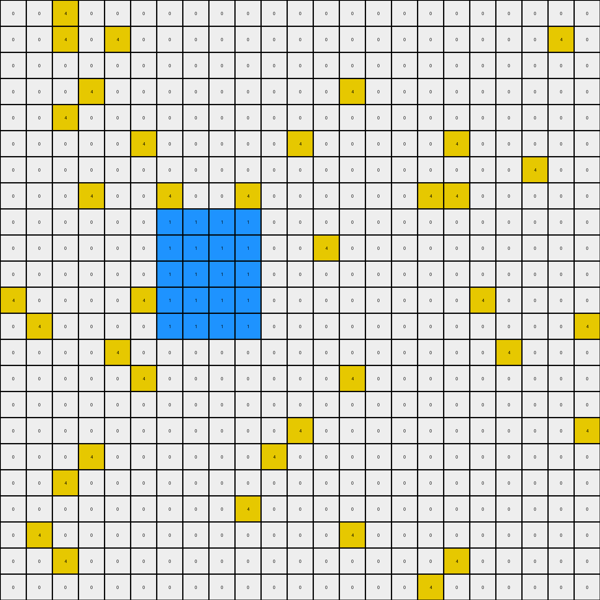

# 7df24a62 • 005 • refine_dreamer

---

Previous Code:
```python
"""
1. Identify the Blue Region: Find the contiguous blue (1) region in the input grid.
2. Determine Bounding Box: Calculate the bounding box (min/max rows and columns) of this blue region.
3. Identify original yellow pixels: Find all of the yellow pixels (4) within the bounding box.
4. Fill Bounding Box: Iterate through all pixels within the bounding box, changing any non-blue to blue.
5. Change initial yellow pixels from yellow to blue.
"""

import numpy as np

def find_blue_region(grid):
    # Find coordinates of all blue pixels
    blue_coords = np.argwhere(grid == 1)
    if blue_coords.size == 0:
        return None, None, None, None  # No blue region

    # Find the bounding box of the blue region
    min_row = np.min(blue_coords[:, 0])
    max_row = np.max(blue_coords[:, 0])
    min_col = np.min(blue_coords[:, 1])
    max_col = np.max(blue_coords[:, 1])

    return min_row, max_row, min_col, max_col

def transform(input_grid):
    # Initialize output_grid as a copy of the input_grid
    output_grid = input_grid.copy()

    # Find the bounding box of the blue region
    min_row, max_row, min_col, max_col = find_blue_region(input_grid)

    if min_row is None:  # Handle cases with no blue region
          return output_grid

    # Identify original yellow pixels within the bounding box
    original_yellow_pixels = []
    for row in range(min_row, max_row + 1):
        for col in range(min_col, max_col + 1):
            if input_grid[row, col] == 4:
                original_yellow_pixels.append((row, col))

    # Fill Bounding Box: Iterate through all pixels within the bounding box
    for row in range(min_row, max_row + 1):
        for col in range(min_col, max_col + 1):
            #change to blue
            output_grid[row,col] = 1

    #restore non yellow, non blue
    for row in range(min_row, max_row + 1):
        for col in range(min_col, max_col + 1):
          if input_grid[row,col] != 1 and input_grid[row,col] != 4:
            output_grid[row,col] = input_grid[row,col]
            

    #Change initial yellow pixels from yellow to blue.
    for row, col in original_yellow_pixels:
       output_grid[row,col] = 1

    return output_grid
```

Train Set Results:

## Example 1:

Input:
```
0 0 0 0 0 0 0 0 0 0 0 0 0 0 0 0 0 0 0 0 0 0 0
0 0 0 1 1 1 1 1 0 0 0 0 0 4 0 0 0 0 0 0 0 0 0
0 0 0 1 4 1 1 1 0 0 0 0 0 0 0 0 0 0 0 0 0 0 0
0 0 0 1 1 1 4 1 0 0 0 0 0 0 0 0 0 0 0 0 0 0 0
0 0 0 1 4 1 1 1 0 0 0 0 0 0 0 0 0 0 0 0 4 0 0
0 0 0 1 1 1 1 1 0 0 0 0 0 0 0 0 0 0 4 0 0 0 0
0 0 0 0 0 0 0 0 0 0 0 0 0 0 0 0 0 0 0 0 0 0 0
0 0 0 0 0 0 0 4 0 0 0 0 0 0 0 0 0 0 0 0 0 0 0
0 0 0 0 0 0 0 0 0 0 0 0 0 0 4 0 0 0 0 0 0 0 0
0 0 0 0 0 0 0 0 0 0 0 0 0 0 0 0 0 0 0 0 0 0 0
0 0 0 0 0 0 0 0 0 0 0 0 0 0 0 0 0 0 0 0 0 0 0
0 0 0 0 0 0 0 0 0 0 0 0 0 0 0 0 0 0 0 0 0 0 0
0 0 0 0 4 0 0 0 0 0 0 0 0 0 0 0 0 0 0 0 0 0 0
0 0 0 0 0 0 0 0 0 0 0 4 0 4 0 0 0 0 0 0 0 0 0
0 0 0 0 4 0 0 0 0 0 0 0 0 0 0 0 0 0 0 4 0 0 0
0 0 0 0 0 0 0 0 0 0 0 0 4 0 0 0 0 0 0 0 0 0 0
0 0 0 0 0 0 0 0 0 0 0 0 0 0 0 0 0 0 0 0 0 0 0
0 0 0 0 0 0 0 0 0 0 0 0 0 0 0 0 0 0 0 0 0 0 0
0 0 0 0 0 0 0 0 0 0 0 0 0 0 0 0 0 0 4 0 0 0 0
0 0 0 0 0 0 0 0 0 0 0 0 0 0 0 0 0 0 0 0 0 0 0
0 0 0 4 0 0 0 0 0 0 0 0 0 0 0 0 0 0 0 0 0 0 0
0 0 0 0 0 0 0 0 0 0 0 4 0 0 0 0 0 0 0 0 0 0 0
0 0 0 0 0 0 0 0 0 0 0 0 0 0 0 0 0 0 0 0 0 0 0
```
Expected Output:
```
0 0 0 0 0 0 0 0 0 0 0 0 0 0 0 0 0 0 0 0 0 0 0
0 0 0 1 1 1 1 1 0 0 0 0 0 4 0 0 0 0 0 0 0 0 0
0 0 0 1 4 1 1 1 0 0 0 0 0 0 0 0 0 0 0 0 0 0 0
0 0 0 1 1 1 4 1 0 0 0 0 0 0 0 0 0 0 0 0 0 0 0
0 0 0 1 4 1 1 1 0 0 0 0 0 0 0 0 0 0 0 0 4 0 0
0 0 0 1 1 1 1 1 0 0 0 0 0 0 0 0 0 0 4 0 0 0 0
0 0 0 0 0 0 0 0 0 0 0 0 0 0 0 0 0 0 0 0 0 0 0
0 0 0 0 0 0 0 4 0 0 0 0 0 0 0 0 0 0 0 0 0 0 0
0 0 0 0 0 0 0 0 0 0 0 0 0 0 4 0 0 0 0 0 0 0 0
0 0 0 0 0 0 0 0 0 0 0 0 0 0 0 0 0 0 0 0 0 0 0
0 0 0 0 0 0 0 0 0 0 0 0 0 0 0 0 0 0 0 0 0 0 0
0 0 0 0 0 0 0 0 0 0 0 0 0 0 0 0 0 0 0 0 0 0 0
0 0 0 0 4 0 0 0 0 0 1 1 1 1 1 0 0 0 0 0 0 0 0
0 0 0 0 0 0 0 0 0 0 1 4 1 4 1 0 0 0 0 0 0 0 0
0 0 0 0 4 0 0 0 0 0 1 1 1 1 1 0 0 0 0 4 0 0 0
0 0 0 0 0 0 0 0 0 0 1 1 4 1 1 0 0 0 0 0 0 0 0
0 0 0 0 0 0 0 0 0 0 1 1 1 1 1 0 0 0 0 0 0 0 0
0 0 0 0 0 0 0 0 0 0 0 0 0 0 0 0 0 0 0 0 0 0 0
0 0 0 0 0 0 0 0 0 0 0 0 0 0 0 0 0 0 4 0 0 0 0
0 0 0 0 0 0 0 0 0 0 0 0 0 0 0 0 0 0 0 0 0 0 0
0 0 0 4 0 0 0 0 0 0 0 0 0 0 0 0 0 0 0 0 0 0 0
0 0 0 0 0 0 0 0 0 0 0 4 0 0 0 0 0 0 0 0 0 0 0
0 0 0 0 0 0 0 0 0 0 0 0 0 0 0 0 0 0 0 0 0 0 0
```
Transformed Output:
```
0 0 0 0 0 0 0 0 0 0 0 0 0 0 0 0 0 0 0 0 0 0 0
0 0 0 1 1 1 1 1 0 0 0 0 0 4 0 0 0 0 0 0 0 0 0
0 0 0 1 1 1 1 1 0 0 0 0 0 0 0 0 0 0 0 0 0 0 0
0 0 0 1 1 1 1 1 0 0 0 0 0 0 0 0 0 0 0 0 0 0 0
0 0 0 1 1 1 1 1 0 0 0 0 0 0 0 0 0 0 0 0 4 0 0
0 0 0 1 1 1 1 1 0 0 0 0 0 0 0 0 0 0 4 0 0 0 0
0 0 0 0 0 0 0 0 0 0 0 0 0 0 0 0 0 0 0 0 0 0 0
0 0 0 0 0 0 0 4 0 0 0 0 0 0 0 0 0 0 0 0 0 0 0
0 0 0 0 0 0 0 0 0 0 0 0 0 0 4 0 0 0 0 0 0 0 0
0 0 0 0 0 0 0 0 0 0 0 0 0 0 0 0 0 0 0 0 0 0 0
0 0 0 0 0 0 0 0 0 0 0 0 0 0 0 0 0 0 0 0 0 0 0
0 0 0 0 0 0 0 0 0 0 0 0 0 0 0 0 0 0 0 0 0 0 0
0 0 0 0 4 0 0 0 0 0 0 0 0 0 0 0 0 0 0 0 0 0 0
0 0 0 0 0 0 0 0 0 0 0 4 0 4 0 0 0 0 0 0 0 0 0
0 0 0 0 4 0 0 0 0 0 0 0 0 0 0 0 0 0 0 4 0 0 0
0 0 0 0 0 0 0 0 0 0 0 0 4 0 0 0 0 0 0 0 0 0 0
0 0 0 0 0 0 0 0 0 0 0 0 0 0 0 0 0 0 0 0 0 0 0
0 0 0 0 0 0 0 0 0 0 0 0 0 0 0 0 0 0 0 0 0 0 0
0 0 0 0 0 0 0 0 0 0 0 0 0 0 0 0 0 0 4 0 0 0 0
0 0 0 0 0 0 0 0 0 0 0 0 0 0 0 0 0 0 0 0 0 0 0
0 0 0 4 0 0 0 0 0 0 0 0 0 0 0 0 0 0 0 0 0 0 0
0 0 0 0 0 0 0 0 0 0 0 4 0 0 0 0 0 0 0 0 0 0 0
0 0 0 0 0 0 0 0 0 0 0 0 0 0 0 0 0 0 0 0 0 0 0
```

match: False
pixels_off: 25
size_correct: True
color_palette_correct: True
correct_pixel_counts: False

## Example 2:

Input:
```
4 0 0 0 0 0 0 0 0 0 4 0 0 0 0 0 0 0 0 0 0 0 0
0 0 0 0 0 0 0 0 0 0 0 0 0 0 0 0 0 0 0 0 0 0 0
0 0 0 0 0 0 0 0 0 0 0 0 0 0 0 0 0 0 0 0 0 0 0
0 0 0 0 0 0 0 0 4 0 0 0 0 0 0 0 0 0 0 0 0 0 4
0 0 0 0 0 0 0 0 0 0 0 0 0 0 0 4 0 0 0 0 0 0 0
0 4 0 0 0 0 0 0 0 0 0 4 0 0 0 0 0 0 0 0 0 0 0
0 0 0 0 0 0 0 0 0 0 0 0 0 4 0 1 1 1 1 0 4 0 0
0 0 0 0 0 0 0 0 0 0 4 0 0 0 0 1 4 1 1 0 0 0 0
0 0 0 0 0 0 0 0 0 0 0 0 0 0 0 1 1 4 1 0 0 0 0
0 0 0 0 0 0 0 0 0 0 4 0 0 0 0 1 1 1 1 0 0 0 0
0 0 0 0 0 0 0 0 0 0 0 0 0 0 0 0 0 0 0 0 0 0 0
0 0 0 0 0 0 0 0 0 0 0 0 0 0 0 0 0 0 0 0 0 0 0
4 0 0 0 0 0 0 0 0 0 0 0 0 0 0 0 0 0 0 0 0 0 0
0 0 0 0 0 0 0 0 0 0 0 0 0 0 0 0 0 0 0 0 0 0 0
0 0 0 0 0 0 0 0 0 0 0 0 0 0 0 4 0 0 0 0 0 0 0
0 0 0 0 0 0 0 0 0 0 0 0 0 0 4 0 0 0 0 0 0 0 0
0 0 0 0 0 0 0 0 0 0 0 0 0 0 0 0 0 0 4 0 0 0 0
0 0 0 0 0 0 0 0 0 0 0 0 0 0 0 0 0 0 0 0 0 0 0
0 0 0 0 0 0 0 0 0 0 0 0 0 0 0 0 0 0 0 0 0 0 4
0 0 0 0 0 4 0 0 0 4 0 0 0 0 0 0 0 0 0 0 0 0 0
0 0 0 0 0 0 0 0 0 0 0 0 0 0 0 0 0 0 0 0 0 4 0
0 0 0 0 0 0 0 0 0 0 0 4 0 0 0 0 0 0 0 0 0 0 0
4 0 0 4 0 0 0 0 0 4 0 4 0 0 0 0 0 0 0 0 0 0 0
```
Expected Output:
```
4 0 0 0 0 0 0 0 0 0 4 0 0 0 0 0 0 0 0 0 0 0 0
0 0 0 0 0 0 0 0 0 0 0 0 0 0 0 0 0 0 0 0 0 0 0
0 0 0 0 0 0 0 0 0 0 0 0 0 0 0 0 0 0 0 0 0 0 0
0 0 0 0 0 0 0 0 4 0 0 0 0 0 0 0 0 0 0 0 0 0 4
0 0 0 0 0 0 0 0 0 0 0 0 0 0 0 4 0 0 0 0 0 0 0
0 4 0 0 0 0 0 0 0 0 0 4 0 0 0 0 0 0 0 0 0 0 0
0 0 0 0 0 0 0 0 0 0 0 0 0 4 0 1 1 1 1 0 4 0 0
0 0 0 0 0 0 0 0 0 0 4 0 0 0 0 1 4 1 1 0 0 0 0
0 0 0 0 0 0 0 0 0 0 0 0 0 0 0 1 1 4 1 0 0 0 0
0 0 0 0 0 0 0 0 0 0 4 0 0 0 0 1 1 1 1 0 0 0 0
0 0 0 0 0 0 0 0 0 0 0 0 0 0 0 0 0 0 0 0 0 0 0
0 0 0 0 0 0 0 0 0 0 0 0 0 0 0 0 0 0 0 0 0 0 0
4 0 0 0 0 0 0 0 0 0 0 0 0 0 0 0 0 0 0 0 0 0 0
0 0 0 0 0 0 0 0 0 0 0 0 0 1 1 1 1 0 0 0 0 0 0
0 0 0 0 0 0 0 0 0 0 0 0 0 1 1 4 1 0 0 0 0 0 0
0 0 0 0 0 0 0 0 0 0 0 0 0 1 4 1 1 0 0 0 0 0 0
0 0 0 0 0 0 0 0 0 0 0 0 0 1 1 1 1 0 4 0 0 0 0
0 0 0 0 0 0 0 0 0 0 0 0 0 0 0 0 0 0 0 0 0 0 0
0 0 0 0 0 0 0 0 0 0 0 0 0 0 0 0 0 0 0 0 0 0 4
0 0 0 0 0 4 0 0 0 4 0 0 0 0 0 0 0 0 0 0 0 0 0
0 0 0 0 0 0 0 0 0 0 0 0 0 0 0 0 0 0 0 0 0 4 0
0 0 0 0 0 0 0 0 0 0 0 4 0 0 0 0 0 0 0 0 0 0 0
4 0 0 4 0 0 0 0 0 4 0 4 0 0 0 0 0 0 0 0 0 0 0
```
Transformed Output:
```
4 0 0 0 0 0 0 0 0 0 4 0 0 0 0 0 0 0 0 0 0 0 0
0 0 0 0 0 0 0 0 0 0 0 0 0 0 0 0 0 0 0 0 0 0 0
0 0 0 0 0 0 0 0 0 0 0 0 0 0 0 0 0 0 0 0 0 0 0
0 0 0 0 0 0 0 0 4 0 0 0 0 0 0 0 0 0 0 0 0 0 4
0 0 0 0 0 0 0 0 0 0 0 0 0 0 0 4 0 0 0 0 0 0 0
0 4 0 0 0 0 0 0 0 0 0 4 0 0 0 0 0 0 0 0 0 0 0
0 0 0 0 0 0 0 0 0 0 0 0 0 4 0 1 1 1 1 0 4 0 0
0 0 0 0 0 0 0 0 0 0 4 0 0 0 0 1 1 1 1 0 0 0 0
0 0 0 0 0 0 0 0 0 0 0 0 0 0 0 1 1 1 1 0 0 0 0
0 0 0 0 0 0 0 0 0 0 4 0 0 0 0 1 1 1 1 0 0 0 0
0 0 0 0 0 0 0 0 0 0 0 0 0 0 0 0 0 0 0 0 0 0 0
0 0 0 0 0 0 0 0 0 0 0 0 0 0 0 0 0 0 0 0 0 0 0
4 0 0 0 0 0 0 0 0 0 0 0 0 0 0 0 0 0 0 0 0 0 0
0 0 0 0 0 0 0 0 0 0 0 0 0 0 0 0 0 0 0 0 0 0 0
0 0 0 0 0 0 0 0 0 0 0 0 0 0 0 4 0 0 0 0 0 0 0
0 0 0 0 0 0 0 0 0 0 0 0 0 0 4 0 0 0 0 0 0 0 0
0 0 0 0 0 0 0 0 0 0 0 0 0 0 0 0 0 0 4 0 0 0 0
0 0 0 0 0 0 0 0 0 0 0 0 0 0 0 0 0 0 0 0 0 0 0
0 0 0 0 0 0 0 0 0 0 0 0 0 0 0 0 0 0 0 0 0 0 4
0 0 0 0 0 4 0 0 0 4 0 0 0 0 0 0 0 0 0 0 0 0 0
0 0 0 0 0 0 0 0 0 0 0 0 0 0 0 0 0 0 0 0 0 4 0
0 0 0 0 0 0 0 0 0 0 0 4 0 0 0 0 0 0 0 0 0 0 0
4 0 0 4 0 0 0 0 0 4 0 4 0 0 0 0 0 0 0 0 0 0 0
```

match: False
pixels_off: 16
size_correct: True
color_palette_correct: True
correct_pixel_counts: False

## Example 3:

Input:
```
0 0 0 0 0 0 0 0 0 0 4 0 0 0 0 0 0 0 0 0 0 0 0
0 0 0 0 0 0 0 0 0 0 0 0 0 0 0 0 0 0 0 0 0 0 0
0 0 0 0 0 0 0 0 0 0 0 0 4 0 0 0 0 0 0 0 0 0 0
0 0 0 0 0 0 0 0 0 0 0 4 0 0 4 0 0 0 0 0 0 0 0
0 0 0 0 0 4 0 0 0 0 0 0 0 0 4 0 4 0 0 0 0 0 0
4 0 0 0 0 0 0 0 0 0 0 0 0 0 0 0 0 0 0 0 0 4 0
0 0 0 0 0 0 0 0 0 0 0 0 0 0 0 0 0 0 0 4 0 0 0
0 0 0 0 0 0 0 4 0 0 0 0 0 0 0 4 0 0 0 0 0 0 0
0 0 0 4 0 0 0 0 0 0 0 0 0 0 0 4 0 0 0 0 0 0 0
0 0 0 0 0 0 0 4 0 0 0 0 0 0 0 0 0 0 0 0 0 0 4
0 0 0 0 0 0 0 0 0 0 0 0 4 0 0 0 0 4 0 0 0 0 0
0 0 0 0 0 0 0 0 0 0 0 0 0 0 0 0 0 0 0 0 4 0 0
0 0 0 0 4 0 0 0 0 0 0 4 0 0 4 4 0 0 4 0 0 0 0
0 0 0 0 0 0 0 0 0 0 0 0 0 0 0 0 0 0 4 0 0 0 0
4 0 4 0 0 1 1 1 1 0 4 0 0 0 0 0 0 0 0 0 0 0 4
0 0 0 0 4 1 4 4 1 0 4 0 0 0 0 0 0 0 0 0 0 0 0
0 0 0 0 0 1 1 1 1 0 0 0 0 0 0 0 0 4 0 0 0 4 0
0 0 4 0 0 0 0 0 0 4 0 0 4 0 0 0 0 0 0 0 0 0 0
0 4 0 0 0 0 0 0 0 0 0 0 0 4 0 0 0 0 0 0 0 0 0
0 0 0 0 0 0 0 0 0 0 0 0 0 0 0 0 4 0 0 0 0 0 4
0 0 0 0 0 0 0 0 0 0 0 0 0 0 0 0 0 0 0 0 0 4 0
0 0 0 0 0 0 0 0 0 0 0 0 0 0 0 0 0 0 0 0 0 0 0
0 0 4 0 0 0 0 0 0 0 4 0 0 0 4 0 0 0 4 0 0 0 0
```
Expected Output:
```
0 0 0 0 0 0 0 0 0 0 4 0 0 0 0 0 0 0 0 0 0 0 0
0 0 0 0 0 0 0 0 0 0 0 0 0 0 0 0 0 0 0 0 0 0 0
0 0 0 0 0 0 0 0 0 0 0 0 4 1 1 1 0 0 0 0 0 0 0
0 0 0 0 0 0 0 0 0 0 0 4 0 1 4 1 0 0 0 0 0 0 0
0 0 0 0 0 4 0 0 0 0 0 0 0 1 4 1 4 0 0 0 0 0 0
4 0 0 0 0 0 0 0 0 0 0 0 0 1 1 1 0 0 0 0 0 4 0
0 0 0 0 0 0 0 0 0 0 0 0 0 0 1 1 1 0 0 4 0 0 0
0 0 0 0 0 0 0 4 0 0 0 0 0 0 1 4 1 0 0 0 0 0 0
0 0 0 4 0 0 0 0 0 0 0 0 0 0 1 4 1 0 0 0 0 0 0
0 0 0 0 0 0 0 4 0 0 0 0 0 0 1 1 1 0 0 0 0 0 4
0 0 0 0 0 0 0 0 0 0 0 0 4 0 0 0 0 4 0 0 0 0 0
0 0 0 0 0 0 0 0 0 0 0 0 0 1 1 1 1 1 1 1 4 0 0
0 0 0 0 4 0 0 0 0 0 0 4 0 1 4 4 1 1 4 1 0 0 0
0 0 0 0 0 0 0 0 0 1 1 1 0 1 1 1 1 1 4 1 0 0 0
4 0 4 0 0 1 1 1 1 1 4 1 0 0 0 0 0 1 1 1 0 0 4
0 0 0 0 4 1 4 4 1 1 4 1 0 0 0 0 0 0 0 0 0 0 0
0 0 0 0 0 1 1 1 1 1 1 1 0 0 0 0 0 4 0 0 0 4 0
0 0 4 0 0 0 0 0 0 4 0 0 4 0 0 0 0 0 0 0 0 0 0
0 4 0 0 0 0 0 0 0 0 0 0 0 4 0 0 0 0 0 0 0 0 0
0 0 0 0 0 0 0 0 0 0 0 0 0 0 0 0 4 0 0 0 0 0 4
0 0 0 0 0 0 0 0 0 0 0 0 0 0 0 0 0 0 0 0 0 4 0
0 0 0 0 0 0 0 0 0 0 0 0 0 0 0 0 0 0 0 0 0 0 0
0 0 4 0 0 0 0 0 0 0 4 0 0 0 4 0 0 0 4 0 0 0 0
```
Transformed Output:
```
0 0 0 0 0 0 0 0 0 0 4 0 0 0 0 0 0 0 0 0 0 0 0
0 0 0 0 0 0 0 0 0 0 0 0 0 0 0 0 0 0 0 0 0 0 0
0 0 0 0 0 0 0 0 0 0 0 0 4 0 0 0 0 0 0 0 0 0 0
0 0 0 0 0 0 0 0 0 0 0 4 0 0 4 0 0 0 0 0 0 0 0
0 0 0 0 0 4 0 0 0 0 0 0 0 0 4 0 4 0 0 0 0 0 0
4 0 0 0 0 0 0 0 0 0 0 0 0 0 0 0 0 0 0 0 0 4 0
0 0 0 0 0 0 0 0 0 0 0 0 0 0 0 0 0 0 0 4 0 0 0
0 0 0 0 0 0 0 4 0 0 0 0 0 0 0 4 0 0 0 0 0 0 0
0 0 0 4 0 0 0 0 0 0 0 0 0 0 0 4 0 0 0 0 0 0 0
0 0 0 0 0 0 0 4 0 0 0 0 0 0 0 0 0 0 0 0 0 0 4
0 0 0 0 0 0 0 0 0 0 0 0 4 0 0 0 0 4 0 0 0 0 0
0 0 0 0 0 0 0 0 0 0 0 0 0 0 0 0 0 0 0 0 4 0 0
0 0 0 0 4 0 0 0 0 0 0 4 0 0 4 4 0 0 4 0 0 0 0
0 0 0 0 0 0 0 0 0 0 0 0 0 0 0 0 0 0 4 0 0 0 0
4 0 4 0 0 1 1 1 1 0 4 0 0 0 0 0 0 0 0 0 0 0 4
0 0 0 0 4 1 1 1 1 0 4 0 0 0 0 0 0 0 0 0 0 0 0
0 0 0 0 0 1 1 1 1 0 0 0 0 0 0 0 0 4 0 0 0 4 0
0 0 4 0 0 0 0 0 0 4 0 0 4 0 0 0 0 0 0 0 0 0 0
0 4 0 0 0 0 0 0 0 0 0 0 0 4 0 0 0 0 0 0 0 0 0
0 0 0 0 0 0 0 0 0 0 0 0 0 0 0 0 4 0 0 0 0 0 4
0 0 0 0 0 0 0 0 0 0 0 0 0 0 0 0 0 0 0 0 0 4 0
0 0 0 0 0 0 0 0 0 0 0 0 0 0 0 0 0 0 0 0 0 0 0
0 0 4 0 0 0 0 0 0 0 4 0 0 0 4 0 0 0 4 0 0 0 0
```

match: False
pixels_off: 52
size_correct: True
color_palette_correct: True
correct_pixel_counts: False

## Example 4:

Input:
```
0 0 4 0 0 0 0 0 0 0 0 0 0 0 0 0 0 0 0 0 0 0 0
0 0 4 0 4 0 0 0 0 0 0 0 0 0 0 0 0 0 0 0 0 4 0
0 0 0 0 0 0 0 0 0 0 0 0 0 0 0 0 0 0 0 0 0 0 0
0 0 0 4 0 0 0 0 0 0 0 0 0 4 0 0 0 0 0 0 0 0 0
0 0 4 0 0 0 0 0 0 0 0 0 0 0 0 0 0 0 0 0 0 0 0
0 0 0 0 0 4 0 0 0 0 0 4 0 0 0 0 0 4 0 0 0 0 0
0 0 0 0 0 0 0 0 0 0 0 0 0 0 0 0 0 0 0 0 4 0 0
0 0 0 4 0 0 4 0 0 4 0 0 0 0 0 0 4 4 0 0 0 0 0
0 0 0 0 0 0 1 1 1 1 0 0 0 0 0 0 0 0 0 0 0 0 0
0 0 0 0 0 0 1 4 4 1 0 0 4 0 0 0 0 0 0 0 0 0 0
0 0 0 0 0 0 1 1 1 1 0 0 0 0 0 0 0 0 0 0 0 0 0
4 0 0 0 0 4 1 4 1 1 0 0 0 0 0 0 0 0 4 0 0 0 0
0 4 0 0 0 0 1 1 1 1 0 0 0 0 0 0 0 0 0 0 0 0 4
0 0 0 0 4 0 0 0 0 0 0 0 0 0 0 0 0 0 0 4 0 0 0
0 0 0 0 0 4 0 0 0 0 0 0 0 4 0 0 0 0 0 0 0 0 0
0 0 0 0 0 0 0 0 0 0 0 0 0 0 0 0 0 0 0 0 0 0 0
0 0 0 0 0 0 0 0 0 0 0 4 0 0 0 0 0 0 0 0 0 0 4
0 0 0 4 0 0 0 0 0 0 4 0 0 0 0 0 0 0 0 0 0 0 0
0 0 4 0 0 0 0 0 0 0 0 0 0 0 0 0 0 0 0 0 0 0 0
0 0 0 0 0 0 0 0 0 4 0 0 0 0 0 0 0 0 0 0 0 0 0
0 4 0 0 0 0 0 0 0 0 0 0 0 4 0 0 0 0 0 0 0 0 0
0 0 4 0 0 0 0 0 0 0 0 0 0 0 0 0 0 4 0 0 0 0 0
0 0 0 0 0 0 0 0 0 0 0 0 0 0 0 0 4 0 0 0 0 0 0
```
Expected Output:
```
0 1 4 1 1 1 0 0 0 0 0 0 0 0 0 0 0 0 0 0 0 0 0
0 1 4 1 4 1 0 0 0 0 0 0 0 0 0 0 0 0 0 0 0 4 0
0 1 1 1 1 1 0 0 0 0 0 0 0 0 0 0 0 0 0 0 0 0 0
0 0 0 4 0 0 0 0 0 0 0 0 0 4 0 0 0 0 0 0 0 0 0
0 0 4 0 0 0 0 0 0 0 0 0 0 0 0 1 1 1 1 0 0 0 0
0 0 0 0 0 4 0 0 0 0 0 4 0 0 0 1 1 4 1 0 0 0 0
0 0 0 0 0 0 0 0 0 0 0 0 0 0 0 1 1 1 1 0 4 0 0
0 0 0 4 0 0 4 0 0 4 0 0 0 0 0 1 4 4 1 0 0 0 0
0 0 0 0 0 0 1 1 1 1 0 0 0 0 0 1 1 1 1 0 0 0 0
0 0 0 0 0 0 1 4 4 1 0 0 4 0 0 0 0 0 0 0 0 0 0
0 0 0 0 0 0 1 1 1 1 0 0 0 0 0 0 0 0 0 0 0 0 0
4 0 0 0 0 4 1 4 1 1 0 0 0 0 0 0 0 0 4 0 0 0 0
0 4 0 0 0 0 1 1 1 1 0 0 0 0 0 0 0 0 0 0 0 0 4
0 0 0 0 4 0 0 0 0 0 0 0 0 0 0 0 0 0 0 4 0 0 0
0 0 0 0 0 4 0 0 0 0 0 0 0 4 0 0 0 0 0 0 0 0 0
0 0 0 0 0 0 0 0 0 0 0 0 0 0 0 0 0 0 0 0 0 0 0
0 0 0 0 0 0 0 0 0 0 0 4 0 0 0 0 0 0 0 0 0 0 4
0 0 0 4 0 0 0 0 0 0 4 0 0 0 0 0 0 0 0 0 0 0 0
0 0 4 0 0 0 0 0 0 0 0 0 0 0 0 0 0 0 0 0 0 0 0
0 0 0 0 0 0 0 0 0 4 0 0 0 0 0 0 0 0 0 0 0 0 0
0 4 0 0 0 0 0 0 0 0 0 0 0 4 0 0 0 0 0 0 0 0 0
0 0 4 0 0 0 0 0 0 0 0 0 0 0 0 0 0 4 0 0 0 0 0
0 0 0 0 0 0 0 0 0 0 0 0 0 0 0 0 4 0 0 0 0 0 0
```
Transformed Output:
```
0 0 4 0 0 0 0 0 0 0 0 0 0 0 0 0 0 0 0 0 0 0 0
0 0 4 0 4 0 0 0 0 0 0 0 0 0 0 0 0 0 0 0 0 4 0
0 0 0 0 0 0 0 0 0 0 0 0 0 0 0 0 0 0 0 0 0 0 0
0 0 0 4 0 0 0 0 0 0 0 0 0 4 0 0 0 0 0 0 0 0 0
0 0 4 0 0 0 0 0 0 0 0 0 0 0 0 0 0 0 0 0 0 0 0
0 0 0 0 0 4 0 0 0 0 0 4 0 0 0 0 0 4 0 0 0 0 0
0 0 0 0 0 0 0 0 0 0 0 0 0 0 0 0 0 0 0 0 4 0 0
0 0 0 4 0 0 4 0 0 4 0 0 0 0 0 0 4 4 0 0 0 0 0
0 0 0 0 0 0 1 1 1 1 0 0 0 0 0 0 0 0 0 0 0 0 0
0 0 0 0 0 0 1 1 1 1 0 0 4 0 0 0 0 0 0 0 0 0 0
0 0 0 0 0 0 1 1 1 1 0 0 0 0 0 0 0 0 0 0 0 0 0
4 0 0 0 0 4 1 1 1 1 0 0 0 0 0 0 0 0 4 0 0 0 0
0 4 0 0 0 0 1 1 1 1 0 0 0 0 0 0 0 0 0 0 0 0 4
0 0 0 0 4 0 0 0 0 0 0 0 0 0 0 0 0 0 0 4 0 0 0
0 0 0 0 0 4 0 0 0 0 0 0 0 4 0 0 0 0 0 0 0 0 0
0 0 0 0 0 0 0 0 0 0 0 0 0 0 0 0 0 0 0 0 0 0 0
0 0 0 0 0 0 0 0 0 0 0 4 0 0 0 0 0 0 0 0 0 0 4
0 0 0 4 0 0 0 0 0 0 4 0 0 0 0 0 0 0 0 0 0 0 0
0 0 4 0 0 0 0 0 0 0 0 0 0 0 0 0 0 0 0 0 0 0 0
0 0 0 0 0 0 0 0 0 4 0 0 0 0 0 0 0 0 0 0 0 0 0
0 4 0 0 0 0 0 0 0 0 0 0 0 4 0 0 0 0 0 0 0 0 0
0 0 4 0 0 0 0 0 0 0 0 0 0 0 0 0 0 4 0 0 0 0 0
0 0 0 0 0 0 0 0 0 0 0 0 0 0 0 0 4 0 0 0 0 0 0
```

match: False
pixels_off: 32
size_correct: True
color_palette_correct: True
correct_pixel_counts: False
**INSTRUCTIONS**

The code above was generated based on observations from the first training
example

we have tested the transform function on each of the task example inputs and
compared with the expected output

review each of the examples provided and the results and consider how the
natural language program should be updated to accommodate this new knowledge

respond with the following deliverables:

- general assessment of the information provided and strategy for resolving the
  errors
- gather metrics about each of the examples and results - use code_execution to
  develop accurate reports on your assumptions
- a YAML block documenting facts - Focus on identifying objects, their properties, and the actions performed on them.
- a natural language program - Be as clear and concise as possible, providing a complete description of the transformation rule.


your responses should be considered as information in a report - not a
conversation
