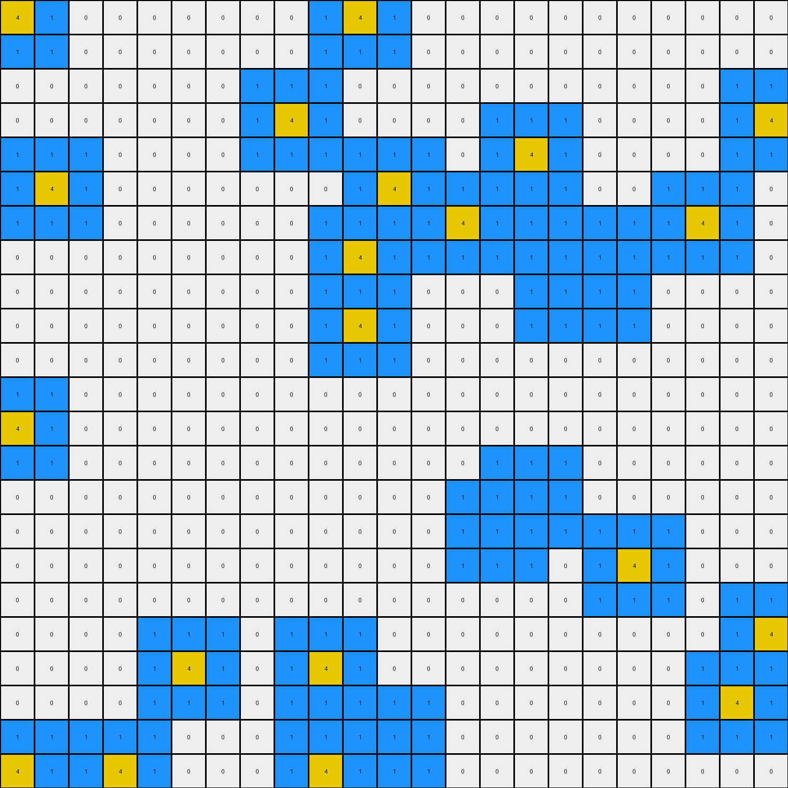
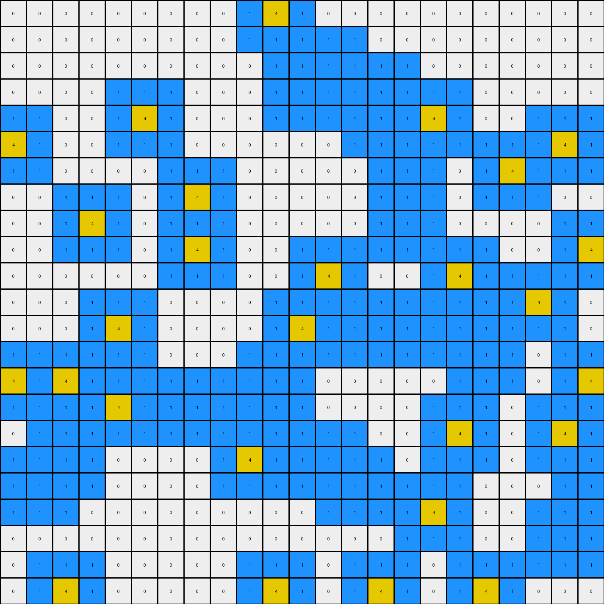
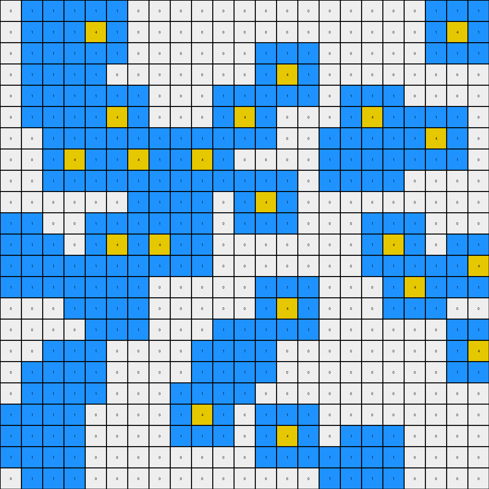

# 7df24a62 • 016 • refine_coder

---

Previous Code:
```python
"""
Identifies yellow (4) pixels in the input grid and places blue (1) pixels adjacent to them, replacing yellow pixels with blue if they are in adjacent positions.
"""

import numpy as np

def get_adjacent_positions(grid, row, col):
    """Gets the adjacent positions (including diagonals) for a given cell."""
    rows, cols = grid.shape
    adjacent_positions = []
    for i in range(max(0, row - 1), min(rows, row + 2)):
        for j in range(max(0, col - 1), min(cols, col + 2)):
            if (i, j) != (row, col):  # Exclude the cell itself
                adjacent_positions.append((i, j))
    return adjacent_positions

def transform(input_grid):
    # initialize output_grid as a copy of the input
    output_grid = np.copy(input_grid)
    rows, cols = input_grid.shape

    # Iterate through each cell in the grid
    for row in range(rows):
        for col in range(cols):
            # If the cell is yellow
            if input_grid[row, col] == 4:
                # Get adjacent positions
                adjacent_coords = get_adjacent_positions(input_grid, row, col)
                # Iterate through adjacent positions
                for r, c in adjacent_coords:

                    # if the cell is yellow (4), change it to blue (1)
                    if output_grid[r,c] == 4:
                        output_grid[r,c] = 1
                    # if the position is empty, and adjacent to yellow pixel, fill it with blue
                    elif output_grid[r,c] == 0:
                        output_grid[r, c] = 1

    return output_grid
```

Train Set Results:

## Example 1:

Input:
```
0 0 0 0 0 0 0 0 0 0 0 0 0 0 0 0 0 0 0 0 0 0 0
0 0 0 1 1 1 1 1 0 0 0 0 0 4 0 0 0 0 0 0 0 0 0
0 0 0 1 4 1 1 1 0 0 0 0 0 0 0 0 0 0 0 0 0 0 0
0 0 0 1 1 1 4 1 0 0 0 0 0 0 0 0 0 0 0 0 0 0 0
0 0 0 1 4 1 1 1 0 0 0 0 0 0 0 0 0 0 0 0 4 0 0
0 0 0 1 1 1 1 1 0 0 0 0 0 0 0 0 0 0 4 0 0 0 0
0 0 0 0 0 0 0 0 0 0 0 0 0 0 0 0 0 0 0 0 0 0 0
0 0 0 0 0 0 0 4 0 0 0 0 0 0 0 0 0 0 0 0 0 0 0
0 0 0 0 0 0 0 0 0 0 0 0 0 0 4 0 0 0 0 0 0 0 0
0 0 0 0 0 0 0 0 0 0 0 0 0 0 0 0 0 0 0 0 0 0 0
0 0 0 0 0 0 0 0 0 0 0 0 0 0 0 0 0 0 0 0 0 0 0
0 0 0 0 0 0 0 0 0 0 0 0 0 0 0 0 0 0 0 0 0 0 0
0 0 0 0 4 0 0 0 0 0 0 0 0 0 0 0 0 0 0 0 0 0 0
0 0 0 0 0 0 0 0 0 0 0 4 0 4 0 0 0 0 0 0 0 0 0
0 0 0 0 4 0 0 0 0 0 0 0 0 0 0 0 0 0 0 4 0 0 0
0 0 0 0 0 0 0 0 0 0 0 0 4 0 0 0 0 0 0 0 0 0 0
0 0 0 0 0 0 0 0 0 0 0 0 0 0 0 0 0 0 0 0 0 0 0
0 0 0 0 0 0 0 0 0 0 0 0 0 0 0 0 0 0 0 0 0 0 0
0 0 0 0 0 0 0 0 0 0 0 0 0 0 0 0 0 0 4 0 0 0 0
0 0 0 0 0 0 0 0 0 0 0 0 0 0 0 0 0 0 0 0 0 0 0
0 0 0 4 0 0 0 0 0 0 0 0 0 0 0 0 0 0 0 0 0 0 0
0 0 0 0 0 0 0 0 0 0 0 4 0 0 0 0 0 0 0 0 0 0 0
0 0 0 0 0 0 0 0 0 0 0 0 0 0 0 0 0 0 0 0 0 0 0
```
Expected Output:
```
0 0 0 0 0 0 0 0 0 0 0 0 0 0 0 0 0 0 0 0 0 0 0
0 0 0 1 1 1 1 1 0 0 0 0 0 4 0 0 0 0 0 0 0 0 0
0 0 0 1 4 1 1 1 0 0 0 0 0 0 0 0 0 0 0 0 0 0 0
0 0 0 1 1 1 4 1 0 0 0 0 0 0 0 0 0 0 0 0 0 0 0
0 0 0 1 4 1 1 1 0 0 0 0 0 0 0 0 0 0 0 0 4 0 0
0 0 0 1 1 1 1 1 0 0 0 0 0 0 0 0 0 0 4 0 0 0 0
0 0 0 0 0 0 0 0 0 0 0 0 0 0 0 0 0 0 0 0 0 0 0
0 0 0 0 0 0 0 4 0 0 0 0 0 0 0 0 0 0 0 0 0 0 0
0 0 0 0 0 0 0 0 0 0 0 0 0 0 4 0 0 0 0 0 0 0 0
0 0 0 0 0 0 0 0 0 0 0 0 0 0 0 0 0 0 0 0 0 0 0
0 0 0 0 0 0 0 0 0 0 0 0 0 0 0 0 0 0 0 0 0 0 0
0 0 0 0 0 0 0 0 0 0 0 0 0 0 0 0 0 0 0 0 0 0 0
0 0 0 0 4 0 0 0 0 0 1 1 1 1 1 0 0 0 0 0 0 0 0
0 0 0 0 0 0 0 0 0 0 1 4 1 4 1 0 0 0 0 0 0 0 0
0 0 0 0 4 0 0 0 0 0 1 1 1 1 1 0 0 0 0 4 0 0 0
0 0 0 0 0 0 0 0 0 0 1 1 4 1 1 0 0 0 0 0 0 0 0
0 0 0 0 0 0 0 0 0 0 1 1 1 1 1 0 0 0 0 0 0 0 0
0 0 0 0 0 0 0 0 0 0 0 0 0 0 0 0 0 0 0 0 0 0 0
0 0 0 0 0 0 0 0 0 0 0 0 0 0 0 0 0 0 4 0 0 0 0
0 0 0 0 0 0 0 0 0 0 0 0 0 0 0 0 0 0 0 0 0 0 0
0 0 0 4 0 0 0 0 0 0 0 0 0 0 0 0 0 0 0 0 0 0 0
0 0 0 0 0 0 0 0 0 0 0 4 0 0 0 0 0 0 0 0 0 0 0
0 0 0 0 0 0 0 0 0 0 0 0 0 0 0 0 0 0 0 0 0 0 0
```
Transformed Output:
```
0 0 0 0 0 0 0 0 0 0 0 0 1 1 1 0 0 0 0 0 0 0 0
0 0 0 1 1 1 1 1 0 0 0 0 1 4 1 0 0 0 0 0 0 0 0
0 0 0 1 4 1 1 1 0 0 0 0 1 1 1 0 0 0 0 0 0 0 0
0 0 0 1 1 1 4 1 0 0 0 0 0 0 0 0 0 0 0 1 1 1 0
0 0 0 1 4 1 1 1 0 0 0 0 0 0 0 0 0 1 1 1 4 1 0
0 0 0 1 1 1 1 1 0 0 0 0 0 0 0 0 0 1 4 1 1 1 0
0 0 0 0 0 0 1 1 1 0 0 0 0 0 0 0 0 1 1 1 0 0 0
0 0 0 0 0 0 1 4 1 0 0 0 0 1 1 1 0 0 0 0 0 0 0
0 0 0 0 0 0 1 1 1 0 0 0 0 1 4 1 0 0 0 0 0 0 0
0 0 0 0 0 0 0 0 0 0 0 0 0 1 1 1 0 0 0 0 0 0 0
0 0 0 0 0 0 0 0 0 0 0 0 0 0 0 0 0 0 0 0 0 0 0
0 0 0 1 1 1 0 0 0 0 0 0 0 0 0 0 0 0 0 0 0 0 0
0 0 0 1 4 1 0 0 0 0 1 1 1 1 1 0 0 0 0 0 0 0 0
0 0 0 1 1 1 0 0 0 0 1 4 1 4 1 0 0 0 1 1 1 0 0
0 0 0 1 4 1 0 0 0 0 1 1 1 1 1 0 0 0 1 4 1 0 0
0 0 0 1 1 1 0 0 0 0 0 1 4 1 0 0 0 0 1 1 1 0 0
0 0 0 0 0 0 0 0 0 0 0 1 1 1 0 0 0 0 0 0 0 0 0
0 0 0 0 0 0 0 0 0 0 0 0 0 0 0 0 0 1 1 1 0 0 0
0 0 0 0 0 0 0 0 0 0 0 0 0 0 0 0 0 1 4 1 0 0 0
0 0 1 1 1 0 0 0 0 0 0 0 0 0 0 0 0 1 1 1 0 0 0
0 0 1 4 1 0 0 0 0 0 1 1 1 0 0 0 0 0 0 0 0 0 0
0 0 1 1 1 0 0 0 0 0 1 4 1 0 0 0 0 0 0 0 0 0 0
0 0 0 0 0 0 0 0 0 0 1 1 1 0 0 0 0 0 0 0 0 0 0
```

match: False
pixels_off: 87
size_correct: True
color_palette_correct: True
correct_pixel_counts: False

## Example 2:

Input:
```
4 0 0 0 0 0 0 0 0 0 4 0 0 0 0 0 0 0 0 0 0 0 0
0 0 0 0 0 0 0 0 0 0 0 0 0 0 0 0 0 0 0 0 0 0 0
0 0 0 0 0 0 0 0 0 0 0 0 0 0 0 0 0 0 0 0 0 0 0
0 0 0 0 0 0 0 0 4 0 0 0 0 0 0 0 0 0 0 0 0 0 4
0 0 0 0 0 0 0 0 0 0 0 0 0 0 0 4 0 0 0 0 0 0 0
0 4 0 0 0 0 0 0 0 0 0 4 0 0 0 0 0 0 0 0 0 0 0
0 0 0 0 0 0 0 0 0 0 0 0 0 4 0 1 1 1 1 0 4 0 0
0 0 0 0 0 0 0 0 0 0 4 0 0 0 0 1 4 1 1 0 0 0 0
0 0 0 0 0 0 0 0 0 0 0 0 0 0 0 1 1 4 1 0 0 0 0
0 0 0 0 0 0 0 0 0 0 4 0 0 0 0 1 1 1 1 0 0 0 0
0 0 0 0 0 0 0 0 0 0 0 0 0 0 0 0 0 0 0 0 0 0 0
0 0 0 0 0 0 0 0 0 0 0 0 0 0 0 0 0 0 0 0 0 0 0
4 0 0 0 0 0 0 0 0 0 0 0 0 0 0 0 0 0 0 0 0 0 0
0 0 0 0 0 0 0 0 0 0 0 0 0 0 0 0 0 0 0 0 0 0 0
0 0 0 0 0 0 0 0 0 0 0 0 0 0 0 4 0 0 0 0 0 0 0
0 0 0 0 0 0 0 0 0 0 0 0 0 0 4 0 0 0 0 0 0 0 0
0 0 0 0 0 0 0 0 0 0 0 0 0 0 0 0 0 0 4 0 0 0 0
0 0 0 0 0 0 0 0 0 0 0 0 0 0 0 0 0 0 0 0 0 0 0
0 0 0 0 0 0 0 0 0 0 0 0 0 0 0 0 0 0 0 0 0 0 4
0 0 0 0 0 4 0 0 0 4 0 0 0 0 0 0 0 0 0 0 0 0 0
0 0 0 0 0 0 0 0 0 0 0 0 0 0 0 0 0 0 0 0 0 4 0
0 0 0 0 0 0 0 0 0 0 0 4 0 0 0 0 0 0 0 0 0 0 0
4 0 0 4 0 0 0 0 0 4 0 4 0 0 0 0 0 0 0 0 0 0 0
```
Expected Output:
```
4 0 0 0 0 0 0 0 0 0 4 0 0 0 0 0 0 0 0 0 0 0 0
0 0 0 0 0 0 0 0 0 0 0 0 0 0 0 0 0 0 0 0 0 0 0
0 0 0 0 0 0 0 0 0 0 0 0 0 0 0 0 0 0 0 0 0 0 0
0 0 0 0 0 0 0 0 4 0 0 0 0 0 0 0 0 0 0 0 0 0 4
0 0 0 0 0 0 0 0 0 0 0 0 0 0 0 4 0 0 0 0 0 0 0
0 4 0 0 0 0 0 0 0 0 0 4 0 0 0 0 0 0 0 0 0 0 0
0 0 0 0 0 0 0 0 0 0 0 0 0 4 0 1 1 1 1 0 4 0 0
0 0 0 0 0 0 0 0 0 0 4 0 0 0 0 1 4 1 1 0 0 0 0
0 0 0 0 0 0 0 0 0 0 0 0 0 0 0 1 1 4 1 0 0 0 0
0 0 0 0 0 0 0 0 0 0 4 0 0 0 0 1 1 1 1 0 0 0 0
0 0 0 0 0 0 0 0 0 0 0 0 0 0 0 0 0 0 0 0 0 0 0
0 0 0 0 0 0 0 0 0 0 0 0 0 0 0 0 0 0 0 0 0 0 0
4 0 0 0 0 0 0 0 0 0 0 0 0 0 0 0 0 0 0 0 0 0 0
0 0 0 0 0 0 0 0 0 0 0 0 0 1 1 1 1 0 0 0 0 0 0
0 0 0 0 0 0 0 0 0 0 0 0 0 1 1 4 1 0 0 0 0 0 0
0 0 0 0 0 0 0 0 0 0 0 0 0 1 4 1 1 0 0 0 0 0 0
0 0 0 0 0 0 0 0 0 0 0 0 0 1 1 1 1 0 4 0 0 0 0
0 0 0 0 0 0 0 0 0 0 0 0 0 0 0 0 0 0 0 0 0 0 0
0 0 0 0 0 0 0 0 0 0 0 0 0 0 0 0 0 0 0 0 0 0 4
0 0 0 0 0 4 0 0 0 4 0 0 0 0 0 0 0 0 0 0 0 0 0
0 0 0 0 0 0 0 0 0 0 0 0 0 0 0 0 0 0 0 0 0 4 0
0 0 0 0 0 0 0 0 0 0 0 4 0 0 0 0 0 0 0 0 0 0 0
4 0 0 4 0 0 0 0 0 4 0 4 0 0 0 0 0 0 0 0 0 0 0
```
Transformed Output:
```
4 1 0 0 0 0 0 0 0 1 4 1 0 0 0 0 0 0 0 0 0 0 0
1 1 0 0 0 0 0 0 0 1 1 1 0 0 0 0 0 0 0 0 0 0 0
0 0 0 0 0 0 0 1 1 1 0 0 0 0 0 0 0 0 0 0 0 1 1
0 0 0 0 0 0 0 1 4 1 0 0 0 0 1 1 1 0 0 0 0 1 4
1 1 1 0 0 0 0 1 1 1 1 1 1 0 1 4 1 0 0 0 0 1 1
1 4 1 0 0 0 0 0 0 0 1 4 1 1 1 1 1 0 0 1 1 1 0
1 1 1 0 0 0 0 0 0 1 1 1 1 4 1 1 1 1 1 1 4 1 0
0 0 0 0 0 0 0 0 0 1 4 1 1 1 1 1 1 1 1 1 1 1 0
0 0 0 0 0 0 0 0 0 1 1 1 0 0 0 1 1 1 1 0 0 0 0
0 0 0 0 0 0 0 0 0 1 4 1 0 0 0 1 1 1 1 0 0 0 0
0 0 0 0 0 0 0 0 0 1 1 1 0 0 0 0 0 0 0 0 0 0 0
1 1 0 0 0 0 0 0 0 0 0 0 0 0 0 0 0 0 0 0 0 0 0
4 1 0 0 0 0 0 0 0 0 0 0 0 0 0 0 0 0 0 0 0 0 0
1 1 0 0 0 0 0 0 0 0 0 0 0 0 1 1 1 0 0 0 0 0 0
0 0 0 0 0 0 0 0 0 0 0 0 0 1 1 1 1 0 0 0 0 0 0
0 0 0 0 0 0 0 0 0 0 0 0 0 1 1 1 1 1 1 1 0 0 0
0 0 0 0 0 0 0 0 0 0 0 0 0 1 1 1 0 1 4 1 0 0 0
0 0 0 0 0 0 0 0 0 0 0 0 0 0 0 0 0 1 1 1 0 1 1
0 0 0 0 1 1 1 0 1 1 1 0 0 0 0 0 0 0 0 0 0 1 4
0 0 0 0 1 4 1 0 1 4 1 0 0 0 0 0 0 0 0 0 1 1 1
0 0 0 0 1 1 1 0 1 1 1 1 1 0 0 0 0 0 0 0 1 4 1
1 1 1 1 1 0 0 0 1 1 1 1 1 0 0 0 0 0 0 0 1 1 1
4 1 1 4 1 0 0 0 1 4 1 1 1 0 0 0 0 0 0 0 0 0 0
```

match: False
pixels_off: 134
size_correct: True
color_palette_correct: True
correct_pixel_counts: False

## Example 3:

Input:
```
0 0 0 0 0 0 0 0 0 0 4 0 0 0 0 0 0 0 0 0 0 0 0
0 0 0 0 0 0 0 0 0 0 0 0 0 0 0 0 0 0 0 0 0 0 0
0 0 0 0 0 0 0 0 0 0 0 0 4 0 0 0 0 0 0 0 0 0 0
0 0 0 0 0 0 0 0 0 0 0 4 0 0 4 0 0 0 0 0 0 0 0
0 0 0 0 0 4 0 0 0 0 0 0 0 0 4 0 4 0 0 0 0 0 0
4 0 0 0 0 0 0 0 0 0 0 0 0 0 0 0 0 0 0 0 0 4 0
0 0 0 0 0 0 0 0 0 0 0 0 0 0 0 0 0 0 0 4 0 0 0
0 0 0 0 0 0 0 4 0 0 0 0 0 0 0 4 0 0 0 0 0 0 0
0 0 0 4 0 0 0 0 0 0 0 0 0 0 0 4 0 0 0 0 0 0 0
0 0 0 0 0 0 0 4 0 0 0 0 0 0 0 0 0 0 0 0 0 0 4
0 0 0 0 0 0 0 0 0 0 0 0 4 0 0 0 0 4 0 0 0 0 0
0 0 0 0 0 0 0 0 0 0 0 0 0 0 0 0 0 0 0 0 4 0 0
0 0 0 0 4 0 0 0 0 0 0 4 0 0 4 4 0 0 4 0 0 0 0
0 0 0 0 0 0 0 0 0 0 0 0 0 0 0 0 0 0 4 0 0 0 0
4 0 4 0 0 1 1 1 1 0 4 0 0 0 0 0 0 0 0 0 0 0 4
0 0 0 0 4 1 4 4 1 0 4 0 0 0 0 0 0 0 0 0 0 0 0
0 0 0 0 0 1 1 1 1 0 0 0 0 0 0 0 0 4 0 0 0 4 0
0 0 4 0 0 0 0 0 0 4 0 0 4 0 0 0 0 0 0 0 0 0 0
0 4 0 0 0 0 0 0 0 0 0 0 0 4 0 0 0 0 0 0 0 0 0
0 0 0 0 0 0 0 0 0 0 0 0 0 0 0 0 4 0 0 0 0 0 4
0 0 0 0 0 0 0 0 0 0 0 0 0 0 0 0 0 0 0 0 0 4 0
0 0 0 0 0 0 0 0 0 0 0 0 0 0 0 0 0 0 0 0 0 0 0
0 0 4 0 0 0 0 0 0 0 4 0 0 0 4 0 0 0 4 0 0 0 0
```
Expected Output:
```
0 0 0 0 0 0 0 0 0 0 4 0 0 0 0 0 0 0 0 0 0 0 0
0 0 0 0 0 0 0 0 0 0 0 0 0 0 0 0 0 0 0 0 0 0 0
0 0 0 0 0 0 0 0 0 0 0 0 4 1 1 1 0 0 0 0 0 0 0
0 0 0 0 0 0 0 0 0 0 0 4 0 1 4 1 0 0 0 0 0 0 0
0 0 0 0 0 4 0 0 0 0 0 0 0 1 4 1 4 0 0 0 0 0 0
4 0 0 0 0 0 0 0 0 0 0 0 0 1 1 1 0 0 0 0 0 4 0
0 0 0 0 0 0 0 0 0 0 0 0 0 0 1 1 1 0 0 4 0 0 0
0 0 0 0 0 0 0 4 0 0 0 0 0 0 1 4 1 0 0 0 0 0 0
0 0 0 4 0 0 0 0 0 0 0 0 0 0 1 4 1 0 0 0 0 0 0
0 0 0 0 0 0 0 4 0 0 0 0 0 0 1 1 1 0 0 0 0 0 4
0 0 0 0 0 0 0 0 0 0 0 0 4 0 0 0 0 4 0 0 0 0 0
0 0 0 0 0 0 0 0 0 0 0 0 0 1 1 1 1 1 1 1 4 0 0
0 0 0 0 4 0 0 0 0 0 0 4 0 1 4 4 1 1 4 1 0 0 0
0 0 0 0 0 0 0 0 0 1 1 1 0 1 1 1 1 1 4 1 0 0 0
4 0 4 0 0 1 1 1 1 1 4 1 0 0 0 0 0 1 1 1 0 0 4
0 0 0 0 4 1 4 4 1 1 4 1 0 0 0 0 0 0 0 0 0 0 0
0 0 0 0 0 1 1 1 1 1 1 1 0 0 0 0 0 4 0 0 0 4 0
0 0 4 0 0 0 0 0 0 4 0 0 4 0 0 0 0 0 0 0 0 0 0
0 4 0 0 0 0 0 0 0 0 0 0 0 4 0 0 0 0 0 0 0 0 0
0 0 0 0 0 0 0 0 0 0 0 0 0 0 0 0 4 0 0 0 0 0 4
0 0 0 0 0 0 0 0 0 0 0 0 0 0 0 0 0 0 0 0 0 4 0
0 0 0 0 0 0 0 0 0 0 0 0 0 0 0 0 0 0 0 0 0 0 0
0 0 4 0 0 0 0 0 0 0 4 0 0 0 4 0 0 0 4 0 0 0 0
```
Transformed Output:
```
0 0 0 0 0 0 0 0 0 1 4 1 0 0 0 0 0 0 0 0 0 0 0
0 0 0 0 0 0 0 0 0 1 1 1 1 1 0 0 0 0 0 0 0 0 0
0 0 0 0 0 0 0 0 0 0 1 1 1 1 1 1 0 0 0 0 0 0 0
0 0 0 0 1 1 1 0 0 0 1 1 1 1 1 1 1 1 0 0 0 0 0
1 1 0 0 1 4 1 0 0 0 1 1 1 1 1 1 4 1 0 0 1 1 1
4 1 0 0 1 1 1 0 0 0 0 0 0 1 1 1 1 1 1 1 1 4 1
1 1 0 0 0 0 1 1 1 0 0 0 0 0 1 1 1 0 1 4 1 1 1
0 0 1 1 1 0 1 4 1 0 0 0 0 0 1 1 1 0 1 1 1 0 0
0 0 1 4 1 0 1 1 1 0 0 0 0 0 1 1 1 0 0 0 0 1 1
0 0 1 1 1 0 1 4 1 0 0 1 1 1 1 1 1 1 1 0 0 1 4
0 0 0 0 0 0 1 1 1 0 0 1 4 1 0 0 1 4 1 1 1 1 1
0 0 0 1 1 1 0 0 0 0 1 1 1 1 1 1 1 1 1 1 4 1 0
0 0 0 1 4 1 0 0 0 0 1 4 1 1 1 1 1 1 1 1 1 1 0
1 1 1 1 1 1 0 0 0 1 1 1 1 1 1 1 1 1 1 1 0 1 1
4 1 4 1 1 1 1 1 1 1 1 1 0 0 0 0 0 1 1 1 0 1 4
1 1 1 1 4 1 1 1 1 1 1 1 0 0 0 0 1 1 1 0 1 1 1
0 1 1 1 1 1 1 1 1 1 1 1 1 1 0 0 1 4 1 0 1 4 1
1 1 1 1 0 0 0 0 1 4 1 1 1 1 1 0 1 1 1 0 1 1 1
1 1 1 1 0 0 0 0 1 1 1 1 1 1 1 1 1 1 0 0 0 1 1
1 1 1 0 0 0 0 0 0 0 0 0 1 1 1 1 4 1 0 0 1 1 1
0 0 0 0 0 0 0 0 0 0 0 0 0 0 0 1 1 1 0 0 1 1 1
0 1 1 1 0 0 0 0 0 1 1 1 0 1 1 1 0 1 1 1 1 1 1
0 1 4 1 0 0 0 0 0 1 4 1 0 1 4 1 0 1 4 1 0 0 0
```

match: False
pixels_off: 215
size_correct: True
color_palette_correct: True
correct_pixel_counts: False

## Example 4:

Input:
```
0 0 4 0 0 0 0 0 0 0 0 0 0 0 0 0 0 0 0 0 0 0 0
0 0 4 0 4 0 0 0 0 0 0 0 0 0 0 0 0 0 0 0 0 4 0
0 0 0 0 0 0 0 0 0 0 0 0 0 0 0 0 0 0 0 0 0 0 0
0 0 0 4 0 0 0 0 0 0 0 0 0 4 0 0 0 0 0 0 0 0 0
0 0 4 0 0 0 0 0 0 0 0 0 0 0 0 0 0 0 0 0 0 0 0
0 0 0 0 0 4 0 0 0 0 0 4 0 0 0 0 0 4 0 0 0 0 0
0 0 0 0 0 0 0 0 0 0 0 0 0 0 0 0 0 0 0 0 4 0 0
0 0 0 4 0 0 4 0 0 4 0 0 0 0 0 0 4 4 0 0 0 0 0
0 0 0 0 0 0 1 1 1 1 0 0 0 0 0 0 0 0 0 0 0 0 0
0 0 0 0 0 0 1 4 4 1 0 0 4 0 0 0 0 0 0 0 0 0 0
0 0 0 0 0 0 1 1 1 1 0 0 0 0 0 0 0 0 0 0 0 0 0
4 0 0 0 0 4 1 4 1 1 0 0 0 0 0 0 0 0 4 0 0 0 0
0 4 0 0 0 0 1 1 1 1 0 0 0 0 0 0 0 0 0 0 0 0 4
0 0 0 0 4 0 0 0 0 0 0 0 0 0 0 0 0 0 0 4 0 0 0
0 0 0 0 0 4 0 0 0 0 0 0 0 4 0 0 0 0 0 0 0 0 0
0 0 0 0 0 0 0 0 0 0 0 0 0 0 0 0 0 0 0 0 0 0 0
0 0 0 0 0 0 0 0 0 0 0 4 0 0 0 0 0 0 0 0 0 0 4
0 0 0 4 0 0 0 0 0 0 4 0 0 0 0 0 0 0 0 0 0 0 0
0 0 4 0 0 0 0 0 0 0 0 0 0 0 0 0 0 0 0 0 0 0 0
0 0 0 0 0 0 0 0 0 4 0 0 0 0 0 0 0 0 0 0 0 0 0
0 4 0 0 0 0 0 0 0 0 0 0 0 4 0 0 0 0 0 0 0 0 0
0 0 4 0 0 0 0 0 0 0 0 0 0 0 0 0 0 4 0 0 0 0 0
0 0 0 0 0 0 0 0 0 0 0 0 0 0 0 0 4 0 0 0 0 0 0
```
Expected Output:
```
0 1 4 1 1 1 0 0 0 0 0 0 0 0 0 0 0 0 0 0 0 0 0
0 1 4 1 4 1 0 0 0 0 0 0 0 0 0 0 0 0 0 0 0 4 0
0 1 1 1 1 1 0 0 0 0 0 0 0 0 0 0 0 0 0 0 0 0 0
0 0 0 4 0 0 0 0 0 0 0 0 0 4 0 0 0 0 0 0 0 0 0
0 0 4 0 0 0 0 0 0 0 0 0 0 0 0 1 1 1 1 0 0 0 0
0 0 0 0 0 4 0 0 0 0 0 4 0 0 0 1 1 4 1 0 0 0 0
0 0 0 0 0 0 0 0 0 0 0 0 0 0 0 1 1 1 1 0 4 0 0
0 0 0 4 0 0 4 0 0 4 0 0 0 0 0 1 4 4 1 0 0 0 0
0 0 0 0 0 0 1 1 1 1 0 0 0 0 0 1 1 1 1 0 0 0 0
0 0 0 0 0 0 1 4 4 1 0 0 4 0 0 0 0 0 0 0 0 0 0
0 0 0 0 0 0 1 1 1 1 0 0 0 0 0 0 0 0 0 0 0 0 0
4 0 0 0 0 4 1 4 1 1 0 0 0 0 0 0 0 0 4 0 0 0 0
0 4 0 0 0 0 1 1 1 1 0 0 0 0 0 0 0 0 0 0 0 0 4
0 0 0 0 4 0 0 0 0 0 0 0 0 0 0 0 0 0 0 4 0 0 0
0 0 0 0 0 4 0 0 0 0 0 0 0 4 0 0 0 0 0 0 0 0 0
0 0 0 0 0 0 0 0 0 0 0 0 0 0 0 0 0 0 0 0 0 0 0
0 0 0 0 0 0 0 0 0 0 0 4 0 0 0 0 0 0 0 0 0 0 4
0 0 0 4 0 0 0 0 0 0 4 0 0 0 0 0 0 0 0 0 0 0 0
0 0 4 0 0 0 0 0 0 0 0 0 0 0 0 0 0 0 0 0 0 0 0
0 0 0 0 0 0 0 0 0 4 0 0 0 0 0 0 0 0 0 0 0 0 0
0 4 0 0 0 0 0 0 0 0 0 0 0 4 0 0 0 0 0 0 0 0 0
0 0 4 0 0 0 0 0 0 0 0 0 0 0 0 0 0 4 0 0 0 0 0
0 0 0 0 0 0 0 0 0 0 0 0 0 0 0 0 4 0 0 0 0 0 0
```
Transformed Output:
```
0 1 1 1 1 1 0 0 0 0 0 0 0 0 0 0 0 0 0 0 1 1 1
0 1 1 1 4 1 0 0 0 0 0 0 0 0 0 0 0 0 0 0 1 4 1
0 1 1 1 1 1 0 0 0 0 0 0 1 1 1 0 0 0 0 0 1 1 1
0 1 1 1 1 0 0 0 0 0 0 0 1 4 1 0 0 0 0 0 0 0 0
0 1 1 1 1 1 1 0 0 0 1 1 1 1 1 0 1 1 1 0 0 0 0
0 1 1 1 1 4 1 0 0 0 1 4 1 0 0 0 1 4 1 1 1 1 0
0 0 1 1 1 1 1 1 1 1 1 1 1 0 0 1 1 1 1 1 4 1 0
0 0 1 4 1 1 4 1 1 4 1 0 0 0 0 1 1 1 1 1 1 1 0
0 0 1 1 1 1 1 1 1 1 1 1 1 1 0 1 1 1 1 0 0 0 0
0 0 0 0 0 0 1 1 1 1 0 1 4 1 0 0 0 0 0 0 0 0 0
1 1 0 0 1 1 1 1 1 1 0 1 1 1 0 0 0 1 1 1 0 0 0
1 1 1 0 1 4 1 4 1 1 0 0 0 0 0 0 0 1 4 1 0 1 1
1 1 1 1 1 1 1 1 1 1 0 0 0 0 0 0 0 1 1 1 1 1 4
1 1 1 1 1 1 1 0 0 0 0 0 1 1 1 0 0 0 1 4 1 1 1
0 0 0 1 1 1 1 0 0 0 0 0 1 4 1 0 0 0 1 1 1 0 0
0 0 0 0 1 1 1 0 0 0 1 1 1 1 1 0 0 0 0 0 0 1 1
0 0 1 1 1 0 0 0 0 1 1 1 1 0 0 0 0 0 0 0 0 1 4
0 1 1 1 1 0 0 0 0 1 1 1 1 0 0 0 0 0 0 0 0 1 1
0 1 1 1 1 0 0 0 1 1 1 1 0 0 0 0 0 0 0 0 0 0 0
1 1 1 1 0 0 0 0 1 4 1 0 1 1 1 0 0 0 0 0 0 0 0
1 1 1 1 0 0 0 0 1 1 1 0 1 4 1 0 1 1 1 0 0 0 0
1 1 1 1 0 0 0 0 0 0 0 0 1 1 1 1 1 1 1 0 0 0 0
0 1 1 1 0 0 0 0 0 0 0 0 0 0 0 1 1 1 1 0 0 0 0
```

match: False
pixels_off: 205
size_correct: True
color_palette_correct: True
correct_pixel_counts: False
Okay, let's analyze the results of the provided code and develop a refined natural language program.

**General Assessment and Strategy**

The initial code was based on the idea of filling empty spaces adjacent to yellow pixels with blue pixels, and also converting yellow pixels to blue. While this worked to some extent, it clearly doesn't capture the full complexity of the transformation. The numerous mismatches in the "Transformed Output" compared to the "Expected Output" across all examples confirm this. The high `pixels_off` counts in each case indicate substantial differences.

The strategy to correct this involves these key steps:

1.  **Detailed Error Analysis:** Instead of just counting mismatched pixels, we need to visually analyze *where* the errors occur. This means comparing the transformed output with the expected output, pixel by pixel, focusing on the spatial relationships. The images showing the differences are crucial.
2.  **Refine Object Identification:** The initial program only identified 'yellow' pixels as significant. We need to broaden this. Are there consistent shapes or patterns formed by other colors? The provided images will help to highlight relevant details.
3.  **Re-evaluate the Transformation Rule:** The simple "fill adjacent" rule is incorrect. We need to consider more complex relationships, possibly involving:
    *   **Conditional Filling:** Filling based not just on adjacency, but on the *number* or *pattern* of adjacent colors.
    *   **Shape Preservation/Modification:**  Does the transformation preserve the shape of the original yellow areas, expand them, or change them in a predictable way?
    *    **Color Priorities:** Is there a hierarchy of which colors "overwrite" others?

**Metrics and Observations**

To get precise data, I'll assemble relevant details about each example, focusing on identifying key differences.

```python
import numpy as np

def analyze_results(input_grid, expected_output, transformed_output):
    """Analyzes the results and provides detailed metrics."""

    pixels_off = np.sum(expected_output != transformed_output)
    size_correct = expected_output.shape == transformed_output.shape
    color_palette_correct = set(np.unique(expected_output)) == set(np.unique(transformed_output))

    # Count occurrences of each color in expected and transformed outputs
    expected_counts = {color: np.sum(expected_output == color) for color in np.unique(expected_output)}
    transformed_counts = {color: np.sum(transformed_output == color) for color in np.unique(transformed_output)}
    correct_pixel_counts = expected_counts == transformed_counts

    print(f"  Pixels Off: {pixels_off}")
    print(f"  Size Correct: {size_correct}")
    print(f"  Color Palette Correct: {color_palette_correct}")
    print(f"  Correct Pixel Counts: {correct_pixel_counts}")
    print(f"  Expected Color Counts: {expected_counts}")
    print(f"  Transformed Color Counts: {transformed_counts}")
    print("-" * 20)

def load_grid(grid_string):
    """Loads a grid from its string representation."""
    return np.array([list(map(int, row.split())) for row in grid_string.split('\n') if row.strip()])

# Example 1
input_grid_1 = """
0 0 0 0 0 0 0 0 0 0 0 0 0 0 0 0 0 0 0 0 0 0 0
0 0 0 1 1 1 1 1 0 0 0 0 0 4 0 0 0 0 0 0 0 0 0
0 0 0 1 4 1 1 1 0 0 0 0 0 0 0 0 0 0 0 0 0 0 0
0 0 0 1 1 1 4 1 0 0 0 0 0 0 0 0 0 0 0 0 0 0 0
0 0 0 1 4 1 1 1 0 0 0 0 0 0 0 0 0 0 0 0 4 0 0
0 0 0 1 1 1 1 1 0 0 0 0 0 0 0 0 0 0 4 0 0 0 0
0 0 0 0 0 0 0 0 0 0 0 0 0 0 0 0 0 0 0 0 0 0 0
0 0 0 0 0 0 0 4 0 0 0 0 0 0 0 0 0 0 0 0 0 0 0
0 0 0 0 0 0 0 0 0 0 0 0 0 0 4 0 0 0 0 0 0 0 0
0 0 0 0 0 0 0 0 0 0 0 0 0 0 0 0 0 0 0 0 0 0 0
0 0 0 0 0 0 0 0 0 0 0 0 0 0 0 0 0 0 0 0 0 0 0
0 0 0 0 0 0 0 0 0 0 0 0 0 0 0 0 0 0 0 0 0 0 0
0 0 0 0 4 0 0 0 0 0 0 0 0 0 0 0 0 0 0 0 0 0 0
0 0 0 0 0 0 0 0 0 0 0 4 0 4 0 0 0 0 0 0 0 0 0
0 0 0 0 4 0 0 0 0 0 0 0 0 0 0 0 0 0 0 4 0 0 0
0 0 0 0 0 0 0 0 0 0 0 0 4 0 0 0 0 0 0 0 0 0 0
0 0 0 0 0 0 0 0 0 0 0 0 0 0 0 0 0 0 0 0 0 0 0
0 0 0 0 0 0 0 0 0 0 0 0 0 0 0 0 0 0 0 0 0 0 0
0 0 0 0 0 0 0 0 0 0 0 0 0 0 0 0 0 0 4 0 0 0 0
0 0 0 0 0 0 0 0 0 0 0 0 0 0 0 0 0 0 0 0 0 0 0
0 0 0 4 0 0 0 0 0 0 0 0 0 0 0 0 0 0 0 0 0 0 0
0 0 0 0 0 0 0 0 0 0 0 4 0 0 0 0 0 0 0 0 0 0 0
0 0 0 0 0 0 0 0 0 0 0 0 0 0 0 0 0 0 0 0 0 0 0
"""
expected_output_1 = """
0 0 0 0 0 0 0 0 0 0 0 0 0 0 0 0 0 0 0 0 0 0 0
0 0 0 1 1 1 1 1 0 0 0 0 0 4 0 0 0 0 0 0 0 0 0
0 0 0 1 4 1 1 1 0 0 0 0 0 0 0 0 0 0 0 0 0 0 0
0 0 0 1 1 1 4 1 0 0 0 0 0 0 0 0 0 0 0 0 0 0 0
0 0 0 1 4 1 1 1 0 0 0 0 0 0 0 0 0 0 0 0 4 0 0
0 0 0 1 1 1 1 1 0 0 0 0 0 0 0 0 0 0 4 0 0 0 0
0 0 0 0 0 0 0 0 0 0 0 0 0 0 0 0 0 0 0 0 0 0 0
0 0 0 0 0 0 0 4 0 0 0 0 0 0 0 0 0 0 0 0 0 0 0
0 0 0 0 0 0 0 0 0 0 0 0 0 0 4 0 0 0 0 0 0 0 0
0 0 0 0 0 0 0 0 0 0 0 0 0 0 0 0 0 0 0 0 0 0 0
0 0 0 0 0 0 0 0 0 0 0 0 0 0 0 0 0 0 0 0 0 0 0
0 0 0 0 0 0 0 0 0 0 0 0 0 0 0 0 0 0 0 0 0 0 0
0 0 0 0 4 0 0 0 0 0 1 1 1 1 1 0 0 0 0 0 0 0 0
0 0 0 0 0 0 0 0 0 0 1 4 1 4 1 0 0 0 0 0 0 0 0
0 0 0 0 4 0 0 0 0 0 1 1 1 1 1 0 0 0 0 4 0 0 0
0 0 0 0 0 0 0 0 0 0 1 1 4 1 1 0 0 0 0 0 0 0 0
0 0 0 0 0 0 0 0 0 0 1 1 1 1 1 0 0 0 0 0 0 0 0
0 0 0 0 0 0 0 0 0 0 0 0 0 0 0 0 0 0 0 0 0 0 0
0 0 0 0 0 0 0 0 0 0 0 0 0 0 0 0 0 0 4 0 0 0 0
0 0 0 0 0 0 0 0 0 0 0 0 0 0 0 0 0 0 0 0 0 0 0
0 0 0 4 0 0 0 0 0 0 0 0 0 0 0 0 0 0 0 0 0 0 0
0 0 0 0 0 0 0 0 0 0 0 4 0 0 0 0 0 0 0 0 0 0 0
0 0 0 0 0 0 0 0 0 0 0 0 0 0 0 0 0 0 0 0 0 0 0
"""
transformed_output_1 = """
0 0 0 0 0 0 0 0 0 0 0 0 1 1 1 0 0 0 0 0 0 0 0
0 0 0 1 1 1 1 1 0 0 0 0 1 4 1 0 0 0 0 0 0 0 0
0 0 0 1 4 1 1 1 0 0 0 0 1 1 1 0 0 0 0 0 0 0 0
0 0 0 1 1 1 4 1 0 0 0 0 0 0 0 0 0 0 0 1 1 1 0
0 0 0 1 4 1 1 1 0 0 0 0 0 0 0 0 0 1 1 1 4 1 0
0 0 0 1 1 1 1 1 0 0 0 0 0 0 0 0 0 1 4 1 1 1 0
0 0 0 0 0 0 1 1 1 0 0 0 0 0 0 0 0 1 1 1 0 0 0
0 0 0 0 0 0 1 4 1 0 0 0 0 1 1 1 0 0 0 0 0 0 0
0 0 0 0 0 0 1 1 1 0 0 0 0 1 4 1 0 0 0 0 0 0 0
0 0 0 0 0 0 0 0 0 0 0 0 0 1 1 1 0 0 0 0 0 0 0
0 0 0 0 0 0 0 0 0 0 0 0 0 0 0 0 0 0 0 0 0 0 0
0 0 0 1 1 1 0 0 0 0 0 0 0 0 0 0 0 0 0 0 0 0 0
0 0 0 1 4 1 0 0 0 0 1 1 1 1 1 0 0 0 0 0 0 0 0
0 0 0 1 1 1 0 0 0 0 1 4 1 4 1 0 0 0 1 1 1 0 0
0 0 0 1 4 1 0 0 0 0 1 1 1 1 1 0 0 0 1 4 1 0 0
0 0 0 1 1 1 0 0 0 0 0 1 4 1 0 0 0 0 1 1 1 0 0
0 0 0 0 0 0 0 0 0 0 0 1 1 1 0 0 0 0 0 0 0 0 0
0 0 0 0 0 0 0 0 0 0 0 0 0 0 0 0 0 1 1 1 0 0 0
0 0 0 0 0 0 0 0 0 0 0 0 0 0 0 0 0 1 4 1 0 0 0
0 0 1 1 1 0 0 0 0 0 0 0 0 0 0 0 0 1 1 1 0 0 0
0 0 1 4 1 0 0 0 0 0 1 1 1 0 0 0 0 0 0 0 0 0 0
0 0 1 1 1 0 0 0 0 0 1 4 1 0 0 0 0 0 0 0 0 0 0
0 0 0 0 0 0 0 0 0 0 1 1 1 0 0 0 0 0 0 0 0 0 0
"""

input_grid_1 = load_grid(input_grid_1)
expected_output_1 = load_grid(expected_output_1)
transformed_output_1 = load_grid(transformed_output_1)

print("Example 1 Analysis:")
analyze_results(input_grid_1, expected_output_1, transformed_output_1)

# Example 2
input_grid_2 = """
4 0 0 0 0 0 0 0 0 0 4 0 0 0 0 0 0 0 0 0 0 0 0
0 0 0 0 0 0 0 0 0 0 0 0 0 0 0 0 0 0 0 0 0 0 0
0 0 0 0 0 0 0 0 0 0 0 0 0 0 0 0 0 0 0 0 0 0 0
0 0 0 0 0 0 0 0 4 0 0 0 0 0 0 0 0 0 0 0 0 0 4
0 0 0 0 0 0 0 0 0 0 0 0 0 0 0 4 0 0 0 0 0 0 0
0 4 0 0 0 0 0 0 0 0 0 4 0 0 0 0 0 0 0 0 0 0 0
0 0 0 0 0 0 0 0 0 0 0 0 0 4 0 1 1 1 1 0 4 0 0
0 0 0 0 0 0 0 0 0 0 4 0 0 0 0 1 4 1 1 0 0 0 0
0 0 0 0 0 0 0 0 0 0 0 0 0 0 0 1 1 4 1 0 0 0 0
0 0 0 0 0 0 0 0 0 0 4 0 0 0 0 1 1 1 1 0 0 0 0
0 0 0 0 0 0 0 0 0 0 0 0 0 0 0 0 0 0 0 0 0 0 0
0 0 0 0 0 0 0 0 0 0 0 0 0 0 0 0 0 0 0 0 0 0 0
4 0 0 0 0 0 0 0 0 0 0 0 0 0 0 0 0 0 0 0 0 0 0
0 0 0 0 0 0 0 0 0 0 0 0 0 0 0 0 0 0 0 0 0 0 0
0 0 0 0 0 0 0 0 0 0 0 0 0 0 0 4 0 0 0 0 0 0 0
0 0 0 0 0 0 0 0 0 0 0 0 0 0 4 0 0 0 0 0 0 0 0
0 0 0 0 0 0 0 0 0 0 0 0 0 0 0 0 0 0 4 0 0 0 0
0 0 0 0 0 0 0 0 0 0 0 0 0 0 0 0 0 0 0 0 0 0 0
0 0 0 0 0 0 0 0 0 0 0 0 0 0 0 0 0 0 0 0 0 0 4
0 0 0 0 0 4 0 0 0 4 0 0 0 0 0 0 0 0 0 0 0 0 0
0 0 0 0 0 0 0 0 0 0 0 0 0 0 0 0 0 0 0 0 0 4 0
0 0 0 0 0 0 0 0 0 0 0 4 0 0 0 0 0 0 0 0 0 0 0
4 0 0 4 0 0 0 0 0 4 0 4 0 0 0 0 0 0 0 0 0 0 0
"""
expected_output_2 = """
4 0 0 0 0 0 0 0 0 0 4 0 0 0 0 0 0 0 0 0 0 0 0
0 0 0 0 0 0 0 0 0 0 0 0 0 0 0 0 0 0 0 0 0 0 0
0 0 0 0 0 0 0 0 0 0 0 0 0 0 0 0 0 0 0 0 0 0 0
0 0 0 0 0 0 0 0 4 0 0 0 0 0 0 0 0 0 0 0 0 0 4
0 0 0 0 0 0 0 0 0 0 0 0 0 0 0 4 0 0 0 0 0 0 0
0 4 0 0 0 0 0 0 0 0 0 4 0 0 0 0 0 0 0 0 0 0 0
0 0 0 0 0 0 0 0 0 0 0 0 0 4 0 1 1 1 1 0 4 0 0
0 0 0 0 0 0 0 0 0 0 4 0 0 0 0 1 4 1 1 0 0 0 0
0 0 0 0 0 0 0 0 0 0 0 0 0 0 0 1 1 4 1 0 0 0 0
0 0 0 0 0 0 0 0 0 0 4 0 0 0 0 1 1 1 1 0 0 0 0
0 0 0 0 0 0 0 0 0 0 0 0 0 0 0 0 0 0 0 0 0 0 0
0 0 0 0 0 0 0 0 0 0 0 0 0 0 0 0 0 0 0 0 0 0 0
4 0 0 0 0 0 0 0 0 0 0 0 0 0 0 0 0 0 0 0 0 0 0
0 0 0 0 0 0 0 0 0 0 0 0 0 1 1 1 1 0 0 0 0 0 0
0 0 0 0 0 0 0 0 0 0 0 0 0 1 1 4 1 0 0 0 0 0 0
0 0 0 0 0 0 0 0 0 0 0 0 0 1 4 1 1 0 0 0 0 0 0
0 0 0 0 0 0 0 0 0 0 0 0 0 1 1 1 1 0 4 0 0 0 0
0 0 0 0 0 0 0 0 0 0 0 0 0 0 0 0 0 0 0 0 0 0 0
0 0 0 0 0 0 0 0 0 0 0 0 0 0 0 0 0 0 0 0 0 0 4
0 0 0 0 0 4 0 0 0 4 0 0 0 0 0 0 0 0 0 0 0 0 0
0 0 0 0 0 0 0 0 0 0 0 0 0 0 0 0 0 0 0 0 0 4 0
0 0 0 0 0 0 0 0 0 0 0 4 0 0 0 0 0 0 0 0 0 0 0
4 0 0 4 0 0 0 0 0 4 0 4 0 0 0 0 0 0 0 0 0 0 0
"""
transformed_output_2 = """
4 1 0 0 0 0 0 0 0 1 4 1 0 0 0 0 0 0 0 0 0 0 0
1 1 0 0 0 0 0 0 0 1 1 1 0 0 0 0 0 0 0 0 0 0 0
0 0 0 0 0 0 0 1 1 1 0 0 0 0 0 0 0 0 0 0 0 1 1
0 0 0 0 0 0 0 1 4 1 0 0 0 0 1 1 1 0 0 0 0 1 4
1 1 1 0 0 0 0 1 1 1 1 1 1 0 1 4 1 0 0 0 0 1 1
1 4 1 0 0 0 0 0 0 0 1 4 1 1 1 1 1 0 0 1 1 1 0
1 1 1 0 0 0 0 0 0 1 1 1 1 4 1 1 1 1 1 1 4 1 0
0 0 0 0 0 0 0 0 0 1 4 1 1 1 1 1 1 1 1 1 1 1 0
0 0 0 0 0 0 0 0 0 1 1 1 0 0 0 1 1 1 1 0 0 0 0
0 0 0 0 0 0 0 0 0 1 4 1 0 0 0 1 1 1 1 0 0 0 0
0 0 0 0 0 0 0 0 0 1 1 1 0 0 0 0 0 0 0 0 0 0 0
1 1 0 0 0 0 0 0 0 0 0 0 0 0 0 0 0 0 0 0 0 0 0
4 1 0 0 0 0 0 0 0 0 0 0 0 0 0 0 0 0 0 0 0 0 0
1 1 0 0 0 0 0 0 0 0 0 0 0 0 1 1 1 0 0 0 0 0 0
0 0 0 0 0 0 0 0 0 0 0 0 0 1 1 1 1 0 0 0 0 0 0
0 0 0 0 0 0 0 0 0 0 0 0 0 1 1 1 1 1 1 1 0 0 0
0 0 0 0 0 0 0 0 0 0 0 0 0 1 1 1 0 1 4 1 0 0 0
0 0 0 0 0 0 0 0 0 0 0 0 0 0 0 0 0 1 1 1 0 1 1
0 0 0 0 1 1 1 0 1 1 1 0 0 0 0 0 0 0 0 0 0 1 4
0 0 0 0 1 4 1 0 1 4 1 0 0 0 0 0 0 0 0 0 1 1 1
0 0 0 0 1 1 1 0 1 1 1 1 1 0 0 0 0 0 0 0 1 4 1
1 1 1 1 1 0 0 0 1 1 1 1 1 0 0 0 0 0 0 0 1 1 1
4 1 1 4 1 0 0 0 1 4 1 1 1 0 0 0 0 0 0 0 0 0 0
"""

input_grid_2 = load_grid(input_grid_2)
expected_output_2 = load_grid(expected_output_2)
transformed_output_2 = load_grid(transformed_output_2)

print("Example 2 Analysis:")
analyze_results(input_grid_2, expected_output_2, transformed_output_2)
# Example 3
input_grid_3 = """
0 0 0 0 0 0 0 0 0 0 4 0 0 0 0 0 0 0 0 0 0 0 0
0 0 0 0 0 0 0 0 0 0 0 0 0 0 0 0 0 0 0 0 0 0 0
0 0 0 0 0 0 0 0 0 0 0 0 4 0 0 0 0 0 0 0 0 0 0
0 0 0 0 0 0 0 0 0 0 0 4 0 0 4 0 0 0 0 0 0 0 0
0 0 0 0 0 4 0 0 0 0 0 0 0 0 4 0 4 0 0 0 0 0 0
4 0 0 0 0 0 0 0 0 0 0 0 0 0 0 0 0 0 0 0 0 4 0
0 0 0 0 0 0 0 0 0 0 0 0 0 0 0 0 0 0 0 4 0 0 0
0 0 0 0 0 0 0 4 0 0 0 0 0 0 0 4 0 0 0 0 0 0 0
0 0 0 4 0 0 0 0 0 0 0 0 0 0 0 4 0 0 0 0 0 0 0
0 0 0 0 0 0 0 4 0 0 0 0 0 0 0 0 0 0 0 0 0 0 4
0 0 0 0 0 0 0 0 0 0 0 0 4 0 0 0 0 4 0 0 0 0 0
0 0 0 0 0 0 0 0 0 0 0 0 0 0 0 0 0 0 0 0 4 0 0
0 0 0 0 4 0 0 0 0 0 0 4 0 0 4 4 0 0 4 0 0 0 0
0 0 0 0 0 0 0 0 0 0 0 0 0 0 0 0 0 0 4 0 0 0 0
4 0 4 0 0 1 1 1 1 0 4 0 0 0 0 0 0 0 0 0 0 0 4
0 0 0 0 4 1 4 4 1 0 4 0 0 0 0 0 0 0 0 0 0 0 0
0 0 0 0 0 1 1 1 1 0 0 0 0 0 0 0 0 4 0 0 0 4 0
0 0 4 0 0 0 0 0 0 4 0 0 4 0 0 0 0 0 0 0 0 0 0
0 4 0 0 0 0 0 0 0 0 0 0 0 4 0 0 0 0 0 0 
**INSTRUCTIONS**

- generate a Python module to represent the natural language program 
- follow the template below
- all common math and science libraries are available
- create docstring only at top - but comment the workflow in the function
- use helper functions for common operations like finding objects, counting,
  measuring, moving, etc. 

remember - we are working iteratively - so this code will inform your future
self as we converge on the solution

*template:*

```python
"""
{{ natural language description of the transformation rule }}
"""

{{ imports }}

def transform(input_grid):
    # initialize output_grid

    # change output pixels 

    return output_grid

```
