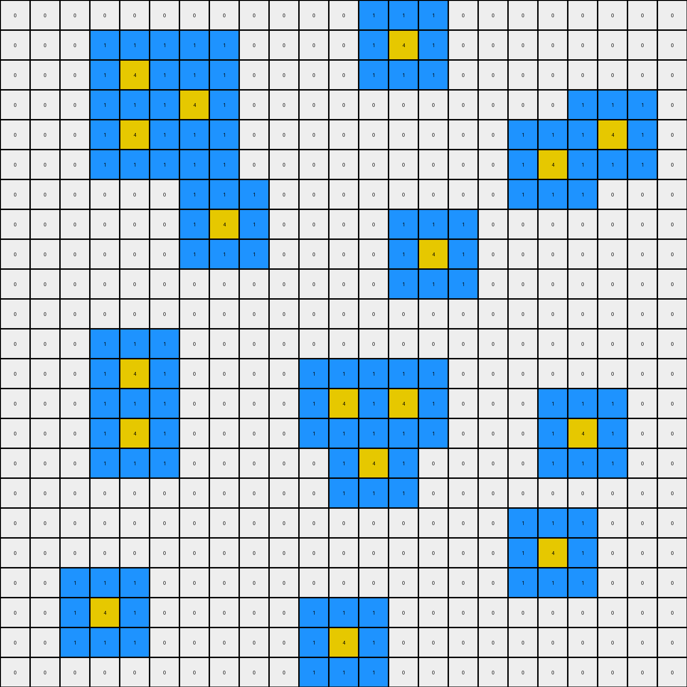
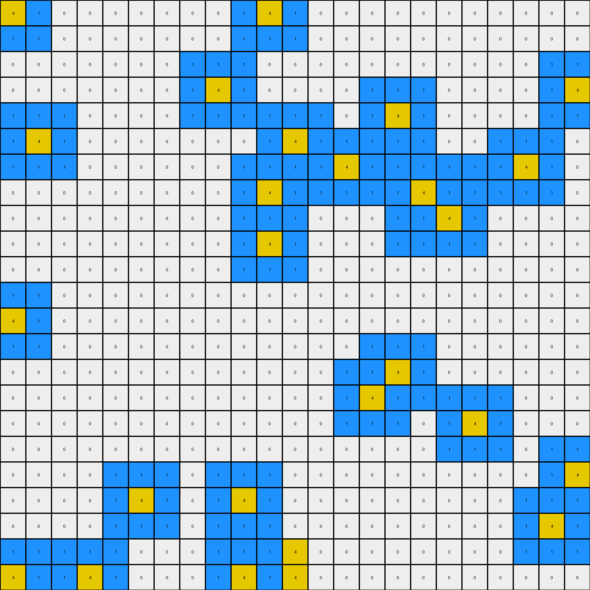
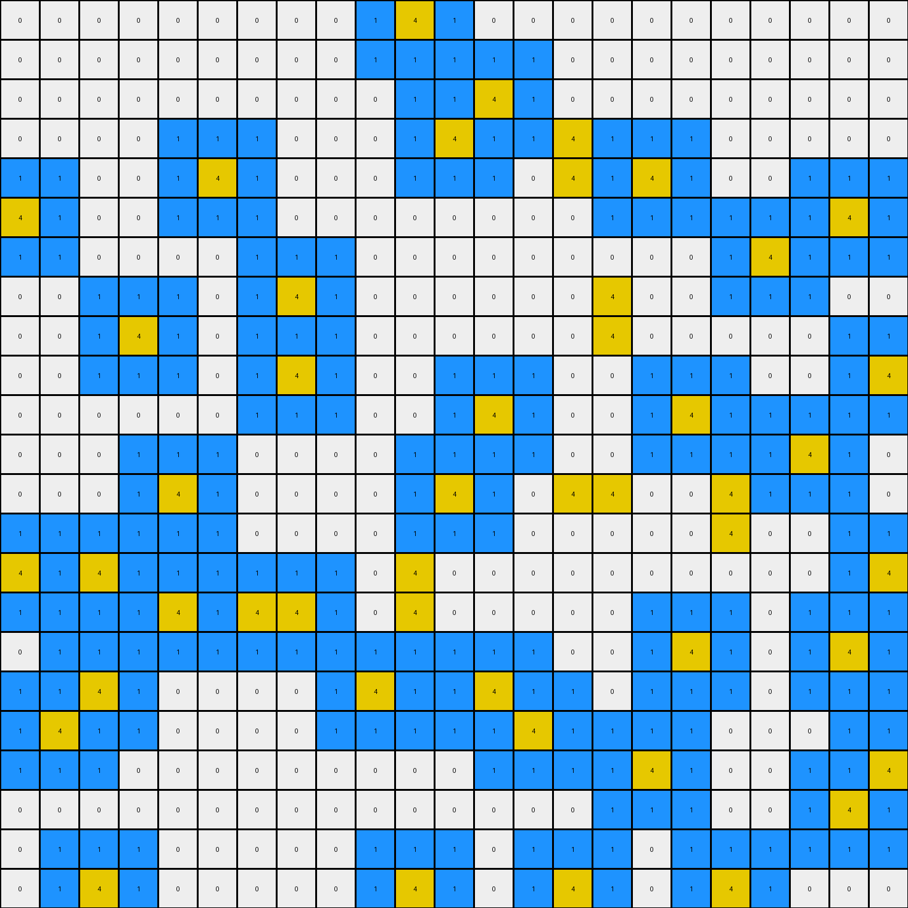
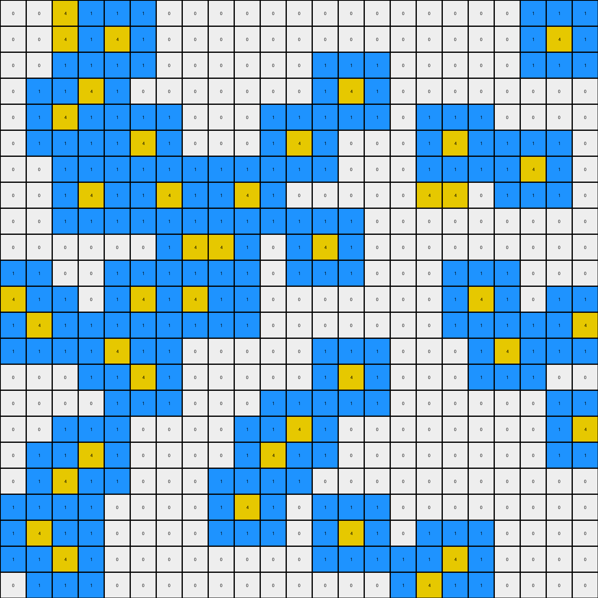

# 7df24a62 • 017 • refine_dreamer

---


Previous Code:
```python
"""
The transformation involves identifying isolated yellow (4) pixels and adding blue (1) pixels around them in a specific pattern.  Isolated yellow pixels, meaning those not directly adjacent to other yellow pixels horizontally or vertically, have a blue "halo" created around them.  If yellow pixels are adjacent to each other, then they are treated as a contiguous object and do not have the halo applied around the whole object. The halo only applies to isolated pixels, not to the boundaries of a connected yellow object.
"""

import numpy as np

def get_adjacent_positions(grid, row, col, include_diagonal=True):
    """Gets the adjacent positions for a given cell."""
    rows, cols = grid.shape
    adjacent_positions = []
    for i in range(max(0, row - 1), min(rows, row + 2)):
        for j in range(max(0, col - 1), min(cols, col + 2)):
            if (i, j) != (row, col):  # Exclude the cell itself
                if not include_diagonal and (abs(i - row) + abs(j-col) > 1):
                    continue
                adjacent_positions.append((i, j))
    return adjacent_positions

def is_isolated(grid, row, col):
    """Checks if a yellow pixel is isolated (not adjacent to other yellow pixels)."""
    if grid[row, col] != 4:
        return False

    adjacent_coords = get_adjacent_positions(grid, row, col, include_diagonal=False)
    for r, c in adjacent_coords:
        if grid[r, c] == 4:
            return False  # Not isolated if adjacent to another yellow pixel
    return True

def transform(input_grid):
    # initialize output_grid as a copy of input
    output_grid = np.copy(input_grid)
    rows, cols = input_grid.shape

    # Iterate through each cell
    for row in range(rows):
        for col in range(cols):
            # Check if the pixel is yellow and isolated
            if is_isolated(input_grid, row, col):
                # Apply blue halo
                adjacent_coords = get_adjacent_positions(input_grid, row, col)
                for r, c in adjacent_coords:
                    if output_grid[r,c] == 0:
                        output_grid[r, c] = 1

    return output_grid
```

Train Set Results:

## Example 1:

Input:
```
0 0 0 0 0 0 0 0 0 0 0 0 0 0 0 0 0 0 0 0 0 0 0
0 0 0 1 1 1 1 1 0 0 0 0 0 4 0 0 0 0 0 0 0 0 0
0 0 0 1 4 1 1 1 0 0 0 0 0 0 0 0 0 0 0 0 0 0 0
0 0 0 1 1 1 4 1 0 0 0 0 0 0 0 0 0 0 0 0 0 0 0
0 0 0 1 4 1 1 1 0 0 0 0 0 0 0 0 0 0 0 0 4 0 0
0 0 0 1 1 1 1 1 0 0 0 0 0 0 0 0 0 0 4 0 0 0 0
0 0 0 0 0 0 0 0 0 0 0 0 0 0 0 0 0 0 0 0 0 0 0
0 0 0 0 0 0 0 4 0 0 0 0 0 0 0 0 0 0 0 0 0 0 0
0 0 0 0 0 0 0 0 0 0 0 0 0 0 4 0 0 0 0 0 0 0 0
0 0 0 0 0 0 0 0 0 0 0 0 0 0 0 0 0 0 0 0 0 0 0
0 0 0 0 0 0 0 0 0 0 0 0 0 0 0 0 0 0 0 0 0 0 0
0 0 0 0 0 0 0 0 0 0 0 0 0 0 0 0 0 0 0 0 0 0 0
0 0 0 0 4 0 0 0 0 0 0 0 0 0 0 0 0 0 0 0 0 0 0
0 0 0 0 0 0 0 0 0 0 0 4 0 4 0 0 0 0 0 0 0 0 0
0 0 0 0 4 0 0 0 0 0 0 0 0 0 0 0 0 0 0 4 0 0 0
0 0 0 0 0 0 0 0 0 0 0 0 4 0 0 0 0 0 0 0 0 0 0
0 0 0 0 0 0 0 0 0 0 0 0 0 0 0 0 0 0 0 0 0 0 0
0 0 0 0 0 0 0 0 0 0 0 0 0 0 0 0 0 0 0 0 0 0 0
0 0 0 0 0 0 0 0 0 0 0 0 0 0 0 0 0 0 4 0 0 0 0
0 0 0 0 0 0 0 0 0 0 0 0 0 0 0 0 0 0 0 0 0 0 0
0 0 0 4 0 0 0 0 0 0 0 0 0 0 0 0 0 0 0 0 0 0 0
0 0 0 0 0 0 0 0 0 0 0 4 0 0 0 0 0 0 0 0 0 0 0
0 0 0 0 0 0 0 0 0 0 0 0 0 0 0 0 0 0 0 0 0 0 0
```
Expected Output:
```
0 0 0 0 0 0 0 0 0 0 0 0 0 0 0 0 0 0 0 0 0 0 0
0 0 0 1 1 1 1 1 0 0 0 0 0 4 0 0 0 0 0 0 0 0 0
0 0 0 1 4 1 1 1 0 0 0 0 0 0 0 0 0 0 0 0 0 0 0
0 0 0 1 1 1 4 1 0 0 0 0 0 0 0 0 0 0 0 0 0 0 0
0 0 0 1 4 1 1 1 0 0 0 0 0 0 0 0 0 0 0 0 4 0 0
0 0 0 1 1 1 1 1 0 0 0 0 0 0 0 0 0 0 4 0 0 0 0
0 0 0 0 0 0 0 0 0 0 0 0 0 0 0 0 0 0 0 0 0 0 0
0 0 0 0 0 0 0 4 0 0 0 0 0 0 0 0 0 0 0 0 0 0 0
0 0 0 0 0 0 0 0 0 0 0 0 0 0 4 0 0 0 0 0 0 0 0
0 0 0 0 0 0 0 0 0 0 0 0 0 0 0 0 0 0 0 0 0 0 0
0 0 0 0 0 0 0 0 0 0 0 0 0 0 0 0 0 0 0 0 0 0 0
0 0 0 0 0 0 0 0 0 0 0 0 0 0 0 0 0 0 0 0 0 0 0
0 0 0 0 4 0 0 0 0 0 1 1 1 1 1 0 0 0 0 0 0 0 0
0 0 0 0 0 0 0 0 0 0 1 4 1 4 1 0 0 0 0 0 0 0 0
0 0 0 0 4 0 0 0 0 0 1 1 1 1 1 0 0 0 0 4 0 0 0
0 0 0 0 0 0 0 0 0 0 1 1 4 1 1 0 0 0 0 0 0 0 0
0 0 0 0 0 0 0 0 0 0 1 1 1 1 1 0 0 0 0 0 0 0 0
0 0 0 0 0 0 0 0 0 0 0 0 0 0 0 0 0 0 0 0 0 0 0
0 0 0 0 0 0 0 0 0 0 0 0 0 0 0 0 0 0 4 0 0 0 0
0 0 0 0 0 0 0 0 0 0 0 0 0 0 0 0 0 0 0 0 0 0 0
0 0 0 4 0 0 0 0 0 0 0 0 0 0 0 0 0 0 0 0 0 0 0
0 0 0 0 0 0 0 0 0 0 0 4 0 0 0 0 0 0 0 0 0 0 0
0 0 0 0 0 0 0 0 0 0 0 0 0 0 0 0 0 0 0 0 0 0 0
```
Transformed Output:
```
0 0 0 0 0 0 0 0 0 0 0 0 1 1 1 0 0 0 0 0 0 0 0
0 0 0 1 1 1 1 1 0 0 0 0 1 4 1 0 0 0 0 0 0 0 0
0 0 0 1 4 1 1 1 0 0 0 0 1 1 1 0 0 0 0 0 0 0 0
0 0 0 1 1 1 4 1 0 0 0 0 0 0 0 0 0 0 0 1 1 1 0
0 0 0 1 4 1 1 1 0 0 0 0 0 0 0 0 0 1 1 1 4 1 0
0 0 0 1 1 1 1 1 0 0 0 0 0 0 0 0 0 1 4 1 1 1 0
0 0 0 0 0 0 1 1 1 0 0 0 0 0 0 0 0 1 1 1 0 0 0
0 0 0 0 0 0 1 4 1 0 0 0 0 1 1 1 0 0 0 0 0 0 0
0 0 0 0 0 0 1 1 1 0 0 0 0 1 4 1 0 0 0 0 0 0 0
0 0 0 0 0 0 0 0 0 0 0 0 0 1 1 1 0 0 0 0 0 0 0
0 0 0 0 0 0 0 0 0 0 0 0 0 0 0 0 0 0 0 0 0 0 0
0 0 0 1 1 1 0 0 0 0 0 0 0 0 0 0 0 0 0 0 0 0 0
0 0 0 1 4 1 0 0 0 0 1 1 1 1 1 0 0 0 0 0 0 0 0
0 0 0 1 1 1 0 0 0 0 1 4 1 4 1 0 0 0 1 1 1 0 0
0 0 0 1 4 1 0 0 0 0 1 1 1 1 1 0 0 0 1 4 1 0 0
0 0 0 1 1 1 0 0 0 0 0 1 4 1 0 0 0 0 1 1 1 0 0
0 0 0 0 0 0 0 0 0 0 0 1 1 1 0 0 0 0 0 0 0 0 0
0 0 0 0 0 0 0 0 0 0 0 0 0 0 0 0 0 1 1 1 0 0 0
0 0 0 0 0 0 0 0 0 0 0 0 0 0 0 0 0 1 4 1 0 0 0
0 0 1 1 1 0 0 0 0 0 0 0 0 0 0 0 0 1 1 1 0 0 0
0 0 1 4 1 0 0 0 0 0 1 1 1 0 0 0 0 0 0 0 0 0 0
0 0 1 1 1 0 0 0 0 0 1 4 1 0 0 0 0 0 0 0 0 0 0
0 0 0 0 0 0 0 0 0 0 1 1 1 0 0 0 0 0 0 0 0 0 0
```

match: False
pixels_off: 87
size_correct: True
color_palette_correct: True
correct_pixel_counts: False

## Example 2:

Input:
```
4 0 0 0 0 0 0 0 0 0 4 0 0 0 0 0 0 0 0 0 0 0 0
0 0 0 0 0 0 0 0 0 0 0 0 0 0 0 0 0 0 0 0 0 0 0
0 0 0 0 0 0 0 0 0 0 0 0 0 0 0 0 0 0 0 0 0 0 0
0 0 0 0 0 0 0 0 4 0 0 0 0 0 0 0 0 0 0 0 0 0 4
0 0 0 0 0 0 0 0 0 0 0 0 0 0 0 4 0 0 0 0 0 0 0
0 4 0 0 0 0 0 0 0 0 0 4 0 0 0 0 0 0 0 0 0 0 0
0 0 0 0 0 0 0 0 0 0 0 0 0 4 0 1 1 1 1 0 4 0 0
0 0 0 0 0 0 0 0 0 0 4 0 0 0 0 1 4 1 1 0 0 0 0
0 0 0 0 0 0 0 0 0 0 0 0 0 0 0 1 1 4 1 0 0 0 0
0 0 0 0 0 0 0 0 0 0 4 0 0 0 0 1 1 1 1 0 0 0 0
0 0 0 0 0 0 0 0 0 0 0 0 0 0 0 0 0 0 0 0 0 0 0
0 0 0 0 0 0 0 0 0 0 0 0 0 0 0 0 0 0 0 0 0 0 0
4 0 0 0 0 0 0 0 0 0 0 0 0 0 0 0 0 0 0 0 0 0 0
0 0 0 0 0 0 0 0 0 0 0 0 0 0 0 0 0 0 0 0 0 0 0
0 0 0 0 0 0 0 0 0 0 0 0 0 0 0 4 0 0 0 0 0 0 0
0 0 0 0 0 0 0 0 0 0 0 0 0 0 4 0 0 0 0 0 0 0 0
0 0 0 0 0 0 0 0 0 0 0 0 0 0 0 0 0 0 4 0 0 0 0
0 0 0 0 0 0 0 0 0 0 0 0 0 0 0 0 0 0 0 0 0 0 0
0 0 0 0 0 0 0 0 0 0 0 0 0 0 0 0 0 0 0 0 0 0 4
0 0 0 0 0 4 0 0 0 4 0 0 0 0 0 0 0 0 0 0 0 0 0
0 0 0 0 0 0 0 0 0 0 0 0 0 0 0 0 0 0 0 0 0 4 0
0 0 0 0 0 0 0 0 0 0 0 4 0 0 0 0 0 0 0 0 0 0 0
4 0 0 4 0 0 0 0 0 4 0 4 0 0 0 0 0 0 0 0 0 0 0
```
Expected Output:
```
4 0 0 0 0 0 0 0 0 0 4 0 0 0 0 0 0 0 0 0 0 0 0
0 0 0 0 0 0 0 0 0 0 0 0 0 0 0 0 0 0 0 0 0 0 0
0 0 0 0 0 0 0 0 0 0 0 0 0 0 0 0 0 0 0 0 0 0 0
0 0 0 0 0 0 0 0 4 0 0 0 0 0 0 0 0 0 0 0 0 0 4
0 0 0 0 0 0 0 0 0 0 0 0 0 0 0 4 0 0 0 0 0 0 0
0 4 0 0 0 0 0 0 0 0 0 4 0 0 0 0 0 0 0 0 0 0 0
0 0 0 0 0 0 0 0 0 0 0 0 0 4 0 1 1 1 1 0 4 0 0
0 0 0 0 0 0 0 0 0 0 4 0 0 0 0 1 4 1 1 0 0 0 0
0 0 0 0 0 0 0 0 0 0 0 0 0 0 0 1 1 4 1 0 0 0 0
0 0 0 0 0 0 0 0 0 0 4 0 0 0 0 1 1 1 1 0 0 0 0
0 0 0 0 0 0 0 0 0 0 0 0 0 0 0 0 0 0 0 0 0 0 0
0 0 0 0 0 0 0 0 0 0 0 0 0 0 0 0 0 0 0 0 0 0 0
4 0 0 0 0 0 0 0 0 0 0 0 0 0 0 0 0 0 0 0 0 0 0
0 0 0 0 0 0 0 0 0 0 0 0 0 1 1 1 1 0 0 0 0 0 0
0 0 0 0 0 0 0 0 0 0 0 0 0 1 1 4 1 0 0 0 0 0 0
0 0 0 0 0 0 0 0 0 0 0 0 0 1 4 1 1 0 0 0 0 0 0
0 0 0 0 0 0 0 0 0 0 0 0 0 1 1 1 1 0 4 0 0 0 0
0 0 0 0 0 0 0 0 0 0 0 0 0 0 0 0 0 0 0 0 0 0 0
0 0 0 0 0 0 0 0 0 0 0 0 0 0 0 0 0 0 0 0 0 0 4
0 0 0 0 0 4 0 0 0 4 0 0 0 0 0 0 0 0 0 0 0 0 0
0 0 0 0 0 0 0 0 0 0 0 0 0 0 0 0 0 0 0 0 0 4 0
0 0 0 0 0 0 0 0 0 0 0 4 0 0 0 0 0 0 0 0 0 0 0
4 0 0 4 0 0 0 0 0 4 0 4 0 0 0 0 0 0 0 0 0 0 0
```
Transformed Output:
```
4 1 0 0 0 0 0 0 0 1 4 1 0 0 0 0 0 0 0 0 0 0 0
1 1 0 0 0 0 0 0 0 1 1 1 0 0 0 0 0 0 0 0 0 0 0
0 0 0 0 0 0 0 1 1 1 0 0 0 0 0 0 0 0 0 0 0 1 1
0 0 0 0 0 0 0 1 4 1 0 0 0 0 1 1 1 0 0 0 0 1 4
1 1 1 0 0 0 0 1 1 1 1 1 1 0 1 4 1 0 0 0 0 1 1
1 4 1 0 0 0 0 0 0 0 1 4 1 1 1 1 1 0 0 1 1 1 0
1 1 1 0 0 0 0 0 0 1 1 1 1 4 1 1 1 1 1 1 4 1 0
0 0 0 0 0 0 0 0 0 1 4 1 1 1 1 1 4 1 1 1 1 1 0
0 0 0 0 0 0 0 0 0 1 1 1 0 0 0 1 1 4 1 0 0 0 0
0 0 0 0 0 0 0 0 0 1 4 1 0 0 0 1 1 1 1 0 0 0 0
0 0 0 0 0 0 0 0 0 1 1 1 0 0 0 0 0 0 0 0 0 0 0
1 1 0 0 0 0 0 0 0 0 0 0 0 0 0 0 0 0 0 0 0 0 0
4 1 0 0 0 0 0 0 0 0 0 0 0 0 0 0 0 0 0 0 0 0 0
1 1 0 0 0 0 0 0 0 0 0 0 0 0 1 1 1 0 0 0 0 0 0
0 0 0 0 0 0 0 0 0 0 0 0 0 1 1 4 1 0 0 0 0 0 0
0 0 0 0 0 0 0 0 0 0 0 0 0 1 4 1 1 1 1 1 0 0 0
0 0 0 0 0 0 0 0 0 0 0 0 0 1 1 1 0 1 4 1 0 0 0
0 0 0 0 0 0 0 0 0 0 0 0 0 0 0 0 0 1 1 1 0 1 1
0 0 0 0 1 1 1 0 1 1 1 0 0 0 0 0 0 0 0 0 0 1 4
0 0 0 0 1 4 1 0 1 4 1 0 0 0 0 0 0 0 0 0 1 1 1
0 0 0 0 1 1 1 0 1 1 1 0 0 0 0 0 0 0 0 0 1 4 1
1 1 1 1 1 0 0 0 1 1 1 4 0 0 0 0 0 0 0 0 1 1 1
4 1 1 4 1 0 0 0 1 4 1 4 0 0 0 0 0 0 0 0 0 0 0
```

match: False
pixels_off: 124
size_correct: True
color_palette_correct: True
correct_pixel_counts: False

## Example 3:

Input:
```
0 0 0 0 0 0 0 0 0 0 4 0 0 0 0 0 0 0 0 0 0 0 0
0 0 0 0 0 0 0 0 0 0 0 0 0 0 0 0 0 0 0 0 0 0 0
0 0 0 0 0 0 0 0 0 0 0 0 4 0 0 0 0 0 0 0 0 0 0
0 0 0 0 0 0 0 0 0 0 0 4 0 0 4 0 0 0 0 0 0 0 0
0 0 0 0 0 4 0 0 0 0 0 0 0 0 4 0 4 0 0 0 0 0 0
4 0 0 0 0 0 0 0 0 0 0 0 0 0 0 0 0 0 0 0 0 4 0
0 0 0 0 0 0 0 0 0 0 0 0 0 0 0 0 0 0 0 4 0 0 0
0 0 0 0 0 0 0 4 0 0 0 0 0 0 0 4 0 0 0 0 0 0 0
0 0 0 4 0 0 0 0 0 0 0 0 0 0 0 4 0 0 0 0 0 0 0
0 0 0 0 0 0 0 4 0 0 0 0 0 0 0 0 0 0 0 0 0 0 4
0 0 0 0 0 0 0 0 0 0 0 0 4 0 0 0 0 4 0 0 0 0 0
0 0 0 0 0 0 0 0 0 0 0 0 0 0 0 0 0 0 0 0 4 0 0
0 0 0 0 4 0 0 0 0 0 0 4 0 0 4 4 0 0 4 0 0 0 0
0 0 0 0 0 0 0 0 0 0 0 0 0 0 0 0 0 0 4 0 0 0 0
4 0 4 0 0 1 1 1 1 0 4 0 0 0 0 0 0 0 0 0 0 0 4
0 0 0 0 4 1 4 4 1 0 4 0 0 0 0 0 0 0 0 0 0 0 0
0 0 0 0 0 1 1 1 1 0 0 0 0 0 0 0 0 4 0 0 0 4 0
0 0 4 0 0 0 0 0 0 4 0 0 4 0 0 0 0 0 0 0 0 0 0
0 4 0 0 0 0 0 0 0 0 0 0 0 4 0 0 0 0 0 0 0 0 0
0 0 0 0 0 0 0 0 0 0 0 0 0 0 0 0 4 0 0 0 0 0 4
0 0 0 0 0 0 0 0 0 0 0 0 0 0 0 0 0 0 0 0 0 4 0
0 0 0 0 0 0 0 0 0 0 0 0 0 0 0 0 0 0 0 0 0 0 0
0 0 4 0 0 0 0 0 0 0 4 0 0 0 4 0 0 0 4 0 0 0 0
```
Expected Output:
```
0 0 0 0 0 0 0 0 0 0 4 0 0 0 0 0 0 0 0 0 0 0 0
0 0 0 0 0 0 0 0 0 0 0 0 0 0 0 0 0 0 0 0 0 0 0
0 0 0 0 0 0 0 0 0 0 0 0 4 1 1 1 0 0 0 0 0 0 0
0 0 0 0 0 0 0 0 0 0 0 4 0 1 4 1 0 0 0 0 0 0 0
0 0 0 0 0 4 0 0 0 0 0 0 0 1 4 1 4 0 0 0 0 0 0
4 0 0 0 0 0 0 0 0 0 0 0 0 1 1 1 0 0 0 0 0 4 0
0 0 0 0 0 0 0 0 0 0 0 0 0 0 1 1 1 0 0 4 0 0 0
0 0 0 0 0 0 0 4 0 0 0 0 0 0 1 4 1 0 0 0 0 0 0
0 0 0 4 0 0 0 0 0 0 0 0 0 0 1 4 1 0 0 0 0 0 0
0 0 0 0 0 0 0 4 0 0 0 0 0 0 1 1 1 0 0 0 0 0 4
0 0 0 0 0 0 0 0 0 0 0 0 4 0 0 0 0 4 0 0 0 0 0
0 0 0 0 0 0 0 0 0 0 0 0 0 1 1 1 1 1 1 1 4 0 0
0 0 0 0 4 0 0 0 0 0 0 4 0 1 4 4 1 1 4 1 0 0 0
0 0 0 0 0 0 0 0 0 1 1 1 0 1 1 1 1 1 4 1 0 0 0
4 0 4 0 0 1 1 1 1 1 4 1 0 0 0 0 0 1 1 1 0 0 4
0 0 0 0 4 1 4 4 1 1 4 1 0 0 0 0 0 0 0 0 0 0 0
0 0 0 0 0 1 1 1 1 1 1 1 0 0 0 0 0 4 0 0 0 4 0
0 0 4 0 0 0 0 0 0 4 0 0 4 0 0 0 0 0 0 0 0 0 0
0 4 0 0 0 0 0 0 0 0 0 0 0 4 0 0 0 0 0 0 0 0 0
0 0 0 0 0 0 0 0 0 0 0 0 0 0 0 0 4 0 0 0 0 0 4
0 0 0 0 0 0 0 0 0 0 0 0 0 0 0 0 0 0 0 0 0 4 0
0 0 0 0 0 0 0 0 0 0 0 0 0 0 0 0 0 0 0 0 0 0 0
0 0 4 0 0 0 0 0 0 0 4 0 0 0 4 0 0 0 4 0 0 0 0
```
Transformed Output:
```
0 0 0 0 0 0 0 0 0 1 4 1 0 0 0 0 0 0 0 0 0 0 0
0 0 0 0 0 0 0 0 0 1 1 1 1 1 0 0 0 0 0 0 0 0 0
0 0 0 0 0 0 0 0 0 0 1 1 4 1 0 0 0 0 0 0 0 0 0
0 0 0 0 1 1 1 0 0 0 1 4 1 1 4 1 1 1 0 0 0 0 0
1 1 0 0 1 4 1 0 0 0 1 1 1 0 4 1 4 1 0 0 1 1 1
4 1 0 0 1 1 1 0 0 0 0 0 0 0 0 1 1 1 1 1 1 4 1
1 1 0 0 0 0 1 1 1 0 0 0 0 0 0 0 0 0 1 4 1 1 1
0 0 1 1 1 0 1 4 1 0 0 0 0 0 0 4 0 0 1 1 1 0 0
0 0 1 4 1 0 1 1 1 0 0 0 0 0 0 4 0 0 0 0 0 1 1
0 0 1 1 1 0 1 4 1 0 0 1 1 1 0 0 1 1 1 0 0 1 4
0 0 0 0 0 0 1 1 1 0 0 1 4 1 0 0 1 4 1 1 1 1 1
0 0 0 1 1 1 0 0 0 0 1 1 1 1 0 0 1 1 1 1 4 1 0
0 0 0 1 4 1 0 0 0 0 1 4 1 0 4 4 0 0 4 1 1 1 0
1 1 1 1 1 1 0 0 0 0 1 1 1 0 0 0 0 0 4 0 0 1 1
4 1 4 1 1 1 1 1 1 0 4 0 0 0 0 0 0 0 0 0 0 1 4
1 1 1 1 4 1 4 4 1 0 4 0 0 0 0 0 1 1 1 0 1 1 1
0 1 1 1 1 1 1 1 1 1 1 1 1 1 0 0 1 4 1 0 1 4 1
1 1 4 1 0 0 0 0 1 4 1 1 4 1 1 0 1 1 1 0 1 1 1
1 4 1 1 0 0 0 0 1 1 1 1 1 4 1 1 1 1 0 0 0 1 1
1 1 1 0 0 0 0 0 0 0 0 0 1 1 1 1 4 1 0 0 1 1 4
0 0 0 0 0 0 0 0 0 0 0 0 0 0 0 1 1 1 0 0 1 4 1
0 1 1 1 0 0 0 0 0 1 1 1 0 1 1 1 0 1 1 1 1 1 1
0 1 4 1 0 0 0 0 0 1 4 1 0 1 4 1 0 1 4 1 0 0 0
```

match: False
pixels_off: 228
size_correct: True
color_palette_correct: True
correct_pixel_counts: False

## Example 4:

Input:
```
0 0 4 0 0 0 0 0 0 0 0 0 0 0 0 0 0 0 0 0 0 0 0
0 0 4 0 4 0 0 0 0 0 0 0 0 0 0 0 0 0 0 0 0 4 0
0 0 0 0 0 0 0 0 0 0 0 0 0 0 0 0 0 0 0 0 0 0 0
0 0 0 4 0 0 0 0 0 0 0 0 0 4 0 0 0 0 0 0 0 0 0
0 0 4 0 0 0 0 0 0 0 0 0 0 0 0 0 0 0 0 0 0 0 0
0 0 0 0 0 4 0 0 0 0 0 4 0 0 0 0 0 4 0 0 0 0 0
0 0 0 0 0 0 0 0 0 0 0 0 0 0 0 0 0 0 0 0 4 0 0
0 0 0 4 0 0 4 0 0 4 0 0 0 0 0 0 4 4 0 0 0 0 0
0 0 0 0 0 0 1 1 1 1 0 0 0 0 0 0 0 0 0 0 0 0 0
0 0 0 0 0 0 1 4 4 1 0 0 4 0 0 0 0 0 0 0 0 0 0
0 0 0 0 0 0 1 1 1 1 0 0 0 0 0 0 0 0 0 0 0 0 0
4 0 0 0 0 4 1 4 1 1 0 0 0 0 0 0 0 0 4 0 0 0 0
0 4 0 0 0 0 1 1 1 1 0 0 0 0 0 0 0 0 0 0 0 0 4
0 0 0 0 4 0 0 0 0 0 0 0 0 0 0 0 0 0 0 4 0 0 0
0 0 0 0 0 4 0 0 0 0 0 0 0 4 0 0 0 0 0 0 0 0 0
0 0 0 0 0 0 0 0 0 0 0 0 0 0 0 0 0 0 0 0 0 0 0
0 0 0 0 0 0 0 0 0 0 0 4 0 0 0 0 0 0 0 0 0 0 4
0 0 0 4 0 0 0 0 0 0 4 0 0 0 0 0 0 0 0 0 0 0 0
0 0 4 0 0 0 0 0 0 0 0 0 0 0 0 0 0 0 0 0 0 0 0
0 0 0 0 0 0 0 0 0 4 0 0 0 0 0 0 0 0 0 0 0 0 0
0 4 0 0 0 0 0 0 0 0 0 0 0 4 0 0 0 0 0 0 0 0 0
0 0 4 0 0 0 0 0 0 0 0 0 0 0 0 0 0 4 0 0 0 0 0
0 0 0 0 0 0 0 0 0 0 0 0 0 0 0 0 4 0 0 0 0 0 0
```
Expected Output:
```
0 1 4 1 1 1 0 0 0 0 0 0 0 0 0 0 0 0 0 0 0 0 0
0 1 4 1 4 1 0 0 0 0 0 0 0 0 0 0 0 0 0 0 0 4 0
0 1 1 1 1 1 0 0 0 0 0 0 0 0 0 0 0 0 0 0 0 0 0
0 0 0 4 0 0 0 0 0 0 0 0 0 4 0 0 0 0 0 0 0 0 0
0 0 4 0 0 0 0 0 0 0 0 0 0 0 0 1 1 1 1 0 0 0 0
0 0 0 0 0 4 0 0 0 0 0 4 0 0 0 1 1 4 1 0 0 0 0
0 0 0 0 0 0 0 0 0 0 0 0 0 0 0 1 1 1 1 0 4 0 0
0 0 0 4 0 0 4 0 0 4 0 0 0 0 0 1 4 4 1 0 0 0 0
0 0 0 0 0 0 1 1 1 1 0 0 0 0 0 1 1 1 1 0 0 0 0
0 0 0 0 0 0 1 4 4 1 0 0 4 0 0 0 0 0 0 0 0 0 0
0 0 0 0 0 0 1 1 1 1 0 0 0 0 0 0 0 0 0 0 0 0 0
4 0 0 0 0 4 1 4 1 1 0 0 0 0 0 0 0 0 4 0 0 0 0
0 4 0 0 0 0 1 1 1 1 0 0 0 0 0 0 0 0 0 0 0 0 4
0 0 0 0 4 0 0 0 0 0 0 0 0 0 0 0 0 0 0 4 0 0 0
0 0 0 0 0 4 0 0 0 0 0 0 0 4 0 0 0 0 0 0 0 0 0
0 0 0 0 0 0 0 0 0 0 0 0 0 0 0 0 0 0 0 0 0 0 0
0 0 0 0 0 0 0 0 0 0 0 4 0 0 0 0 0 0 0 0 0 0 4
0 0 0 4 0 0 0 0 0 0 4 0 0 0 0 0 0 0 0 0 0 0 0
0 0 4 0 0 0 0 0 0 0 0 0 0 0 0 0 0 0 0 0 0 0 0
0 0 0 0 0 0 0 0 0 4 0 0 0 0 0 0 0 0 0 0 0 0 0
0 4 0 0 0 0 0 0 0 0 0 0 0 4 0 0 0 0 0 0 0 0 0
0 0 4 0 0 0 0 0 0 0 0 0 0 0 0 0 0 4 0 0 0 0 0
0 0 0 0 0 0 0 0 0 0 0 0 0 0 0 0 4 0 0 0 0 0 0
```
Transformed Output:
```
0 0 4 1 1 1 0 0 0 0 0 0 0 0 0 0 0 0 0 0 1 1 1
0 0 4 1 4 1 0 0 0 0 0 0 0 0 0 0 0 0 0 0 1 4 1
0 0 1 1 1 1 0 0 0 0 0 0 1 1 1 0 0 0 0 0 1 1 1
0 1 1 4 1 0 0 0 0 0 0 0 1 4 1 0 0 0 0 0 0 0 0
0 1 4 1 1 1 1 0 0 0 1 1 1 1 1 0 1 1 1 0 0 0 0
0 1 1 1 1 4 1 0 0 0 1 4 1 0 0 0 1 4 1 1 1 1 0
0 0 1 1 1 1 1 1 1 1 1 1 1 0 0 0 1 1 1 1 4 1 0
0 0 1 4 1 1 4 1 1 4 1 0 0 0 0 0 4 4 0 1 1 1 0
0 0 1 1 1 1 1 1 1 1 1 1 1 1 0 0 0 0 0 0 0 0 0
0 0 0 0 0 0 1 4 4 1 0 1 4 1 0 0 0 0 0 0 0 0 0
1 1 0 0 1 1 1 1 1 1 0 1 1 1 0 0 0 1 1 1 0 0 0
4 1 1 0 1 4 1 4 1 1 0 0 0 0 0 0 0 1 4 1 0 1 1
1 4 1 1 1 1 1 1 1 1 0 0 0 0 0 0 0 1 1 1 1 1 4
1 1 1 1 4 1 1 0 0 0 0 0 1 1 1 0 0 0 1 4 1 1 1
0 0 0 1 1 4 1 0 0 0 0 0 1 4 1 0 0 0 1 1 1 0 0
0 0 0 0 1 1 1 0 0 0 1 1 1 1 1 0 0 0 0 0 0 1 1
0 0 1 1 1 0 0 0 0 1 1 4 1 0 0 0 0 0 0 0 0 1 4
0 1 1 4 1 0 0 0 0 1 4 1 1 0 0 0 0 0 0 0 0 1 1
0 1 4 1 1 0 0 0 1 1 1 1 0 0 0 0 0 0 0 0 0 0 0
1 1 1 1 0 0 0 0 1 4 1 0 1 1 1 0 0 0 0 0 0 0 0
1 4 1 1 0 0 0 0 1 1 1 0 1 4 1 0 1 1 1 0 0 0 0
1 1 4 1 0 0 0 0 0 0 0 0 1 1 1 1 1 4 1 0 0 0 0
0 1 1 1 0 0 0 0 0 0 0 0 0 0 0 1 4 1 1 0 0 0 0
```

match: False
pixels_off: 195
size_correct: True
color_palette_correct: True
correct_pixel_counts: False

**INSTRUCTIONS**

The code above was generated based on observations from the first training
example

we have tested the transform function on each of the task example inputs and
compared with the expected output

review each of the examples provided and the results and consider how the
natural language program should be updated to accommodate this new knowledge

respond with the following deliverables:

- general assessment of the information provided and strategy for resolving the
  errors
- gather metrics about each of the examples and results - use code_execution to
  develop accurate reports on your assumptions
- a YAML block documenting facts - Focus on identifying objects, their properties, and the actions performed on them.
- a natural language program - Be as clear and concise as possible, providing a complete description of the transformation rule.


your responses should be considered as information in a report - not a
conversation
