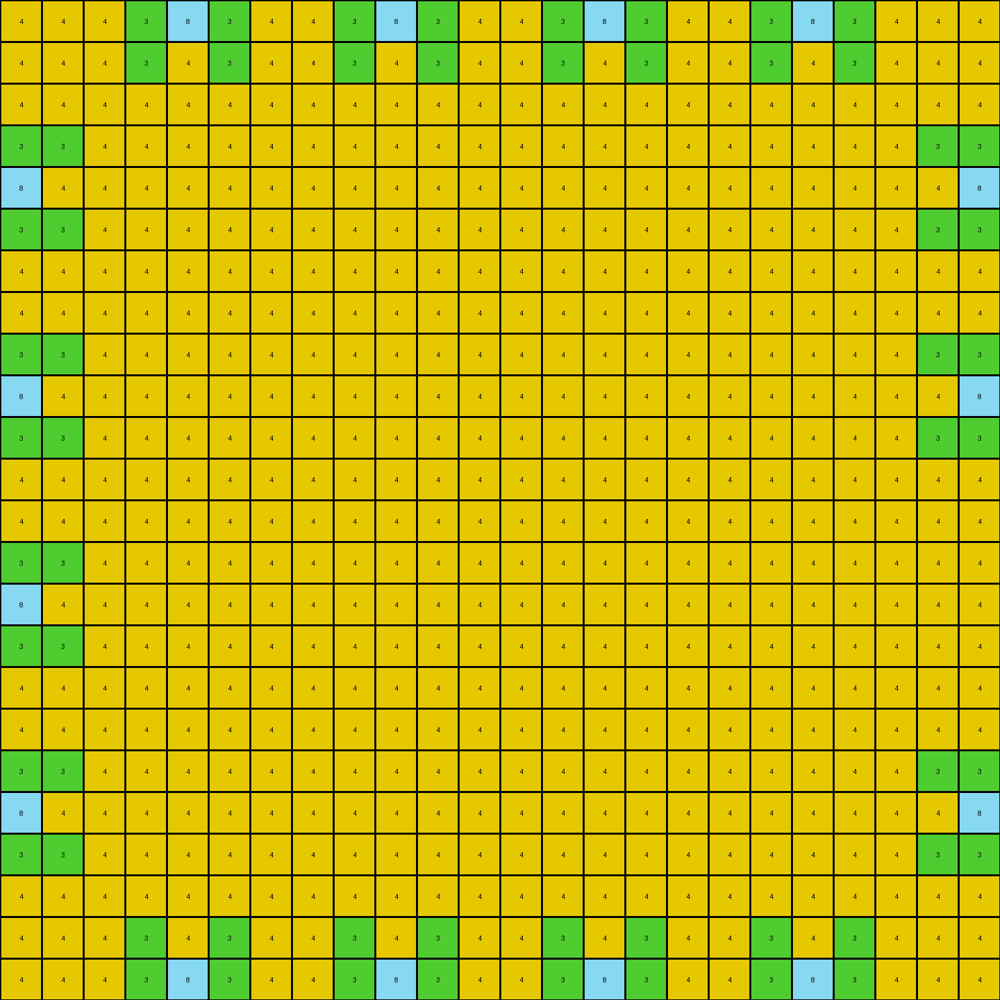

# 83302e8f • 003 • refine_dreamer

---

Previous Code:
```python
"""
1.  **Identify the "cross" shape:** Find the diagonal lines of azure (8) pixels forming an "X" in the center of the grid.

2.  **Recolor Inside Cross:** Starting from center outward, change azure(8) pixels to yellow(4), leaving only the outline of the cross in original color.

3. **Recolor Background Diagonally:** Recolor white(0) background pixels to green(3) or yellow(4) based on diagonal stripes starting from each cross arm, symmetrically, so that:
     - The white pixels that connect to the remaining azure pixels will be green
     - All remaining white pixels will be yellow.
"""

import numpy as np

def find_cross(grid):
    """Finds the coordinates of the azure cross."""
    rows, cols = grid.shape
    cross_coords = []
    for r in range(rows):
        for c in range(cols):
            if grid[r, c] == 8:
                cross_coords.append((r, c))
    return cross_coords

def recolor_inside_cross(grid, cross_coords):
    """Recolors the inside of the cross to yellow."""
    # Create a copy to modify
    new_grid = np.copy(grid)

    #find center of cross by finding min and max row and col
    min_row = min(r for r, _ in cross_coords)
    max_row = max(r for r, _ in cross_coords)
    min_col = min(c for _, c in cross_coords)
    max_col = max(c for _, c in cross_coords)
    center_row = (min_row + max_row) // 2
    center_col = (min_col + max_col) // 2

    for r, c in cross_coords:
        #check if inside the cross
        if (r != min_row and r != max_row and
            c != min_col and c!= max_col):
            new_grid[r,c] = 4

    return new_grid


def recolor_background(grid, cross_coords):
    """Recolors the background in alternating stripes."""
    new_grid = np.copy(grid)
    rows, cols = grid.shape

    #find the cross coordinates that outline the cross
    cross_outline = []
    for r,c in cross_coords:
        if (r == min(row for row, _ in cross_coords) or
            r == max(row for row, _ in cross_coords) or
            c == min(col for _, col in cross_coords) or
            c == max(col for _, col in cross_coords)):
            cross_outline.append((r,c))
    
    #iterate through grid and change white to green if beside cross
    for r in range(rows):
        for c in range(cols):
            if new_grid[r, c] == 0:
                for cr, cc in cross_outline:
                    if abs(r - cr) <= 1 and abs(c - cc) <= 1:
                        new_grid[r, c] = 3
                        break

    #change remaining white background to yellow
    for r in range(rows):
        for c in range(cols):
            if new_grid[r,c] == 0:
                new_grid[r,c] = 4
    return new_grid

def transform(input_grid):
    # Find the coordinates of the cross
    cross_coords = find_cross(input_grid)

    # Recolor the inside of cross
    output_grid = recolor_inside_cross(input_grid, cross_coords)

    # Recolor the background
    output_grid = recolor_background(output_grid, cross_coords)

    return output_grid
```

Train Set Results:

## Example 1:

Input:
```
0 0 0 0 8 0 0 0 0 8 0 0 0 0 8 0 0 0 0 8 0 0 0 0
0 0 0 0 8 0 0 0 0 8 0 0 0 0 8 0 0 0 0 8 0 0 0 0
0 0 0 0 8 0 0 0 0 8 0 0 0 0 8 0 0 0 0 8 0 0 0 0
0 0 0 0 8 0 0 0 0 8 0 0 0 0 8 0 0 0 0 8 0 0 0 0
8 8 8 8 8 8 8 8 8 8 8 8 8 8 8 8 8 0 8 8 8 8 8 8
0 0 0 0 8 0 0 0 0 8 0 0 0 0 8 0 0 0 0 8 0 0 0 0
0 0 0 0 8 0 0 0 0 8 0 0 0 0 8 0 0 0 0 8 0 0 0 0
0 0 0 0 0 0 0 0 0 8 0 0 0 0 8 0 0 0 0 8 0 0 0 0
0 0 0 0 8 0 0 0 0 8 0 0 0 0 8 0 0 0 0 0 0 0 0 0
8 8 8 8 8 8 8 8 0 8 8 8 8 0 8 8 8 8 8 8 8 8 8 8
0 0 0 0 8 0 0 0 0 8 0 0 0 0 0 0 0 0 0 8 0 0 0 0
0 0 0 0 8 0 0 0 0 8 0 0 0 0 8 0 0 0 0 8 0 0 0 0
0 0 0 0 0 0 0 0 0 8 0 0 0 0 8 0 0 0 0 8 0 0 0 0
0 0 0 0 8 0 0 0 0 0 0 0 0 0 8 0 0 0 0 8 0 0 0 0
8 8 8 8 8 8 8 8 8 8 8 8 8 8 8 8 8 8 8 8 0 8 8 0
0 0 0 0 8 0 0 0 0 8 0 0 0 0 8 0 0 0 0 8 0 0 0 0
0 0 0 0 8 0 0 0 0 8 0 0 0 0 8 0 0 0 0 8 0 0 0 0
0 0 0 0 8 0 0 0 0 0 0 0 0 0 8 0 0 0 0 8 0 0 0 0
0 0 0 0 8 0 0 0 0 8 0 0 0 0 8 0 0 0 0 8 0 0 0 0
8 8 8 8 8 8 8 8 8 8 8 8 8 8 8 8 8 8 8 8 8 8 8 8
0 0 0 0 8 0 0 0 0 8 0 0 0 0 8 0 0 0 0 8 0 0 0 0
0 0 0 0 8 0 0 0 0 8 0 0 0 0 8 0 0 0 0 8 0 0 0 0
0 0 0 0 8 0 0 0 0 8 0 0 0 0 8 0 0 0 0 8 0 0 0 0
0 0 0 0 8 0 0 0 0 8 0 0 0 0 8 0 0 0 0 8 0 0 0 0
```
Expected Output:
```
3 3 3 3 8 3 3 3 3 8 3 3 3 3 8 4 4 4 4 8 3 3 3 3
3 3 3 3 8 3 3 3 3 8 3 3 3 3 8 4 4 4 4 8 3 3 3 3
3 3 3 3 8 3 3 3 3 8 3 3 3 3 8 4 4 4 4 8 3 3 3 3
3 3 3 3 8 3 3 3 3 8 3 3 3 3 8 4 4 4 4 8 3 3 3 3
8 8 8 8 8 8 8 8 8 8 8 8 8 8 8 8 8 4 8 8 8 8 8 8
4 4 4 4 8 4 4 4 4 8 4 4 4 4 8 4 4 4 4 8 4 4 4 4
4 4 4 4 8 4 4 4 4 8 4 4 4 4 8 4 4 4 4 8 4 4 4 4
4 4 4 4 4 4 4 4 4 8 4 4 4 4 8 4 4 4 4 8 4 4 4 4
4 4 4 4 8 4 4 4 4 8 4 4 4 4 8 4 4 4 4 4 4 4 4 4
8 8 8 8 8 8 8 8 4 8 8 8 8 4 8 8 8 8 8 8 8 8 8 8
4 4 4 4 8 4 4 4 4 8 4 4 4 4 4 4 4 4 4 8 4 4 4 4
4 4 4 4 8 4 4 4 4 8 4 4 4 4 8 4 4 4 4 8 4 4 4 4
4 4 4 4 4 4 4 4 4 8 4 4 4 4 8 4 4 4 4 8 4 4 4 4
4 4 4 4 8 4 4 4 4 4 4 4 4 4 8 4 4 4 4 8 4 4 4 4
8 8 8 8 8 8 8 8 8 8 8 8 8 8 8 8 8 8 8 8 4 8 8 4
3 3 3 3 8 4 4 4 4 8 4 4 4 4 8 3 3 3 3 8 4 4 4 4
3 3 3 3 8 4 4 4 4 8 4 4 4 4 8 3 3 3 3 8 4 4 4 4
3 3 3 3 8 4 4 4 4 4 4 4 4 4 8 3 3 3 3 8 4 4 4 4
3 3 3 3 8 4 4 4 4 8 4 4 4 4 8 3 3 3 3 8 4 4 4 4
8 8 8 8 8 8 8 8 8 8 8 8 8 8 8 8 8 8 8 8 8 8 8 8
3 3 3 3 8 3 3 3 3 8 3 3 3 3 8 3 3 3 3 8 3 3 3 3
3 3 3 3 8 3 3 3 3 8 3 3 3 3 8 3 3 3 3 8 3 3 3 3
3 3 3 3 8 3 3 3 3 8 3 3 3 3 8 3 3 3 3 8 3 3 3 3
3 3 3 3 8 3 3 3 3 8 3 3 3 3 8 3 3 3 3 8 3 3 3 3
```
Transformed Output:
```
4 4 4 3 8 3 4 4 3 8 3 4 4 3 8 3 4 4 3 8 3 4 4 4
4 4 4 3 4 3 4 4 3 4 3 4 4 3 4 3 4 4 3 4 3 4 4 4
4 4 4 4 4 4 4 4 4 4 4 4 4 4 4 4 4 4 4 4 4 4 4 4
3 3 4 4 4 4 4 4 4 4 4 4 4 4 4 4 4 4 4 4 4 4 3 3
8 4 4 4 4 4 4 4 4 4 4 4 4 4 4 4 4 4 4 4 4 4 4 8
3 3 4 4 4 4 4 4 4 4 4 4 4 4 4 4 4 4 4 4 4 4 3 3
4 4 4 4 4 4 4 4 4 4 4 4 4 4 4 4 4 4 4 4 4 4 4 4
4 4 4 4 4 4 4 4 4 4 4 4 4 4 4 4 4 4 4 4 4 4 4 4
3 3 4 4 4 4 4 4 4 4 4 4 4 4 4 4 4 4 4 4 4 4 3 3
8 4 4 4 4 4 4 4 4 4 4 4 4 4 4 4 4 4 4 4 4 4 4 8
3 3 4 4 4 4 4 4 4 4 4 4 4 4 4 4 4 4 4 4 4 4 3 3
4 4 4 4 4 4 4 4 4 4 4 4 4 4 4 4 4 4 4 4 4 4 4 4
4 4 4 4 4 4 4 4 4 4 4 4 4 4 4 4 4 4 4 4 4 4 4 4
3 3 4 4 4 4 4 4 4 4 4 4 4 4 4 4 4 4 4 4 4 4 4 4
8 4 4 4 4 4 4 4 4 4 4 4 4 4 4 4 4 4 4 4 4 4 4 4
3 3 4 4 4 4 4 4 4 4 4 4 4 4 4 4 4 4 4 4 4 4 4 4
4 4 4 4 4 4 4 4 4 4 4 4 4 4 4 4 4 4 4 4 4 4 4 4
4 4 4 4 4 4 4 4 4 4 4 4 4 4 4 4 4 4 4 4 4 4 4 4
3 3 4 4 4 4 4 4 4 4 4 4 4 4 4 4 4 4 4 4 4 4 3 3
8 4 4 4 4 4 4 4 4 4 4 4 4 4 4 4 4 4 4 4 4 4 4 8
3 3 4 4 4 4 4 4 4 4 4 4 4 4 4 4 4 4 4 4 4 4 3 3
4 4 4 4 4 4 4 4 4 4 4 4 4 4 4 4 4 4 4 4 4 4 4 4
4 4 4 3 4 3 4 4 3 4 3 4 4 3 4 3 4 4 3 4 3 4 4 4
4 4 4 3 8 3 4 4 3 8 3 4 4 3 8 3 4 4 3 8 3 4 4 4
```

match: False
pixels_off: 306
size_correct: True
color_palette_correct: True
correct_pixel_counts: False

## Example 2:

Input:
```
0 0 0 0 0 1 0 0 0 0 0 1 0 0 0 0 0 1 0 0 0 0 0 1 0 0 0 0 0
0 0 0 0 0 1 0 0 0 0 0 1 0 0 0 0 0 1 0 0 0 0 0 1 0 0 0 0 0
0 0 0 0 0 1 0 0 0 0 0 1 0 0 0 0 0 1 0 0 0 0 0 1 0 0 0 0 0
0 0 0 0 0 1 0 0 0 0 0 1 0 0 0 0 0 1 0 0 0 0 0 1 0 0 0 0 0
0 0 0 0 0 1 0 0 0 0 0 1 0 0 0 0 0 1 0 0 0 0 0 1 0 0 0 0 0
1 1 1 1 1 1 1 1 1 1 1 1 1 1 1 1 1 1 1 1 1 1 1 1 1 1 1 1 1
0 0 0 0 0 1 0 0 0 0 0 0 0 0 0 0 0 1 0 0 0 0 0 1 0 0 0 0 0
0 0 0 0 0 0 0 0 0 0 0 1 0 0 0 0 0 1 0 0 0 0 0 1 0 0 0 0 0
0 0 0 0 0 0 0 0 0 0 0 1 0 0 0 0 0 1 0 0 0 0 0 1 0 0 0 0 0
0 0 0 0 0 1 0 0 0 0 0 1 0 0 0 0 0 1 0 0 0 0 0 1 0 0 0 0 0
0 0 0 0 0 1 0 0 0 0 0 1 0 0 0 0 0 0 0 0 0 0 0 1 0 0 0 0 0
1 1 1 1 1 1 1 1 0 1 1 1 1 1 1 1 1 1 1 1 1 1 1 1 0 1 1 1 1
0 0 0 0 0 1 0 0 0 0 0 1 0 0 0 0 0 1 0 0 0 0 0 1 0 0 0 0 0
0 0 0 0 0 0 0 0 0 0 0 0 0 0 0 0 0 1 0 0 0 0 0 1 0 0 0 0 0
0 0 0 0 0 1 0 0 0 0 0 1 0 0 0 0 0 0 0 0 0 0 0 1 0 0 0 0 0
0 0 0 0 0 1 0 0 0 0 0 1 0 0 0 0 0 1 0 0 0 0 0 1 0 0 0 0 0
0 0 0 0 0 1 0 0 0 0 0 1 0 0 0 0 0 1 0 0 0 0 0 1 0 0 0 0 0
1 1 1 1 1 1 1 1 1 1 1 1 1 1 0 1 1 1 1 1 0 1 1 1 1 0 1 1 1
0 0 0 0 0 1 0 0 0 0 0 1 0 0 0 0 0 1 0 0 0 0 0 1 0 0 0 0 0
0 0 0 0 0 1 0 0 0 0 0 1 0 0 0 0 0 1 0 0 0 0 0 1 0 0 0 0 0
0 0 0 0 0 1 0 0 0 0 0 1 0 0 0 0 0 1 0 0 0 0 0 1 0 0 0 0 0
0 0 0 0 0 1 0 0 0 0 0 1 0 0 0 0 0 1 0 0 0 0 0 1 0 0 0 0 0
0 0 0 0 0 1 0 0 0 0 0 1 0 0 0 0 0 1 0 0 0 0 0 1 0 0 0 0 0
0 1 1 1 1 1 1 1 1 1 1 1 1 1 1 1 1 1 1 1 1 1 1 1 1 1 1 1 1
0 0 0 0 0 1 0 0 0 0 0 1 0 0 0 0 0 1 0 0 0 0 0 1 0 0 0 0 0
0 0 0 0 0 1 0 0 0 0 0 1 0 0 0 0 0 1 0 0 0 0 0 1 0 0 0 0 0
0 0 0 0 0 1 0 0 0 0 0 1 0 0 0 0 0 1 0 0 0 0 0 1 0 0 0 0 0
0 0 0 0 0 1 0 0 0 0 0 1 0 0 0 0 0 1 0 0 0 0 0 1 0 0 0 0 0
0 0 0 0 0 1 0 0 0 0 0 1 0 0 0 0 0 1 0 0 0 0 0 1 0 0 0 0 0
```
Expected Output:
```
3 3 3 3 3 1 3 3 3 3 3 1 3 3 3 3 3 1 3 3 3 3 3 1 3 3 3 3 3
3 3 3 3 3 1 3 3 3 3 3 1 3 3 3 3 3 1 3 3 3 3 3 1 3 3 3 3 3
3 3 3 3 3 1 3 3 3 3 3 1 3 3 3 3 3 1 3 3 3 3 3 1 3 3 3 3 3
3 3 3 3 3 1 3 3 3 3 3 1 3 3 3 3 3 1 3 3 3 3 3 1 3 3 3 3 3
3 3 3 3 3 1 3 3 3 3 3 1 3 3 3 3 3 1 3 3 3 3 3 1 3 3 3 3 3
1 1 1 1 1 1 1 1 1 1 1 1 1 1 1 1 1 1 1 1 1 1 1 1 1 1 1 1 1
4 4 4 4 4 1 4 4 4 4 4 4 4 4 4 4 4 1 4 4 4 4 4 1 4 4 4 4 4
4 4 4 4 4 4 4 4 4 4 4 1 4 4 4 4 4 1 4 4 4 4 4 1 4 4 4 4 4
4 4 4 4 4 4 4 4 4 4 4 1 4 4 4 4 4 1 4 4 4 4 4 1 4 4 4 4 4
4 4 4 4 4 1 4 4 4 4 4 1 4 4 4 4 4 1 4 4 4 4 4 1 4 4 4 4 4
4 4 4 4 4 1 4 4 4 4 4 1 4 4 4 4 4 4 4 4 4 4 4 1 4 4 4 4 4
1 1 1 1 1 1 1 1 4 1 1 1 1 1 1 1 1 1 1 1 1 1 1 1 4 1 1 1 1
4 4 4 4 4 1 4 4 4 4 4 1 4 4 4 4 4 1 4 4 4 4 4 1 4 4 4 4 4
4 4 4 4 4 4 4 4 4 4 4 4 4 4 4 4 4 1 4 4 4 4 4 1 4 4 4 4 4
4 4 4 4 4 1 4 4 4 4 4 1 4 4 4 4 4 4 4 4 4 4 4 1 4 4 4 4 4
4 4 4 4 4 1 4 4 4 4 4 1 4 4 4 4 4 1 4 4 4 4 4 1 4 4 4 4 4
4 4 4 4 4 1 4 4 4 4 4 1 4 4 4 4 4 1 4 4 4 4 4 1 4 4 4 4 4
1 1 1 1 1 1 1 1 1 1 1 1 1 1 4 1 1 1 1 1 4 1 1 1 1 4 1 1 1
4 4 4 4 4 1 3 3 3 3 3 1 4 4 4 4 4 1 4 4 4 4 4 1 4 4 4 4 4
4 4 4 4 4 1 3 3 3 3 3 1 4 4 4 4 4 1 4 4 4 4 4 1 4 4 4 4 4
4 4 4 4 4 1 3 3 3 3 3 1 4 4 4 4 4 1 4 4 4 4 4 1 4 4 4 4 4
4 4 4 4 4 1 3 3 3 3 3 1 4 4 4 4 4 1 4 4 4 4 4 1 4 4 4 4 4
4 4 4 4 4 1 3 3 3 3 3 1 4 4 4 4 4 1 4 4 4 4 4 1 4 4 4 4 4
4 1 1 1 1 1 1 1 1 1 1 1 1 1 1 1 1 1 1 1 1 1 1 1 1 1 1 1 1
4 4 4 4 4 1 3 3 3 3 3 1 3 3 3 3 3 1 3 3 3 3 3 1 3 3 3 3 3
4 4 4 4 4 1 3 3 3 3 3 1 3 3 3 3 3 1 3 3 3 3 3 1 3 3 3 3 3
4 4 4 4 4 1 3 3 3 3 3 1 3 3 3 3 3 1 3 3 3 3 3 1 3 3 3 3 3
4 4 4 4 4 1 3 3 3 3 3 1 3 3 3 3 3 1 3 3 3 3 3 1 3 3 3 3 3
4 4 4 4 4 1 3 3 3 3 3 1 3 3 3 3 3 1 3 3 3 3 3 1 3 3 3 3 3
```
match: ERROR: min() arg is an empty sequence
pixels_off: None
size_correct: None
color_palette_correct: None
correct_pixel_counts: None

## Example 3:

Input:
```
0 0 0 0 9 0 0 0 0 9 0 0 0 0 9 0 0 0 0
0 0 0 0 9 0 0 0 0 9 0 0 0 0 9 0 0 0 0
0 0 0 0 0 0 0 0 0 0 0 0 0 0 9 0 0 0 0
0 0 0 0 0 0 0 0 0 9 0 0 0 0 9 0 0 0 0
9 9 9 9 9 9 9 0 9 9 9 9 9 9 9 9 9 9 9
0 0 0 0 9 0 0 0 0 9 0 0 0 0 9 0 0 0 0
0 0 0 0 0 0 0 0 0 9 0 0 0 0 9 0 0 0 0
0 0 0 0 9 0 0 0 0 9 0 0 0 0 9 0 0 0 0
0 0 0 0 9 0 0 0 0 9 0 0 0 0 9 0 0 0 0
9 9 9 9 9 9 9 9 9 9 0 9 9 9 9 9 9 9 9
0 0 0 0 9 0 0 0 0 9 0 0 0 0 9 0 0 0 0
0 0 0 0 9 0 0 0 0 9 0 0 0 0 9 0 0 0 0
0 0 0 0 9 0 0 0 0 9 0 0 0 0 9 0 0 0 0
0 0 0 0 9 0 0 0 0 9 0 0 0 0 9 0 0 0 0
9 9 9 9 9 9 9 9 9 9 9 9 9 9 9 9 9 9 0
0 0 0 0 9 0 0 0 0 9 0 0 0 0 0 0 0 0 0
0 0 0 0 9 0 0 0 0 9 0 0 0 0 9 0 0 0 0
0 0 0 0 0 0 0 0 0 9 0 0 0 0 9 0 0 0 0
0 0 0 0 9 0 0 0 0 9 0 0 0 0 9 0 0 0 0
```
Expected Output:
```
4 4 4 4 9 4 4 4 4 9 4 4 4 4 9 3 3 3 3
4 4 4 4 9 4 4 4 4 9 4 4 4 4 9 3 3 3 3
4 4 4 4 4 4 4 4 4 4 4 4 4 4 9 3 3 3 3
4 4 4 4 4 4 4 4 4 9 4 4 4 4 9 3 3 3 3
9 9 9 9 9 9 9 4 9 9 9 9 9 9 9 9 9 9 9
4 4 4 4 9 4 4 4 4 9 4 4 4 4 9 3 3 3 3
4 4 4 4 4 4 4 4 4 9 4 4 4 4 9 3 3 3 3
4 4 4 4 9 4 4 4 4 9 4 4 4 4 9 3 3 3 3
4 4 4 4 9 4 4 4 4 9 4 4 4 4 9 3 3 3 3
9 9 9 9 9 9 9 9 9 9 4 9 9 9 9 9 9 9 9
3 3 3 3 9 3 3 3 3 9 4 4 4 4 9 4 4 4 4
3 3 3 3 9 3 3 3 3 9 4 4 4 4 9 4 4 4 4
3 3 3 3 9 3 3 3 3 9 4 4 4 4 9 4 4 4 4
3 3 3 3 9 3 3 3 3 9 4 4 4 4 9 4 4 4 4
9 9 9 9 9 9 9 9 9 9 9 9 9 9 9 9 9 9 4
4 4 4 4 9 4 4 4 4 9 4 4 4 4 4 4 4 4 4
4 4 4 4 9 4 4 4 4 9 4 4 4 4 9 4 4 4 4
4 4 4 4 4 4 4 4 4 9 4 4 4 4 9 4 4 4 4
4 4 4 4 9 4 4 4 4 9 4 4 4 4 9 4 4 4 4
```
match: ERROR: min() arg is an empty sequence
pixels_off: None
size_correct: None
color_palette_correct: None
correct_pixel_counts: None
**INSTRUCTIONS**

The code above was generated based on observations from the first training
example

we have tested the transform function on each of the task example inputs and
compared with the expected output

review each of the examples provided and the results and consider how the
natural language program should be updated to accommodate this new knowledge

respond with the following deliverables:

- general assessment of the information provided and strategy for resolving the
  errors
- gather metrics about each of the examples and results - use code_execution to
  develop accurate reports on your assumptions
- a YAML block documenting facts - Focus on identifying objects, their properties, and the actions performed on them.
- a natural language program - Be as clear and concise as possible, providing a complete description of the transformation rule.


your responses should be considered as information in a report - not a
conversation
