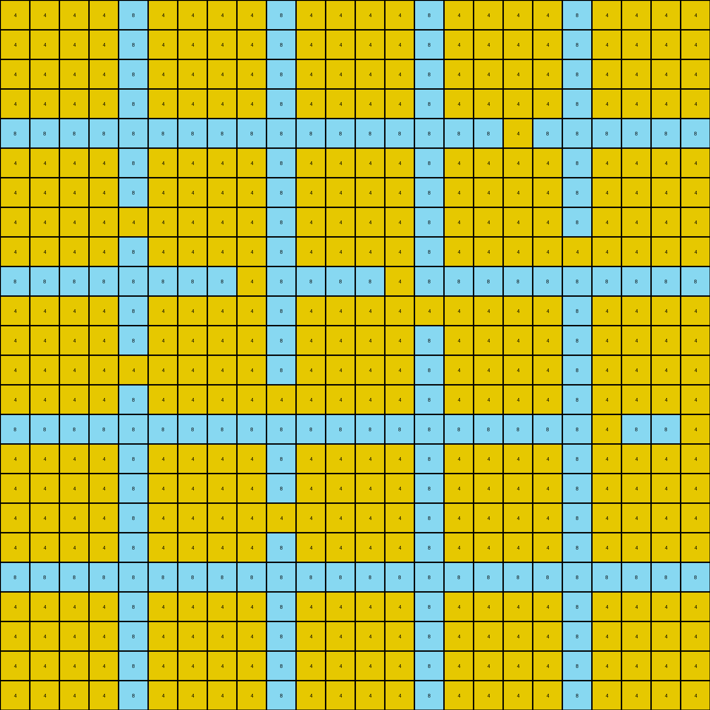
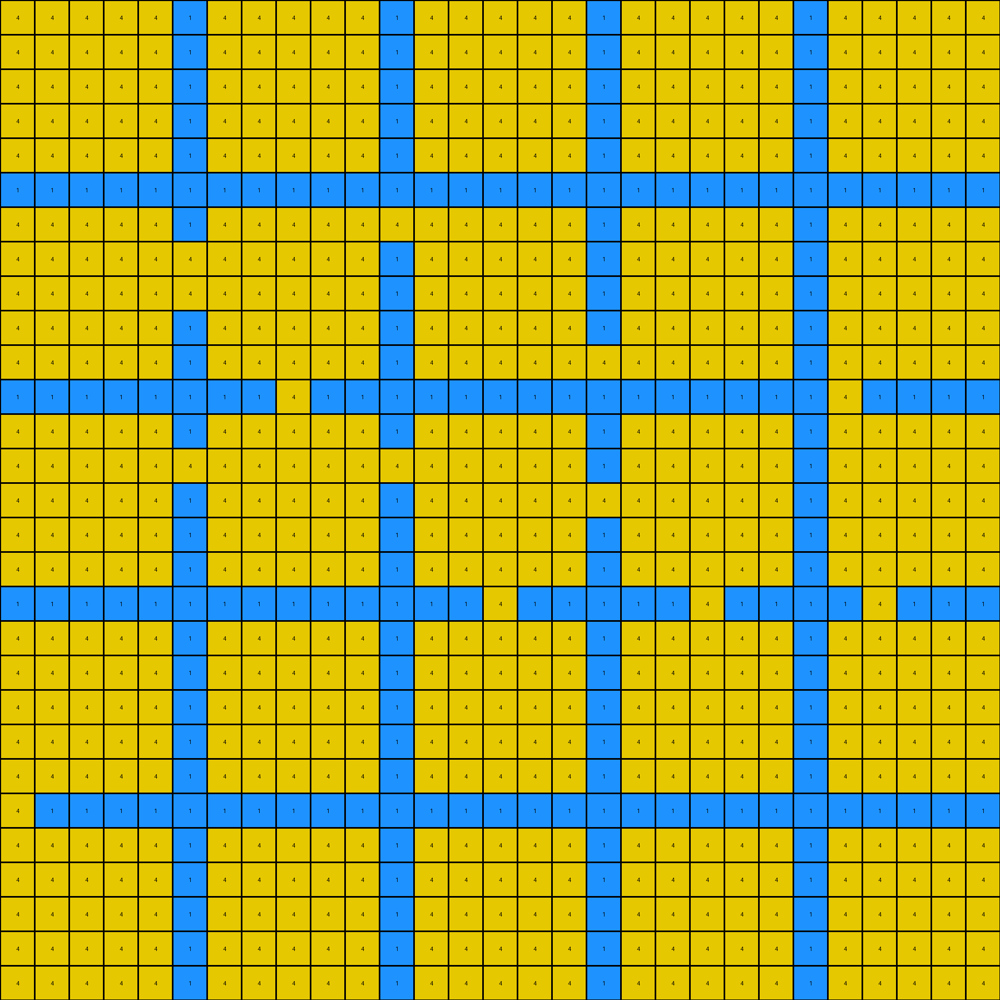
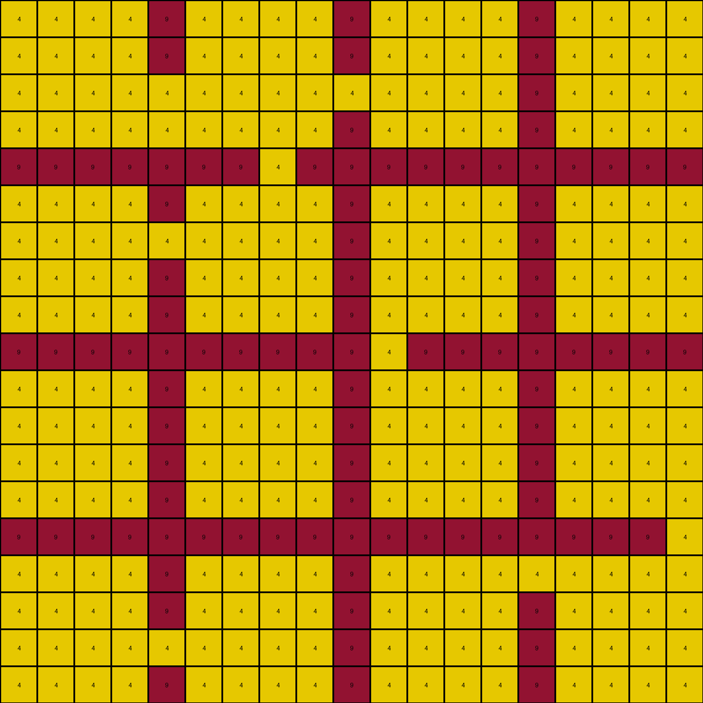

# 83302e8f • 005 • refine_dreamer

---


Previous Code:
```python
"""
1.  **Identify the Cross:** Find the "X" shaped cross formed by intersecting diagonal lines in the grid. The cross color isn't predetermined; detect it dynamically. The lines must intersect at the center of the 'X'.
2.  **Determine Cross Interior:**  The spaces within the arms of the "X" are the interior.
3.  **Recolor Cross Interior:** Change the color of the pixels *inside* the cross (not the outline) to a different color.  The examples use color 4 (yellow)
4. **Recolor Background in Proximity to Cross Outline:**
    -   Identify the outline of the cross, these are pixels of the original color of the cross in the extreme rows and columns of the 'x'
    -   Identify cells adjacent to the cross outline, these are distance of 1 from cells in the outline.
    -   Change the color of the background pixels adjacent to the cross outline to a specific color. The examples use color 3 (green)
5.  **Recolor Remaining Background:** Change the color of the remaining background pixels (those not adjacent to the cross outline) to a different specific color. The examples use color 4 (yellow).
"""

import numpy as np

def find_cross_coords(grid):
    """
    Finds the coordinates of the cross, regardless of its color.
    Returns a list of (row, col) tuples and the cross color.
    """
    rows, cols = grid.shape
    potential_cross_pixels = {}
    cross_color = None

    # Iterate through the grid, looking for potential center pixels
    for r in range(rows):
        for c in range(cols):
            color = grid[r, c]
            if color == 0:  # Skip background pixels
                continue

            # Check for diagonal neighbors of the same color
            if (r > 0 and c > 0 and grid[r - 1, c - 1] == color) or \
               (r > 0 and c < cols - 1 and grid[r - 1, c + 1] == color) or \
               (r < rows - 1 and c > 0 and grid[r + 1, c - 1] == color) or \
               (r < rows - 1 and c < cols - 1 and grid[r + 1, c + 1] == color):
                
                if color not in potential_cross_pixels:
                    potential_cross_pixels[color] = []
                potential_cross_pixels[color].append((r, c))

    # Identify the actual cross by checking for continuous diagonals
    for color, coords in potential_cross_pixels.items():
        if len(coords) < 5: #cross must be a min of 5 pixels
            continue

        #find min and max row and col to get center
        min_row = min(r for r, _ in coords)
        max_row = max(r for r, _ in coords)
        min_col = min(c for _, c in coords)
        max_col = max(c for _, c in coords)
        center_row = (min_row + max_row) // 2
        center_col = (min_col + max_col) // 2

        #check that we have a center pixel, and four arms
        is_valid_cross = True
        if (center_row, center_col) not in coords:
            is_valid_cross = False
        
        #check top left arm
        tr, tc = center_row, center_col
        while tr >= min_row and tc >= min_col:
            if (tr,tc) not in coords:
                is_valid_cross = False
                break
            tr -= 1
            tc -= 1
        
        #check top right arm
        tr, tc = center_row, center_col
        while tr >= min_row and tc <= max_col:
            if (tr,tc) not in coords:
                is_valid_cross = False
                break
            tr -= 1
            tc += 1

        #check bot left arm
        tr, tc = center_row, center_col
        while tr <= max_row and tc >= min_col:
            if (tr,tc) not in coords:
                is_valid_cross = False
                break
            tr += 1
            tc -= 1
        
        #check bot right arm
        tr, tc = center_row, center_col
        while tr <= max_row and tc <= max_col:
            if (tr,tc) not in coords:
                is_valid_cross = False
                break
            tr += 1
            tc += 1

        if is_valid_cross:
            cross_color = color
            return coords, cross_color  # Return the first valid cross found

    return [], None

def recolor_cross_interior(grid, cross_coords, cross_color, fill_color):
    """Recolors the interior of the cross."""
    new_grid = np.copy(grid)
    if not cross_coords:
        return new_grid

    #find min and max row and col
    min_row = min(r for r, _ in cross_coords)
    max_row = max(r for r, _ in cross_coords)
    min_col = min(c for _, c in cross_coords)
    max_col = max(c for _, c in cross_coords)

    for r, c in cross_coords:
        #check if inside the cross
        if (r != min_row and r != max_row and
            c != min_col and c!= max_col):
            new_grid[r,c] = fill_color

    return new_grid

def get_cross_outline(cross_coords):
    """Returns the outline coordinates of the cross."""
    if not cross_coords:
        return []
    
    #find min and max row and col
    min_row = min(r for r, _ in cross_coords)
    max_row = max(r for r, _ in cross_coords)
    min_col = min(c for _, c in cross_coords)
    max_col = max(c for _, c in cross_coords)

    outline = []
    for r, c in cross_coords:
        if r == min_row or r == max_row or c == min_col or c == max_col:
            outline.append((r, c))
    return outline

def recolor_background_near_outline(grid, outline_coords, cross_color, near_color):
    """Recolors background pixels near the cross outline."""
    new_grid = np.copy(grid)
    rows, cols = new_grid.shape
    
    for r in range(rows):
        for c in range(cols):
            if new_grid[r,c] == 0: #only check background
                for out_r, out_c in outline_coords:
                    if abs(r-out_r) <= 1 and abs(c - out_c) <= 1:
                        new_grid[r,c] = near_color
                        break #only recolor once
    return new_grid

def recolor_remaining_background(grid, cross_color, far_color):
    """Recolors the remaining background pixels."""
    new_grid = np.copy(grid)
    rows, cols = new_grid.shape
    for r in range(rows):
        for c in range(cols):
            if new_grid[r, c] == 0:  # Background pixels that haven't been changed
                new_grid[r, c] = far_color
    return new_grid

def transform(input_grid):
    # Find the coordinates of the cross and its color
    cross_coords, cross_color = find_cross_coords(input_grid)

    # Recolor the inside of the cross (fill color = 4)
    output_grid = recolor_cross_interior(input_grid, cross_coords, cross_color, 4)

    # Get Cross Outline
    outline_coords = get_cross_outline(cross_coords)

    # Recolor background near outline (near color = 3)
    output_grid = recolor_background_near_outline(output_grid, outline_coords, cross_color, 3)
    
    # Recolor the remaining background (far color = 4)
    output_grid = recolor_remaining_background(output_grid, cross_color, 4)

    return output_grid
```

Train Set Results:

## Example 1:

Input:
```
0 0 0 0 8 0 0 0 0 8 0 0 0 0 8 0 0 0 0 8 0 0 0 0
0 0 0 0 8 0 0 0 0 8 0 0 0 0 8 0 0 0 0 8 0 0 0 0
0 0 0 0 8 0 0 0 0 8 0 0 0 0 8 0 0 0 0 8 0 0 0 0
0 0 0 0 8 0 0 0 0 8 0 0 0 0 8 0 0 0 0 8 0 0 0 0
8 8 8 8 8 8 8 8 8 8 8 8 8 8 8 8 8 0 8 8 8 8 8 8
0 0 0 0 8 0 0 0 0 8 0 0 0 0 8 0 0 0 0 8 0 0 0 0
0 0 0 0 8 0 0 0 0 8 0 0 0 0 8 0 0 0 0 8 0 0 0 0
0 0 0 0 0 0 0 0 0 8 0 0 0 0 8 0 0 0 0 8 0 0 0 0
0 0 0 0 8 0 0 0 0 8 0 0 0 0 8 0 0 0 0 0 0 0 0 0
8 8 8 8 8 8 8 8 0 8 8 8 8 0 8 8 8 8 8 8 8 8 8 8
0 0 0 0 8 0 0 0 0 8 0 0 0 0 0 0 0 0 0 8 0 0 0 0
0 0 0 0 8 0 0 0 0 8 0 0 0 0 8 0 0 0 0 8 0 0 0 0
0 0 0 0 0 0 0 0 0 8 0 0 0 0 8 0 0 0 0 8 0 0 0 0
0 0 0 0 8 0 0 0 0 0 0 0 0 0 8 0 0 0 0 8 0 0 0 0
8 8 8 8 8 8 8 8 8 8 8 8 8 8 8 8 8 8 8 8 0 8 8 0
0 0 0 0 8 0 0 0 0 8 0 0 0 0 8 0 0 0 0 8 0 0 0 0
0 0 0 0 8 0 0 0 0 8 0 0 0 0 8 0 0 0 0 8 0 0 0 0
0 0 0 0 8 0 0 0 0 0 0 0 0 0 8 0 0 0 0 8 0 0 0 0
0 0 0 0 8 0 0 0 0 8 0 0 0 0 8 0 0 0 0 8 0 0 0 0
8 8 8 8 8 8 8 8 8 8 8 8 8 8 8 8 8 8 8 8 8 8 8 8
0 0 0 0 8 0 0 0 0 8 0 0 0 0 8 0 0 0 0 8 0 0 0 0
0 0 0 0 8 0 0 0 0 8 0 0 0 0 8 0 0 0 0 8 0 0 0 0
0 0 0 0 8 0 0 0 0 8 0 0 0 0 8 0 0 0 0 8 0 0 0 0
0 0 0 0 8 0 0 0 0 8 0 0 0 0 8 0 0 0 0 8 0 0 0 0
```
Expected Output:
```
3 3 3 3 8 3 3 3 3 8 3 3 3 3 8 4 4 4 4 8 3 3 3 3
3 3 3 3 8 3 3 3 3 8 3 3 3 3 8 4 4 4 4 8 3 3 3 3
3 3 3 3 8 3 3 3 3 8 3 3 3 3 8 4 4 4 4 8 3 3 3 3
3 3 3 3 8 3 3 3 3 8 3 3 3 3 8 4 4 4 4 8 3 3 3 3
8 8 8 8 8 8 8 8 8 8 8 8 8 8 8 8 8 4 8 8 8 8 8 8
4 4 4 4 8 4 4 4 4 8 4 4 4 4 8 4 4 4 4 8 4 4 4 4
4 4 4 4 8 4 4 4 4 8 4 4 4 4 8 4 4 4 4 8 4 4 4 4
4 4 4 4 4 4 4 4 4 8 4 4 4 4 8 4 4 4 4 8 4 4 4 4
4 4 4 4 8 4 4 4 4 8 4 4 4 4 8 4 4 4 4 4 4 4 4 4
8 8 8 8 8 8 8 8 4 8 8 8 8 4 8 8 8 8 8 8 8 8 8 8
4 4 4 4 8 4 4 4 4 8 4 4 4 4 4 4 4 4 4 8 4 4 4 4
4 4 4 4 8 4 4 4 4 8 4 4 4 4 8 4 4 4 4 8 4 4 4 4
4 4 4 4 4 4 4 4 4 8 4 4 4 4 8 4 4 4 4 8 4 4 4 4
4 4 4 4 8 4 4 4 4 4 4 4 4 4 8 4 4 4 4 8 4 4 4 4
8 8 8 8 8 8 8 8 8 8 8 8 8 8 8 8 8 8 8 8 4 8 8 4
3 3 3 3 8 4 4 4 4 8 4 4 4 4 8 3 3 3 3 8 4 4 4 4
3 3 3 3 8 4 4 4 4 8 4 4 4 4 8 3 3 3 3 8 4 4 4 4
3 3 3 3 8 4 4 4 4 4 4 4 4 4 8 3 3 3 3 8 4 4 4 4
3 3 3 3 8 4 4 4 4 8 4 4 4 4 8 3 3 3 3 8 4 4 4 4
8 8 8 8 8 8 8 8 8 8 8 8 8 8 8 8 8 8 8 8 8 8 8 8
3 3 3 3 8 3 3 3 3 8 3 3 3 3 8 3 3 3 3 8 3 3 3 3
3 3 3 3 8 3 3 3 3 8 3 3 3 3 8 3 3 3 3 8 3 3 3 3
3 3 3 3 8 3 3 3 3 8 3 3 3 3 8 3 3 3 3 8 3 3 3 3
3 3 3 3 8 3 3 3 3 8 3 3 3 3 8 3 3 3 3 8 3 3 3 3
```
Transformed Output:
```
4 4 4 4 8 4 4 4 4 8 4 4 4 4 8 4 4 4 4 8 4 4 4 4
4 4 4 4 8 4 4 4 4 8 4 4 4 4 8 4 4 4 4 8 4 4 4 4
4 4 4 4 8 4 4 4 4 8 4 4 4 4 8 4 4 4 4 8 4 4 4 4
4 4 4 4 8 4 4 4 4 8 4 4 4 4 8 4 4 4 4 8 4 4 4 4
8 8 8 8 8 8 8 8 8 8 8 8 8 8 8 8 8 4 8 8 8 8 8 8
4 4 4 4 8 4 4 4 4 8 4 4 4 4 8 4 4 4 4 8 4 4 4 4
4 4 4 4 8 4 4 4 4 8 4 4 4 4 8 4 4 4 4 8 4 4 4 4
4 4 4 4 4 4 4 4 4 8 4 4 4 4 8 4 4 4 4 8 4 4 4 4
4 4 4 4 8 4 4 4 4 8 4 4 4 4 8 4 4 4 4 4 4 4 4 4
8 8 8 8 8 8 8 8 4 8 8 8 8 4 8 8 8 8 8 8 8 8 8 8
4 4 4 4 8 4 4 4 4 8 4 4 4 4 4 4 4 4 4 8 4 4 4 4
4 4 4 4 8 4 4 4 4 8 4 4 4 4 8 4 4 4 4 8 4 4 4 4
4 4 4 4 4 4 4 4 4 8 4 4 4 4 8 4 4 4 4 8 4 4 4 4
4 4 4 4 8 4 4 4 4 4 4 4 4 4 8 4 4 4 4 8 4 4 4 4
8 8 8 8 8 8 8 8 8 8 8 8 8 8 8 8 8 8 8 8 4 8 8 4
4 4 4 4 8 4 4 4 4 8 4 4 4 4 8 4 4 4 4 8 4 4 4 4
4 4 4 4 8 4 4 4 4 8 4 4 4 4 8 4 4 4 4 8 4 4 4 4
4 4 4 4 8 4 4 4 4 4 4 4 4 4 8 4 4 4 4 8 4 4 4 4
4 4 4 4 8 4 4 4 4 8 4 4 4 4 8 4 4 4 4 8 4 4 4 4
8 8 8 8 8 8 8 8 8 8 8 8 8 8 8 8 8 8 8 8 8 8 8 8
4 4 4 4 8 4 4 4 4 8 4 4 4 4 8 4 4 4 4 8 4 4 4 4
4 4 4 4 8 4 4 4 4 8 4 4 4 4 8 4 4 4 4 8 4 4 4 4
4 4 4 4 8 4 4 4 4 8 4 4 4 4 8 4 4 4 4 8 4 4 4 4
4 4 4 4 8 4 4 4 4 8 4 4 4 4 8 4 4 4 4 8 4 4 4 4
```

match: False
pixels_off: 176
size_correct: True
color_palette_correct: True
correct_pixel_counts: False

## Example 2:

Input:
```
0 0 0 0 0 1 0 0 0 0 0 1 0 0 0 0 0 1 0 0 0 0 0 1 0 0 0 0 0
0 0 0 0 0 1 0 0 0 0 0 1 0 0 0 0 0 1 0 0 0 0 0 1 0 0 0 0 0
0 0 0 0 0 1 0 0 0 0 0 1 0 0 0 0 0 1 0 0 0 0 0 1 0 0 0 0 0
0 0 0 0 0 1 0 0 0 0 0 1 0 0 0 0 0 1 0 0 0 0 0 1 0 0 0 0 0
0 0 0 0 0 1 0 0 0 0 0 1 0 0 0 0 0 1 0 0 0 0 0 1 0 0 0 0 0
1 1 1 1 1 1 1 1 1 1 1 1 1 1 1 1 1 1 1 1 1 1 1 1 1 1 1 1 1
0 0 0 0 0 1 0 0 0 0 0 0 0 0 0 0 0 1 0 0 0 0 0 1 0 0 0 0 0
0 0 0 0 0 0 0 0 0 0 0 1 0 0 0 0 0 1 0 0 0 0 0 1 0 0 0 0 0
0 0 0 0 0 0 0 0 0 0 0 1 0 0 0 0 0 1 0 0 0 0 0 1 0 0 0 0 0
0 0 0 0 0 1 0 0 0 0 0 1 0 0 0 0 0 1 0 0 0 0 0 1 0 0 0 0 0
0 0 0 0 0 1 0 0 0 0 0 1 0 0 0 0 0 0 0 0 0 0 0 1 0 0 0 0 0
1 1 1 1 1 1 1 1 0 1 1 1 1 1 1 1 1 1 1 1 1 1 1 1 0 1 1 1 1
0 0 0 0 0 1 0 0 0 0 0 1 0 0 0 0 0 1 0 0 0 0 0 1 0 0 0 0 0
0 0 0 0 0 0 0 0 0 0 0 0 0 0 0 0 0 1 0 0 0 0 0 1 0 0 0 0 0
0 0 0 0 0 1 0 0 0 0 0 1 0 0 0 0 0 0 0 0 0 0 0 1 0 0 0 0 0
0 0 0 0 0 1 0 0 0 0 0 1 0 0 0 0 0 1 0 0 0 0 0 1 0 0 0 0 0
0 0 0 0 0 1 0 0 0 0 0 1 0 0 0 0 0 1 0 0 0 0 0 1 0 0 0 0 0
1 1 1 1 1 1 1 1 1 1 1 1 1 1 0 1 1 1 1 1 0 1 1 1 1 0 1 1 1
0 0 0 0 0 1 0 0 0 0 0 1 0 0 0 0 0 1 0 0 0 0 0 1 0 0 0 0 0
0 0 0 0 0 1 0 0 0 0 0 1 0 0 0 0 0 1 0 0 0 0 0 1 0 0 0 0 0
0 0 0 0 0 1 0 0 0 0 0 1 0 0 0 0 0 1 0 0 0 0 0 1 0 0 0 0 0
0 0 0 0 0 1 0 0 0 0 0 1 0 0 0 0 0 1 0 0 0 0 0 1 0 0 0 0 0
0 0 0 0 0 1 0 0 0 0 0 1 0 0 0 0 0 1 0 0 0 0 0 1 0 0 0 0 0
0 1 1 1 1 1 1 1 1 1 1 1 1 1 1 1 1 1 1 1 1 1 1 1 1 1 1 1 1
0 0 0 0 0 1 0 0 0 0 0 1 0 0 0 0 0 1 0 0 0 0 0 1 0 0 0 0 0
0 0 0 0 0 1 0 0 0 0 0 1 0 0 0 0 0 1 0 0 0 0 0 1 0 0 0 0 0
0 0 0 0 0 1 0 0 0 0 0 1 0 0 0 0 0 1 0 0 0 0 0 1 0 0 0 0 0
0 0 0 0 0 1 0 0 0 0 0 1 0 0 0 0 0 1 0 0 0 0 0 1 0 0 0 0 0
0 0 0 0 0 1 0 0 0 0 0 1 0 0 0 0 0 1 0 0 0 0 0 1 0 0 0 0 0
```
Expected Output:
```
3 3 3 3 3 1 3 3 3 3 3 1 3 3 3 3 3 1 3 3 3 3 3 1 3 3 3 3 3
3 3 3 3 3 1 3 3 3 3 3 1 3 3 3 3 3 1 3 3 3 3 3 1 3 3 3 3 3
3 3 3 3 3 1 3 3 3 3 3 1 3 3 3 3 3 1 3 3 3 3 3 1 3 3 3 3 3
3 3 3 3 3 1 3 3 3 3 3 1 3 3 3 3 3 1 3 3 3 3 3 1 3 3 3 3 3
3 3 3 3 3 1 3 3 3 3 3 1 3 3 3 3 3 1 3 3 3 3 3 1 3 3 3 3 3
1 1 1 1 1 1 1 1 1 1 1 1 1 1 1 1 1 1 1 1 1 1 1 1 1 1 1 1 1
4 4 4 4 4 1 4 4 4 4 4 4 4 4 4 4 4 1 4 4 4 4 4 1 4 4 4 4 4
4 4 4 4 4 4 4 4 4 4 4 1 4 4 4 4 4 1 4 4 4 4 4 1 4 4 4 4 4
4 4 4 4 4 4 4 4 4 4 4 1 4 4 4 4 4 1 4 4 4 4 4 1 4 4 4 4 4
4 4 4 4 4 1 4 4 4 4 4 1 4 4 4 4 4 1 4 4 4 4 4 1 4 4 4 4 4
4 4 4 4 4 1 4 4 4 4 4 1 4 4 4 4 4 4 4 4 4 4 4 1 4 4 4 4 4
1 1 1 1 1 1 1 1 4 1 1 1 1 1 1 1 1 1 1 1 1 1 1 1 4 1 1 1 1
4 4 4 4 4 1 4 4 4 4 4 1 4 4 4 4 4 1 4 4 4 4 4 1 4 4 4 4 4
4 4 4 4 4 4 4 4 4 4 4 4 4 4 4 4 4 1 4 4 4 4 4 1 4 4 4 4 4
4 4 4 4 4 1 4 4 4 4 4 1 4 4 4 4 4 4 4 4 4 4 4 1 4 4 4 4 4
4 4 4 4 4 1 4 4 4 4 4 1 4 4 4 4 4 1 4 4 4 4 4 1 4 4 4 4 4
4 4 4 4 4 1 4 4 4 4 4 1 4 4 4 4 4 1 4 4 4 4 4 1 4 4 4 4 4
1 1 1 1 1 1 1 1 1 1 1 1 1 1 4 1 1 1 1 1 4 1 1 1 1 4 1 1 1
4 4 4 4 4 1 3 3 3 3 3 1 4 4 4 4 4 1 4 4 4 4 4 1 4 4 4 4 4
4 4 4 4 4 1 3 3 3 3 3 1 4 4 4 4 4 1 4 4 4 4 4 1 4 4 4 4 4
4 4 4 4 4 1 3 3 3 3 3 1 4 4 4 4 4 1 4 4 4 4 4 1 4 4 4 4 4
4 4 4 4 4 1 3 3 3 3 3 1 4 4 4 4 4 1 4 4 4 4 4 1 4 4 4 4 4
4 4 4 4 4 1 3 3 3 3 3 1 4 4 4 4 4 1 4 4 4 4 4 1 4 4 4 4 4
4 1 1 1 1 1 1 1 1 1 1 1 1 1 1 1 1 1 1 1 1 1 1 1 1 1 1 1 1
4 4 4 4 4 1 3 3 3 3 3 1 3 3 3 3 3 1 3 3 3 3 3 1 3 3 3 3 3
4 4 4 4 4 1 3 3 3 3 3 1 3 3 3 3 3 1 3 3 3 3 3 1 3 3 3 3 3
4 4 4 4 4 1 3 3 3 3 3 1 3 3 3 3 3 1 3 3 3 3 3 1 3 3 3 3 3
4 4 4 4 4 1 3 3 3 3 3 1 3 3 3 3 3 1 3 3 3 3 3 1 3 3 3 3 3
4 4 4 4 4 1 3 3 3 3 3 1 3 3 3 3 3 1 3 3 3 3 3 1 3 3 3 3 3
```
Transformed Output:
```
4 4 4 4 4 1 4 4 4 4 4 1 4 4 4 4 4 1 4 4 4 4 4 1 4 4 4 4 4
4 4 4 4 4 1 4 4 4 4 4 1 4 4 4 4 4 1 4 4 4 4 4 1 4 4 4 4 4
4 4 4 4 4 1 4 4 4 4 4 1 4 4 4 4 4 1 4 4 4 4 4 1 4 4 4 4 4
4 4 4 4 4 1 4 4 4 4 4 1 4 4 4 4 4 1 4 4 4 4 4 1 4 4 4 4 4
4 4 4 4 4 1 4 4 4 4 4 1 4 4 4 4 4 1 4 4 4 4 4 1 4 4 4 4 4
1 1 1 1 1 1 1 1 1 1 1 1 1 1 1 1 1 1 1 1 1 1 1 1 1 1 1 1 1
4 4 4 4 4 1 4 4 4 4 4 4 4 4 4 4 4 1 4 4 4 4 4 1 4 4 4 4 4
4 4 4 4 4 4 4 4 4 4 4 1 4 4 4 4 4 1 4 4 4 4 4 1 4 4 4 4 4
4 4 4 4 4 4 4 4 4 4 4 1 4 4 4 4 4 1 4 4 4 4 4 1 4 4 4 4 4
4 4 4 4 4 1 4 4 4 4 4 1 4 4 4 4 4 1 4 4 4 4 4 1 4 4 4 4 4
4 4 4 4 4 1 4 4 4 4 4 1 4 4 4 4 4 4 4 4 4 4 4 1 4 4 4 4 4
1 1 1 1 1 1 1 1 4 1 1 1 1 1 1 1 1 1 1 1 1 1 1 1 4 1 1 1 1
4 4 4 4 4 1 4 4 4 4 4 1 4 4 4 4 4 1 4 4 4 4 4 1 4 4 4 4 4
4 4 4 4 4 4 4 4 4 4 4 4 4 4 4 4 4 1 4 4 4 4 4 1 4 4 4 4 4
4 4 4 4 4 1 4 4 4 4 4 1 4 4 4 4 4 4 4 4 4 4 4 1 4 4 4 4 4
4 4 4 4 4 1 4 4 4 4 4 1 4 4 4 4 4 1 4 4 4 4 4 1 4 4 4 4 4
4 4 4 4 4 1 4 4 4 4 4 1 4 4 4 4 4 1 4 4 4 4 4 1 4 4 4 4 4
1 1 1 1 1 1 1 1 1 1 1 1 1 1 4 1 1 1 1 1 4 1 1 1 1 4 1 1 1
4 4 4 4 4 1 4 4 4 4 4 1 4 4 4 4 4 1 4 4 4 4 4 1 4 4 4 4 4
4 4 4 4 4 1 4 4 4 4 4 1 4 4 4 4 4 1 4 4 4 4 4 1 4 4 4 4 4
4 4 4 4 4 1 4 4 4 4 4 1 4 4 4 4 4 1 4 4 4 4 4 1 4 4 4 4 4
4 4 4 4 4 1 4 4 4 4 4 1 4 4 4 4 4 1 4 4 4 4 4 1 4 4 4 4 4
4 4 4 4 4 1 4 4 4 4 4 1 4 4 4 4 4 1 4 4 4 4 4 1 4 4 4 4 4
4 1 1 1 1 1 1 1 1 1 1 1 1 1 1 1 1 1 1 1 1 1 1 1 1 1 1 1 1
4 4 4 4 4 1 4 4 4 4 4 1 4 4 4 4 4 1 4 4 4 4 4 1 4 4 4 4 4
4 4 4 4 4 1 4 4 4 4 4 1 4 4 4 4 4 1 4 4 4 4 4 1 4 4 4 4 4
4 4 4 4 4 1 4 4 4 4 4 1 4 4 4 4 4 1 4 4 4 4 4 1 4 4 4 4 4
4 4 4 4 4 1 4 4 4 4 4 1 4 4 4 4 4 1 4 4 4 4 4 1 4 4 4 4 4
4 4 4 4 4 1 4 4 4 4 4 1 4 4 4 4 4 1 4 4 4 4 4 1 4 4 4 4 4
```

match: False
pixels_off: 250
size_correct: True
color_palette_correct: True
correct_pixel_counts: False

## Example 3:

Input:
```
0 0 0 0 9 0 0 0 0 9 0 0 0 0 9 0 0 0 0
0 0 0 0 9 0 0 0 0 9 0 0 0 0 9 0 0 0 0
0 0 0 0 0 0 0 0 0 0 0 0 0 0 9 0 0 0 0
0 0 0 0 0 0 0 0 0 9 0 0 0 0 9 0 0 0 0
9 9 9 9 9 9 9 0 9 9 9 9 9 9 9 9 9 9 9
0 0 0 0 9 0 0 0 0 9 0 0 0 0 9 0 0 0 0
0 0 0 0 0 0 0 0 0 9 0 0 0 0 9 0 0 0 0
0 0 0 0 9 0 0 0 0 9 0 0 0 0 9 0 0 0 0
0 0 0 0 9 0 0 0 0 9 0 0 0 0 9 0 0 0 0
9 9 9 9 9 9 9 9 9 9 0 9 9 9 9 9 9 9 9
0 0 0 0 9 0 0 0 0 9 0 0 0 0 9 0 0 0 0
0 0 0 0 9 0 0 0 0 9 0 0 0 0 9 0 0 0 0
0 0 0 0 9 0 0 0 0 9 0 0 0 0 9 0 0 0 0
0 0 0 0 9 0 0 0 0 9 0 0 0 0 9 0 0 0 0
9 9 9 9 9 9 9 9 9 9 9 9 9 9 9 9 9 9 0
0 0 0 0 9 0 0 0 0 9 0 0 0 0 0 0 0 0 0
0 0 0 0 9 0 0 0 0 9 0 0 0 0 9 0 0 0 0
0 0 0 0 0 0 0 0 0 9 0 0 0 0 9 0 0 0 0
0 0 0 0 9 0 0 0 0 9 0 0 0 0 9 0 0 0 0
```
Expected Output:
```
4 4 4 4 9 4 4 4 4 9 4 4 4 4 9 3 3 3 3
4 4 4 4 9 4 4 4 4 9 4 4 4 4 9 3 3 3 3
4 4 4 4 4 4 4 4 4 4 4 4 4 4 9 3 3 3 3
4 4 4 4 4 4 4 4 4 9 4 4 4 4 9 3 3 3 3
9 9 9 9 9 9 9 4 9 9 9 9 9 9 9 9 9 9 9
4 4 4 4 9 4 4 4 4 9 4 4 4 4 9 3 3 3 3
4 4 4 4 4 4 4 4 4 9 4 4 4 4 9 3 3 3 3
4 4 4 4 9 4 4 4 4 9 4 4 4 4 9 3 3 3 3
4 4 4 4 9 4 4 4 4 9 4 4 4 4 9 3 3 3 3
9 9 9 9 9 9 9 9 9 9 4 9 9 9 9 9 9 9 9
3 3 3 3 9 3 3 3 3 9 4 4 4 4 9 4 4 4 4
3 3 3 3 9 3 3 3 3 9 4 4 4 4 9 4 4 4 4
3 3 3 3 9 3 3 3 3 9 4 4 4 4 9 4 4 4 4
3 3 3 3 9 3 3 3 3 9 4 4 4 4 9 4 4 4 4
9 9 9 9 9 9 9 9 9 9 9 9 9 9 9 9 9 9 4
4 4 4 4 9 4 4 4 4 9 4 4 4 4 4 4 4 4 4
4 4 4 4 9 4 4 4 4 9 4 4 4 4 9 4 4 4 4
4 4 4 4 4 4 4 4 4 9 4 4 4 4 9 4 4 4 4
4 4 4 4 9 4 4 4 4 9 4 4 4 4 9 4 4 4 4
```
Transformed Output:
```
4 4 4 4 9 4 4 4 4 9 4 4 4 4 9 4 4 4 4
4 4 4 4 9 4 4 4 4 9 4 4 4 4 9 4 4 4 4
4 4 4 4 4 4 4 4 4 4 4 4 4 4 9 4 4 4 4
4 4 4 4 4 4 4 4 4 9 4 4 4 4 9 4 4 4 4
9 9 9 9 9 9 9 4 9 9 9 9 9 9 9 9 9 9 9
4 4 4 4 9 4 4 4 4 9 4 4 4 4 9 4 4 4 4
4 4 4 4 4 4 4 4 4 9 4 4 4 4 9 4 4 4 4
4 4 4 4 9 4 4 4 4 9 4 4 4 4 9 4 4 4 4
4 4 4 4 9 4 4 4 4 9 4 4 4 4 9 4 4 4 4
9 9 9 9 9 9 9 9 9 9 4 9 9 9 9 9 9 9 9
4 4 4 4 9 4 4 4 4 9 4 4 4 4 9 4 4 4 4
4 4 4 4 9 4 4 4 4 9 4 4 4 4 9 4 4 4 4
4 4 4 4 9 4 4 4 4 9 4 4 4 4 9 4 4 4 4
4 4 4 4 9 4 4 4 4 9 4 4 4 4 9 4 4 4 4
9 9 9 9 9 9 9 9 9 9 9 9 9 9 9 9 9 9 4
4 4 4 4 9 4 4 4 4 9 4 4 4 4 4 4 4 4 4
4 4 4 4 9 4 4 4 4 9 4 4 4 4 9 4 4 4 4
4 4 4 4 4 4 4 4 4 9 4 4 4 4 9 4 4 4 4
4 4 4 4 9 4 4 4 4 9 4 4 4 4 9 4 4 4 4
```

match: False
pixels_off: 64
size_correct: True
color_palette_correct: True
correct_pixel_counts: False

**INSTRUCTIONS**

The code above was generated based on observations from the first training
example

we have tested the transform function on each of the task example inputs and
compared with the expected output

review each of the examples provided and the results and consider how the
natural language program should be updated to accommodate this new knowledge

respond with the following deliverables:

- general assessment of the information provided and strategy for resolving the
  errors
- gather metrics about each of the examples and results - use code_execution to
  develop accurate reports on your assumptions
- a YAML block documenting facts - Focus on identifying objects, their properties, and the actions performed on them.
- a natural language program - Be as clear and concise as possible, providing a complete description of the transformation rule.


your responses should be considered as information in a report - not a
conversation
