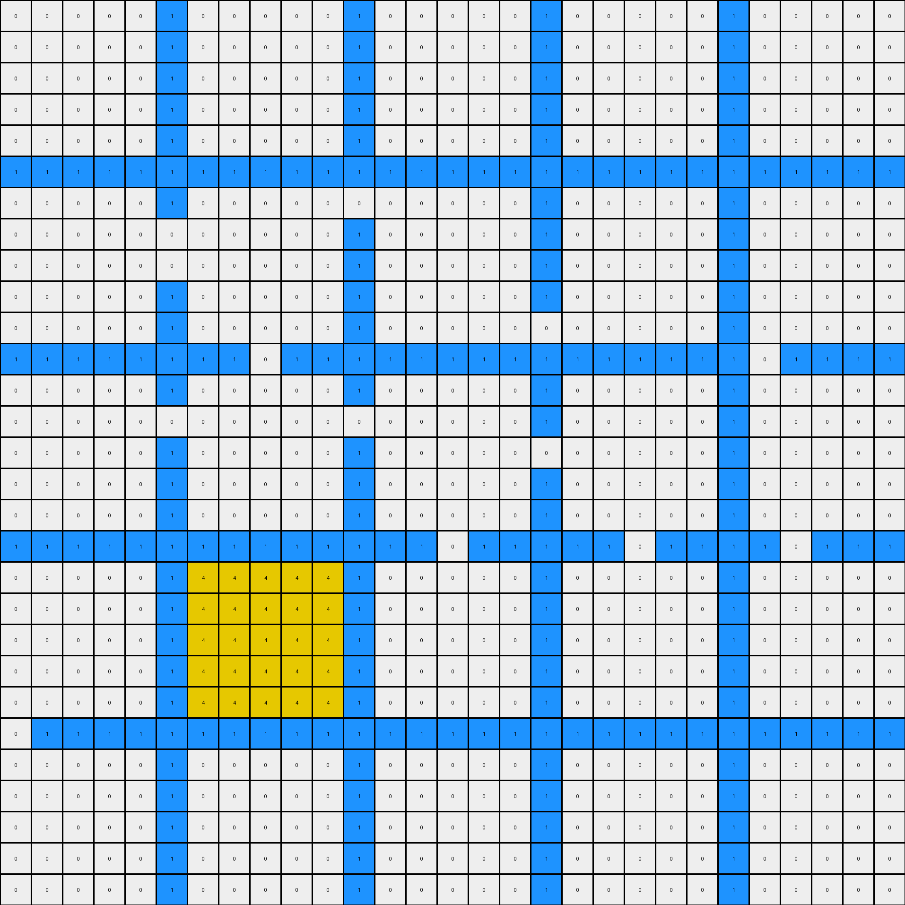
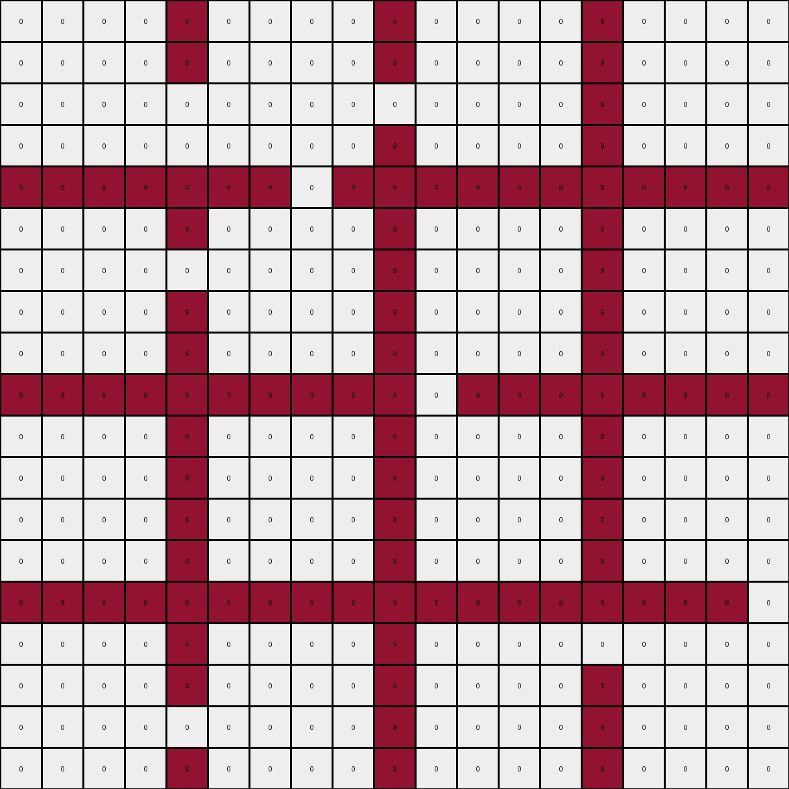

# 83302e8f • 011 • refine_dreamer

---


Previous Code:
```python
"""
1.  **Identify all colored lines:** Locate all pixels of color 'c', in this task c = 1, but should generalize.
2. **Identify *all* enclosed regions.** An enclosed region consists of contiguous pixels of any color that is not 'c' that are completely surrounded by pixels of color 'c', either directly adjacent or by extending to the edges of the grid. The boundary must form a closed loop or connect edges to other edges.
3.  **Identify all horizontal lines:** Find all horizontal lines where every cell is equal 'c'.
4.  **Determine fill color:**
    *   For regions located *above* the *topmost* horizontal line, fill with green (3).
    *   For regions located *between* horizontal lines, fill with yellow (4)
    * For regions *below* the *bottom most* horizontal line, fill the with yellow(4).
5.  **Preserve Boundary Lines:** Maintain the color 'c' pixels in their original positions.
6. **Consider other colors.** The region may contain pixels that are not 0. These must be detected by the flood fill and correctly filled.
"""

import numpy as np

def find_boundary_lines(grid, boundary_color=1):
    # Find the coordinates of all boundary pixels.
    return np.where(grid == boundary_color)

def is_enclosed(grid, coord, boundary_color=1):
    """
    Checks if a given coordinate is within an enclosed region, improved.
    Uses a flood-fill algorithm.
    """
    rows, cols = grid.shape
    x, y = coord

    # If the starting coordinate is boundary_color, it's not enclosed.
    if grid[x, y] == boundary_color:
        return False

    visited = set()
    queue = [(x, y)]
    
    while queue:
        curr_x, curr_y = queue.pop(0)

        if (curr_x, curr_y) in visited:
            continue
        visited.add((curr_x, curr_y))

        # If we hit a boundary, it's not enclosed.
        if curr_x == 0 or curr_x == rows - 1 or curr_y == 0 or curr_y == cols - 1:
            if grid[curr_x, curr_y] != boundary_color:
              return False

        # Check neighbors
        neighbors = [
            (curr_x - 1, curr_y),
            (curr_x + 1, curr_y),
            (curr_x, curr_y - 1),
            (curr_x, curr_y + 1),
        ]

        for nx, ny in neighbors:
            if 0 <= nx < rows and 0 <= ny < cols:
                if grid[nx, ny] != boundary_color and (nx, ny) not in visited:
                    queue.append((nx, ny))

    return True

def find_all_horizontal_lines(grid, boundary_color=1):
     rows, cols = grid.shape
     horizontal_lines = []
     for r in range(rows):
        if all(grid[r,c] == boundary_color for c in range(cols)):
            horizontal_lines.append(r)
     return horizontal_lines

def transform(input_grid, boundary_color = 1):
    """
    Transforms the input grid according to the described rule.
    """
    output_grid = np.copy(input_grid)
    boundary_lines = find_boundary_lines(input_grid, boundary_color)
    boundary_lines_set = set(zip(boundary_lines[0], boundary_lines[1]))

    horizontal_lines = find_all_horizontal_lines(input_grid, boundary_color)

    rows, cols = input_grid.shape
    for r in range(rows):
        for c in range(cols):
            if (r,c) not in boundary_lines_set:
                if is_enclosed(input_grid, (r, c), boundary_color):
                    if not horizontal_lines: #no horizontal lines
                        output_grid[r,c] = 3 #default to color above
                    elif r < horizontal_lines[0]:
                        output_grid[r,c] = 3
                    elif r > horizontal_lines[-1]:
                         output_grid[r,c] = 4
                    else: #between lines
                        for i in range(len(horizontal_lines) - 1):
                            if horizontal_lines[i] < r < horizontal_lines[i+1]:
                                output_grid[r,c] = 4
                                break

    return output_grid
```

Train Set Results:

## Example 1:

Input:
```
0 0 0 0 8 0 0 0 0 8 0 0 0 0 8 0 0 0 0 8 0 0 0 0
0 0 0 0 8 0 0 0 0 8 0 0 0 0 8 0 0 0 0 8 0 0 0 0
0 0 0 0 8 0 0 0 0 8 0 0 0 0 8 0 0 0 0 8 0 0 0 0
0 0 0 0 8 0 0 0 0 8 0 0 0 0 8 0 0 0 0 8 0 0 0 0
8 8 8 8 8 8 8 8 8 8 8 8 8 8 8 8 8 0 8 8 8 8 8 8
0 0 0 0 8 0 0 0 0 8 0 0 0 0 8 0 0 0 0 8 0 0 0 0
0 0 0 0 8 0 0 0 0 8 0 0 0 0 8 0 0 0 0 8 0 0 0 0
0 0 0 0 0 0 0 0 0 8 0 0 0 0 8 0 0 0 0 8 0 0 0 0
0 0 0 0 8 0 0 0 0 8 0 0 0 0 8 0 0 0 0 0 0 0 0 0
8 8 8 8 8 8 8 8 0 8 8 8 8 0 8 8 8 8 8 8 8 8 8 8
0 0 0 0 8 0 0 0 0 8 0 0 0 0 0 0 0 0 0 8 0 0 0 0
0 0 0 0 8 0 0 0 0 8 0 0 0 0 8 0 0 0 0 8 0 0 0 0
0 0 0 0 0 0 0 0 0 8 0 0 0 0 8 0 0 0 0 8 0 0 0 0
0 0 0 0 8 0 0 0 0 0 0 0 0 0 8 0 0 0 0 8 0 0 0 0
8 8 8 8 8 8 8 8 8 8 8 8 8 8 8 8 8 8 8 8 0 8 8 0
0 0 0 0 8 0 0 0 0 8 0 0 0 0 8 0 0 0 0 8 0 0 0 0
0 0 0 0 8 0 0 0 0 8 0 0 0 0 8 0 0 0 0 8 0 0 0 0
0 0 0 0 8 0 0 0 0 0 0 0 0 0 8 0 0 0 0 8 0 0 0 0
0 0 0 0 8 0 0 0 0 8 0 0 0 0 8 0 0 0 0 8 0 0 0 0
8 8 8 8 8 8 8 8 8 8 8 8 8 8 8 8 8 8 8 8 8 8 8 8
0 0 0 0 8 0 0 0 0 8 0 0 0 0 8 0 0 0 0 8 0 0 0 0
0 0 0 0 8 0 0 0 0 8 0 0 0 0 8 0 0 0 0 8 0 0 0 0
0 0 0 0 8 0 0 0 0 8 0 0 0 0 8 0 0 0 0 8 0 0 0 0
0 0 0 0 8 0 0 0 0 8 0 0 0 0 8 0 0 0 0 8 0 0 0 0
```
Expected Output:
```
3 3 3 3 8 3 3 3 3 8 3 3 3 3 8 4 4 4 4 8 3 3 3 3
3 3 3 3 8 3 3 3 3 8 3 3 3 3 8 4 4 4 4 8 3 3 3 3
3 3 3 3 8 3 3 3 3 8 3 3 3 3 8 4 4 4 4 8 3 3 3 3
3 3 3 3 8 3 3 3 3 8 3 3 3 3 8 4 4 4 4 8 3 3 3 3
8 8 8 8 8 8 8 8 8 8 8 8 8 8 8 8 8 4 8 8 8 8 8 8
4 4 4 4 8 4 4 4 4 8 4 4 4 4 8 4 4 4 4 8 4 4 4 4
4 4 4 4 8 4 4 4 4 8 4 4 4 4 8 4 4 4 4 8 4 4 4 4
4 4 4 4 4 4 4 4 4 8 4 4 4 4 8 4 4 4 4 8 4 4 4 4
4 4 4 4 8 4 4 4 4 8 4 4 4 4 8 4 4 4 4 4 4 4 4 4
8 8 8 8 8 8 8 8 4 8 8 8 8 4 8 8 8 8 8 8 8 8 8 8
4 4 4 4 8 4 4 4 4 8 4 4 4 4 4 4 4 4 4 8 4 4 4 4
4 4 4 4 8 4 4 4 4 8 4 4 4 4 8 4 4 4 4 8 4 4 4 4
4 4 4 4 4 4 4 4 4 8 4 4 4 4 8 4 4 4 4 8 4 4 4 4
4 4 4 4 8 4 4 4 4 4 4 4 4 4 8 4 4 4 4 8 4 4 4 4
8 8 8 8 8 8 8 8 8 8 8 8 8 8 8 8 8 8 8 8 4 8 8 4
3 3 3 3 8 4 4 4 4 8 4 4 4 4 8 3 3 3 3 8 4 4 4 4
3 3 3 3 8 4 4 4 4 8 4 4 4 4 8 3 3 3 3 8 4 4 4 4
3 3 3 3 8 4 4 4 4 4 4 4 4 4 8 3 3 3 3 8 4 4 4 4
3 3 3 3 8 4 4 4 4 8 4 4 4 4 8 3 3 3 3 8 4 4 4 4
8 8 8 8 8 8 8 8 8 8 8 8 8 8 8 8 8 8 8 8 8 8 8 8
3 3 3 3 8 3 3 3 3 8 3 3 3 3 8 3 3 3 3 8 3 3 3 3
3 3 3 3 8 3 3 3 3 8 3 3 3 3 8 3 3 3 3 8 3 3 3 3
3 3 3 3 8 3 3 3 3 8 3 3 3 3 8 3 3 3 3 8 3 3 3 3
3 3 3 3 8 3 3 3 3 8 3 3 3 3 8 3 3 3 3 8 3 3 3 3
```
Transformed Output:
```
0 0 0 0 8 0 0 0 0 8 0 0 0 0 8 0 0 0 0 8 0 0 0 0
0 0 0 0 8 0 0 0 0 8 0 0 0 0 8 0 0 0 0 8 0 0 0 0
0 0 0 0 8 0 0 0 0 8 0 0 0 0 8 0 0 0 0 8 0 0 0 0
0 0 0 0 8 0 0 0 0 8 0 0 0 0 8 0 0 0 0 8 0 0 0 0
8 8 8 8 8 8 8 8 8 8 8 8 8 8 8 8 8 0 8 8 8 8 8 8
0 0 0 0 8 0 0 0 0 8 0 0 0 0 8 0 0 0 0 8 0 0 0 0
0 0 0 0 8 0 0 0 0 8 0 0 0 0 8 0 0 0 0 8 0 0 0 0
0 0 0 0 0 0 0 0 0 8 0 0 0 0 8 0 0 0 0 8 0 0 0 0
0 0 0 0 8 0 0 0 0 8 0 0 0 0 8 0 0 0 0 0 0 0 0 0
8 8 8 8 8 8 8 8 0 8 8 8 8 0 8 8 8 8 8 8 8 8 8 8
0 0 0 0 8 0 0 0 0 8 0 0 0 0 0 0 0 0 0 8 0 0 0 0
0 0 0 0 8 0 0 0 0 8 0 0 0 0 8 0 0 0 0 8 0 0 0 0
0 0 0 0 0 0 0 0 0 8 0 0 0 0 8 0 0 0 0 8 0 0 0 0
0 0 0 0 8 0 0 0 0 0 0 0 0 0 8 0 0 0 0 8 0 0 0 0
8 8 8 8 8 8 8 8 8 8 8 8 8 8 8 8 8 8 8 8 0 8 8 0
0 0 0 0 8 0 0 0 0 8 0 0 0 0 8 0 0 0 0 8 0 0 0 0
0 0 0 0 8 0 0 0 0 8 0 0 0 0 8 0 0 0 0 8 0 0 0 0
0 0 0 0 8 0 0 0 0 0 0 0 0 0 8 0 0 0 0 8 0 0 0 0
0 0 0 0 8 0 0 0 0 8 0 0 0 0 8 0 0 0 0 8 0 0 0 0
8 8 8 8 8 8 8 8 8 8 8 8 8 8 8 8 8 8 8 8 8 8 8 8
0 0 0 0 8 0 0 0 0 8 0 0 0 0 8 0 0 0 0 8 0 0 0 0
0 0 0 0 8 0 0 0 0 8 0 0 0 0 8 0 0 0 0 8 0 0 0 0
0 0 0 0 8 0 0 0 0 8 0 0 0 0 8 0 0 0 0 8 0 0 0 0
0 0 0 0 8 0 0 0 0 8 0 0 0 0 8 0 0 0 0 8 0 0 0 0
```

match: False
pixels_off: 411
size_correct: True
color_palette_correct: False
correct_pixel_counts: False

## Example 2:

Input:
```
0 0 0 0 0 1 0 0 0 0 0 1 0 0 0 0 0 1 0 0 0 0 0 1 0 0 0 0 0
0 0 0 0 0 1 0 0 0 0 0 1 0 0 0 0 0 1 0 0 0 0 0 1 0 0 0 0 0
0 0 0 0 0 1 0 0 0 0 0 1 0 0 0 0 0 1 0 0 0 0 0 1 0 0 0 0 0
0 0 0 0 0 1 0 0 0 0 0 1 0 0 0 0 0 1 0 0 0 0 0 1 0 0 0 0 0
0 0 0 0 0 1 0 0 0 0 0 1 0 0 0 0 0 1 0 0 0 0 0 1 0 0 0 0 0
1 1 1 1 1 1 1 1 1 1 1 1 1 1 1 1 1 1 1 1 1 1 1 1 1 1 1 1 1
0 0 0 0 0 1 0 0 0 0 0 0 0 0 0 0 0 1 0 0 0 0 0 1 0 0 0 0 0
0 0 0 0 0 0 0 0 0 0 0 1 0 0 0 0 0 1 0 0 0 0 0 1 0 0 0 0 0
0 0 0 0 0 0 0 0 0 0 0 1 0 0 0 0 0 1 0 0 0 0 0 1 0 0 0 0 0
0 0 0 0 0 1 0 0 0 0 0 1 0 0 0 0 0 1 0 0 0 0 0 1 0 0 0 0 0
0 0 0 0 0 1 0 0 0 0 0 1 0 0 0 0 0 0 0 0 0 0 0 1 0 0 0 0 0
1 1 1 1 1 1 1 1 0 1 1 1 1 1 1 1 1 1 1 1 1 1 1 1 0 1 1 1 1
0 0 0 0 0 1 0 0 0 0 0 1 0 0 0 0 0 1 0 0 0 0 0 1 0 0 0 0 0
0 0 0 0 0 0 0 0 0 0 0 0 0 0 0 0 0 1 0 0 0 0 0 1 0 0 0 0 0
0 0 0 0 0 1 0 0 0 0 0 1 0 0 0 0 0 0 0 0 0 0 0 1 0 0 0 0 0
0 0 0 0 0 1 0 0 0 0 0 1 0 0 0 0 0 1 0 0 0 0 0 1 0 0 0 0 0
0 0 0 0 0 1 0 0 0 0 0 1 0 0 0 0 0 1 0 0 0 0 0 1 0 0 0 0 0
1 1 1 1 1 1 1 1 1 1 1 1 1 1 0 1 1 1 1 1 0 1 1 1 1 0 1 1 1
0 0 0 0 0 1 0 0 0 0 0 1 0 0 0 0 0 1 0 0 0 0 0 1 0 0 0 0 0
0 0 0 0 0 1 0 0 0 0 0 1 0 0 0 0 0 1 0 0 0 0 0 1 0 0 0 0 0
0 0 0 0 0 1 0 0 0 0 0 1 0 0 0 0 0 1 0 0 0 0 0 1 0 0 0 0 0
0 0 0 0 0 1 0 0 0 0 0 1 0 0 0 0 0 1 0 0 0 0 0 1 0 0 0 0 0
0 0 0 0 0 1 0 0 0 0 0 1 0 0 0 0 0 1 0 0 0 0 0 1 0 0 0 0 0
0 1 1 1 1 1 1 1 1 1 1 1 1 1 1 1 1 1 1 1 1 1 1 1 1 1 1 1 1
0 0 0 0 0 1 0 0 0 0 0 1 0 0 0 0 0 1 0 0 0 0 0 1 0 0 0 0 0
0 0 0 0 0 1 0 0 0 0 0 1 0 0 0 0 0 1 0 0 0 0 0 1 0 0 0 0 0
0 0 0 0 0 1 0 0 0 0 0 1 0 0 0 0 0 1 0 0 0 0 0 1 0 0 0 0 0
0 0 0 0 0 1 0 0 0 0 0 1 0 0 0 0 0 1 0 0 0 0 0 1 0 0 0 0 0
0 0 0 0 0 1 0 0 0 0 0 1 0 0 0 0 0 1 0 0 0 0 0 1 0 0 0 0 0
```
Expected Output:
```
3 3 3 3 3 1 3 3 3 3 3 1 3 3 3 3 3 1 3 3 3 3 3 1 3 3 3 3 3
3 3 3 3 3 1 3 3 3 3 3 1 3 3 3 3 3 1 3 3 3 3 3 1 3 3 3 3 3
3 3 3 3 3 1 3 3 3 3 3 1 3 3 3 3 3 1 3 3 3 3 3 1 3 3 3 3 3
3 3 3 3 3 1 3 3 3 3 3 1 3 3 3 3 3 1 3 3 3 3 3 1 3 3 3 3 3
3 3 3 3 3 1 3 3 3 3 3 1 3 3 3 3 3 1 3 3 3 3 3 1 3 3 3 3 3
1 1 1 1 1 1 1 1 1 1 1 1 1 1 1 1 1 1 1 1 1 1 1 1 1 1 1 1 1
4 4 4 4 4 1 4 4 4 4 4 4 4 4 4 4 4 1 4 4 4 4 4 1 4 4 4 4 4
4 4 4 4 4 4 4 4 4 4 4 1 4 4 4 4 4 1 4 4 4 4 4 1 4 4 4 4 4
4 4 4 4 4 4 4 4 4 4 4 1 4 4 4 4 4 1 4 4 4 4 4 1 4 4 4 4 4
4 4 4 4 4 1 4 4 4 4 4 1 4 4 4 4 4 1 4 4 4 4 4 1 4 4 4 4 4
4 4 4 4 4 1 4 4 4 4 4 1 4 4 4 4 4 4 4 4 4 4 4 1 4 4 4 4 4
1 1 1 1 1 1 1 1 4 1 1 1 1 1 1 1 1 1 1 1 1 1 1 1 4 1 1 1 1
4 4 4 4 4 1 4 4 4 4 4 1 4 4 4 4 4 1 4 4 4 4 4 1 4 4 4 4 4
4 4 4 4 4 4 4 4 4 4 4 4 4 4 4 4 4 1 4 4 4 4 4 1 4 4 4 4 4
4 4 4 4 4 1 4 4 4 4 4 1 4 4 4 4 4 4 4 4 4 4 4 1 4 4 4 4 4
4 4 4 4 4 1 4 4 4 4 4 1 4 4 4 4 4 1 4 4 4 4 4 1 4 4 4 4 4
4 4 4 4 4 1 4 4 4 4 4 1 4 4 4 4 4 1 4 4 4 4 4 1 4 4 4 4 4
1 1 1 1 1 1 1 1 1 1 1 1 1 1 4 1 1 1 1 1 4 1 1 1 1 4 1 1 1
4 4 4 4 4 1 3 3 3 3 3 1 4 4 4 4 4 1 4 4 4 4 4 1 4 4 4 4 4
4 4 4 4 4 1 3 3 3 3 3 1 4 4 4 4 4 1 4 4 4 4 4 1 4 4 4 4 4
4 4 4 4 4 1 3 3 3 3 3 1 4 4 4 4 4 1 4 4 4 4 4 1 4 4 4 4 4
4 4 4 4 4 1 3 3 3 3 3 1 4 4 4 4 4 1 4 4 4 4 4 1 4 4 4 4 4
4 4 4 4 4 1 3 3 3 3 3 1 4 4 4 4 4 1 4 4 4 4 4 1 4 4 4 4 4
4 1 1 1 1 1 1 1 1 1 1 1 1 1 1 1 1 1 1 1 1 1 1 1 1 1 1 1 1
4 4 4 4 4 1 3 3 3 3 3 1 3 3 3 3 3 1 3 3 3 3 3 1 3 3 3 3 3
4 4 4 4 4 1 3 3 3 3 3 1 3 3 3 3 3 1 3 3 3 3 3 1 3 3 3 3 3
4 4 4 4 4 1 3 3 3 3 3 1 3 3 3 3 3 1 3 3 3 3 3 1 3 3 3 3 3
4 4 4 4 4 1 3 3 3 3 3 1 3 3 3 3 3 1 3 3 3 3 3 1 3 3 3 3 3
4 4 4 4 4 1 3 3 3 3 3 1 3 3 3 3 3 1 3 3 3 3 3 1 3 3 3 3 3
```
Transformed Output:
```
0 0 0 0 0 1 0 0 0 0 0 1 0 0 0 0 0 1 0 0 0 0 0 1 0 0 0 0 0
0 0 0 0 0 1 0 0 0 0 0 1 0 0 0 0 0 1 0 0 0 0 0 1 0 0 0 0 0
0 0 0 0 0 1 0 0 0 0 0 1 0 0 0 0 0 1 0 0 0 0 0 1 0 0 0 0 0
0 0 0 0 0 1 0 0 0 0 0 1 0 0 0 0 0 1 0 0 0 0 0 1 0 0 0 0 0
0 0 0 0 0 1 0 0 0 0 0 1 0 0 0 0 0 1 0 0 0 0 0 1 0 0 0 0 0
1 1 1 1 1 1 1 1 1 1 1 1 1 1 1 1 1 1 1 1 1 1 1 1 1 1 1 1 1
0 0 0 0 0 1 0 0 0 0 0 0 0 0 0 0 0 1 0 0 0 0 0 1 0 0 0 0 0
0 0 0 0 0 0 0 0 0 0 0 1 0 0 0 0 0 1 0 0 0 0 0 1 0 0 0 0 0
0 0 0 0 0 0 0 0 0 0 0 1 0 0 0 0 0 1 0 0 0 0 0 1 0 0 0 0 0
0 0 0 0 0 1 0 0 0 0 0 1 0 0 0 0 0 1 0 0 0 0 0 1 0 0 0 0 0
0 0 0 0 0 1 0 0 0 0 0 1 0 0 0 0 0 0 0 0 0 0 0 1 0 0 0 0 0
1 1 1 1 1 1 1 1 0 1 1 1 1 1 1 1 1 1 1 1 1 1 1 1 0 1 1 1 1
0 0 0 0 0 1 0 0 0 0 0 1 0 0 0 0 0 1 0 0 0 0 0 1 0 0 0 0 0
0 0 0 0 0 0 0 0 0 0 0 0 0 0 0 0 0 1 0 0 0 0 0 1 0 0 0 0 0
0 0 0 0 0 1 0 0 0 0 0 1 0 0 0 0 0 0 0 0 0 0 0 1 0 0 0 0 0
0 0 0 0 0 1 0 0 0 0 0 1 0 0 0 0 0 1 0 0 0 0 0 1 0 0 0 0 0
0 0 0 0 0 1 0 0 0 0 0 1 0 0 0 0 0 1 0 0 0 0 0 1 0 0 0 0 0
1 1 1 1 1 1 1 1 1 1 1 1 1 1 0 1 1 1 1 1 0 1 1 1 1 0 1 1 1
0 0 0 0 0 1 4 4 4 4 4 1 0 0 0 0 0 1 0 0 0 0 0 1 0 0 0 0 0
0 0 0 0 0 1 4 4 4 4 4 1 0 0 0 0 0 1 0 0 0 0 0 1 0 0 0 0 0
0 0 0 0 0 1 4 4 4 4 4 1 0 0 0 0 0 1 0 0 0 0 0 1 0 0 0 0 0
0 0 0 0 0 1 4 4 4 4 4 1 0 0 0 0 0 1 0 0 0 0 0 1 0 0 0 0 0
0 0 0 0 0 1 4 4 4 4 4 1 0 0 0 0 0 1 0 0 0 0 0 1 0 0 0 0 0
0 1 1 1 1 1 1 1 1 1 1 1 1 1 1 1 1 1 1 1 1 1 1 1 1 1 1 1 1
0 0 0 0 0 1 0 0 0 0 0 1 0 0 0 0 0 1 0 0 0 0 0 1 0 0 0 0 0
0 0 0 0 0 1 0 0 0 0 0 1 0 0 0 0 0 1 0 0 0 0 0 1 0 0 0 0 0
0 0 0 0 0 1 0 0 0 0 0 1 0 0 0 0 0 1 0 0 0 0 0 1 0 0 0 0 0
0 0 0 0 0 1 0 0 0 0 0 1 0 0 0 0 0 1 0 0 0 0 0 1 0 0 0 0 0
0 0 0 0 0 1 0 0 0 0 0 1 0 0 0 0 0 1 0 0 0 0 0 1 0 0 0 0 0
```

match: False
pixels_off: 638
size_correct: True
color_palette_correct: False
correct_pixel_counts: False

## Example 3:

Input:
```
0 0 0 0 9 0 0 0 0 9 0 0 0 0 9 0 0 0 0
0 0 0 0 9 0 0 0 0 9 0 0 0 0 9 0 0 0 0
0 0 0 0 0 0 0 0 0 0 0 0 0 0 9 0 0 0 0
0 0 0 0 0 0 0 0 0 9 0 0 0 0 9 0 0 0 0
9 9 9 9 9 9 9 0 9 9 9 9 9 9 9 9 9 9 9
0 0 0 0 9 0 0 0 0 9 0 0 0 0 9 0 0 0 0
0 0 0 0 0 0 0 0 0 9 0 0 0 0 9 0 0 0 0
0 0 0 0 9 0 0 0 0 9 0 0 0 0 9 0 0 0 0
0 0 0 0 9 0 0 0 0 9 0 0 0 0 9 0 0 0 0
9 9 9 9 9 9 9 9 9 9 0 9 9 9 9 9 9 9 9
0 0 0 0 9 0 0 0 0 9 0 0 0 0 9 0 0 0 0
0 0 0 0 9 0 0 0 0 9 0 0 0 0 9 0 0 0 0
0 0 0 0 9 0 0 0 0 9 0 0 0 0 9 0 0 0 0
0 0 0 0 9 0 0 0 0 9 0 0 0 0 9 0 0 0 0
9 9 9 9 9 9 9 9 9 9 9 9 9 9 9 9 9 9 0
0 0 0 0 9 0 0 0 0 9 0 0 0 0 0 0 0 0 0
0 0 0 0 9 0 0 0 0 9 0 0 0 0 9 0 0 0 0
0 0 0 0 0 0 0 0 0 9 0 0 0 0 9 0 0 0 0
0 0 0 0 9 0 0 0 0 9 0 0 0 0 9 0 0 0 0
```
Expected Output:
```
4 4 4 4 9 4 4 4 4 9 4 4 4 4 9 3 3 3 3
4 4 4 4 9 4 4 4 4 9 4 4 4 4 9 3 3 3 3
4 4 4 4 4 4 4 4 4 4 4 4 4 4 9 3 3 3 3
4 4 4 4 4 4 4 4 4 9 4 4 4 4 9 3 3 3 3
9 9 9 9 9 9 9 4 9 9 9 9 9 9 9 9 9 9 9
4 4 4 4 9 4 4 4 4 9 4 4 4 4 9 3 3 3 3
4 4 4 4 4 4 4 4 4 9 4 4 4 4 9 3 3 3 3
4 4 4 4 9 4 4 4 4 9 4 4 4 4 9 3 3 3 3
4 4 4 4 9 4 4 4 4 9 4 4 4 4 9 3 3 3 3
9 9 9 9 9 9 9 9 9 9 4 9 9 9 9 9 9 9 9
3 3 3 3 9 3 3 3 3 9 4 4 4 4 9 4 4 4 4
3 3 3 3 9 3 3 3 3 9 4 4 4 4 9 4 4 4 4
3 3 3 3 9 3 3 3 3 9 4 4 4 4 9 4 4 4 4
3 3 3 3 9 3 3 3 3 9 4 4 4 4 9 4 4 4 4
9 9 9 9 9 9 9 9 9 9 9 9 9 9 9 9 9 9 4
4 4 4 4 9 4 4 4 4 9 4 4 4 4 4 4 4 4 4
4 4 4 4 9 4 4 4 4 9 4 4 4 4 9 4 4 4 4
4 4 4 4 4 4 4 4 4 9 4 4 4 4 9 4 4 4 4
4 4 4 4 9 4 4 4 4 9 4 4 4 4 9 4 4 4 4
```
Transformed Output:
```
0 0 0 0 9 0 0 0 0 9 0 0 0 0 9 0 0 0 0
0 0 0 0 9 0 0 0 0 9 0 0 0 0 9 0 0 0 0
0 0 0 0 0 0 0 0 0 0 0 0 0 0 9 0 0 0 0
0 0 0 0 0 0 0 0 0 9 0 0 0 0 9 0 0 0 0
9 9 9 9 9 9 9 0 9 9 9 9 9 9 9 9 9 9 9
0 0 0 0 9 0 0 0 0 9 0 0 0 0 9 0 0 0 0
0 0 0 0 0 0 0 0 0 9 0 0 0 0 9 0 0 0 0
0 0 0 0 9 0 0 0 0 9 0 0 0 0 9 0 0 0 0
0 0 0 0 9 0 0 0 0 9 0 0 0 0 9 0 0 0 0
9 9 9 9 9 9 9 9 9 9 0 9 9 9 9 9 9 9 9
0 0 0 0 9 0 0 0 0 9 0 0 0 0 9 0 0 0 0
0 0 0 0 9 0 0 0 0 9 0 0 0 0 9 0 0 0 0
0 0 0 0 9 0 0 0 0 9 0 0 0 0 9 0 0 0 0
0 0 0 0 9 0 0 0 0 9 0 0 0 0 9 0 0 0 0
9 9 9 9 9 9 9 9 9 9 9 9 9 9 9 9 9 9 0
0 0 0 0 9 0 0 0 0 9 0 0 0 0 0 0 0 0 0
0 0 0 0 9 0 0 0 0 9 0 0 0 0 9 0 0 0 0
0 0 0 0 0 0 0 0 0 9 0 0 0 0 9 0 0 0 0
0 0 0 0 9 0 0 0 0 9 0 0 0 0 9 0 0 0 0
```

match: False
pixels_off: 265
size_correct: True
color_palette_correct: False
correct_pixel_counts: False

**INSTRUCTIONS**

The code above was generated based on observations from the first training
example

we have tested the transform function on each of the task example inputs and
compared with the expected output

review each of the examples provided and the results and consider how the
natural language program should be updated to accommodate this new knowledge

respond with the following deliverables:

- general assessment of the information provided and strategy for resolving the
  errors
- gather metrics about each of the examples and results - use code_execution to
  develop accurate reports on your assumptions
- a YAML block documenting facts - Focus on identifying objects, their properties, and the actions performed on them.
- a natural language program - Be as clear and concise as possible, providing a complete description of the transformation rule.


your responses should be considered as information in a report - not a
conversation
