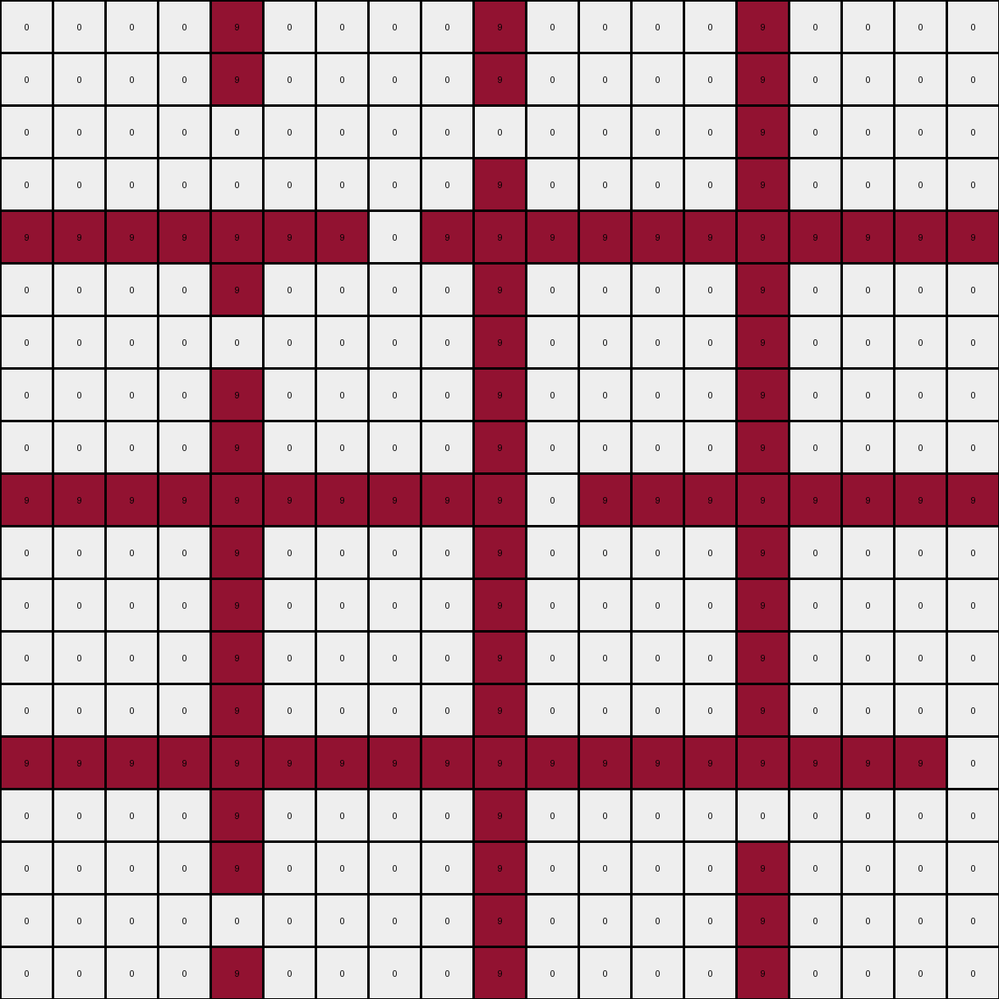

# 83302e8f • 012 • refine_coder

---

Previous Code:
```python
"""
1.  **Identify all colored lines:** Locate all pixels of color 'c', in this task c = 1, but should generalize.
2. **Identify *all* enclosed regions.** An enclosed region consists of contiguous pixels of any color that is not 'c' that are completely surrounded by pixels of color 'c', either directly adjacent or by extending to the edges of the grid. The boundary must form a closed loop or connect edges to other edges.
3.  **Identify all horizontal lines:** Find all horizontal lines where every cell is equal 'c'.
4.  **Determine fill color:**
    *   For regions located *above* the *topmost* horizontal line, fill with green (3).
    *   For regions located *between* horizontal lines, fill with yellow (4)
    * For regions *below* the *bottom most* horizontal line, fill the with yellow(4).
5.  **Preserve Boundary Lines:** Maintain the color 'c' pixels in their original positions.
6. **Consider other colors.** The region may contain pixels that are not 0. These must be detected by the flood fill and correctly filled.
"""

import numpy as np

def find_boundary_lines(grid, boundary_color=1):
    # Find the coordinates of all boundary pixels.
    return np.where(grid == boundary_color)

def is_enclosed(grid, coord, boundary_color=1):
    """
    Checks if a given coordinate is within an enclosed region, improved.
    Uses a flood-fill algorithm.
    """
    rows, cols = grid.shape
    x, y = coord

    # If the starting coordinate is boundary_color, it's not enclosed.
    if grid[x, y] == boundary_color:
        return False

    visited = set()
    queue = [(x, y)]
    
    while queue:
        curr_x, curr_y = queue.pop(0)

        if (curr_x, curr_y) in visited:
            continue
        visited.add((curr_x, curr_y))

        # If we hit a boundary, it's not enclosed.
        if curr_x == 0 or curr_x == rows - 1 or curr_y == 0 or curr_y == cols - 1:
            if grid[curr_x, curr_y] != boundary_color:
              return False

        # Check neighbors
        neighbors = [
            (curr_x - 1, curr_y),
            (curr_x + 1, curr_y),
            (curr_x, curr_y - 1),
            (curr_x, curr_y + 1),
        ]

        for nx, ny in neighbors:
            if 0 <= nx < rows and 0 <= ny < cols:
                if grid[nx, ny] != boundary_color and (nx, ny) not in visited:
                    queue.append((nx, ny))

    return True

def find_all_horizontal_lines(grid, boundary_color=1):
     rows, cols = grid.shape
     horizontal_lines = []
     for r in range(rows):
        if all(grid[r,c] == boundary_color for c in range(cols)):
            horizontal_lines.append(r)
     return horizontal_lines

def transform(input_grid, boundary_color = 1):
    """
    Transforms the input grid according to the described rule.
    """
    output_grid = np.copy(input_grid)
    boundary_lines = find_boundary_lines(input_grid, boundary_color)
    boundary_lines_set = set(zip(boundary_lines[0], boundary_lines[1]))

    horizontal_lines = find_all_horizontal_lines(input_grid, boundary_color)

    rows, cols = input_grid.shape
    for r in range(rows):
        for c in range(cols):
            if (r,c) not in boundary_lines_set:
                if is_enclosed(input_grid, (r, c), boundary_color):
                    if not horizontal_lines: #no horizontal lines
                        output_grid[r,c] = 3 #default to color above
                    elif r < horizontal_lines[0]:
                        output_grid[r,c] = 3
                    elif r > horizontal_lines[-1]:
                         output_grid[r,c] = 4
                    else: #between lines
                        for i in range(len(horizontal_lines) - 1):
                            if horizontal_lines[i] < r < horizontal_lines[i+1]:
                                output_grid[r,c] = 4
                                break

    return output_grid
```

Train Set Results:

## Example 1:

Input:
```
0 0 0 0 8 0 0 0 0 8 0 0 0 0 8 0 0 0 0 8 0 0 0 0
0 0 0 0 8 0 0 0 0 8 0 0 0 0 8 0 0 0 0 8 0 0 0 0
0 0 0 0 8 0 0 0 0 8 0 0 0 0 8 0 0 0 0 8 0 0 0 0
0 0 0 0 8 0 0 0 0 8 0 0 0 0 8 0 0 0 0 8 0 0 0 0
8 8 8 8 8 8 8 8 8 8 8 8 8 8 8 8 8 0 8 8 8 8 8 8
0 0 0 0 8 0 0 0 0 8 0 0 0 0 8 0 0 0 0 8 0 0 0 0
0 0 0 0 8 0 0 0 0 8 0 0 0 0 8 0 0 0 0 8 0 0 0 0
0 0 0 0 0 0 0 0 0 8 0 0 0 0 8 0 0 0 0 8 0 0 0 0
0 0 0 0 8 0 0 0 0 8 0 0 0 0 8 0 0 0 0 0 0 0 0 0
8 8 8 8 8 8 8 8 0 8 8 8 8 0 8 8 8 8 8 8 8 8 8 8
0 0 0 0 8 0 0 0 0 8 0 0 0 0 0 0 0 0 0 8 0 0 0 0
0 0 0 0 8 0 0 0 0 8 0 0 0 0 8 0 0 0 0 8 0 0 0 0
0 0 0 0 0 0 0 0 0 8 0 0 0 0 8 0 0 0 0 8 0 0 0 0
0 0 0 0 8 0 0 0 0 0 0 0 0 0 8 0 0 0 0 8 0 0 0 0
8 8 8 8 8 8 8 8 8 8 8 8 8 8 8 8 8 8 8 8 0 8 8 0
0 0 0 0 8 0 0 0 0 8 0 0 0 0 8 0 0 0 0 8 0 0 0 0
0 0 0 0 8 0 0 0 0 8 0 0 0 0 8 0 0 0 0 8 0 0 0 0
0 0 0 0 8 0 0 0 0 0 0 0 0 0 8 0 0 0 0 8 0 0 0 0
0 0 0 0 8 0 0 0 0 8 0 0 0 0 8 0 0 0 0 8 0 0 0 0
8 8 8 8 8 8 8 8 8 8 8 8 8 8 8 8 8 8 8 8 8 8 8 8
0 0 0 0 8 0 0 0 0 8 0 0 0 0 8 0 0 0 0 8 0 0 0 0
0 0 0 0 8 0 0 0 0 8 0 0 0 0 8 0 0 0 0 8 0 0 0 0
0 0 0 0 8 0 0 0 0 8 0 0 0 0 8 0 0 0 0 8 0 0 0 0
0 0 0 0 8 0 0 0 0 8 0 0 0 0 8 0 0 0 0 8 0 0 0 0
```
Expected Output:
```
3 3 3 3 8 3 3 3 3 8 3 3 3 3 8 4 4 4 4 8 3 3 3 3
3 3 3 3 8 3 3 3 3 8 3 3 3 3 8 4 4 4 4 8 3 3 3 3
3 3 3 3 8 3 3 3 3 8 3 3 3 3 8 4 4 4 4 8 3 3 3 3
3 3 3 3 8 3 3 3 3 8 3 3 3 3 8 4 4 4 4 8 3 3 3 3
8 8 8 8 8 8 8 8 8 8 8 8 8 8 8 8 8 4 8 8 8 8 8 8
4 4 4 4 8 4 4 4 4 8 4 4 4 4 8 4 4 4 4 8 4 4 4 4
4 4 4 4 8 4 4 4 4 8 4 4 4 4 8 4 4 4 4 8 4 4 4 4
4 4 4 4 4 4 4 4 4 8 4 4 4 4 8 4 4 4 4 8 4 4 4 4
4 4 4 4 8 4 4 4 4 8 4 4 4 4 8 4 4 4 4 4 4 4 4 4
8 8 8 8 8 8 8 8 4 8 8 8 8 4 8 8 8 8 8 8 8 8 8 8
4 4 4 4 8 4 4 4 4 8 4 4 4 4 4 4 4 4 4 8 4 4 4 4
4 4 4 4 8 4 4 4 4 8 4 4 4 4 8 4 4 4 4 8 4 4 4 4
4 4 4 4 4 4 4 4 4 8 4 4 4 4 8 4 4 4 4 8 4 4 4 4
4 4 4 4 8 4 4 4 4 4 4 4 4 4 8 4 4 4 4 8 4 4 4 4
8 8 8 8 8 8 8 8 8 8 8 8 8 8 8 8 8 8 8 8 4 8 8 4
3 3 3 3 8 4 4 4 4 8 4 4 4 4 8 3 3 3 3 8 4 4 4 4
3 3 3 3 8 4 4 4 4 8 4 4 4 4 8 3 3 3 3 8 4 4 4 4
3 3 3 3 8 4 4 4 4 4 4 4 4 4 8 3 3 3 3 8 4 4 4 4
3 3 3 3 8 4 4 4 4 8 4 4 4 4 8 3 3 3 3 8 4 4 4 4
8 8 8 8 8 8 8 8 8 8 8 8 8 8 8 8 8 8 8 8 8 8 8 8
3 3 3 3 8 3 3 3 3 8 3 3 3 3 8 3 3 3 3 8 3 3 3 3
3 3 3 3 8 3 3 3 3 8 3 3 3 3 8 3 3 3 3 8 3 3 3 3
3 3 3 3 8 3 3 3 3 8 3 3 3 3 8 3 3 3 3 8 3 3 3 3
3 3 3 3 8 3 3 3 3 8 3 3 3 3 8 3 3 3 3 8 3 3 3 3
```
Transformed Output:
```
0 0 0 0 8 0 0 0 0 8 0 0 0 0 8 0 0 0 0 8 0 0 0 0
0 0 0 0 8 0 0 0 0 8 0 0 0 0 8 0 0 0 0 8 0 0 0 0
0 0 0 0 8 0 0 0 0 8 0 0 0 0 8 0 0 0 0 8 0 0 0 0
0 0 0 0 8 0 0 0 0 8 0 0 0 0 8 0 0 0 0 8 0 0 0 0
8 8 8 8 8 8 8 8 8 8 8 8 8 8 8 8 8 0 8 8 8 8 8 8
0 0 0 0 8 0 0 0 0 8 0 0 0 0 8 0 0 0 0 8 0 0 0 0
0 0 0 0 8 0 0 0 0 8 0 0 0 0 8 0 0 0 0 8 0 0 0 0
0 0 0 0 0 0 0 0 0 8 0 0 0 0 8 0 0 0 0 8 0 0 0 0
0 0 0 0 8 0 0 0 0 8 0 0 0 0 8 0 0 0 0 0 0 0 0 0
8 8 8 8 8 8 8 8 0 8 8 8 8 0 8 8 8 8 8 8 8 8 8 8
0 0 0 0 8 0 0 0 0 8 0 0 0 0 0 0 0 0 0 8 0 0 0 0
0 0 0 0 8 0 0 0 0 8 0 0 0 0 8 0 0 0 0 8 0 0 0 0
0 0 0 0 0 0 0 0 0 8 0 0 0 0 8 0 0 0 0 8 0 0 0 0
0 0 0 0 8 0 0 0 0 0 0 0 0 0 8 0 0 0 0 8 0 0 0 0
8 8 8 8 8 8 8 8 8 8 8 8 8 8 8 8 8 8 8 8 0 8 8 0
0 0 0 0 8 0 0 0 0 8 0 0 0 0 8 0 0 0 0 8 0 0 0 0
0 0 0 0 8 0 0 0 0 8 0 0 0 0 8 0 0 0 0 8 0 0 0 0
0 0 0 0 8 0 0 0 0 0 0 0 0 0 8 0 0 0 0 8 0 0 0 0
0 0 0 0 8 0 0 0 0 8 0 0 0 0 8 0 0 0 0 8 0 0 0 0
8 8 8 8 8 8 8 8 8 8 8 8 8 8 8 8 8 8 8 8 8 8 8 8
0 0 0 0 8 0 0 0 0 8 0 0 0 0 8 0 0 0 0 8 0 0 0 0
0 0 0 0 8 0 0 0 0 8 0 0 0 0 8 0 0 0 0 8 0 0 0 0
0 0 0 0 8 0 0 0 0 8 0 0 0 0 8 0 0 0 0 8 0 0 0 0
0 0 0 0 8 0 0 0 0 8 0 0 0 0 8 0 0 0 0 8 0 0 0 0
```

match: False
pixels_off: 411
size_correct: True
color_palette_correct: False
correct_pixel_counts: False

## Example 2:

Input:
```
0 0 0 0 0 1 0 0 0 0 0 1 0 0 0 0 0 1 0 0 0 0 0 1 0 0 0 0 0
0 0 0 0 0 1 0 0 0 0 0 1 0 0 0 0 0 1 0 0 0 0 0 1 0 0 0 0 0
0 0 0 0 0 1 0 0 0 0 0 1 0 0 0 0 0 1 0 0 0 0 0 1 0 0 0 0 0
0 0 0 0 0 1 0 0 0 0 0 1 0 0 0 0 0 1 0 0 0 0 0 1 0 0 0 0 0
0 0 0 0 0 1 0 0 0 0 0 1 0 0 0 0 0 1 0 0 0 0 0 1 0 0 0 0 0
1 1 1 1 1 1 1 1 1 1 1 1 1 1 1 1 1 1 1 1 1 1 1 1 1 1 1 1 1
0 0 0 0 0 1 0 0 0 0 0 0 0 0 0 0 0 1 0 0 0 0 0 1 0 0 0 0 0
0 0 0 0 0 0 0 0 0 0 0 1 0 0 0 0 0 1 0 0 0 0 0 1 0 0 0 0 0
0 0 0 0 0 0 0 0 0 0 0 1 0 0 0 0 0 1 0 0 0 0 0 1 0 0 0 0 0
0 0 0 0 0 1 0 0 0 0 0 1 0 0 0 0 0 1 0 0 0 0 0 1 0 0 0 0 0
0 0 0 0 0 1 0 0 0 0 0 1 0 0 0 0 0 0 0 0 0 0 0 1 0 0 0 0 0
1 1 1 1 1 1 1 1 0 1 1 1 1 1 1 1 1 1 1 1 1 1 1 1 0 1 1 1 1
0 0 0 0 0 1 0 0 0 0 0 1 0 0 0 0 0 1 0 0 0 0 0 1 0 0 0 0 0
0 0 0 0 0 0 0 0 0 0 0 0 0 0 0 0 0 1 0 0 0 0 0 1 0 0 0 0 0
0 0 0 0 0 1 0 0 0 0 0 1 0 0 0 0 0 0 0 0 0 0 0 1 0 0 0 0 0
0 0 0 0 0 1 0 0 0 0 0 1 0 0 0 0 0 1 0 0 0 0 0 1 0 0 0 0 0
0 0 0 0 0 1 0 0 0 0 0 1 0 0 0 0 0 1 0 0 0 0 0 1 0 0 0 0 0
1 1 1 1 1 1 1 1 1 1 1 1 1 1 0 1 1 1 1 1 0 1 1 1 1 0 1 1 1
0 0 0 0 0 1 0 0 0 0 0 1 0 0 0 0 0 1 0 0 0 0 0 1 0 0 0 0 0
0 0 0 0 0 1 0 0 0 0 0 1 0 0 0 0 0 1 0 0 0 0 0 1 0 0 0 0 0
0 0 0 0 0 1 0 0 0 0 0 1 0 0 0 0 0 1 0 0 0 0 0 1 0 0 0 0 0
0 0 0 0 0 1 0 0 0 0 0 1 0 0 0 0 0 1 0 0 0 0 0 1 0 0 0 0 0
0 0 0 0 0 1 0 0 0 0 0 1 0 0 0 0 0 1 0 0 0 0 0 1 0 0 0 0 0
0 1 1 1 1 1 1 1 1 1 1 1 1 1 1 1 1 1 1 1 1 1 1 1 1 1 1 1 1
0 0 0 0 0 1 0 0 0 0 0 1 0 0 0 0 0 1 0 0 0 0 0 1 0 0 0 0 0
0 0 0 0 0 1 0 0 0 0 0 1 0 0 0 0 0 1 0 0 0 0 0 1 0 0 0 0 0
0 0 0 0 0 1 0 0 0 0 0 1 0 0 0 0 0 1 0 0 0 0 0 1 0 0 0 0 0
0 0 0 0 0 1 0 0 0 0 0 1 0 0 0 0 0 1 0 0 0 0 0 1 0 0 0 0 0
0 0 0 0 0 1 0 0 0 0 0 1 0 0 0 0 0 1 0 0 0 0 0 1 0 0 0 0 0
```
Expected Output:
```
3 3 3 3 3 1 3 3 3 3 3 1 3 3 3 3 3 1 3 3 3 3 3 1 3 3 3 3 3
3 3 3 3 3 1 3 3 3 3 3 1 3 3 3 3 3 1 3 3 3 3 3 1 3 3 3 3 3
3 3 3 3 3 1 3 3 3 3 3 1 3 3 3 3 3 1 3 3 3 3 3 1 3 3 3 3 3
3 3 3 3 3 1 3 3 3 3 3 1 3 3 3 3 3 1 3 3 3 3 3 1 3 3 3 3 3
3 3 3 3 3 1 3 3 3 3 3 1 3 3 3 3 3 1 3 3 3 3 3 1 3 3 3 3 3
1 1 1 1 1 1 1 1 1 1 1 1 1 1 1 1 1 1 1 1 1 1 1 1 1 1 1 1 1
4 4 4 4 4 1 4 4 4 4 4 4 4 4 4 4 4 1 4 4 4 4 4 1 4 4 4 4 4
4 4 4 4 4 4 4 4 4 4 4 1 4 4 4 4 4 1 4 4 4 4 4 1 4 4 4 4 4
4 4 4 4 4 4 4 4 4 4 4 1 4 4 4 4 4 1 4 4 4 4 4 1 4 4 4 4 4
4 4 4 4 4 1 4 4 4 4 4 1 4 4 4 4 4 1 4 4 4 4 4 1 4 4 4 4 4
4 4 4 4 4 1 4 4 4 4 4 1 4 4 4 4 4 4 4 4 4 4 4 1 4 4 4 4 4
1 1 1 1 1 1 1 1 4 1 1 1 1 1 1 1 1 1 1 1 1 1 1 1 4 1 1 1 1
4 4 4 4 4 1 4 4 4 4 4 1 4 4 4 4 4 1 4 4 4 4 4 1 4 4 4 4 4
4 4 4 4 4 4 4 4 4 4 4 4 4 4 4 4 4 1 4 4 4 4 4 1 4 4 4 4 4
4 4 4 4 4 1 4 4 4 4 4 1 4 4 4 4 4 4 4 4 4 4 4 1 4 4 4 4 4
4 4 4 4 4 1 4 4 4 4 4 1 4 4 4 4 4 1 4 4 4 4 4 1 4 4 4 4 4
4 4 4 4 4 1 4 4 4 4 4 1 4 4 4 4 4 1 4 4 4 4 4 1 4 4 4 4 4
1 1 1 1 1 1 1 1 1 1 1 1 1 1 4 1 1 1 1 1 4 1 1 1 1 4 1 1 1
4 4 4 4 4 1 3 3 3 3 3 1 4 4 4 4 4 1 4 4 4 4 4 1 4 4 4 4 4
4 4 4 4 4 1 3 3 3 3 3 1 4 4 4 4 4 1 4 4 4 4 4 1 4 4 4 4 4
4 4 4 4 4 1 3 3 3 3 3 1 4 4 4 4 4 1 4 4 4 4 4 1 4 4 4 4 4
4 4 4 4 4 1 3 3 3 3 3 1 4 4 4 4 4 1 4 4 4 4 4 1 4 4 4 4 4
4 4 4 4 4 1 3 3 3 3 3 1 4 4 4 4 4 1 4 4 4 4 4 1 4 4 4 4 4
4 1 1 1 1 1 1 1 1 1 1 1 1 1 1 1 1 1 1 1 1 1 1 1 1 1 1 1 1
4 4 4 4 4 1 3 3 3 3 3 1 3 3 3 3 3 1 3 3 3 3 3 1 3 3 3 3 3
4 4 4 4 4 1 3 3 3 3 3 1 3 3 3 3 3 1 3 3 3 3 3 1 3 3 3 3 3
4 4 4 4 4 1 3 3 3 3 3 1 3 3 3 3 3 1 3 3 3 3 3 1 3 3 3 3 3
4 4 4 4 4 1 3 3 3 3 3 1 3 3 3 3 3 1 3 3 3 3 3 1 3 3 3 3 3
4 4 4 4 4 1 3 3 3 3 3 1 3 3 3 3 3 1 3 3 3 3 3 1 3 3 3 3 3
```
Transformed Output:
```
0 0 0 0 0 1 0 0 0 0 0 1 0 0 0 0 0 1 0 0 0 0 0 1 0 0 0 0 0
0 0 0 0 0 1 0 0 0 0 0 1 0 0 0 0 0 1 0 0 0 0 0 1 0 0 0 0 0
0 0 0 0 0 1 0 0 0 0 0 1 0 0 0 0 0 1 0 0 0 0 0 1 0 0 0 0 0
0 0 0 0 0 1 0 0 0 0 0 1 0 0 0 0 0 1 0 0 0 0 0 1 0 0 0 0 0
0 0 0 0 0 1 0 0 0 0 0 1 0 0 0 0 0 1 0 0 0 0 0 1 0 0 0 0 0
1 1 1 1 1 1 1 1 1 1 1 1 1 1 1 1 1 1 1 1 1 1 1 1 1 1 1 1 1
0 0 0 0 0 1 0 0 0 0 0 0 0 0 0 0 0 1 0 0 0 0 0 1 0 0 0 0 0
0 0 0 0 0 0 0 0 0 0 0 1 0 0 0 0 0 1 0 0 0 0 0 1 0 0 0 0 0
0 0 0 0 0 0 0 0 0 0 0 1 0 0 0 0 0 1 0 0 0 0 0 1 0 0 0 0 0
0 0 0 0 0 1 0 0 0 0 0 1 0 0 0 0 0 1 0 0 0 0 0 1 0 0 0 0 0
0 0 0 0 0 1 0 0 0 0 0 1 0 0 0 0 0 0 0 0 0 0 0 1 0 0 0 0 0
1 1 1 1 1 1 1 1 0 1 1 1 1 1 1 1 1 1 1 1 1 1 1 1 0 1 1 1 1
0 0 0 0 0 1 0 0 0 0 0 1 0 0 0 0 0 1 0 0 0 0 0 1 0 0 0 0 0
0 0 0 0 0 0 0 0 0 0 0 0 0 0 0 0 0 1 0 0 0 0 0 1 0 0 0 0 0
0 0 0 0 0 1 0 0 0 0 0 1 0 0 0 0 0 0 0 0 0 0 0 1 0 0 0 0 0
0 0 0 0 0 1 0 0 0 0 0 1 0 0 0 0 0 1 0 0 0 0 0 1 0 0 0 0 0
0 0 0 0 0 1 0 0 0 0 0 1 0 0 0 0 0 1 0 0 0 0 0 1 0 0 0 0 0
1 1 1 1 1 1 1 1 1 1 1 1 1 1 0 1 1 1 1 1 0 1 1 1 1 0 1 1 1
0 0 0 0 0 1 4 4 4 4 4 1 0 0 0 0 0 1 0 0 0 0 0 1 0 0 0 0 0
0 0 0 0 0 1 4 4 4 4 4 1 0 0 0 0 0 1 0 0 0 0 0 1 0 0 0 0 0
0 0 0 0 0 1 4 4 4 4 4 1 0 0 0 0 0 1 0 0 0 0 0 1 0 0 0 0 0
0 0 0 0 0 1 4 4 4 4 4 1 0 0 0 0 0 1 0 0 0 0 0 1 0 0 0 0 0
0 0 0 0 0 1 4 4 4 4 4 1 0 0 0 0 0 1 0 0 0 0 0 1 0 0 0 0 0
0 1 1 1 1 1 1 1 1 1 1 1 1 1 1 1 1 1 1 1 1 1 1 1 1 1 1 1 1
0 0 0 0 0 1 0 0 0 0 0 1 0 0 0 0 0 1 0 0 0 0 0 1 0 0 0 0 0
0 0 0 0 0 1 0 0 0 0 0 1 0 0 0 0 0 1 0 0 0 0 0 1 0 0 0 0 0
0 0 0 0 0 1 0 0 0 0 0 1 0 0 0 0 0 1 0 0 0 0 0 1 0 0 0 0 0
0 0 0 0 0 1 0 0 0 0 0 1 0 0 0 0 0 1 0 0 0 0 0 1 0 0 0 0 0
0 0 0 0 0 1 0 0 0 0 0 1 0 0 0 0 0 1 0 0 0 0 0 1 0 0 0 0 0
```

match: False
pixels_off: 638
size_correct: True
color_palette_correct: False
correct_pixel_counts: False

## Example 3:

Input:
```
0 0 0 0 9 0 0 0 0 9 0 0 0 0 9 0 0 0 0
0 0 0 0 9 0 0 0 0 9 0 0 0 0 9 0 0 0 0
0 0 0 0 0 0 0 0 0 0 0 0 0 0 9 0 0 0 0
0 0 0 0 0 0 0 0 0 9 0 0 0 0 9 0 0 0 0
9 9 9 9 9 9 9 0 9 9 9 9 9 9 9 9 9 9 9
0 0 0 0 9 0 0 0 0 9 0 0 0 0 9 0 0 0 0
0 0 0 0 0 0 0 0 0 9 0 0 0 0 9 0 0 0 0
0 0 0 0 9 0 0 0 0 9 0 0 0 0 9 0 0 0 0
0 0 0 0 9 0 0 0 0 9 0 0 0 0 9 0 0 0 0
9 9 9 9 9 9 9 9 9 9 0 9 9 9 9 9 9 9 9
0 0 0 0 9 0 0 0 0 9 0 0 0 0 9 0 0 0 0
0 0 0 0 9 0 0 0 0 9 0 0 0 0 9 0 0 0 0
0 0 0 0 9 0 0 0 0 9 0 0 0 0 9 0 0 0 0
0 0 0 0 9 0 0 0 0 9 0 0 0 0 9 0 0 0 0
9 9 9 9 9 9 9 9 9 9 9 9 9 9 9 9 9 9 0
0 0 0 0 9 0 0 0 0 9 0 0 0 0 0 0 0 0 0
0 0 0 0 9 0 0 0 0 9 0 0 0 0 9 0 0 0 0
0 0 0 0 0 0 0 0 0 9 0 0 0 0 9 0 0 0 0
0 0 0 0 9 0 0 0 0 9 0 0 0 0 9 0 0 0 0
```
Expected Output:
```
4 4 4 4 9 4 4 4 4 9 4 4 4 4 9 3 3 3 3
4 4 4 4 9 4 4 4 4 9 4 4 4 4 9 3 3 3 3
4 4 4 4 4 4 4 4 4 4 4 4 4 4 9 3 3 3 3
4 4 4 4 4 4 4 4 4 9 4 4 4 4 9 3 3 3 3
9 9 9 9 9 9 9 4 9 9 9 9 9 9 9 9 9 9 9
4 4 4 4 9 4 4 4 4 9 4 4 4 4 9 3 3 3 3
4 4 4 4 4 4 4 4 4 9 4 4 4 4 9 3 3 3 3
4 4 4 4 9 4 4 4 4 9 4 4 4 4 9 3 3 3 3
4 4 4 4 9 4 4 4 4 9 4 4 4 4 9 3 3 3 3
9 9 9 9 9 9 9 9 9 9 4 9 9 9 9 9 9 9 9
3 3 3 3 9 3 3 3 3 9 4 4 4 4 9 4 4 4 4
3 3 3 3 9 3 3 3 3 9 4 4 4 4 9 4 4 4 4
3 3 3 3 9 3 3 3 3 9 4 4 4 4 9 4 4 4 4
3 3 3 3 9 3 3 3 3 9 4 4 4 4 9 4 4 4 4
9 9 9 9 9 9 9 9 9 9 9 9 9 9 9 9 9 9 4
4 4 4 4 9 4 4 4 4 9 4 4 4 4 4 4 4 4 4
4 4 4 4 9 4 4 4 4 9 4 4 4 4 9 4 4 4 4
4 4 4 4 4 4 4 4 4 9 4 4 4 4 9 4 4 4 4
4 4 4 4 9 4 4 4 4 9 4 4 4 4 9 4 4 4 4
```
Transformed Output:
```
0 0 0 0 9 0 0 0 0 9 0 0 0 0 9 0 0 0 0
0 0 0 0 9 0 0 0 0 9 0 0 0 0 9 0 0 0 0
0 0 0 0 0 0 0 0 0 0 0 0 0 0 9 0 0 0 0
0 0 0 0 0 0 0 0 0 9 0 0 0 0 9 0 0 0 0
9 9 9 9 9 9 9 0 9 9 9 9 9 9 9 9 9 9 9
0 0 0 0 9 0 0 0 0 9 0 0 0 0 9 0 0 0 0
0 0 0 0 0 0 0 0 0 9 0 0 0 0 9 0 0 0 0
0 0 0 0 9 0 0 0 0 9 0 0 0 0 9 0 0 0 0
0 0 0 0 9 0 0 0 0 9 0 0 0 0 9 0 0 0 0
9 9 9 9 9 9 9 9 9 9 0 9 9 9 9 9 9 9 9
0 0 0 0 9 0 0 0 0 9 0 0 0 0 9 0 0 0 0
0 0 0 0 9 0 0 0 0 9 0 0 0 0 9 0 0 0 0
0 0 0 0 9 0 0 0 0 9 0 0 0 0 9 0 0 0 0
0 0 0 0 9 0 0 0 0 9 0 0 0 0 9 0 0 0 0
9 9 9 9 9 9 9 9 9 9 9 9 9 9 9 9 9 9 0
0 0 0 0 9 0 0 0 0 9 0 0 0 0 0 0 0 0 0
0 0 0 0 9 0 0 0 0 9 0 0 0 0 9 0 0 0 0
0 0 0 0 0 0 0 0 0 9 0 0 0 0 9 0 0 0 0
0 0 0 0 9 0 0 0 0 9 0 0 0 0 9 0 0 0 0
```

match: False
pixels_off: 265
size_correct: True
color_palette_correct: False
correct_pixel_counts: False
Okay, let's analyze the results and refine the natural language program.

**General Assessment and Strategy**

The current code is based on identifying enclosed regions bounded by a specific color (defaulting to blue, color code 1) and horizontal lines of that same color. It then fills these regions based on their position relative to the horizontal lines (green above the top line, yellow between and below lines). The code fails on all three examples, indicating errors in correctly applying this logic.

The primary issues appear to be:

1.  **Incorrect Region Filling:** The filling logic doesn't consistently match the expected output. This could be due to errors in the `is_enclosed` function, the horizontal line detection, or the filling logic itself. The flood fill seems to be failing.
2.  **Boundary Color:** The boundary color is not applied consistently, in Example 3, the color is 9.
3. **Colors in regions.** Example 3 starts with the region above the first line containing color 0, but ends with colors 3 and 4.

The strategy to address these issues will involve:

1.  **Refining `is_enclosed`:** Thoroughly test and debug the flood-fill algorithm to ensure it correctly identifies enclosed regions, taking into account the edge cases of the boundary color.
2.  **Generalized Boundary Color:** Modify the code to accept the boundary color as input, so it works for any boundary color.
3.  **Clarify Fill Logic:** Examine all examples to fully define the fill behavior. It is not clear that the color should always be green above, it may be yellow below, when it is adjacent.

**Metrics and Observations**

Here's a breakdown of each example, including some specific observations:

```python
import numpy as np

def analyze_results(input_grid, expected_output, transformed_output):
    """Analyzes the transformation results."""

    pixels_off = np.sum(expected_output != transformed_output)
    size_correct = input_grid.shape == transformed_output.shape
    color_palette_expected = set(np.unique(expected_output))
    color_palette_transformed = set(np.unique(transformed_output))
    color_palette_correct = color_palette_expected == color_palette_transformed
    
    expected_counts = {color: np.sum(expected_output == color) for color in color_palette_expected}
    transformed_counts = {color: np.sum(transformed_output == color) for color in color_palette_transformed}
    correct_pixel_counts = expected_counts == transformed_counts

    print(f"  Pixels Off: {pixels_off}")
    print(f"  Size Correct: {size_correct}")
    print(f"  Color Palette Expected: {color_palette_expected}")
    print(f"  Color Palette Transformed: {color_palette_transformed}")    
    print(f"  Color Palette Correct: {color_palette_correct}")
    print(f"Expected Pixel Counts: {expected_counts}")
    print(f"Transformed Pixel Counts: {transformed_counts}")
    print(f"  Correct Pixel Counts: {correct_pixel_counts}")


def get_grid_from_string(grid_string):
    """Converts a grid string representation to a NumPy array."""
    return np.array([list(map(int, row.split())) for row in grid_string.strip().split('\n')])

# Example 1
input_grid_1 = """
0 0 0 0 8 0 0 0 0 8 0 0 0 0 8 0 0 0 0 8 0 0 0 0
0 0 0 0 8 0 0 0 0 8 0 0 0 0 8 0 0 0 0 8 0 0 0 0
0 0 0 0 8 0 0 0 0 8 0 0 0 0 8 0 0 0 0 8 0 0 0 0
0 0 0 0 8 0 0 0 0 8 0 0 0 0 8 0 0 0 0 8 0 0 0 0
8 8 8 8 8 8 8 8 8 8 8 8 8 8 8 8 8 0 8 8 8 8 8 8
0 0 0 0 8 0 0 0 0 8 0 0 0 0 8 0 0 0 0 8 0 0 0 0
0 0 0 0 8 0 0 0 0 8 0 0 0 0 8 0 0 0 0 8 0 0 0 0
0 0 0 0 0 0 0 0 0 8 0 0 0 0 8 0 0 0 0 8 0 0 0 0
0 0 0 0 8 0 0 0 0 8 0 0 0 0 8 0 0 0 0 0 0 0 0 0
8 8 8 8 8 8 8 8 0 8 8 8 8 0 8 8 8 8 8 8 8 8 8 8
0 0 0 0 8 0 0 0 0 8 0 0 0 0 0 0 0 0 0 8 0 0 0 0
0 0 0 0 8 0 0 0 0 8 0 0 0 0 8 0 0 0 0 8 0 0 0 0
0 0 0 0 0 0 0 0 0 8 0 0 0 0 8 0 0 0 0 8 0 0 0 0
0 0 0 0 8 0 0 0 0 0 0 0 0 0 8 0 0 0 0 8 0 0 0 0
8 8 8 8 8 8 8 8 8 8 8 8 8 8 8 8 8 8 8 8 0 8 8 0
0 0 0 0 8 0 0 0 0 8 0 0 0 0 8 0 0 0 0 8 0 0 0 0
0 0 0 0 8 0 0 0 0 8 0 0 0 0 8 0 0 0 0 8 0 0 0 0
0 0 0 0 8 0 0 0 0 0 0 0 0 0 8 0 0 0 0 8 0 0 0 0
0 0 0 0 8 0 0 0 0 8 0 0 0 0 8 0 0 0 0 8 0 0 0 0
8 8 8 8 8 8 8 8 8 8 8 8 8 8 8 8 8 8 8 8 8 8 8 8
0 0 0 0 8 0 0 0 0 8 0 0 0 0 8 0 0 0 0 8 0 0 0 0
0 0 0 0 8 0 0 0 0 8 0 0 0 0 8 0 0 0 0 8 0 0 0 0
0 0 0 0 8 0 0 0 0 8 0 0 0 0 8 0 0 0 0 8 0 0 0 0
0 0 0 0 8 0 0 0 0 8 0 0 0 0 8 0 0 0 0 8 0 0 0 0
"""
expected_output_1 = """
3 3 3 3 8 3 3 3 3 8 3 3 3 3 8 4 4 4 4 8 3 3 3 3
3 3 3 3 8 3 3 3 3 8 3 3 3 3 8 4 4 4 4 8 3 3 3 3
3 3 3 3 8 3 3 3 3 8 3 3 3 3 8 4 4 4 4 8 3 3 3 3
3 3 3 3 8 3 3 3 3 8 3 3 3 3 8 4 4 4 4 8 3 3 3 3
8 8 8 8 8 8 8 8 8 8 8 8 8 8 8 8 8 4 8 8 8 8 8 8
4 4 4 4 8 4 4 4 4 8 4 4 4 4 8 4 4 4 4 8 4 4 4 4
4 4 4 4 8 4 4 4 4 8 4 4 4 4 8 4 4 4 4 8 4 4 4 4
4 4 4 4 4 4 4 4 4 8 4 4 4 4 8 4 4 4 4 8 4 4 4 4
4 4 4 4 8 4 4 4 4 8 4 4 4 4 8 4 4 4 4 4 4 4 4 4
8 8 8 8 8 8 8 8 4 8 8 8 8 4 8 8 8 8 8 8 8 8 8 8
4 4 4 4 8 4 4 4 4 8 4 4 4 4 4 4 4 4 4 8 4 4 4 4
4 4 4 4 8 4 4 4 4 8 4 4 4 4 8 4 4 4 4 8 4 4 4 4
4 4 4 4 4 4 4 4 4 8 4 4 4 4 8 4 4 4 4 8 4 4 4 4
4 4 4 4 8 4 4 4 4 4 4 4 4 4 8 4 4 4 4 8 4 4 4 4
8 8 8 8 8 8 8 8 8 8 8 8 8 8 8 8 8 8 8 8 4 8 8 4
3 3 3 3 8 4 4 4 4 8 4 4 4 4 8 3 3 3 3 8 4 4 4 4
3 3 3 3 8 4 4 4 4 8 4 4 4 4 8 3 3 3 3 8 4 4 4 4
3 3 3 3 8 4 4 4 4 4 4 4 4 4 8 3 3 3 3 8 4 4 4 4
3 3 3 3 8 4 4 4 4 8 4 4 4 4 8 3 3 3 3 8 4 4 4 4
8 8 8 8 8 8 8 8 8 8 8 8 8 8 8 8 8 8 8 8 8 8 8 8
3 3 3 3 8 3 3 3 3 8 3 3 3 3 8 3 3 3 3 8 3 3 3 3
3 3 3 3 8 3 3 3 3 8 3 3 3 3 8 3 3 3 3 8 3 3 3 3
3 3 3 3 8 3 3 3 3 8 3 3 3 3 8 3 3 3 3 8 3 3 3 3
3 3 3 3 8 3 3 3 3 8 3 3 3 3 8 3 3 3 3 8 3 3 3 3
"""
transformed_output_1 = """
0 0 0 0 8 0 0 0 0 8 0 0 0 0 8 0 0 0 0 8 0 0 0 0
0 0 0 0 8 0 0 0 0 8 0 0 0 0 8 0 0 0 0 8 0 0 0 0
0 0 0 0 8 0 0 0 0 8 0 0 0 0 8 0 0 0 0 8 0 0 0 0
0 0 0 0 8 0 0 0 0 8 0 0 0 0 8 0 0 0 0 8 0 0 0 0
8 8 8 8 8 8 8 8 8 8 8 8 8 8 8 8 8 0 8 8 8 8 8 8
0 0 0 0 8 0 0 0 0 8 0 0 0 0 8 0 0 0 0 8 0 0 0 0
0 0 0 0 8 0 0 0 0 8 0 0 0 0 8 0 0 0 0 8 0 0 0 0
0 0 0 0 0 0 0 0 0 8 0 0 0 0 8 0 0 0 0 8 0 0 0 0
0 0 0 0 8 0 0 0 0 8 0 0 0 0 8 0 0 0 0 0 0 0 0 0
8 8 8 8 8 8 8 8 0 8 8 8 8 0 8 8 8 8 8 8 8 8 8 8
0 0 0 0 8 0 0 0 0 8 0 0 0 0 0 0 0 0 0 8 0 0 0 0
0 0 0 0 8 0 0 0 0 8 0 0 0 0 8 0 0 0 0 8 0 0 0 0
0 0 0 0 0 0 0 0 0 8 0 0 0 0 8 0 0 0 0 8 0 0 0 0
0 0 0 0 8 0 0 0 0 0 0 0 0 0 8 0 0 0 0 8 0 0 0 0
8 8 8 8 8 8 8 8 8 8 8 8 8 8 8 8 8 8 8 8 0 8 8 0
0 0 0 0 8 0 0 0 0 8 0 0 0 0 8 0 0 0 0 8 0 0 0 0
0 0 0 0 8 0 0 0 0 8 0 0 0 0 8 0 0 0 0 8 0 0 0 0
0 0 0 0 8 0 0 0 0 0 0 0 0 0 8 0 0 0 0 8 0 0 0 0
0 0 0 0 8 0 0 0 0 8 0 0 0 0 8 0 0 0 0 8 0 0 0 0
8 8 8 8 8 8 8 8 8 8 8 8 8 8 8 8 8 8 8 8 8 8 8 8
0 0 0 0 8 0 0 0 0 8 0 0 0 0 8 0 0 0 0 8 0 0 0 0
0 0 0 0 8 0 0 0 0 8 0 0 0 0 8 0 0 0 0 8 0 0 0 0
0 0 0 0 8 0 0 0 0 8 0 0 0 0 8 0 0 0 0 8 0 0 0 0
0 0 0 0 8 0 0 0 0 8 0 0 0 0 8 0 0 0 0 8 0 0 0 0
"""

input_grid_1 = get_grid_from_string(input_grid_1)
expected_output_1 = get_grid_from_string(expected_output_1)
transformed_output_1 = get_grid_from_string(transformed_output_1)

print("Example 1 Results:")
analyze_results(input_grid_1, expected_output_1, transformed_output_1)


# Example 2
input_grid_2 = """
0 0 0 0 0 1 0 0 0 0 0 1 0 0 0 0 0 1 0 0 0 0 0 1 0 0 0 0 0
0 0 0 0 0 1 0 0 0 0 0 1 0 0 0 0 0 1 0 0 0 0 0 1 0 0 0 0 0
0 0 0 0 0 1 0 0 0 0 0 1 0 0 0 0 0 1 0 0 0 0 0 1 0 0 0 0 0
0 0 0 0 0 1 0 0 0 0 0 1 0 0 0 0 0 1 0 0 0 0 0 1 0 0 0 0 0
0 0 0 0 0 1 0 0 0 0 0 1 0 0 0 0 0 1 0 0 0 0 0 1 0 0 0 0 0
1 1 1 1 1 1 1 1 1 1 1 1 1 1 1 1 1 1 1 1 1 1 1 1 1 1 1 1 1
0 0 0 0 0 1 0 0 0 0 0 0 0 0 0 0 0 1 0 0 0 0 0 1 0 0 0 0 0
0 0 0 0 0 0 0 0 0 0 0 1 0 0 0 0 0 1 0 0 0 0 0 1 0 0 0 0 0
0 0 0 0 0 0 0 0 0 0 0 1 0 0 0 0 0 1 0 0 0 0 0 1 0 0 0 0 0
0 0 0 0 0 1 0 0 0 0 0 1 0 0 0 0 0 1 0 0 0 0 0 1 0 0 0 0 0
0 0 0 0 0 1 0 0 0 0 0 1 0 0 0 0 0 0 0 0 0 0 0 1 0 0 0 0 0
1 1 1 1 1 1 1 1 0 1 1 1 1 1 1 1 1 1 1 1 1 1 1 1 0 1 1 1 1
0 0 0 0 0 1 0 0 0 0 0 1 0 0 0 0 0 1 0 0 0 0 0 1 0 0 0 0 0
0 0 0 0 0 0 0 0 0 0 0 0 0 0 0 0 0 1 0 0 0 0 0 1 0 0 0 0 0
0 0 0 0 0 1 0 0 0 0 0 1 0 0 0 0 0 0 0 0 0 0 0 1 0 0 0 0 0
0 0 0 0 0 1 0 0 0 0 0 1 0 0 0 0 0 1 0 0 0 0 0 1 0 0 0 0 0
0 0 0 0 0 1 0 0 0 0 0 1 0 0 0 0 0 1 0 0 0 0 0 1 0 0 0 0 0
1 1 1 1 1 1 1 1 1 1 1 1 1 1 0 1 1 1 1 1 0 1 1 1 1 0 1 1 1
0 0 0 0 0 1 0 0 0 0 0 1 0 0 0 0 0 1 0 0 0 0 0 1 0 0 0 0 0
0 0 0 0 0 1 0 0 0 0 0 1 0 0 0 0 0 1 0 0 0 0 0 1 0 0 0 0 0
0 0 0 0 0 1 0 0 0 0 0 1 0 0 0 0 0 1 0 0 0 0 0 1 0 0 0 0 0
0 0 0 0 0 1 0 0 0 0 0 1 0 0 0 0 0 1 0 0 0 0 0 1 0 0 0 0 0
0 0 0 0 0 1 0 0 0 0 0 1 0 0 0 0 0 1 0 0 0 0 0 1 0 0 0 0 0
0 1 1 1 1 1 1 1 1 1 1 1 1 1 1 1 1 1 1 1 1 1 1 1 1 1 1 1 1
0 0 0 0 0 1 0 0 0 0 0 1 0 0 0 0 0 1 0 0 0 0 0 1 0 0 0 0 0
0 0 0 0 0 1 0 0 0 0 0 1 0 0 0 0 0 1 0 0 0 0 0 1 0 0 0 0 0
0 0 0 0 0 1 0 0 0 0 0 1 0 0 0 0 0 1 0 0 0 0 0 1 0 0 0 0 0
0 0 0 0 0 1 0 0 0 0 0 1 0 0 0 0 0 1 0 0 0 0 0 1 0 0 0 0 0
0 0 0 0 0 1 0 0 0 0 0 1 0 0 0 0 0 1 0 0 0 0 0 1 0 0 0 0 0
"""
expected_output_2 = """
3 3 3 3 3 1 3 3 3 3 3 1 3 3 3 3 3 1 3 3 3 3 3 1 3 3 3 3 3
3 3 3 3 3 1 3 3 3 3 3 1 3 3 3 3 3 1 3 3 3 3 3 1 3 3 3 3 3
3 3 3 3 3 1 3 3 3 3 3 1 3 3 3 3 3 1 3 3 3 3 3 1 3 3 3 3 3
3 3 3 3 3 1 3 3 3 3 3 1 3 3 3 3 3 1 3 3 3 3 3 1 3 3 3 3 3
3 3 3 3 3 1 3 3 3 3 3 1 3 3 3 3 3 1 3 3 3 3 3 1 3 3 3 3 3
1 1 1 1 1 1 1 1 1 1 1 1 1 1 1 1 1 1 1 1 1 1 1 1 1 1 1 1 1
4 4 4 4 4 1 4 4 4 4 4 4 4 4 4 4 4 1 4 4 4 4 4 1 4 4 4 4 4
4 4 4 4 4 4 4 4 4 4 4 1 4 4 4 4 4 1 4 4 4 4 4 1 4 4 4 4 4
4 4 4 4 4 4 4 4 4 4 4 1 4 4 4 4 4 1 4 4 4 4 4 1 4 4 4 4 4
4 4 4 4 4 1 4 4 4 4 4 1 4 4 4 4 4 1 4 4 4 4 4 1 4 4 4 4 4
4 4 4 4 4 1 4 4 4 4 4 1 4 4 4 4 4 4 4 4 4 4 4 1 4 4 4 4 4
1 1 1 1 1 1 1 1 4 1 1 1 1 1 1 1 1 1 1 1 1 1 1 1 4 1 1 1 1
4 4 4 4 4 1 4 4 4 4 4 1 4 4 4 4 4 1 4 4 4 4 4 1 4 4 4 4 4
4 4 4 4 4 4 4 4 4 4 4 4 4 4 4 4 4 1 4 4 4 4 4 1 4 4 4 4 4
4 4 4 4 4 1 4 4 4 4 4 1 4 4 4 4 4 4 4 4 4 4 4 1 4 4 4 4 4
4 4 4 4 4 1 4 4 4 4 4 1 4 4 4 4 4 1 4 4 4 4 4 1 4 4 4 4 4
4 4 4 4 4 1 4 4 4 4 4 1 4 4 4 4 4 1 4 4 4 4 4 1 4 4 4 4 4
1 1 1 1 1 1 1 1 1 1 1 1 1 1 4 1 1 1 1 1 4 1 1 1 1 4 1 1 1
4 4 4 4 4 1 3 3 3 3 3 1 4 4 4 4 4 1 4 4 4 4 4 1 4 4 4 4 4
4 4 4 4 4 1 3 3 3 3 3 1 4 4 4 4 4 1 4 4 4 4 4 1 4 4 4 4 4
4 4 4 4 4 1 3 3 3 3 3 1 4 4 4 4 4 1 4 4 4 4 4 1 4 4 4 4 4
4 4 4 4 4 1 3 3 3 3 3 1 4 4 4 4 4 1 4 4 4 4 4 1 4 4 4 4 4
4 4 4 4 4 1 3 3 3 3 3 1 4 4 4 4 4 1 4 4 4 4 4 1 4 4 4 4 4
4 1 1 1 1 1 1 1 1 1 1 1 1 1 1 1 1 1 1 1 1 1 1 1 1 1 1 1 1
4 4 4 4 4 1 3 3 3 3 3 1 3 3 3 3 3 1 3 3 3 3 3 1 3 3 3 3 3
4 4 4 4 4 1 3 3 3 3 3 1 3 3 3 3 3 1 3 3 3 3 3 1 3 3 3 3 3
4 4 4 4 4 1 3 3 3 3 3 1 3 3 3 3 3 1 3 3 3 3 3 1 3 3 3 3 3
4 4 4 4 4 1 3 3 3 3 3 1 3 3 3 3 3 1 3 3 3 3 3 1 3 3 3 3 3
4 4 4 4 4 1 3 3 3 3 3 1 3 3 3 3 3 1 3 3 3 3 3 1 3 3 3 3 3
"""
transformed_output_2 = """
0 0 0 0 0 1 0 0 0 0 0 1 0 0 0 0 0 1 0 0 0 0 0 1 0 0 0 0 0
0 0 0 0 0 1 0 0 0 0 0 1 0 0 0 0 0 1 0 0 0 0 0 1 0 0 0 0 0
0 0 0 0 0 1 0 0 0 0 0 1 0 0 0 0 0 1 0 0 0 0 0 1 0 0 0 0 0
0 0 0 0 0 1 0 0 0 0 0 1 0 0 0 0 0 1 0 0 0 0 0 1 0 0 0 0 0
0 0 0 0 0 1 0 0 0 0 0 1 0 0 0 0 0 1 0 0 0 0 0 1 0 0 0 0 0
1 1 1 1 1 1 1 1 1 1 1 1 1 1 1 1 1 1 1 1 1 1 1 1 1 1 1 1 1
0 0 0 0 0 1 0 0 0 0 0 0 0 0 0 0 0 1 0 0 0 0 0 1 0 0 0 0 0
0 0 0 0 0 0 0 0 0 0 0 1 0 0 0 0 0 1 0 0 0 
**INSTRUCTIONS**

- generate a Python module to represent the natural language program 
- follow the template below
- all common math and science libraries are available
- create docstring only at top - but comment the workflow in the function
- use helper functions for common operations like finding objects, counting,
  measuring, moving, etc. 

remember - we are working iteratively - so this code will inform your future
self as we converge on the solution

*template:*

```python
"""
{{ natural language description of the transformation rule }}
"""

{{ imports }}

def transform(input_grid):
    # initialize output_grid

    # change output pixels 

    return output_grid

```
