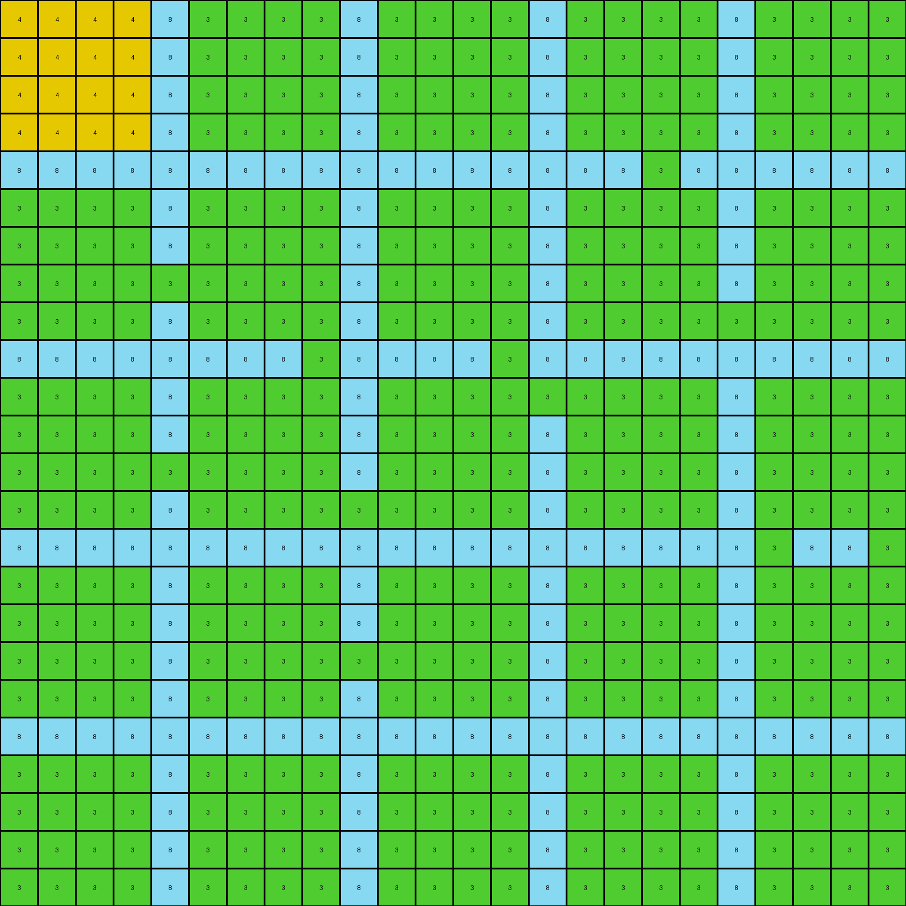
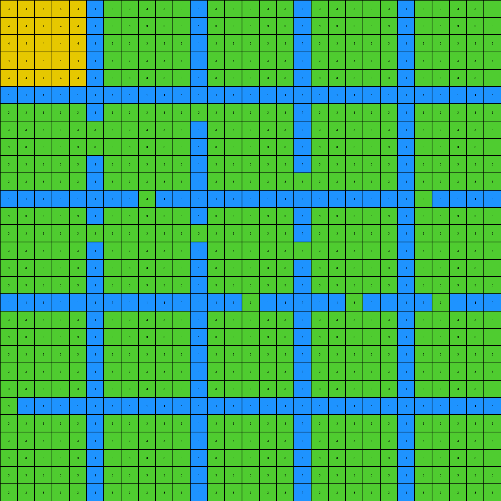
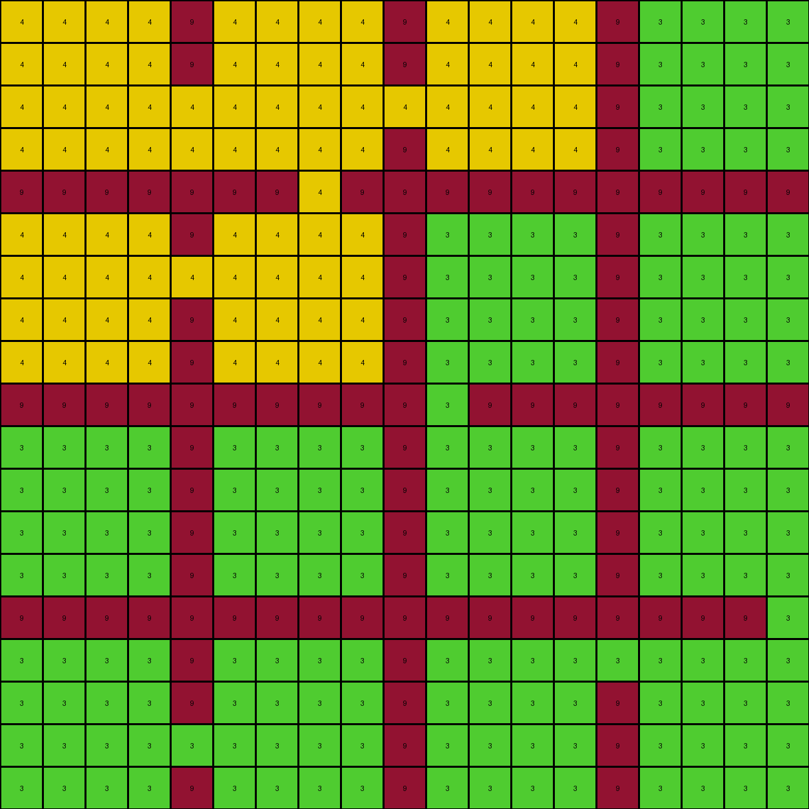

# 83302e8f • 015 • refine_dreamer

---


Previous Code:
```python
"""
The transformation rule is as follows:
1. Identify Maroon Regions: Locate all maroon (9) pixels within the input grid. These pixels remain unchanged.
2. Identify White Regions: Identify contiguous regions of white (0) pixels. Consider pixels connected horizontally, vertically, and diagonally as part of the same region.
3. Conditional Color Change within white connected regions:
    *   The upper-left region of white bounded by maroon is changed to yellow.
    *   The lower-right region of white bounded by maroon is changed to green.
4. Output: Create a new grid with the maroon pixels in their original positions, and the white regions replaced based the regions determined in the previous step.
"""

import numpy as np

def find_contiguous_regions(grid, color):
    """Finds contiguous regions of a given color in the grid."""
    visited = np.zeros_like(grid, dtype=bool)
    regions = []

    def dfs(row, col, current_region):
        """Depth-first search to explore a region."""
        if (
            row < 0
            or row >= grid.shape[0]
            or col < 0
            or col >= grid.shape[1]
            or visited[row, col]
            or grid[row, col] != color
        ):
            return

        visited[row, col] = True
        current_region.append((row, col))

        # Explore adjacent cells (including diagonals)
        for dr in [-1, 0, 1]:
            for dc in [-1, 0, 1]:
                if dr == 0 and dc == 0:
                    continue
                dfs(row + dr, col + dc, current_region)

    for row in range(grid.shape[0]):
        for col in range(grid.shape[1]):
            if grid[row, col] == color and not visited[row, col]:
                current_region = []
                dfs(row, col, current_region)
                regions.append(current_region)

    return regions

def transform(input_grid):
    """Transforms the input grid according to the specified rule."""
    output_grid = np.copy(input_grid)
    
    # Find maroon (9) pixels - these remain unchanged, so done in copy step
    
    # Find white (0) regions
    white_regions = find_contiguous_regions(input_grid, 0)

    # Determine which region is "upper-left" and which is "lower-right"
    # We'll do this by comparing the average row/col of each region.

    if len(white_regions) >= 2:
       
        region_centers = []
        for region in white_regions:
            coords = np.array(region)
            avg_row = np.mean(coords[:, 0])
            avg_col = np.mean(coords[:, 1])
            region_centers.append( (avg_row, avg_col) )

        #find region with the lowest combined row and col values
        upper_left_index = np.argmin( [ sum(center) for center in region_centers ] )

        #change colors by identified region index
        for i, region in enumerate(white_regions):
            new_color = 4 if i == upper_left_index else 3
            for row, col in region:
                output_grid[row, col] = new_color

    return output_grid
```

Train Set Results:

## Example 1:

Input:
```
0 0 0 0 8 0 0 0 0 8 0 0 0 0 8 0 0 0 0 8 0 0 0 0
0 0 0 0 8 0 0 0 0 8 0 0 0 0 8 0 0 0 0 8 0 0 0 0
0 0 0 0 8 0 0 0 0 8 0 0 0 0 8 0 0 0 0 8 0 0 0 0
0 0 0 0 8 0 0 0 0 8 0 0 0 0 8 0 0 0 0 8 0 0 0 0
8 8 8 8 8 8 8 8 8 8 8 8 8 8 8 8 8 0 8 8 8 8 8 8
0 0 0 0 8 0 0 0 0 8 0 0 0 0 8 0 0 0 0 8 0 0 0 0
0 0 0 0 8 0 0 0 0 8 0 0 0 0 8 0 0 0 0 8 0 0 0 0
0 0 0 0 0 0 0 0 0 8 0 0 0 0 8 0 0 0 0 8 0 0 0 0
0 0 0 0 8 0 0 0 0 8 0 0 0 0 8 0 0 0 0 0 0 0 0 0
8 8 8 8 8 8 8 8 0 8 8 8 8 0 8 8 8 8 8 8 8 8 8 8
0 0 0 0 8 0 0 0 0 8 0 0 0 0 0 0 0 0 0 8 0 0 0 0
0 0 0 0 8 0 0 0 0 8 0 0 0 0 8 0 0 0 0 8 0 0 0 0
0 0 0 0 0 0 0 0 0 8 0 0 0 0 8 0 0 0 0 8 0 0 0 0
0 0 0 0 8 0 0 0 0 0 0 0 0 0 8 0 0 0 0 8 0 0 0 0
8 8 8 8 8 8 8 8 8 8 8 8 8 8 8 8 8 8 8 8 0 8 8 0
0 0 0 0 8 0 0 0 0 8 0 0 0 0 8 0 0 0 0 8 0 0 0 0
0 0 0 0 8 0 0 0 0 8 0 0 0 0 8 0 0 0 0 8 0 0 0 0
0 0 0 0 8 0 0 0 0 0 0 0 0 0 8 0 0 0 0 8 0 0 0 0
0 0 0 0 8 0 0 0 0 8 0 0 0 0 8 0 0 0 0 8 0 0 0 0
8 8 8 8 8 8 8 8 8 8 8 8 8 8 8 8 8 8 8 8 8 8 8 8
0 0 0 0 8 0 0 0 0 8 0 0 0 0 8 0 0 0 0 8 0 0 0 0
0 0 0 0 8 0 0 0 0 8 0 0 0 0 8 0 0 0 0 8 0 0 0 0
0 0 0 0 8 0 0 0 0 8 0 0 0 0 8 0 0 0 0 8 0 0 0 0
0 0 0 0 8 0 0 0 0 8 0 0 0 0 8 0 0 0 0 8 0 0 0 0
```
Expected Output:
```
3 3 3 3 8 3 3 3 3 8 3 3 3 3 8 4 4 4 4 8 3 3 3 3
3 3 3 3 8 3 3 3 3 8 3 3 3 3 8 4 4 4 4 8 3 3 3 3
3 3 3 3 8 3 3 3 3 8 3 3 3 3 8 4 4 4 4 8 3 3 3 3
3 3 3 3 8 3 3 3 3 8 3 3 3 3 8 4 4 4 4 8 3 3 3 3
8 8 8 8 8 8 8 8 8 8 8 8 8 8 8 8 8 4 8 8 8 8 8 8
4 4 4 4 8 4 4 4 4 8 4 4 4 4 8 4 4 4 4 8 4 4 4 4
4 4 4 4 8 4 4 4 4 8 4 4 4 4 8 4 4 4 4 8 4 4 4 4
4 4 4 4 4 4 4 4 4 8 4 4 4 4 8 4 4 4 4 8 4 4 4 4
4 4 4 4 8 4 4 4 4 8 4 4 4 4 8 4 4 4 4 4 4 4 4 4
8 8 8 8 8 8 8 8 4 8 8 8 8 4 8 8 8 8 8 8 8 8 8 8
4 4 4 4 8 4 4 4 4 8 4 4 4 4 4 4 4 4 4 8 4 4 4 4
4 4 4 4 8 4 4 4 4 8 4 4 4 4 8 4 4 4 4 8 4 4 4 4
4 4 4 4 4 4 4 4 4 8 4 4 4 4 8 4 4 4 4 8 4 4 4 4
4 4 4 4 8 4 4 4 4 4 4 4 4 4 8 4 4 4 4 8 4 4 4 4
8 8 8 8 8 8 8 8 8 8 8 8 8 8 8 8 8 8 8 8 4 8 8 4
3 3 3 3 8 4 4 4 4 8 4 4 4 4 8 3 3 3 3 8 4 4 4 4
3 3 3 3 8 4 4 4 4 8 4 4 4 4 8 3 3 3 3 8 4 4 4 4
3 3 3 3 8 4 4 4 4 4 4 4 4 4 8 3 3 3 3 8 4 4 4 4
3 3 3 3 8 4 4 4 4 8 4 4 4 4 8 3 3 3 3 8 4 4 4 4
8 8 8 8 8 8 8 8 8 8 8 8 8 8 8 8 8 8 8 8 8 8 8 8
3 3 3 3 8 3 3 3 3 8 3 3 3 3 8 3 3 3 3 8 3 3 3 3
3 3 3 3 8 3 3 3 3 8 3 3 3 3 8 3 3 3 3 8 3 3 3 3
3 3 3 3 8 3 3 3 3 8 3 3 3 3 8 3 3 3 3 8 3 3 3 3
3 3 3 3 8 3 3 3 3 8 3 3 3 3 8 3 3 3 3 8 3 3 3 3
```
Transformed Output:
```
4 4 4 4 8 3 3 3 3 8 3 3 3 3 8 3 3 3 3 8 3 3 3 3
4 4 4 4 8 3 3 3 3 8 3 3 3 3 8 3 3 3 3 8 3 3 3 3
4 4 4 4 8 3 3 3 3 8 3 3 3 3 8 3 3 3 3 8 3 3 3 3
4 4 4 4 8 3 3 3 3 8 3 3 3 3 8 3 3 3 3 8 3 3 3 3
8 8 8 8 8 8 8 8 8 8 8 8 8 8 8 8 8 3 8 8 8 8 8 8
3 3 3 3 8 3 3 3 3 8 3 3 3 3 8 3 3 3 3 8 3 3 3 3
3 3 3 3 8 3 3 3 3 8 3 3 3 3 8 3 3 3 3 8 3 3 3 3
3 3 3 3 3 3 3 3 3 8 3 3 3 3 8 3 3 3 3 8 3 3 3 3
3 3 3 3 8 3 3 3 3 8 3 3 3 3 8 3 3 3 3 3 3 3 3 3
8 8 8 8 8 8 8 8 3 8 8 8 8 3 8 8 8 8 8 8 8 8 8 8
3 3 3 3 8 3 3 3 3 8 3 3 3 3 3 3 3 3 3 8 3 3 3 3
3 3 3 3 8 3 3 3 3 8 3 3 3 3 8 3 3 3 3 8 3 3 3 3
3 3 3 3 3 3 3 3 3 8 3 3 3 3 8 3 3 3 3 8 3 3 3 3
3 3 3 3 8 3 3 3 3 3 3 3 3 3 8 3 3 3 3 8 3 3 3 3
8 8 8 8 8 8 8 8 8 8 8 8 8 8 8 8 8 8 8 8 3 8 8 3
3 3 3 3 8 3 3 3 3 8 3 3 3 3 8 3 3 3 3 8 3 3 3 3
3 3 3 3 8 3 3 3 3 8 3 3 3 3 8 3 3 3 3 8 3 3 3 3
3 3 3 3 8 3 3 3 3 3 3 3 3 3 8 3 3 3 3 8 3 3 3 3
3 3 3 3 8 3 3 3 3 8 3 3 3 3 8 3 3 3 3 8 3 3 3 3
8 8 8 8 8 8 8 8 8 8 8 8 8 8 8 8 8 8 8 8 8 8 8 8
3 3 3 3 8 3 3 3 3 8 3 3 3 3 8 3 3 3 3 8 3 3 3 3
3 3 3 3 8 3 3 3 3 8 3 3 3 3 8 3 3 3 3 8 3 3 3 3
3 3 3 3 8 3 3 3 3 8 3 3 3 3 8 3 3 3 3 8 3 3 3 3
3 3 3 3 8 3 3 3 3 8 3 3 3 3 8 3 3 3 3 8 3 3 3 3
```

match: False
pixels_off: 251
size_correct: True
color_palette_correct: True
correct_pixel_counts: False

## Example 2:

Input:
```
0 0 0 0 0 1 0 0 0 0 0 1 0 0 0 0 0 1 0 0 0 0 0 1 0 0 0 0 0
0 0 0 0 0 1 0 0 0 0 0 1 0 0 0 0 0 1 0 0 0 0 0 1 0 0 0 0 0
0 0 0 0 0 1 0 0 0 0 0 1 0 0 0 0 0 1 0 0 0 0 0 1 0 0 0 0 0
0 0 0 0 0 1 0 0 0 0 0 1 0 0 0 0 0 1 0 0 0 0 0 1 0 0 0 0 0
0 0 0 0 0 1 0 0 0 0 0 1 0 0 0 0 0 1 0 0 0 0 0 1 0 0 0 0 0
1 1 1 1 1 1 1 1 1 1 1 1 1 1 1 1 1 1 1 1 1 1 1 1 1 1 1 1 1
0 0 0 0 0 1 0 0 0 0 0 0 0 0 0 0 0 1 0 0 0 0 0 1 0 0 0 0 0
0 0 0 0 0 0 0 0 0 0 0 1 0 0 0 0 0 1 0 0 0 0 0 1 0 0 0 0 0
0 0 0 0 0 0 0 0 0 0 0 1 0 0 0 0 0 1 0 0 0 0 0 1 0 0 0 0 0
0 0 0 0 0 1 0 0 0 0 0 1 0 0 0 0 0 1 0 0 0 0 0 1 0 0 0 0 0
0 0 0 0 0 1 0 0 0 0 0 1 0 0 0 0 0 0 0 0 0 0 0 1 0 0 0 0 0
1 1 1 1 1 1 1 1 0 1 1 1 1 1 1 1 1 1 1 1 1 1 1 1 0 1 1 1 1
0 0 0 0 0 1 0 0 0 0 0 1 0 0 0 0 0 1 0 0 0 0 0 1 0 0 0 0 0
0 0 0 0 0 0 0 0 0 0 0 0 0 0 0 0 0 1 0 0 0 0 0 1 0 0 0 0 0
0 0 0 0 0 1 0 0 0 0 0 1 0 0 0 0 0 0 0 0 0 0 0 1 0 0 0 0 0
0 0 0 0 0 1 0 0 0 0 0 1 0 0 0 0 0 1 0 0 0 0 0 1 0 0 0 0 0
0 0 0 0 0 1 0 0 0 0 0 1 0 0 0 0 0 1 0 0 0 0 0 1 0 0 0 0 0
1 1 1 1 1 1 1 1 1 1 1 1 1 1 0 1 1 1 1 1 0 1 1 1 1 0 1 1 1
0 0 0 0 0 1 0 0 0 0 0 1 0 0 0 0 0 1 0 0 0 0 0 1 0 0 0 0 0
0 0 0 0 0 1 0 0 0 0 0 1 0 0 0 0 0 1 0 0 0 0 0 1 0 0 0 0 0
0 0 0 0 0 1 0 0 0 0 0 1 0 0 0 0 0 1 0 0 0 0 0 1 0 0 0 0 0
0 0 0 0 0 1 0 0 0 0 0 1 0 0 0 0 0 1 0 0 0 0 0 1 0 0 0 0 0
0 0 0 0 0 1 0 0 0 0 0 1 0 0 0 0 0 1 0 0 0 0 0 1 0 0 0 0 0
0 1 1 1 1 1 1 1 1 1 1 1 1 1 1 1 1 1 1 1 1 1 1 1 1 1 1 1 1
0 0 0 0 0 1 0 0 0 0 0 1 0 0 0 0 0 1 0 0 0 0 0 1 0 0 0 0 0
0 0 0 0 0 1 0 0 0 0 0 1 0 0 0 0 0 1 0 0 0 0 0 1 0 0 0 0 0
0 0 0 0 0 1 0 0 0 0 0 1 0 0 0 0 0 1 0 0 0 0 0 1 0 0 0 0 0
0 0 0 0 0 1 0 0 0 0 0 1 0 0 0 0 0 1 0 0 0 0 0 1 0 0 0 0 0
0 0 0 0 0 1 0 0 0 0 0 1 0 0 0 0 0 1 0 0 0 0 0 1 0 0 0 0 0
```
Expected Output:
```
3 3 3 3 3 1 3 3 3 3 3 1 3 3 3 3 3 1 3 3 3 3 3 1 3 3 3 3 3
3 3 3 3 3 1 3 3 3 3 3 1 3 3 3 3 3 1 3 3 3 3 3 1 3 3 3 3 3
3 3 3 3 3 1 3 3 3 3 3 1 3 3 3 3 3 1 3 3 3 3 3 1 3 3 3 3 3
3 3 3 3 3 1 3 3 3 3 3 1 3 3 3 3 3 1 3 3 3 3 3 1 3 3 3 3 3
3 3 3 3 3 1 3 3 3 3 3 1 3 3 3 3 3 1 3 3 3 3 3 1 3 3 3 3 3
1 1 1 1 1 1 1 1 1 1 1 1 1 1 1 1 1 1 1 1 1 1 1 1 1 1 1 1 1
4 4 4 4 4 1 4 4 4 4 4 4 4 4 4 4 4 1 4 4 4 4 4 1 4 4 4 4 4
4 4 4 4 4 4 4 4 4 4 4 1 4 4 4 4 4 1 4 4 4 4 4 1 4 4 4 4 4
4 4 4 4 4 4 4 4 4 4 4 1 4 4 4 4 4 1 4 4 4 4 4 1 4 4 4 4 4
4 4 4 4 4 1 4 4 4 4 4 1 4 4 4 4 4 1 4 4 4 4 4 1 4 4 4 4 4
4 4 4 4 4 1 4 4 4 4 4 1 4 4 4 4 4 4 4 4 4 4 4 1 4 4 4 4 4
1 1 1 1 1 1 1 1 4 1 1 1 1 1 1 1 1 1 1 1 1 1 1 1 4 1 1 1 1
4 4 4 4 4 1 4 4 4 4 4 1 4 4 4 4 4 1 4 4 4 4 4 1 4 4 4 4 4
4 4 4 4 4 4 4 4 4 4 4 4 4 4 4 4 4 1 4 4 4 4 4 1 4 4 4 4 4
4 4 4 4 4 1 4 4 4 4 4 1 4 4 4 4 4 4 4 4 4 4 4 1 4 4 4 4 4
4 4 4 4 4 1 4 4 4 4 4 1 4 4 4 4 4 1 4 4 4 4 4 1 4 4 4 4 4
4 4 4 4 4 1 4 4 4 4 4 1 4 4 4 4 4 1 4 4 4 4 4 1 4 4 4 4 4
1 1 1 1 1 1 1 1 1 1 1 1 1 1 4 1 1 1 1 1 4 1 1 1 1 4 1 1 1
4 4 4 4 4 1 3 3 3 3 3 1 4 4 4 4 4 1 4 4 4 4 4 1 4 4 4 4 4
4 4 4 4 4 1 3 3 3 3 3 1 4 4 4 4 4 1 4 4 4 4 4 1 4 4 4 4 4
4 4 4 4 4 1 3 3 3 3 3 1 4 4 4 4 4 1 4 4 4 4 4 1 4 4 4 4 4
4 4 4 4 4 1 3 3 3 3 3 1 4 4 4 4 4 1 4 4 4 4 4 1 4 4 4 4 4
4 4 4 4 4 1 3 3 3 3 3 1 4 4 4 4 4 1 4 4 4 4 4 1 4 4 4 4 4
4 1 1 1 1 1 1 1 1 1 1 1 1 1 1 1 1 1 1 1 1 1 1 1 1 1 1 1 1
4 4 4 4 4 1 3 3 3 3 3 1 3 3 3 3 3 1 3 3 3 3 3 1 3 3 3 3 3
4 4 4 4 4 1 3 3 3 3 3 1 3 3 3 3 3 1 3 3 3 3 3 1 3 3 3 3 3
4 4 4 4 4 1 3 3 3 3 3 1 3 3 3 3 3 1 3 3 3 3 3 1 3 3 3 3 3
4 4 4 4 4 1 3 3 3 3 3 1 3 3 3 3 3 1 3 3 3 3 3 1 3 3 3 3 3
4 4 4 4 4 1 3 3 3 3 3 1 3 3 3 3 3 1 3 3 3 3 3 1 3 3 3 3 3
```
Transformed Output:
```
4 4 4 4 4 1 3 3 3 3 3 1 3 3 3 3 3 1 3 3 3 3 3 1 3 3 3 3 3
4 4 4 4 4 1 3 3 3 3 3 1 3 3 3 3 3 1 3 3 3 3 3 1 3 3 3 3 3
4 4 4 4 4 1 3 3 3 3 3 1 3 3 3 3 3 1 3 3 3 3 3 1 3 3 3 3 3
4 4 4 4 4 1 3 3 3 3 3 1 3 3 3 3 3 1 3 3 3 3 3 1 3 3 3 3 3
4 4 4 4 4 1 3 3 3 3 3 1 3 3 3 3 3 1 3 3 3 3 3 1 3 3 3 3 3
1 1 1 1 1 1 1 1 1 1 1 1 1 1 1 1 1 1 1 1 1 1 1 1 1 1 1 1 1
3 3 3 3 3 1 3 3 3 3 3 3 3 3 3 3 3 1 3 3 3 3 3 1 3 3 3 3 3
3 3 3 3 3 3 3 3 3 3 3 1 3 3 3 3 3 1 3 3 3 3 3 1 3 3 3 3 3
3 3 3 3 3 3 3 3 3 3 3 1 3 3 3 3 3 1 3 3 3 3 3 1 3 3 3 3 3
3 3 3 3 3 1 3 3 3 3 3 1 3 3 3 3 3 1 3 3 3 3 3 1 3 3 3 3 3
3 3 3 3 3 1 3 3 3 3 3 1 3 3 3 3 3 3 3 3 3 3 3 1 3 3 3 3 3
1 1 1 1 1 1 1 1 3 1 1 1 1 1 1 1 1 1 1 1 1 1 1 1 3 1 1 1 1
3 3 3 3 3 1 3 3 3 3 3 1 3 3 3 3 3 1 3 3 3 3 3 1 3 3 3 3 3
3 3 3 3 3 3 3 3 3 3 3 3 3 3 3 3 3 1 3 3 3 3 3 1 3 3 3 3 3
3 3 3 3 3 1 3 3 3 3 3 1 3 3 3 3 3 3 3 3 3 3 3 1 3 3 3 3 3
3 3 3 3 3 1 3 3 3 3 3 1 3 3 3 3 3 1 3 3 3 3 3 1 3 3 3 3 3
3 3 3 3 3 1 3 3 3 3 3 1 3 3 3 3 3 1 3 3 3 3 3 1 3 3 3 3 3
1 1 1 1 1 1 1 1 1 1 1 1 1 1 3 1 1 1 1 1 3 1 1 1 1 3 1 1 1
3 3 3 3 3 1 3 3 3 3 3 1 3 3 3 3 3 1 3 3 3 3 3 1 3 3 3 3 3
3 3 3 3 3 1 3 3 3 3 3 1 3 3 3 3 3 1 3 3 3 3 3 1 3 3 3 3 3
3 3 3 3 3 1 3 3 3 3 3 1 3 3 3 3 3 1 3 3 3 3 3 1 3 3 3 3 3
3 3 3 3 3 1 3 3 3 3 3 1 3 3 3 3 3 1 3 3 3 3 3 1 3 3 3 3 3
3 3 3 3 3 1 3 3 3 3 3 1 3 3 3 3 3 1 3 3 3 3 3 1 3 3 3 3 3
3 1 1 1 1 1 1 1 1 1 1 1 1 1 1 1 1 1 1 1 1 1 1 1 1 1 1 1 1
3 3 3 3 3 1 3 3 3 3 3 1 3 3 3 3 3 1 3 3 3 3 3 1 3 3 3 3 3
3 3 3 3 3 1 3 3 3 3 3 1 3 3 3 3 3 1 3 3 3 3 3 1 3 3 3 3 3
3 3 3 3 3 1 3 3 3 3 3 1 3 3 3 3 3 1 3 3 3 3 3 1 3 3 3 3 3
3 3 3 3 3 1 3 3 3 3 3 1 3 3 3 3 3 1 3 3 3 3 3 1 3 3 3 3 3
3 3 3 3 3 1 3 3 3 3 3 1 3 3 3 3 3 1 3 3 3 3 3 1 3 3 3 3 3
```

match: False
pixels_off: 413
size_correct: True
color_palette_correct: True
correct_pixel_counts: False

## Example 3:

Input:
```
0 0 0 0 9 0 0 0 0 9 0 0 0 0 9 0 0 0 0
0 0 0 0 9 0 0 0 0 9 0 0 0 0 9 0 0 0 0
0 0 0 0 0 0 0 0 0 0 0 0 0 0 9 0 0 0 0
0 0 0 0 0 0 0 0 0 9 0 0 0 0 9 0 0 0 0
9 9 9 9 9 9 9 0 9 9 9 9 9 9 9 9 9 9 9
0 0 0 0 9 0 0 0 0 9 0 0 0 0 9 0 0 0 0
0 0 0 0 0 0 0 0 0 9 0 0 0 0 9 0 0 0 0
0 0 0 0 9 0 0 0 0 9 0 0 0 0 9 0 0 0 0
0 0 0 0 9 0 0 0 0 9 0 0 0 0 9 0 0 0 0
9 9 9 9 9 9 9 9 9 9 0 9 9 9 9 9 9 9 9
0 0 0 0 9 0 0 0 0 9 0 0 0 0 9 0 0 0 0
0 0 0 0 9 0 0 0 0 9 0 0 0 0 9 0 0 0 0
0 0 0 0 9 0 0 0 0 9 0 0 0 0 9 0 0 0 0
0 0 0 0 9 0 0 0 0 9 0 0 0 0 9 0 0 0 0
9 9 9 9 9 9 9 9 9 9 9 9 9 9 9 9 9 9 0
0 0 0 0 9 0 0 0 0 9 0 0 0 0 0 0 0 0 0
0 0 0 0 9 0 0 0 0 9 0 0 0 0 9 0 0 0 0
0 0 0 0 0 0 0 0 0 9 0 0 0 0 9 0 0 0 0
0 0 0 0 9 0 0 0 0 9 0 0 0 0 9 0 0 0 0
```
Expected Output:
```
4 4 4 4 9 4 4 4 4 9 4 4 4 4 9 3 3 3 3
4 4 4 4 9 4 4 4 4 9 4 4 4 4 9 3 3 3 3
4 4 4 4 4 4 4 4 4 4 4 4 4 4 9 3 3 3 3
4 4 4 4 4 4 4 4 4 9 4 4 4 4 9 3 3 3 3
9 9 9 9 9 9 9 4 9 9 9 9 9 9 9 9 9 9 9
4 4 4 4 9 4 4 4 4 9 4 4 4 4 9 3 3 3 3
4 4 4 4 4 4 4 4 4 9 4 4 4 4 9 3 3 3 3
4 4 4 4 9 4 4 4 4 9 4 4 4 4 9 3 3 3 3
4 4 4 4 9 4 4 4 4 9 4 4 4 4 9 3 3 3 3
9 9 9 9 9 9 9 9 9 9 4 9 9 9 9 9 9 9 9
3 3 3 3 9 3 3 3 3 9 4 4 4 4 9 4 4 4 4
3 3 3 3 9 3 3 3 3 9 4 4 4 4 9 4 4 4 4
3 3 3 3 9 3 3 3 3 9 4 4 4 4 9 4 4 4 4
3 3 3 3 9 3 3 3 3 9 4 4 4 4 9 4 4 4 4
9 9 9 9 9 9 9 9 9 9 9 9 9 9 9 9 9 9 4
4 4 4 4 9 4 4 4 4 9 4 4 4 4 4 4 4 4 4
4 4 4 4 9 4 4 4 4 9 4 4 4 4 9 4 4 4 4
4 4 4 4 4 4 4 4 4 9 4 4 4 4 9 4 4 4 4
4 4 4 4 9 4 4 4 4 9 4 4 4 4 9 4 4 4 4
```
Transformed Output:
```
4 4 4 4 9 4 4 4 4 9 4 4 4 4 9 3 3 3 3
4 4 4 4 9 4 4 4 4 9 4 4 4 4 9 3 3 3 3
4 4 4 4 4 4 4 4 4 4 4 4 4 4 9 3 3 3 3
4 4 4 4 4 4 4 4 4 9 4 4 4 4 9 3 3 3 3
9 9 9 9 9 9 9 4 9 9 9 9 9 9 9 9 9 9 9
4 4 4 4 9 4 4 4 4 9 3 3 3 3 9 3 3 3 3
4 4 4 4 4 4 4 4 4 9 3 3 3 3 9 3 3 3 3
4 4 4 4 9 4 4 4 4 9 3 3 3 3 9 3 3 3 3
4 4 4 4 9 4 4 4 4 9 3 3 3 3 9 3 3 3 3
9 9 9 9 9 9 9 9 9 9 3 9 9 9 9 9 9 9 9
3 3 3 3 9 3 3 3 3 9 3 3 3 3 9 3 3 3 3
3 3 3 3 9 3 3 3 3 9 3 3 3 3 9 3 3 3 3
3 3 3 3 9 3 3 3 3 9 3 3 3 3 9 3 3 3 3
3 3 3 3 9 3 3 3 3 9 3 3 3 3 9 3 3 3 3
9 9 9 9 9 9 9 9 9 9 9 9 9 9 9 9 9 9 3
3 3 3 3 9 3 3 3 3 9 3 3 3 3 3 3 3 3 3
3 3 3 3 9 3 3 3 3 9 3 3 3 3 9 3 3 3 3
3 3 3 3 3 3 3 3 3 9 3 3 3 3 9 3 3 3 3
3 3 3 3 9 3 3 3 3 9 3 3 3 3 9 3 3 3 3
```

match: False
pixels_off: 116
size_correct: True
color_palette_correct: True
correct_pixel_counts: False

**INSTRUCTIONS**

The code above was generated based on observations from the first training
example

we have tested the transform function on each of the task example inputs and
compared with the expected output

review each of the examples provided and the results and consider how the
natural language program should be updated to accommodate this new knowledge

respond with the following deliverables:

- general assessment of the information provided and strategy for resolving the
  errors
- gather metrics about each of the examples and results - use code_execution to
  develop accurate reports on your assumptions
- a YAML block documenting facts - Focus on identifying objects, their properties, and the actions performed on them.
- a natural language program - Be as clear and concise as possible, providing a complete description of the transformation rule.


your responses should be considered as information in a report - not a
conversation
