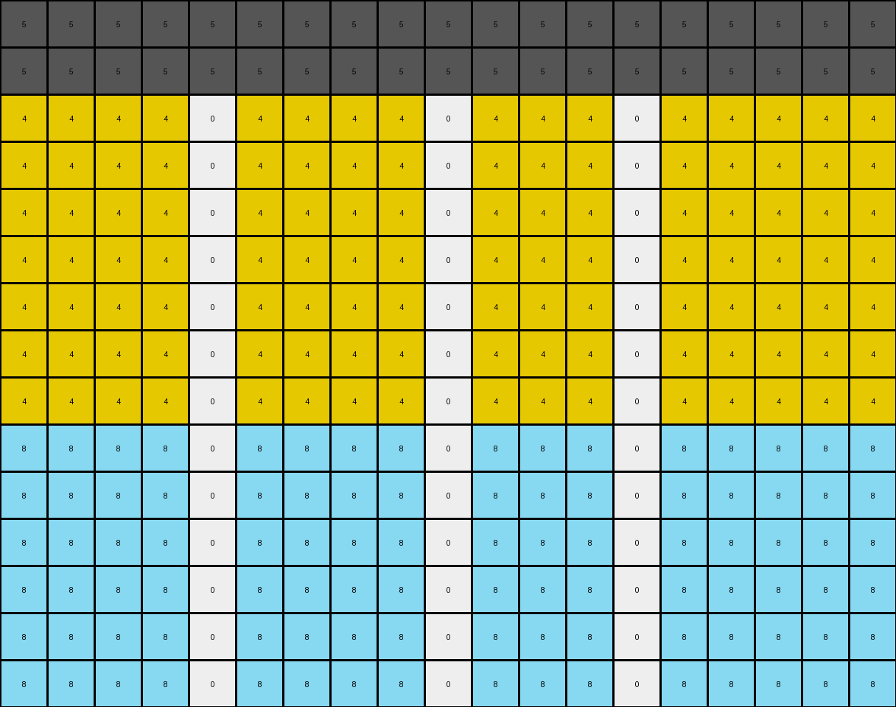
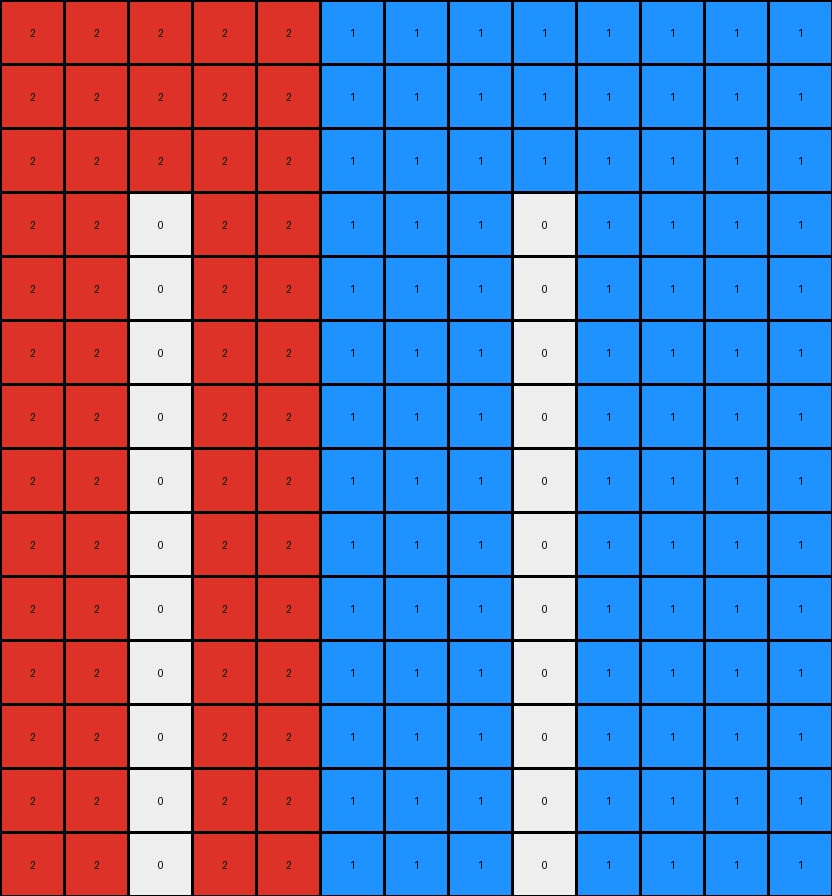

# 855e0971 • 006 • refine_coder

---

Previous Code:
```python
"""
1.  **Identify Bands:** Divide the input grid into horizontal bands based on color changes. The number of bands and their colors can vary.

2.  **Find White Pixel Columns:** Iterate through all rows *except* those belonging to the top band (which often remains unchanged, though its color isn't consistently grey). For each row, identify the *columns* that contain white (0) pixels.

3.  **Replicate in Non-Top Bands:** For *every* row that is *not* in the top band, set the pixel to white (0) in *all* columns identified in step 2.

4.  **Assemble Output:** Combine all rows. The final output will consist of the (potentially unchanged) top band, followed by the modified lower bands where the white pixels have been replicated downwards within their respective column across all non-grey band rows.
"""

import numpy as np

def transform(input_grid):
    # Initialize output grid as a copy of the input
    output_grid = np.copy(input_grid)
    
    # 1. Identify Bands (implicitly done by iterating rows)
    
    # 2. Find White Pixel Columns (in non-top bands)
    white_pixel_columns = set()
    for r in range(input_grid.shape[0]):
        for c in range(input_grid.shape[1]):
            if input_grid[r, c] == 0:
                white_pixel_columns.add(c)

    # Find the first band
    first_band_end_row = 0
    for i in range(1, input_grid.shape[0]):
        if not np.array_equal(input_grid[i], input_grid[0]):
            first_band_end_row = i
            break
    else: #the entire input grid is a single band
        first_band_end_row = input_grid.shape[0]
    
    # 3. Replicate in Non-Top Bands
    for r in range(first_band_end_row, output_grid.shape[0]):
        for c in white_pixel_columns:
            output_grid[r, c] = 0
            
    #Special Case: If the entire input grid is one band, and we have any white pixels.
    if first_band_end_row == input_grid.shape[0] and len(white_pixel_columns) > 0:
        for r in range(input_grid.shape[0]):
            for c in white_pixel_columns:
               if input_grid[r,c] != 0:
                   first_non_white_row = r
                   break
            else:
               continue
            break
        for r in range(first_non_white_row, output_grid.shape[0]):
            for c in white_pixel_columns:
                output_grid[r,c] = 0

    return output_grid
```

Train Set Results:

## Example 1:

Input:
```
5 5 5 5 5 5 5 5 5 5 5 5 5 5 5 5 5 5 5
5 5 5 5 5 5 5 5 5 5 5 5 5 5 5 5 5 5 5
4 4 4 4 4 4 4 4 4 4 4 4 4 4 4 4 4 4 4
4 4 4 4 4 4 4 4 4 4 4 4 4 0 4 4 4 4 4
4 4 4 4 4 4 4 4 4 4 4 4 4 4 4 4 4 4 4
4 4 4 4 0 4 4 4 4 4 4 4 4 4 4 4 4 4 4
4 4 4 4 4 4 4 4 4 4 4 4 4 4 4 4 4 4 4
4 4 4 4 4 4 4 4 4 4 4 4 4 4 4 4 4 4 4
4 4 4 4 4 4 4 4 4 4 4 4 4 4 4 4 4 4 4
8 8 8 8 8 8 8 8 8 8 8 8 8 8 8 8 8 8 8
8 8 8 8 8 8 8 8 8 8 8 8 8 8 8 8 8 8 8
8 8 8 8 8 8 8 8 8 8 8 8 8 8 8 8 8 8 8
8 8 8 8 8 8 8 8 8 0 8 8 8 8 8 8 8 8 8
8 8 8 8 8 8 8 8 8 8 8 8 8 8 8 8 8 8 8
8 8 8 8 8 8 8 8 8 8 8 8 8 8 8 8 8 8 8
```
Expected Output:
```
5 5 5 5 5 5 5 5 5 5 5 5 5 5 5 5 5 5 5
5 5 5 5 5 5 5 5 5 5 5 5 5 5 5 5 5 5 5
4 4 4 4 0 4 4 4 4 4 4 4 4 0 4 4 4 4 4
4 4 4 4 0 4 4 4 4 4 4 4 4 0 4 4 4 4 4
4 4 4 4 0 4 4 4 4 4 4 4 4 0 4 4 4 4 4
4 4 4 4 0 4 4 4 4 4 4 4 4 0 4 4 4 4 4
4 4 4 4 0 4 4 4 4 4 4 4 4 0 4 4 4 4 4
4 4 4 4 0 4 4 4 4 4 4 4 4 0 4 4 4 4 4
4 4 4 4 0 4 4 4 4 4 4 4 4 0 4 4 4 4 4
8 8 8 8 8 8 8 8 8 0 8 8 8 8 8 8 8 8 8
8 8 8 8 8 8 8 8 8 0 8 8 8 8 8 8 8 8 8
8 8 8 8 8 8 8 8 8 0 8 8 8 8 8 8 8 8 8
8 8 8 8 8 8 8 8 8 0 8 8 8 8 8 8 8 8 8
8 8 8 8 8 8 8 8 8 0 8 8 8 8 8 8 8 8 8
8 8 8 8 8 8 8 8 8 0 8 8 8 8 8 8 8 8 8
```
Transformed Output:
```
5 5 5 5 5 5 5 5 5 5 5 5 5 5 5 5 5 5 5
5 5 5 5 5 5 5 5 5 5 5 5 5 5 5 5 5 5 5
4 4 4 4 0 4 4 4 4 0 4 4 4 0 4 4 4 4 4
4 4 4 4 0 4 4 4 4 0 4 4 4 0 4 4 4 4 4
4 4 4 4 0 4 4 4 4 0 4 4 4 0 4 4 4 4 4
4 4 4 4 0 4 4 4 4 0 4 4 4 0 4 4 4 4 4
4 4 4 4 0 4 4 4 4 0 4 4 4 0 4 4 4 4 4
4 4 4 4 0 4 4 4 4 0 4 4 4 0 4 4 4 4 4
4 4 4 4 0 4 4 4 4 0 4 4 4 0 4 4 4 4 4
8 8 8 8 0 8 8 8 8 0 8 8 8 0 8 8 8 8 8
8 8 8 8 0 8 8 8 8 0 8 8 8 0 8 8 8 8 8
8 8 8 8 0 8 8 8 8 0 8 8 8 0 8 8 8 8 8
8 8 8 8 0 8 8 8 8 0 8 8 8 0 8 8 8 8 8
8 8 8 8 0 8 8 8 8 0 8 8 8 0 8 8 8 8 8
8 8 8 8 0 8 8 8 8 0 8 8 8 0 8 8 8 8 8
```

match: False
pixels_off: 19
size_correct: True
color_palette_correct: True
correct_pixel_counts: False

## Example 2:

Input:
```
2 2 2 2 2 1 1 1 1 1 1 1 1
2 2 2 2 2 1 1 1 1 1 1 1 1
2 2 2 2 2 1 1 1 1 1 1 1 1
2 2 0 2 2 1 1 1 1 1 1 1 1
2 2 2 2 2 1 1 1 1 1 1 1 1
2 2 2 2 2 1 1 1 1 1 1 1 1
2 2 2 2 2 1 1 1 1 1 1 1 1
2 2 2 2 2 1 1 1 1 1 1 1 1
2 2 2 2 2 1 1 1 1 1 1 1 1
2 2 2 2 2 1 1 1 1 1 1 1 1
2 2 2 2 2 1 1 1 1 1 1 1 1
2 2 2 2 2 1 1 1 0 1 1 1 1
2 2 2 2 2 1 1 1 1 1 1 1 1
2 2 2 2 2 1 1 1 1 1 1 1 1
```
Expected Output:
```
2 2 2 2 2 1 1 1 1 1 1 1 1
2 2 2 2 2 1 1 1 1 1 1 1 1
2 2 2 2 2 1 1 1 1 1 1 1 1
0 0 0 0 0 1 1 1 1 1 1 1 1
2 2 2 2 2 1 1 1 1 1 1 1 1
2 2 2 2 2 1 1 1 1 1 1 1 1
2 2 2 2 2 1 1 1 1 1 1 1 1
2 2 2 2 2 1 1 1 1 1 1 1 1
2 2 2 2 2 1 1 1 1 1 1 1 1
2 2 2 2 2 1 1 1 1 1 1 1 1
2 2 2 2 2 1 1 1 1 1 1 1 1
2 2 2 2 2 0 0 0 0 0 0 0 0
2 2 2 2 2 1 1 1 1 1 1 1 1
2 2 2 2 2 1 1 1 1 1 1 1 1
```
Transformed Output:
```
2 2 2 2 2 1 1 1 1 1 1 1 1
2 2 2 2 2 1 1 1 1 1 1 1 1
2 2 2 2 2 1 1 1 1 1 1 1 1
2 2 0 2 2 1 1 1 0 1 1 1 1
2 2 0 2 2 1 1 1 0 1 1 1 1
2 2 0 2 2 1 1 1 0 1 1 1 1
2 2 0 2 2 1 1 1 0 1 1 1 1
2 2 0 2 2 1 1 1 0 1 1 1 1
2 2 0 2 2 1 1 1 0 1 1 1 1
2 2 0 2 2 1 1 1 0 1 1 1 1
2 2 0 2 2 1 1 1 0 1 1 1 1
2 2 0 2 2 1 1 1 0 1 1 1 1
2 2 0 2 2 1 1 1 0 1 1 1 1
2 2 0 2 2 1 1 1 0 1 1 1 1
```

match: False
pixels_off: 31
size_correct: True
color_palette_correct: True
correct_pixel_counts: False

## Example 3:

Input:
```
8 8 8 8 8 8 8 8 8 8 8 8 8 8 8
8 8 8 8 8 8 8 8 8 8 8 8 8 8 8
8 8 8 0 8 8 8 8 8 8 8 8 8 8 8
8 8 8 8 8 8 8 8 8 8 8 0 8 8 8
8 8 8 8 8 8 8 8 8 8 8 8 8 8 8
2 2 2 2 2 2 2 2 2 2 2 2 2 2 2
2 2 2 2 2 2 2 2 2 2 2 2 2 2 2
2 2 2 2 2 0 2 2 2 2 2 2 2 2 2
2 2 2 2 2 2 2 2 2 2 2 2 2 2 2
2 2 2 2 2 2 2 2 2 2 2 2 2 2 2
3 3 3 3 3 3 3 3 3 3 3 3 3 3 3
3 3 3 3 3 3 3 0 3 3 3 3 3 3 3
3 3 3 3 3 3 3 3 3 3 3 3 3 3 3
```
Expected Output:
```
8 8 8 0 8 8 8 8 8 8 8 0 8 8 8
8 8 8 0 8 8 8 8 8 8 8 0 8 8 8
8 8 8 0 8 8 8 8 8 8 8 0 8 8 8
8 8 8 0 8 8 8 8 8 8 8 0 8 8 8
8 8 8 0 8 8 8 8 8 8 8 0 8 8 8
2 2 2 2 2 0 2 2 2 2 2 2 2 2 2
2 2 2 2 2 0 2 2 2 2 2 2 2 2 2
2 2 2 2 2 0 2 2 2 2 2 2 2 2 2
2 2 2 2 2 0 2 2 2 2 2 2 2 2 2
2 2 2 2 2 0 2 2 2 2 2 2 2 2 2
3 3 3 3 3 3 3 0 3 3 3 3 3 3 3
3 3 3 3 3 3 3 0 3 3 3 3 3 3 3
3 3 3 3 3 3 3 0 3 3 3 3 3 3 3
```
Transformed Output:
```
8 8 8 8 8 8 8 8 8 8 8 8 8 8 8
8 8 8 8 8 8 8 8 8 8 8 8 8 8 8
8 8 8 0 8 0 8 0 8 8 8 0 8 8 8
8 8 8 0 8 0 8 0 8 8 8 0 8 8 8
8 8 8 0 8 0 8 0 8 8 8 0 8 8 8
2 2 2 0 2 0 2 0 2 2 2 0 2 2 2
2 2 2 0 2 0 2 0 2 2 2 0 2 2 2
2 2 2 0 2 0 2 0 2 2 2 0 2 2 2
2 2 2 0 2 0 2 0 2 2 2 0 2 2 2
2 2 2 0 2 0 2 0 2 2 2 0 2 2 2
3 3 3 0 3 0 3 0 3 3 3 0 3 3 3
3 3 3 0 3 0 3 0 3 3 3 0 3 3 3
3 3 3 0 3 0 3 0 3 3 3 0 3 3 3
```

match: False
pixels_off: 34
size_correct: True
color_palette_correct: True
correct_pixel_counts: False

## Example 4:

Input:
```
2 2 2 2 5 5 5 5 5 4 4 4 4 4 4
2 2 2 2 5 5 5 5 5 4 4 4 4 4 4
2 2 2 2 5 5 5 5 5 4 4 4 0 4 4
2 2 2 2 5 5 5 5 5 4 4 4 4 4 4
2 2 2 2 5 5 5 5 5 4 4 4 4 4 4
2 2 2 2 5 5 5 5 5 4 4 4 4 4 4
2 2 2 2 5 5 0 5 5 4 4 4 4 4 4
2 2 2 2 5 5 5 5 5 4 4 4 4 4 4
2 2 2 2 5 5 5 5 5 4 4 4 4 4 4
2 2 2 2 5 5 5 5 5 4 4 4 4 4 4
2 2 2 2 5 5 5 5 5 4 4 4 4 4 4
2 2 2 2 5 5 5 5 5 4 4 4 4 4 4
2 2 2 2 5 5 5 5 5 4 0 4 4 4 4
2 2 2 2 5 5 5 5 5 4 4 4 4 4 4
```
Expected Output:
```
2 2 2 2 5 5 5 5 5 4 4 4 4 4 4
2 2 2 2 5 5 5 5 5 4 4 4 4 4 4
2 2 2 2 5 5 5 5 5 0 0 0 0 0 0
2 2 2 2 5 5 5 5 5 4 4 4 4 4 4
2 2 2 2 5 5 5 5 5 4 4 4 4 4 4
2 2 2 2 5 5 5 5 5 4 4 4 4 4 4
2 2 2 2 0 0 0 0 0 4 4 4 4 4 4
2 2 2 2 5 5 5 5 5 4 4 4 4 4 4
2 2 2 2 5 5 5 5 5 4 4 4 4 4 4
2 2 2 2 5 5 5 5 5 4 4 4 4 4 4
2 2 2 2 5 5 5 5 5 4 4 4 4 4 4
2 2 2 2 5 5 5 5 5 4 4 4 4 4 4
2 2 2 2 5 5 5 5 5 0 0 0 0 0 0
2 2 2 2 5 5 5 5 5 4 4 4 4 4 4
```
Transformed Output:
```
2 2 2 2 5 5 5 5 5 4 4 4 4 4 4
2 2 2 2 5 5 5 5 5 4 4 4 4 4 4
2 2 2 2 5 5 0 5 5 4 0 4 0 4 4
2 2 2 2 5 5 0 5 5 4 0 4 0 4 4
2 2 2 2 5 5 0 5 5 4 0 4 0 4 4
2 2 2 2 5 5 0 5 5 4 0 4 0 4 4
2 2 2 2 5 5 0 5 5 4 0 4 0 4 4
2 2 2 2 5 5 0 5 5 4 0 4 0 4 4
2 2 2 2 5 5 0 5 5 4 0 4 0 4 4
2 2 2 2 5 5 0 5 5 4 0 4 0 4 4
2 2 2 2 5 5 0 5 5 4 0 4 0 4 4
2 2 2 2 5 5 0 5 5 4 0 4 0 4 4
2 2 2 2 5 5 0 5 5 4 0 4 0 4 4
2 2 2 2 5 5 0 5 5 4 0 4 0 4 4
```

match: False
pixels_off: 43
size_correct: True
color_palette_correct: True
correct_pixel_counts: False
Here's an analysis of the provided examples and an updated natural language program:

**General Assessment:**

The initial program correctly identified the core concept: replicating white pixels downwards within bands. However, it made several incorrect assumptions, leading to errors:

1.  **Incorrect White Pixel Propagation:** The original logic propagated *all* white pixels downwards from *anywhere* in the non-top bands. The examples show that white pixels propagate downwards, *starting from the first row of the non-top band and continuing to the end of each band*. It's not about propagating *all* white pixels, but creating columns of white pixels *within* each band *based on white pixels found in the first row of each non-top band*.
2.  **Incorrect Band Handling and Edge Cases**: The band handling has some edge cases when the first band occupies the entire grid, also the logic for example 4 is incorrect.

**Strategy for Resolving Errors:**

1.  **Refine Band Identification:** The current band identification is sufficient. We will keep it as it is.
2.  **Precise White Pixel Propagation:** Modify the white pixel propagation logic. Instead of adding all white pixel columns, only identify the white pixels within the *first row of each non-top band*. Then, propagate *those* white pixels downwards *within their respective bands.*
3. Handle Edge Cases. The special case code appears correct, we will keep it for now.

**Metrics and Observations (per example):**

*Example 1:*

*   **Pixels Off:** 19
*   **Size Correct:** True
*   **Color Palette Correct:** True
*   **Correct Pixel Counts:** False
*   **Observations:** The program incorrectly propagated a white pixel in the first band (column 9). It also missed propagating white pixels in column 4 in band 2. It correctly didn't propagate in column 14.
*   **Assumptions Challenged:** The initial assumption that all white pixels in the grid are propagated needs to be restricted to just those white pixels that are present on the first row of the non-top bands.

*Example 2:*

*   **Pixels Off:** 31
*   **Size Correct:** True
*   **Color Palette Correct:** True
*   **Correct Pixel Counts:** False
*   **Observations:** Incorrect propagation in the first band (column 9). Also incorrect placement and propagation for white pixels in band 2.
*   **Assumptions Challenged:** White pixels are propagated only vertically downwards, from the first row, within their own bands.

*Example 3:*

*    **Pixels Off:** 34
*   **Size Correct:** True
*   **Color Palette Correct:** True
*   **Correct Pixel Counts:** False
*   **Observations:** Incorrect propagation in the first band. Incorrect placement of white columns within bands.
*   **Assumptions Challenged:** Bands are handled independently. Top band *can* have propagation, if it is the only band.

*Example 4:*

*    **Pixels Off:** 43
*   **Size Correct:** True
*   **Color Palette Correct:** True
*   **Correct Pixel Counts:** False
*   **Observations:** Incorrect propagation in first band (column 11). It also did not identify the white pixels in the *beginning* of the second band (column 7).
*   **Assumptions Challenged:** Only white pixels in the *first row* of each non-top band should initiate propagation.

**YAML Facts:**

```yaml
objects:
  - name: grid
    type: 2D array
    properties:
      rows: variable
      columns: variable
      cells: integers (0-9 representing colors)
  - name: band
    type: contiguous_rows
    properties:
      start_row: integer
      end_row: integer
      color_pattern: list of integers
  - name: white_pixel_column
    type: column_index
    properties:
      column_index: integer

actions:
  - name: identify_bands
    input: grid
    output: list of bands
    description: Divide the grid into horizontal bands based on color changes.
  - name: find_white_pixels_in_first_row_of_band
    input: band
    output: list of white_pixel_column
    description: Find columns containing white pixels in the first row of each non-top band.
  - name: propagate_white_pixels
    input: band, list of white_pixel_column
    output: modified band
    description: Set pixels in specified columns to white, starting from the first row of each non-top band, and continue to the end of each band.
```

**Natural Language Program:**

1.  **Identify Bands:** Divide the input grid into horizontal bands.  A band is a set of one or more contiguous rows that have identical color patterns. The first band is from row 0 to the first row that differs. Subsequent bands continue from the end of the previous band.
2.  **Find Propagation Starting Points:** For each band (except the first band), identify the *columns* that have white pixels (value 0) in the *first row* of that band.
3.  **Propagate White Pixels Downward:** For each band (except the first band) set the pixel in each column identified in step 2 to white (0) for all rows within that band.
4.  **Handle Single Band Case:** If the input grid consists of only a single band (spans entire height), then find any white pixels (value 0). If any white pixels exist, get the location of the *first row* where any non-white pixel exists, then set the values of all pixels in these column indices to 0, starting *from that row* down to the end of the grid.
5.  **Assemble Output:** Combine all (modified or unmodified) bands to create the output grid.

**INSTRUCTIONS**

- generate a Python module to represent the natural language program 
- follow the template below
- all common math and science libraries are available
- create docstring only at top - but comment the workflow in the function
- use helper functions for common operations like finding objects, counting,
  measuring, moving, etc. 

remember - we are working iteratively - so this code will inform your future
self as we converge on the solution

*template:*

```python
"""
{{ natural language description of the transformation rule }}
"""

{{ imports }}

def transform(input_grid):
    # initialize output_grid

    # change output pixels 

    return output_grid

```
