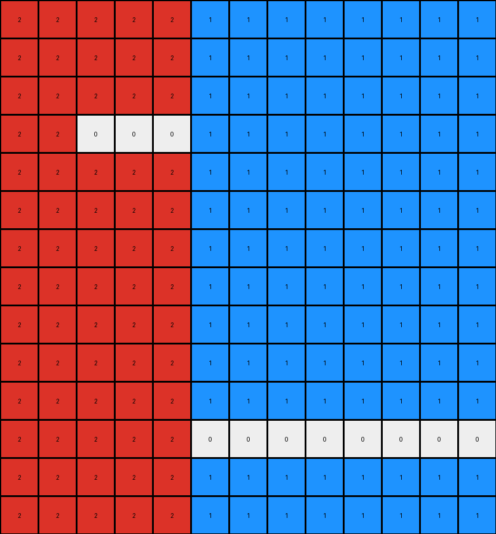
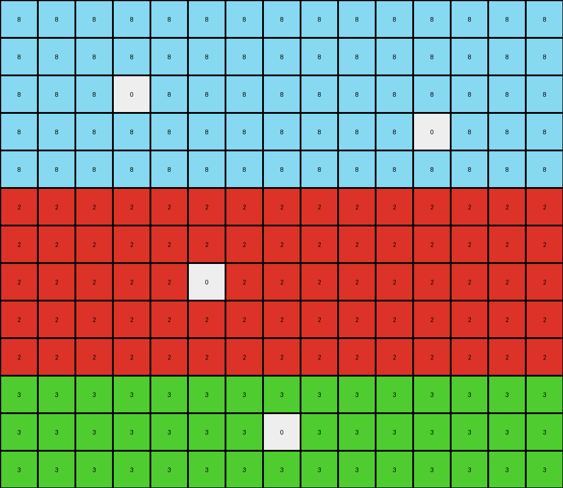
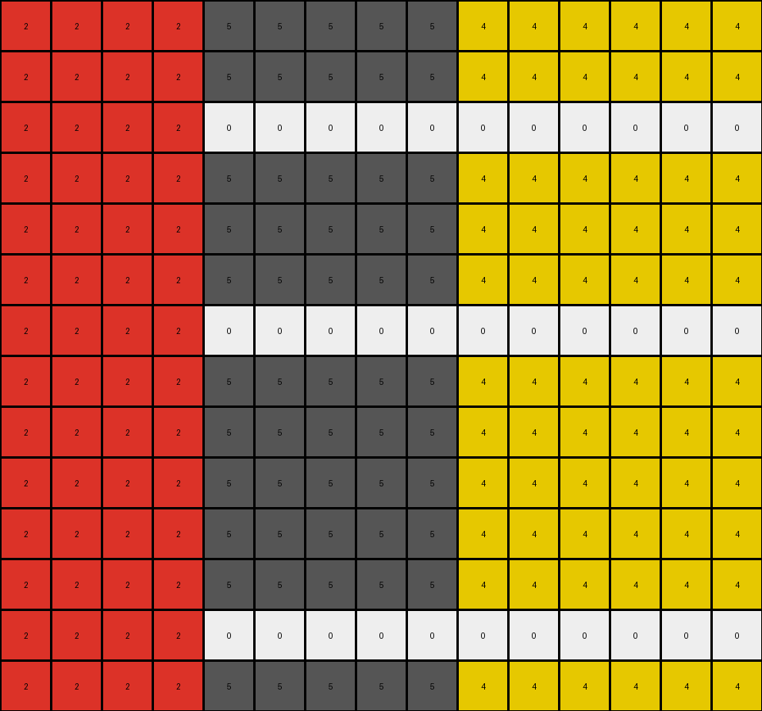

# 855e0971 • 009 • refine_dreamer

---

Previous Code:
```python
"""
The grid is divided into two regions: red (left) and blue (right). White pixels within each region cause a color change within that region.  If a white pixel is in the red region, it and all red pixels to its right become white. If a white pixel is in the blue region, it and all blue pixels to its left become white.
"""

import numpy as np

def get_regions(grid):
    #find the column where the color changes
    for col in range(grid.shape[1] - 1):
        if grid[0, col] != grid[0, col + 1]:
            boundary_col = col + 1
            break
    else:  # No boundary found (all one color)
        return None, None

    left_region = (0, 0, boundary_col, grid.shape[0]) #x_start, y_start, width, height
    right_region = (boundary_col, 0, grid.shape[1] - boundary_col, grid.shape[0])
    return left_region, right_region

def get_white_pixels(grid):
    # return a list of (row, col) of white pixels
    white_pixels = []
    for row in range(grid.shape[0]):
        for col in range(grid.shape[1]):
            if grid[row,col] == 0:
                white_pixels.append((row,col))
    return white_pixels

def transform(input_grid):
    output_grid = np.copy(input_grid)
    left_region, right_region = get_regions(input_grid)
    white_pixels = get_white_pixels(input_grid)

    #get region color
    if left_region:
        left_color = input_grid[left_region[1], left_region[0]] # y, x
    if right_region:
      right_color = input_grid[right_region[1], right_region[0]]

    for row, col in white_pixels:
        if left_region and col < left_region[2]: # in left region
            for c in range(col, left_region[2]):
                output_grid[row, c] = 0  # Set to white
        elif right_region and col >= right_region[0]: # x_start
            for c in range(right_region[0], input_grid.shape[1]): #in right region
                output_grid[row,c] = 0 #set to white
    return output_grid
```

Train Set Results:

## Example 1:

Input:
```
5 5 5 5 5 5 5 5 5 5 5 5 5 5 5 5 5 5 5
5 5 5 5 5 5 5 5 5 5 5 5 5 5 5 5 5 5 5
4 4 4 4 4 4 4 4 4 4 4 4 4 4 4 4 4 4 4
4 4 4 4 4 4 4 4 4 4 4 4 4 0 4 4 4 4 4
4 4 4 4 4 4 4 4 4 4 4 4 4 4 4 4 4 4 4
4 4 4 4 0 4 4 4 4 4 4 4 4 4 4 4 4 4 4
4 4 4 4 4 4 4 4 4 4 4 4 4 4 4 4 4 4 4
4 4 4 4 4 4 4 4 4 4 4 4 4 4 4 4 4 4 4
4 4 4 4 4 4 4 4 4 4 4 4 4 4 4 4 4 4 4
8 8 8 8 8 8 8 8 8 8 8 8 8 8 8 8 8 8 8
8 8 8 8 8 8 8 8 8 8 8 8 8 8 8 8 8 8 8
8 8 8 8 8 8 8 8 8 8 8 8 8 8 8 8 8 8 8
8 8 8 8 8 8 8 8 8 0 8 8 8 8 8 8 8 8 8
8 8 8 8 8 8 8 8 8 8 8 8 8 8 8 8 8 8 8
8 8 8 8 8 8 8 8 8 8 8 8 8 8 8 8 8 8 8
```
Expected Output:
```
5 5 5 5 5 5 5 5 5 5 5 5 5 5 5 5 5 5 5
5 5 5 5 5 5 5 5 5 5 5 5 5 5 5 5 5 5 5
4 4 4 4 0 4 4 4 4 4 4 4 4 0 4 4 4 4 4
4 4 4 4 0 4 4 4 4 4 4 4 4 0 4 4 4 4 4
4 4 4 4 0 4 4 4 4 4 4 4 4 0 4 4 4 4 4
4 4 4 4 0 4 4 4 4 4 4 4 4 0 4 4 4 4 4
4 4 4 4 0 4 4 4 4 4 4 4 4 0 4 4 4 4 4
4 4 4 4 0 4 4 4 4 4 4 4 4 0 4 4 4 4 4
4 4 4 4 0 4 4 4 4 4 4 4 4 0 4 4 4 4 4
8 8 8 8 8 8 8 8 8 0 8 8 8 8 8 8 8 8 8
8 8 8 8 8 8 8 8 8 0 8 8 8 8 8 8 8 8 8
8 8 8 8 8 8 8 8 8 0 8 8 8 8 8 8 8 8 8
8 8 8 8 8 8 8 8 8 0 8 8 8 8 8 8 8 8 8
8 8 8 8 8 8 8 8 8 0 8 8 8 8 8 8 8 8 8
8 8 8 8 8 8 8 8 8 0 8 8 8 8 8 8 8 8 8
```
Transformed Output:
```
5 5 5 5 5 5 5 5 5 5 5 5 5 5 5 5 5 5 5
5 5 5 5 5 5 5 5 5 5 5 5 5 5 5 5 5 5 5
4 4 4 4 4 4 4 4 4 4 4 4 4 4 4 4 4 4 4
4 4 4 4 4 4 4 4 4 4 4 4 4 0 4 4 4 4 4
4 4 4 4 4 4 4 4 4 4 4 4 4 4 4 4 4 4 4
4 4 4 4 0 4 4 4 4 4 4 4 4 4 4 4 4 4 4
4 4 4 4 4 4 4 4 4 4 4 4 4 4 4 4 4 4 4
4 4 4 4 4 4 4 4 4 4 4 4 4 4 4 4 4 4 4
4 4 4 4 4 4 4 4 4 4 4 4 4 4 4 4 4 4 4
8 8 8 8 8 8 8 8 8 8 8 8 8 8 8 8 8 8 8
8 8 8 8 8 8 8 8 8 8 8 8 8 8 8 8 8 8 8
8 8 8 8 8 8 8 8 8 8 8 8 8 8 8 8 8 8 8
8 8 8 8 8 8 8 8 8 0 8 8 8 8 8 8 8 8 8
8 8 8 8 8 8 8 8 8 8 8 8 8 8 8 8 8 8 8
8 8 8 8 8 8 8 8 8 8 8 8 8 8 8 8 8 8 8
```

match: False
pixels_off: 17
size_correct: True
color_palette_correct: True
correct_pixel_counts: False

## Example 2:

Input:
```
2 2 2 2 2 1 1 1 1 1 1 1 1
2 2 2 2 2 1 1 1 1 1 1 1 1
2 2 2 2 2 1 1 1 1 1 1 1 1
2 2 0 2 2 1 1 1 1 1 1 1 1
2 2 2 2 2 1 1 1 1 1 1 1 1
2 2 2 2 2 1 1 1 1 1 1 1 1
2 2 2 2 2 1 1 1 1 1 1 1 1
2 2 2 2 2 1 1 1 1 1 1 1 1
2 2 2 2 2 1 1 1 1 1 1 1 1
2 2 2 2 2 1 1 1 1 1 1 1 1
2 2 2 2 2 1 1 1 1 1 1 1 1
2 2 2 2 2 1 1 1 0 1 1 1 1
2 2 2 2 2 1 1 1 1 1 1 1 1
2 2 2 2 2 1 1 1 1 1 1 1 1
```
Expected Output:
```
2 2 2 2 2 1 1 1 1 1 1 1 1
2 2 2 2 2 1 1 1 1 1 1 1 1
2 2 2 2 2 1 1 1 1 1 1 1 1
0 0 0 0 0 1 1 1 1 1 1 1 1
2 2 2 2 2 1 1 1 1 1 1 1 1
2 2 2 2 2 1 1 1 1 1 1 1 1
2 2 2 2 2 1 1 1 1 1 1 1 1
2 2 2 2 2 1 1 1 1 1 1 1 1
2 2 2 2 2 1 1 1 1 1 1 1 1
2 2 2 2 2 1 1 1 1 1 1 1 1
2 2 2 2 2 1 1 1 1 1 1 1 1
2 2 2 2 2 0 0 0 0 0 0 0 0
2 2 2 2 2 1 1 1 1 1 1 1 1
2 2 2 2 2 1 1 1 1 1 1 1 1
```
Transformed Output:
```
2 2 2 2 2 1 1 1 1 1 1 1 1
2 2 2 2 2 1 1 1 1 1 1 1 1
2 2 2 2 2 1 1 1 1 1 1 1 1
2 2 0 0 0 1 1 1 1 1 1 1 1
2 2 2 2 2 1 1 1 1 1 1 1 1
2 2 2 2 2 1 1 1 1 1 1 1 1
2 2 2 2 2 1 1 1 1 1 1 1 1
2 2 2 2 2 1 1 1 1 1 1 1 1
2 2 2 2 2 1 1 1 1 1 1 1 1
2 2 2 2 2 1 1 1 1 1 1 1 1
2 2 2 2 2 1 1 1 1 1 1 1 1
2 2 2 2 2 0 0 0 0 0 0 0 0
2 2 2 2 2 1 1 1 1 1 1 1 1
2 2 2 2 2 1 1 1 1 1 1 1 1
```

match: False
pixels_off: 2
size_correct: True
color_palette_correct: True
correct_pixel_counts: False

## Example 3:

Input:
```
8 8 8 8 8 8 8 8 8 8 8 8 8 8 8
8 8 8 8 8 8 8 8 8 8 8 8 8 8 8
8 8 8 0 8 8 8 8 8 8 8 8 8 8 8
8 8 8 8 8 8 8 8 8 8 8 0 8 8 8
8 8 8 8 8 8 8 8 8 8 8 8 8 8 8
2 2 2 2 2 2 2 2 2 2 2 2 2 2 2
2 2 2 2 2 2 2 2 2 2 2 2 2 2 2
2 2 2 2 2 0 2 2 2 2 2 2 2 2 2
2 2 2 2 2 2 2 2 2 2 2 2 2 2 2
2 2 2 2 2 2 2 2 2 2 2 2 2 2 2
3 3 3 3 3 3 3 3 3 3 3 3 3 3 3
3 3 3 3 3 3 3 0 3 3 3 3 3 3 3
3 3 3 3 3 3 3 3 3 3 3 3 3 3 3
```
Expected Output:
```
8 8 8 0 8 8 8 8 8 8 8 0 8 8 8
8 8 8 0 8 8 8 8 8 8 8 0 8 8 8
8 8 8 0 8 8 8 8 8 8 8 0 8 8 8
8 8 8 0 8 8 8 8 8 8 8 0 8 8 8
8 8 8 0 8 8 8 8 8 8 8 0 8 8 8
2 2 2 2 2 0 2 2 2 2 2 2 2 2 2
2 2 2 2 2 0 2 2 2 2 2 2 2 2 2
2 2 2 2 2 0 2 2 2 2 2 2 2 2 2
2 2 2 2 2 0 2 2 2 2 2 2 2 2 2
2 2 2 2 2 0 2 2 2 2 2 2 2 2 2
3 3 3 3 3 3 3 0 3 3 3 3 3 3 3
3 3 3 3 3 3 3 0 3 3 3 3 3 3 3
3 3 3 3 3 3 3 0 3 3 3 3 3 3 3
```
Transformed Output:
```
8 8 8 8 8 8 8 8 8 8 8 8 8 8 8
8 8 8 8 8 8 8 8 8 8 8 8 8 8 8
8 8 8 0 8 8 8 8 8 8 8 8 8 8 8
8 8 8 8 8 8 8 8 8 8 8 0 8 8 8
8 8 8 8 8 8 8 8 8 8 8 8 8 8 8
2 2 2 2 2 2 2 2 2 2 2 2 2 2 2
2 2 2 2 2 2 2 2 2 2 2 2 2 2 2
2 2 2 2 2 0 2 2 2 2 2 2 2 2 2
2 2 2 2 2 2 2 2 2 2 2 2 2 2 2
2 2 2 2 2 2 2 2 2 2 2 2 2 2 2
3 3 3 3 3 3 3 3 3 3 3 3 3 3 3
3 3 3 3 3 3 3 0 3 3 3 3 3 3 3
3 3 3 3 3 3 3 3 3 3 3 3 3 3 3
```

match: False
pixels_off: 14
size_correct: True
color_palette_correct: True
correct_pixel_counts: False

## Example 4:

Input:
```
2 2 2 2 5 5 5 5 5 4 4 4 4 4 4
2 2 2 2 5 5 5 5 5 4 4 4 4 4 4
2 2 2 2 5 5 5 5 5 4 4 4 0 4 4
2 2 2 2 5 5 5 5 5 4 4 4 4 4 4
2 2 2 2 5 5 5 5 5 4 4 4 4 4 4
2 2 2 2 5 5 5 5 5 4 4 4 4 4 4
2 2 2 2 5 5 0 5 5 4 4 4 4 4 4
2 2 2 2 5 5 5 5 5 4 4 4 4 4 4
2 2 2 2 5 5 5 5 5 4 4 4 4 4 4
2 2 2 2 5 5 5 5 5 4 4 4 4 4 4
2 2 2 2 5 5 5 5 5 4 4 4 4 4 4
2 2 2 2 5 5 5 5 5 4 4 4 4 4 4
2 2 2 2 5 5 5 5 5 4 0 4 4 4 4
2 2 2 2 5 5 5 5 5 4 4 4 4 4 4
```
Expected Output:
```
2 2 2 2 5 5 5 5 5 4 4 4 4 4 4
2 2 2 2 5 5 5 5 5 4 4 4 4 4 4
2 2 2 2 5 5 5 5 5 0 0 0 0 0 0
2 2 2 2 5 5 5 5 5 4 4 4 4 4 4
2 2 2 2 5 5 5 5 5 4 4 4 4 4 4
2 2 2 2 5 5 5 5 5 4 4 4 4 4 4
2 2 2 2 0 0 0 0 0 4 4 4 4 4 4
2 2 2 2 5 5 5 5 5 4 4 4 4 4 4
2 2 2 2 5 5 5 5 5 4 4 4 4 4 4
2 2 2 2 5 5 5 5 5 4 4 4 4 4 4
2 2 2 2 5 5 5 5 5 4 4 4 4 4 4
2 2 2 2 5 5 5 5 5 4 4 4 4 4 4
2 2 2 2 5 5 5 5 5 0 0 0 0 0 0
2 2 2 2 5 5 5 5 5 4 4 4 4 4 4
```
Transformed Output:
```
2 2 2 2 5 5 5 5 5 4 4 4 4 4 4
2 2 2 2 5 5 5 5 5 4 4 4 4 4 4
2 2 2 2 0 0 0 0 0 0 0 0 0 0 0
2 2 2 2 5 5 5 5 5 4 4 4 4 4 4
2 2 2 2 5 5 5 5 5 4 4 4 4 4 4
2 2 2 2 5 5 5 5 5 4 4 4 4 4 4
2 2 2 2 0 0 0 0 0 0 0 0 0 0 0
2 2 2 2 5 5 5 5 5 4 4 4 4 4 4
2 2 2 2 5 5 5 5 5 4 4 4 4 4 4
2 2 2 2 5 5 5 5 5 4 4 4 4 4 4
2 2 2 2 5 5 5 5 5 4 4 4 4 4 4
2 2 2 2 5 5 5 5 5 4 4 4 4 4 4
2 2 2 2 0 0 0 0 0 0 0 0 0 0 0
2 2 2 2 5 5 5 5 5 4 4 4 4 4 4
```

match: False
pixels_off: 16
size_correct: True
color_palette_correct: True
correct_pixel_counts: False
**INSTRUCTIONS**

The code above was generated based on observations from the first training
example

we have tested the transform function on each of the task example inputs and
compared with the expected output

review each of the examples provided and the results and consider how the
natural language program should be updated to accommodate this new knowledge

respond with the following deliverables:

- general assessment of the information provided and strategy for resolving the
  errors
- gather metrics about each of the examples and results - use code_execution to
  develop accurate reports on your assumptions
- a YAML block documenting facts - Focus on identifying objects, their properties, and the actions performed on them.
- a natural language program - Be as clear and concise as possible, providing a complete description of the transformation rule.


your responses should be considered as information in a report - not a
conversation
