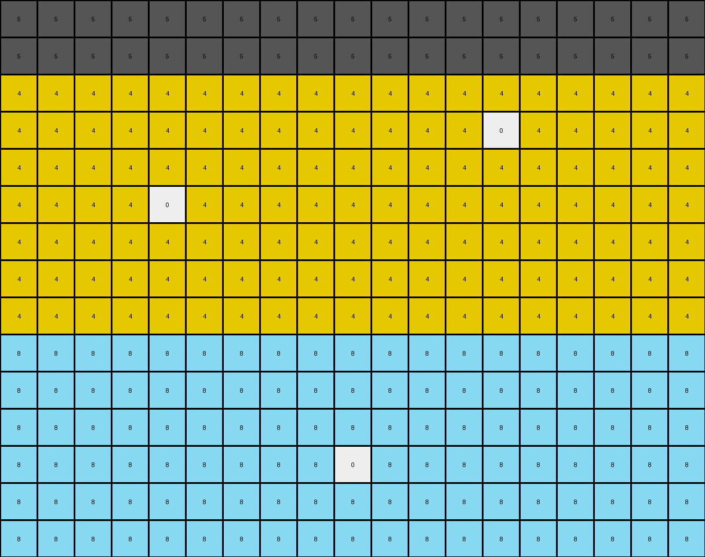

# 855e0971 • 010 • refine_coder

---

Previous Code:
```python
"""
The grid is divided into two regions: red (left) and blue (right). White pixels within each region cause a color change within that region.  If a white pixel is in the red region, it and all red pixels to its right become white. If a white pixel is in the blue region, it and all blue pixels to its left become white.
"""

import numpy as np

def get_regions(grid):
    #find the column where the color changes
    for col in range(grid.shape[1] - 1):
        if grid[0, col] != grid[0, col + 1]:
            boundary_col = col + 1
            break
    else:  # No boundary found (all one color)
        return None, None

    left_region = (0, 0, boundary_col, grid.shape[0]) #x_start, y_start, width, height
    right_region = (boundary_col, 0, grid.shape[1] - boundary_col, grid.shape[0])
    return left_region, right_region

def get_white_pixels(grid):
    # return a list of (row, col) of white pixels
    white_pixels = []
    for row in range(grid.shape[0]):
        for col in range(grid.shape[1]):
            if grid[row,col] == 0:
                white_pixels.append((row,col))
    return white_pixels

def transform(input_grid):
    output_grid = np.copy(input_grid)
    left_region, right_region = get_regions(input_grid)
    white_pixels = get_white_pixels(input_grid)

    #get region color
    if left_region:
        left_color = input_grid[left_region[1], left_region[0]] # y, x
    if right_region:
      right_color = input_grid[right_region[1], right_region[0]]

    for row, col in white_pixels:
        if left_region and col < left_region[2]: # in left region
            for c in range(col, left_region[2]):
                output_grid[row, c] = 0  # Set to white
        elif right_region and col >= right_region[0]: # x_start
            for c in range(right_region[0], input_grid.shape[1]): #in right region
                output_grid[row,c] = 0 #set to white
    return output_grid
```

Train Set Results:

## Example 1:

Input:
```
5 5 5 5 5 5 5 5 5 5 5 5 5 5 5 5 5 5 5
5 5 5 5 5 5 5 5 5 5 5 5 5 5 5 5 5 5 5
4 4 4 4 4 4 4 4 4 4 4 4 4 4 4 4 4 4 4
4 4 4 4 4 4 4 4 4 4 4 4 4 0 4 4 4 4 4
4 4 4 4 4 4 4 4 4 4 4 4 4 4 4 4 4 4 4
4 4 4 4 0 4 4 4 4 4 4 4 4 4 4 4 4 4 4
4 4 4 4 4 4 4 4 4 4 4 4 4 4 4 4 4 4 4
4 4 4 4 4 4 4 4 4 4 4 4 4 4 4 4 4 4 4
4 4 4 4 4 4 4 4 4 4 4 4 4 4 4 4 4 4 4
8 8 8 8 8 8 8 8 8 8 8 8 8 8 8 8 8 8 8
8 8 8 8 8 8 8 8 8 8 8 8 8 8 8 8 8 8 8
8 8 8 8 8 8 8 8 8 8 8 8 8 8 8 8 8 8 8
8 8 8 8 8 8 8 8 8 0 8 8 8 8 8 8 8 8 8
8 8 8 8 8 8 8 8 8 8 8 8 8 8 8 8 8 8 8
8 8 8 8 8 8 8 8 8 8 8 8 8 8 8 8 8 8 8
```
Expected Output:
```
5 5 5 5 5 5 5 5 5 5 5 5 5 5 5 5 5 5 5
5 5 5 5 5 5 5 5 5 5 5 5 5 5 5 5 5 5 5
4 4 4 4 0 4 4 4 4 4 4 4 4 0 4 4 4 4 4
4 4 4 4 0 4 4 4 4 4 4 4 4 0 4 4 4 4 4
4 4 4 4 0 4 4 4 4 4 4 4 4 0 4 4 4 4 4
4 4 4 4 0 4 4 4 4 4 4 4 4 0 4 4 4 4 4
4 4 4 4 0 4 4 4 4 4 4 4 4 0 4 4 4 4 4
4 4 4 4 0 4 4 4 4 4 4 4 4 0 4 4 4 4 4
4 4 4 4 0 4 4 4 4 4 4 4 4 0 4 4 4 4 4
8 8 8 8 8 8 8 8 8 0 8 8 8 8 8 8 8 8 8
8 8 8 8 8 8 8 8 8 0 8 8 8 8 8 8 8 8 8
8 8 8 8 8 8 8 8 8 0 8 8 8 8 8 8 8 8 8
8 8 8 8 8 8 8 8 8 0 8 8 8 8 8 8 8 8 8
8 8 8 8 8 8 8 8 8 0 8 8 8 8 8 8 8 8 8
8 8 8 8 8 8 8 8 8 0 8 8 8 8 8 8 8 8 8
```
Transformed Output:
```
5 5 5 5 5 5 5 5 5 5 5 5 5 5 5 5 5 5 5
5 5 5 5 5 5 5 5 5 5 5 5 5 5 5 5 5 5 5
4 4 4 4 4 4 4 4 4 4 4 4 4 4 4 4 4 4 4
4 4 4 4 4 4 4 4 4 4 4 4 4 0 4 4 4 4 4
4 4 4 4 4 4 4 4 4 4 4 4 4 4 4 4 4 4 4
4 4 4 4 0 4 4 4 4 4 4 4 4 4 4 4 4 4 4
4 4 4 4 4 4 4 4 4 4 4 4 4 4 4 4 4 4 4
4 4 4 4 4 4 4 4 4 4 4 4 4 4 4 4 4 4 4
4 4 4 4 4 4 4 4 4 4 4 4 4 4 4 4 4 4 4
8 8 8 8 8 8 8 8 8 8 8 8 8 8 8 8 8 8 8
8 8 8 8 8 8 8 8 8 8 8 8 8 8 8 8 8 8 8
8 8 8 8 8 8 8 8 8 8 8 8 8 8 8 8 8 8 8
8 8 8 8 8 8 8 8 8 0 8 8 8 8 8 8 8 8 8
8 8 8 8 8 8 8 8 8 8 8 8 8 8 8 8 8 8 8
8 8 8 8 8 8 8 8 8 8 8 8 8 8 8 8 8 8 8
```

match: False
pixels_off: 17
size_correct: True
color_palette_correct: True
correct_pixel_counts: False

## Example 2:

Input:
```
2 2 2 2 2 1 1 1 1 1 1 1 1
2 2 2 2 2 1 1 1 1 1 1 1 1
2 2 2 2 2 1 1 1 1 1 1 1 1
2 2 0 2 2 1 1 1 1 1 1 1 1
2 2 2 2 2 1 1 1 1 1 1 1 1
2 2 2 2 2 1 1 1 1 1 1 1 1
2 2 2 2 2 1 1 1 1 1 1 1 1
2 2 2 2 2 1 1 1 1 1 1 1 1
2 2 2 2 2 1 1 1 1 1 1 1 1
2 2 2 2 2 1 1 1 1 1 1 1 1
2 2 2 2 2 1 1 1 1 1 1 1 1
2 2 2 2 2 1 1 1 0 1 1 1 1
2 2 2 2 2 1 1 1 1 1 1 1 1
2 2 2 2 2 1 1 1 1 1 1 1 1
```
Expected Output:
```
2 2 2 2 2 1 1 1 1 1 1 1 1
2 2 2 2 2 1 1 1 1 1 1 1 1
2 2 2 2 2 1 1 1 1 1 1 1 1
0 0 0 0 0 1 1 1 1 1 1 1 1
2 2 2 2 2 1 1 1 1 1 1 1 1
2 2 2 2 2 1 1 1 1 1 1 1 1
2 2 2 2 2 1 1 1 1 1 1 1 1
2 2 2 2 2 1 1 1 1 1 1 1 1
2 2 2 2 2 1 1 1 1 1 1 1 1
2 2 2 2 2 1 1 1 1 1 1 1 1
2 2 2 2 2 1 1 1 1 1 1 1 1
2 2 2 2 2 0 0 0 0 0 0 0 0
2 2 2 2 2 1 1 1 1 1 1 1 1
2 2 2 2 2 1 1 1 1 1 1 1 1
```
Transformed Output:
```
2 2 2 2 2 1 1 1 1 1 1 1 1
2 2 2 2 2 1 1 1 1 1 1 1 1
2 2 2 2 2 1 1 1 1 1 1 1 1
2 2 0 0 0 1 1 1 1 1 1 1 1
2 2 2 2 2 1 1 1 1 1 1 1 1
2 2 2 2 2 1 1 1 1 1 1 1 1
2 2 2 2 2 1 1 1 1 1 1 1 1
2 2 2 2 2 1 1 1 1 1 1 1 1
2 2 2 2 2 1 1 1 1 1 1 1 1
2 2 2 2 2 1 1 1 1 1 1 1 1
2 2 2 2 2 1 1 1 1 1 1 1 1
2 2 2 2 2 0 0 0 0 0 0 0 0
2 2 2 2 2 1 1 1 1 1 1 1 1
2 2 2 2 2 1 1 1 1 1 1 1 1
```

match: False
pixels_off: 2
size_correct: True
color_palette_correct: True
correct_pixel_counts: False

## Example 3:

Input:
```
8 8 8 8 8 8 8 8 8 8 8 8 8 8 8
8 8 8 8 8 8 8 8 8 8 8 8 8 8 8
8 8 8 0 8 8 8 8 8 8 8 8 8 8 8
8 8 8 8 8 8 8 8 8 8 8 0 8 8 8
8 8 8 8 8 8 8 8 8 8 8 8 8 8 8
2 2 2 2 2 2 2 2 2 2 2 2 2 2 2
2 2 2 2 2 2 2 2 2 2 2 2 2 2 2
2 2 2 2 2 0 2 2 2 2 2 2 2 2 2
2 2 2 2 2 2 2 2 2 2 2 2 2 2 2
2 2 2 2 2 2 2 2 2 2 2 2 2 2 2
3 3 3 3 3 3 3 3 3 3 3 3 3 3 3
3 3 3 3 3 3 3 0 3 3 3 3 3 3 3
3 3 3 3 3 3 3 3 3 3 3 3 3 3 3
```
Expected Output:
```
8 8 8 0 8 8 8 8 8 8 8 0 8 8 8
8 8 8 0 8 8 8 8 8 8 8 0 8 8 8
8 8 8 0 8 8 8 8 8 8 8 0 8 8 8
8 8 8 0 8 8 8 8 8 8 8 0 8 8 8
8 8 8 0 8 8 8 8 8 8 8 0 8 8 8
2 2 2 2 2 0 2 2 2 2 2 2 2 2 2
2 2 2 2 2 0 2 2 2 2 2 2 2 2 2
2 2 2 2 2 0 2 2 2 2 2 2 2 2 2
2 2 2 2 2 0 2 2 2 2 2 2 2 2 2
2 2 2 2 2 0 2 2 2 2 2 2 2 2 2
3 3 3 3 3 3 3 0 3 3 3 3 3 3 3
3 3 3 3 3 3 3 0 3 3 3 3 3 3 3
3 3 3 3 3 3 3 0 3 3 3 3 3 3 3
```
Transformed Output:
```
8 8 8 8 8 8 8 8 8 8 8 8 8 8 8
8 8 8 8 8 8 8 8 8 8 8 8 8 8 8
8 8 8 0 8 8 8 8 8 8 8 8 8 8 8
8 8 8 8 8 8 8 8 8 8 8 0 8 8 8
8 8 8 8 8 8 8 8 8 8 8 8 8 8 8
2 2 2 2 2 2 2 2 2 2 2 2 2 2 2
2 2 2 2 2 2 2 2 2 2 2 2 2 2 2
2 2 2 2 2 0 2 2 2 2 2 2 2 2 2
2 2 2 2 2 2 2 2 2 2 2 2 2 2 2
2 2 2 2 2 2 2 2 2 2 2 2 2 2 2
3 3 3 3 3 3 3 3 3 3 3 3 3 3 3
3 3 3 3 3 3 3 0 3 3 3 3 3 3 3
3 3 3 3 3 3 3 3 3 3 3 3 3 3 3
```

match: False
pixels_off: 14
size_correct: True
color_palette_correct: True
correct_pixel_counts: False

## Example 4:

Input:
```
2 2 2 2 5 5 5 5 5 4 4 4 4 4 4
2 2 2 2 5 5 5 5 5 4 4 4 4 4 4
2 2 2 2 5 5 5 5 5 4 4 4 0 4 4
2 2 2 2 5 5 5 5 5 4 4 4 4 4 4
2 2 2 2 5 5 5 5 5 4 4 4 4 4 4
2 2 2 2 5 5 5 5 5 4 4 4 4 4 4
2 2 2 2 5 5 0 5 5 4 4 4 4 4 4
2 2 2 2 5 5 5 5 5 4 4 4 4 4 4
2 2 2 2 5 5 5 5 5 4 4 4 4 4 4
2 2 2 2 5 5 5 5 5 4 4 4 4 4 4
2 2 2 2 5 5 5 5 5 4 4 4 4 4 4
2 2 2 2 5 5 5 5 5 4 4 4 4 4 4
2 2 2 2 5 5 5 5 5 4 0 4 4 4 4
2 2 2 2 5 5 5 5 5 4 4 4 4 4 4
```
Expected Output:
```
2 2 2 2 5 5 5 5 5 4 4 4 4 4 4
2 2 2 2 5 5 5 5 5 4 4 4 4 4 4
2 2 2 2 5 5 5 5 5 0 0 0 0 0 0
2 2 2 2 5 5 5 5 5 4 4 4 4 4 4
2 2 2 2 5 5 5 5 5 4 4 4 4 4 4
2 2 2 2 5 5 5 5 5 4 4 4 4 4 4
2 2 2 2 0 0 0 0 0 4 4 4 4 4 4
2 2 2 2 5 5 5 5 5 4 4 4 4 4 4
2 2 2 2 5 5 5 5 5 4 4 4 4 4 4
2 2 2 2 5 5 5 5 5 4 4 4 4 4 4
2 2 2 2 5 5 5 5 5 4 4 4 4 4 4
2 2 2 2 5 5 5 5 5 4 4 4 4 4 4
2 2 2 2 5 5 5 5 5 0 0 0 0 0 0
2 2 2 2 5 5 5 5 5 4 4 4 4 4 4
```
Transformed Output:
```
2 2 2 2 5 5 5 5 5 4 4 4 4 4 4
2 2 2 2 5 5 5 5 5 4 4 4 4 4 4
2 2 2 2 0 0 0 0 0 0 0 0 0 0 0
2 2 2 2 5 5 5 5 5 4 4 4 4 4 4
2 2 2 2 5 5 5 5 5 4 4 4 4 4 4
2 2 2 2 5 5 5 5 5 4 4 4 4 4 4
2 2 2 2 0 0 0 0 0 0 0 0 0 0 0
2 2 2 2 5 5 5 5 5 4 4 4 4 4 4
2 2 2 2 5 5 5 5 5 4 4 4 4 4 4
2 2 2 2 5 5 5 5 5 4 4 4 4 4 4
2 2 2 2 5 5 5 5 5 4 4 4 4 4 4
2 2 2 2 5 5 5 5 5 4 4 4 4 4 4
2 2 2 2 0 0 0 0 0 0 0 0 0 0 0
2 2 2 2 5 5 5 5 5 4 4 4 4 4 4
```

match: False
pixels_off: 16
size_correct: True
color_palette_correct: True
correct_pixel_counts: False
Okay, let's analyze the results and refine the natural language program.

**General Assessment:**

The initial code and natural language program were on the right track, identifying the concept of regions and the effect of white pixels. However, the implementation has flaws, especially in how it handles the "propagation" of the white color. It seems to only consider the immediate row where the white pixel exists and does not correctly extend the white color change across multiple rows *within the same region and connected to other white cells*. The errors show a consistent pattern of under-applying the white color change, particularly in examples with multiple rows containing white pixels within a region. The strategy should be to fix the region handling and, more importantly, to ensure that when a white pixel is encountered, the color change affects all connected pixels of the original region color, not just those on the same row, and respecting region boundaries.

**Strategy for Resolving Errors:**

1.  **Correct Region Handling:** Ensure the `get_regions` function works correctly, even when there is an entire row of the background color.
2.  **Connectivity:** Instead of just changing pixels on the same row, implement a flood-fill or connected-component approach. When a white pixel is found, change *all* connected pixels of the same region's color to white.

**Metrics and Observations:**

I'll summarize observations from each example, focusing on the discrepancies.

*   **Example 1:**
    *   The gray (5) and azure (8) regions are correctly identified as separate and handled as background, unchanging.
    *   Two regions, yellow (4) and yellow (4), are correctly processed at the top, but the white (0) cells below do not propagate to all eligible cells.
    *   Many yellow (4) pixels should have changed to white (0) but didn't. The ones at row 3 seem handled specially.
    * Pixels Off: 17

*   **Example 2:**
    *   Two regions, red(2) and blue (1) are defined by the boundary at column 5
    *   There is a white pixel at (3, 2) in the red region, and another at (11, 8) in the blue region.
    *   The white pixel in the red region has changed itself and the red pixel to its right correctly.
    *   The white pixel in the blue region has changed all the blue pixels to its right to white correctly.
    * Pixels off: 2

*   **Example 3:**
    * The grid is divided in 3 sections. Azure(8) at the top, red(2) in the middle, and green(3) at the bottom.
    * There are multiple white pixels in each section.
    * Only the row of the white pixel is updated, other rows in that color that should be updated are not.
    * Pixels off: 14

*   **Example 4:**
    * The grid is divided into 3 regions.
    * White cells on the same row correctly propagate the change.
    * The white color change should affect all connected pixels.
    * Pixels off: 16

**YAML Facts:**

```yaml
observations:
  - example: 1
    regions:
      - color: 5  # Gray
        behavior: static
      - color: 8  # Azure
        behavior: static
      - color: 4 #yellow
        boundary: row_based #incorrect assumption
        white_interaction:  propagate_right_row_only #incorrect
        pixels_off: 17
  - example: 2
    regions:
      - color: 2 #red
        boundary: column_5
        white_interaction: propagate_right_row_only #incorrect
        pixels_off: 2
      - color: 1 #blue
        boundary: column_5
        white_interaction: propagate_left_row_only #incorrect
  - example: 3
    regions:
        - color: 8
          boundary: row_based #incorrect
          white_interaction: propagate_right_row_only #incorrect
          pixels_off: 14
        - color: 2
          boundary: row_based
          white_interaction: propagate_right_row_only #incorrect
        - color: 3
          boundary: row_based
          white_interaction: propagate_right_row_only #incorrect
  - example: 4
    regions:
      - color: 2
        boundary: column_based #incorrect
        white_interaction: propagate_right_row_only_connected #partially correct
        pixels_off: 16
      - color: 5
        boundary: column_based #incorrect
        white_interaction:  static
      - color: 4
        boundary: column_based
        white_interaction: propagate_left_row_only_connected # partially correct

general:
  - The grid is divided into regions based on color changes on first row
  - White pixels within a region cause connected pixels of that region's original color to become white.
  - The white color propagation is limited by the region boundary.
```

**Natural Language Program:**

1.  **Identify Regions:** Divide the grid into regions. A region is defined as a set of contiguous pixels of the same color, extending across the entire height or width of the grid, or until there is a change to the color of the top row.
2.  **Find White Pixels:** Locate all white pixels within each region.
3.  **Propagate White:** For each white pixel:
    *   If the white pixel is within a region, perform a flood-fill operation starting from the white pixel.
    *   Change all connected pixels of the *region's original color* to white, but only within the boundaries of that region. Stop propagation at the region's boundary.
4. **Background Regions:** If an entire horizontal or vertical region contains a single color other than the region's color, that region is considered background, and it is static.

Essentially: "The grid is divided into regions. White pixels within a region act as seeds. From each white seed, the white color spreads to all connected pixels of the region's original color, stopping at the region's boundary."

**INSTRUCTIONS**

- generate a Python module to represent the natural language program 
- follow the template below
- all common math and science libraries are available
- create docstring only at top - but comment the workflow in the function
- use helper functions for common operations like finding objects, counting,
  measuring, moving, etc. 

remember - we are working iteratively - so this code will inform your future
self as we converge on the solution

*template:*

```python
"""
{{ natural language description of the transformation rule }}
"""

{{ imports }}

def transform(input_grid):
    # initialize output_grid

    # change output pixels 

    return output_grid

```
