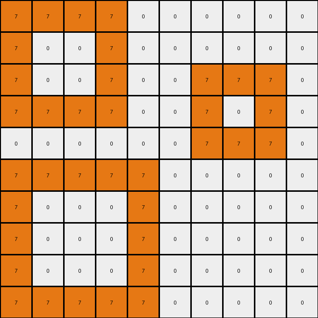

# 868de0fa • 016 • refine_coder

---

Previous Code:
```python
"""
1. **Identify Blue Regions:** Find all contiguous regions (blocks) of blue (1) pixels in the input grid.
2. **Identify Inner Region 1:** within each blue regions find blue pixels adjacent to white(0) pixels, mark those as 'inner region 1'.
3. **Identify Inner Region 2:** Within each blue region, locate areas enclosed by 'inner region 1' or outside blue regions, mark them as 'inner region 2', they might have mixed original colors of blue(1) and white(0).
4. **Color Change - Inner Region 1:** Change all pixels in 'inner region 1' to orange (7).
5. **Color Change - Inner Region 2:** Change all pixels in 'inner region 2' to red (2).
6. **Preserve Other Pixels:** All pixels not part of the identified inner regions retain their original color.
"""

import numpy as np
from scipy.ndimage import label

def get_neighbors(grid, r, c):
    """Gets the valid neighbors of a cell in a grid."""
    rows, cols = grid.shape
    neighbors = []
    for i in range(-1, 2):
        for j in range(-1, 2):
            if i == 0 and j == 0:
                continue
            nr, nc = r + i, c + j
            if 0 <= nr < rows and 0 <= nc < cols:
                neighbors.append((nr, nc))
    return neighbors

def find_regions(grid, color):
    """Finds contiguous regions of a specific color in the grid."""
    mask = (grid == color)
    labeled_array, num_features = label(mask)
    return labeled_array, num_features

def transform(input_grid):
    """Transforms the input grid according to the defined rules."""
    output_grid = input_grid.copy()
    rows, cols = input_grid.shape

    # 1. Identify Blue Regions
    blue_regions, num_blue_regions = find_regions(input_grid, 1)

    # Iterate through each blue region
    for region_id in range(1, num_blue_regions + 1):
        inner_region_1 = []
        inner_region_2 = []
        
        # Create a mask for the current blue region.
        current_blue_region_mask = (blue_regions == region_id)

        # 2. Identify Inner Region 1 (adjacent to white pixels)
        for r in range(rows):
            for c in range(cols):
                if current_blue_region_mask[r,c]:
                    neighbors = get_neighbors(input_grid, r, c)
                    for nr, nc in neighbors:
                        if input_grid[nr, nc] == 0:
                            inner_region_1.append((r, c))
                            break  # Once an adjacent white is found, no need to check others.
        
        #create a mask for inner region 1
        inner_region_1_mask = np.zeros_like(input_grid, dtype=bool)
        for r, c in inner_region_1:
            inner_region_1_mask[r,c] = True

        # 3. Identify inner region 2 (enclosed areas or pixels not region 1)
        for r in range(rows):
            for c in range(cols):
                if current_blue_region_mask[r,c] and not inner_region_1_mask[r,c]:
                    inner_region_2.append((r,c))

        # 4. & 5. Color Changes
        for r, c in inner_region_1:
            output_grid[r, c] = 7  # Orange

        for r,c in inner_region_2:
            output_grid[r,c] = 2

    return output_grid
```

Train Set Results:

## Example 1:

Input:
```
1 1 1 1 0 0 0 0 0 0
1 0 0 1 0 0 0 0 0 0
1 0 0 1 0 0 1 1 1 0
1 1 1 1 0 0 1 0 1 0
0 0 0 0 0 0 1 1 1 0
1 1 1 1 1 0 0 0 0 0
1 0 0 0 1 0 0 0 0 0
1 0 0 0 1 0 0 0 0 0
1 0 0 0 1 0 0 0 0 0
1 1 1 1 1 0 0 0 0 0
```
Expected Output:
```
1 1 1 1 0 0 0 0 0 0
1 2 2 1 0 0 0 0 0 0
1 2 2 1 0 0 1 1 1 0
1 1 1 1 0 0 1 7 1 0
0 0 0 0 0 0 1 1 1 0
1 1 1 1 1 0 0 0 0 0
1 7 7 7 1 0 0 0 0 0
1 7 7 7 1 0 0 0 0 0
1 7 7 7 1 0 0 0 0 0
1 1 1 1 1 0 0 0 0 0
```
Transformed Output:
```
7 7 7 7 0 0 0 0 0 0
7 0 0 7 0 0 0 0 0 0
7 0 0 7 0 0 7 7 7 0
7 7 7 7 0 0 7 0 7 0
0 0 0 0 0 0 7 7 7 0
7 7 7 7 7 0 0 0 0 0
7 0 0 0 7 0 0 0 0 0
7 0 0 0 7 0 0 0 0 0
7 0 0 0 7 0 0 0 0 0
7 7 7 7 7 0 0 0 0 0
```

match: False
pixels_off: 50
size_correct: True
color_palette_correct: True
correct_pixel_counts: False

## Example 2:

Input:
```
1 1 1 0 1 1 1 1 1 1
1 0 1 0 1 0 0 0 0 1
1 1 1 0 1 0 0 0 0 1
0 0 0 0 1 0 0 0 0 1
0 0 0 0 1 0 0 0 0 1
0 0 0 0 1 1 1 1 1 1
0 0 0 0 0 0 0 0 0 0
0 0 0 0 0 0 0 0 0 0
0 0 0 0 0 0 0 0 0 0
0 0 0 0 0 0 0 0 0 0
```
Expected Output:
```
1 1 1 0 1 1 1 1 1 1
1 7 1 0 1 2 2 2 2 1
1 1 1 0 1 2 2 2 2 1
0 0 0 0 1 2 2 2 2 1
0 0 0 0 1 2 2 2 2 1
0 0 0 0 1 1 1 1 1 1
0 0 0 0 0 0 0 0 0 0
0 0 0 0 0 0 0 0 0 0
0 0 0 0 0 0 0 0 0 0
0 0 0 0 0 0 0 0 0 0
```
Transformed Output:
```
7 7 7 0 7 7 7 7 7 7
7 0 7 0 7 0 0 0 0 7
7 7 7 0 7 0 0 0 0 7
0 0 0 0 7 0 0 0 0 7
0 0 0 0 7 0 0 0 0 7
0 0 0 0 7 7 7 7 7 7
0 0 0 0 0 0 0 0 0 0
0 0 0 0 0 0 0 0 0 0
0 0 0 0 0 0 0 0 0 0
0 0 0 0 0 0 0 0 0 0
```

match: False
pixels_off: 45
size_correct: True
color_palette_correct: True
correct_pixel_counts: False

## Example 3:

Input:
```
1 1 1 1 1 0 0 0 0 0 0 0 0 0 0 0 0 0 0 0
1 0 0 0 1 0 1 1 1 1 0 0 0 0 0 0 0 0 0 0
1 0 0 0 1 0 1 0 0 1 0 0 0 0 0 0 0 0 0 0
1 0 0 0 1 0 1 0 0 1 0 0 1 1 1 1 1 1 0 0
1 1 1 1 1 0 1 1 1 1 0 0 1 0 0 0 0 1 0 0
0 0 0 0 0 0 0 0 0 0 0 0 1 0 0 0 0 1 0 0
0 0 0 0 0 0 0 0 0 0 0 0 1 0 0 0 0 1 0 0
0 0 0 0 0 0 0 0 0 0 0 0 1 0 0 0 0 1 0 0
0 0 0 0 0 0 0 0 0 0 0 0 1 1 1 1 1 1 0 0
0 0 1 1 1 1 1 1 1 0 0 0 0 0 0 0 0 0 0 0
0 0 1 0 0 0 0 0 1 0 0 0 0 0 0 0 0 0 0 0
0 0 1 0 0 0 0 0 1 0 0 0 0 0 0 0 0 0 0 0
0 0 1 0 0 0 0 0 1 0 0 0 1 1 1 1 1 1 1 1
0 0 1 0 0 0 0 0 1 0 0 0 1 0 0 0 0 0 0 1
0 0 1 0 0 0 0 0 1 0 0 0 1 0 0 0 0 0 0 1
0 0 1 1 1 1 1 1 1 0 0 0 1 0 0 0 0 0 0 1
0 0 0 0 0 0 0 0 0 0 0 0 1 0 0 0 0 0 0 1
0 0 0 0 0 0 0 0 0 0 0 0 1 0 0 0 0 0 0 1
0 0 0 0 0 0 0 0 0 0 0 0 1 0 0 0 0 0 0 1
0 0 0 0 0 0 0 0 0 0 0 0 1 1 1 1 1 1 1 1
```
Expected Output:
```
1 1 1 1 1 0 0 0 0 0 0 0 0 0 0 0 0 0 0 0
1 7 7 7 1 0 1 1 1 1 0 0 0 0 0 0 0 0 0 0
1 7 7 7 1 0 1 2 2 1 0 0 0 0 0 0 0 0 0 0
1 7 7 7 1 0 1 2 2 1 0 0 1 1 1 1 1 1 0 0
1 1 1 1 1 0 1 1 1 1 0 0 1 2 2 2 2 1 0 0
0 0 0 0 0 0 0 0 0 0 0 0 1 2 2 2 2 1 0 0
0 0 0 0 0 0 0 0 0 0 0 0 1 2 2 2 2 1 0 0
0 0 0 0 0 0 0 0 0 0 0 0 1 2 2 2 2 1 0 0
0 0 0 0 0 0 0 0 0 0 0 0 1 1 1 1 1 1 0 0
0 0 1 1 1 1 1 1 1 0 0 0 0 0 0 0 0 0 0 0
0 0 1 7 7 7 7 7 1 0 0 0 0 0 0 0 0 0 0 0
0 0 1 7 7 7 7 7 1 0 0 0 0 0 0 0 0 0 0 0
0 0 1 7 7 7 7 7 1 0 0 0 1 1 1 1 1 1 1 1
0 0 1 7 7 7 7 7 1 0 0 0 1 2 2 2 2 2 2 1
0 0 1 7 7 7 7 7 1 0 0 0 1 2 2 2 2 2 2 1
0 0 1 1 1 1 1 1 1 0 0 0 1 2 2 2 2 2 2 1
0 0 0 0 0 0 0 0 0 0 0 0 1 2 2 2 2 2 2 1
0 0 0 0 0 0 0 0 0 0 0 0 1 2 2 2 2 2 2 1
0 0 0 0 0 0 0 0 0 0 0 0 1 2 2 2 2 2 2 1
0 0 0 0 0 0 0 0 0 0 0 0 1 1 1 1 1 1 1 1
```
Transformed Output:
```
7 7 7 7 7 0 0 0 0 0 0 0 0 0 0 0 0 0 0 0
7 0 0 0 7 0 7 7 7 7 0 0 0 0 0 0 0 0 0 0
7 0 0 0 7 0 7 0 0 7 0 0 0 0 0 0 0 0 0 0
7 0 0 0 7 0 7 0 0 7 0 0 7 7 7 7 7 7 0 0
7 7 7 7 7 0 7 7 7 7 0 0 7 0 0 0 0 7 0 0
0 0 0 0 0 0 0 0 0 0 0 0 7 0 0 0 0 7 0 0
0 0 0 0 0 0 0 0 0 0 0 0 7 0 0 0 0 7 0 0
0 0 0 0 0 0 0 0 0 0 0 0 7 0 0 0 0 7 0 0
0 0 0 0 0 0 0 0 0 0 0 0 7 7 7 7 7 7 0 0
0 0 7 7 7 7 7 7 7 0 0 0 0 0 0 0 0 0 0 0
0 0 7 0 0 0 0 0 7 0 0 0 0 0 0 0 0 0 0 0
0 0 7 0 0 0 0 0 7 0 0 0 0 0 0 0 0 0 0 0
0 0 7 0 0 0 0 0 7 0 0 0 7 7 7 7 7 7 7 7
0 0 7 0 0 0 0 0 7 0 0 0 7 0 0 0 0 0 0 7
0 0 7 0 0 0 0 0 7 0 0 0 7 0 0 0 0 0 0 7
0 0 7 7 7 7 7 7 7 0 0 0 7 0 0 0 0 0 0 7
0 0 0 0 0 0 0 0 0 0 0 0 7 0 0 0 0 0 0 7
0 0 0 0 0 0 0 0 0 0 0 0 7 0 0 0 0 0 0 7
0 0 0 0 0 0 0 0 0 0 0 0 7 0 0 0 0 0 0 7
0 0 0 0 0 0 0 0 0 0 0 0 7 7 7 7 7 7 7 7
```

match: False
pixels_off: 190
size_correct: True
color_palette_correct: True
correct_pixel_counts: False

## Example 4:

Input:
```
0 0 0 0 0 0 0 0 0 0 0
0 1 1 1 0 0 0 0 0 0 0
0 1 0 1 0 1 1 1 1 0 0
0 1 1 1 0 1 0 0 1 0 0
0 0 0 0 0 1 0 0 1 0 0
0 0 0 0 0 1 1 1 1 0 0
1 1 1 1 1 0 0 0 0 0 0
1 0 0 0 1 0 0 0 0 0 0
1 0 0 0 1 0 0 0 0 0 0
1 0 0 0 1 0 0 0 0 0 0
1 1 1 1 1 0 0 0 0 0 0
```
Expected Output:
```
0 0 0 0 0 0 0 0 0 0 0
0 1 1 1 0 0 0 0 0 0 0
0 1 7 1 0 1 1 1 1 0 0
0 1 1 1 0 1 2 2 1 0 0
0 0 0 0 0 1 2 2 1 0 0
0 0 0 0 0 1 1 1 1 0 0
1 1 1 1 1 0 0 0 0 0 0
1 7 7 7 1 0 0 0 0 0 0
1 7 7 7 1 0 0 0 0 0 0
1 7 7 7 1 0 0 0 0 0 0
1 1 1 1 1 0 0 0 0 0 0
```
Transformed Output:
```
0 0 0 0 0 0 0 0 0 0 0
0 7 7 7 0 0 0 0 0 0 0
0 7 0 7 0 7 7 7 7 0 0
0 7 7 7 0 7 0 0 7 0 0
0 0 0 0 0 7 0 0 7 0 0
0 0 0 0 0 7 7 7 7 0 0
7 7 7 7 7 0 0 0 0 0 0
7 0 0 0 7 0 0 0 0 0 0
7 0 0 0 7 0 0 0 0 0 0
7 0 0 0 7 0 0 0 0 0 0
7 7 7 7 7 0 0 0 0 0 0
```

match: False
pixels_off: 50
size_correct: True
color_palette_correct: True
correct_pixel_counts: False

## Example 5:

Input:
```
0 0 0 0 0 0 0 0 0 0 0 0 0 0 0
0 1 1 1 1 1 1 1 0 0 0 0 0 0 0
0 1 0 0 0 0 0 1 0 0 0 0 0 0 0
0 1 0 0 0 0 0 1 0 0 0 0 0 0 0
0 1 0 0 0 0 0 1 0 0 0 0 0 0 0
0 1 0 0 0 0 0 1 0 0 0 0 0 0 0
0 1 0 0 0 0 0 1 0 0 0 0 0 0 0
0 1 1 1 1 1 1 1 0 0 0 0 0 0 0
0 0 0 0 0 0 0 0 0 0 0 0 0 0 0
0 0 0 0 0 0 1 1 1 1 1 1 0 0 0
0 0 0 0 0 0 1 0 0 0 0 1 0 0 0
0 0 0 0 0 0 1 0 0 0 0 1 0 0 0
0 0 0 0 0 0 1 0 0 0 0 1 0 0 0
0 0 0 0 0 0 1 0 0 0 0 1 0 0 0
0 0 0 0 0 0 1 1 1 1 1 1 0 0 0
```
Expected Output:
```
0 0 0 0 0 0 0 0 0 0 0 0 0 0 0
0 1 1 1 1 1 1 1 0 0 0 0 0 0 0
0 1 7 7 7 7 7 1 0 0 0 0 0 0 0
0 1 7 7 7 7 7 1 0 0 0 0 0 0 0
0 1 7 7 7 7 7 1 0 0 0 0 0 0 0
0 1 7 7 7 7 7 1 0 0 0 0 0 0 0
0 1 7 7 7 7 7 1 0 0 0 0 0 0 0
0 1 1 1 1 1 1 1 0 0 0 0 0 0 0
0 0 0 0 0 0 0 0 0 0 0 0 0 0 0
0 0 0 0 0 0 1 1 1 1 1 1 0 0 0
0 0 0 0 0 0 1 2 2 2 2 1 0 0 0
0 0 0 0 0 0 1 2 2 2 2 1 0 0 0
0 0 0 0 0 0 1 2 2 2 2 1 0 0 0
0 0 0 0 0 0 1 2 2 2 2 1 0 0 0
0 0 0 0 0 0 1 1 1 1 1 1 0 0 0
```
Transformed Output:
```
0 0 0 0 0 0 0 0 0 0 0 0 0 0 0
0 7 7 7 7 7 7 7 0 0 0 0 0 0 0
0 7 0 0 0 0 0 7 0 0 0 0 0 0 0
0 7 0 0 0 0 0 7 0 0 0 0 0 0 0
0 7 0 0 0 0 0 7 0 0 0 0 0 0 0
0 7 0 0 0 0 0 7 0 0 0 0 0 0 0
0 7 0 0 0 0 0 7 0 0 0 0 0 0 0
0 7 7 7 7 7 7 7 0 0 0 0 0 0 0
0 0 0 0 0 0 0 0 0 0 0 0 0 0 0
0 0 0 0 0 0 7 7 7 7 7 7 0 0 0
0 0 0 0 0 0 7 0 0 0 0 7 0 0 0
0 0 0 0 0 0 7 0 0 0 0 7 0 0 0
0 0 0 0 0 0 7 0 0 0 0 7 0 0 0
0 0 0 0 0 0 7 0 0 0 0 7 0 0 0
0 0 0 0 0 0 7 7 7 7 7 7 0 0 0
```

match: False
pixels_off: 85
size_correct: True
color_palette_correct: True
correct_pixel_counts: False
Okay, here's a breakdown of the situation and a plan to improve the transformation logic:

**General Assessment:**

The initial natural language program and corresponding code were too simplistic. The core idea of identifying blue regions and then differentiating "inner" regions based on adjacency to white pixels is partially correct. However, the implementation fails to correctly identify these regions, particularly "inner region 2" (which should be colored red). The current code seems to just turn almost all blue to orange. It doesn't understand the concept of "enclosed" by the orange-colored "inner region 1".

The strategy for resolving errors will involve a multi-pronged approach:

1.  **Improved Region Identification:** The logic for distinguishing between 'inner region 1' and 'inner region 2' needs a complete overhaul.  Simple adjacency to white isn't sufficient. We need to consider connectivity *within* the blue regions after marking the white-adjacent pixels.

2.  **Iterative Refinement:**  Instead of trying to get it perfect in one shot, we'll use the "dreamer" and "coder" phases iteratively. We'll examine the output after each example, revise the natural language program, and update the code accordingly.

3. Focus on the failed tests. Try to understand why the transformation is failing and how the process can be improved.

**Metrics and Observations:**

Here's a summary of observations from the examples, focusing on why the current logic fails:

| Example | Input Summary                                      | Expected Output Summary                                           | Transformed Output Summary                                   | Key Discrepancies and Observations                                                                                                                                                                                                                                                                                               |
| :------ | :------------------------------------------------- | :-------------------------------------------------------------------- | :----------------------------------------------------------- | :------------------------------------------------------------------------------------------------------------------------------------------------------------------------------------------------------------------------------------------------------------------------------------------------------------------------ |
| 1       | Blue regions with white adjacent and non-adjacent | Blue regions with white adjacent (orange) and interior (red)        | Almost all blue becomes orange. No red.                     | Fails to identify the "interior" red region. Incorrectly colors white-adjacent blue pixels as the entire object. The border between blue and non-blue is entirely orange.                                                                                                                                    |
| 2       | Similar to Example 1                               | Similar to Example 1, with a larger red region.                     | Almost all blue becomes orange. No red.                     | Same problem as Example 1. Highlights the failure to correctly identify the inner red region, especially when it's larger.                                                                                                                                                                                              |
| 3       | More complex blue regions with multiple "holes"  | Blue, orange, and red regions in a more intricate pattern.         | Almost all blue becomes orange. No red.                     | Shows the logic failing completely with more complex shapes. The "inner red" concept is completely missing.                                                                                                                                                                                             |
| 4       | Blue shapes and isolated blue regions.                 | Blue regions with red/orange boundaries                                         | Almost all blue becomes orange. No red.          | Failure of Identifying inner red regions.                                                                        |
| 5       | Complex large blue regions with multiple sections                 | Blue regions with red/orange boundaries                                         | Almost all blue becomes orange. No red.          | Failure of Identifying inner red regions.                                                                        |

**YAML Block (Facts):**

```yaml
objects:
  - name: blue_region
    type: connected_component
    color: blue (1)
    properties:
      - surrounded_by: [white (0), edge]
      - contains: [inner_region_1, inner_region_2]

  - name: inner_region_1
    type: boundary
    color: orange (7)
    properties:
      - adjacent_to: [white (0)]
      - within: blue_region

  - name: inner_region_2
    type: interior
    color: red (2)
    properties:
      - enclosed_by: [inner_region_1, edge, blue_region]
      - within: blue_region

actions:
  - name: identify_blue_regions
    description: Find all connected components of blue pixels.

  - name: identify_inner_region_1
    description: Find blue pixels within each blue_region that are adjacent to white pixels.

  - name: identify_inner_region_2
    description: Find blue pixels that are *not* in inner_region_1 but are within the blue_region and may be completely surrounded by inner_region_1.

  - name: color_inner_region_1
    description: Change the color of pixels in inner_region_1 to orange.

  - name: color_inner_region_2
    description: Change the color of pixels in inner_region_2 to red.

```

**Natural Language Program:**

1.  **Find Blue Regions:** Identify all distinct, connected regions of blue (1) pixels in the input grid.  These are our `blue_region` objects.

2.  **Find Inner Region 1 (Orange Boundary):** Within each `blue_region`, locate all blue pixels that are directly adjacent (up, down, left, or right) to a white (0) pixel. These pixels form `inner_region_1`.

3.  **Find Inner Region 2 (Red Interior):** Within each `blue_region`, identify all pixels that belong to the `blue_region` but are *not* part of `inner_region_1`. These pixels form `inner_region_2`. It is the area remaining after identifying `inner_region_1`, and could include originally white or blue pixels.

4.  **Color Inner Region 1:** Change the color of all pixels in `inner_region_1` to orange (7).

5.  **Color Inner Region 2:** Change the color of all pixels in `inner_region_2` to red (2).

6.  **Preserve Other Colors:**  All pixels that are not part of any `blue_region` should remain their original color.

The key improvement here is the clearer definition of `inner_region_2`. It's the *remainder* within the blue region after the boundary (`inner_region_1`) has been identified. This "remainder" concept needs to be translated into code.

**INSTRUCTIONS**

- generate a Python module to represent the natural language program 
- follow the template below
- all common math and science libraries are available
- create docstring only at top - but comment the workflow in the function
- use helper functions for common operations like finding objects, counting,
  measuring, moving, etc. 

remember - we are working iteratively - so this code will inform your future
self as we converge on the solution

*template:*

```python
"""
{{ natural language description of the transformation rule }}
"""

{{ imports }}

def transform(input_grid):
    # initialize output_grid

    # change output pixels 

    return output_grid

```
