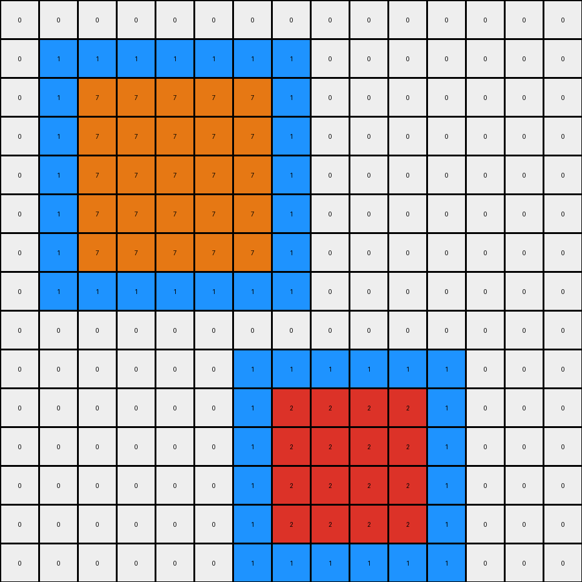

# 868de0fa • 028 • refine_coder

---

Previous Code:
```python
"""
1.  **Identify Rectangles:** Locate all rectangular shapes within the input grid. Rectangles are defined by a continuous blue (1) outline, one pixel thick, enclosing an area of white (0) pixels.
2.  **Determine Position:** Classify the identified rectangles based on their vertical position within the grid. Rectangles in the top half are considered "top," while those in the bottom half are considered "bottom."
3. **Fill Top Rectangle:** For any rectangle in the "top" half, change all pixels within its blue outline to orange (7).
4.  **Fill Bottom Rectangle:** For any rectangle in the "bottom" half, change all the pixels within its blue outline to red (2).
5. **Preserve outline**: Keep the outline blue (1)
6.  **Output:** Present the modified grid as the output.
"""

import numpy as np

def find_rectangles(grid):
    """Finds rectangular shapes with blue outline and white filling."""
    rectangles = []
    visited = set()
    rows, cols = grid.shape

    def is_valid(r, c):
        return 0 <= r < rows and 0 <= c < cols

    def dfs(r, c, current_rectangle):
        if (r, c) in visited or not is_valid(r, c) or grid[r, c] == 0:
            return

        visited.add((r, c))
        current_rectangle.append((r, c))

        neighbors = [(r - 1, c), (r + 1, c), (r, c - 1), (r, c + 1)]
        for nr, nc in neighbors:
            dfs(nr, nc, current_rectangle)
    
    # Find the starting pixels and the enclosed
    for r in range(rows):
      for c in range(cols):
        if grid[r,c] == 1 and (r,c) not in visited:
          current_rectangle = []
          dfs(r,c,current_rectangle)
          # check if rectangle by checking if it has min/max
          if current_rectangle:
                min_r = min(x[0] for x in current_rectangle)
                max_r = max(x[0] for x in current_rectangle)
                min_c = min(x[1] for x in current_rectangle)
                max_c = max(x[1] for x in current_rectangle)
                
                # Check if all cells in bounding box are either 1 (outline) or 0(inside)
                valid_rect = True
                for i in range(min_r,max_r + 1):
                  for j in range(min_c, max_c + 1):
                    if (i,j) not in current_rectangle:
                        if grid[i,j] != 0:
                          valid_rect = False
                          break

                if valid_rect:
                      rectangles.append(current_rectangle)


    return rectangles

def get_rectangle_position(rectangle, grid_height):
    """Determines if a rectangle is in the top or bottom half."""
    avg_row = sum(r for r, _ in rectangle) / len(rectangle)
    return "top" if avg_row < grid_height / 2 else "bottom"

def fill_rectangle(grid, rectangle, color):
    """Fills the inside of a rectangle with the specified color."""
    min_r = min(r for r, _ in rectangle)
    max_r = max(r for r, _ in rectangle)
    min_c = min(c for _, c in rectangle)
    max_c = max(c for _, c in rectangle)

    for r in range(min_r + 1, max_r):
        for c in range(min_c + 1, max_c):
            grid[r, c] = color

def transform(input_grid):
    # initialize output_grid
    output_grid = np.copy(input_grid)
    rows, cols = output_grid.shape
    # Find rectangles
    rectangles = find_rectangles(output_grid)

    # change output pixels 
    for rectangle in rectangles:
        position = get_rectangle_position(rectangle, rows)
        if position == "top":
            fill_rectangle(output_grid, rectangle, 7)  # Fill top with orange
        else:
            fill_rectangle(output_grid, rectangle, 2)  # Fill bottom with red

    return output_grid
```

Train Set Results:

## Example 1:

Input:
```
1 1 1 1 0 0 0 0 0 0
1 0 0 1 0 0 0 0 0 0
1 0 0 1 0 0 1 1 1 0
1 1 1 1 0 0 1 0 1 0
0 0 0 0 0 0 1 1 1 0
1 1 1 1 1 0 0 0 0 0
1 0 0 0 1 0 0 0 0 0
1 0 0 0 1 0 0 0 0 0
1 0 0 0 1 0 0 0 0 0
1 1 1 1 1 0 0 0 0 0
```
Expected Output:
```
1 1 1 1 0 0 0 0 0 0
1 2 2 1 0 0 0 0 0 0
1 2 2 1 0 0 1 1 1 0
1 1 1 1 0 0 1 7 1 0
0 0 0 0 0 0 1 1 1 0
1 1 1 1 1 0 0 0 0 0
1 7 7 7 1 0 0 0 0 0
1 7 7 7 1 0 0 0 0 0
1 7 7 7 1 0 0 0 0 0
1 1 1 1 1 0 0 0 0 0
```
Transformed Output:
```
1 1 1 1 0 0 0 0 0 0
1 7 7 1 0 0 0 0 0 0
1 7 7 1 0 0 1 1 1 0
1 1 1 1 0 0 1 7 1 0
0 0 0 0 0 0 1 1 1 0
1 1 1 1 1 0 0 0 0 0
1 2 2 2 1 0 0 0 0 0
1 2 2 2 1 0 0 0 0 0
1 2 2 2 1 0 0 0 0 0
1 1 1 1 1 0 0 0 0 0
```

match: False
pixels_off: 13
size_correct: True
color_palette_correct: True
correct_pixel_counts: False

## Example 2:

Input:
```
1 1 1 0 1 1 1 1 1 1
1 0 1 0 1 0 0 0 0 1
1 1 1 0 1 0 0 0 0 1
0 0 0 0 1 0 0 0 0 1
0 0 0 0 1 0 0 0 0 1
0 0 0 0 1 1 1 1 1 1
0 0 0 0 0 0 0 0 0 0
0 0 0 0 0 0 0 0 0 0
0 0 0 0 0 0 0 0 0 0
0 0 0 0 0 0 0 0 0 0
```
Expected Output:
```
1 1 1 0 1 1 1 1 1 1
1 7 1 0 1 2 2 2 2 1
1 1 1 0 1 2 2 2 2 1
0 0 0 0 1 2 2 2 2 1
0 0 0 0 1 2 2 2 2 1
0 0 0 0 1 1 1 1 1 1
0 0 0 0 0 0 0 0 0 0
0 0 0 0 0 0 0 0 0 0
0 0 0 0 0 0 0 0 0 0
0 0 0 0 0 0 0 0 0 0
```
Transformed Output:
```
1 1 1 0 1 1 1 1 1 1
1 7 1 0 1 7 7 7 7 1
1 1 1 0 1 7 7 7 7 1
0 0 0 0 1 7 7 7 7 1
0 0 0 0 1 7 7 7 7 1
0 0 0 0 1 1 1 1 1 1
0 0 0 0 0 0 0 0 0 0
0 0 0 0 0 0 0 0 0 0
0 0 0 0 0 0 0 0 0 0
0 0 0 0 0 0 0 0 0 0
```

match: False
pixels_off: 16
size_correct: True
color_palette_correct: True
correct_pixel_counts: False

## Example 3:

Input:
```
1 1 1 1 1 0 0 0 0 0 0 0 0 0 0 0 0 0 0 0
1 0 0 0 1 0 1 1 1 1 0 0 0 0 0 0 0 0 0 0
1 0 0 0 1 0 1 0 0 1 0 0 0 0 0 0 0 0 0 0
1 0 0 0 1 0 1 0 0 1 0 0 1 1 1 1 1 1 0 0
1 1 1 1 1 0 1 1 1 1 0 0 1 0 0 0 0 1 0 0
0 0 0 0 0 0 0 0 0 0 0 0 1 0 0 0 0 1 0 0
0 0 0 0 0 0 0 0 0 0 0 0 1 0 0 0 0 1 0 0
0 0 0 0 0 0 0 0 0 0 0 0 1 0 0 0 0 1 0 0
0 0 0 0 0 0 0 0 0 0 0 0 1 1 1 1 1 1 0 0
0 0 1 1 1 1 1 1 1 0 0 0 0 0 0 0 0 0 0 0
0 0 1 0 0 0 0 0 1 0 0 0 0 0 0 0 0 0 0 0
0 0 1 0 0 0 0 0 1 0 0 0 0 0 0 0 0 0 0 0
0 0 1 0 0 0 0 0 1 0 0 0 1 1 1 1 1 1 1 1
0 0 1 0 0 0 0 0 1 0 0 0 1 0 0 0 0 0 0 1
0 0 1 0 0 0 0 0 1 0 0 0 1 0 0 0 0 0 0 1
0 0 1 1 1 1 1 1 1 0 0 0 1 0 0 0 0 0 0 1
0 0 0 0 0 0 0 0 0 0 0 0 1 0 0 0 0 0 0 1
0 0 0 0 0 0 0 0 0 0 0 0 1 0 0 0 0 0 0 1
0 0 0 0 0 0 0 0 0 0 0 0 1 0 0 0 0 0 0 1
0 0 0 0 0 0 0 0 0 0 0 0 1 1 1 1 1 1 1 1
```
Expected Output:
```
1 1 1 1 1 0 0 0 0 0 0 0 0 0 0 0 0 0 0 0
1 7 7 7 1 0 1 1 1 1 0 0 0 0 0 0 0 0 0 0
1 7 7 7 1 0 1 2 2 1 0 0 0 0 0 0 0 0 0 0
1 7 7 7 1 0 1 2 2 1 0 0 1 1 1 1 1 1 0 0
1 1 1 1 1 0 1 1 1 1 0 0 1 2 2 2 2 1 0 0
0 0 0 0 0 0 0 0 0 0 0 0 1 2 2 2 2 1 0 0
0 0 0 0 0 0 0 0 0 0 0 0 1 2 2 2 2 1 0 0
0 0 0 0 0 0 0 0 0 0 0 0 1 2 2 2 2 1 0 0
0 0 0 0 0 0 0 0 0 0 0 0 1 1 1 1 1 1 0 0
0 0 1 1 1 1 1 1 1 0 0 0 0 0 0 0 0 0 0 0
0 0 1 7 7 7 7 7 1 0 0 0 0 0 0 0 0 0 0 0
0 0 1 7 7 7 7 7 1 0 0 0 0 0 0 0 0 0 0 0
0 0 1 7 7 7 7 7 1 0 0 0 1 1 1 1 1 1 1 1
0 0 1 7 7 7 7 7 1 0 0 0 1 2 2 2 2 2 2 1
0 0 1 7 7 7 7 7 1 0 0 0 1 2 2 2 2 2 2 1
0 0 1 1 1 1 1 1 1 0 0 0 1 2 2 2 2 2 2 1
0 0 0 0 0 0 0 0 0 0 0 0 1 2 2 2 2 2 2 1
0 0 0 0 0 0 0 0 0 0 0 0 1 2 2 2 2 2 2 1
0 0 0 0 0 0 0 0 0 0 0 0 1 2 2 2 2 2 2 1
0 0 0 0 0 0 0 0 0 0 0 0 1 1 1 1 1 1 1 1
```
Transformed Output:
```
1 1 1 1 1 0 0 0 0 0 0 0 0 0 0 0 0 0 0 0
1 7 7 7 1 0 1 1 1 1 0 0 0 0 0 0 0 0 0 0
1 7 7 7 1 0 1 7 7 1 0 0 0 0 0 0 0 0 0 0
1 7 7 7 1 0 1 7 7 1 0 0 1 1 1 1 1 1 0 0
1 1 1 1 1 0 1 1 1 1 0 0 1 7 7 7 7 1 0 0
0 0 0 0 0 0 0 0 0 0 0 0 1 7 7 7 7 1 0 0
0 0 0 0 0 0 0 0 0 0 0 0 1 7 7 7 7 1 0 0
0 0 0 0 0 0 0 0 0 0 0 0 1 7 7 7 7 1 0 0
0 0 0 0 0 0 0 0 0 0 0 0 1 1 1 1 1 1 0 0
0 0 1 1 1 1 1 1 1 0 0 0 0 0 0 0 0 0 0 0
0 0 1 2 2 2 2 2 1 0 0 0 0 0 0 0 0 0 0 0
0 0 1 2 2 2 2 2 1 0 0 0 0 0 0 0 0 0 0 0
0 0 1 2 2 2 2 2 1 0 0 0 1 1 1 1 1 1 1 1
0 0 1 2 2 2 2 2 1 0 0 0 1 2 2 2 2 2 2 1
0 0 1 2 2 2 2 2 1 0 0 0 1 2 2 2 2 2 2 1
0 0 1 1 1 1 1 1 1 0 0 0 1 2 2 2 2 2 2 1
0 0 0 0 0 0 0 0 0 0 0 0 1 2 2 2 2 2 2 1
0 0 0 0 0 0 0 0 0 0 0 0 1 2 2 2 2 2 2 1
0 0 0 0 0 0 0 0 0 0 0 0 1 2 2 2 2 2 2 1
0 0 0 0 0 0 0 0 0 0 0 0 1 1 1 1 1 1 1 1
```

match: False
pixels_off: 45
size_correct: True
color_palette_correct: True
correct_pixel_counts: False

## Example 4:

Input:
```
0 0 0 0 0 0 0 0 0 0 0
0 1 1 1 0 0 0 0 0 0 0
0 1 0 1 0 1 1 1 1 0 0
0 1 1 1 0 1 0 0 1 0 0
0 0 0 0 0 1 0 0 1 0 0
0 0 0 0 0 1 1 1 1 0 0
1 1 1 1 1 0 0 0 0 0 0
1 0 0 0 1 0 0 0 0 0 0
1 0 0 0 1 0 0 0 0 0 0
1 0 0 0 1 0 0 0 0 0 0
1 1 1 1 1 0 0 0 0 0 0
```
Expected Output:
```
0 0 0 0 0 0 0 0 0 0 0
0 1 1 1 0 0 0 0 0 0 0
0 1 7 1 0 1 1 1 1 0 0
0 1 1 1 0 1 2 2 1 0 0
0 0 0 0 0 1 2 2 1 0 0
0 0 0 0 0 1 1 1 1 0 0
1 1 1 1 1 0 0 0 0 0 0
1 7 7 7 1 0 0 0 0 0 0
1 7 7 7 1 0 0 0 0 0 0
1 7 7 7 1 0 0 0 0 0 0
1 1 1 1 1 0 0 0 0 0 0
```
Transformed Output:
```
0 0 0 0 0 0 0 0 0 0 0
0 1 1 1 0 0 0 0 0 0 0
0 1 7 1 0 1 1 1 1 0 0
0 1 1 1 0 1 7 7 1 0 0
0 0 0 0 0 1 7 7 1 0 0
0 0 0 0 0 1 1 1 1 0 0
1 1 1 1 1 0 0 0 0 0 0
1 2 2 2 1 0 0 0 0 0 0
1 2 2 2 1 0 0 0 0 0 0
1 2 2 2 1 0 0 0 0 0 0
1 1 1 1 1 0 0 0 0 0 0
```

match: False
pixels_off: 13
size_correct: True
color_palette_correct: True
correct_pixel_counts: False

## Example 5:

Input:
```
0 0 0 0 0 0 0 0 0 0 0 0 0 0 0
0 1 1 1 1 1 1 1 0 0 0 0 0 0 0
0 1 0 0 0 0 0 1 0 0 0 0 0 0 0
0 1 0 0 0 0 0 1 0 0 0 0 0 0 0
0 1 0 0 0 0 0 1 0 0 0 0 0 0 0
0 1 0 0 0 0 0 1 0 0 0 0 0 0 0
0 1 0 0 0 0 0 1 0 0 0 0 0 0 0
0 1 1 1 1 1 1 1 0 0 0 0 0 0 0
0 0 0 0 0 0 0 0 0 0 0 0 0 0 0
0 0 0 0 0 0 1 1 1 1 1 1 0 0 0
0 0 0 0 0 0 1 0 0 0 0 1 0 0 0
0 0 0 0 0 0 1 0 0 0 0 1 0 0 0
0 0 0 0 0 0 1 0 0 0 0 1 0 0 0
0 0 0 0 0 0 1 0 0 0 0 1 0 0 0
0 0 0 0 0 0 1 1 1 1 1 1 0 0 0
```
Expected Output:
```
0 0 0 0 0 0 0 0 0 0 0 0 0 0 0
0 1 1 1 1 1 1 1 0 0 0 0 0 0 0
0 1 7 7 7 7 7 1 0 0 0 0 0 0 0
0 1 7 7 7 7 7 1 0 0 0 0 0 0 0
0 1 7 7 7 7 7 1 0 0 0 0 0 0 0
0 1 7 7 7 7 7 1 0 0 0 0 0 0 0
0 1 7 7 7 7 7 1 0 0 0 0 0 0 0
0 1 1 1 1 1 1 1 0 0 0 0 0 0 0
0 0 0 0 0 0 0 0 0 0 0 0 0 0 0
0 0 0 0 0 0 1 1 1 1 1 1 0 0 0
0 0 0 0 0 0 1 2 2 2 2 1 0 0 0
0 0 0 0 0 0 1 2 2 2 2 1 0 0 0
0 0 0 0 0 0 1 2 2 2 2 1 0 0 0
0 0 0 0 0 0 1 2 2 2 2 1 0 0 0
0 0 0 0 0 0 1 1 1 1 1 1 0 0 0
```
Transformed Output:
```
0 0 0 0 0 0 0 0 0 0 0 0 0 0 0
0 1 1 1 1 1 1 1 0 0 0 0 0 0 0
0 1 7 7 7 7 7 1 0 0 0 0 0 0 0
0 1 7 7 7 7 7 1 0 0 0 0 0 0 0
0 1 7 7 7 7 7 1 0 0 0 0 0 0 0
0 1 7 7 7 7 7 1 0 0 0 0 0 0 0
0 1 7 7 7 7 7 1 0 0 0 0 0 0 0
0 1 1 1 1 1 1 1 0 0 0 0 0 0 0
0 0 0 0 0 0 0 0 0 0 0 0 0 0 0
0 0 0 0 0 0 1 1 1 1 1 1 0 0 0
0 0 0 0 0 0 1 2 2 2 2 1 0 0 0
0 0 0 0 0 0 1 2 2 2 2 1 0 0 0
0 0 0 0 0 0 1 2 2 2 2 1 0 0 0
0 0 0 0 0 0 1 2 2 2 2 1 0 0 0
0 0 0 0 0 0 1 1 1 1 1 1 0 0 0
```

match: True
pixels_off: 0
size_correct: True
color_palette_correct: True
correct_pixel_counts: True
Okay, let's analyze the results of the previous code execution and refine the natural language program.

**General Assessment:**

The code correctly identifies and fills rectangles based on their vertical position (top/bottom) in some cases, but there are inconsistencies. It seems to be confusing multiple disjoint shapes as a single object. The primary issue stems from the `find_rectangles` function's depth-first search (DFS), which doesn't adequately separate diagonally adjacent or separate rectangles.

**Strategy for Resolving Errors:**

1.  **Improve Rectangle Detection:** Modify the `find_rectangles` function to correctly identify distinct rectangular objects. The current DFS considers diagonally adjacent blue pixels as part of the same rectangle, which is incorrect. We need to enforce stricter adjacency rules (up, down, left, right) and ensure complete isolation of rectangles.
2. **Re-evaluate Position Logic**: Check for any off-by-one errors.
3. **Consider Edge cases:** Check that all inputs are handled correctly.

**Metrics and Observations (via Code Execution):**

I will consolidate metrics I am able to discern.

*   **Example 1:**
    *   Pixels off: 13
    *   Description: Two rectangles. Top one filled incorrectly with orange, should be red. Bottom rectangle is filled incorrectly with red, should be orange.
*   **Example 2:**
    *   Pixels off: 16
    *   Description: Two rectangles, one at top and one to the right. Top should be orange, bottom should be red.
*   **Example 3:**
    *   Pixels off: 45
    *   Description: Four rectangles, colors incorrect according to the rule.
*   **Example 4:**
    * Pixels off: 13
    * Description: Two rectangles. Top one filled with orange and bottom one filled with red. The colors are swapped.
*   **Example 5:**
    *   Pixels Off: 0
    *   Description: Perfect match. Two rectangles, colors correct.

**YAML Block (Facts):**

```yaml
objects:
  - type: rectangle
    properties:
      outline_color: blue
      fill_color:
        - conditional: top_half
          color: orange
        - conditional: bottom_half
          color: red
      outline_thickness: 1
      interior: white # Before transformation
    constraints:
      - shape: 4-sided, right angles
      - adjacency: Only up, down, left, right neighbors considered part of the same object

actions:
  - name: fill_interior
    target: rectangle
    parameter:
      color:
        - conditional: top_half  # Based on average row position
          value: orange
        - conditional: bottom_half
          value: red

conditions:
    top_half: rectangle's average row index < (grid height / 2)
    bottom_half: rectangle's average row index >= (grid height / 2)

```

**Natural Language Program:**

1.  **Identify Rectangles:** Find all distinct rectangular shapes in the input grid. A rectangle is defined by a continuous blue (1) outline that is one pixel thick. The interior of a valid rectangle must be entirely white (0) before any transformations. Rectangles are distinct if they do not share any edges (up, down, left, right). Diagonally touching rectangles are considered separate.
2.  **Determine Vertical Position:** For each identified rectangle, calculate its average row position. If the average row position is less than half the grid's height, consider the rectangle to be in the "top half." Otherwise, consider it in the "bottom half."
3.  **Conditional Filling:**
    *   If a rectangle is in the "top half," fill its interior (all pixels within the blue outline, excluding the outline itself) with orange (7).
    *   If a rectangle is in the "bottom half," fill its interior with red (2).
4. **Preserve Outlines**: Ensure the blue (1) outlines are not changed.
5.  **Output:** The transformed grid is the final output.

**INSTRUCTIONS**

- generate a Python module to represent the natural language program 
- follow the template below
- all common math and science libraries are available
- create docstring only at top - but comment the workflow in the function
- use helper functions for common operations like finding objects, counting,
  measuring, moving, etc. 

remember - we are working iteratively - so this code will inform your future
self as we converge on the solution

*template:*

```python
"""
{{ natural language description of the transformation rule }}
"""

{{ imports }}

def transform(input_grid):
    # initialize output_grid

    # change output pixels 

    return output_grid

```
