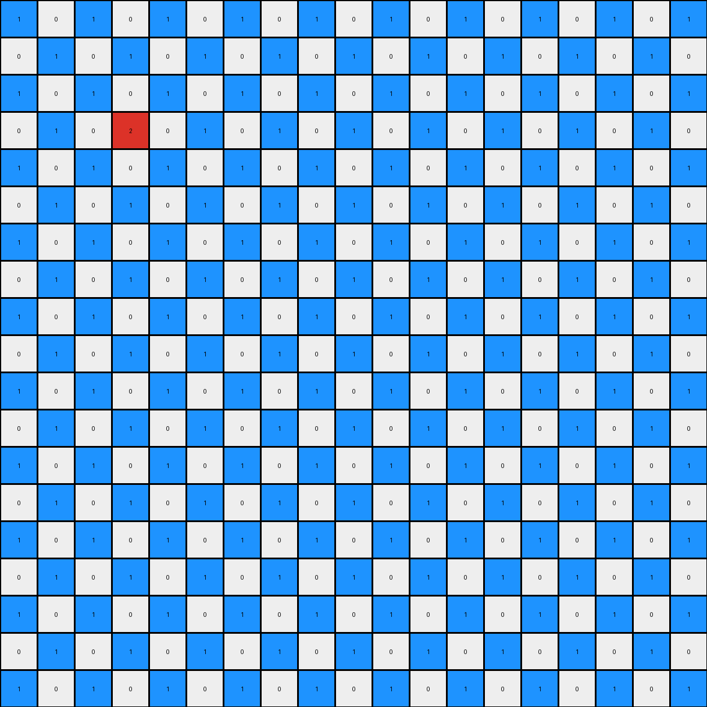

# 9d9215db • 003 • refine_dreamer

---


Previous Code:
```python
"""
The input grid's non-white pixels are replicated in a checkered pattern.
Blue(1) pixels are replicated horizontally and vertically in alternating positions,
Red(2) and Azure(8) pixels remain in place relative to the original blue pixels.
"""

import numpy as np

def get_non_white_pixels(grid):
    """
    Finds the coordinates of non-white pixels in the input grid.
    """
    non_white_pixels = []
    for r_idx, row in enumerate(grid):
        for c_idx, val in enumerate(row):
            if val != 0:
                non_white_pixels.append( ((r_idx, c_idx), val))
    return non_white_pixels

def transform(input_grid):
    # initialize output_grid
    input_grid = np.array(input_grid)
    output_grid = np.zeros_like(input_grid)
    
    # Find non white pixels and their locations
    non_white_pixels = get_non_white_pixels(input_grid)

    # Replicate according to the pattern
    for (r,c), val in non_white_pixels:
        if val == 1:
          for i in range(input_grid.shape[0]):
            for j in range(input_grid.shape[1]):
              if (i + j) % 2 == (r + c) % 2:
                output_grid[i, j] = 1
        elif val == 2 or val == 8:
            output_grid[r,c] = val


    return output_grid.tolist()
```

Train Set Results:

## Example 1:

Input:
```
0 0 0 0 0 0 0 0 0 0 0 0 0 0 0 0 0 0 0
0 8 0 1 0 0 0 0 0 0 0 0 0 0 0 0 0 0 0
0 0 0 0 0 0 0 0 0 0 0 0 0 0 0 0 0 0 0
0 1 0 2 0 0 0 0 0 0 0 0 0 0 0 0 0 0 0
0 0 0 0 0 0 0 0 0 0 0 0 0 0 0 0 0 0 0
0 0 0 0 0 0 0 0 0 0 0 0 0 0 0 0 0 0 0
0 0 0 0 0 0 0 0 0 0 0 0 0 0 0 0 0 0 0
0 0 0 0 0 0 0 0 0 0 0 0 0 0 0 0 0 0 0
0 0 0 0 0 0 0 0 0 0 0 0 0 0 0 0 0 0 0
0 0 0 0 0 0 0 0 0 0 0 0 0 0 0 0 0 0 0
0 0 0 0 0 0 0 0 0 0 0 0 0 0 0 0 0 0 0
0 0 0 0 0 0 0 0 0 0 0 0 0 0 0 0 0 0 0
0 0 0 0 0 0 0 0 0 0 0 0 0 0 0 0 0 0 0
0 0 0 0 0 0 0 0 0 0 0 0 0 0 0 0 0 0 0
0 0 0 0 0 0 0 0 0 0 0 0 0 0 0 0 0 0 0
0 0 0 0 0 0 0 0 0 0 0 0 0 0 0 0 0 0 0
0 0 0 0 0 0 0 0 0 0 0 0 0 0 0 0 0 0 0
0 0 0 0 0 0 0 0 0 0 0 0 0 0 0 0 0 0 0
0 0 0 0 0 0 0 0 0 0 0 0 0 0 0 0 0 0 0
```
Expected Output:
```
0 0 0 0 0 0 0 0 0 0 0 0 0 0 0 0 0 0 0
0 8 0 1 0 1 0 1 0 1 0 1 0 1 0 1 0 8 0
0 0 0 0 0 0 0 0 0 0 0 0 0 0 0 0 0 0 0
0 1 0 2 0 0 0 0 0 0 0 0 0 0 0 2 0 1 0
0 0 0 0 0 0 0 0 0 0 0 0 0 0 0 0 0 0 0
0 1 0 0 0 0 0 0 0 0 0 0 0 0 0 0 0 1 0
0 0 0 0 0 0 0 0 0 0 0 0 0 0 0 0 0 0 0
0 1 0 0 0 0 0 0 0 0 0 0 0 0 0 0 0 1 0
0 0 0 0 0 0 0 0 0 0 0 0 0 0 0 0 0 0 0
0 1 0 0 0 0 0 0 0 0 0 0 0 0 0 0 0 1 0
0 0 0 0 0 0 0 0 0 0 0 0 0 0 0 0 0 0 0
0 1 0 0 0 0 0 0 0 0 0 0 0 0 0 0 0 1 0
0 0 0 0 0 0 0 0 0 0 0 0 0 0 0 0 0 0 0
0 1 0 0 0 0 0 0 0 0 0 0 0 0 0 0 0 1 0
0 0 0 0 0 0 0 0 0 0 0 0 0 0 0 0 0 0 0
0 1 0 2 0 0 0 0 0 0 0 0 0 0 0 2 0 1 0
0 0 0 0 0 0 0 0 0 0 0 0 0 0 0 0 0 0 0
0 8 0 1 0 1 0 1 0 1 0 1 0 1 0 1 0 8 0
0 0 0 0 0 0 0 0 0 0 0 0 0 0 0 0 0 0 0
```
Transformed Output:
```
1 0 1 0 1 0 1 0 1 0 1 0 1 0 1 0 1 0 1
0 1 0 1 0 1 0 1 0 1 0 1 0 1 0 1 0 1 0
1 0 1 0 1 0 1 0 1 0 1 0 1 0 1 0 1 0 1
0 1 0 2 0 1 0 1 0 1 0 1 0 1 0 1 0 1 0
1 0 1 0 1 0 1 0 1 0 1 0 1 0 1 0 1 0 1
0 1 0 1 0 1 0 1 0 1 0 1 0 1 0 1 0 1 0
1 0 1 0 1 0 1 0 1 0 1 0 1 0 1 0 1 0 1
0 1 0 1 0 1 0 1 0 1 0 1 0 1 0 1 0 1 0
1 0 1 0 1 0 1 0 1 0 1 0 1 0 1 0 1 0 1
0 1 0 1 0 1 0 1 0 1 0 1 0 1 0 1 0 1 0
1 0 1 0 1 0 1 0 1 0 1 0 1 0 1 0 1 0 1
0 1 0 1 0 1 0 1 0 1 0 1 0 1 0 1 0 1 0
1 0 1 0 1 0 1 0 1 0 1 0 1 0 1 0 1 0 1
0 1 0 1 0 1 0 1 0 1 0 1 0 1 0 1 0 1 0
1 0 1 0 1 0 1 0 1 0 1 0 1 0 1 0 1 0 1
0 1 0 1 0 1 0 1 0 1 0 1 0 1 0 1 0 1 0
1 0 1 0 1 0 1 0 1 0 1 0 1 0 1 0 1 0 1
0 1 0 1 0 1 0 1 0 1 0 1 0 1 0 1 0 1 0
1 0 1 0 1 0 1 0 1 0 1 0 1 0 1 0 1 0 1
```

match: False
pixels_off: 152
size_correct: True
color_palette_correct: True
correct_pixel_counts: False

## Example 2:

Input:
```
0 0 0 0 0 0 0 0 0 0 0 0 0 0 0 0 0 0 0
0 0 0 0 0 0 0 0 0 0 0 0 0 0 0 0 0 3 0
0 0 0 0 0 0 0 0 0 0 0 0 0 0 0 0 0 0 0
0 0 0 0 0 0 0 0 0 0 0 0 0 1 0 4 0 0 0
0 0 0 0 0 0 0 0 0 0 0 0 0 0 0 0 0 0 0
0 0 0 0 0 0 0 0 0 0 0 0 0 0 0 1 0 0 0
0 0 0 0 0 0 0 0 0 0 0 0 0 0 0 0 0 0 0
0 0 0 0 0 0 0 0 0 0 0 0 0 0 0 0 0 0 0
0 0 0 0 0 0 0 0 0 0 0 0 0 0 0 0 0 0 0
0 0 0 0 0 0 0 0 0 0 0 0 0 0 0 0 0 0 0
0 0 0 0 0 0 0 0 0 0 0 0 0 0 0 0 0 0 0
0 0 0 0 0 0 0 0 0 0 0 0 0 0 0 0 0 0 0
0 0 0 0 0 0 0 0 0 0 0 0 0 0 0 0 0 0 0
0 0 0 0 0 0 0 0 0 0 0 0 0 0 0 0 0 0 0
0 0 0 0 0 0 0 0 0 0 0 0 0 0 0 0 0 0 0
0 0 0 0 0 0 0 0 0 0 0 0 0 0 0 0 0 0 0
0 0 0 0 0 0 0 0 0 0 0 0 0 0 0 0 0 0 0
0 0 0 0 0 0 0 0 0 0 0 0 0 0 0 0 0 0 0
0 0 0 0 0 0 0 0 0 0 0 0 0 0 0 0 0 0 0
```
Expected Output:
```
0 0 0 0 0 0 0 0 0 0 0 0 0 0 0 0 0 0 0
0 3 0 0 0 0 0 0 0 0 0 0 0 0 0 0 0 3 0
0 0 0 0 0 0 0 0 0 0 0 0 0 0 0 0 0 0 0
0 0 0 4 0 1 0 1 0 1 0 1 0 1 0 4 0 0 0
0 0 0 0 0 0 0 0 0 0 0 0 0 0 0 0 0 0 0
0 0 0 1 0 0 0 0 0 0 0 0 0 0 0 1 0 0 0
0 0 0 0 0 0 0 0 0 0 0 0 0 0 0 0 0 0 0
0 0 0 1 0 0 0 0 0 0 0 0 0 0 0 1 0 0 0
0 0 0 0 0 0 0 0 0 0 0 0 0 0 0 0 0 0 0
0 0 0 1 0 0 0 0 0 0 0 0 0 0 0 1 0 0 0
0 0 0 0 0 0 0 0 0 0 0 0 0 0 0 0 0 0 0
0 0 0 1 0 0 0 0 0 0 0 0 0 0 0 1 0 0 0
0 0 0 0 0 0 0 0 0 0 0 0 0 0 0 0 0 0 0
0 0 0 1 0 0 0 0 0 0 0 0 0 0 0 1 0 0 0
0 0 0 0 0 0 0 0 0 0 0 0 0 0 0 0 0 0 0
0 0 0 4 0 1 0 1 0 1 0 1 0 1 0 4 0 0 0
0 0 0 0 0 0 0 0 0 0 0 0 0 0 0 0 0 0 0
0 3 0 0 0 0 0 0 0 0 0 0 0 0 0 0 0 3 0
0 0 0 0 0 0 0 0 0 0 0 0 0 0 0 0 0 0 0
```
Transformed Output:
```
1 0 1 0 1 0 1 0 1 0 1 0 1 0 1 0 1 0 1
0 1 0 1 0 1 0 1 0 1 0 1 0 1 0 1 0 1 0
1 0 1 0 1 0 1 0 1 0 1 0 1 0 1 0 1 0 1
0 1 0 1 0 1 0 1 0 1 0 1 0 1 0 1 0 1 0
1 0 1 0 1 0 1 0 1 0 1 0 1 0 1 0 1 0 1
0 1 0 1 0 1 0 1 0 1 0 1 0 1 0 1 0 1 0
1 0 1 0 1 0 1 0 1 0 1 0 1 0 1 0 1 0 1
0 1 0 1 0 1 0 1 0 1 0 1 0 1 0 1 0 1 0
1 0 1 0 1 0 1 0 1 0 1 0 1 0 1 0 1 0 1
0 1 0 1 0 1 0 1 0 1 0 1 0 1 0 1 0 1 0
1 0 1 0 1 0 1 0 1 0 1 0 1 0 1 0 1 0 1
0 1 0 1 0 1 0 1 0 1 0 1 0 1 0 1 0 1 0
1 0 1 0 1 0 1 0 1 0 1 0 1 0 1 0 1 0 1
0 1 0 1 0 1 0 1 0 1 0 1 0 1 0 1 0 1 0
1 0 1 0 1 0 1 0 1 0 1 0 1 0 1 0 1 0 1
0 1 0 1 0 1 0 1 0 1 0 1 0 1 0 1 0 1 0
1 0 1 0 1 0 1 0 1 0 1 0 1 0 1 0 1 0 1
0 1 0 1 0 1 0 1 0 1 0 1 0 1 0 1 0 1 0
1 0 1 0 1 0 1 0 1 0 1 0 1 0 1 0 1 0 1
```

match: False
pixels_off: 161
size_correct: True
color_palette_correct: True
correct_pixel_counts: False

## Example 3:

Input:
```
0 0 0 0 0 0 0 0 0 0 0 0 0 0 0 0 0 0 0
0 4 0 3 0 0 0 0 0 0 0 0 0 0 0 0 0 0 0
0 0 0 0 0 0 0 0 0 0 0 0 0 0 0 0 0 0 0
0 3 0 1 0 0 0 0 0 0 0 0 0 0 0 0 0 0 0
0 0 0 0 0 0 0 0 0 0 0 0 0 0 0 0 0 0 0
0 0 0 0 0 8 0 0 0 0 0 0 0 0 0 0 0 0 0
0 0 0 0 0 0 0 0 0 0 0 0 0 0 0 0 0 0 0
0 0 0 0 0 0 0 0 0 0 0 0 0 0 0 0 0 0 0
0 0 0 0 0 0 0 0 0 0 0 0 0 0 0 0 0 0 0
0 0 0 0 0 0 0 0 0 0 0 0 0 0 0 0 0 0 0
0 0 0 0 0 0 0 0 0 0 0 0 0 0 0 0 0 0 0
0 0 0 0 0 0 0 0 0 0 0 0 0 0 0 0 0 0 0
0 0 0 0 0 0 0 0 0 0 0 0 0 0 0 0 0 0 0
0 0 0 0 0 0 0 0 0 0 0 0 0 0 0 0 0 0 0
0 0 0 0 0 0 0 0 0 0 0 0 0 0 0 0 0 0 0
0 0 0 0 0 0 0 0 0 0 0 0 0 0 0 0 0 0 0
0 0 0 0 0 0 0 0 0 0 0 0 0 0 0 0 0 0 0
0 0 0 0 0 0 0 0 0 0 0 0 0 0 0 0 0 0 0
0 0 0 0 0 0 0 0 0 0 0 0 0 0 0 0 0 0 0
```
Expected Output:
```
0 0 0 0 0 0 0 0 0 0 0 0 0 0 0 0 0 0 0
0 4 0 3 0 3 0 3 0 3 0 3 0 3 0 3 0 4 0
0 0 0 0 0 0 0 0 0 0 0 0 0 0 0 0 0 0 0
0 3 0 1 0 0 0 0 0 0 0 0 0 0 0 1 0 3 0
0 0 0 0 0 0 0 0 0 0 0 0 0 0 0 0 0 0 0
0 3 0 0 0 8 0 0 0 0 0 0 0 8 0 0 0 3 0
0 0 0 0 0 0 0 0 0 0 0 0 0 0 0 0 0 0 0
0 3 0 0 0 0 0 0 0 0 0 0 0 0 0 0 0 3 0
0 0 0 0 0 0 0 0 0 0 0 0 0 0 0 0 0 0 0
0 3 0 0 0 0 0 0 0 0 0 0 0 0 0 0 0 3 0
0 0 0 0 0 0 0 0 0 0 0 0 0 0 0 0 0 0 0
0 3 0 0 0 0 0 0 0 0 0 0 0 0 0 0 0 3 0
0 0 0 0 0 0 0 0 0 0 0 0 0 0 0 0 0 0 0
0 3 0 0 0 8 0 0 0 0 0 0 0 8 0 0 0 3 0
0 0 0 0 0 0 0 0 0 0 0 0 0 0 0 0 0 0 0
0 3 0 1 0 0 0 0 0 0 0 0 0 0 0 1 0 3 0
0 0 0 0 0 0 0 0 0 0 0 0 0 0 0 0 0 0 0
0 4 0 3 0 3 0 3 0 3 0 3 0 3 0 3 0 4 0
0 0 0 0 0 0 0 0 0 0 0 0 0 0 0 0 0 0 0
```
Transformed Output:
```
1 0 1 0 1 0 1 0 1 0 1 0 1 0 1 0 1 0 1
0 1 0 1 0 1 0 1 0 1 0 1 0 1 0 1 0 1 0
1 0 1 0 1 0 1 0 1 0 1 0 1 0 1 0 1 0 1
0 1 0 1 0 1 0 1 0 1 0 1 0 1 0 1 0 1 0
1 0 1 0 1 0 1 0 1 0 1 0 1 0 1 0 1 0 1
0 1 0 1 0 8 0 1 0 1 0 1 0 1 0 1 0 1 0
1 0 1 0 1 0 1 0 1 0 1 0 1 0 1 0 1 0 1
0 1 0 1 0 1 0 1 0 1 0 1 0 1 0 1 0 1 0
1 0 1 0 1 0 1 0 1 0 1 0 1 0 1 0 1 0 1
0 1 0 1 0 1 0 1 0 1 0 1 0 1 0 1 0 1 0
1 0 1 0 1 0 1 0 1 0 1 0 1 0 1 0 1 0 1
0 1 0 1 0 1 0 1 0 1 0 1 0 1 0 1 0 1 0
1 0 1 0 1 0 1 0 1 0 1 0 1 0 1 0 1 0 1
0 1 0 1 0 1 0 1 0 1 0 1 0 1 0 1 0 1 0
1 0 1 0 1 0 1 0 1 0 1 0 1 0 1 0 1 0 1
0 1 0 1 0 1 0 1 0 1 0 1 0 1 0 1 0 1 0
1 0 1 0 1 0 1 0 1 0 1 0 1 0 1 0 1 0 1
0 1 0 1 0 1 0 1 0 1 0 1 0 1 0 1 0 1 0
1 0 1 0 1 0 1 0 1 0 1 0 1 0 1 0 1 0 1
```

match: False
pixels_off: 176
size_correct: True
color_palette_correct: True
correct_pixel_counts: False

**INSTRUCTIONS**

The code above was generated based on observations from the first training
example

we have tested the transform function on each of the task example inputs and
compared with the expected output

review each of the examples provided and the results and consider how the
natural language program should be updated to accommodate this new knowledge

respond with the following deliverables:

- general assessment of the information provided and strategy for resolving the
  errors
- gather metrics about each of the examples and results - use code_execution to
  develop accurate reports on your assumptions
- a YAML block documenting facts - Focus on identifying objects, their properties, and the actions performed on them.
- a natural language program - Be as clear and concise as possible, providing a complete description of the transformation rule.


your responses should be considered as information in a report - not a
conversation
