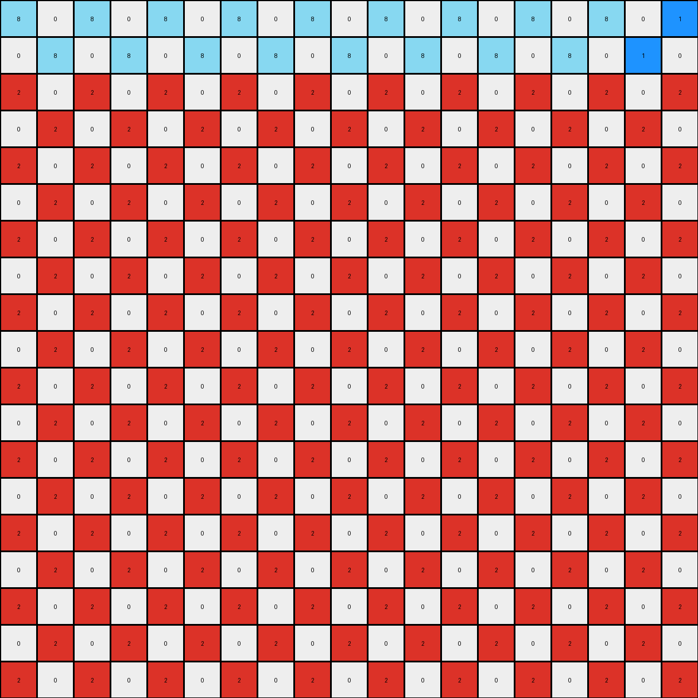
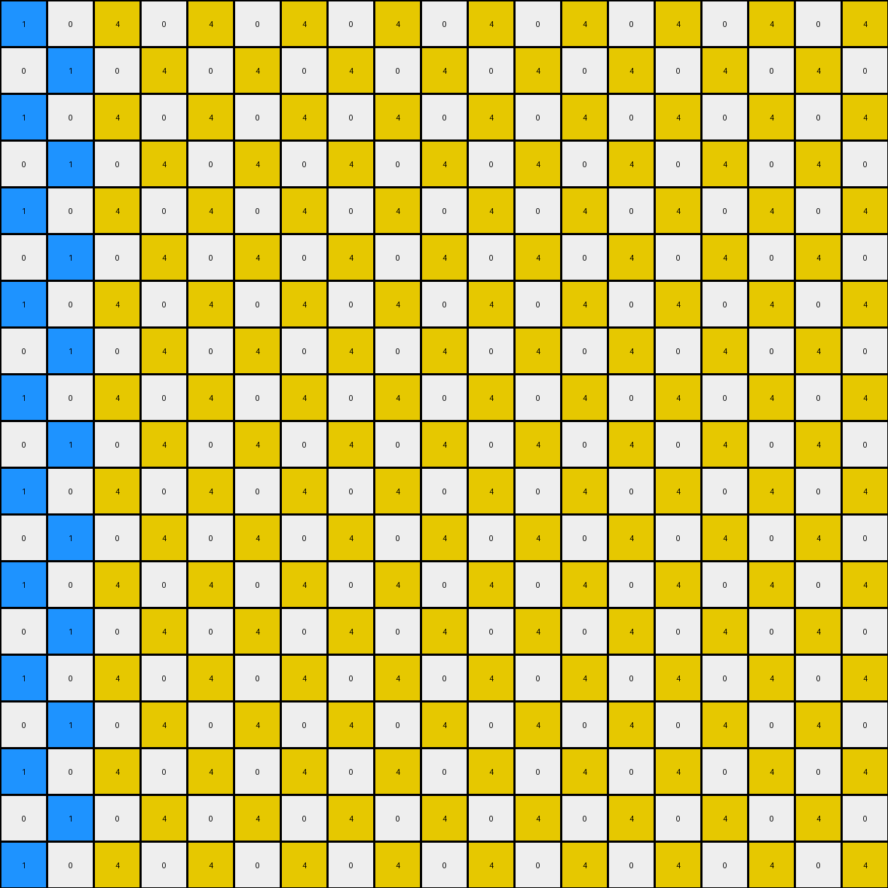
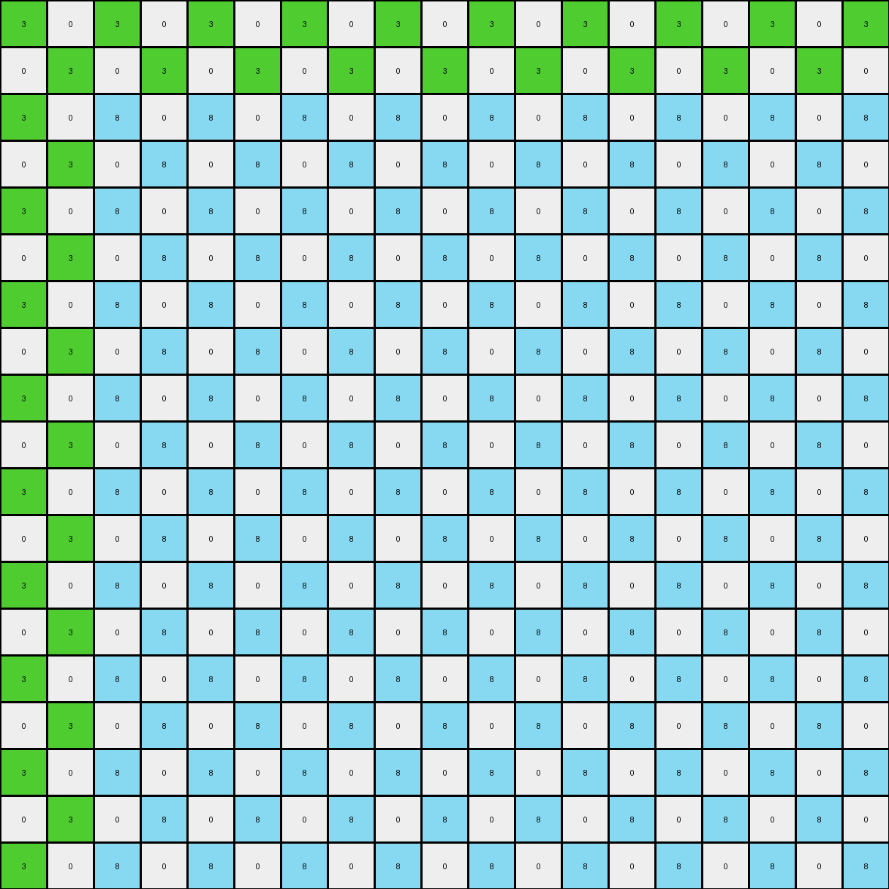

# 9d9215db • 005 • refine_dreamer

---


Previous Code:
```python
"""
The input grid's non-white pixels form a "seed" pattern. This pattern is replicated
in a checkered fashion across the output grid. The blue (1) pixels expand to set the
checkered grid. The other colored pixels maintain relative positions to the original
blue pixels.
"""

import numpy as np

def get_non_white_pixels(grid):
    """
    Finds the coordinates and values of non-white pixels in the input grid.
    """
    non_white_pixels = []
    for r_idx, row in enumerate(grid):
        for c_idx, val in enumerate(row):
            if val != 0:
                non_white_pixels.append( ((r_idx, c_idx), val))
    return non_white_pixels

def transform(input_grid):
    # initialize output_grid
    input_grid = np.array(input_grid)
    output_grid = np.zeros_like(input_grid)

    # Find non white pixels and their locations
    non_white_pixels = get_non_white_pixels(input_grid)
    
    # Find the blue pixel to set the checkered pattern.
    blue_pixels = [((r,c), val) for (r,c), val in non_white_pixels if val == 1]

    if not blue_pixels: # Handle edge case, when there are no blue pixels
        return input_grid.tolist()

    blue_row, blue_col = blue_pixels[0][0]

    # Create the checkered pattern based on blue pixel
    for r in range(output_grid.shape[0]):
        for c in range(output_grid.shape[1]):
            if (r + c) % 2 == (blue_row + blue_col) % 2:
                output_grid[r,c] = 1
    
    # Re-place other colored pixels relative to the original blue pixel positions.
    for (r,c), val in non_white_pixels:
        if val != 1:
            row_offset = r - blue_row
            col_offset = c - blue_col

            for r_out in range(output_grid.shape[0]):
                for c_out in range(output_grid.shape[1]):
                    # Check if this is a blue pixel position based on the checkered pattern.
                    if (r_out + c_out) % 2 == (blue_row + blue_col) % 2:
                        new_r = r_out + row_offset
                        new_c = c_out + col_offset

                        if 0 <= new_r < output_grid.shape[0] and 0 <= new_c < output_grid.shape[1]:
                            output_grid[new_r, new_c] = val
                        

    return output_grid.tolist()
```

Train Set Results:

## Example 1:

Input:
```
0 0 0 0 0 0 0 0 0 0 0 0 0 0 0 0 0 0 0
0 8 0 1 0 0 0 0 0 0 0 0 0 0 0 0 0 0 0
0 0 0 0 0 0 0 0 0 0 0 0 0 0 0 0 0 0 0
0 1 0 2 0 0 0 0 0 0 0 0 0 0 0 0 0 0 0
0 0 0 0 0 0 0 0 0 0 0 0 0 0 0 0 0 0 0
0 0 0 0 0 0 0 0 0 0 0 0 0 0 0 0 0 0 0
0 0 0 0 0 0 0 0 0 0 0 0 0 0 0 0 0 0 0
0 0 0 0 0 0 0 0 0 0 0 0 0 0 0 0 0 0 0
0 0 0 0 0 0 0 0 0 0 0 0 0 0 0 0 0 0 0
0 0 0 0 0 0 0 0 0 0 0 0 0 0 0 0 0 0 0
0 0 0 0 0 0 0 0 0 0 0 0 0 0 0 0 0 0 0
0 0 0 0 0 0 0 0 0 0 0 0 0 0 0 0 0 0 0
0 0 0 0 0 0 0 0 0 0 0 0 0 0 0 0 0 0 0
0 0 0 0 0 0 0 0 0 0 0 0 0 0 0 0 0 0 0
0 0 0 0 0 0 0 0 0 0 0 0 0 0 0 0 0 0 0
0 0 0 0 0 0 0 0 0 0 0 0 0 0 0 0 0 0 0
0 0 0 0 0 0 0 0 0 0 0 0 0 0 0 0 0 0 0
0 0 0 0 0 0 0 0 0 0 0 0 0 0 0 0 0 0 0
0 0 0 0 0 0 0 0 0 0 0 0 0 0 0 0 0 0 0
```
Expected Output:
```
0 0 0 0 0 0 0 0 0 0 0 0 0 0 0 0 0 0 0
0 8 0 1 0 1 0 1 0 1 0 1 0 1 0 1 0 8 0
0 0 0 0 0 0 0 0 0 0 0 0 0 0 0 0 0 0 0
0 1 0 2 0 0 0 0 0 0 0 0 0 0 0 2 0 1 0
0 0 0 0 0 0 0 0 0 0 0 0 0 0 0 0 0 0 0
0 1 0 0 0 0 0 0 0 0 0 0 0 0 0 0 0 1 0
0 0 0 0 0 0 0 0 0 0 0 0 0 0 0 0 0 0 0
0 1 0 0 0 0 0 0 0 0 0 0 0 0 0 0 0 1 0
0 0 0 0 0 0 0 0 0 0 0 0 0 0 0 0 0 0 0
0 1 0 0 0 0 0 0 0 0 0 0 0 0 0 0 0 1 0
0 0 0 0 0 0 0 0 0 0 0 0 0 0 0 0 0 0 0
0 1 0 0 0 0 0 0 0 0 0 0 0 0 0 0 0 1 0
0 0 0 0 0 0 0 0 0 0 0 0 0 0 0 0 0 0 0
0 1 0 0 0 0 0 0 0 0 0 0 0 0 0 0 0 1 0
0 0 0 0 0 0 0 0 0 0 0 0 0 0 0 0 0 0 0
0 1 0 2 0 0 0 0 0 0 0 0 0 0 0 2 0 1 0
0 0 0 0 0 0 0 0 0 0 0 0 0 0 0 0 0 0 0
0 8 0 1 0 1 0 1 0 1 0 1 0 1 0 1 0 8 0
0 0 0 0 0 0 0 0 0 0 0 0 0 0 0 0 0 0 0
```
Transformed Output:
```
8 0 8 0 8 0 8 0 8 0 8 0 8 0 8 0 8 0 1
0 8 0 8 0 8 0 8 0 8 0 8 0 8 0 8 0 1 0
2 0 2 0 2 0 2 0 2 0 2 0 2 0 2 0 2 0 2
0 2 0 2 0 2 0 2 0 2 0 2 0 2 0 2 0 2 0
2 0 2 0 2 0 2 0 2 0 2 0 2 0 2 0 2 0 2
0 2 0 2 0 2 0 2 0 2 0 2 0 2 0 2 0 2 0
2 0 2 0 2 0 2 0 2 0 2 0 2 0 2 0 2 0 2
0 2 0 2 0 2 0 2 0 2 0 2 0 2 0 2 0 2 0
2 0 2 0 2 0 2 0 2 0 2 0 2 0 2 0 2 0 2
0 2 0 2 0 2 0 2 0 2 0 2 0 2 0 2 0 2 0
2 0 2 0 2 0 2 0 2 0 2 0 2 0 2 0 2 0 2
0 2 0 2 0 2 0 2 0 2 0 2 0 2 0 2 0 2 0
2 0 2 0 2 0 2 0 2 0 2 0 2 0 2 0 2 0 2
0 2 0 2 0 2 0 2 0 2 0 2 0 2 0 2 0 2 0
2 0 2 0 2 0 2 0 2 0 2 0 2 0 2 0 2 0 2
0 2 0 2 0 2 0 2 0 2 0 2 0 2 0 2 0 2 0
2 0 2 0 2 0 2 0 2 0 2 0 2 0 2 0 2 0 2
0 2 0 2 0 2 0 2 0 2 0 2 0 2 0 2 0 2 0
2 0 2 0 2 0 2 0 2 0 2 0 2 0 2 0 2 0 2
```

match: False
pixels_off: 176
size_correct: True
color_palette_correct: True
correct_pixel_counts: False

## Example 2:

Input:
```
0 0 0 0 0 0 0 0 0 0 0 0 0 0 0 0 0 0 0
0 0 0 0 0 0 0 0 0 0 0 0 0 0 0 0 0 3 0
0 0 0 0 0 0 0 0 0 0 0 0 0 0 0 0 0 0 0
0 0 0 0 0 0 0 0 0 0 0 0 0 1 0 4 0 0 0
0 0 0 0 0 0 0 0 0 0 0 0 0 0 0 0 0 0 0
0 0 0 0 0 0 0 0 0 0 0 0 0 0 0 1 0 0 0
0 0 0 0 0 0 0 0 0 0 0 0 0 0 0 0 0 0 0
0 0 0 0 0 0 0 0 0 0 0 0 0 0 0 0 0 0 0
0 0 0 0 0 0 0 0 0 0 0 0 0 0 0 0 0 0 0
0 0 0 0 0 0 0 0 0 0 0 0 0 0 0 0 0 0 0
0 0 0 0 0 0 0 0 0 0 0 0 0 0 0 0 0 0 0
0 0 0 0 0 0 0 0 0 0 0 0 0 0 0 0 0 0 0
0 0 0 0 0 0 0 0 0 0 0 0 0 0 0 0 0 0 0
0 0 0 0 0 0 0 0 0 0 0 0 0 0 0 0 0 0 0
0 0 0 0 0 0 0 0 0 0 0 0 0 0 0 0 0 0 0
0 0 0 0 0 0 0 0 0 0 0 0 0 0 0 0 0 0 0
0 0 0 0 0 0 0 0 0 0 0 0 0 0 0 0 0 0 0
0 0 0 0 0 0 0 0 0 0 0 0 0 0 0 0 0 0 0
0 0 0 0 0 0 0 0 0 0 0 0 0 0 0 0 0 0 0
```
Expected Output:
```
0 0 0 0 0 0 0 0 0 0 0 0 0 0 0 0 0 0 0
0 3 0 0 0 0 0 0 0 0 0 0 0 0 0 0 0 3 0
0 0 0 0 0 0 0 0 0 0 0 0 0 0 0 0 0 0 0
0 0 0 4 0 1 0 1 0 1 0 1 0 1 0 4 0 0 0
0 0 0 0 0 0 0 0 0 0 0 0 0 0 0 0 0 0 0
0 0 0 1 0 0 0 0 0 0 0 0 0 0 0 1 0 0 0
0 0 0 0 0 0 0 0 0 0 0 0 0 0 0 0 0 0 0
0 0 0 1 0 0 0 0 0 0 0 0 0 0 0 1 0 0 0
0 0 0 0 0 0 0 0 0 0 0 0 0 0 0 0 0 0 0
0 0 0 1 0 0 0 0 0 0 0 0 0 0 0 1 0 0 0
0 0 0 0 0 0 0 0 0 0 0 0 0 0 0 0 0 0 0
0 0 0 1 0 0 0 0 0 0 0 0 0 0 0 1 0 0 0
0 0 0 0 0 0 0 0 0 0 0 0 0 0 0 0 0 0 0
0 0 0 1 0 0 0 0 0 0 0 0 0 0 0 1 0 0 0
0 0 0 0 0 0 0 0 0 0 0 0 0 0 0 0 0 0 0
0 0 0 4 0 1 0 1 0 1 0 1 0 1 0 4 0 0 0
0 0 0 0 0 0 0 0 0 0 0 0 0 0 0 0 0 0 0
0 3 0 0 0 0 0 0 0 0 0 0 0 0 0 0 0 3 0
0 0 0 0 0 0 0 0 0 0 0 0 0 0 0 0 0 0 0
```
Transformed Output:
```
1 0 4 0 4 0 4 0 4 0 4 0 4 0 4 0 4 0 4
0 1 0 4 0 4 0 4 0 4 0 4 0 4 0 4 0 4 0
1 0 4 0 4 0 4 0 4 0 4 0 4 0 4 0 4 0 4
0 1 0 4 0 4 0 4 0 4 0 4 0 4 0 4 0 4 0
1 0 4 0 4 0 4 0 4 0 4 0 4 0 4 0 4 0 4
0 1 0 4 0 4 0 4 0 4 0 4 0 4 0 4 0 4 0
1 0 4 0 4 0 4 0 4 0 4 0 4 0 4 0 4 0 4
0 1 0 4 0 4 0 4 0 4 0 4 0 4 0 4 0 4 0
1 0 4 0 4 0 4 0 4 0 4 0 4 0 4 0 4 0 4
0 1 0 4 0 4 0 4 0 4 0 4 0 4 0 4 0 4 0
1 0 4 0 4 0 4 0 4 0 4 0 4 0 4 0 4 0 4
0 1 0 4 0 4 0 4 0 4 0 4 0 4 0 4 0 4 0
1 0 4 0 4 0 4 0 4 0 4 0 4 0 4 0 4 0 4
0 1 0 4 0 4 0 4 0 4 0 4 0 4 0 4 0 4 0
1 0 4 0 4 0 4 0 4 0 4 0 4 0 4 0 4 0 4
0 1 0 4 0 4 0 4 0 4 0 4 0 4 0 4 0 4 0
1 0 4 0 4 0 4 0 4 0 4 0 4 0 4 0 4 0 4
0 1 0 4 0 4 0 4 0 4 0 4 0 4 0 4 0 4 0
1 0 4 0 4 0 4 0 4 0 4 0 4 0 4 0 4 0 4
```

match: False
pixels_off: 177
size_correct: True
color_palette_correct: True
correct_pixel_counts: False

## Example 3:

Input:
```
0 0 0 0 0 0 0 0 0 0 0 0 0 0 0 0 0 0 0
0 4 0 3 0 0 0 0 0 0 0 0 0 0 0 0 0 0 0
0 0 0 0 0 0 0 0 0 0 0 0 0 0 0 0 0 0 0
0 3 0 1 0 0 0 0 0 0 0 0 0 0 0 0 0 0 0
0 0 0 0 0 0 0 0 0 0 0 0 0 0 0 0 0 0 0
0 0 0 0 0 8 0 0 0 0 0 0 0 0 0 0 0 0 0
0 0 0 0 0 0 0 0 0 0 0 0 0 0 0 0 0 0 0
0 0 0 0 0 0 0 0 0 0 0 0 0 0 0 0 0 0 0
0 0 0 0 0 0 0 0 0 0 0 0 0 0 0 0 0 0 0
0 0 0 0 0 0 0 0 0 0 0 0 0 0 0 0 0 0 0
0 0 0 0 0 0 0 0 0 0 0 0 0 0 0 0 0 0 0
0 0 0 0 0 0 0 0 0 0 0 0 0 0 0 0 0 0 0
0 0 0 0 0 0 0 0 0 0 0 0 0 0 0 0 0 0 0
0 0 0 0 0 0 0 0 0 0 0 0 0 0 0 0 0 0 0
0 0 0 0 0 0 0 0 0 0 0 0 0 0 0 0 0 0 0
0 0 0 0 0 0 0 0 0 0 0 0 0 0 0 0 0 0 0
0 0 0 0 0 0 0 0 0 0 0 0 0 0 0 0 0 0 0
0 0 0 0 0 0 0 0 0 0 0 0 0 0 0 0 0 0 0
0 0 0 0 0 0 0 0 0 0 0 0 0 0 0 0 0 0 0
```
Expected Output:
```
0 0 0 0 0 0 0 0 0 0 0 0 0 0 0 0 0 0 0
0 4 0 3 0 3 0 3 0 3 0 3 0 3 0 3 0 4 0
0 0 0 0 0 0 0 0 0 0 0 0 0 0 0 0 0 0 0
0 3 0 1 0 0 0 0 0 0 0 0 0 0 0 1 0 3 0
0 0 0 0 0 0 0 0 0 0 0 0 0 0 0 0 0 0 0
0 3 0 0 0 8 0 0 0 0 0 0 0 8 0 0 0 3 0
0 0 0 0 0 0 0 0 0 0 0 0 0 0 0 0 0 0 0
0 3 0 0 0 0 0 0 0 0 0 0 0 0 0 0 0 3 0
0 0 0 0 0 0 0 0 0 0 0 0 0 0 0 0 0 0 0
0 3 0 0 0 0 0 0 0 0 0 0 0 0 0 0 0 3 0
0 0 0 0 0 0 0 0 0 0 0 0 0 0 0 0 0 0 0
0 3 0 0 0 0 0 0 0 0 0 0 0 0 0 0 0 3 0
0 0 0 0 0 0 0 0 0 0 0 0 0 0 0 0 0 0 0
0 3 0 0 0 8 0 0 0 0 0 0 0 8 0 0 0 3 0
0 0 0 0 0 0 0 0 0 0 0 0 0 0 0 0 0 0 0
0 3 0 1 0 0 0 0 0 0 0 0 0 0 0 1 0 3 0
0 0 0 0 0 0 0 0 0 0 0 0 0 0 0 0 0 0 0
0 4 0 3 0 3 0 3 0 3 0 3 0 3 0 3 0 4 0
0 0 0 0 0 0 0 0 0 0 0 0 0 0 0 0 0 0 0
```
Transformed Output:
```
3 0 3 0 3 0 3 0 3 0 3 0 3 0 3 0 3 0 3
0 3 0 3 0 3 0 3 0 3 0 3 0 3 0 3 0 3 0
3 0 8 0 8 0 8 0 8 0 8 0 8 0 8 0 8 0 8
0 3 0 8 0 8 0 8 0 8 0 8 0 8 0 8 0 8 0
3 0 8 0 8 0 8 0 8 0 8 0 8 0 8 0 8 0 8
0 3 0 8 0 8 0 8 0 8 0 8 0 8 0 8 0 8 0
3 0 8 0 8 0 8 0 8 0 8 0 8 0 8 0 8 0 8
0 3 0 8 0 8 0 8 0 8 0 8 0 8 0 8 0 8 0
3 0 8 0 8 0 8 0 8 0 8 0 8 0 8 0 8 0 8
0 3 0 8 0 8 0 8 0 8 0 8 0 8 0 8 0 8 0
3 0 8 0 8 0 8 0 8 0 8 0 8 0 8 0 8 0 8
0 3 0 8 0 8 0 8 0 8 0 8 0 8 0 8 0 8 0
3 0 8 0 8 0 8 0 8 0 8 0 8 0 8 0 8 0 8
0 3 0 8 0 8 0 8 0 8 0 8 0 8 0 8 0 8 0
3 0 8 0 8 0 8 0 8 0 8 0 8 0 8 0 8 0 8
0 3 0 8 0 8 0 8 0 8 0 8 0 8 0 8 0 8 0
3 0 8 0 8 0 8 0 8 0 8 0 8 0 8 0 8 0 8
0 3 0 8 0 8 0 8 0 8 0 8 0 8 0 8 0 8 0
3 0 8 0 8 0 8 0 8 0 8 0 8 0 8 0 8 0 8
```

match: False
pixels_off: 163
size_correct: True
color_palette_correct: True
correct_pixel_counts: False

**INSTRUCTIONS**

The code above was generated based on observations from the first training
example

we have tested the transform function on each of the task example inputs and
compared with the expected output

review each of the examples provided and the results and consider how the
natural language program should be updated to accommodate this new knowledge

respond with the following deliverables:

- general assessment of the information provided and strategy for resolving the
  errors
- gather metrics about each of the examples and results - use code_execution to
  develop accurate reports on your assumptions
- a YAML block documenting facts - Focus on identifying objects, their properties, and the actions performed on them.
- a natural language program - Be as clear and concise as possible, providing a complete description of the transformation rule.


your responses should be considered as information in a report - not a
conversation
