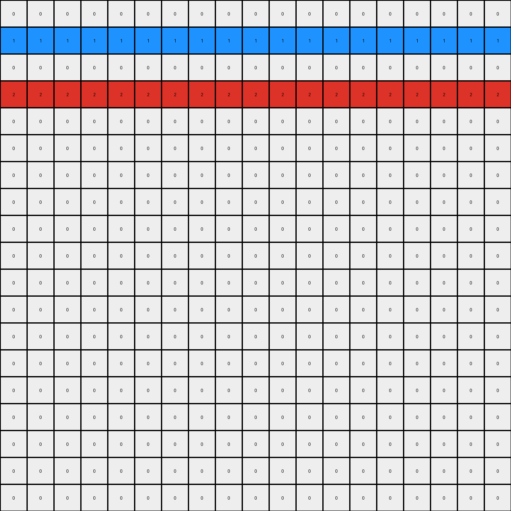
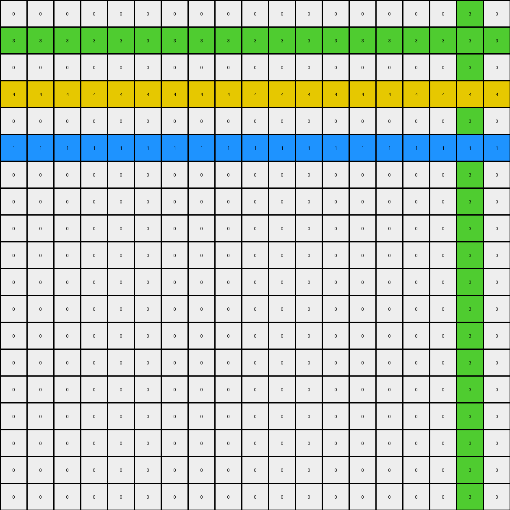
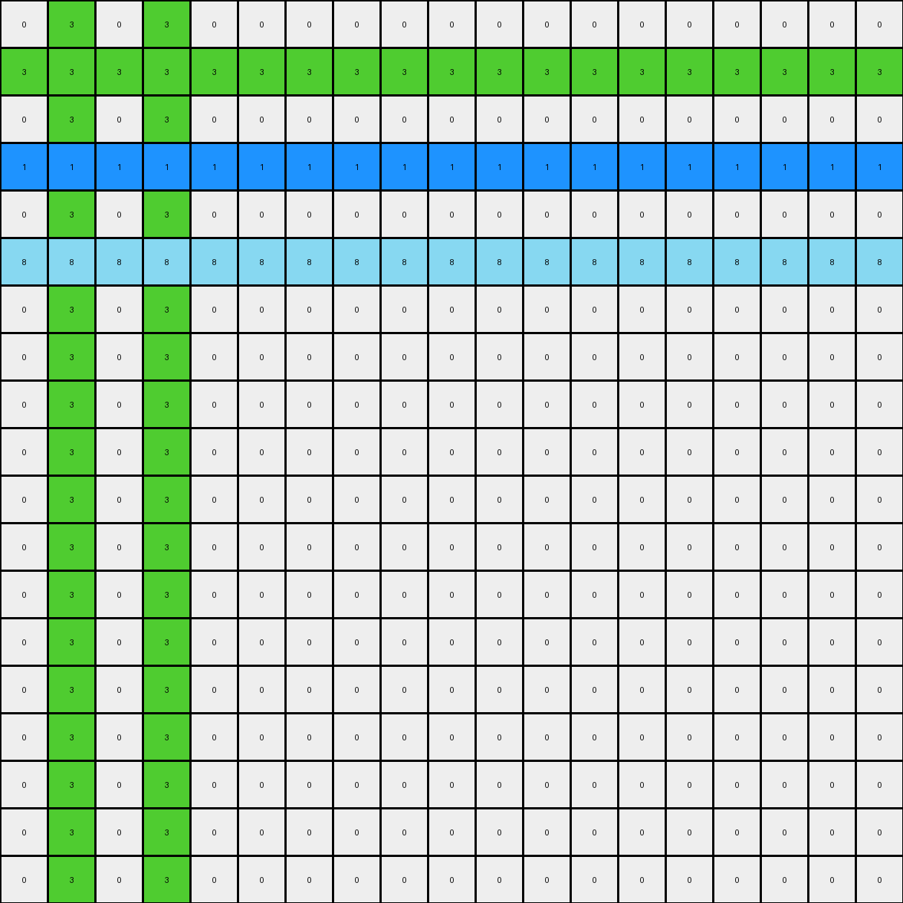

# 9d9215db • 015 • refine_dreamer

---


Previous Code:
```python
"""
1. **Identify Non-Zero Pixels:** Locate all pixels in the input grid that have a color value other than 0 (white). These are the "seed" pixels.

2. **Horizontal Extension/Repetition:** For each seed pixel:
    a. Extend the pixel's color horizontally to the left and right. The pattern alternates between the colors in a row.
    b. The extension length seems to extend to the edges of the input grid, or where the 0 value is encountered.
    c. A minimum length of one unit to the left and the right

3. **Vertical Extension:** The color '3' green expands to fill the height of the grid in its original column

4. **Result:** The output grid is formed by combining these horizontal and vertical expansions. It is as though the seed pixels' colors have "bled" outwards, primarily horizontally but also vertically for color '3'(green).
"""

import numpy as np

def get_nonzero_pixels(grid):
    """Finds the coordinates and colors of non-zero pixels in a grid."""
    nonzero_pixels = []
    for r, row in enumerate(grid):
        for c, value in enumerate(row):
            if value != 0:
                nonzero_pixels.append(((r, c), value))
    return nonzero_pixels

def transform(input_grid):
    """Transforms the input grid according to the defined rules."""
    rows = len(input_grid)
    cols = len(input_grid[0])
    output_grid = np.zeros((rows, cols), dtype=int)

    # Get non-zero pixels
    nonzero_pixels = get_nonzero_pixels(input_grid)
    
    # Horizontal and Vertical Extensions
    for (row, col), value in nonzero_pixels:
        # Horizontal Extension
        
        output_grid[row, :] = input_grid[row,:]
        
        
        left = col - 1
        right = col + 1

        
        while left >= 0:
           output_grid[row, left] = value
           left -= 1

        while right < cols:
            output_grid[row, right] = value
            right += 1
        
        # Vertical Extension (only for green color '3')

        if value == 3:
            output_grid[:, col] = 3

    # replace intermediate zeros
    for (row, col), value in nonzero_pixels:
      for c in range(cols):
        if output_grid[row,c] == 0:
          if c > 0 and c < cols-1:
            if output_grid[row,c-1] != 0 and output_grid[row, c+1] != 0:
              output_grid[row,c] = output_grid[row,c-1]


    return output_grid
```

Train Set Results:

## Example 1:

Input:
```
0 0 0 0 0 0 0 0 0 0 0 0 0 0 0 0 0 0 0
0 8 0 1 0 0 0 0 0 0 0 0 0 0 0 0 0 0 0
0 0 0 0 0 0 0 0 0 0 0 0 0 0 0 0 0 0 0
0 1 0 2 0 0 0 0 0 0 0 0 0 0 0 0 0 0 0
0 0 0 0 0 0 0 0 0 0 0 0 0 0 0 0 0 0 0
0 0 0 0 0 0 0 0 0 0 0 0 0 0 0 0 0 0 0
0 0 0 0 0 0 0 0 0 0 0 0 0 0 0 0 0 0 0
0 0 0 0 0 0 0 0 0 0 0 0 0 0 0 0 0 0 0
0 0 0 0 0 0 0 0 0 0 0 0 0 0 0 0 0 0 0
0 0 0 0 0 0 0 0 0 0 0 0 0 0 0 0 0 0 0
0 0 0 0 0 0 0 0 0 0 0 0 0 0 0 0 0 0 0
0 0 0 0 0 0 0 0 0 0 0 0 0 0 0 0 0 0 0
0 0 0 0 0 0 0 0 0 0 0 0 0 0 0 0 0 0 0
0 0 0 0 0 0 0 0 0 0 0 0 0 0 0 0 0 0 0
0 0 0 0 0 0 0 0 0 0 0 0 0 0 0 0 0 0 0
0 0 0 0 0 0 0 0 0 0 0 0 0 0 0 0 0 0 0
0 0 0 0 0 0 0 0 0 0 0 0 0 0 0 0 0 0 0
0 0 0 0 0 0 0 0 0 0 0 0 0 0 0 0 0 0 0
0 0 0 0 0 0 0 0 0 0 0 0 0 0 0 0 0 0 0
```
Expected Output:
```
0 0 0 0 0 0 0 0 0 0 0 0 0 0 0 0 0 0 0
0 8 0 1 0 1 0 1 0 1 0 1 0 1 0 1 0 8 0
0 0 0 0 0 0 0 0 0 0 0 0 0 0 0 0 0 0 0
0 1 0 2 0 0 0 0 0 0 0 0 0 0 0 2 0 1 0
0 0 0 0 0 0 0 0 0 0 0 0 0 0 0 0 0 0 0
0 1 0 0 0 0 0 0 0 0 0 0 0 0 0 0 0 1 0
0 0 0 0 0 0 0 0 0 0 0 0 0 0 0 0 0 0 0
0 1 0 0 0 0 0 0 0 0 0 0 0 0 0 0 0 1 0
0 0 0 0 0 0 0 0 0 0 0 0 0 0 0 0 0 0 0
0 1 0 0 0 0 0 0 0 0 0 0 0 0 0 0 0 1 0
0 0 0 0 0 0 0 0 0 0 0 0 0 0 0 0 0 0 0
0 1 0 0 0 0 0 0 0 0 0 0 0 0 0 0 0 1 0
0 0 0 0 0 0 0 0 0 0 0 0 0 0 0 0 0 0 0
0 1 0 0 0 0 0 0 0 0 0 0 0 0 0 0 0 1 0
0 0 0 0 0 0 0 0 0 0 0 0 0 0 0 0 0 0 0
0 1 0 2 0 0 0 0 0 0 0 0 0 0 0 2 0 1 0
0 0 0 0 0 0 0 0 0 0 0 0 0 0 0 0 0 0 0
0 8 0 1 0 1 0 1 0 1 0 1 0 1 0 1 0 8 0
0 0 0 0 0 0 0 0 0 0 0 0 0 0 0 0 0 0 0
```
Transformed Output:
```
0 0 0 0 0 0 0 0 0 0 0 0 0 0 0 0 0 0 0
1 1 1 1 1 1 1 1 1 1 1 1 1 1 1 1 1 1 1
0 0 0 0 0 0 0 0 0 0 0 0 0 0 0 0 0 0 0
2 2 2 2 2 2 2 2 2 2 2 2 2 2 2 2 2 2 2
0 0 0 0 0 0 0 0 0 0 0 0 0 0 0 0 0 0 0
0 0 0 0 0 0 0 0 0 0 0 0 0 0 0 0 0 0 0
0 0 0 0 0 0 0 0 0 0 0 0 0 0 0 0 0 0 0
0 0 0 0 0 0 0 0 0 0 0 0 0 0 0 0 0 0 0
0 0 0 0 0 0 0 0 0 0 0 0 0 0 0 0 0 0 0
0 0 0 0 0 0 0 0 0 0 0 0 0 0 0 0 0 0 0
0 0 0 0 0 0 0 0 0 0 0 0 0 0 0 0 0 0 0
0 0 0 0 0 0 0 0 0 0 0 0 0 0 0 0 0 0 0
0 0 0 0 0 0 0 0 0 0 0 0 0 0 0 0 0 0 0
0 0 0 0 0 0 0 0 0 0 0 0 0 0 0 0 0 0 0
0 0 0 0 0 0 0 0 0 0 0 0 0 0 0 0 0 0 0
0 0 0 0 0 0 0 0 0 0 0 0 0 0 0 0 0 0 0
0 0 0 0 0 0 0 0 0 0 0 0 0 0 0 0 0 0 0
0 0 0 0 0 0 0 0 0 0 0 0 0 0 0 0 0 0 0
0 0 0 0 0 0 0 0 0 0 0 0 0 0 0 0 0 0 0
```

match: False
pixels_off: 52
size_correct: True
color_palette_correct: True
correct_pixel_counts: False

## Example 2:

Input:
```
0 0 0 0 0 0 0 0 0 0 0 0 0 0 0 0 0 0 0
0 0 0 0 0 0 0 0 0 0 0 0 0 0 0 0 0 3 0
0 0 0 0 0 0 0 0 0 0 0 0 0 0 0 0 0 0 0
0 0 0 0 0 0 0 0 0 0 0 0 0 1 0 4 0 0 0
0 0 0 0 0 0 0 0 0 0 0 0 0 0 0 0 0 0 0
0 0 0 0 0 0 0 0 0 0 0 0 0 0 0 1 0 0 0
0 0 0 0 0 0 0 0 0 0 0 0 0 0 0 0 0 0 0
0 0 0 0 0 0 0 0 0 0 0 0 0 0 0 0 0 0 0
0 0 0 0 0 0 0 0 0 0 0 0 0 0 0 0 0 0 0
0 0 0 0 0 0 0 0 0 0 0 0 0 0 0 0 0 0 0
0 0 0 0 0 0 0 0 0 0 0 0 0 0 0 0 0 0 0
0 0 0 0 0 0 0 0 0 0 0 0 0 0 0 0 0 0 0
0 0 0 0 0 0 0 0 0 0 0 0 0 0 0 0 0 0 0
0 0 0 0 0 0 0 0 0 0 0 0 0 0 0 0 0 0 0
0 0 0 0 0 0 0 0 0 0 0 0 0 0 0 0 0 0 0
0 0 0 0 0 0 0 0 0 0 0 0 0 0 0 0 0 0 0
0 0 0 0 0 0 0 0 0 0 0 0 0 0 0 0 0 0 0
0 0 0 0 0 0 0 0 0 0 0 0 0 0 0 0 0 0 0
0 0 0 0 0 0 0 0 0 0 0 0 0 0 0 0 0 0 0
```
Expected Output:
```
0 0 0 0 0 0 0 0 0 0 0 0 0 0 0 0 0 0 0
0 3 0 0 0 0 0 0 0 0 0 0 0 0 0 0 0 3 0
0 0 0 0 0 0 0 0 0 0 0 0 0 0 0 0 0 0 0
0 0 0 4 0 1 0 1 0 1 0 1 0 1 0 4 0 0 0
0 0 0 0 0 0 0 0 0 0 0 0 0 0 0 0 0 0 0
0 0 0 1 0 0 0 0 0 0 0 0 0 0 0 1 0 0 0
0 0 0 0 0 0 0 0 0 0 0 0 0 0 0 0 0 0 0
0 0 0 1 0 0 0 0 0 0 0 0 0 0 0 1 0 0 0
0 0 0 0 0 0 0 0 0 0 0 0 0 0 0 0 0 0 0
0 0 0 1 0 0 0 0 0 0 0 0 0 0 0 1 0 0 0
0 0 0 0 0 0 0 0 0 0 0 0 0 0 0 0 0 0 0
0 0 0 1 0 0 0 0 0 0 0 0 0 0 0 1 0 0 0
0 0 0 0 0 0 0 0 0 0 0 0 0 0 0 0 0 0 0
0 0 0 1 0 0 0 0 0 0 0 0 0 0 0 1 0 0 0
0 0 0 0 0 0 0 0 0 0 0 0 0 0 0 0 0 0 0
0 0 0 4 0 1 0 1 0 1 0 1 0 1 0 4 0 0 0
0 0 0 0 0 0 0 0 0 0 0 0 0 0 0 0 0 0 0
0 3 0 0 0 0 0 0 0 0 0 0 0 0 0 0 0 3 0
0 0 0 0 0 0 0 0 0 0 0 0 0 0 0 0 0 0 0
```
Transformed Output:
```
0 0 0 0 0 0 0 0 0 0 0 0 0 0 0 0 0 3 0
3 3 3 3 3 3 3 3 3 3 3 3 3 3 3 3 3 3 3
0 0 0 0 0 0 0 0 0 0 0 0 0 0 0 0 0 3 0
4 4 4 4 4 4 4 4 4 4 4 4 4 4 4 4 4 4 4
0 0 0 0 0 0 0 0 0 0 0 0 0 0 0 0 0 3 0
1 1 1 1 1 1 1 1 1 1 1 1 1 1 1 1 1 1 1
0 0 0 0 0 0 0 0 0 0 0 0 0 0 0 0 0 3 0
0 0 0 0 0 0 0 0 0 0 0 0 0 0 0 0 0 3 0
0 0 0 0 0 0 0 0 0 0 0 0 0 0 0 0 0 3 0
0 0 0 0 0 0 0 0 0 0 0 0 0 0 0 0 0 3 0
0 0 0 0 0 0 0 0 0 0 0 0 0 0 0 0 0 3 0
0 0 0 0 0 0 0 0 0 0 0 0 0 0 0 0 0 3 0
0 0 0 0 0 0 0 0 0 0 0 0 0 0 0 0 0 3 0
0 0 0 0 0 0 0 0 0 0 0 0 0 0 0 0 0 3 0
0 0 0 0 0 0 0 0 0 0 0 0 0 0 0 0 0 3 0
0 0 0 0 0 0 0 0 0 0 0 0 0 0 0 0 0 3 0
0 0 0 0 0 0 0 0 0 0 0 0 0 0 0 0 0 3 0
0 0 0 0 0 0 0 0 0 0 0 0 0 0 0 0 0 3 0
0 0 0 0 0 0 0 0 0 0 0 0 0 0 0 0 0 3 0
```

match: False
pixels_off: 82
size_correct: True
color_palette_correct: True
correct_pixel_counts: False

## Example 3:

Input:
```
0 0 0 0 0 0 0 0 0 0 0 0 0 0 0 0 0 0 0
0 4 0 3 0 0 0 0 0 0 0 0 0 0 0 0 0 0 0
0 0 0 0 0 0 0 0 0 0 0 0 0 0 0 0 0 0 0
0 3 0 1 0 0 0 0 0 0 0 0 0 0 0 0 0 0 0
0 0 0 0 0 0 0 0 0 0 0 0 0 0 0 0 0 0 0
0 0 0 0 0 8 0 0 0 0 0 0 0 0 0 0 0 0 0
0 0 0 0 0 0 0 0 0 0 0 0 0 0 0 0 0 0 0
0 0 0 0 0 0 0 0 0 0 0 0 0 0 0 0 0 0 0
0 0 0 0 0 0 0 0 0 0 0 0 0 0 0 0 0 0 0
0 0 0 0 0 0 0 0 0 0 0 0 0 0 0 0 0 0 0
0 0 0 0 0 0 0 0 0 0 0 0 0 0 0 0 0 0 0
0 0 0 0 0 0 0 0 0 0 0 0 0 0 0 0 0 0 0
0 0 0 0 0 0 0 0 0 0 0 0 0 0 0 0 0 0 0
0 0 0 0 0 0 0 0 0 0 0 0 0 0 0 0 0 0 0
0 0 0 0 0 0 0 0 0 0 0 0 0 0 0 0 0 0 0
0 0 0 0 0 0 0 0 0 0 0 0 0 0 0 0 0 0 0
0 0 0 0 0 0 0 0 0 0 0 0 0 0 0 0 0 0 0
0 0 0 0 0 0 0 0 0 0 0 0 0 0 0 0 0 0 0
0 0 0 0 0 0 0 0 0 0 0 0 0 0 0 0 0 0 0
```
Expected Output:
```
0 0 0 0 0 0 0 0 0 0 0 0 0 0 0 0 0 0 0
0 4 0 3 0 3 0 3 0 3 0 3 0 3 0 3 0 4 0
0 0 0 0 0 0 0 0 0 0 0 0 0 0 0 0 0 0 0
0 3 0 1 0 0 0 0 0 0 0 0 0 0 0 1 0 3 0
0 0 0 0 0 0 0 0 0 0 0 0 0 0 0 0 0 0 0
0 3 0 0 0 8 0 0 0 0 0 0 0 8 0 0 0 3 0
0 0 0 0 0 0 0 0 0 0 0 0 0 0 0 0 0 0 0
0 3 0 0 0 0 0 0 0 0 0 0 0 0 0 0 0 3 0
0 0 0 0 0 0 0 0 0 0 0 0 0 0 0 0 0 0 0
0 3 0 0 0 0 0 0 0 0 0 0 0 0 0 0 0 3 0
0 0 0 0 0 0 0 0 0 0 0 0 0 0 0 0 0 0 0
0 3 0 0 0 0 0 0 0 0 0 0 0 0 0 0 0 3 0
0 0 0 0 0 0 0 0 0 0 0 0 0 0 0 0 0 0 0
0 3 0 0 0 8 0 0 0 0 0 0 0 8 0 0 0 3 0
0 0 0 0 0 0 0 0 0 0 0 0 0 0 0 0 0 0 0
0 3 0 1 0 0 0 0 0 0 0 0 0 0 0 1 0 3 0
0 0 0 0 0 0 0 0 0 0 0 0 0 0 0 0 0 0 0
0 4 0 3 0 3 0 3 0 3 0 3 0 3 0 3 0 4 0
0 0 0 0 0 0 0 0 0 0 0 0 0 0 0 0 0 0 0
```
Transformed Output:
```
0 3 0 3 0 0 0 0 0 0 0 0 0 0 0 0 0 0 0
3 3 3 3 3 3 3 3 3 3 3 3 3 3 3 3 3 3 3
0 3 0 3 0 0 0 0 0 0 0 0 0 0 0 0 0 0 0
1 1 1 1 1 1 1 1 1 1 1 1 1 1 1 1 1 1 1
0 3 0 3 0 0 0 0 0 0 0 0 0 0 0 0 0 0 0
8 8 8 8 8 8 8 8 8 8 8 8 8 8 8 8 8 8 8
0 3 0 3 0 0 0 0 0 0 0 0 0 0 0 0 0 0 0
0 3 0 3 0 0 0 0 0 0 0 0 0 0 0 0 0 0 0
0 3 0 3 0 0 0 0 0 0 0 0 0 0 0 0 0 0 0
0 3 0 3 0 0 0 0 0 0 0 0 0 0 0 0 0 0 0
0 3 0 3 0 0 0 0 0 0 0 0 0 0 0 0 0 0 0
0 3 0 3 0 0 0 0 0 0 0 0 0 0 0 0 0 0 0
0 3 0 3 0 0 0 0 0 0 0 0 0 0 0 0 0 0 0
0 3 0 3 0 0 0 0 0 0 0 0 0 0 0 0 0 0 0
0 3 0 3 0 0 0 0 0 0 0 0 0 0 0 0 0 0 0
0 3 0 3 0 0 0 0 0 0 0 0 0 0 0 0 0 0 0
0 3 0 3 0 0 0 0 0 0 0 0 0 0 0 0 0 0 0
0 3 0 3 0 0 0 0 0 0 0 0 0 0 0 0 0 0 0
0 3 0 3 0 0 0 0 0 0 0 0 0 0 0 0 0 0 0
```

match: False
pixels_off: 87
size_correct: True
color_palette_correct: True
correct_pixel_counts: False

**INSTRUCTIONS**

The code above was generated based on observations from the first training
example

we have tested the transform function on each of the task example inputs and
compared with the expected output

review each of the examples provided and the results and consider how the
natural language program should be updated to accommodate this new knowledge

respond with the following deliverables:

- general assessment of the information provided and strategy for resolving the
  errors
- gather metrics about each of the examples and results - use code_execution to
  develop accurate reports on your assumptions
- a YAML block documenting facts - Focus on identifying objects, their properties, and the actions performed on them.
- a natural language program - Be as clear and concise as possible, providing a complete description of the transformation rule.


your responses should be considered as information in a report - not a
conversation
