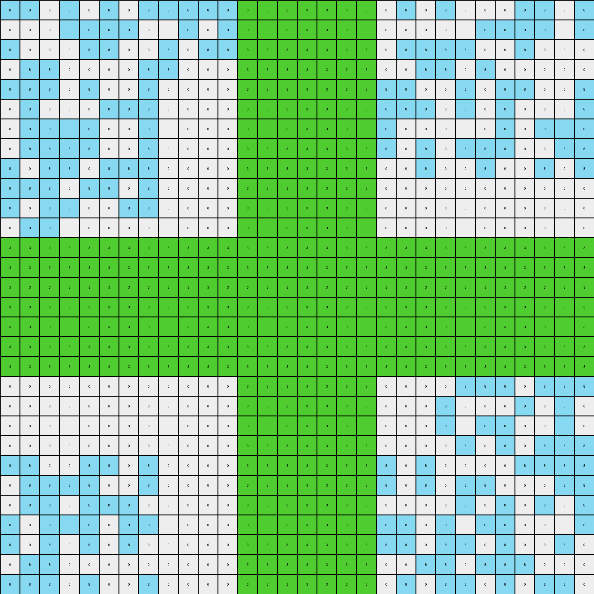

# a64e4611 • 003 • refine_dreamer

---

Previous Code:
```python
"""
The transformation overlays a green (3) cross shape onto the existing background grid. The background grid consists
of azure (8) and white (0) pixels. The cross shape is centered on the grid.
"""

import numpy as np

def find_background(grid):
    # simple function to find the most prevalent colors to ignore
    # in this case return the two most freqent color, which will be ignored as background.
    unique, counts = np.unique(grid, return_counts=True)
    # sort to put most frequent colors at the end
    return unique[np.argsort(counts)][-2:]

def create_cross(grid, cross_color=3):
    # initialize cross grid based on size of input_grid
    rows, cols = grid.shape
    cross = np.zeros_like(grid)

    background_colors = find_background(grid)
    
    # find center row, col
    center_row = rows // 2
    center_col = cols // 2

    # Determine a reasonable thickness, this may need further refinement
    thickness = 1
    if rows>15:
        thickness = 3
    elif rows > 25:
        thickness = 5
    # else:
    #   thickness = 1

    # vertical part of the cross - starting at center row, and based on thickness 
    cross[center_row-thickness:center_row+thickness+1, :] = cross_color

    # horizontal part of cross - start at center col
    cross[:, center_col-thickness:center_col+thickness+1] = cross_color

    return cross

def transform(input_grid):
    """
    Overlays a green cross shape onto the input grid.
    """
    # initialize output_grid as copy of input
    output_grid = input_grid.copy()

    # create cross based on the input_grid size
    cross = create_cross(input_grid)
    
    background_colors = find_background(input_grid)

    # overlay
    for r in range(output_grid.shape[0]):
      for c in range(output_grid.shape[1]):
        if cross[r][c]!=0:
          output_grid[r,c] = cross[r,c]
    
    return output_grid
```

Train Set Results:

## Example 1:

Input:
```
8 8 0 8 0 8 0 8 8 8 8 8 0 8 8 8 0 8 0 0 8 0 8 0 0 0 8 8 0 8
0 0 0 8 8 8 8 0 0 8 0 8 0 0 8 8 0 0 8 0 0 0 0 0 8 8 8 8 0 8
8 0 0 0 8 8 0 0 8 0 8 8 0 8 8 0 8 0 8 0 8 8 8 8 0 0 8 0 0 0
0 8 8 0 0 0 0 8 8 0 0 0 0 8 8 0 8 8 0 0 0 8 8 0 8 0 0 0 0 0
8 8 8 0 8 0 0 8 0 0 0 0 0 0 0 0 0 8 8 8 8 0 0 8 0 8 8 0 0 8
0 8 0 0 0 8 8 8 0 0 0 0 0 0 0 0 0 0 8 8 8 8 0 8 0 8 0 0 0 8
0 8 8 8 8 0 0 8 0 0 0 0 0 0 0 0 0 8 8 8 0 0 0 0 0 8 0 8 8 8
0 8 8 8 8 0 0 8 0 0 0 0 0 0 0 0 0 0 0 8 0 8 0 8 8 8 0 0 8 8
8 0 8 8 0 8 8 8 0 0 0 0 0 0 0 0 0 8 0 0 0 8 0 0 8 0 0 8 0 8
8 8 8 0 8 8 0 8 0 0 0 0 0 0 0 0 0 0 0 0 0 0 0 0 0 0 0 0 0 0
8 0 8 8 0 0 8 8 0 0 0 0 0 0 0 0 0 0 0 0 0 0 0 0 0 0 0 0 0 0
0 8 8 0 0 0 0 0 0 0 0 0 0 0 0 0 0 0 0 0 0 0 0 0 0 0 0 0 0 0
0 8 0 0 8 0 0 8 0 0 0 0 0 0 0 0 0 0 0 0 0 0 0 0 0 0 0 0 0 0
8 8 8 8 8 0 0 0 0 0 0 0 0 0 0 0 0 0 0 0 0 8 0 8 8 0 8 8 0 8
8 0 8 8 0 0 8 8 0 0 0 0 0 0 0 0 0 8 8 0 8 0 0 0 8 0 0 0 8 8
8 0 8 0 0 8 8 0 0 0 0 0 0 0 0 0 0 0 0 8 0 8 8 0 0 0 8 0 8 8
0 0 8 8 8 8 0 0 0 0 0 0 0 0 0 0 0 8 8 0 0 0 8 8 0 8 8 0 0 8
8 0 8 0 0 8 8 8 0 0 0 0 0 0 0 0 0 8 8 8 8 0 8 8 0 0 0 8 8 0
8 0 8 8 0 8 0 8 0 0 0 0 0 0 0 0 0 0 8 8 8 0 8 0 8 0 8 0 0 0
0 0 0 0 0 0 0 0 0 0 0 0 0 0 0 0 0 0 8 0 0 0 0 8 8 8 0 8 8 8
0 0 0 0 0 0 0 0 0 0 0 0 0 0 0 0 0 0 0 0 0 0 8 0 0 0 8 0 8 0
0 0 0 0 0 0 0 0 0 0 0 0 0 0 0 0 0 8 0 0 0 0 8 0 8 8 0 0 8 0
0 0 0 0 0 0 0 0 0 0 0 0 0 0 0 0 0 0 8 0 0 0 0 8 0 8 0 8 8 8
8 8 0 0 8 8 0 8 0 0 0 0 0 0 0 0 0 8 8 8 0 8 0 0 0 0 8 8 8 8
0 8 8 8 8 0 0 8 0 0 0 0 0 0 0 0 0 8 0 8 0 8 0 8 8 0 0 0 8 8
0 8 8 0 8 8 8 0 0 0 0 0 0 0 0 0 0 0 0 0 0 0 0 8 0 8 0 8 0 8
8 0 8 8 8 0 8 8 0 0 0 0 0 0 0 0 0 0 8 8 8 0 8 0 8 8 0 0 0 8
8 0 8 0 8 0 8 0 0 0 0 0 0 0 0 0 0 8 0 8 8 0 8 8 0 8 0 0 8 0
0 8 8 0 0 0 0 0 0 0 0 0 0 0 0 0 0 0 8 0 0 8 8 0 8 8 8 0 0 0
8 8 8 0 8 0 0 8 0 0 0 0 0 0 0 0 0 8 8 0 8 0 8 8 0 8 0 8 8 0
```
Expected Output:
```
8 8 0 8 0 8 0 8 8 8 8 8 0 8 8 8 0 8 0 0 8 0 8 0 0 0 8 8 0 8
0 0 0 8 8 8 8 0 0 8 0 8 0 0 8 8 0 0 8 0 0 0 0 0 8 8 8 8 0 8
8 0 0 0 8 8 0 0 8 0 8 8 0 8 8 0 8 0 8 0 8 8 8 8 0 0 8 0 0 0
0 8 8 0 0 0 0 8 8 0 0 0 0 8 8 0 8 8 0 0 0 8 8 0 8 0 0 0 0 0
8 8 8 0 8 0 0 8 0 0 0 0 0 0 0 0 0 8 8 8 8 0 0 8 0 8 8 0 0 8
0 8 0 0 0 8 8 8 0 3 3 3 3 3 3 3 0 0 8 8 8 8 0 8 0 8 0 0 0 8
0 8 8 8 8 0 0 8 0 3 3 3 3 3 3 3 0 8 8 8 0 0 0 0 0 8 0 8 8 8
0 8 8 8 8 0 0 8 0 3 3 3 3 3 3 3 0 0 0 8 0 8 0 8 8 8 0 0 8 8
8 0 8 8 0 8 8 8 0 3 3 3 3 3 3 3 0 8 0 0 0 8 0 0 8 0 0 8 0 8
8 8 8 0 8 8 0 8 0 3 3 3 3 3 3 3 0 0 0 0 0 0 0 0 0 0 0 0 0 0
8 0 8 8 0 0 8 8 0 3 3 3 3 3 3 3 3 3 3 3 3 3 3 3 3 3 3 3 3 3
0 8 8 0 0 0 0 0 0 3 3 3 3 3 3 3 3 3 3 3 3 3 3 3 3 3 3 3 3 3
0 8 0 0 8 0 0 8 0 3 3 3 3 3 3 3 0 0 0 0 0 0 0 0 0 0 0 0 0 0
8 8 8 8 8 0 0 0 0 3 3 3 3 3 3 3 0 0 0 0 0 8 0 8 8 0 8 8 0 8
8 0 8 8 0 0 8 8 0 3 3 3 3 3 3 3 0 8 8 0 8 0 0 0 8 0 0 0 8 8
8 0 8 0 0 8 8 0 0 3 3 3 3 3 3 3 0 0 0 8 0 8 8 0 0 0 8 0 8 8
0 0 8 8 8 8 0 0 0 3 3 3 3 3 3 3 0 8 8 0 0 0 8 8 0 8 8 0 0 8
8 0 8 0 0 8 8 8 0 3 3 3 3 3 3 3 0 8 8 8 8 0 8 8 0 0 0 8 8 0
8 0 8 8 0 8 0 8 0 3 3 3 3 3 3 3 0 0 8 8 8 0 8 0 8 0 8 0 0 0
0 0 0 0 0 0 0 0 0 3 3 3 3 3 3 3 0 0 8 0 0 0 0 8 8 8 0 8 8 8
3 3 3 3 3 3 3 3 3 3 3 3 3 3 3 3 0 0 0 0 0 0 8 0 0 0 8 0 8 0
3 3 3 3 3 3 3 3 3 3 3 3 3 3 3 3 0 8 0 0 0 0 8 0 8 8 0 0 8 0
0 0 0 0 0 0 0 0 0 3 3 3 3 3 3 3 0 0 8 0 0 0 0 8 0 8 0 8 8 8
8 8 0 0 8 8 0 8 0 3 3 3 3 3 3 3 0 8 8 8 0 8 0 0 0 0 8 8 8 8
0 8 8 8 8 0 0 8 0 3 3 3 3 3 3 3 0 8 0 8 0 8 0 8 8 0 0 0 8 8
0 8 8 0 8 8 8 0 0 3 3 3 3 3 3 3 0 0 0 0 0 0 0 8 0 8 0 8 0 8
8 0 8 8 8 0 8 8 0 3 3 3 3 3 3 3 0 0 8 8 8 0 8 0 8 8 0 0 0 8
8 0 8 0 8 0 8 0 0 3 3 3 3 3 3 3 0 8 0 8 8 0 8 8 0 8 0 0 8 0
0 8 8 0 0 0 0 0 0 3 3 3 3 3 3 3 0 0 8 0 0 8 8 0 8 8 8 0 0 0
8 8 8 0 8 0 0 8 0 3 3 3 3 3 3 3 0 8 8 0 8 0 8 8 0 8 0 8 8 0
```
Transformed Output:
```
8 8 0 8 0 8 0 8 8 8 8 8 3 3 3 3 3 3 3 0 8 0 8 0 0 0 8 8 0 8
0 0 0 8 8 8 8 0 0 8 0 8 3 3 3 3 3 3 3 0 0 0 0 0 8 8 8 8 0 8
8 0 0 0 8 8 0 0 8 0 8 8 3 3 3 3 3 3 3 0 8 8 8 8 0 0 8 0 0 0
0 8 8 0 0 0 0 8 8 0 0 0 3 3 3 3 3 3 3 0 0 8 8 0 8 0 0 0 0 0
8 8 8 0 8 0 0 8 0 0 0 0 3 3 3 3 3 3 3 8 8 0 0 8 0 8 8 0 0 8
0 8 0 0 0 8 8 8 0 0 0 0 3 3 3 3 3 3 3 8 8 8 0 8 0 8 0 0 0 8
0 8 8 8 8 0 0 8 0 0 0 0 3 3 3 3 3 3 3 8 0 0 0 0 0 8 0 8 8 8
0 8 8 8 8 0 0 8 0 0 0 0 3 3 3 3 3 3 3 8 0 8 0 8 8 8 0 0 8 8
8 0 8 8 0 8 8 8 0 0 0 0 3 3 3 3 3 3 3 0 0 8 0 0 8 0 0 8 0 8
8 8 8 0 8 8 0 8 0 0 0 0 3 3 3 3 3 3 3 0 0 0 0 0 0 0 0 0 0 0
8 0 8 8 0 0 8 8 0 0 0 0 3 3 3 3 3 3 3 0 0 0 0 0 0 0 0 0 0 0
0 8 8 0 0 0 0 0 0 0 0 0 3 3 3 3 3 3 3 0 0 0 0 0 0 0 0 0 0 0
3 3 3 3 3 3 3 3 3 3 3 3 3 3 3 3 3 3 3 3 3 3 3 3 3 3 3 3 3 3
3 3 3 3 3 3 3 3 3 3 3 3 3 3 3 3 3 3 3 3 3 3 3 3 3 3 3 3 3 3
3 3 3 3 3 3 3 3 3 3 3 3 3 3 3 3 3 3 3 3 3 3 3 3 3 3 3 3 3 3
3 3 3 3 3 3 3 3 3 3 3 3 3 3 3 3 3 3 3 3 3 3 3 3 3 3 3 3 3 3
3 3 3 3 3 3 3 3 3 3 3 3 3 3 3 3 3 3 3 3 3 3 3 3 3 3 3 3 3 3
3 3 3 3 3 3 3 3 3 3 3 3 3 3 3 3 3 3 3 3 3 3 3 3 3 3 3 3 3 3
3 3 3 3 3 3 3 3 3 3 3 3 3 3 3 3 3 3 3 3 3 3 3 3 3 3 3 3 3 3
0 0 0 0 0 0 0 0 0 0 0 0 3 3 3 3 3 3 3 0 0 0 0 8 8 8 0 8 8 8
0 0 0 0 0 0 0 0 0 0 0 0 3 3 3 3 3 3 3 0 0 0 8 0 0 0 8 0 8 0
0 0 0 0 0 0 0 0 0 0 0 0 3 3 3 3 3 3 3 0 0 0 8 0 8 8 0 0 8 0
0 0 0 0 0 0 0 0 0 0 0 0 3 3 3 3 3 3 3 0 0 0 0 8 0 8 0 8 8 8
8 8 0 0 8 8 0 8 0 0 0 0 3 3 3 3 3 3 3 8 0 8 0 0 0 0 8 8 8 8
0 8 8 8 8 0 0 8 0 0 0 0 3 3 3 3 3 3 3 8 0 8 0 8 8 0 0 0 8 8
0 8 8 0 8 8 8 0 0 0 0 0 3 3 3 3 3 3 3 0 0 0 0 8 0 8 0 8 0 8
8 0 8 8 8 0 8 8 0 0 0 0 3 3 3 3 3 3 3 8 8 0 8 0 8 8 0 0 0 8
8 0 8 0 8 0 8 0 0 0 0 0 3 3 3 3 3 3 3 8 8 0 8 8 0 8 0 0 8 0
0 8 8 0 0 0 0 0 0 0 0 0 3 3 3 3 3 3 3 0 0 8 8 0 8 8 8 0 0 0
8 8 8 0 8 0 0 8 0 0 0 0 3 3 3 3 3 3 3 0 8 0 8 8 0 8 0 8 8 0
```

match: False
pixels_off: 338
size_correct: True
color_palette_correct: True
correct_pixel_counts: False

## Example 2:

Input:
```
1 1 1 0 0 0 0 0 0 0 0 0 0 0 1 0 1 0 0 0 1 1 1 1 0 1 1 1 1 0
0 0 1 0 1 0 0 0 0 0 0 0 0 0 1 1 1 1 0 1 0 1 1 0 0 1 1 1 0 0
0 0 1 1 0 0 0 0 0 0 0 0 0 0 1 1 1 0 0 1 0 1 0 1 0 0 1 0 1 0
0 0 1 1 1 0 0 0 0 0 0 0 0 0 1 1 0 0 1 1 0 1 1 1 0 1 0 1 0 1
0 1 0 0 0 0 0 0 0 0 0 0 0 0 0 1 0 1 1 1 1 0 1 1 0 0 1 0 0 1
0 0 1 1 1 0 0 0 0 0 0 0 0 0 0 0 1 0 0 0 1 1 0 1 1 0 0 1 0 1
0 1 0 1 0 0 0 0 0 0 0 0 0 0 0 0 0 0 0 0 0 0 0 0 0 0 0 0 0 0
1 1 1 0 1 0 0 0 0 0 0 0 0 0 0 0 0 0 0 0 0 0 0 0 0 0 0 0 0 0
0 0 1 0 1 0 0 0 0 0 0 0 0 0 0 0 0 0 0 0 0 0 0 0 0 0 0 0 0 0
1 0 1 1 1 0 0 0 0 0 0 0 0 0 0 1 0 1 1 1 0 1 0 0 0 0 0 1 1 1
0 1 1 1 1 0 0 0 0 0 0 0 0 0 0 0 1 1 1 0 0 1 0 0 0 1 1 0 0 0
0 1 1 0 0 0 0 0 0 0 0 0 0 0 0 1 0 1 0 1 0 1 0 1 0 1 0 0 0 1
1 1 1 0 1 0 0 0 0 0 0 0 0 0 1 0 1 0 0 0 1 0 0 0 1 1 0 0 1 1
1 0 0 0 0 0 0 0 0 0 0 0 0 0 1 0 1 1 0 1 1 1 1 0 0 0 0 1 0 1
0 1 1 0 1 0 0 0 0 0 0 0 0 0 1 1 0 0 1 0 1 1 1 1 0 0 1 1 1 1
1 1 0 0 1 0 0 0 0 0 0 0 0 0 1 0 1 1 1 0 0 0 1 0 1 1 0 1 0 1
0 1 1 0 0 0 0 0 0 0 0 0 0 0 0 0 0 0 0 0 0 0 0 0 0 0 0 0 0 0
1 0 0 1 1 0 0 0 0 0 0 0 0 0 0 0 0 0 0 0 0 0 0 0 0 0 0 0 0 0
1 0 1 0 0 0 0 0 0 0 0 0 0 0 0 0 0 0 0 0 0 0 0 0 0 0 0 0 0 0
1 1 0 1 1 0 0 0 0 0 0 0 0 0 0 0 0 0 0 0 0 0 0 0 0 0 0 0 0 0
1 0 1 1 1 0 0 0 0 0 0 0 0 0 0 1 0 1 0 0 0 1 0 0 1 0 0 1 0 1
0 0 1 0 0 0 0 0 0 0 0 0 0 0 1 1 0 0 0 0 0 1 0 1 0 0 1 1 0 0
1 0 0 0 0 0 0 0 0 0 0 0 0 0 0 0 0 0 1 1 1 0 1 0 0 0 1 1 1 1
0 1 0 1 0 0 0 0 0 0 0 0 0 0 0 0 1 1 0 0 1 1 0 0 0 1 0 0 0 0
1 1 1 0 1 0 0 0 0 0 0 0 0 0 0 0 1 1 0 0 0 1 1 0 0 1 1 1 1 0
0 0 1 0 1 0 0 0 0 0 0 0 0 0 1 0 1 1 1 1 1 1 0 1 0 0 1 1 0 0
0 0 1 0 0 0 0 0 0 0 0 0 0 0 1 1 0 0 0 0 1 0 0 1 0 0 1 1 1 0
0 0 1 1 1 0 0 0 0 0 0 0 0 0 0 0 0 1 1 1 1 0 0 1 0 0 0 1 1 1
1 0 1 0 1 0 0 0 0 0 0 0 0 0 1 0 0 0 0 0 0 1 1 0 0 1 1 0 0 1
1 0 1 1 0 0 0 0 0 0 0 0 0 0 0 0 1 1 1 0 0 1 0 1 1 0 1 1 1 0
```
Expected Output:
```
1 1 1 0 0 0 3 3 3 3 3 3 3 0 1 0 1 0 0 0 1 1 1 1 0 1 1 1 1 0
0 0 1 0 1 0 3 3 3 3 3 3 3 0 1 1 1 1 0 1 0 1 1 0 0 1 1 1 0 0
0 0 1 1 0 0 3 3 3 3 3 3 3 0 1 1 1 0 0 1 0 1 0 1 0 0 1 0 1 0
0 0 1 1 1 0 3 3 3 3 3 3 3 0 1 1 0 0 1 1 0 1 1 1 0 1 0 1 0 1
0 1 0 0 0 0 3 3 3 3 3 3 3 0 0 1 0 1 1 1 1 0 1 1 0 0 1 0 0 1
0 0 1 1 1 0 3 3 3 3 3 3 3 0 0 0 1 0 0 0 1 1 0 1 1 0 0 1 0 1
0 1 0 1 0 0 3 3 3 3 3 3 3 0 0 0 0 0 0 0 0 0 0 0 0 0 0 0 0 0
1 1 1 0 1 0 3 3 3 3 3 3 3 3 3 3 3 3 3 3 3 3 3 3 3 3 3 3 3 3
0 0 1 0 1 0 3 3 3 3 3 3 3 0 0 0 0 0 0 0 0 0 0 0 0 0 0 0 0 0
1 0 1 1 1 0 3 3 3 3 3 3 3 0 0 1 0 1 1 1 0 1 0 0 0 0 0 1 1 1
0 1 1 1 1 0 3 3 3 3 3 3 3 0 0 0 1 1 1 0 0 1 0 0 0 1 1 0 0 0
0 1 1 0 0 0 3 3 3 3 3 3 3 0 0 1 0 1 0 1 0 1 0 1 0 1 0 0 0 1
1 1 1 0 1 0 3 3 3 3 3 3 3 0 1 0 1 0 0 0 1 0 0 0 1 1 0 0 1 1
1 0 0 0 0 0 3 3 3 3 3 3 3 0 1 0 1 1 0 1 1 1 1 0 0 0 0 1 0 1
0 1 1 0 1 0 3 3 3 3 3 3 3 0 1 1 0 0 1 0 1 1 1 1 0 0 1 1 1 1
1 1 0 0 1 0 3 3 3 3 3 3 3 0 1 0 1 1 1 0 0 0 1 0 1 1 0 1 0 1
0 1 1 0 0 0 3 3 3 3 3 3 3 0 0 0 0 0 0 0 0 0 0 0 0 0 0 0 0 0
1 0 0 1 1 0 3 3 3 3 3 3 3 3 3 3 3 3 3 3 3 3 3 3 3 3 3 3 3 3
1 0 1 0 0 0 3 3 3 3 3 3 3 3 3 3 3 3 3 3 3 3 3 3 3 3 3 3 3 3
1 1 0 1 1 0 3 3 3 3 3 3 3 0 0 0 0 0 0 0 0 0 0 0 0 0 0 0 0 0
1 0 1 1 1 0 3 3 3 3 3 3 3 0 0 1 0 1 0 0 0 1 0 0 1 0 0 1 0 1
0 0 1 0 0 0 3 3 3 3 3 3 3 0 1 1 0 0 0 0 0 1 0 1 0 0 1 1 0 0
1 0 0 0 0 0 3 3 3 3 3 3 3 0 0 0 0 0 1 1 1 0 1 0 0 0 1 1 1 1
0 1 0 1 0 0 3 3 3 3 3 3 3 0 0 0 1 1 0 0 1 1 0 0 0 1 0 0 0 0
1 1 1 0 1 0 3 3 3 3 3 3 3 0 0 0 1 1 0 0 0 1 1 0 0 1 1 1 1 0
0 0 1 0 1 0 3 3 3 3 3 3 3 0 1 0 1 1 1 1 1 1 0 1 0 0 1 1 0 0
0 0 1 0 0 0 3 3 3 3 3 3 3 0 1 1 0 0 0 0 1 0 0 1 0 0 1 1 1 0
0 0 1 1 1 0 3 3 3 3 3 3 3 0 0 0 0 1 1 1 1 0 0 1 0 0 0 1 1 1
1 0 1 0 1 0 3 3 3 3 3 3 3 0 1 0 0 0 0 0 0 1 1 0 0 1 1 0 0 1
1 0 1 1 0 0 3 3 3 3 3 3 3 0 0 0 1 1 1 0 0 1 0 1 1 0 1 1 1 0
```
Transformed Output:
```
1 1 1 0 0 0 0 0 0 0 0 0 3 3 3 3 3 3 3 0 1 1 1 1 0 1 1 1 1 0
0 0 1 0 1 0 0 0 0 0 0 0 3 3 3 3 3 3 3 1 0 1 1 0 0 1 1 1 0 0
0 0 1 1 0 0 0 0 0 0 0 0 3 3 3 3 3 3 3 1 0 1 0 1 0 0 1 0 1 0
0 0 1 1 1 0 0 0 0 0 0 0 3 3 3 3 3 3 3 1 0 1 1 1 0 1 0 1 0 1
0 1 0 0 0 0 0 0 0 0 0 0 3 3 3 3 3 3 3 1 1 0 1 1 0 0 1 0 0 1
0 0 1 1 1 0 0 0 0 0 0 0 3 3 3 3 3 3 3 0 1 1 0 1 1 0 0 1 0 1
0 1 0 1 0 0 0 0 0 0 0 0 3 3 3 3 3 3 3 0 0 0 0 0 0 0 0 0 0 0
1 1 1 0 1 0 0 0 0 0 0 0 3 3 3 3 3 3 3 0 0 0 0 0 0 0 0 0 0 0
0 0 1 0 1 0 0 0 0 0 0 0 3 3 3 3 3 3 3 0 0 0 0 0 0 0 0 0 0 0
1 0 1 1 1 0 0 0 0 0 0 0 3 3 3 3 3 3 3 1 0 1 0 0 0 0 0 1 1 1
0 1 1 1 1 0 0 0 0 0 0 0 3 3 3 3 3 3 3 0 0 1 0 0 0 1 1 0 0 0
0 1 1 0 0 0 0 0 0 0 0 0 3 3 3 3 3 3 3 1 0 1 0 1 0 1 0 0 0 1
3 3 3 3 3 3 3 3 3 3 3 3 3 3 3 3 3 3 3 3 3 3 3 3 3 3 3 3 3 3
3 3 3 3 3 3 3 3 3 3 3 3 3 3 3 3 3 3 3 3 3 3 3 3 3 3 3 3 3 3
3 3 3 3 3 3 3 3 3 3 3 3 3 3 3 3 3 3 3 3 3 3 3 3 3 3 3 3 3 3
3 3 3 3 3 3 3 3 3 3 3 3 3 3 3 3 3 3 3 3 3 3 3 3 3 3 3 3 3 3
3 3 3 3 3 3 3 3 3 3 3 3 3 3 3 3 3 3 3 3 3 3 3 3 3 3 3 3 3 3
3 3 3 3 3 3 3 3 3 3 3 3 3 3 3 3 3 3 3 3 3 3 3 3 3 3 3 3 3 3
3 3 3 3 3 3 3 3 3 3 3 3 3 3 3 3 3 3 3 3 3 3 3 3 3 3 3 3 3 3
1 1 0 1 1 0 0 0 0 0 0 0 3 3 3 3 3 3 3 0 0 0 0 0 0 0 0 0 0 0
1 0 1 1 1 0 0 0 0 0 0 0 3 3 3 3 3 3 3 0 0 1 0 0 1 0 0 1 0 1
0 0 1 0 0 0 0 0 0 0 0 0 3 3 3 3 3 3 3 0 0 1 0 1 0 0 1 1 0 0
1 0 0 0 0 0 0 0 0 0 0 0 3 3 3 3 3 3 3 1 1 0 1 0 0 0 1 1 1 1
0 1 0 1 0 0 0 0 0 0 0 0 3 3 3 3 3 3 3 0 1 1 0 0 0 1 0 0 0 0
1 1 1 0 1 0 0 0 0 0 0 0 3 3 3 3 3 3 3 0 0 1 1 0 0 1 1 1 1 0
0 0 1 0 1 0 0 0 0 0 0 0 3 3 3 3 3 3 3 1 1 1 0 1 0 0 1 1 0 0
0 0 1 0 0 0 0 0 0 0 0 0 3 3 3 3 3 3 3 0 1 0 0 1 0 0 1 1 1 0
0 0 1 1 1 0 0 0 0 0 0 0 3 3 3 3 3 3 3 1 1 0 0 1 0 0 0 1 1 1
1 0 1 0 1 0 0 0 0 0 0 0 3 3 3 3 3 3 3 0 0 1 1 0 0 1 1 0 0 1
1 0 1 1 0 0 0 0 0 0 0 0 3 3 3 3 3 3 3 0 0 1 0 1 1 0 1 1 1 0
```

match: False
pixels_off: 408
size_correct: True
color_palette_correct: True
correct_pixel_counts: False

## Example 3:

Input:
```
0 2 0 2 2 2 2 0 0 0 0 0 0 0 0 0 0 2 0 0 0 0 0 0 0 2 2 0 0 0
0 0 2 0 0 0 0 0 0 0 0 0 0 0 0 0 0 0 0 0 0 2 2 2 0 0 0 2 2 0
0 2 0 0 0 2 2 0 0 0 0 0 0 0 0 0 0 2 0 2 0 0 0 0 2 0 2 0 2 0
0 0 0 0 2 0 2 0 0 0 0 0 0 0 0 0 0 2 2 0 0 2 2 0 2 2 0 0 0 0
0 2 0 0 2 2 0 0 0 0 0 0 0 0 0 0 0 0 2 0 0 0 0 2 2 0 0 2 0 0
2 0 0 0 0 0 0 0 0 0 0 0 0 0 0 0 0 2 2 2 0 0 2 0 2 0 0 0 0 2
0 0 0 2 0 2 0 0 0 0 0 0 0 0 0 0 0 2 2 0 2 0 0 2 2 2 0 0 0 0
2 2 2 2 0 0 2 0 0 0 0 0 0 0 0 0 0 0 2 0 0 0 2 0 0 0 2 0 2 0
0 0 0 0 0 0 0 0 0 0 0 0 0 0 0 0 0 0 0 2 0 0 2 0 0 0 2 2 0 2
0 0 0 0 0 0 0 0 0 0 0 0 0 0 0 0 0 2 0 0 0 0 0 0 0 0 2 2 0 0
0 0 0 0 0 0 0 0 0 0 0 0 0 0 0 0 0 0 0 2 2 0 2 2 2 0 0 0 0 2
0 0 0 0 0 0 0 0 0 0 0 0 0 0 0 0 0 0 0 2 2 2 2 0 2 0 0 0 0 0
0 0 0 0 0 0 0 0 0 0 0 0 0 0 0 0 0 0 0 0 2 0 0 0 0 0 0 0 2 2
0 0 0 0 0 0 0 0 0 0 0 0 0 0 0 0 0 2 0 0 0 0 0 2 2 0 2 0 0 2
0 0 0 0 0 0 0 0 0 0 0 0 0 0 0 0 0 2 0 0 0 0 2 0 0 2 0 0 2 0
0 0 0 0 0 0 0 0 0 0 0 0 0 0 0 0 0 0 0 0 0 2 0 0 2 0 2 0 2 0
0 0 0 0 0 0 0 0 0 0 0 0 0 0 0 0 0 0 2 0 2 2 0 0 2 2 0 0 0 2
0 0 0 0 0 0 0 0 0 0 0 0 0 0 0 0 0 0 2 2 2 2 0 2 2 2 0 2 0 2
0 0 0 0 0 0 0 0 0 0 0 0 0 0 0 0 0 0 0 0 0 0 2 0 2 0 2 0 0 0
0 0 0 0 0 0 0 0 0 0 0 0 0 0 0 0 0 0 0 0 0 2 0 0 0 2 0 2 0 0
0 0 0 2 2 2 2 0 0 0 0 0 0 0 0 0 0 0 0 2 2 0 0 2 0 2 0 0 0 0
0 0 2 0 0 2 0 0 0 0 0 0 0 0 0 0 0 0 0 0 0 2 2 0 0 0 2 2 0 2
0 0 2 2 0 2 0 0 0 0 0 0 0 0 0 0 0 0 0 2 0 0 0 0 0 0 2 2 2 0
0 2 0 0 0 2 0 0 0 0 0 0 0 0 0 0 0 0 2 0 0 2 0 0 0 0 0 2 0 2
2 0 2 0 0 0 0 0 0 0 0 0 0 0 0 0 0 2 0 2 0 0 0 0 0 0 0 0 0 2
2 2 0 0 2 0 0 0 0 0 0 0 0 0 0 0 0 0 2 2 0 0 2 0 0 2 2 0 0 0
2 0 0 0 2 2 2 0 0 0 0 0 0 0 0 0 0 2 0 0 2 0 2 0 0 0 2 2 2 2
0 2 0 2 0 0 2 0 0 0 0 0 0 0 0 0 0 2 0 0 2 0 2 0 0 0 2 0 2 2
2 0 2 2 0 0 0 0 0 0 0 0 0 0 0 0 0 2 0 0 0 2 2 0 0 0 2 0 2 0
2 0 0 2 2 0 0 0 0 0 0 0 0 0 0 0 0 2 2 2 0 2 2 2 2 2 2 0 2 2
```
Expected Output:
```
0 2 0 2 2 2 2 0 3 3 3 3 3 3 3 3 0 2 0 0 0 0 0 0 0 2 2 0 0 0
0 0 2 0 0 0 0 0 3 3 3 3 3 3 3 3 0 0 0 0 0 2 2 2 0 0 0 2 2 0
0 2 0 0 0 2 2 0 3 3 3 3 3 3 3 3 0 2 0 2 0 0 0 0 2 0 2 0 2 0
0 0 0 0 2 0 2 0 3 3 3 3 3 3 3 3 0 2 2 0 0 2 2 0 2 2 0 0 0 0
0 2 0 0 2 2 0 0 3 3 3 3 3 3 3 3 0 0 2 0 0 0 0 2 2 0 0 2 0 0
2 0 0 0 0 0 0 0 3 3 3 3 3 3 3 3 0 2 2 2 0 0 2 0 2 0 0 0 0 2
0 0 0 2 0 2 0 0 3 3 3 3 3 3 3 3 0 2 2 0 2 0 0 2 2 2 0 0 0 0
2 2 2 2 0 0 2 0 3 3 3 3 3 3 3 3 0 0 2 0 0 0 2 0 0 0 2 0 2 0
0 0 0 0 0 0 0 0 3 3 3 3 3 3 3 3 0 0 0 2 0 0 2 0 0 0 2 2 0 2
3 3 3 3 3 3 3 3 3 3 3 3 3 3 3 3 0 2 0 0 0 0 0 0 0 0 2 2 0 0
3 3 3 3 3 3 3 3 3 3 3 3 3 3 3 3 0 0 0 2 2 0 2 2 2 0 0 0 0 2
3 3 3 3 3 3 3 3 3 3 3 3 3 3 3 3 0 0 0 2 2 2 2 0 2 0 0 0 0 0
3 3 3 3 3 3 3 3 3 3 3 3 3 3 3 3 0 0 0 0 2 0 0 0 0 0 0 0 2 2
3 3 3 3 3 3 3 3 3 3 3 3 3 3 3 3 0 2 0 0 0 0 0 2 2 0 2 0 0 2
3 3 3 3 3 3 3 3 3 3 3 3 3 3 3 3 0 2 0 0 0 0 2 0 0 2 0 0 2 0
3 3 3 3 3 3 3 3 3 3 3 3 3 3 3 3 0 0 0 0 0 2 0 0 2 0 2 0 2 0
3 3 3 3 3 3 3 3 3 3 3 3 3 3 3 3 0 0 2 0 2 2 0 0 2 2 0 0 0 2
3 3 3 3 3 3 3 3 3 3 3 3 3 3 3 3 0 0 2 2 2 2 0 2 2 2 0 2 0 2
3 3 3 3 3 3 3 3 3 3 3 3 3 3 3 3 0 0 0 0 0 0 2 0 2 0 2 0 0 0
0 0 0 0 0 0 0 0 3 3 3 3 3 3 3 3 0 0 0 0 0 2 0 0 0 2 0 2 0 0
0 0 0 2 2 2 2 0 3 3 3 3 3 3 3 3 0 0 0 2 2 0 0 2 0 2 0 0 0 0
0 0 2 0 0 2 0 0 3 3 3 3 3 3 3 3 0 0 0 0 0 2 2 0 0 0 2 2 0 2
0 0 2 2 0 2 0 0 3 3 3 3 3 3 3 3 0 0 0 2 0 0 0 0 0 0 2 2 2 0
0 2 0 0 0 2 0 0 3 3 3 3 3 3 3 3 0 0 2 0 0 2 0 0 0 0 0 2 0 2
2 0 2 0 0 0 0 0 3 3 3 3 3 3 3 3 0 2 0 2 0 0 0 0 0 0 0 0 0 2
2 2 0 0 2 0 0 0 3 3 3 3 3 3 3 3 0 0 2 2 0 0 2 0 0 2 2 0 0 0
2 0 0 0 2 2 2 0 3 3 3 3 3 3 3 3 0 2 0 0 2 0 2 0 0 0 2 2 2 2
0 2 0 2 0 0 2 0 3 3 3 3 3 3 3 3 0 2 0 0 2 0 2 0 0 0 2 0 2 2
2 0 2 2 0 0 0 0 3 3 3 3 3 3 3 3 0 2 0 0 0 2 2 0 0 0 2 0 2 0
2 0 0 2 2 0 0 0 3 3 3 3 3 3 3 3 0 2 2 2 0 2 2 2 2 2 2 0 2 2
```
Transformed Output:
```
0 2 0 2 2 2 2 0 0 0 0 0 3 3 3 3 3 3 3 0 0 0 0 0 0 2 2 0 0 0
0 0 2 0 0 0 0 0 0 0 0 0 3 3 3 3 3 3 3 0 0 2 2 2 0 0 0 2 2 0
0 2 0 0 0 2 2 0 0 0 0 0 3 3 3 3 3 3 3 2 0 0 0 0 2 0 2 0 2 0
0 0 0 0 2 0 2 0 0 0 0 0 3 3 3 3 3 3 3 0 0 2 2 0 2 2 0 0 0 0
0 2 0 0 2 2 0 0 0 0 0 0 3 3 3 3 3 3 3 0 0 0 0 2 2 0 0 2 0 0
2 0 0 0 0 0 0 0 0 0 0 0 3 3 3 3 3 3 3 2 0 0 2 0 2 0 0 0 0 2
0 0 0 2 0 2 0 0 0 0 0 0 3 3 3 3 3 3 3 0 2 0 0 2 2 2 0 0 0 0
2 2 2 2 0 0 2 0 0 0 0 0 3 3 3 3 3 3 3 0 0 0 2 0 0 0 2 0 2 0
0 0 0 0 0 0 0 0 0 0 0 0 3 3 3 3 3 3 3 2 0 0 2 0 0 0 2 2 0 2
0 0 0 0 0 0 0 0 0 0 0 0 3 3 3 3 3 3 3 0 0 0 0 0 0 0 2 2 0 0
0 0 0 0 0 0 0 0 0 0 0 0 3 3 3 3 3 3 3 2 2 0 2 2 2 0 0 0 0 2
0 0 0 0 0 0 0 0 0 0 0 0 3 3 3 3 3 3 3 2 2 2 2 0 2 0 0 0 0 0
3 3 3 3 3 3 3 3 3 3 3 3 3 3 3 3 3 3 3 3 3 3 3 3 3 3 3 3 3 3
3 3 3 3 3 3 3 3 3 3 3 3 3 3 3 3 3 3 3 3 3 3 3 3 3 3 3 3 3 3
3 3 3 3 3 3 3 3 3 3 3 3 3 3 3 3 3 3 3 3 3 3 3 3 3 3 3 3 3 3
3 3 3 3 3 3 3 3 3 3 3 3 3 3 3 3 3 3 3 3 3 3 3 3 3 3 3 3 3 3
3 3 3 3 3 3 3 3 3 3 3 3 3 3 3 3 3 3 3 3 3 3 3 3 3 3 3 3 3 3
3 3 3 3 3 3 3 3 3 3 3 3 3 3 3 3 3 3 3 3 3 3 3 3 3 3 3 3 3 3
3 3 3 3 3 3 3 3 3 3 3 3 3 3 3 3 3 3 3 3 3 3 3 3 3 3 3 3 3 3
0 0 0 0 0 0 0 0 0 0 0 0 3 3 3 3 3 3 3 0 0 2 0 0 0 2 0 2 0 0
0 0 0 2 2 2 2 0 0 0 0 0 3 3 3 3 3 3 3 2 2 0 0 2 0 2 0 0 0 0
0 0 2 0 0 2 0 0 0 0 0 0 3 3 3 3 3 3 3 0 0 2 2 0 0 0 2 2 0 2
0 0 2 2 0 2 0 0 0 0 0 0 3 3 3 3 3 3 3 2 0 0 0 0 0 0 2 2 2 0
0 2 0 0 0 2 0 0 0 0 0 0 3 3 3 3 3 3 3 0 0 2 0 0 0 0 0 2 0 2
2 0 2 0 0 0 0 0 0 0 0 0 3 3 3 3 3 3 3 2 0 0 0 0 0 0 0 0 0 2
2 2 0 0 2 0 0 0 0 0 0 0 3 3 3 3 3 3 3 2 0 0 2 0 0 2 2 0 0 0
2 0 0 0 2 2 2 0 0 0 0 0 3 3 3 3 3 3 3 0 2 0 2 0 0 0 2 2 2 2
0 2 0 2 0 0 2 0 0 0 0 0 3 3 3 3 3 3 3 0 2 0 2 0 0 0 2 0 2 2
2 0 2 2 0 0 0 0 0 0 0 0 3 3 3 3 3 3 3 0 0 2 2 0 0 0 2 0 2 0
2 0 0 2 2 0 0 0 0 0 0 0 3 3 3 3 3 3 3 2 0 2 2 2 2 2 2 0 2 2
```

match: False
pixels_off: 283
size_correct: True
color_palette_correct: True
correct_pixel_counts: False
**INSTRUCTIONS**

The code above was generated based on observations from the first training
example

we have tested the transform function on each of the task example inputs and
compared with the expected output

review each of the examples provided and the results and consider how the
natural language program should be updated to accommodate this new knowledge

respond with the following deliverables:

- general assessment of the information provided and strategy for resolving the
  errors
- gather metrics about each of the examples and results - use code_execution to
  develop accurate reports on your assumptions
- a YAML block documenting facts - Focus on identifying objects, their properties, and the actions performed on them.
- a natural language program - Be as clear and concise as possible, providing a complete description of the transformation rule.


your responses should be considered as information in a report - not a
conversation
