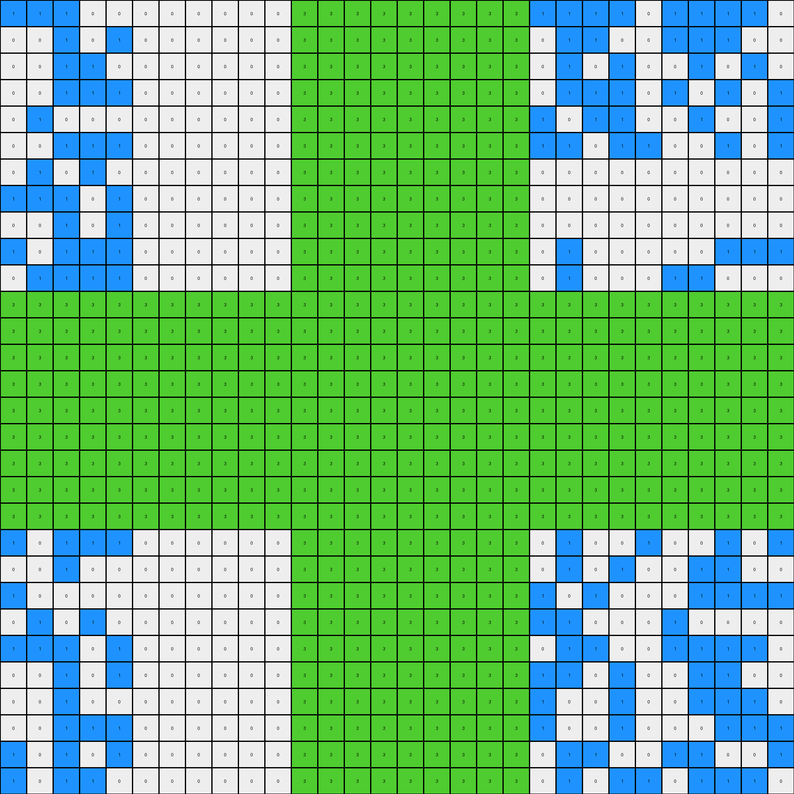
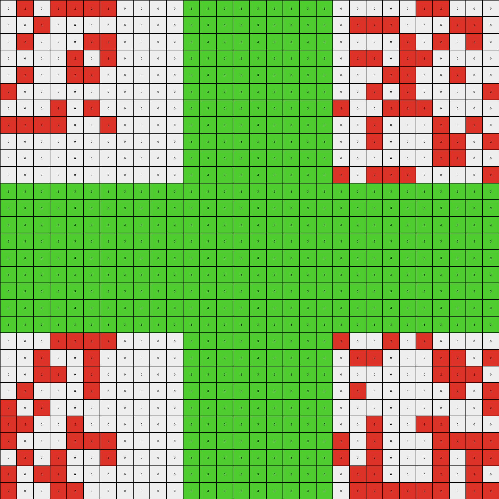

# a64e4611 • 005 • refine_dreamer

---


Previous Code:
```python
"""
The transformation overlays a green (3) cross shape onto the existing background grid. The background grid consists
of varying colors. The cross shape is centered on the grid, with its thickness determined by the grid's dimensions.
"""

import numpy as np

def calculate_thickness(dimension):
    """Calculates the thickness of the cross bars."""
    return dimension // 7 + 1

def create_cross(grid, cross_color=3):
    """Creates a green cross shape on a zero-filled grid of the same size as the input grid."""
    rows, cols = grid.shape
    thickness = calculate_thickness(min(rows, cols))  # Use the smaller dimension
    cross = np.zeros_like(grid)

    center_row = rows // 2
    center_col = cols // 2

    # Vertical part of the cross
    cross[center_row - thickness + 1:center_row + thickness, :] = cross_color

    # Horizontal part of cross
    cross[:, center_col - thickness + 1:center_col + thickness] = cross_color

    return cross

def transform(input_grid):
    """
    Overlays a green cross shape onto the input grid, replacing existing pixels.
    """
    # Initialize output_grid as copy of input
    output_grid = input_grid.copy()

    # Create cross based on the input_grid size
    cross = create_cross(input_grid)

    # Overlay the cross
    for r in range(output_grid.shape[0]):
        for c in range(output_grid.shape[1]):
            if cross[r, c] != 0:
                output_grid[r, c] = cross[r, c]

    return output_grid
```

Train Set Results:

## Example 1:

Input:
```
8 8 0 8 0 8 0 8 8 8 8 8 0 8 8 8 0 8 0 0 8 0 8 0 0 0 8 8 0 8
0 0 0 8 8 8 8 0 0 8 0 8 0 0 8 8 0 0 8 0 0 0 0 0 8 8 8 8 0 8
8 0 0 0 8 8 0 0 8 0 8 8 0 8 8 0 8 0 8 0 8 8 8 8 0 0 8 0 0 0
0 8 8 0 0 0 0 8 8 0 0 0 0 8 8 0 8 8 0 0 0 8 8 0 8 0 0 0 0 0
8 8 8 0 8 0 0 8 0 0 0 0 0 0 0 0 0 8 8 8 8 0 0 8 0 8 8 0 0 8
0 8 0 0 0 8 8 8 0 0 0 0 0 0 0 0 0 0 8 8 8 8 0 8 0 8 0 0 0 8
0 8 8 8 8 0 0 8 0 0 0 0 0 0 0 0 0 8 8 8 0 0 0 0 0 8 0 8 8 8
0 8 8 8 8 0 0 8 0 0 0 0 0 0 0 0 0 0 0 8 0 8 0 8 8 8 0 0 8 8
8 0 8 8 0 8 8 8 0 0 0 0 0 0 0 0 0 8 0 0 0 8 0 0 8 0 0 8 0 8
8 8 8 0 8 8 0 8 0 0 0 0 0 0 0 0 0 0 0 0 0 0 0 0 0 0 0 0 0 0
8 0 8 8 0 0 8 8 0 0 0 0 0 0 0 0 0 0 0 0 0 0 0 0 0 0 0 0 0 0
0 8 8 0 0 0 0 0 0 0 0 0 0 0 0 0 0 0 0 0 0 0 0 0 0 0 0 0 0 0
0 8 0 0 8 0 0 8 0 0 0 0 0 0 0 0 0 0 0 0 0 0 0 0 0 0 0 0 0 0
8 8 8 8 8 0 0 0 0 0 0 0 0 0 0 0 0 0 0 0 0 8 0 8 8 0 8 8 0 8
8 0 8 8 0 0 8 8 0 0 0 0 0 0 0 0 0 8 8 0 8 0 0 0 8 0 0 0 8 8
8 0 8 0 0 8 8 0 0 0 0 0 0 0 0 0 0 0 0 8 0 8 8 0 0 0 8 0 8 8
0 0 8 8 8 8 0 0 0 0 0 0 0 0 0 0 0 8 8 0 0 0 8 8 0 8 8 0 0 8
8 0 8 0 0 8 8 8 0 0 0 0 0 0 0 0 0 8 8 8 8 0 8 8 0 0 0 8 8 0
8 0 8 8 0 8 0 8 0 0 0 0 0 0 0 0 0 0 8 8 8 0 8 0 8 0 8 0 0 0
0 0 0 0 0 0 0 0 0 0 0 0 0 0 0 0 0 0 8 0 0 0 0 8 8 8 0 8 8 8
0 0 0 0 0 0 0 0 0 0 0 0 0 0 0 0 0 0 0 0 0 0 8 0 0 0 8 0 8 0
0 0 0 0 0 0 0 0 0 0 0 0 0 0 0 0 0 8 0 0 0 0 8 0 8 8 0 0 8 0
0 0 0 0 0 0 0 0 0 0 0 0 0 0 0 0 0 0 8 0 0 0 0 8 0 8 0 8 8 8
8 8 0 0 8 8 0 8 0 0 0 0 0 0 0 0 0 8 8 8 0 8 0 0 0 0 8 8 8 8
0 8 8 8 8 0 0 8 0 0 0 0 0 0 0 0 0 8 0 8 0 8 0 8 8 0 0 0 8 8
0 8 8 0 8 8 8 0 0 0 0 0 0 0 0 0 0 0 0 0 0 0 0 8 0 8 0 8 0 8
8 0 8 8 8 0 8 8 0 0 0 0 0 0 0 0 0 0 8 8 8 0 8 0 8 8 0 0 0 8
8 0 8 0 8 0 8 0 0 0 0 0 0 0 0 0 0 8 0 8 8 0 8 8 0 8 0 0 8 0
0 8 8 0 0 0 0 0 0 0 0 0 0 0 0 0 0 0 8 0 0 8 8 0 8 8 8 0 0 0
8 8 8 0 8 0 0 8 0 0 0 0 0 0 0 0 0 8 8 0 8 0 8 8 0 8 0 8 8 0
```
Expected Output:
```
8 8 0 8 0 8 0 8 8 8 8 8 0 8 8 8 0 8 0 0 8 0 8 0 0 0 8 8 0 8
0 0 0 8 8 8 8 0 0 8 0 8 0 0 8 8 0 0 8 0 0 0 0 0 8 8 8 8 0 8
8 0 0 0 8 8 0 0 8 0 8 8 0 8 8 0 8 0 8 0 8 8 8 8 0 0 8 0 0 0
0 8 8 0 0 0 0 8 8 0 0 0 0 8 8 0 8 8 0 0 0 8 8 0 8 0 0 0 0 0
8 8 8 0 8 0 0 8 0 0 0 0 0 0 0 0 0 8 8 8 8 0 0 8 0 8 8 0 0 8
0 8 0 0 0 8 8 8 0 3 3 3 3 3 3 3 0 0 8 8 8 8 0 8 0 8 0 0 0 8
0 8 8 8 8 0 0 8 0 3 3 3 3 3 3 3 0 8 8 8 0 0 0 0 0 8 0 8 8 8
0 8 8 8 8 0 0 8 0 3 3 3 3 3 3 3 0 0 0 8 0 8 0 8 8 8 0 0 8 8
8 0 8 8 0 8 8 8 0 3 3 3 3 3 3 3 0 8 0 0 0 8 0 0 8 0 0 8 0 8
8 8 8 0 8 8 0 8 0 3 3 3 3 3 3 3 0 0 0 0 0 0 0 0 0 0 0 0 0 0
8 0 8 8 0 0 8 8 0 3 3 3 3 3 3 3 3 3 3 3 3 3 3 3 3 3 3 3 3 3
0 8 8 0 0 0 0 0 0 3 3 3 3 3 3 3 3 3 3 3 3 3 3 3 3 3 3 3 3 3
0 8 0 0 8 0 0 8 0 3 3 3 3 3 3 3 0 0 0 0 0 0 0 0 0 0 0 0 0 0
8 8 8 8 8 0 0 0 0 3 3 3 3 3 3 3 0 0 0 0 0 8 0 8 8 0 8 8 0 8
8 0 8 8 0 0 8 8 0 3 3 3 3 3 3 3 0 8 8 0 8 0 0 0 8 0 0 0 8 8
8 0 8 0 0 8 8 0 0 3 3 3 3 3 3 3 0 0 0 8 0 8 8 0 0 0 8 0 8 8
0 0 8 8 8 8 0 0 0 3 3 3 3 3 3 3 0 8 8 0 0 0 8 8 0 8 8 0 0 8
8 0 8 0 0 8 8 8 0 3 3 3 3 3 3 3 0 8 8 8 8 0 8 8 0 0 0 8 8 0
8 0 8 8 0 8 0 8 0 3 3 3 3 3 3 3 0 0 8 8 8 0 8 0 8 0 8 0 0 0
0 0 0 0 0 0 0 0 0 3 3 3 3 3 3 3 0 0 8 0 0 0 0 8 8 8 0 8 8 8
3 3 3 3 3 3 3 3 3 3 3 3 3 3 3 3 0 0 0 0 0 0 8 0 0 0 8 0 8 0
3 3 3 3 3 3 3 3 3 3 3 3 3 3 3 3 0 8 0 0 0 0 8 0 8 8 0 0 8 0
0 0 0 0 0 0 0 0 0 3 3 3 3 3 3 3 0 0 8 0 0 0 0 8 0 8 0 8 8 8
8 8 0 0 8 8 0 8 0 3 3 3 3 3 3 3 0 8 8 8 0 8 0 0 0 0 8 8 8 8
0 8 8 8 8 0 0 8 0 3 3 3 3 3 3 3 0 8 0 8 0 8 0 8 8 0 0 0 8 8
0 8 8 0 8 8 8 0 0 3 3 3 3 3 3 3 0 0 0 0 0 0 0 8 0 8 0 8 0 8
8 0 8 8 8 0 8 8 0 3 3 3 3 3 3 3 0 0 8 8 8 0 8 0 8 8 0 0 0 8
8 0 8 0 8 0 8 0 0 3 3 3 3 3 3 3 0 8 0 8 8 0 8 8 0 8 0 0 8 0
0 8 8 0 0 0 0 0 0 3 3 3 3 3 3 3 0 0 8 0 0 8 8 0 8 8 8 0 0 0
8 8 8 0 8 0 0 8 0 3 3 3 3 3 3 3 0 8 8 0 8 0 8 8 0 8 0 8 8 0
```
Transformed Output:
```
8 8 0 8 0 8 0 8 8 8 8 3 3 3 3 3 3 3 3 3 8 0 8 0 0 0 8 8 0 8
0 0 0 8 8 8 8 0 0 8 0 3 3 3 3 3 3 3 3 3 0 0 0 0 8 8 8 8 0 8
8 0 0 0 8 8 0 0 8 0 8 3 3 3 3 3 3 3 3 3 8 8 8 8 0 0 8 0 0 0
0 8 8 0 0 0 0 8 8 0 0 3 3 3 3 3 3 3 3 3 0 8 8 0 8 0 0 0 0 0
8 8 8 0 8 0 0 8 0 0 0 3 3 3 3 3 3 3 3 3 8 0 0 8 0 8 8 0 0 8
0 8 0 0 0 8 8 8 0 0 0 3 3 3 3 3 3 3 3 3 8 8 0 8 0 8 0 0 0 8
0 8 8 8 8 0 0 8 0 0 0 3 3 3 3 3 3 3 3 3 0 0 0 0 0 8 0 8 8 8
0 8 8 8 8 0 0 8 0 0 0 3 3 3 3 3 3 3 3 3 0 8 0 8 8 8 0 0 8 8
8 0 8 8 0 8 8 8 0 0 0 3 3 3 3 3 3 3 3 3 0 8 0 0 8 0 0 8 0 8
8 8 8 0 8 8 0 8 0 0 0 3 3 3 3 3 3 3 3 3 0 0 0 0 0 0 0 0 0 0
8 0 8 8 0 0 8 8 0 0 0 3 3 3 3 3 3 3 3 3 0 0 0 0 0 0 0 0 0 0
3 3 3 3 3 3 3 3 3 3 3 3 3 3 3 3 3 3 3 3 3 3 3 3 3 3 3 3 3 3
3 3 3 3 3 3 3 3 3 3 3 3 3 3 3 3 3 3 3 3 3 3 3 3 3 3 3 3 3 3
3 3 3 3 3 3 3 3 3 3 3 3 3 3 3 3 3 3 3 3 3 3 3 3 3 3 3 3 3 3
3 3 3 3 3 3 3 3 3 3 3 3 3 3 3 3 3 3 3 3 3 3 3 3 3 3 3 3 3 3
3 3 3 3 3 3 3 3 3 3 3 3 3 3 3 3 3 3 3 3 3 3 3 3 3 3 3 3 3 3
3 3 3 3 3 3 3 3 3 3 3 3 3 3 3 3 3 3 3 3 3 3 3 3 3 3 3 3 3 3
3 3 3 3 3 3 3 3 3 3 3 3 3 3 3 3 3 3 3 3 3 3 3 3 3 3 3 3 3 3
3 3 3 3 3 3 3 3 3 3 3 3 3 3 3 3 3 3 3 3 3 3 3 3 3 3 3 3 3 3
3 3 3 3 3 3 3 3 3 3 3 3 3 3 3 3 3 3 3 3 3 3 3 3 3 3 3 3 3 3
0 0 0 0 0 0 0 0 0 0 0 3 3 3 3 3 3 3 3 3 0 0 8 0 0 0 8 0 8 0
0 0 0 0 0 0 0 0 0 0 0 3 3 3 3 3 3 3 3 3 0 0 8 0 8 8 0 0 8 0
0 0 0 0 0 0 0 0 0 0 0 3 3 3 3 3 3 3 3 3 0 0 0 8 0 8 0 8 8 8
8 8 0 0 8 8 0 8 0 0 0 3 3 3 3 3 3 3 3 3 0 8 0 0 0 0 8 8 8 8
0 8 8 8 8 0 0 8 0 0 0 3 3 3 3 3 3 3 3 3 0 8 0 8 8 0 0 0 8 8
0 8 8 0 8 8 8 0 0 0 0 3 3 3 3 3 3 3 3 3 0 0 0 8 0 8 0 8 0 8
8 0 8 8 8 0 8 8 0 0 0 3 3 3 3 3 3 3 3 3 8 0 8 0 8 8 0 0 0 8
8 0 8 0 8 0 8 0 0 0 0 3 3 3 3 3 3 3 3 3 8 0 8 8 0 8 0 0 8 0
0 8 8 0 0 0 0 0 0 0 0 3 3 3 3 3 3 3 3 3 0 8 8 0 8 8 8 0 0 0
8 8 8 0 8 0 0 8 0 0 0 3 3 3 3 3 3 3 3 3 8 0 8 8 0 8 0 8 8 0
```

match: False
pixels_off: 358
size_correct: True
color_palette_correct: True
correct_pixel_counts: False

## Example 2:

Input:
```
1 1 1 0 0 0 0 0 0 0 0 0 0 0 1 0 1 0 0 0 1 1 1 1 0 1 1 1 1 0
0 0 1 0 1 0 0 0 0 0 0 0 0 0 1 1 1 1 0 1 0 1 1 0 0 1 1 1 0 0
0 0 1 1 0 0 0 0 0 0 0 0 0 0 1 1 1 0 0 1 0 1 0 1 0 0 1 0 1 0
0 0 1 1 1 0 0 0 0 0 0 0 0 0 1 1 0 0 1 1 0 1 1 1 0 1 0 1 0 1
0 1 0 0 0 0 0 0 0 0 0 0 0 0 0 1 0 1 1 1 1 0 1 1 0 0 1 0 0 1
0 0 1 1 1 0 0 0 0 0 0 0 0 0 0 0 1 0 0 0 1 1 0 1 1 0 0 1 0 1
0 1 0 1 0 0 0 0 0 0 0 0 0 0 0 0 0 0 0 0 0 0 0 0 0 0 0 0 0 0
1 1 1 0 1 0 0 0 0 0 0 0 0 0 0 0 0 0 0 0 0 0 0 0 0 0 0 0 0 0
0 0 1 0 1 0 0 0 0 0 0 0 0 0 0 0 0 0 0 0 0 0 0 0 0 0 0 0 0 0
1 0 1 1 1 0 0 0 0 0 0 0 0 0 0 1 0 1 1 1 0 1 0 0 0 0 0 1 1 1
0 1 1 1 1 0 0 0 0 0 0 0 0 0 0 0 1 1 1 0 0 1 0 0 0 1 1 0 0 0
0 1 1 0 0 0 0 0 0 0 0 0 0 0 0 1 0 1 0 1 0 1 0 1 0 1 0 0 0 1
1 1 1 0 1 0 0 0 0 0 0 0 0 0 1 0 1 0 0 0 1 0 0 0 1 1 0 0 1 1
1 0 0 0 0 0 0 0 0 0 0 0 0 0 1 0 1 1 0 1 1 1 1 0 0 0 0 1 0 1
0 1 1 0 1 0 0 0 0 0 0 0 0 0 1 1 0 0 1 0 1 1 1 1 0 0 1 1 1 1
1 1 0 0 1 0 0 0 0 0 0 0 0 0 1 0 1 1 1 0 0 0 1 0 1 1 0 1 0 1
0 1 1 0 0 0 0 0 0 0 0 0 0 0 0 0 0 0 0 0 0 0 0 0 0 0 0 0 0 0
1 0 0 1 1 0 0 0 0 0 0 0 0 0 0 0 0 0 0 0 0 0 0 0 0 0 0 0 0 0
1 0 1 0 0 0 0 0 0 0 0 0 0 0 0 0 0 0 0 0 0 0 0 0 0 0 0 0 0 0
1 1 0 1 1 0 0 0 0 0 0 0 0 0 0 0 0 0 0 0 0 0 0 0 0 0 0 0 0 0
1 0 1 1 1 0 0 0 0 0 0 0 0 0 0 1 0 1 0 0 0 1 0 0 1 0 0 1 0 1
0 0 1 0 0 0 0 0 0 0 0 0 0 0 1 1 0 0 0 0 0 1 0 1 0 0 1 1 0 0
1 0 0 0 0 0 0 0 0 0 0 0 0 0 0 0 0 0 1 1 1 0 1 0 0 0 1 1 1 1
0 1 0 1 0 0 0 0 0 0 0 0 0 0 0 0 1 1 0 0 1 1 0 0 0 1 0 0 0 0
1 1 1 0 1 0 0 0 0 0 0 0 0 0 0 0 1 1 0 0 0 1 1 0 0 1 1 1 1 0
0 0 1 0 1 0 0 0 0 0 0 0 0 0 1 0 1 1 1 1 1 1 0 1 0 0 1 1 0 0
0 0 1 0 0 0 0 0 0 0 0 0 0 0 1 1 0 0 0 0 1 0 0 1 0 0 1 1 1 0
0 0 1 1 1 0 0 0 0 0 0 0 0 0 0 0 0 1 1 1 1 0 0 1 0 0 0 1 1 1
1 0 1 0 1 0 0 0 0 0 0 0 0 0 1 0 0 0 0 0 0 1 1 0 0 1 1 0 0 1
1 0 1 1 0 0 0 0 0 0 0 0 0 0 0 0 1 1 1 0 0 1 0 1 1 0 1 1 1 0
```
Expected Output:
```
1 1 1 0 0 0 3 3 3 3 3 3 3 0 1 0 1 0 0 0 1 1 1 1 0 1 1 1 1 0
0 0 1 0 1 0 3 3 3 3 3 3 3 0 1 1 1 1 0 1 0 1 1 0 0 1 1 1 0 0
0 0 1 1 0 0 3 3 3 3 3 3 3 0 1 1 1 0 0 1 0 1 0 1 0 0 1 0 1 0
0 0 1 1 1 0 3 3 3 3 3 3 3 0 1 1 0 0 1 1 0 1 1 1 0 1 0 1 0 1
0 1 0 0 0 0 3 3 3 3 3 3 3 0 0 1 0 1 1 1 1 0 1 1 0 0 1 0 0 1
0 0 1 1 1 0 3 3 3 3 3 3 3 0 0 0 1 0 0 0 1 1 0 1 1 0 0 1 0 1
0 1 0 1 0 0 3 3 3 3 3 3 3 0 0 0 0 0 0 0 0 0 0 0 0 0 0 0 0 0
1 1 1 0 1 0 3 3 3 3 3 3 3 3 3 3 3 3 3 3 3 3 3 3 3 3 3 3 3 3
0 0 1 0 1 0 3 3 3 3 3 3 3 0 0 0 0 0 0 0 0 0 0 0 0 0 0 0 0 0
1 0 1 1 1 0 3 3 3 3 3 3 3 0 0 1 0 1 1 1 0 1 0 0 0 0 0 1 1 1
0 1 1 1 1 0 3 3 3 3 3 3 3 0 0 0 1 1 1 0 0 1 0 0 0 1 1 0 0 0
0 1 1 0 0 0 3 3 3 3 3 3 3 0 0 1 0 1 0 1 0 1 0 1 0 1 0 0 0 1
1 1 1 0 1 0 3 3 3 3 3 3 3 0 1 0 1 0 0 0 1 0 0 0 1 1 0 0 1 1
1 0 0 0 0 0 3 3 3 3 3 3 3 0 1 0 1 1 0 1 1 1 1 0 0 0 0 1 0 1
0 1 1 0 1 0 3 3 3 3 3 3 3 0 1 1 0 0 1 0 1 1 1 1 0 0 1 1 1 1
1 1 0 0 1 0 3 3 3 3 3 3 3 0 1 0 1 1 1 0 0 0 1 0 1 1 0 1 0 1
0 1 1 0 0 0 3 3 3 3 3 3 3 0 0 0 0 0 0 0 0 0 0 0 0 0 0 0 0 0
1 0 0 1 1 0 3 3 3 3 3 3 3 3 3 3 3 3 3 3 3 3 3 3 3 3 3 3 3 3
1 0 1 0 0 0 3 3 3 3 3 3 3 3 3 3 3 3 3 3 3 3 3 3 3 3 3 3 3 3
1 1 0 1 1 0 3 3 3 3 3 3 3 0 0 0 0 0 0 0 0 0 0 0 0 0 0 0 0 0
1 0 1 1 1 0 3 3 3 3 3 3 3 0 0 1 0 1 0 0 0 1 0 0 1 0 0 1 0 1
0 0 1 0 0 0 3 3 3 3 3 3 3 0 1 1 0 0 0 0 0 1 0 1 0 0 1 1 0 0
1 0 0 0 0 0 3 3 3 3 3 3 3 0 0 0 0 0 1 1 1 0 1 0 0 0 1 1 1 1
0 1 0 1 0 0 3 3 3 3 3 3 3 0 0 0 1 1 0 0 1 1 0 0 0 1 0 0 0 0
1 1 1 0 1 0 3 3 3 3 3 3 3 0 0 0 1 1 0 0 0 1 1 0 0 1 1 1 1 0
0 0 1 0 1 0 3 3 3 3 3 3 3 0 1 0 1 1 1 1 1 1 0 1 0 0 1 1 0 0
0 0 1 0 0 0 3 3 3 3 3 3 3 0 1 1 0 0 0 0 1 0 0 1 0 0 1 1 1 0
0 0 1 1 1 0 3 3 3 3 3 3 3 0 0 0 0 1 1 1 1 0 0 1 0 0 0 1 1 1
1 0 1 0 1 0 3 3 3 3 3 3 3 0 1 0 0 0 0 0 0 1 1 0 0 1 1 0 0 1
1 0 1 1 0 0 3 3 3 3 3 3 3 0 0 0 1 1 1 0 0 1 0 1 1 0 1 1 1 0
```
Transformed Output:
```
1 1 1 0 0 0 0 0 0 0 0 3 3 3 3 3 3 3 3 3 1 1 1 1 0 1 1 1 1 0
0 0 1 0 1 0 0 0 0 0 0 3 3 3 3 3 3 3 3 3 0 1 1 0 0 1 1 1 0 0
0 0 1 1 0 0 0 0 0 0 0 3 3 3 3 3 3 3 3 3 0 1 0 1 0 0 1 0 1 0
0 0 1 1 1 0 0 0 0 0 0 3 3 3 3 3 3 3 3 3 0 1 1 1 0 1 0 1 0 1
0 1 0 0 0 0 0 0 0 0 0 3 3 3 3 3 3 3 3 3 1 0 1 1 0 0 1 0 0 1
0 0 1 1 1 0 0 0 0 0 0 3 3 3 3 3 3 3 3 3 1 1 0 1 1 0 0 1 0 1
0 1 0 1 0 0 0 0 0 0 0 3 3 3 3 3 3 3 3 3 0 0 0 0 0 0 0 0 0 0
1 1 1 0 1 0 0 0 0 0 0 3 3 3 3 3 3 3 3 3 0 0 0 0 0 0 0 0 0 0
0 0 1 0 1 0 0 0 0 0 0 3 3 3 3 3 3 3 3 3 0 0 0 0 0 0 0 0 0 0
1 0 1 1 1 0 0 0 0 0 0 3 3 3 3 3 3 3 3 3 0 1 0 0 0 0 0 1 1 1
0 1 1 1 1 0 0 0 0 0 0 3 3 3 3 3 3 3 3 3 0 1 0 0 0 1 1 0 0 0
3 3 3 3 3 3 3 3 3 3 3 3 3 3 3 3 3 3 3 3 3 3 3 3 3 3 3 3 3 3
3 3 3 3 3 3 3 3 3 3 3 3 3 3 3 3 3 3 3 3 3 3 3 3 3 3 3 3 3 3
3 3 3 3 3 3 3 3 3 3 3 3 3 3 3 3 3 3 3 3 3 3 3 3 3 3 3 3 3 3
3 3 3 3 3 3 3 3 3 3 3 3 3 3 3 3 3 3 3 3 3 3 3 3 3 3 3 3 3 3
3 3 3 3 3 3 3 3 3 3 3 3 3 3 3 3 3 3 3 3 3 3 3 3 3 3 3 3 3 3
3 3 3 3 3 3 3 3 3 3 3 3 3 3 3 3 3 3 3 3 3 3 3 3 3 3 3 3 3 3
3 3 3 3 3 3 3 3 3 3 3 3 3 3 3 3 3 3 3 3 3 3 3 3 3 3 3 3 3 3
3 3 3 3 3 3 3 3 3 3 3 3 3 3 3 3 3 3 3 3 3 3 3 3 3 3 3 3 3 3
3 3 3 3 3 3 3 3 3 3 3 3 3 3 3 3 3 3 3 3 3 3 3 3 3 3 3 3 3 3
1 0 1 1 1 0 0 0 0 0 0 3 3 3 3 3 3 3 3 3 0 1 0 0 1 0 0 1 0 1
0 0 1 0 0 0 0 0 0 0 0 3 3 3 3 3 3 3 3 3 0 1 0 1 0 0 1 1 0 0
1 0 0 0 0 0 0 0 0 0 0 3 3 3 3 3 3 3 3 3 1 0 1 0 0 0 1 1 1 1
0 1 0 1 0 0 0 0 0 0 0 3 3 3 3 3 3 3 3 3 1 1 0 0 0 1 0 0 0 0
1 1 1 0 1 0 0 0 0 0 0 3 3 3 3 3 3 3 3 3 0 1 1 0 0 1 1 1 1 0
0 0 1 0 1 0 0 0 0 0 0 3 3 3 3 3 3 3 3 3 1 1 0 1 0 0 1 1 0 0
0 0 1 0 0 0 0 0 0 0 0 3 3 3 3 3 3 3 3 3 1 0 0 1 0 0 1 1 1 0
0 0 1 1 1 0 0 0 0 0 0 3 3 3 3 3 3 3 3 3 1 0 0 1 0 0 0 1 1 1
1 0 1 0 1 0 0 0 0 0 0 3 3 3 3 3 3 3 3 3 0 1 1 0 0 1 1 0 0 1
1 0 1 1 0 0 0 0 0 0 0 3 3 3 3 3 3 3 3 3 0 1 0 1 1 0 1 1 1 0
```

match: False
pixels_off: 428
size_correct: True
color_palette_correct: True
correct_pixel_counts: False

## Example 3:

Input:
```
0 2 0 2 2 2 2 0 0 0 0 0 0 0 0 0 0 2 0 0 0 0 0 0 0 2 2 0 0 0
0 0 2 0 0 0 0 0 0 0 0 0 0 0 0 0 0 0 0 0 0 2 2 2 0 0 0 2 2 0
0 2 0 0 0 2 2 0 0 0 0 0 0 0 0 0 0 2 0 2 0 0 0 0 2 0 2 0 2 0
0 0 0 0 2 0 2 0 0 0 0 0 0 0 0 0 0 2 2 0 0 2 2 0 2 2 0 0 0 0
0 2 0 0 2 2 0 0 0 0 0 0 0 0 0 0 0 0 2 0 0 0 0 2 2 0 0 2 0 0
2 0 0 0 0 0 0 0 0 0 0 0 0 0 0 0 0 2 2 2 0 0 2 0 2 0 0 0 0 2
0 0 0 2 0 2 0 0 0 0 0 0 0 0 0 0 0 2 2 0 2 0 0 2 2 2 0 0 0 0
2 2 2 2 0 0 2 0 0 0 0 0 0 0 0 0 0 0 2 0 0 0 2 0 0 0 2 0 2 0
0 0 0 0 0 0 0 0 0 0 0 0 0 0 0 0 0 0 0 2 0 0 2 0 0 0 2 2 0 2
0 0 0 0 0 0 0 0 0 0 0 0 0 0 0 0 0 2 0 0 0 0 0 0 0 0 2 2 0 0
0 0 0 0 0 0 0 0 0 0 0 0 0 0 0 0 0 0 0 2 2 0 2 2 2 0 0 0 0 2
0 0 0 0 0 0 0 0 0 0 0 0 0 0 0 0 0 0 0 2 2 2 2 0 2 0 0 0 0 0
0 0 0 0 0 0 0 0 0 0 0 0 0 0 0 0 0 0 0 0 2 0 0 0 0 0 0 0 2 2
0 0 0 0 0 0 0 0 0 0 0 0 0 0 0 0 0 2 0 0 0 0 0 2 2 0 2 0 0 2
0 0 0 0 0 0 0 0 0 0 0 0 0 0 0 0 0 2 0 0 0 0 2 0 0 2 0 0 2 0
0 0 0 0 0 0 0 0 0 0 0 0 0 0 0 0 0 0 0 0 0 2 0 0 2 0 2 0 2 0
0 0 0 0 0 0 0 0 0 0 0 0 0 0 0 0 0 0 2 0 2 2 0 0 2 2 0 0 0 2
0 0 0 0 0 0 0 0 0 0 0 0 0 0 0 0 0 0 2 2 2 2 0 2 2 2 0 2 0 2
0 0 0 0 0 0 0 0 0 0 0 0 0 0 0 0 0 0 0 0 0 0 2 0 2 0 2 0 0 0
0 0 0 0 0 0 0 0 0 0 0 0 0 0 0 0 0 0 0 0 0 2 0 0 0 2 0 2 0 0
0 0 0 2 2 2 2 0 0 0 0 0 0 0 0 0 0 0 0 2 2 0 0 2 0 2 0 0 0 0
0 0 2 0 0 2 0 0 0 0 0 0 0 0 0 0 0 0 0 0 0 2 2 0 0 0 2 2 0 2
0 0 2 2 0 2 0 0 0 0 0 0 0 0 0 0 0 0 0 2 0 0 0 0 0 0 2 2 2 0
0 2 0 0 0 2 0 0 0 0 0 0 0 0 0 0 0 0 2 0 0 2 0 0 0 0 0 2 0 2
2 0 2 0 0 0 0 0 0 0 0 0 0 0 0 0 0 2 0 2 0 0 0 0 0 0 0 0 0 2
2 2 0 0 2 0 0 0 0 0 0 0 0 0 0 0 0 0 2 2 0 0 2 0 0 2 2 0 0 0
2 0 0 0 2 2 2 0 0 0 0 0 0 0 0 0 0 2 0 0 2 0 2 0 0 0 2 2 2 2
0 2 0 2 0 0 2 0 0 0 0 0 0 0 0 0 0 2 0 0 2 0 2 0 0 0 2 0 2 2
2 0 2 2 0 0 0 0 0 0 0 0 0 0 0 0 0 2 0 0 0 2 2 0 0 0 2 0 2 0
2 0 0 2 2 0 0 0 0 0 0 0 0 0 0 0 0 2 2 2 0 2 2 2 2 2 2 0 2 2
```
Expected Output:
```
0 2 0 2 2 2 2 0 3 3 3 3 3 3 3 3 0 2 0 0 0 0 0 0 0 2 2 0 0 0
0 0 2 0 0 0 0 0 3 3 3 3 3 3 3 3 0 0 0 0 0 2 2 2 0 0 0 2 2 0
0 2 0 0 0 2 2 0 3 3 3 3 3 3 3 3 0 2 0 2 0 0 0 0 2 0 2 0 2 0
0 0 0 0 2 0 2 0 3 3 3 3 3 3 3 3 0 2 2 0 0 2 2 0 2 2 0 0 0 0
0 2 0 0 2 2 0 0 3 3 3 3 3 3 3 3 0 0 2 0 0 0 0 2 2 0 0 2 0 0
2 0 0 0 0 0 0 0 3 3 3 3 3 3 3 3 0 2 2 2 0 0 2 0 2 0 0 0 0 2
0 0 0 2 0 2 0 0 3 3 3 3 3 3 3 3 0 2 2 0 2 0 0 2 2 2 0 0 0 0
2 2 2 2 0 0 2 0 3 3 3 3 3 3 3 3 0 0 2 0 0 0 2 0 0 0 2 0 2 0
0 0 0 0 0 0 0 0 3 3 3 3 3 3 3 3 0 0 0 2 0 0 2 0 0 0 2 2 0 2
3 3 3 3 3 3 3 3 3 3 3 3 3 3 3 3 0 2 0 0 0 0 0 0 0 0 2 2 0 0
3 3 3 3 3 3 3 3 3 3 3 3 3 3 3 3 0 0 0 2 2 0 2 2 2 0 0 0 0 2
3 3 3 3 3 3 3 3 3 3 3 3 3 3 3 3 0 0 0 2 2 2 2 0 2 0 0 0 0 0
3 3 3 3 3 3 3 3 3 3 3 3 3 3 3 3 0 0 0 0 2 0 0 0 0 0 0 0 2 2
3 3 3 3 3 3 3 3 3 3 3 3 3 3 3 3 0 2 0 0 0 0 0 2 2 0 2 0 0 2
3 3 3 3 3 3 3 3 3 3 3 3 3 3 3 3 0 2 0 0 0 0 2 0 0 2 0 0 2 0
3 3 3 3 3 3 3 3 3 3 3 3 3 3 3 3 0 0 0 0 0 2 0 0 2 0 2 0 2 0
3 3 3 3 3 3 3 3 3 3 3 3 3 3 3 3 0 0 2 0 2 2 0 0 2 2 0 0 0 2
3 3 3 3 3 3 3 3 3 3 3 3 3 3 3 3 0 0 2 2 2 2 0 2 2 2 0 2 0 2
3 3 3 3 3 3 3 3 3 3 3 3 3 3 3 3 0 0 0 0 0 0 2 0 2 0 2 0 0 0
0 0 0 0 0 0 0 0 3 3 3 3 3 3 3 3 0 0 0 0 0 2 0 0 0 2 0 2 0 0
0 0 0 2 2 2 2 0 3 3 3 3 3 3 3 3 0 0 0 2 2 0 0 2 0 2 0 0 0 0
0 0 2 0 0 2 0 0 3 3 3 3 3 3 3 3 0 0 0 0 0 2 2 0 0 0 2 2 0 2
0 0 2 2 0 2 0 0 3 3 3 3 3 3 3 3 0 0 0 2 0 0 0 0 0 0 2 2 2 0
0 2 0 0 0 2 0 0 3 3 3 3 3 3 3 3 0 0 2 0 0 2 0 0 0 0 0 2 0 2
2 0 2 0 0 0 0 0 3 3 3 3 3 3 3 3 0 2 0 2 0 0 0 0 0 0 0 0 0 2
2 2 0 0 2 0 0 0 3 3 3 3 3 3 3 3 0 0 2 2 0 0 2 0 0 2 2 0 0 0
2 0 0 0 2 2 2 0 3 3 3 3 3 3 3 3 0 2 0 0 2 0 2 0 0 0 2 2 2 2
0 2 0 2 0 0 2 0 3 3 3 3 3 3 3 3 0 2 0 0 2 0 2 0 0 0 2 0 2 2
2 0 2 2 0 0 0 0 3 3 3 3 3 3 3 3 0 2 0 0 0 2 2 0 0 0 2 0 2 0
2 0 0 2 2 0 0 0 3 3 3 3 3 3 3 3 0 2 2 2 0 2 2 2 2 2 2 0 2 2
```
Transformed Output:
```
0 2 0 2 2 2 2 0 0 0 0 3 3 3 3 3 3 3 3 3 0 0 0 0 0 2 2 0 0 0
0 0 2 0 0 0 0 0 0 0 0 3 3 3 3 3 3 3 3 3 0 2 2 2 0 0 0 2 2 0
0 2 0 0 0 2 2 0 0 0 0 3 3 3 3 3 3 3 3 3 0 0 0 0 2 0 2 0 2 0
0 0 0 0 2 0 2 0 0 0 0 3 3 3 3 3 3 3 3 3 0 2 2 0 2 2 0 0 0 0
0 2 0 0 2 2 0 0 0 0 0 3 3 3 3 3 3 3 3 3 0 0 0 2 2 0 0 2 0 0
2 0 0 0 0 0 0 0 0 0 0 3 3 3 3 3 3 3 3 3 0 0 2 0 2 0 0 0 0 2
0 0 0 2 0 2 0 0 0 0 0 3 3 3 3 3 3 3 3 3 2 0 0 2 2 2 0 0 0 0
2 2 2 2 0 0 2 0 0 0 0 3 3 3 3 3 3 3 3 3 0 0 2 0 0 0 2 0 2 0
0 0 0 0 0 0 0 0 0 0 0 3 3 3 3 3 3 3 3 3 0 0 2 0 0 0 2 2 0 2
0 0 0 0 0 0 0 0 0 0 0 3 3 3 3 3 3 3 3 3 0 0 0 0 0 0 2 2 0 0
0 0 0 0 0 0 0 0 0 0 0 3 3 3 3 3 3 3 3 3 2 0 2 2 2 0 0 0 0 2
3 3 3 3 3 3 3 3 3 3 3 3 3 3 3 3 3 3 3 3 3 3 3 3 3 3 3 3 3 3
3 3 3 3 3 3 3 3 3 3 3 3 3 3 3 3 3 3 3 3 3 3 3 3 3 3 3 3 3 3
3 3 3 3 3 3 3 3 3 3 3 3 3 3 3 3 3 3 3 3 3 3 3 3 3 3 3 3 3 3
3 3 3 3 3 3 3 3 3 3 3 3 3 3 3 3 3 3 3 3 3 3 3 3 3 3 3 3 3 3
3 3 3 3 3 3 3 3 3 3 3 3 3 3 3 3 3 3 3 3 3 3 3 3 3 3 3 3 3 3
3 3 3 3 3 3 3 3 3 3 3 3 3 3 3 3 3 3 3 3 3 3 3 3 3 3 3 3 3 3
3 3 3 3 3 3 3 3 3 3 3 3 3 3 3 3 3 3 3 3 3 3 3 3 3 3 3 3 3 3
3 3 3 3 3 3 3 3 3 3 3 3 3 3 3 3 3 3 3 3 3 3 3 3 3 3 3 3 3 3
3 3 3 3 3 3 3 3 3 3 3 3 3 3 3 3 3 3 3 3 3 3 3 3 3 3 3 3 3 3
0 0 0 2 2 2 2 0 0 0 0 3 3 3 3 3 3 3 3 3 2 0 0 2 0 2 0 0 0 0
0 0 2 0 0 2 0 0 0 0 0 3 3 3 3 3 3 3 3 3 0 2 2 0 0 0 2 2 0 2
0 0 2 2 0 2 0 0 0 0 0 3 3 3 3 3 3 3 3 3 0 0 0 0 0 0 2 2 2 0
0 2 0 0 0 2 0 0 0 0 0 3 3 3 3 3 3 3 3 3 0 2 0 0 0 0 0 2 0 2
2 0 2 0 0 0 0 0 0 0 0 3 3 3 3 3 3 3 3 3 0 0 0 0 0 0 0 0 0 2
2 2 0 0 2 0 0 0 0 0 0 3 3 3 3 3 3 3 3 3 0 0 2 0 0 2 2 0 0 0
2 0 0 0 2 2 2 0 0 0 0 3 3 3 3 3 3 3 3 3 2 0 2 0 0 0 2 2 2 2
0 2 0 2 0 0 2 0 0 0 0 3 3 3 3 3 3 3 3 3 2 0 2 0 0 0 2 0 2 2
2 0 2 2 0 0 0 0 0 0 0 3 3 3 3 3 3 3 3 3 0 2 2 0 0 0 2 0 2 0
2 0 0 2 2 0 0 0 0 0 0 3 3 3 3 3 3 3 3 3 0 2 2 2 2 2 2 0 2 2
```

match: False
pixels_off: 297
size_correct: True
color_palette_correct: True
correct_pixel_counts: False

**INSTRUCTIONS**

The code above was generated based on observations from the first training
example

we have tested the transform function on each of the task example inputs and
compared with the expected output

review each of the examples provided and the results and consider how the
natural language program should be updated to accommodate this new knowledge

respond with the following deliverables:

- general assessment of the information provided and strategy for resolving the
  errors
- gather metrics about each of the examples and results - use code_execution to
  develop accurate reports on your assumptions
- a YAML block documenting facts - Focus on identifying objects, their properties, and the actions performed on them.
- a natural language program - Be as clear and concise as possible, providing a complete description of the transformation rule.


your responses should be considered as information in a report - not a
conversation
