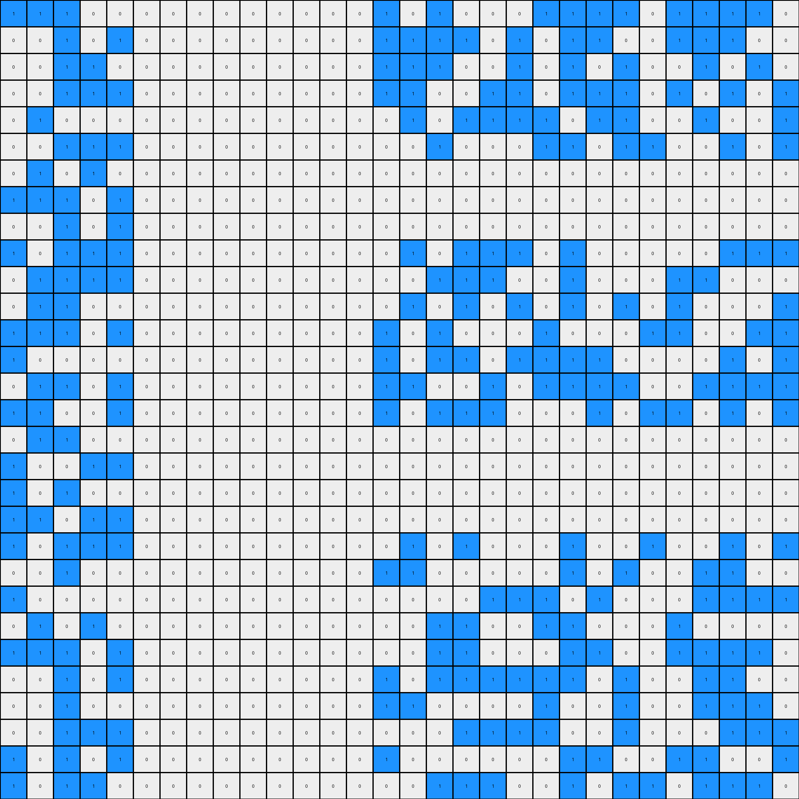

# a64e4611 • 011 • refine_dreamer

---

Previous Code:
```python
"""
1.  **Identify Target Color:** Determine the color of the rightmost vertical stripe that is at least 3 pixels high.
2.  **Find Rightmost Column:** Find the index of the rightmost column of this target color stripe.
3.  **Define Rectangular Region:** Define a rectangular region that starts one column to the right of the identified column and extends to the end of the grid, spanning all rows.
4.  **Preserve Outside Pixels:** All pixels *outside* of this defined rectangular region in the input grid should be copied directly to the output grid.
5.  **Modify Inside Pixels:** All pixels *inside* the identified rectangular region are changed to green (value 3) in the output grid.
"""

import numpy as np

def find_rightmost_stripe_column(grid, min_height):
    """
    Finds the rightmost column index of a vertical stripe of a specific color.

    Args:
    grid: The input grid (numpy array).
    min_height: minimum height of the identified stripe.

    Returns:
    The column index of the rightmost stripe, or -1 if no stripe of min_height is found.
    """
    
    # reverse iterate through columns
    for col_index in range(grid.shape[1] - 1, -1, -1):
        # iterate through all colors to find color of largest contiguous pixels in this column
        color_counts = np.bincount(grid[:, col_index])
        
        # if there is color with count more that min_height
        if np.max(color_counts) >= min_height:
          # exit, we found the color and position of the stripe
          return col_index

    return -1 # no valid stripe

def transform(input_grid):
    """
    Transforms the input grid by changing a rectangular region to the right of a
    colored stripe to green (3).
    """
    output_grid = np.copy(input_grid)  # Initialize output_grid as a copy of the input_grid
    
    # Define the minimum height of a vertical stripe
    min_height = 3

    # Find the rightmost stripe column of the target color
    stripe_column = find_rightmost_stripe_column(input_grid, min_height)

    if stripe_column != -1:  # Ensure a stripe was found
      start_column = stripe_column + 1

      # Define the rectangular region's boundaries
      
      end_column = output_grid.shape[1] - 1

      # Iterate through each row and modify the specified columns
      for row_index in range(output_grid.shape[0]):
          for col_index in range(start_column, end_column + 1):  # Inclusive range
              output_grid[row_index, col_index] = 3  # Set pixel to green (3)
    
    return output_grid
```

Train Set Results:

## Example 1:

Input:
```
8 8 0 8 0 8 0 8 8 8 8 8 0 8 8 8 0 8 0 0 8 0 8 0 0 0 8 8 0 8
0 0 0 8 8 8 8 0 0 8 0 8 0 0 8 8 0 0 8 0 0 0 0 0 8 8 8 8 0 8
8 0 0 0 8 8 0 0 8 0 8 8 0 8 8 0 8 0 8 0 8 8 8 8 0 0 8 0 0 0
0 8 8 0 0 0 0 8 8 0 0 0 0 8 8 0 8 8 0 0 0 8 8 0 8 0 0 0 0 0
8 8 8 0 8 0 0 8 0 0 0 0 0 0 0 0 0 8 8 8 8 0 0 8 0 8 8 0 0 8
0 8 0 0 0 8 8 8 0 0 0 0 0 0 0 0 0 0 8 8 8 8 0 8 0 8 0 0 0 8
0 8 8 8 8 0 0 8 0 0 0 0 0 0 0 0 0 8 8 8 0 0 0 0 0 8 0 8 8 8
0 8 8 8 8 0 0 8 0 0 0 0 0 0 0 0 0 0 0 8 0 8 0 8 8 8 0 0 8 8
8 0 8 8 0 8 8 8 0 0 0 0 0 0 0 0 0 8 0 0 0 8 0 0 8 0 0 8 0 8
8 8 8 0 8 8 0 8 0 0 0 0 0 0 0 0 0 0 0 0 0 0 0 0 0 0 0 0 0 0
8 0 8 8 0 0 8 8 0 0 0 0 0 0 0 0 0 0 0 0 0 0 0 0 0 0 0 0 0 0
0 8 8 0 0 0 0 0 0 0 0 0 0 0 0 0 0 0 0 0 0 0 0 0 0 0 0 0 0 0
0 8 0 0 8 0 0 8 0 0 0 0 0 0 0 0 0 0 0 0 0 0 0 0 0 0 0 0 0 0
8 8 8 8 8 0 0 0 0 0 0 0 0 0 0 0 0 0 0 0 0 8 0 8 8 0 8 8 0 8
8 0 8 8 0 0 8 8 0 0 0 0 0 0 0 0 0 8 8 0 8 0 0 0 8 0 0 0 8 8
8 0 8 0 0 8 8 0 0 0 0 0 0 0 0 0 0 0 0 8 0 8 8 0 0 0 8 0 8 8
0 0 8 8 8 8 0 0 0 0 0 0 0 0 0 0 0 8 8 0 0 0 8 8 0 8 8 0 0 8
8 0 8 0 0 8 8 8 0 0 0 0 0 0 0 0 0 8 8 8 8 0 8 8 0 0 0 8 8 0
8 0 8 8 0 8 0 8 0 0 0 0 0 0 0 0 0 0 8 8 8 0 8 0 8 0 8 0 0 0
0 0 0 0 0 0 0 0 0 0 0 0 0 0 0 0 0 0 8 0 0 0 0 8 8 8 0 8 8 8
0 0 0 0 0 0 0 0 0 0 0 0 0 0 0 0 0 0 0 0 0 0 8 0 0 0 8 0 8 0
0 0 0 0 0 0 0 0 0 0 0 0 0 0 0 0 0 8 0 0 0 0 8 0 8 8 0 0 8 0
0 0 0 0 0 0 0 0 0 0 0 0 0 0 0 0 0 0 8 0 0 0 0 8 0 8 0 8 8 8
8 8 0 0 8 8 0 8 0 0 0 0 0 0 0 0 0 8 8 8 0 8 0 0 0 0 8 8 8 8
0 8 8 8 8 0 0 8 0 0 0 0 0 0 0 0 0 8 0 8 0 8 0 8 8 0 0 0 8 8
0 8 8 0 8 8 8 0 0 0 0 0 0 0 0 0 0 0 0 0 0 0 0 8 0 8 0 8 0 8
8 0 8 8 8 0 8 8 0 0 0 0 0 0 0 0 0 0 8 8 8 0 8 0 8 8 0 0 0 8
8 0 8 0 8 0 8 0 0 0 0 0 0 0 0 0 0 8 0 8 8 0 8 8 0 8 0 0 8 0
0 8 8 0 0 0 0 0 0 0 0 0 0 0 0 0 0 0 8 0 0 8 8 0 8 8 8 0 0 0
8 8 8 0 8 0 0 8 0 0 0 0 0 0 0 0 0 8 8 0 8 0 8 8 0 8 0 8 8 0
```
Expected Output:
```
8 8 0 8 0 8 0 8 8 8 8 8 0 8 8 8 0 8 0 0 8 0 8 0 0 0 8 8 0 8
0 0 0 8 8 8 8 0 0 8 0 8 0 0 8 8 0 0 8 0 0 0 0 0 8 8 8 8 0 8
8 0 0 0 8 8 0 0 8 0 8 8 0 8 8 0 8 0 8 0 8 8 8 8 0 0 8 0 0 0
0 8 8 0 0 0 0 8 8 0 0 0 0 8 8 0 8 8 0 0 0 8 8 0 8 0 0 0 0 0
8 8 8 0 8 0 0 8 0 0 0 0 0 0 0 0 0 8 8 8 8 0 0 8 0 8 8 0 0 8
0 8 0 0 0 8 8 8 0 3 3 3 3 3 3 3 0 0 8 8 8 8 0 8 0 8 0 0 0 8
0 8 8 8 8 0 0 8 0 3 3 3 3 3 3 3 0 8 8 8 0 0 0 0 0 8 0 8 8 8
0 8 8 8 8 0 0 8 0 3 3 3 3 3 3 3 0 0 0 8 0 8 0 8 8 8 0 0 8 8
8 0 8 8 0 8 8 8 0 3 3 3 3 3 3 3 0 8 0 0 0 8 0 0 8 0 0 8 0 8
8 8 8 0 8 8 0 8 0 3 3 3 3 3 3 3 0 0 0 0 0 0 0 0 0 0 0 0 0 0
8 0 8 8 0 0 8 8 0 3 3 3 3 3 3 3 3 3 3 3 3 3 3 3 3 3 3 3 3 3
0 8 8 0 0 0 0 0 0 3 3 3 3 3 3 3 3 3 3 3 3 3 3 3 3 3 3 3 3 3
0 8 0 0 8 0 0 8 0 3 3 3 3 3 3 3 0 0 0 0 0 0 0 0 0 0 0 0 0 0
8 8 8 8 8 0 0 0 0 3 3 3 3 3 3 3 0 0 0 0 0 8 0 8 8 0 8 8 0 8
8 0 8 8 0 0 8 8 0 3 3 3 3 3 3 3 0 8 8 0 8 0 0 0 8 0 0 0 8 8
8 0 8 0 0 8 8 0 0 3 3 3 3 3 3 3 0 0 0 8 0 8 8 0 0 0 8 0 8 8
0 0 8 8 8 8 0 0 0 3 3 3 3 3 3 3 0 8 8 0 0 0 8 8 0 8 8 0 0 8
8 0 8 0 0 8 8 8 0 3 3 3 3 3 3 3 0 8 8 8 8 0 8 8 0 0 0 8 8 0
8 0 8 8 0 8 0 8 0 3 3 3 3 3 3 3 0 0 8 8 8 0 8 0 8 0 8 0 0 0
0 0 0 0 0 0 0 0 0 3 3 3 3 3 3 3 0 0 8 0 0 0 0 8 8 8 0 8 8 8
3 3 3 3 3 3 3 3 3 3 3 3 3 3 3 3 0 0 0 0 0 0 8 0 0 0 8 0 8 0
3 3 3 3 3 3 3 3 3 3 3 3 3 3 3 3 0 8 0 0 0 0 8 0 8 8 0 0 8 0
0 0 0 0 0 0 0 0 0 3 3 3 3 3 3 3 0 0 8 0 0 0 0 8 0 8 0 8 8 8
8 8 0 0 8 8 0 8 0 3 3 3 3 3 3 3 0 8 8 8 0 8 0 0 0 0 8 8 8 8
0 8 8 8 8 0 0 8 0 3 3 3 3 3 3 3 0 8 0 8 0 8 0 8 8 0 0 0 8 8
0 8 8 0 8 8 8 0 0 3 3 3 3 3 3 3 0 0 0 0 0 0 0 8 0 8 0 8 0 8
8 0 8 8 8 0 8 8 0 3 3 3 3 3 3 3 0 0 8 8 8 0 8 0 8 8 0 0 0 8
8 0 8 0 8 0 8 0 0 3 3 3 3 3 3 3 0 8 0 8 8 0 8 8 0 8 0 0 8 0
0 8 8 0 0 0 0 0 0 3 3 3 3 3 3 3 0 0 8 0 0 8 8 0 8 8 8 0 0 0
8 8 8 0 8 0 0 8 0 3 3 3 3 3 3 3 0 8 8 0 8 0 8 8 0 8 0 8 8 0
```
Transformed Output:
```
8 8 0 8 0 8 0 8 8 8 8 8 0 8 8 8 0 8 0 0 8 0 8 0 0 0 8 8 0 8
0 0 0 8 8 8 8 0 0 8 0 8 0 0 8 8 0 0 8 0 0 0 0 0 8 8 8 8 0 8
8 0 0 0 8 8 0 0 8 0 8 8 0 8 8 0 8 0 8 0 8 8 8 8 0 0 8 0 0 0
0 8 8 0 0 0 0 8 8 0 0 0 0 8 8 0 8 8 0 0 0 8 8 0 8 0 0 0 0 0
8 8 8 0 8 0 0 8 0 0 0 0 0 0 0 0 0 8 8 8 8 0 0 8 0 8 8 0 0 8
0 8 0 0 0 8 8 8 0 0 0 0 0 0 0 0 0 0 8 8 8 8 0 8 0 8 0 0 0 8
0 8 8 8 8 0 0 8 0 0 0 0 0 0 0 0 0 8 8 8 0 0 0 0 0 8 0 8 8 8
0 8 8 8 8 0 0 8 0 0 0 0 0 0 0 0 0 0 0 8 0 8 0 8 8 8 0 0 8 8
8 0 8 8 0 8 8 8 0 0 0 0 0 0 0 0 0 8 0 0 0 8 0 0 8 0 0 8 0 8
8 8 8 0 8 8 0 8 0 0 0 0 0 0 0 0 0 0 0 0 0 0 0 0 0 0 0 0 0 0
8 0 8 8 0 0 8 8 0 0 0 0 0 0 0 0 0 0 0 0 0 0 0 0 0 0 0 0 0 0
0 8 8 0 0 0 0 0 0 0 0 0 0 0 0 0 0 0 0 0 0 0 0 0 0 0 0 0 0 0
0 8 0 0 8 0 0 8 0 0 0 0 0 0 0 0 0 0 0 0 0 0 0 0 0 0 0 0 0 0
8 8 8 8 8 0 0 0 0 0 0 0 0 0 0 0 0 0 0 0 0 8 0 8 8 0 8 8 0 8
8 0 8 8 0 0 8 8 0 0 0 0 0 0 0 0 0 8 8 0 8 0 0 0 8 0 0 0 8 8
8 0 8 0 0 8 8 0 0 0 0 0 0 0 0 0 0 0 0 8 0 8 8 0 0 0 8 0 8 8
0 0 8 8 8 8 0 0 0 0 0 0 0 0 0 0 0 8 8 0 0 0 8 8 0 8 8 0 0 8
8 0 8 0 0 8 8 8 0 0 0 0 0 0 0 0 0 8 8 8 8 0 8 8 0 0 0 8 8 0
8 0 8 8 0 8 0 8 0 0 0 0 0 0 0 0 0 0 8 8 8 0 8 0 8 0 8 0 0 0
0 0 0 0 0 0 0 0 0 0 0 0 0 0 0 0 0 0 8 0 0 0 0 8 8 8 0 8 8 8
0 0 0 0 0 0 0 0 0 0 0 0 0 0 0 0 0 0 0 0 0 0 8 0 0 0 8 0 8 0
0 0 0 0 0 0 0 0 0 0 0 0 0 0 0 0 0 8 0 0 0 0 8 0 8 8 0 0 8 0
0 0 0 0 0 0 0 0 0 0 0 0 0 0 0 0 0 0 8 0 0 0 0 8 0 8 0 8 8 8
8 8 0 0 8 8 0 8 0 0 0 0 0 0 0 0 0 8 8 8 0 8 0 0 0 0 8 8 8 8
0 8 8 8 8 0 0 8 0 0 0 0 0 0 0 0 0 8 0 8 0 8 0 8 8 0 0 0 8 8
0 8 8 0 8 8 8 0 0 0 0 0 0 0 0 0 0 0 0 0 0 0 0 8 0 8 0 8 0 8
8 0 8 8 8 0 8 8 0 0 0 0 0 0 0 0 0 0 8 8 8 0 8 0 8 8 0 0 0 8
8 0 8 0 8 0 8 0 0 0 0 0 0 0 0 0 0 8 0 8 8 0 8 8 0 8 0 0 8 0
0 8 8 0 0 0 0 0 0 0 0 0 0 0 0 0 0 0 8 0 0 8 8 0 8 8 8 0 0 0
8 8 8 0 8 0 0 8 0 0 0 0 0 0 0 0 0 8 8 0 8 0 8 8 0 8 0 8 8 0
```

match: False
pixels_off: 221
size_correct: True
color_palette_correct: True
correct_pixel_counts: False

## Example 2:

Input:
```
1 1 1 0 0 0 0 0 0 0 0 0 0 0 1 0 1 0 0 0 1 1 1 1 0 1 1 1 1 0
0 0 1 0 1 0 0 0 0 0 0 0 0 0 1 1 1 1 0 1 0 1 1 0 0 1 1 1 0 0
0 0 1 1 0 0 0 0 0 0 0 0 0 0 1 1 1 0 0 1 0 1 0 1 0 0 1 0 1 0
0 0 1 1 1 0 0 0 0 0 0 0 0 0 1 1 0 0 1 1 0 1 1 1 0 1 0 1 0 1
0 1 0 0 0 0 0 0 0 0 0 0 0 0 0 1 0 1 1 1 1 0 1 1 0 0 1 0 0 1
0 0 1 1 1 0 0 0 0 0 0 0 0 0 0 0 1 0 0 0 1 1 0 1 1 0 0 1 0 1
0 1 0 1 0 0 0 0 0 0 0 0 0 0 0 0 0 0 0 0 0 0 0 0 0 0 0 0 0 0
1 1 1 0 1 0 0 0 0 0 0 0 0 0 0 0 0 0 0 0 0 0 0 0 0 0 0 0 0 0
0 0 1 0 1 0 0 0 0 0 0 0 0 0 0 0 0 0 0 0 0 0 0 0 0 0 0 0 0 0
1 0 1 1 1 0 0 0 0 0 0 0 0 0 0 1 0 1 1 1 0 1 0 0 0 0 0 1 1 1
0 1 1 1 1 0 0 0 0 0 0 0 0 0 0 0 1 1 1 0 0 1 0 0 0 1 1 0 0 0
0 1 1 0 0 0 0 0 0 0 0 0 0 0 0 1 0 1 0 1 0 1 0 1 0 1 0 0 0 1
1 1 1 0 1 0 0 0 0 0 0 0 0 0 1 0 1 0 0 0 1 0 0 0 1 1 0 0 1 1
1 0 0 0 0 0 0 0 0 0 0 0 0 0 1 0 1 1 0 1 1 1 1 0 0 0 0 1 0 1
0 1 1 0 1 0 0 0 0 0 0 0 0 0 1 1 0 0 1 0 1 1 1 1 0 0 1 1 1 1
1 1 0 0 1 0 0 0 0 0 0 0 0 0 1 0 1 1 1 0 0 0 1 0 1 1 0 1 0 1
0 1 1 0 0 0 0 0 0 0 0 0 0 0 0 0 0 0 0 0 0 0 0 0 0 0 0 0 0 0
1 0 0 1 1 0 0 0 0 0 0 0 0 0 0 0 0 0 0 0 0 0 0 0 0 0 0 0 0 0
1 0 1 0 0 0 0 0 0 0 0 0 0 0 0 0 0 0 0 0 0 0 0 0 0 0 0 0 0 0
1 1 0 1 1 0 0 0 0 0 0 0 0 0 0 0 0 0 0 0 0 0 0 0 0 0 0 0 0 0
1 0 1 1 1 0 0 0 0 0 0 0 0 0 0 1 0 1 0 0 0 1 0 0 1 0 0 1 0 1
0 0 1 0 0 0 0 0 0 0 0 0 0 0 1 1 0 0 0 0 0 1 0 1 0 0 1 1 0 0
1 0 0 0 0 0 0 0 0 0 0 0 0 0 0 0 0 0 1 1 1 0 1 0 0 0 1 1 1 1
0 1 0 1 0 0 0 0 0 0 0 0 0 0 0 0 1 1 0 0 1 1 0 0 0 1 0 0 0 0
1 1 1 0 1 0 0 0 0 0 0 0 0 0 0 0 1 1 0 0 0 1 1 0 0 1 1 1 1 0
0 0 1 0 1 0 0 0 0 0 0 0 0 0 1 0 1 1 1 1 1 1 0 1 0 0 1 1 0 0
0 0 1 0 0 0 0 0 0 0 0 0 0 0 1 1 0 0 0 0 1 0 0 1 0 0 1 1 1 0
0 0 1 1 1 0 0 0 0 0 0 0 0 0 0 0 0 1 1 1 1 0 0 1 0 0 0 1 1 1
1 0 1 0 1 0 0 0 0 0 0 0 0 0 1 0 0 0 0 0 0 1 1 0 0 1 1 0 0 1
1 0 1 1 0 0 0 0 0 0 0 0 0 0 0 0 1 1 1 0 0 1 0 1 1 0 1 1 1 0
```
Expected Output:
```
1 1 1 0 0 0 3 3 3 3 3 3 3 0 1 0 1 0 0 0 1 1 1 1 0 1 1 1 1 0
0 0 1 0 1 0 3 3 3 3 3 3 3 0 1 1 1 1 0 1 0 1 1 0 0 1 1 1 0 0
0 0 1 1 0 0 3 3 3 3 3 3 3 0 1 1 1 0 0 1 0 1 0 1 0 0 1 0 1 0
0 0 1 1 1 0 3 3 3 3 3 3 3 0 1 1 0 0 1 1 0 1 1 1 0 1 0 1 0 1
0 1 0 0 0 0 3 3 3 3 3 3 3 0 0 1 0 1 1 1 1 0 1 1 0 0 1 0 0 1
0 0 1 1 1 0 3 3 3 3 3 3 3 0 0 0 1 0 0 0 1 1 0 1 1 0 0 1 0 1
0 1 0 1 0 0 3 3 3 3 3 3 3 0 0 0 0 0 0 0 0 0 0 0 0 0 0 0 0 0
1 1 1 0 1 0 3 3 3 3 3 3 3 3 3 3 3 3 3 3 3 3 3 3 3 3 3 3 3 3
0 0 1 0 1 0 3 3 3 3 3 3 3 0 0 0 0 0 0 0 0 0 0 0 0 0 0 0 0 0
1 0 1 1 1 0 3 3 3 3 3 3 3 0 0 1 0 1 1 1 0 1 0 0 0 0 0 1 1 1
0 1 1 1 1 0 3 3 3 3 3 3 3 0 0 0 1 1 1 0 0 1 0 0 0 1 1 0 0 0
0 1 1 0 0 0 3 3 3 3 3 3 3 0 0 1 0 1 0 1 0 1 0 1 0 1 0 0 0 1
1 1 1 0 1 0 3 3 3 3 3 3 3 0 1 0 1 0 0 0 1 0 0 0 1 1 0 0 1 1
1 0 0 0 0 0 3 3 3 3 3 3 3 0 1 0 1 1 0 1 1 1 1 0 0 0 0 1 0 1
0 1 1 0 1 0 3 3 3 3 3 3 3 0 1 1 0 0 1 0 1 1 1 1 0 0 1 1 1 1
1 1 0 0 1 0 3 3 3 3 3 3 3 0 1 0 1 1 1 0 0 0 1 0 1 1 0 1 0 1
0 1 1 0 0 0 3 3 3 3 3 3 3 0 0 0 0 0 0 0 0 0 0 0 0 0 0 0 0 0
1 0 0 1 1 0 3 3 3 3 3 3 3 3 3 3 3 3 3 3 3 3 3 3 3 3 3 3 3 3
1 0 1 0 0 0 3 3 3 3 3 3 3 3 3 3 3 3 3 3 3 3 3 3 3 3 3 3 3 3
1 1 0 1 1 0 3 3 3 3 3 3 3 0 0 0 0 0 0 0 0 0 0 0 0 0 0 0 0 0
1 0 1 1 1 0 3 3 3 3 3 3 3 0 0 1 0 1 0 0 0 1 0 0 1 0 0 1 0 1
0 0 1 0 0 0 3 3 3 3 3 3 3 0 1 1 0 0 0 0 0 1 0 1 0 0 1 1 0 0
1 0 0 0 0 0 3 3 3 3 3 3 3 0 0 0 0 0 1 1 1 0 1 0 0 0 1 1 1 1
0 1 0 1 0 0 3 3 3 3 3 3 3 0 0 0 1 1 0 0 1 1 0 0 0 1 0 0 0 0
1 1 1 0 1 0 3 3 3 3 3 3 3 0 0 0 1 1 0 0 0 1 1 0 0 1 1 1 1 0
0 0 1 0 1 0 3 3 3 3 3 3 3 0 1 0 1 1 1 1 1 1 0 1 0 0 1 1 0 0
0 0 1 0 0 0 3 3 3 3 3 3 3 0 1 1 0 0 0 0 1 0 0 1 0 0 1 1 1 0
0 0 1 1 1 0 3 3 3 3 3 3 3 0 0 0 0 1 1 1 1 0 0 1 0 0 0 1 1 1
1 0 1 0 1 0 3 3 3 3 3 3 3 0 1 0 0 0 0 0 0 1 1 0 0 1 1 0 0 1
1 0 1 1 0 0 3 3 3 3 3 3 3 0 0 0 1 1 1 0 0 1 0 1 1 0 1 1 1 0
```
Transformed Output:
```
1 1 1 0 0 0 0 0 0 0 0 0 0 0 1 0 1 0 0 0 1 1 1 1 0 1 1 1 1 0
0 0 1 0 1 0 0 0 0 0 0 0 0 0 1 1 1 1 0 1 0 1 1 0 0 1 1 1 0 0
0 0 1 1 0 0 0 0 0 0 0 0 0 0 1 1 1 0 0 1 0 1 0 1 0 0 1 0 1 0
0 0 1 1 1 0 0 0 0 0 0 0 0 0 1 1 0 0 1 1 0 1 1 1 0 1 0 1 0 1
0 1 0 0 0 0 0 0 0 0 0 0 0 0 0 1 0 1 1 1 1 0 1 1 0 0 1 0 0 1
0 0 1 1 1 0 0 0 0 0 0 0 0 0 0 0 1 0 0 0 1 1 0 1 1 0 0 1 0 1
0 1 0 1 0 0 0 0 0 0 0 0 0 0 0 0 0 0 0 0 0 0 0 0 0 0 0 0 0 0
1 1 1 0 1 0 0 0 0 0 0 0 0 0 0 0 0 0 0 0 0 0 0 0 0 0 0 0 0 0
0 0 1 0 1 0 0 0 0 0 0 0 0 0 0 0 0 0 0 0 0 0 0 0 0 0 0 0 0 0
1 0 1 1 1 0 0 0 0 0 0 0 0 0 0 1 0 1 1 1 0 1 0 0 0 0 0 1 1 1
0 1 1 1 1 0 0 0 0 0 0 0 0 0 0 0 1 1 1 0 0 1 0 0 0 1 1 0 0 0
0 1 1 0 0 0 0 0 0 0 0 0 0 0 0 1 0 1 0 1 0 1 0 1 0 1 0 0 0 1
1 1 1 0 1 0 0 0 0 0 0 0 0 0 1 0 1 0 0 0 1 0 0 0 1 1 0 0 1 1
1 0 0 0 0 0 0 0 0 0 0 0 0 0 1 0 1 1 0 1 1 1 1 0 0 0 0 1 0 1
0 1 1 0 1 0 0 0 0 0 0 0 0 0 1 1 0 0 1 0 1 1 1 1 0 0 1 1 1 1
1 1 0 0 1 0 0 0 0 0 0 0 0 0 1 0 1 1 1 0 0 0 1 0 1 1 0 1 0 1
0 1 1 0 0 0 0 0 0 0 0 0 0 0 0 0 0 0 0 0 0 0 0 0 0 0 0 0 0 0
1 0 0 1 1 0 0 0 0 0 0 0 0 0 0 0 0 0 0 0 0 0 0 0 0 0 0 0 0 0
1 0 1 0 0 0 0 0 0 0 0 0 0 0 0 0 0 0 0 0 0 0 0 0 0 0 0 0 0 0
1 1 0 1 1 0 0 0 0 0 0 0 0 0 0 0 0 0 0 0 0 0 0 0 0 0 0 0 0 0
1 0 1 1 1 0 0 0 0 0 0 0 0 0 0 1 0 1 0 0 0 1 0 0 1 0 0 1 0 1
0 0 1 0 0 0 0 0 0 0 0 0 0 0 1 1 0 0 0 0 0 1 0 1 0 0 1 1 0 0
1 0 0 0 0 0 0 0 0 0 0 0 0 0 0 0 0 0 1 1 1 0 1 0 0 0 1 1 1 1
0 1 0 1 0 0 0 0 0 0 0 0 0 0 0 0 1 1 0 0 1 1 0 0 0 1 0 0 0 0
1 1 1 0 1 0 0 0 0 0 0 0 0 0 0 0 1 1 0 0 0 1 1 0 0 1 1 1 1 0
0 0 1 0 1 0 0 0 0 0 0 0 0 0 1 0 1 1 1 1 1 1 0 1 0 0 1 1 0 0
0 0 1 0 0 0 0 0 0 0 0 0 0 0 1 1 0 0 0 0 1 0 0 1 0 0 1 1 1 0
0 0 1 1 1 0 0 0 0 0 0 0 0 0 0 0 0 1 1 1 1 0 0 1 0 0 0 1 1 1
1 0 1 0 1 0 0 0 0 0 0 0 0 0 1 0 0 0 0 0 0 1 1 0 0 1 1 0 0 1
1 0 1 1 0 0 0 0 0 0 0 0 0 0 0 0 1 1 1 0 0 1 0 1 1 0 1 1 1 0
```

match: False
pixels_off: 261
size_correct: True
color_palette_correct: True
correct_pixel_counts: False

## Example 3:

Input:
```
0 2 0 2 2 2 2 0 0 0 0 0 0 0 0 0 0 2 0 0 0 0 0 0 0 2 2 0 0 0
0 0 2 0 0 0 0 0 0 0 0 0 0 0 0 0 0 0 0 0 0 2 2 2 0 0 0 2 2 0
0 2 0 0 0 2 2 0 0 0 0 0 0 0 0 0 0 2 0 2 0 0 0 0 2 0 2 0 2 0
0 0 0 0 2 0 2 0 0 0 0 0 0 0 0 0 0 2 2 0 0 2 2 0 2 2 0 0 0 0
0 2 0 0 2 2 0 0 0 0 0 0 0 0 0 0 0 0 2 0 0 0 0 2 2 0 0 2 0 0
2 0 0 0 0 0 0 0 0 0 0 0 0 0 0 0 0 2 2 2 0 0 2 0 2 0 0 0 0 2
0 0 0 2 0 2 0 0 0 0 0 0 0 0 0 0 0 2 2 0 2 0 0 2 2 2 0 0 0 0
2 2 2 2 0 0 2 0 0 0 0 0 0 0 0 0 0 0 2 0 0 0 2 0 0 0 2 0 2 0
0 0 0 0 0 0 0 0 0 0 0 0 0 0 0 0 0 0 0 2 0 0 2 0 0 0 2 2 0 2
0 0 0 0 0 0 0 0 0 0 0 0 0 0 0 0 0 2 0 0 0 0 0 0 0 0 2 2 0 0
0 0 0 0 0 0 0 0 0 0 0 0 0 0 0 0 0 0 0 2 2 0 2 2 2 0 0 0 0 2
0 0 0 0 0 0 0 0 0 0 0 0 0 0 0 0 0 0 0 2 2 2 2 0 2 0 0 0 0 0
0 0 0 0 0 0 0 0 0 0 0 0 0 0 0 0 0 0 0 0 2 0 0 0 0 0 0 0 2 2
0 0 0 0 0 0 0 0 0 0 0 0 0 0 0 0 0 2 0 0 0 0 0 2 2 0 2 0 0 2
0 0 0 0 0 0 0 0 0 0 0 0 0 0 0 0 0 2 0 0 0 0 2 0 0 2 0 0 2 0
0 0 0 0 0 0 0 0 0 0 0 0 0 0 0 0 0 0 0 0 0 2 0 0 2 0 2 0 2 0
0 0 0 0 0 0 0 0 0 0 0 0 0 0 0 0 0 0 2 0 2 2 0 0 2 2 0 0 0 2
0 0 0 0 0 0 0 0 0 0 0 0 0 0 0 0 0 0 2 2 2 2 0 2 2 2 0 2 0 2
0 0 0 0 0 0 0 0 0 0 0 0 0 0 0 0 0 0 0 0 0 0 2 0 2 0 2 0 0 0
0 0 0 0 0 0 0 0 0 0 0 0 0 0 0 0 0 0 0 0 0 2 0 0 0 2 0 2 0 0
0 0 0 2 2 2 2 0 0 0 0 0 0 0 0 0 0 0 0 2 2 0 0 2 0 2 0 0 0 0
0 0 2 0 0 2 0 0 0 0 0 0 0 0 0 0 0 0 0 0 0 2 2 0 0 0 2 2 0 2
0 0 2 2 0 2 0 0 0 0 0 0 0 0 0 0 0 0 0 2 0 0 0 0 0 0 2 2 2 0
0 2 0 0 0 2 0 0 0 0 0 0 0 0 0 0 0 0 2 0 0 2 0 0 0 0 0 2 0 2
2 0 2 0 0 0 0 0 0 0 0 0 0 0 0 0 0 2 0 2 0 0 0 0 0 0 0 0 0 2
2 2 0 0 2 0 0 0 0 0 0 0 0 0 0 0 0 0 2 2 0 0 2 0 0 2 2 0 0 0
2 0 0 0 2 2 2 0 0 0 0 0 0 0 0 0 0 2 0 0 2 0 2 0 0 0 2 2 2 2
0 2 0 2 0 0 2 0 0 0 0 0 0 0 0 0 0 2 0 0 2 0 2 0 0 0 2 0 2 2
2 0 2 2 0 0 0 0 0 0 0 0 0 0 0 0 0 2 0 0 0 2 2 0 0 0 2 0 2 0
2 0 0 2 2 0 0 0 0 0 0 0 0 0 0 0 0 2 2 2 0 2 2 2 2 2 2 0 2 2
```
Expected Output:
```
0 2 0 2 2 2 2 0 3 3 3 3 3 3 3 3 0 2 0 0 0 0 0 0 0 2 2 0 0 0
0 0 2 0 0 0 0 0 3 3 3 3 3 3 3 3 0 0 0 0 0 2 2 2 0 0 0 2 2 0
0 2 0 0 0 2 2 0 3 3 3 3 3 3 3 3 0 2 0 2 0 0 0 0 2 0 2 0 2 0
0 0 0 0 2 0 2 0 3 3 3 3 3 3 3 3 0 2 2 0 0 2 2 0 2 2 0 0 0 0
0 2 0 0 2 2 0 0 3 3 3 3 3 3 3 3 0 0 2 0 0 0 0 2 2 0 0 2 0 0
2 0 0 0 0 0 0 0 3 3 3 3 3 3 3 3 0 2 2 2 0 0 2 0 2 0 0 0 0 2
0 0 0 2 0 2 0 0 3 3 3 3 3 3 3 3 0 2 2 0 2 0 0 2 2 2 0 0 0 0
2 2 2 2 0 0 2 0 3 3 3 3 3 3 3 3 0 0 2 0 0 0 2 0 0 0 2 0 2 0
0 0 0 0 0 0 0 0 3 3 3 3 3 3 3 3 0 0 0 2 0 0 2 0 0 0 2 2 0 2
3 3 3 3 3 3 3 3 3 3 3 3 3 3 3 3 0 2 0 0 0 0 0 0 0 0 2 2 0 0
3 3 3 3 3 3 3 3 3 3 3 3 3 3 3 3 0 0 0 2 2 0 2 2 2 0 0 0 0 2
3 3 3 3 3 3 3 3 3 3 3 3 3 3 3 3 0 0 0 2 2 2 2 0 2 0 0 0 0 0
3 3 3 3 3 3 3 3 3 3 3 3 3 3 3 3 0 0 0 0 2 0 0 0 0 0 0 0 2 2
3 3 3 3 3 3 3 3 3 3 3 3 3 3 3 3 0 2 0 0 0 0 0 2 2 0 2 0 0 2
3 3 3 3 3 3 3 3 3 3 3 3 3 3 3 3 0 2 0 0 0 0 2 0 0 2 0 0 2 0
3 3 3 3 3 3 3 3 3 3 3 3 3 3 3 3 0 0 0 0 0 2 0 0 2 0 2 0 2 0
3 3 3 3 3 3 3 3 3 3 3 3 3 3 3 3 0 0 2 0 2 2 0 0 2 2 0 0 0 2
3 3 3 3 3 3 3 3 3 3 3 3 3 3 3 3 0 0 2 2 2 2 0 2 2 2 0 2 0 2
3 3 3 3 3 3 3 3 3 3 3 3 3 3 3 3 0 0 0 0 0 0 2 0 2 0 2 0 0 0
0 0 0 0 0 0 0 0 3 3 3 3 3 3 3 3 0 0 0 0 0 2 0 0 0 2 0 2 0 0
0 0 0 2 2 2 2 0 3 3 3 3 3 3 3 3 0 0 0 2 2 0 0 2 0 2 0 0 0 0
0 0 2 0 0 2 0 0 3 3 3 3 3 3 3 3 0 0 0 0 0 2 2 0 0 0 2 2 0 2
0 0 2 2 0 2 0 0 3 3 3 3 3 3 3 3 0 0 0 2 0 0 0 0 0 0 2 2 2 0
0 2 0 0 0 2 0 0 3 3 3 3 3 3 3 3 0 0 2 0 0 2 0 0 0 0 0 2 0 2
2 0 2 0 0 0 0 0 3 3 3 3 3 3 3 3 0 2 0 2 0 0 0 0 0 0 0 0 0 2
2 2 0 0 2 0 0 0 3 3 3 3 3 3 3 3 0 0 2 2 0 0 2 0 0 2 2 0 0 0
2 0 0 0 2 2 2 0 3 3 3 3 3 3 3 3 0 2 0 0 2 0 2 0 0 0 2 2 2 2
0 2 0 2 0 0 2 0 3 3 3 3 3 3 3 3 0 2 0 0 2 0 2 0 0 0 2 0 2 2
2 0 2 2 0 0 0 0 3 3 3 3 3 3 3 3 0 2 0 0 0 2 2 0 0 0 2 0 2 0
2 0 0 2 2 0 0 0 3 3 3 3 3 3 3 3 0 2 2 2 0 2 2 2 2 2 2 0 2 2
```
Transformed Output:
```
0 2 0 2 2 2 2 0 0 0 0 0 0 0 0 0 0 2 0 0 0 0 0 0 0 2 2 0 0 0
0 0 2 0 0 0 0 0 0 0 0 0 0 0 0 0 0 0 0 0 0 2 2 2 0 0 0 2 2 0
0 2 0 0 0 2 2 0 0 0 0 0 0 0 0 0 0 2 0 2 0 0 0 0 2 0 2 0 2 0
0 0 0 0 2 0 2 0 0 0 0 0 0 0 0 0 0 2 2 0 0 2 2 0 2 2 0 0 0 0
0 2 0 0 2 2 0 0 0 0 0 0 0 0 0 0 0 0 2 0 0 0 0 2 2 0 0 2 0 0
2 0 0 0 0 0 0 0 0 0 0 0 0 0 0 0 0 2 2 2 0 0 2 0 2 0 0 0 0 2
0 0 0 2 0 2 0 0 0 0 0 0 0 0 0 0 0 2 2 0 2 0 0 2 2 2 0 0 0 0
2 2 2 2 0 0 2 0 0 0 0 0 0 0 0 0 0 0 2 0 0 0 2 0 0 0 2 0 2 0
0 0 0 0 0 0 0 0 0 0 0 0 0 0 0 0 0 0 0 2 0 0 2 0 0 0 2 2 0 2
0 0 0 0 0 0 0 0 0 0 0 0 0 0 0 0 0 2 0 0 0 0 0 0 0 0 2 2 0 0
0 0 0 0 0 0 0 0 0 0 0 0 0 0 0 0 0 0 0 2 2 0 2 2 2 0 0 0 0 2
0 0 0 0 0 0 0 0 0 0 0 0 0 0 0 0 0 0 0 2 2 2 2 0 2 0 0 0 0 0
0 0 0 0 0 0 0 0 0 0 0 0 0 0 0 0 0 0 0 0 2 0 0 0 0 0 0 0 2 2
0 0 0 0 0 0 0 0 0 0 0 0 0 0 0 0 0 2 0 0 0 0 0 2 2 0 2 0 0 2
0 0 0 0 0 0 0 0 0 0 0 0 0 0 0 0 0 2 0 0 0 0 2 0 0 2 0 0 2 0
0 0 0 0 0 0 0 0 0 0 0 0 0 0 0 0 0 0 0 0 0 2 0 0 2 0 2 0 2 0
0 0 0 0 0 0 0 0 0 0 0 0 0 0 0 0 0 0 2 0 2 2 0 0 2 2 0 0 0 2
0 0 0 0 0 0 0 0 0 0 0 0 0 0 0 0 0 0 2 2 2 2 0 2 2 2 0 2 0 2
0 0 0 0 0 0 0 0 0 0 0 0 0 0 0 0 0 0 0 0 0 0 2 0 2 0 2 0 0 0
0 0 0 0 0 0 0 0 0 0 0 0 0 0 0 0 0 0 0 0 0 2 0 0 0 2 0 2 0 0
0 0 0 2 2 2 2 0 0 0 0 0 0 0 0 0 0 0 0 2 2 0 0 2 0 2 0 0 0 0
0 0 2 0 0 2 0 0 0 0 0 0 0 0 0 0 0 0 0 0 0 2 2 0 0 0 2 2 0 2
0 0 2 2 0 2 0 0 0 0 0 0 0 0 0 0 0 0 0 2 0 0 0 0 0 0 2 2 2 0
0 2 0 0 0 2 0 0 0 0 0 0 0 0 0 0 0 0 2 0 0 2 0 0 0 0 0 2 0 2
2 0 2 0 0 0 0 0 0 0 0 0 0 0 0 0 0 2 0 2 0 0 0 0 0 0 0 0 0 2
2 2 0 0 2 0 0 0 0 0 0 0 0 0 0 0 0 0 2 2 0 0 2 0 0 2 2 0 0 0
2 0 0 0 2 2 2 0 0 0 0 0 0 0 0 0 0 2 0 0 2 0 2 0 0 0 2 2 2 2
0 2 0 2 0 0 2 0 0 0 0 0 0 0 0 0 0 2 0 0 2 0 2 0 0 0 2 0 2 2
2 0 2 2 0 0 0 0 0 0 0 0 0 0 0 0 0 2 0 0 0 2 2 0 0 0 2 0 2 0
2 0 0 2 2 0 0 0 0 0 0 0 0 0 0 0 0 2 2 2 0 2 2 2 2 2 2 0 2 2
```

match: False
pixels_off: 320
size_correct: True
color_palette_correct: True
correct_pixel_counts: False
**INSTRUCTIONS**

The code above was generated based on observations from the first training
example

we have tested the transform function on each of the task example inputs and
compared with the expected output

review each of the examples provided and the results and consider how the
natural language program should be updated to accommodate this new knowledge

respond with the following deliverables:

- general assessment of the information provided and strategy for resolving the
  errors
- gather metrics about each of the examples and results - use code_execution to
  develop accurate reports on your assumptions
- a YAML block documenting facts - Focus on identifying objects, their properties, and the actions performed on them.
- a natural language program - Be as clear and concise as possible, providing a complete description of the transformation rule.


your responses should be considered as information in a report - not a
conversation
