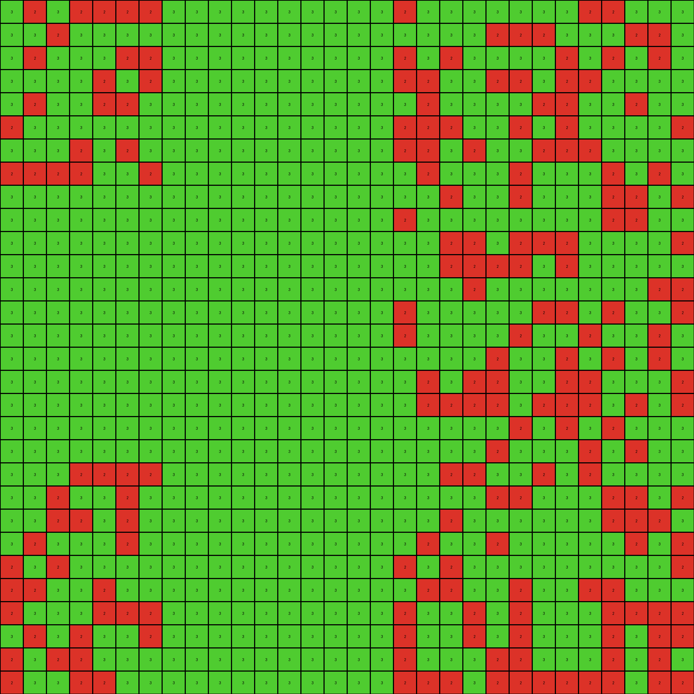

# a64e4611 • 016 • refine_coder

---

Previous Code:
```python
"""
1.  **Identify Red Shapes:** Locate all red (2) pixels in the input grid. These pixels form non-contiguous, scattered shapes.

2.  **Determine Bounding Rectangle:** Find the smallest rectangle that can enclose most part of red color, starting from the top-left corner (0,0). We'll can define this rectangle by its top-left and bottom-right corner coordinates. In fact, the green filling is done from (0,0), while the area is limited by red shapes from left, right and top.

3.  **Fill with Green:** Change all white (0) pixels within a bounding rectangle limited by red color to green (3), until the red color pixels from the input.
"""

import numpy as np

def find_red_pixels(grid):
    """Finds the coordinates of all red pixels in the grid."""
    red_pixels = []
    for row_idx, row in enumerate(grid):
        for col_idx, pixel in enumerate(row):
            if pixel == 2:
                red_pixels.append((row_idx, col_idx))
    return red_pixels

def transform(input_grid):
    """Transforms the input grid according to the described rule."""
    output_grid = np.copy(input_grid)
    red_pixels = find_red_pixels(input_grid)
    
    #find limits of red pixels
    max_row = input_grid.shape[0]
    max_col = input_grid.shape[1]

    # Fill with green (3) from top-left corner
    for r in range(max_row):
        for c in range(max_col):
            if output_grid[r,c] == 0: # Check if it's white
                output_grid[r,c] = 3 #Paint in green
            if output_grid[r,c] == 2:
                continue #If red, stop painting

    return output_grid
```

Train Set Results:

## Example 1:

Input:
```
8 8 0 8 0 8 0 8 8 8 8 8 0 8 8 8 0 8 0 0 8 0 8 0 0 0 8 8 0 8
0 0 0 8 8 8 8 0 0 8 0 8 0 0 8 8 0 0 8 0 0 0 0 0 8 8 8 8 0 8
8 0 0 0 8 8 0 0 8 0 8 8 0 8 8 0 8 0 8 0 8 8 8 8 0 0 8 0 0 0
0 8 8 0 0 0 0 8 8 0 0 0 0 8 8 0 8 8 0 0 0 8 8 0 8 0 0 0 0 0
8 8 8 0 8 0 0 8 0 0 0 0 0 0 0 0 0 8 8 8 8 0 0 8 0 8 8 0 0 8
0 8 0 0 0 8 8 8 0 0 0 0 0 0 0 0 0 0 8 8 8 8 0 8 0 8 0 0 0 8
0 8 8 8 8 0 0 8 0 0 0 0 0 0 0 0 0 8 8 8 0 0 0 0 0 8 0 8 8 8
0 8 8 8 8 0 0 8 0 0 0 0 0 0 0 0 0 0 0 8 0 8 0 8 8 8 0 0 8 8
8 0 8 8 0 8 8 8 0 0 0 0 0 0 0 0 0 8 0 0 0 8 0 0 8 0 0 8 0 8
8 8 8 0 8 8 0 8 0 0 0 0 0 0 0 0 0 0 0 0 0 0 0 0 0 0 0 0 0 0
8 0 8 8 0 0 8 8 0 0 0 0 0 0 0 0 0 0 0 0 0 0 0 0 0 0 0 0 0 0
0 8 8 0 0 0 0 0 0 0 0 0 0 0 0 0 0 0 0 0 0 0 0 0 0 0 0 0 0 0
0 8 0 0 8 0 0 8 0 0 0 0 0 0 0 0 0 0 0 0 0 0 0 0 0 0 0 0 0 0
8 8 8 8 8 0 0 0 0 0 0 0 0 0 0 0 0 0 0 0 0 8 0 8 8 0 8 8 0 8
8 0 8 8 0 0 8 8 0 0 0 0 0 0 0 0 0 8 8 0 8 0 0 0 8 0 0 0 8 8
8 0 8 0 0 8 8 0 0 0 0 0 0 0 0 0 0 0 0 8 0 8 8 0 0 0 8 0 8 8
0 0 8 8 8 8 0 0 0 0 0 0 0 0 0 0 0 8 8 0 0 0 8 8 0 8 8 0 0 8
8 0 8 0 0 8 8 8 0 0 0 0 0 0 0 0 0 8 8 8 8 0 8 8 0 0 0 8 8 0
8 0 8 8 0 8 0 8 0 0 0 0 0 0 0 0 0 0 8 8 8 0 8 0 8 0 8 0 0 0
0 0 0 0 0 0 0 0 0 0 0 0 0 0 0 0 0 0 8 0 0 0 0 8 8 8 0 8 8 8
0 0 0 0 0 0 0 0 0 0 0 0 0 0 0 0 0 0 0 0 0 0 8 0 0 0 8 0 8 0
0 0 0 0 0 0 0 0 0 0 0 0 0 0 0 0 0 8 0 0 0 0 8 0 8 8 0 0 8 0
0 0 0 0 0 0 0 0 0 0 0 0 0 0 0 0 0 0 8 0 0 0 0 8 0 8 0 8 8 8
8 8 0 0 8 8 0 8 0 0 0 0 0 0 0 0 0 8 8 8 0 8 0 0 0 0 8 8 8 8
0 8 8 8 8 0 0 8 0 0 0 0 0 0 0 0 0 8 0 8 0 8 0 8 8 0 0 0 8 8
0 8 8 0 8 8 8 0 0 0 0 0 0 0 0 0 0 0 0 0 0 0 0 8 0 8 0 8 0 8
8 0 8 8 8 0 8 8 0 0 0 0 0 0 0 0 0 0 8 8 8 0 8 0 8 8 0 0 0 8
8 0 8 0 8 0 8 0 0 0 0 0 0 0 0 0 0 8 0 8 8 0 8 8 0 8 0 0 8 0
0 8 8 0 0 0 0 0 0 0 0 0 0 0 0 0 0 0 8 0 0 8 8 0 8 8 8 0 0 0
8 8 8 0 8 0 0 8 0 0 0 0 0 0 0 0 0 8 8 0 8 0 8 8 0 8 0 8 8 0
```
Expected Output:
```
8 8 0 8 0 8 0 8 8 8 8 8 0 8 8 8 0 8 0 0 8 0 8 0 0 0 8 8 0 8
0 0 0 8 8 8 8 0 0 8 0 8 0 0 8 8 0 0 8 0 0 0 0 0 8 8 8 8 0 8
8 0 0 0 8 8 0 0 8 0 8 8 0 8 8 0 8 0 8 0 8 8 8 8 0 0 8 0 0 0
0 8 8 0 0 0 0 8 8 0 0 0 0 8 8 0 8 8 0 0 0 8 8 0 8 0 0 0 0 0
8 8 8 0 8 0 0 8 0 0 0 0 0 0 0 0 0 8 8 8 8 0 0 8 0 8 8 0 0 8
0 8 0 0 0 8 8 8 0 3 3 3 3 3 3 3 0 0 8 8 8 8 0 8 0 8 0 0 0 8
0 8 8 8 8 0 0 8 0 3 3 3 3 3 3 3 0 8 8 8 0 0 0 0 0 8 0 8 8 8
0 8 8 8 8 0 0 8 0 3 3 3 3 3 3 3 0 0 0 8 0 8 0 8 8 8 0 0 8 8
8 0 8 8 0 8 8 8 0 3 3 3 3 3 3 3 0 8 0 0 0 8 0 0 8 0 0 8 0 8
8 8 8 0 8 8 0 8 0 3 3 3 3 3 3 3 0 0 0 0 0 0 0 0 0 0 0 0 0 0
8 0 8 8 0 0 8 8 0 3 3 3 3 3 3 3 3 3 3 3 3 3 3 3 3 3 3 3 3 3
0 8 8 0 0 0 0 0 0 3 3 3 3 3 3 3 3 3 3 3 3 3 3 3 3 3 3 3 3 3
0 8 0 0 8 0 0 8 0 3 3 3 3 3 3 3 0 0 0 0 0 0 0 0 0 0 0 0 0 0
8 8 8 8 8 0 0 0 0 3 3 3 3 3 3 3 0 0 0 0 0 8 0 8 8 0 8 8 0 8
8 0 8 8 0 0 8 8 0 3 3 3 3 3 3 3 0 8 8 0 8 0 0 0 8 0 0 0 8 8
8 0 8 0 0 8 8 0 0 3 3 3 3 3 3 3 0 0 0 8 0 8 8 0 0 0 8 0 8 8
0 0 8 8 8 8 0 0 0 3 3 3 3 3 3 3 0 8 8 0 0 0 8 8 0 8 8 0 0 8
8 0 8 0 0 8 8 8 0 3 3 3 3 3 3 3 0 8 8 8 8 0 8 8 0 0 0 8 8 0
8 0 8 8 0 8 0 8 0 3 3 3 3 3 3 3 0 0 8 8 8 0 8 0 8 0 8 0 0 0
0 0 0 0 0 0 0 0 0 3 3 3 3 3 3 3 0 0 8 0 0 0 0 8 8 8 0 8 8 8
3 3 3 3 3 3 3 3 3 3 3 3 3 3 3 3 0 0 0 0 0 0 8 0 0 0 8 0 8 0
3 3 3 3 3 3 3 3 3 3 3 3 3 3 3 3 0 8 0 0 0 0 8 0 8 8 0 0 8 0
0 0 0 0 0 0 0 0 0 3 3 3 3 3 3 3 0 0 8 0 0 0 0 8 0 8 0 8 8 8
8 8 0 0 8 8 0 8 0 3 3 3 3 3 3 3 0 8 8 8 0 8 0 0 0 0 8 8 8 8
0 8 8 8 8 0 0 8 0 3 3 3 3 3 3 3 0 8 0 8 0 8 0 8 8 0 0 0 8 8
0 8 8 0 8 8 8 0 0 3 3 3 3 3 3 3 0 0 0 0 0 0 0 8 0 8 0 8 0 8
8 0 8 8 8 0 8 8 0 3 3 3 3 3 3 3 0 0 8 8 8 0 8 0 8 8 0 0 0 8
8 0 8 0 8 0 8 0 0 3 3 3 3 3 3 3 0 8 0 8 8 0 8 8 0 8 0 0 8 0
0 8 8 0 0 0 0 0 0 3 3 3 3 3 3 3 0 0 8 0 0 8 8 0 8 8 8 0 0 0
8 8 8 0 8 0 0 8 0 3 3 3 3 3 3 3 0 8 8 0 8 0 8 8 0 8 0 8 8 0
```
Transformed Output:
```
8 8 3 8 3 8 3 8 8 8 8 8 3 8 8 8 3 8 3 3 8 3 8 3 3 3 8 8 3 8
3 3 3 8 8 8 8 3 3 8 3 8 3 3 8 8 3 3 8 3 3 3 3 3 8 8 8 8 3 8
8 3 3 3 8 8 3 3 8 3 8 8 3 8 8 3 8 3 8 3 8 8 8 8 3 3 8 3 3 3
3 8 8 3 3 3 3 8 8 3 3 3 3 8 8 3 8 8 3 3 3 8 8 3 8 3 3 3 3 3
8 8 8 3 8 3 3 8 3 3 3 3 3 3 3 3 3 8 8 8 8 3 3 8 3 8 8 3 3 8
3 8 3 3 3 8 8 8 3 3 3 3 3 3 3 3 3 3 8 8 8 8 3 8 3 8 3 3 3 8
3 8 8 8 8 3 3 8 3 3 3 3 3 3 3 3 3 8 8 8 3 3 3 3 3 8 3 8 8 8
3 8 8 8 8 3 3 8 3 3 3 3 3 3 3 3 3 3 3 8 3 8 3 8 8 8 3 3 8 8
8 3 8 8 3 8 8 8 3 3 3 3 3 3 3 3 3 8 3 3 3 8 3 3 8 3 3 8 3 8
8 8 8 3 8 8 3 8 3 3 3 3 3 3 3 3 3 3 3 3 3 3 3 3 3 3 3 3 3 3
8 3 8 8 3 3 8 8 3 3 3 3 3 3 3 3 3 3 3 3 3 3 3 3 3 3 3 3 3 3
3 8 8 3 3 3 3 3 3 3 3 3 3 3 3 3 3 3 3 3 3 3 3 3 3 3 3 3 3 3
3 8 3 3 8 3 3 8 3 3 3 3 3 3 3 3 3 3 3 3 3 3 3 3 3 3 3 3 3 3
8 8 8 8 8 3 3 3 3 3 3 3 3 3 3 3 3 3 3 3 3 8 3 8 8 3 8 8 3 8
8 3 8 8 3 3 8 8 3 3 3 3 3 3 3 3 3 8 8 3 8 3 3 3 8 3 3 3 8 8
8 3 8 3 3 8 8 3 3 3 3 3 3 3 3 3 3 3 3 8 3 8 8 3 3 3 8 3 8 8
3 3 8 8 8 8 3 3 3 3 3 3 3 3 3 3 3 8 8 3 3 3 8 8 3 8 8 3 3 8
8 3 8 3 3 8 8 8 3 3 3 3 3 3 3 3 3 8 8 8 8 3 8 8 3 3 3 8 8 3
8 3 8 8 3 8 3 8 3 3 3 3 3 3 3 3 3 3 8 8 8 3 8 3 8 3 8 3 3 3
3 3 3 3 3 3 3 3 3 3 3 3 3 3 3 3 3 3 8 3 3 3 3 8 8 8 3 8 8 8
3 3 3 3 3 3 3 3 3 3 3 3 3 3 3 3 3 3 3 3 3 3 8 3 3 3 8 3 8 3
3 3 3 3 3 3 3 3 3 3 3 3 3 3 3 3 3 8 3 3 3 3 8 3 8 8 3 3 8 3
3 3 3 3 3 3 3 3 3 3 3 3 3 3 3 3 3 3 8 3 3 3 3 8 3 8 3 8 8 8
8 8 3 3 8 8 3 8 3 3 3 3 3 3 3 3 3 8 8 8 3 8 3 3 3 3 8 8 8 8
3 8 8 8 8 3 3 8 3 3 3 3 3 3 3 3 3 8 3 8 3 8 3 8 8 3 3 3 8 8
3 8 8 3 8 8 8 3 3 3 3 3 3 3 3 3 3 3 3 3 3 3 3 8 3 8 3 8 3 8
8 3 8 8 8 3 8 8 3 3 3 3 3 3 3 3 3 3 8 8 8 3 8 3 8 8 3 3 3 8
8 3 8 3 8 3 8 3 3 3 3 3 3 3 3 3 3 8 3 8 8 3 8 8 3 8 3 3 8 3
3 8 8 3 3 3 3 3 3 3 3 3 3 3 3 3 3 3 8 3 3 8 8 3 8 8 8 3 3 3
8 8 8 3 8 3 3 8 3 3 3 3 3 3 3 3 3 8 8 3 8 3 8 8 3 8 3 8 8 3
```

match: False
pixels_off: 379
size_correct: True
color_palette_correct: True
correct_pixel_counts: False

## Example 2:

Input:
```
1 1 1 0 0 0 0 0 0 0 0 0 0 0 1 0 1 0 0 0 1 1 1 1 0 1 1 1 1 0
0 0 1 0 1 0 0 0 0 0 0 0 0 0 1 1 1 1 0 1 0 1 1 0 0 1 1 1 0 0
0 0 1 1 0 0 0 0 0 0 0 0 0 0 1 1 1 0 0 1 0 1 0 1 0 0 1 0 1 0
0 0 1 1 1 0 0 0 0 0 0 0 0 0 1 1 0 0 1 1 0 1 1 1 0 1 0 1 0 1
0 1 0 0 0 0 0 0 0 0 0 0 0 0 0 1 0 1 1 1 1 0 1 1 0 0 1 0 0 1
0 0 1 1 1 0 0 0 0 0 0 0 0 0 0 0 1 0 0 0 1 1 0 1 1 0 0 1 0 1
0 1 0 1 0 0 0 0 0 0 0 0 0 0 0 0 0 0 0 0 0 0 0 0 0 0 0 0 0 0
1 1 1 0 1 0 0 0 0 0 0 0 0 0 0 0 0 0 0 0 0 0 0 0 0 0 0 0 0 0
0 0 1 0 1 0 0 0 0 0 0 0 0 0 0 0 0 0 0 0 0 0 0 0 0 0 0 0 0 0
1 0 1 1 1 0 0 0 0 0 0 0 0 0 0 1 0 1 1 1 0 1 0 0 0 0 0 1 1 1
0 1 1 1 1 0 0 0 0 0 0 0 0 0 0 0 1 1 1 0 0 1 0 0 0 1 1 0 0 0
0 1 1 0 0 0 0 0 0 0 0 0 0 0 0 1 0 1 0 1 0 1 0 1 0 1 0 0 0 1
1 1 1 0 1 0 0 0 0 0 0 0 0 0 1 0 1 0 0 0 1 0 0 0 1 1 0 0 1 1
1 0 0 0 0 0 0 0 0 0 0 0 0 0 1 0 1 1 0 1 1 1 1 0 0 0 0 1 0 1
0 1 1 0 1 0 0 0 0 0 0 0 0 0 1 1 0 0 1 0 1 1 1 1 0 0 1 1 1 1
1 1 0 0 1 0 0 0 0 0 0 0 0 0 1 0 1 1 1 0 0 0 1 0 1 1 0 1 0 1
0 1 1 0 0 0 0 0 0 0 0 0 0 0 0 0 0 0 0 0 0 0 0 0 0 0 0 0 0 0
1 0 0 1 1 0 0 0 0 0 0 0 0 0 0 0 0 0 0 0 0 0 0 0 0 0 0 0 0 0
1 0 1 0 0 0 0 0 0 0 0 0 0 0 0 0 0 0 0 0 0 0 0 0 0 0 0 0 0 0
1 1 0 1 1 0 0 0 0 0 0 0 0 0 0 0 0 0 0 0 0 0 0 0 0 0 0 0 0 0
1 0 1 1 1 0 0 0 0 0 0 0 0 0 0 1 0 1 0 0 0 1 0 0 1 0 0 1 0 1
0 0 1 0 0 0 0 0 0 0 0 0 0 0 1 1 0 0 0 0 0 1 0 1 0 0 1 1 0 0
1 0 0 0 0 0 0 0 0 0 0 0 0 0 0 0 0 0 1 1 1 0 1 0 0 0 1 1 1 1
0 1 0 1 0 0 0 0 0 0 0 0 0 0 0 0 1 1 0 0 1 1 0 0 0 1 0 0 0 0
1 1 1 0 1 0 0 0 0 0 0 0 0 0 0 0 1 1 0 0 0 1 1 0 0 1 1 1 1 0
0 0 1 0 1 0 0 0 0 0 0 0 0 0 1 0 1 1 1 1 1 1 0 1 0 0 1 1 0 0
0 0 1 0 0 0 0 0 0 0 0 0 0 0 1 1 0 0 0 0 1 0 0 1 0 0 1 1 1 0
0 0 1 1 1 0 0 0 0 0 0 0 0 0 0 0 0 1 1 1 1 0 0 1 0 0 0 1 1 1
1 0 1 0 1 0 0 0 0 0 0 0 0 0 1 0 0 0 0 0 0 1 1 0 0 1 1 0 0 1
1 0 1 1 0 0 0 0 0 0 0 0 0 0 0 0 1 1 1 0 0 1 0 1 1 0 1 1 1 0
```
Expected Output:
```
1 1 1 0 0 0 3 3 3 3 3 3 3 0 1 0 1 0 0 0 1 1 1 1 0 1 1 1 1 0
0 0 1 0 1 0 3 3 3 3 3 3 3 0 1 1 1 1 0 1 0 1 1 0 0 1 1 1 0 0
0 0 1 1 0 0 3 3 3 3 3 3 3 0 1 1 1 0 0 1 0 1 0 1 0 0 1 0 1 0
0 0 1 1 1 0 3 3 3 3 3 3 3 0 1 1 0 0 1 1 0 1 1 1 0 1 0 1 0 1
0 1 0 0 0 0 3 3 3 3 3 3 3 0 0 1 0 1 1 1 1 0 1 1 0 0 1 0 0 1
0 0 1 1 1 0 3 3 3 3 3 3 3 0 0 0 1 0 0 0 1 1 0 1 1 0 0 1 0 1
0 1 0 1 0 0 3 3 3 3 3 3 3 0 0 0 0 0 0 0 0 0 0 0 0 0 0 0 0 0
1 1 1 0 1 0 3 3 3 3 3 3 3 3 3 3 3 3 3 3 3 3 3 3 3 3 3 3 3 3
0 0 1 0 1 0 3 3 3 3 3 3 3 0 0 0 0 0 0 0 0 0 0 0 0 0 0 0 0 0
1 0 1 1 1 0 3 3 3 3 3 3 3 0 0 1 0 1 1 1 0 1 0 0 0 0 0 1 1 1
0 1 1 1 1 0 3 3 3 3 3 3 3 0 0 0 1 1 1 0 0 1 0 0 0 1 1 0 0 0
0 1 1 0 0 0 3 3 3 3 3 3 3 0 0 1 0 1 0 1 0 1 0 1 0 1 0 0 0 1
1 1 1 0 1 0 3 3 3 3 3 3 3 0 1 0 1 0 0 0 1 0 0 0 1 1 0 0 1 1
1 0 0 0 0 0 3 3 3 3 3 3 3 0 1 0 1 1 0 1 1 1 1 0 0 0 0 1 0 1
0 1 1 0 1 0 3 3 3 3 3 3 3 0 1 1 0 0 1 0 1 1 1 1 0 0 1 1 1 1
1 1 0 0 1 0 3 3 3 3 3 3 3 0 1 0 1 1 1 0 0 0 1 0 1 1 0 1 0 1
0 1 1 0 0 0 3 3 3 3 3 3 3 0 0 0 0 0 0 0 0 0 0 0 0 0 0 0 0 0
1 0 0 1 1 0 3 3 3 3 3 3 3 3 3 3 3 3 3 3 3 3 3 3 3 3 3 3 3 3
1 0 1 0 0 0 3 3 3 3 3 3 3 3 3 3 3 3 3 3 3 3 3 3 3 3 3 3 3 3
1 1 0 1 1 0 3 3 3 3 3 3 3 0 0 0 0 0 0 0 0 0 0 0 0 0 0 0 0 0
1 0 1 1 1 0 3 3 3 3 3 3 3 0 0 1 0 1 0 0 0 1 0 0 1 0 0 1 0 1
0 0 1 0 0 0 3 3 3 3 3 3 3 0 1 1 0 0 0 0 0 1 0 1 0 0 1 1 0 0
1 0 0 0 0 0 3 3 3 3 3 3 3 0 0 0 0 0 1 1 1 0 1 0 0 0 1 1 1 1
0 1 0 1 0 0 3 3 3 3 3 3 3 0 0 0 1 1 0 0 1 1 0 0 0 1 0 0 0 0
1 1 1 0 1 0 3 3 3 3 3 3 3 0 0 0 1 1 0 0 0 1 1 0 0 1 1 1 1 0
0 0 1 0 1 0 3 3 3 3 3 3 3 0 1 0 1 1 1 1 1 1 0 1 0 0 1 1 0 0
0 0 1 0 0 0 3 3 3 3 3 3 3 0 1 1 0 0 0 0 1 0 0 1 0 0 1 1 1 0
0 0 1 1 1 0 3 3 3 3 3 3 3 0 0 0 0 1 1 1 1 0 0 1 0 0 0 1 1 1
1 0 1 0 1 0 3 3 3 3 3 3 3 0 1 0 0 0 0 0 0 1 1 0 0 1 1 0 0 1
1 0 1 1 0 0 3 3 3 3 3 3 3 0 0 0 1 1 1 0 0 1 0 1 1 0 1 1 1 0
```
Transformed Output:
```
1 1 1 3 3 3 3 3 3 3 3 3 3 3 1 3 1 3 3 3 1 1 1 1 3 1 1 1 1 3
3 3 1 3 1 3 3 3 3 3 3 3 3 3 1 1 1 1 3 1 3 1 1 3 3 1 1 1 3 3
3 3 1 1 3 3 3 3 3 3 3 3 3 3 1 1 1 3 3 1 3 1 3 1 3 3 1 3 1 3
3 3 1 1 1 3 3 3 3 3 3 3 3 3 1 1 3 3 1 1 3 1 1 1 3 1 3 1 3 1
3 1 3 3 3 3 3 3 3 3 3 3 3 3 3 1 3 1 1 1 1 3 1 1 3 3 1 3 3 1
3 3 1 1 1 3 3 3 3 3 3 3 3 3 3 3 1 3 3 3 1 1 3 1 1 3 3 1 3 1
3 1 3 1 3 3 3 3 3 3 3 3 3 3 3 3 3 3 3 3 3 3 3 3 3 3 3 3 3 3
1 1 1 3 1 3 3 3 3 3 3 3 3 3 3 3 3 3 3 3 3 3 3 3 3 3 3 3 3 3
3 3 1 3 1 3 3 3 3 3 3 3 3 3 3 3 3 3 3 3 3 3 3 3 3 3 3 3 3 3
1 3 1 1 1 3 3 3 3 3 3 3 3 3 3 1 3 1 1 1 3 1 3 3 3 3 3 1 1 1
3 1 1 1 1 3 3 3 3 3 3 3 3 3 3 3 1 1 1 3 3 1 3 3 3 1 1 3 3 3
3 1 1 3 3 3 3 3 3 3 3 3 3 3 3 1 3 1 3 1 3 1 3 1 3 1 3 3 3 1
1 1 1 3 1 3 3 3 3 3 3 3 3 3 1 3 1 3 3 3 1 3 3 3 1 1 3 3 1 1
1 3 3 3 3 3 3 3 3 3 3 3 3 3 1 3 1 1 3 1 1 1 1 3 3 3 3 1 3 1
3 1 1 3 1 3 3 3 3 3 3 3 3 3 1 1 3 3 1 3 1 1 1 1 3 3 1 1 1 1
1 1 3 3 1 3 3 3 3 3 3 3 3 3 1 3 1 1 1 3 3 3 1 3 1 1 3 1 3 1
3 1 1 3 3 3 3 3 3 3 3 3 3 3 3 3 3 3 3 3 3 3 3 3 3 3 3 3 3 3
1 3 3 1 1 3 3 3 3 3 3 3 3 3 3 3 3 3 3 3 3 3 3 3 3 3 3 3 3 3
1 3 1 3 3 3 3 3 3 3 3 3 3 3 3 3 3 3 3 3 3 3 3 3 3 3 3 3 3 3
1 1 3 1 1 3 3 3 3 3 3 3 3 3 3 3 3 3 3 3 3 3 3 3 3 3 3 3 3 3
1 3 1 1 1 3 3 3 3 3 3 3 3 3 3 1 3 1 3 3 3 1 3 3 1 3 3 1 3 1
3 3 1 3 3 3 3 3 3 3 3 3 3 3 1 1 3 3 3 3 3 1 3 1 3 3 1 1 3 3
1 3 3 3 3 3 3 3 3 3 3 3 3 3 3 3 3 3 1 1 1 3 1 3 3 3 1 1 1 1
3 1 3 1 3 3 3 3 3 3 3 3 3 3 3 3 1 1 3 3 1 1 3 3 3 1 3 3 3 3
1 1 1 3 1 3 3 3 3 3 3 3 3 3 3 3 1 1 3 3 3 1 1 3 3 1 1 1 1 3
3 3 1 3 1 3 3 3 3 3 3 3 3 3 1 3 1 1 1 1 1 1 3 1 3 3 1 1 3 3
3 3 1 3 3 3 3 3 3 3 3 3 3 3 1 1 3 3 3 3 1 3 3 1 3 3 1 1 1 3
3 3 1 1 1 3 3 3 3 3 3 3 3 3 3 3 3 1 1 1 1 3 3 1 3 3 3 1 1 1
1 3 1 3 1 3 3 3 3 3 3 3 3 3 1 3 3 3 3 3 3 1 1 3 3 1 1 3 3 1
1 3 1 1 3 3 3 3 3 3 3 3 3 3 3 3 1 1 1 3 3 1 3 1 1 3 1 1 1 3
```

match: False
pixels_off: 377
size_correct: True
color_palette_correct: True
correct_pixel_counts: False

## Example 3:

Input:
```
0 2 0 2 2 2 2 0 0 0 0 0 0 0 0 0 0 2 0 0 0 0 0 0 0 2 2 0 0 0
0 0 2 0 0 0 0 0 0 0 0 0 0 0 0 0 0 0 0 0 0 2 2 2 0 0 0 2 2 0
0 2 0 0 0 2 2 0 0 0 0 0 0 0 0 0 0 2 0 2 0 0 0 0 2 0 2 0 2 0
0 0 0 0 2 0 2 0 0 0 0 0 0 0 0 0 0 2 2 0 0 2 2 0 2 2 0 0 0 0
0 2 0 0 2 2 0 0 0 0 0 0 0 0 0 0 0 0 2 0 0 0 0 2 2 0 0 2 0 0
2 0 0 0 0 0 0 0 0 0 0 0 0 0 0 0 0 2 2 2 0 0 2 0 2 0 0 0 0 2
0 0 0 2 0 2 0 0 0 0 0 0 0 0 0 0 0 2 2 0 2 0 0 2 2 2 0 0 0 0
2 2 2 2 0 0 2 0 0 0 0 0 0 0 0 0 0 0 2 0 0 0 2 0 0 0 2 0 2 0
0 0 0 0 0 0 0 0 0 0 0 0 0 0 0 0 0 0 0 2 0 0 2 0 0 0 2 2 0 2
0 0 0 0 0 0 0 0 0 0 0 0 0 0 0 0 0 2 0 0 0 0 0 0 0 0 2 2 0 0
0 0 0 0 0 0 0 0 0 0 0 0 0 0 0 0 0 0 0 2 2 0 2 2 2 0 0 0 0 2
0 0 0 0 0 0 0 0 0 0 0 0 0 0 0 0 0 0 0 2 2 2 2 0 2 0 0 0 0 0
0 0 0 0 0 0 0 0 0 0 0 0 0 0 0 0 0 0 0 0 2 0 0 0 0 0 0 0 2 2
0 0 0 0 0 0 0 0 0 0 0 0 0 0 0 0 0 2 0 0 0 0 0 2 2 0 2 0 0 2
0 0 0 0 0 0 0 0 0 0 0 0 0 0 0 0 0 2 0 0 0 0 2 0 0 2 0 0 2 0
0 0 0 0 0 0 0 0 0 0 0 0 0 0 0 0 0 0 0 0 0 2 0 0 2 0 2 0 2 0
0 0 0 0 0 0 0 0 0 0 0 0 0 0 0 0 0 0 2 0 2 2 0 0 2 2 0 0 0 2
0 0 0 0 0 0 0 0 0 0 0 0 0 0 0 0 0 0 2 2 2 2 0 2 2 2 0 2 0 2
0 0 0 0 0 0 0 0 0 0 0 0 0 0 0 0 0 0 0 0 0 0 2 0 2 0 2 0 0 0
0 0 0 0 0 0 0 0 0 0 0 0 0 0 0 0 0 0 0 0 0 2 0 0 0 2 0 2 0 0
0 0 0 2 2 2 2 0 0 0 0 0 0 0 0 0 0 0 0 2 2 0 0 2 0 2 0 0 0 0
0 0 2 0 0 2 0 0 0 0 0 0 0 0 0 0 0 0 0 0 0 2 2 0 0 0 2 2 0 2
0 0 2 2 0 2 0 0 0 0 0 0 0 0 0 0 0 0 0 2 0 0 0 0 0 0 2 2 2 0
0 2 0 0 0 2 0 0 0 0 0 0 0 0 0 0 0 0 2 0 0 2 0 0 0 0 0 2 0 2
2 0 2 0 0 0 0 0 0 0 0 0 0 0 0 0 0 2 0 2 0 0 0 0 0 0 0 0 0 2
2 2 0 0 2 0 0 0 0 0 0 0 0 0 0 0 0 0 2 2 0 0 2 0 0 2 2 0 0 0
2 0 0 0 2 2 2 0 0 0 0 0 0 0 0 0 0 2 0 0 2 0 2 0 0 0 2 2 2 2
0 2 0 2 0 0 2 0 0 0 0 0 0 0 0 0 0 2 0 0 2 0 2 0 0 0 2 0 2 2
2 0 2 2 0 0 0 0 0 0 0 0 0 0 0 0 0 2 0 0 0 2 2 0 0 0 2 0 2 0
2 0 0 2 2 0 0 0 0 0 0 0 0 0 0 0 0 2 2 2 0 2 2 2 2 2 2 0 2 2
```
Expected Output:
```
0 2 0 2 2 2 2 0 3 3 3 3 3 3 3 3 0 2 0 0 0 0 0 0 0 2 2 0 0 0
0 0 2 0 0 0 0 0 3 3 3 3 3 3 3 3 0 0 0 0 0 2 2 2 0 0 0 2 2 0
0 2 0 0 0 2 2 0 3 3 3 3 3 3 3 3 0 2 0 2 0 0 0 0 2 0 2 0 2 0
0 0 0 0 2 0 2 0 3 3 3 3 3 3 3 3 0 2 2 0 0 2 2 0 2 2 0 0 0 0
0 2 0 0 2 2 0 0 3 3 3 3 3 3 3 3 0 0 2 0 0 0 0 2 2 0 0 2 0 0
2 0 0 0 0 0 0 0 3 3 3 3 3 3 3 3 0 2 2 2 0 0 2 0 2 0 0 0 0 2
0 0 0 2 0 2 0 0 3 3 3 3 3 3 3 3 0 2 2 0 2 0 0 2 2 2 0 0 0 0
2 2 2 2 0 0 2 0 3 3 3 3 3 3 3 3 0 0 2 0 0 0 2 0 0 0 2 0 2 0
0 0 0 0 0 0 0 0 3 3 3 3 3 3 3 3 0 0 0 2 0 0 2 0 0 0 2 2 0 2
3 3 3 3 3 3 3 3 3 3 3 3 3 3 3 3 0 2 0 0 0 0 0 0 0 0 2 2 0 0
3 3 3 3 3 3 3 3 3 3 3 3 3 3 3 3 0 0 0 2 2 0 2 2 2 0 0 0 0 2
3 3 3 3 3 3 3 3 3 3 3 3 3 3 3 3 0 0 0 2 2 2 2 0 2 0 0 0 0 0
3 3 3 3 3 3 3 3 3 3 3 3 3 3 3 3 0 0 0 0 2 0 0 0 0 0 0 0 2 2
3 3 3 3 3 3 3 3 3 3 3 3 3 3 3 3 0 2 0 0 0 0 0 2 2 0 2 0 0 2
3 3 3 3 3 3 3 3 3 3 3 3 3 3 3 3 0 2 0 0 0 0 2 0 0 2 0 0 2 0
3 3 3 3 3 3 3 3 3 3 3 3 3 3 3 3 0 0 0 0 0 2 0 0 2 0 2 0 2 0
3 3 3 3 3 3 3 3 3 3 3 3 3 3 3 3 0 0 2 0 2 2 0 0 2 2 0 0 0 2
3 3 3 3 3 3 3 3 3 3 3 3 3 3 3 3 0 0 2 2 2 2 0 2 2 2 0 2 0 2
3 3 3 3 3 3 3 3 3 3 3 3 3 3 3 3 0 0 0 0 0 0 2 0 2 0 2 0 0 0
0 0 0 0 0 0 0 0 3 3 3 3 3 3 3 3 0 0 0 0 0 2 0 0 0 2 0 2 0 0
0 0 0 2 2 2 2 0 3 3 3 3 3 3 3 3 0 0 0 2 2 0 0 2 0 2 0 0 0 0
0 0 2 0 0 2 0 0 3 3 3 3 3 3 3 3 0 0 0 0 0 2 2 0 0 0 2 2 0 2
0 0 2 2 0 2 0 0 3 3 3 3 3 3 3 3 0 0 0 2 0 0 0 0 0 0 2 2 2 0
0 2 0 0 0 2 0 0 3 3 3 3 3 3 3 3 0 0 2 0 0 2 0 0 0 0 0 2 0 2
2 0 2 0 0 0 0 0 3 3 3 3 3 3 3 3 0 2 0 2 0 0 0 0 0 0 0 0 0 2
2 2 0 0 2 0 0 0 3 3 3 3 3 3 3 3 0 0 2 2 0 0 2 0 0 2 2 0 0 0
2 0 0 0 2 2 2 0 3 3 3 3 3 3 3 3 0 2 0 0 2 0 2 0 0 0 2 2 2 2
0 2 0 2 0 0 2 0 3 3 3 3 3 3 3 3 0 2 0 0 2 0 2 0 0 0 2 0 2 2
2 0 2 2 0 0 0 0 3 3 3 3 3 3 3 3 0 2 0 0 0 2 2 0 0 0 2 0 2 0
2 0 0 2 2 0 0 0 3 3 3 3 3 3 3 3 0 2 2 2 0 2 2 2 2 2 2 0 2 2
```
Transformed Output:
```
3 2 3 2 2 2 2 3 3 3 3 3 3 3 3 3 3 2 3 3 3 3 3 3 3 2 2 3 3 3
3 3 2 3 3 3 3 3 3 3 3 3 3 3 3 3 3 3 3 3 3 2 2 2 3 3 3 2 2 3
3 2 3 3 3 2 2 3 3 3 3 3 3 3 3 3 3 2 3 2 3 3 3 3 2 3 2 3 2 3
3 3 3 3 2 3 2 3 3 3 3 3 3 3 3 3 3 2 2 3 3 2 2 3 2 2 3 3 3 3
3 2 3 3 2 2 3 3 3 3 3 3 3 3 3 3 3 3 2 3 3 3 3 2 2 3 3 2 3 3
2 3 3 3 3 3 3 3 3 3 3 3 3 3 3 3 3 2 2 2 3 3 2 3 2 3 3 3 3 2
3 3 3 2 3 2 3 3 3 3 3 3 3 3 3 3 3 2 2 3 2 3 3 2 2 2 3 3 3 3
2 2 2 2 3 3 2 3 3 3 3 3 3 3 3 3 3 3 2 3 3 3 2 3 3 3 2 3 2 3
3 3 3 3 3 3 3 3 3 3 3 3 3 3 3 3 3 3 3 2 3 3 2 3 3 3 2 2 3 2
3 3 3 3 3 3 3 3 3 3 3 3 3 3 3 3 3 2 3 3 3 3 3 3 3 3 2 2 3 3
3 3 3 3 3 3 3 3 3 3 3 3 3 3 3 3 3 3 3 2 2 3 2 2 2 3 3 3 3 2
3 3 3 3 3 3 3 3 3 3 3 3 3 3 3 3 3 3 3 2 2 2 2 3 2 3 3 3 3 3
3 3 3 3 3 3 3 3 3 3 3 3 3 3 3 3 3 3 3 3 2 3 3 3 3 3 3 3 2 2
3 3 3 3 3 3 3 3 3 3 3 3 3 3 3 3 3 2 3 3 3 3 3 2 2 3 2 3 3 2
3 3 3 3 3 3 3 3 3 3 3 3 3 3 3 3 3 2 3 3 3 3 2 3 3 2 3 3 2 3
3 3 3 3 3 3 3 3 3 3 3 3 3 3 3 3 3 3 3 3 3 2 3 3 2 3 2 3 2 3
3 3 3 3 3 3 3 3 3 3 3 3 3 3 3 3 3 3 2 3 2 2 3 3 2 2 3 3 3 2
3 3 3 3 3 3 3 3 3 3 3 3 3 3 3 3 3 3 2 2 2 2 3 2 2 2 3 2 3 2
3 3 3 3 3 3 3 3 3 3 3 3 3 3 3 3 3 3 3 3 3 3 2 3 2 3 2 3 3 3
3 3 3 3 3 3 3 3 3 3 3 3 3 3 3 3 3 3 3 3 3 2 3 3 3 2 3 2 3 3
3 3 3 2 2 2 2 3 3 3 3 3 3 3 3 3 3 3 3 2 2 3 3 2 3 2 3 3 3 3
3 3 2 3 3 2 3 3 3 3 3 3 3 3 3 3 3 3 3 3 3 2 2 3 3 3 2 2 3 2
3 3 2 2 3 2 3 3 3 3 3 3 3 3 3 3 3 3 3 2 3 3 3 3 3 3 2 2 2 3
3 2 3 3 3 2 3 3 3 3 3 3 3 3 3 3 3 3 2 3 3 2 3 3 3 3 3 2 3 2
2 3 2 3 3 3 3 3 3 3 3 3 3 3 3 3 3 2 3 2 3 3 3 3 3 3 3 3 3 2
2 2 3 3 2 3 3 3 3 3 3 3 3 3 3 3 3 3 2 2 3 3 2 3 3 2 2 3 3 3
2 3 3 3 2 2 2 3 3 3 3 3 3 3 3 3 3 2 3 3 2 3 2 3 3 3 2 2 2 2
3 2 3 2 3 3 2 3 3 3 3 3 3 3 3 3 3 2 3 3 2 3 2 3 3 3 2 3 2 2
2 3 2 2 3 3 3 3 3 3 3 3 3 3 3 3 3 2 3 3 3 2 2 3 3 3 2 3 2 3
2 3 3 2 2 3 3 3 3 3 3 3 3 3 3 3 3 2 2 2 3 2 2 2 2 2 2 3 2 2
```

match: False
pixels_off: 380
size_correct: True
color_palette_correct: True
correct_pixel_counts: False
Okay, let's analyze the results and update the natural language program and approach.

**General Assessment:**

The initial approach of filling from the top-left corner (0,0) with green until a red pixel is encountered is fundamentally flawed. It doesn't consider the spatial arrangement of the red pixels as defining enclosed regions, and it doesn't respect object boundaries. It simply floods green from the top-left. The examples clearly show that red pixels act as *boundaries* for the green fill, but the filling isn't always a simple flood fill from (0,0). It's more like identifying enclosed white regions limited by red objects and fill those.

**Strategy for Resolving Errors:**

1.  **Shift from Flood Fill to Region Filling:** We need to move away from a simple flood-fill approach that starts at a fixed point. Instead, we must identify *regions* of white pixels that are enclosed or bounded by red pixels.
2.  **Consider Connectivity:** We should detect 8-connectivity (both orthogonal and diagonal neighbors) to define the white regions properly. A simple row-by-row scan won't suffice.
3.  **Object Boundaries:** Red is clearly intended as a boundary. The filling should happen *within* the areas delimited by red color.

**Example Metrics and Analysis:**

Let's use a more structured approach to analyzing the failed examples. I'll focus on key aspects relevant to updating the program, using the prior code as a guide for how to get information.

I will create metrics report to be added to the YAML

```tool_code
import numpy as np
from collections import Counter

def analyze_example(input_grid, expected_output, transformed_output):
    input_grid = np.array(input_grid)
    expected_output = np.array(expected_output)
    transformed_output = np.array(transformed_output)

    # 1. Size Check
    size_correct = input_grid.shape == expected_output.shape == transformed_output.shape

    # 2. Color Palette Check
    input_colors = set(np.unique(input_grid))
    expected_colors = set(np.unique(expected_output))
    transformed_colors = set(np.unique(transformed_output))
    color_palette_correct = input_colors.issubset({0, 1, 2, 8}) and expected_colors.issubset({0, 1, 2, 3, 8}) and transformed_colors.issubset({0, 1, 2, 3, 8})

    # 3. Pixel-wise Comparison
    match = np.array_equal(expected_output, transformed_output)
    pixels_off = np.sum(expected_output != transformed_output) if not match else 0

    # 4. Count Occurrences of Each Color
    def count_colors(grid):
        color_counts = Counter(grid.flatten())
        return {color: color_counts.get(color, 0) for color in [0, 1, 2, 3, 8]}

    input_color_counts = count_colors(input_grid)
    expected_color_counts = count_colors(expected_output)
    transformed_color_counts = count_colors(transformed_output)
    correct_pixel_counts = expected_color_counts == transformed_color_counts

    return {
        "size_correct": size_correct,
        "color_palette_correct": color_palette_correct,
        "match": match,
        "pixels_off": pixels_off,
        "input_color_counts": input_color_counts,
        "expected_color_counts": expected_color_counts,
        "transformed_color_counts": transformed_color_counts,
        "correct_pixel_counts" : correct_pixel_counts
    }

# Example grids - replace with your actual grids
example_inputs = [
    [[8, 8, 0, 8, 0, 8, 0, 8, 8, 8, 8, 8, 0, 8, 8, 8, 0, 8, 0, 0, 8, 0, 8, 0, 0, 0, 8, 8, 0, 8], [0, 0, 0, 8, 8, 8, 8, 0, 0, 8, 0, 8, 0, 0, 8, 8, 0, 0, 8, 0, 0, 0, 0, 0, 8, 8, 8, 8, 0, 8], [8, 0, 0, 0, 8, 8, 0, 0, 8, 0, 8, 8, 0, 8, 8, 0, 8, 0, 8, 0, 8, 8, 8, 8, 0, 0, 8, 0, 0, 0], [0, 8, 8, 0, 0, 0, 0, 8, 8, 0, 0, 0, 0, 8, 8, 0, 8, 8, 0, 0, 0, 8, 8, 0, 8, 0, 0, 0, 0, 0], [8, 8, 8, 0, 8, 0, 0, 8, 0, 0, 0, 0, 0, 0, 0, 0, 0, 8, 8, 8, 8, 0, 0, 8, 0, 8, 8, 0, 0, 8], [0, 8, 0, 0, 0, 8, 8, 8, 0, 0, 0, 0, 0, 0, 0, 0, 0, 0, 8, 8, 8, 8, 0, 8, 0, 8, 0, 0, 0, 8], [0, 8, 8, 8, 8, 0, 0, 8, 0, 0, 0, 0, 0, 0, 0, 0, 0, 8, 8, 8, 0, 0, 0, 0, 0, 8, 0, 8, 8, 8], [0, 8, 8, 8, 8, 0, 0, 8, 0, 0, 0, 0, 0, 0, 0, 0, 0, 0, 0, 8, 0, 8, 0, 8, 8, 8, 0, 0, 8, 8], [8, 0, 8, 8, 0, 8, 8, 8, 0, 0, 0, 0, 0, 0, 0, 0, 0, 8, 0, 0, 0, 8, 0, 0, 8, 0, 0, 8, 0, 8], [8, 8, 8, 0, 8, 8, 0, 8, 0, 0, 0, 0, 0, 0, 0, 0, 0, 0, 0, 0, 0, 0, 0, 0, 0, 0, 0, 0, 0, 0], [8, 0, 8, 8, 0, 0, 8, 8, 0, 0, 0, 0, 0, 0, 0, 0, 0, 0, 0, 0, 0, 0, 0, 0, 0, 0, 0, 0, 0, 0], [0, 8, 8, 0, 0, 0, 0, 0, 0, 0, 0, 0, 0, 0, 0, 0, 0, 0, 0, 0, 0, 0, 0, 0, 0, 0, 0, 0, 0, 0], [0, 8, 0, 0, 8, 0, 0, 8, 0, 0, 0, 0, 0, 0, 0, 0, 0, 0, 0, 0, 0, 0, 0, 0, 0, 0, 0, 0, 0, 0], [8, 8, 8, 8, 8, 0, 0, 0, 0, 0, 0, 0, 0, 0, 0, 0, 0, 0, 0, 0, 8, 0, 8, 8, 0, 8, 8, 0, 8], [8, 0, 8, 8, 0, 0, 8, 8, 0, 0, 0, 0, 0, 0, 0, 0, 0, 8, 8, 0, 8, 0, 0, 0, 8, 0, 0, 0, 8, 8], [8, 0, 8, 0, 0, 8, 8, 0, 0, 0, 0, 0, 0, 0, 0, 0, 0, 0, 0, 8, 0, 8, 8, 0, 0, 0, 8, 0, 8, 8], [0, 0, 8, 8, 8, 8, 0, 0, 0, 0, 0, 0, 0, 0, 0, 0, 0, 8, 8, 0, 0, 0, 8, 8, 0, 8, 8, 0, 0, 8], [8, 0, 8, 0, 0, 8, 8, 8, 0, 0, 0, 0, 0, 0, 0, 0, 0, 8, 8, 8, 8, 0, 8, 8, 0, 0, 0, 8, 8, 0], [8, 0, 8, 8, 0, 8, 0, 8, 0, 0, 0, 0, 0, 0, 0, 0, 0, 0, 8, 8, 8, 0, 8, 0, 8, 0, 8, 0, 0, 0], [0, 0, 0, 0, 0, 0, 0, 0, 0, 0, 0, 0, 0, 0, 0, 0, 0, 0, 8, 0, 0, 0, 0, 8, 8, 8, 0, 8, 8, 8], [0, 0, 0, 0, 0, 0, 0, 0, 0, 0, 0, 0, 0, 0, 0, 0, 0, 0, 0, 0, 0, 0, 8, 0, 0, 0, 8, 0, 8, 0], [0, 0, 0, 0, 0, 0, 0, 0, 0, 0, 0, 0, 0, 0, 0, 0, 0, 8, 0, 0, 0, 0, 8, 0, 8, 8, 0, 0, 8, 0], [0, 0, 0, 0, 0, 0, 0, 0, 0, 0, 0, 0, 0, 0, 0, 0, 0, 0, 8, 0, 0, 0, 0, 8, 0, 8, 0, 8, 8, 8], [8, 8, 0, 0, 8, 8, 0, 8, 0, 0, 0, 0, 0, 0, 0, 0, 0, 8, 8, 8, 0, 8, 0, 0, 0, 0, 8, 8, 8, 8], [0, 8, 8, 8, 8, 0, 0, 8, 0, 0, 0, 0, 0, 0, 0, 0, 0, 8, 0, 8, 0, 8, 0, 8, 8, 0, 0, 0, 8, 8], [0, 8, 8, 0, 8, 8, 8, 0, 0, 0, 0, 0, 0, 0, 0, 0, 0, 0, 0, 0, 0, 0, 8, 0, 8, 0, 8, 0, 8], [8, 0, 8, 8, 8, 0, 8, 8, 0, 0, 0, 0, 0, 0, 0, 0, 0, 0, 8, 8, 8, 0, 8, 0, 8, 8, 0, 0, 0, 8], [8, 0, 8, 0, 8, 0, 8, 0, 0, 0, 0, 0, 0, 0, 0, 0, 0, 8, 0, 8, 8, 0, 8, 8, 0, 8, 0, 0, 8, 0], [0, 8, 8, 0, 0, 0, 0, 0, 0, 0, 0, 0, 0, 0, 0, 0, 0, 0, 8, 0, 0, 8, 8, 0, 8, 8, 8, 0, 0, 0], [8, 8, 8, 0, 8, 0, 0, 8, 0, 0, 0, 0, 0, 0, 0, 0, 0, 8, 8, 0, 8, 0, 8, 8, 0, 8, 0, 8, 8, 0]],
    [[1, 1, 1, 0, 0, 0, 0, 0, 0, 0, 0, 0, 0, 0, 1, 0, 1, 0, 0, 0, 1, 1, 1, 1, 0, 1, 1, 1, 1, 0], [0, 0, 1, 0, 1, 0, 0, 0, 0, 0, 0, 0, 0, 0, 1, 1, 1, 1, 0, 1, 0, 1, 1, 0, 0, 1, 1, 1, 0, 0], [0, 0, 1, 1, 0, 0, 0, 0, 0, 0, 0, 0, 0, 0, 1, 1, 1, 0, 0, 1, 0, 1, 0, 1, 0, 0, 1, 0, 1, 0], [0, 0, 1, 1, 1, 0, 0, 0, 0, 0, 0, 0, 0, 0, 1, 1, 0, 0, 1, 1, 0, 1, 1, 1, 0, 1, 0, 1, 0, 1], [0, 1, 0, 0, 0, 0, 0, 0, 0, 0, 0, 0, 0, 0, 0, 1, 0, 1, 1, 1, 1, 0, 1, 1, 0, 0, 1, 0, 0, 1], [0, 0, 1, 1, 1, 0, 0, 0, 0, 0, 0, 0, 0, 0, 0, 0, 1, 0, 0, 0, 1, 1, 0, 1, 1, 0, 0, 1, 0, 1], [0, 1, 0, 1, 0, 0, 0, 0, 0, 0, 0, 0, 0, 0, 0, 0, 0, 0, 0, 0, 0, 0, 0, 0, 0, 0, 0, 0, 0, 0], [1, 1, 1, 0, 1, 0, 0, 0, 0, 0, 0, 0, 0, 0, 0, 0, 0, 0, 0, 0, 0, 0, 0, 0, 0, 0, 0, 0, 0, 0], [0, 0, 1, 0, 1, 0, 0, 0, 0, 0, 0, 0, 0, 0, 0, 0, 0, 0, 0, 0, 0, 0, 0, 0, 0, 0, 0, 0, 0, 0], [1, 0, 1, 1, 1, 0, 0, 0, 0, 0, 0, 0, 0, 0, 0, 1, 0, 1, 1, 1, 0, 1, 0, 0, 0, 0, 0, 1, 1, 1], [0, 1, 1, 1, 1, 0, 0, 0, 0, 0, 0, 0, 0, 0, 0, 0, 1, 1, 1, 0, 0, 1, 0, 0, 0, 1, 1, 0, 0, 0], [0, 1, 1, 0, 0, 0, 0, 0, 0, 0, 0, 0, 0, 0, 0, 1, 0, 1, 0, 1, 0, 1, 0, 1, 0, 1, 0, 0, 0, 1], [1, 1, 1, 0, 1, 0, 0, 0, 0, 0, 0, 0, 0, 0, 1, 0, 1, 0, 0, 0, 1, 0, 0, 0, 1, 1, 0, 0, 1, 1], [1, 0, 0, 0, 0, 0, 0, 0, 0, 0, 0, 0, 0, 0, 1, 0, 1, 1, 0, 1, 1, 1, 1, 0, 0, 0, 0, 1, 0, 1], [0, 1, 1, 0, 1, 0, 0, 0, 0, 0, 0, 0, 0, 0, 1, 1, 0, 0, 1, 0, 1, 1, 1, 1, 0, 0, 1, 1, 1, 1], [1, 1, 0, 0, 1, 0, 0, 0, 0, 0, 0, 0, 0, 0, 1, 0, 1, 1, 1, 0, 0, 0, 1, 0, 1, 1, 0, 1, 0, 1], [0, 1, 1, 0, 0, 0, 0, 0, 0, 0, 0, 0, 0, 0, 0, 0, 0, 0, 0, 0, 0, 0, 0, 0, 0, 0, 0, 0, 0, 0], [1, 0, 0, 1, 1, 0, 0, 0, 0, 0, 0, 0, 0, 0, 0, 0, 0, 0, 0, 0, 0, 0, 0, 0, 0, 0, 0, 0, 0, 0], [1, 0, 1, 0, 0, 0, 0, 0, 0, 0, 0, 0, 0, 0, 0, 0, 0, 0, 0, 0, 0, 0, 0, 0, 0, 0, 0, 0, 0, 0], [1, 1, 0, 1, 1, 0, 0, 0, 0, 0, 0, 0, 0, 0, 0, 0, 0, 0, 0, 0, 0, 0, 0, 0, 0, 0, 0, 0, 0, 0], [1, 0, 1, 1, 1, 0, 0, 0, 0, 0, 0, 0, 0, 0, 0, 1, 0, 1, 0, 0, 0, 1, 0, 0, 1, 0, 0, 1, 0, 1], [0, 0, 1, 0, 0, 0, 0, 0, 0, 0, 0, 0, 0, 0, 1, 1, 0, 0, 0, 0, 0, 1, 0, 1, 0, 0, 1, 1, 0, 0], [1, 0, 0, 0, 0, 0, 0, 0, 0, 0, 0, 0, 0, 0, 0, 0, 0, 0, 1, 1, 1, 0, 1, 0, 0, 0, 1, 1, 1, 1], [0, 1, 0, 1, 0, 0, 0, 0, 0, 0, 0, 0, 0, 0, 0, 0, 1, 1, 0, 0, 1, 1, 0, 0, 0, 1, 0, 0, 0, 0], [1, 1, 1, 0, 1, 0, 0, 0, 0, 0, 0, 0, 0, 0, 0, 0, 1, 1, 0, 0, 0, 1, 1, 0, 0, 1, 1, 1, 1, 0], [0, 0, 1, 0, 1, 0, 0, 0, 0, 0, 0, 0, 0, 0, 1, 0, 1, 1, 1, 1, 1, 1, 0, 1, 0, 0, 1, 1, 0, 0], [0, 0, 1, 0, 0, 0, 0, 0, 0, 0, 0, 0, 0, 0, 1, 1, 0, 0, 0, 0, 1, 0, 0, 1, 0, 0, 1, 1, 1, 0], [0, 0, 1, 1, 1, 0, 0, 0, 0, 0, 0, 0, 0, 0, 0, 0, 0, 1, 1, 1, 1, 0, 0, 1, 0, 0, 0, 1, 1, 1], [1, 0, 1, 0, 1, 0, 0, 0, 0, 0, 0, 0, 0, 0, 1, 0, 0, 0, 0, 0, 0, 1, 1, 0, 0, 1, 1, 0, 0, 1], [1, 0, 1, 1, 0, 0, 0, 0, 0, 0, 0, 0, 0, 0, 0, 0, 1, 1, 1, 0, 0, 1, 0, 1, 1, 0, 1, 1, 1, 0]],
    [[0, 2, 0, 2, 2, 2, 2, 0, 0, 0, 0, 0, 0, 0, 0, 0, 0, 2, 0, 0, 0, 0, 0, 0, 0, 2, 2, 0, 0, 0], [0, 0, 2, 0, 0, 0, 0, 0, 0, 0, 0, 0, 0, 0, 0, 0, 0, 0, 0, 0, 0, 2, 2, 2, 0, 0, 0, 2, 2, 0], [0, 2, 0, 0, 0, 2, 2, 0, 0, 0, 0, 0, 0, 0, 0, 0, 0, 2, 0, 2, 0, 0, 0, 0, 2, 0, 2, 0, 2, 0], [0, 0, 0, 0, 2, 0, 2, 0, 0, 0, 0, 0, 0, 0, 0, 0, 0, 2, 2, 0, 0, 2, 2, 0, 2, 2, 0, 0, 0, 0], [0, 2, 0, 0, 2, 2, 0, 0, 0, 0, 0, 0, 0, 0, 0, 0, 0, 0, 2, 0, 0, 0, 0, 2, 2, 0, 0, 2, 0, 0], [2, 0, 0, 0, 0, 0, 0, 0, 0, 0, 0, 0, 0, 0, 0, 0, 0, 2, 2, 2, 0, 0, 2, 0, 2, 0, 0, 0, 0, 2], [0, 0, 0, 2, 0, 2, 0, 0, 0, 0, 0, 0, 0, 0, 0, 0, 0, 2, 2, 0, 2, 0, 0, 2, 2, 2, 0, 0, 0, 0], [2, 2, 2, 2, 0, 0, 2, 0, 0, 0, 0, 0, 0, 0, 0, 0, 0, 0, 2, 0, 0, 0, 2, 0, 0, 0, 2, 0, 2, 0], [0, 0, 0, 0, 0, 0, 0, 0, 0, 0, 0, 0, 0, 0, 0, 0, 0, 0, 0, 2, 0, 0, 2, 0, 0, 0, 2, 2, 0, 2], [0, 0, 0, 0, 0, 0, 0, 0, 0, 0, 0, 0, 0, 0, 0, 0, 0, 2, 0, 0, 0, 0, 0, 0, 0, 0, 2, 2, 0, 0], [0, 0, 0, 0, 0, 0, 0, 0, 0, 0, 0, 0, 0, 0, 0, 0, 0, 0, 0, 2, 2, 0, 2, 2, 2, 0, 0, 0, 0, 2], [0, 0, 0, 0, 0, 0, 0, 0, 0, 0, 0, 0, 0, 0, 0, 0, 0, 0, 0, 2, 2, 2, 2, 0, 2, 0, 0, 0, 0, 0], [0, 0, 0, 0, 0, 0, 0, 0, 0, 0, 0, 0, 0, 0, 0, 0, 0, 0, 0, 0, 2, 0, 0, 0, 0, 0, 0, 0, 2, 2], [0, 0, 0, 0, 0, 0, 0, 0, 0, 0, 0, 0, 0, 0, 0, 0, 0, 2, 0, 0, 0, 0, 0, 2, 2, 0, 2, 0, 0, 2], [0, 0, 0, 0, 0, 0, 0, 0, 0, 0, 0, 0, 0, 0, 0, 0, 0, 2, 0, 0, 0, 0, 2, 0, 0, 2, 0, 0, 2, 0], [0, 0, 0, 0, 0, 0, 0, 0, 0, 0, 0, 0, 0, 0, 0, 0, 0, 0, 0, 0, 0, 2, 0, 0, 2, 0, 2, 0, 2, 0], [0, 0, 0, 0, 0, 0, 0, 0, 0, 0, 0, 0, 0, 0, 0, 0, 0, 0, 2, 0, 2, 2, 0, 0, 2, 2, 0, 0, 0, 2], [0, 0, 0, 0, 0, 0, 0, 0, 0, 0, 0, 0, 0, 0, 0, 0, 0, 0, 2, 2, 2, 2, 0, 2, 2, 2, 0, 2, 0, 2], [0, 0, 0, 0, 0, 0, 0, 0, 0, 0, 0, 0, 0, 0, 0, 0, 0, 0, 0, 0, 0, 0, 2, 0, 2, 0, 2, 0, 0, 0], [0, 0, 0, 0, 0, 0, 0, 0, 0, 0, 0, 0, 0, 0, 0, 0, 0, 0, 0, 0, 0, 2, 0, 0, 0, 2, 0, 2, 0, 0], [0, 0, 0, 2, 2, 2, 2, 0, 0, 0, 0, 0, 0, 0, 0, 0, 0, 0, 0, 2, 2, 0, 0, 2, 0, 2, 0, 0, 0, 0], [0, 0, 2, 0, 0, 2, 0, 
**INSTRUCTIONS**

- generate a Python module to represent the natural language program 
- follow the template below
- all common math and science libraries are available
- create docstring only at top - but comment the workflow in the function
- use helper functions for common operations like finding objects, counting,
  measuring, moving, etc. 

remember - we are working iteratively - so this code will inform your future
self as we converge on the solution

*template:*

```python
"""
{{ natural language description of the transformation rule }}
"""

{{ imports }}

def transform(input_grid):
    # initialize output_grid

    # change output pixels 

    return output_grid

```
